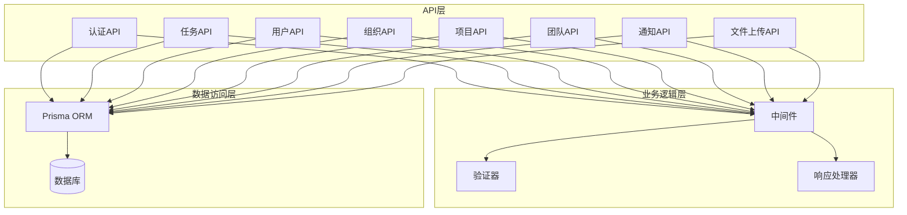
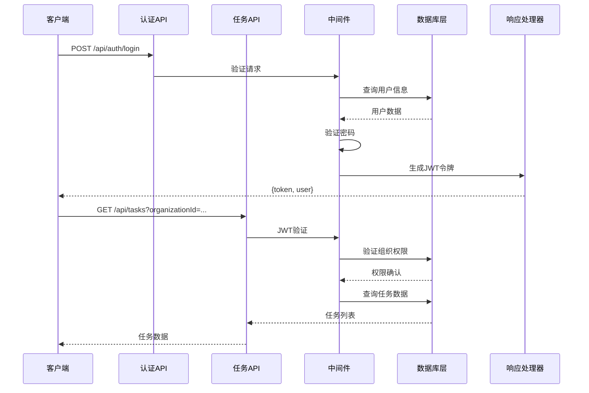
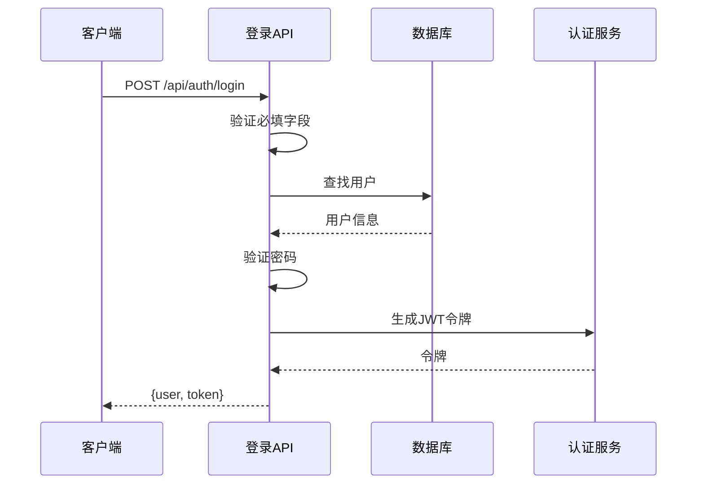
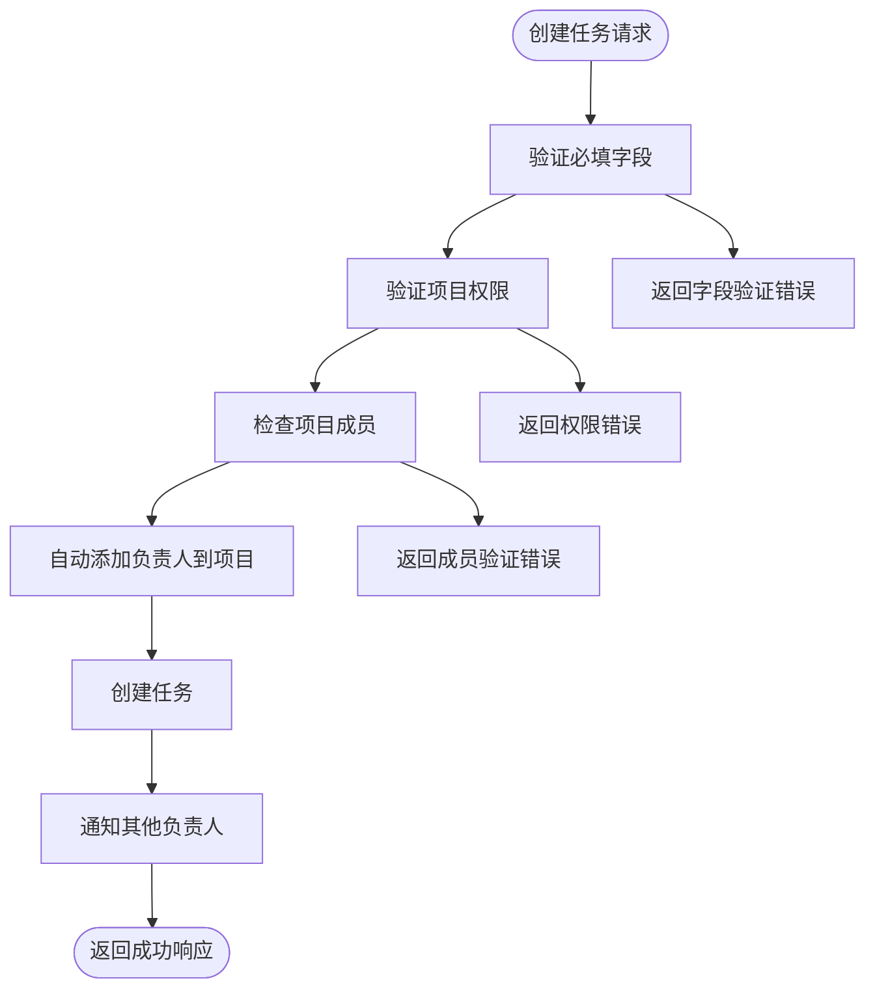
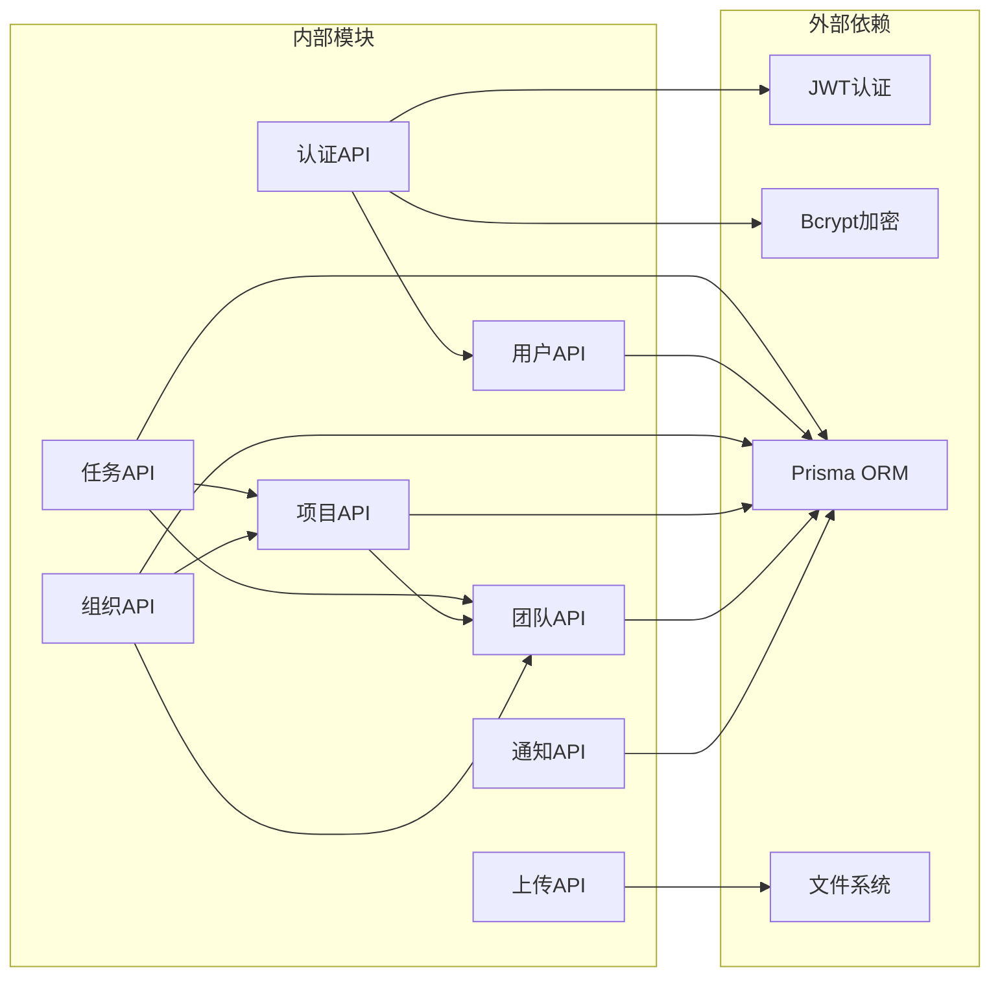

# API接口文档

<cite>
**本文档引用的文件**
- [app/api/auth/login/route.ts](file://app/api/auth/login/route.ts)
- [app/api/auth/register/route.ts](file://app/api/auth/register/route.ts)
- [app/api/tasks/route.ts](file://app/api/tasks/route.ts)
- [app/api/tasks/[id]/route.ts](file://app/api/tasks/[id]/route.ts)
- [app/api/users/me/route.ts](file://app/api/users/me/route.ts)
- [app/api/users/change-password/route.ts](file://app/api/users/change-password/route.ts)
- [app/api/users/search/route.ts](file://app/api/users/search/route.ts)
- [app/api/organizations/route.ts](file://app/api/organizations/route.ts)
- [app/api/organizations/[id]/route.ts](file://app/api/organizations/[id]/route.ts)
- [app/api/projects/route.ts](file://app/api/projects/route.ts)
- [app/api/projects/[id]/route.ts](file://app/api/projects/[id]/route.ts)
- [app/api/teams/route.ts](file://app/api/teams/route.ts)
- [app/api/teams/[id]/route.ts](file://app/api/teams/[id]/route.ts)
- [app/api/notifications/route.ts](file://app/api/notifications/route.ts)
- [app/api/upload/avatar/route.ts](file://app/api/upload/avatar/route.ts)
</cite>

## 目录
1. [简介](#简介)
2. [项目结构](#项目结构)
3. [核心组件](#核心组件)
4. [架构概览](#架构概览)
5. [详细组件分析](#详细组件分析)
6. [依赖分析](#依赖分析)
7. [性能考虑](#性能考虑)
8. [故障排除指南](#故障排除指南)
9. [结论](#结论)
10. [附录](#附录)

## 简介
本API接口文档面向日历任务管理系统，提供完整的RESTful接口规范，涵盖认证、任务、用户、组织、项目、团队、通知和文件上传等模块。文档详细说明每个端点的HTTP方法、URL模式、请求/响应结构、认证要求、参数验证规则、错误处理策略、状态码说明以及使用示例。

## 项目结构
系统采用Next.js App Router架构，API路由位于`app/api/`目录下，按功能模块划分：
- 认证模块：`/api/auth/login`、`/api/auth/register`
- 任务模块：`/api/tasks`、`/api/tasks/[id]`
- 用户模块：`/api/users/me`、`/api/users/change-password`、`/api/users/search`
- 组织模块：`/api/organizations`、`/api/organizations/[id]`
- 项目模块：`/api/projects`、`/api/projects/[id]`
- 团队模块：`/api/teams`、`/api/teams/[id]`
- 通知模块：`/api/notifications`
- 文件上传模块：`/api/upload/avatar`

**图表来源**
- [app/api/auth/login/route.ts](file://app/api/auth/login/route.ts#L1-L75)
- [app/api/tasks/route.ts](file://app/api/tasks/route.ts#L1-L497)
- [app/api/organizations/route.ts](file://app/api/organizations/route.ts#L1-L204)

## 核心组件
系统采用统一的响应格式和错误处理机制：

### 认证机制
- JWT令牌认证，所有受保护接口均需携带Authorization头
- 登录成功返回包含token和用户信息的响应
- 注册流程支持直接创建组织或加入现有组织

### 数据验证
- 必填字段验证
- 格式验证（邮箱、用户名、密码强度）
- 业务规则验证（权限检查、数据完整性）

### 错误处理
- 统一的错误响应格式
- 详细的错误信息和状态码
- 区分客户端错误（4xx）和服务端错误（5xx）

**章节来源**
- [app/api/auth/login/route.ts](file://app/api/auth/login/route.ts#L12-L75)
- [app/api/auth/register/route.ts](file://app/api/auth/register/route.ts#L26-L349)
- [app/api/tasks/route.ts](file://app/api/tasks/route.ts#L18-L273)

## 架构概览

**图表来源**
- [app/api/auth/login/route.ts](file://app/api/auth/login/route.ts#L13-L74)
- [app/api/tasks/route.ts](file://app/api/tasks/route.ts#L19-L273)

## 详细组件分析

### 认证API

#### 登录接口
- **HTTP方法**: POST
- **URL**: `/api/auth/login`
- **认证要求**: 无需认证
- **请求体参数**:
  - username: 字符串，必填
  - password: 字符串，必填
- **响应**:
  - 成功: 返回用户信息和JWT令牌
  - 失败: 返回错误信息和状态码

**图表来源**
- [app/api/auth/login/route.ts](file://app/api/auth/login/route.ts#L13-L74)

**章节来源**
- [app/api/auth/login/route.ts](file://app/api/auth/login/route.ts#L12-L75)

#### 注册接口
- **HTTP方法**: POST
- **URL**: `/api/auth/register`
- **认证要求**: 无需认证
- **请求体参数**:
  - username: 字符串，3-20字符，必填
  - password: 字符串，必填
  - name: 字符串，必填
  - email: 邮箱格式，必填
  - role: 职业，必填
  - organization: 组织名称或加入选项，必填
  - organizationId: 组织ID（可选）
  - inviteCode: 邀请码（可选）
- **响应**:
  - 成功: 返回用户信息和JWT令牌
  - 失败: 返回错误信息和状态码

**章节来源**
- [app/api/auth/register/route.ts](file://app/api/auth/register/route.ts#L26-L349)

### 任务API

#### 获取任务列表
- **HTTP方法**: GET
- **URL**: `/api/tasks`
- **认证要求**: 需要JWT令牌
- **查询参数**:
  - userId: 用户ID（可选）
  - projectId: 项目ID（可选）
  - teamId: 团队ID（可选）
  - startDate: 开始日期（可选）
  - endDate: 结束日期（可选）
  - organizationId: 组织ID（可选）
- **权限控制**:
  - 必须是目标组织成员
  - 根据过滤条件限制可见范围
  - 个人事务项目仅显示创建者或负责人任务

#### 创建任务
- **HTTP方法**: POST
- **URL**: `/api/tasks`
- **认证要求**: 需要JWT令牌
- **请求体参数**:
  - title: 任务标题，必填
  - description: 任务描述（可选）
  - startDate: 开始日期，必填
  - endDate: 结束日期，必填
  - startTime: 开始时间（可选）
  - endTime: 结束时间（可选）
  - type: 任务类型，必填（daily/meeting/vacation）
  - color: 颜色（可选，仅daily类型）
  - progress: 进度百分比（0-100）
  - projectId: 项目ID，必填
  - teamId: 团队ID（可选）
  - userId: 负责人ID（可选，支持数组）
- **权限控制**:
  - 必须是目标项目成员
  - 自动将负责人添加到项目和团队中
  - 通知其他负责人任务分配

**图表来源**
- [app/api/tasks/route.ts](file://app/api/tasks/route.ts#L276-L496)

**章节来源**
- [app/api/tasks/route.ts](file://app/api/tasks/route.ts#L18-L273)
- [app/api/tasks/[id]/route.ts](file://app/api/tasks/[id]/route.ts#L17-L490)

#### 获取单个任务
- **HTTP方法**: GET
- **URL**: `/api/tasks/[id]`
- **认证要求**: 需要JWT令牌
- **权限控制**:
  - 任务创建者或负责人
  - 同一团队/项目成员
  - 超级管理员

#### 更新任务
- **HTTP方法**: PUT
- **URL**: `/api/tasks/[id]`
- **认证要求**: 需要JWT令牌
- **权限控制**:
  - 任务创建者
  - 项目/团队成员（根据taskPermission设置）
  - 超级管理员

#### 删除任务
- **HTTP方法**: DELETE
- **URL**: `/api/tasks/[id]`
- **认证要求**: 需要JWT令牌
- **权限控制**:
  - 任务负责人
  - 通知相关人员任务删除

**章节来源**
- [app/api/tasks/[id]/route.ts](file://app/api/tasks/[id]/route.ts#L10-L490)

### 用户API

#### 获取当前用户信息
- **HTTP方法**: GET
- **URL**: `/api/users/me`
- **认证要求**: 需要JWT令牌
- **响应**: 当前用户详细信息

#### 更新当前用户信息
- **HTTP方法**: PUT
- **URL**: `/api/users/me`
- **认证要求**: 需要JWT令牌
- **请求体参数**:
  - name: 姓名（可选）
  - email: 邮箱（可选）
  - avatar: 头像URL（可选）
  - gender: 性别（可选）
  - role: 职业（可选）
  - defaultTeamId: 默认团队ID（可选）

#### 修改密码
- **HTTP方法**: PUT
- **URL**: `/api/users/change-password`
- **认证要求**: 需要JWT令牌
- **请求体参数**:
  - oldPassword: 原密码，必填
  - newPassword: 新密码，必填（至少6位且与原密码不同）
- **权限控制**:
  - 必须提供正确的原密码

#### 搜索用户
- **HTTP方法**: GET
- **URL**: `/api/users/search`
- **认证要求**: 需要JWT令牌
- **查询参数**:
  - q: 搜索关键词，必填
  - organizationId: 组织ID（可选）
- **功能**: 支持按用户名、姓名、邮箱搜索，可过滤已在组织中的用户

**章节来源**
- [app/api/users/me/route.ts](file://app/api/users/me/route.ts#L16-L115)
- [app/api/users/change-password/route.ts](file://app/api/users/change-password/route.ts#L11-L74)
- [app/api/users/search/route.ts](file://app/api/users/search/route.ts#L6-L57)

### 组织API

#### 获取组织列表
- **HTTP方法**: GET
- **URL**: `/api/organizations`
- **认证要求**: 需要JWT令牌（搜索参数search除外）
- **查询参数**:
  - search: 搜索关键词（公开搜索，无需认证）
  - organizationId: 组织ID（可选）
- **功能**: 获取用户所属的所有组织及其统计信息

#### 创建组织
- **HTTP方法**: POST
- **URL**: `/api/organizations`
- **认证要求**: 需要JWT令牌
- **请求体参数**:
  - name: 组织名称，必填
  - description: 描述（可选）
- **功能**: 创建新组织并自动创建个人项目

#### 获取单个组织详情
- **HTTP方法**: GET
- **URL**: `/api/organizations/[id]`
- **认证要求**: 需要JWT令牌
- **权限控制**: 组织成员

#### 更新组织
- **HTTP方法**: PUT
- **URL**: `/api/organizations/[id]`
- **认证要求**: 需要JWT令牌
- **权限控制**: 组织所有者或管理员
- **请求体参数**:
  - name: 组织名称（可选）
  - description: 描述（可选）
  - joinRequiresApproval: 是否需要审批（可选）

#### 删除组织
- **HTTP方法**: DELETE
- **URL**: `/api/organizations/[id]`
- **认证要求**: 需要JWT令牌
- **权限控制**: 组织所有者
- **限制**: 不能删除当前所在组织

**章节来源**
- [app/api/organizations/route.ts](file://app/api/organizations/route.ts#L12-L204)
- [app/api/organizations/[id]/route.ts](file://app/api/organizations/[id]/route.ts#L6-L212)

### 项目API

#### 获取项目列表
- **HTTP方法**: GET
- **URL**: `/api/projects`
- **认证要求**: 需要JWT令牌
- **查询参数**:
  - organizationId: 组织ID（可选）
- **权限控制**: 组织成员

#### 创建项目
- **HTTP方法**: POST
- **URL**: `/api/projects`
- **认证要求**: 需要JWT令牌
- **请求体参数**:
  - name: 项目名称，必填
  - color: 颜色，必填
  - description: 描述（可选）
  - memberIds: 成员ID数组（可选）
  - creatorId: 创建者ID，必填
  - taskPermission: 任务权限（可选，默认ALL_MEMBERS）
- **权限控制**: 项目创建者或超级管理员

#### 获取单个项目
- **HTTP方法**: GET
- **URL**: `/api/projects/[id]`
- **认证要求**: 需要JWT令牌
- **权限控制**: 项目成员

#### 更新项目
- **HTTP方法**: PUT
- **URL**: `/api/projects/[id]`
- **认证要求**: 需要JWT令牌
- **权限控制**: 项目创建者或超级管理员
- **请求体参数**:
  - name: 项目名称（可选）
  - description: 描述（可选）
  - color: 颜色（可选）
  - memberIds: 成员ID数组（可选）
  - creatorId: 创建者ID（可选）
  - taskPermission: 任务权限（可选）

#### 删除项目
- **HTTP方法**: DELETE
- **URL**: `/api/projects/[id]`
- **认证要求**: 需要JWT令牌
- **权限控制**: 项目创建者、组织创建者或超级管理员
- **限制**: 项目下必须无任务

**章节来源**
- [app/api/projects/route.ts](file://app/api/projects/route.ts#L6-L231)
- [app/api/projects/[id]/route.ts](file://app/api/projects/[id]/route.ts#L13-L283)

### 团队API

#### 获取团队列表
- **HTTP方法**: GET
- **URL**: `/api/teams`
- **认证要求**: 需要JWT令牌
- **查询参数**:
  - organizationId: 组织ID（可选）
- **权限控制**: 组织成员

#### 创建团队
- **HTTP方法**: POST
- **URL**: `/api/teams`
- **认证要求**: 需要JWT令牌
- **请求体参数**:
  - name: 团队名称，必填
  - color: 颜色，必填
  - description: 描述（可选）
  - memberIds: 成员ID数组（可选）
  - creatorId: 创建者ID，必填
  - taskPermission: 任务权限（可选，默认ALL_MEMBERS）
- **权限控制**: 团队创建者或超级管理员

#### 更新团队
- **HTTP方法**: PUT
- **URL**: `/api/teams/[id]`
- **认证要求**: 需要JWT令牌
- **权限控制**: 团队创建者或超级管理员
- **请求体参数**:
  - name: 团队名称（可选）
  - description: 描述（可选）
  - color: 颜色（可选）
  - memberIds: 成员ID数组（可选）
  - creatorId: 创建者ID（可选）
  - taskPermission: 任务权限（可选）

#### 删除团队
- **HTTP方法**: DELETE
- **URL**: `/api/teams/[id]`
- **认证要求**: 需要JWT令牌
- **权限控制**: 团队创建者、组织创建者或超级管理员

**章节来源**
- [app/api/teams/route.ts](file://app/api/teams/route.ts#L6-L234)
- [app/api/teams/[id]/route.ts](file://app/api/teams/[id]/route.ts#L13-L221)

### 通知API

#### 获取通知列表
- **HTTP方法**: GET
- **URL**: `/api/notifications`
- **认证要求**: 需要JWT令牌
- **查询参数**:
  - unreadOnly: 仅未读（true/false），可选
- **功能**: 获取最近30天的通知，最多100条

#### 获取未读通知数量
- **HTTP方法**: HEAD
- **URL**: `/api/notifications/unread-count`
- **认证要求**: 需要JWT令牌

**章节来源**
- [app/api/notifications/route.ts](file://app/api/notifications/route.ts#L6-L103)

### 文件上传API

#### 上传头像
- **HTTP方法**: POST
- **URL**: `/api/upload/avatar`
- **认证要求**: 需要JWT令牌
- **请求体**: multipart/form-data
  - avatar: 图片文件，必填
- **文件限制**:
  - 支持格式: JPG, PNG, GIF, WebP
  - 最大大小: 5MB
- **响应**: 返回文件URL和元数据

**章节来源**
- [app/api/upload/avatar/route.ts](file://app/api/upload/avatar/route.ts#L15-L74)

## 依赖分析

**图表来源**
- [app/api/auth/login/route.ts](file://app/api/auth/login/route.ts#L3-L4)
- [app/api/tasks/route.ts](file://app/api/tasks/route.ts#L2-L3)
- [app/api/upload/avatar/route.ts](file://app/api/upload/avatar/route.ts#L2-L4)

### 关键依赖关系
- **认证依赖**: 所有受保护API依赖JWT中间件
- **数据访问**: 所有API通过Prisma ORM访问数据库
- **权限控制**: 基于组织、项目、团队层级的权限验证
- **文件存储**: 头像上传使用本地文件系统存储

**章节来源**
- [app/api/tasks/route.ts](file://app/api/tasks/route.ts#L3-L4)
- [app/api/auth/register/route.ts](file://app/api/auth/register/route.ts#L3-L4)

## 性能考虑
1. **数据库查询优化**
   - 使用适当的索引和连接查询
   - 避免N+1查询问题
   - 合理使用include关联查询

2. **缓存策略**
   - 对频繁访问的静态数据进行缓存
   - 实现适当的缓存失效机制

3. **并发处理**
   - 使用事务保证数据一致性
   - 异步处理耗时操作（如积分计算、通知发送）

4. **API响应优化**
   - 实现分页和限制返回数据量
   - 提供必要的查询参数优化

## 故障排除指南

### 常见错误及解决方案

#### 认证相关错误
- **401 未授权**: 检查JWT令牌有效性
- **403 禁止访问**: 验证用户权限和组织成员身份
- **404 用户不存在**: 确认用户ID正确性

#### 数据验证错误
- **400 参数错误**: 检查请求参数格式和必填字段
- **409 冲突**: 处理重复数据（用户名、项目名等）
- **422 验证失败**: 修正数据格式和业务规则

#### 数据库相关错误
- **500 服务器错误**: 检查数据库连接和查询语句
- **事务回滚**: 确认事务边界和异常处理

**章节来源**
- [app/api/tasks/route.ts](file://app/api/tasks/route.ts#L47-L63)
- [app/api/auth/register/route.ts](file://app/api/auth/register/route.ts#L82-L84)

## 结论
本API接口文档提供了日历任务管理系统的完整接口规范，涵盖了从基础认证到复杂业务场景的全部RESTful端点。系统采用清晰的模块化架构，完善的权限控制机制，以及一致的响应格式，为客户端集成提供了坚实的基础。

## 附录

### API版本管理
- 当前版本: v1.0
- 版本控制: 通过URL路径版本化（/api/v1/...）
- 向后兼容: 保持现有接口不变，新增功能通过新版本提供

### 状态码说明
- **200 OK**: 请求成功
- **201 Created**: 资源创建成功
- **400 Bad Request**: 请求参数错误
- **401 Unauthorized**: 未授权访问
- **403 Forbidden**: 权限不足
- **404 Not Found**: 资源不存在
- **409 Conflict**: 资源冲突
- **500 Internal Server Error**: 服务器错误

### 客户端实现建议
1. **错误处理**: 实现统一的错误处理和重试机制
2. **缓存策略**: 缓存静态数据和用户信息
3. **并发控制**: 避免重复请求和竞态条件
4. **安全考虑**: 保护JWT令牌和敏感数据