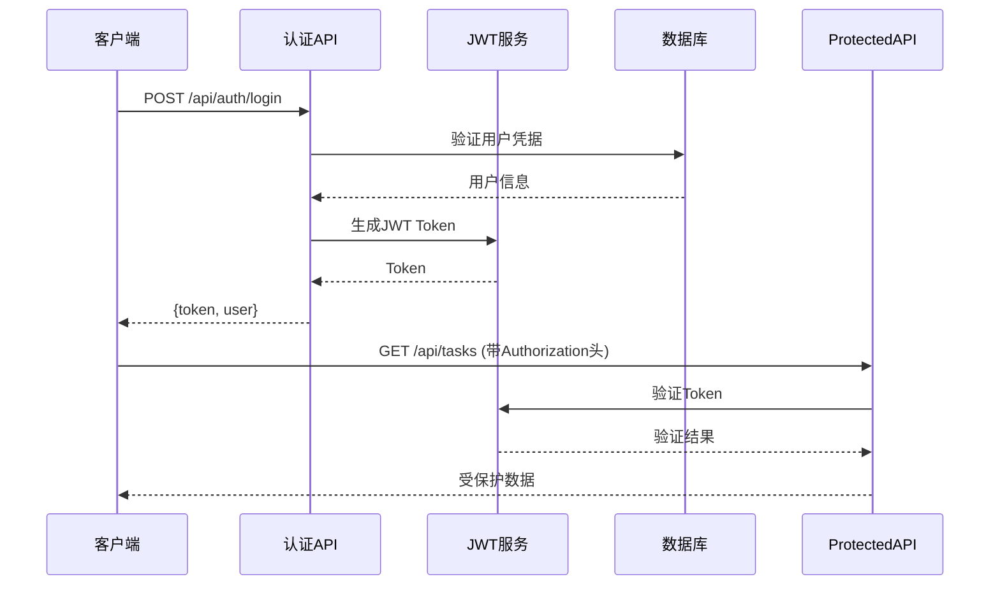

# API接口文档

<cite>
**本文档引用的文件**
- [API_DOCUMENTATION.md](file://API_DOCUMENTATION.md)
- [openapi.yaml](file://openapi.yaml)
- [API_REQUEST_REFACTOR.md](file://API_REQUEST_REFACTOR.md)
- [API_SECURITY_IMPROVEMENTS.md](file://API_SECURITY_IMPROVEMENTS.md)
- [app/api/auth/login/route.ts](file://app/api/auth/login/route.ts)
- [app/api/auth/register/route.ts](file://app/api/auth/register/route.ts)
- [app/api/tasks/route.ts](file://app/api/tasks/route.ts)
- [app/api/users/me/route.ts](file://app/api/users/me/route.ts)
- [app/api/organizations/route.ts](file://app/api/organizations/route.ts)
- [app/api/projects/route.ts](file://app/api/projects/route.ts)
- [app/api/teams/route.ts](file://app/api/teams/route.ts)
- [app/api/notifications/route.ts](file://app/api/notifications/route.ts)
- [lib/auth.ts](file://lib/auth.ts)
- [lib/validation.ts](file://lib/validation.ts)
- [lib/api-response.ts](file://lib/api-response.ts)
- [lib/middleware.ts](file://lib/middleware.ts)
</cite>

## 更新摘要
**所做更改**
- 基于完整的OpenAPI规范重新构建了API文档系统
- 新增了详细的RESTful API规范和统一的响应格式
- 完善了认证、授权、数据验证和错误处理机制
- 增强了API安全性、性能优化和客户端集成指南
- 更新了完整的API端点列表和使用示例

## 目录
1. [简介](#简介)
2. [API规范概述](#api规范概述)
3. [认证与安全](#认证与安全)
4. [统一响应格式](#统一响应格式)
5. [认证API](#认证api)
6. [任务管理API](#任务管理api)
7. [用户管理API](#用户管理api)
8. [组织管理API](#组织管理api)
9. [项目管理API](#项目管理api)
10. [团队协作API](#团队协作api)
11. [通知系统API](#通知系统api)
12. [文件上传API](#文件上传api)
13. [API客户端集成](#api客户端集成)
14. [性能优化建议](#性能优化建议)
15. [错误处理指南](#错误处理指南)
16. [API版本管理](#api版本管理)
17. [最佳实践](#最佳实践)

## 简介

本API接口文档基于完整的OpenAPI规范，为日历任务管理系统提供全面的RESTful接口文档。系统采用统一的响应格式、严格的认证授权机制和完善的错误处理策略，涵盖认证、任务管理、用户管理、组织管理、项目管理、团队协作、通知系统和文件上传等模块。

### 基础信息

- **基础URL**: `http://localhost:3000/api`
- **响应格式**: JSON
- **时间格式**: ISO 8601 (例如: `2024-01-15T09:00:00.000Z`)
- **OpenAPI规范**: 详见根目录下的 `openapi.yaml` 文件
- **认证方式**: Bearer JWT Token

## API规范概述

### OpenAPI规范

系统采用OpenAPI 3.0.3标准，提供完整的API文档规范，支持Swagger Editor导入和交互式测试。

### API标签分类

- **认证**: 登录、注册等无需认证的接口
- **用户**: 用户资料、搜索、积分与个人设置
- **组织**: 组织、成员、邀请、加入申请
- **项目**: 项目协作接口
- **团队**: 团队协作接口
- **任务**: 任务 CRUD 与负责人协作
- **通知**: 站内信与未读数
- **上传**: 静态资源上传
- **管理后台**: Panorama 管理可视化接口

### 安全配置

- **默认安全**: 所有接口默认需要 Bearer JWT
- **例外情况**: 明确标注无需认证的接口
- **数据一致性**: 使用Prisma ORM参数化查询防止SQL注入

## 认证与安全

### JWT认证机制

系统使用JSON Web Token进行无状态认证，所有受保护接口均需携带Authorization头。



**图表来源**
- [app/api/auth/login/route.ts](file://app/api/auth/login/route.ts#L12-L75)
- [lib/auth.ts](file://lib/auth.ts#L36-L58)

### 密码安全

- **密码哈希**: 使用bcrypt (salt rounds: 10) 加密存储
- **密码强度**: 至少6字符，必须包含字母和数字
- **密码长度**: 最多100字符
- **用户名处理**: 统一转为小写存储

### 输入验证

系统提供全面的输入验证机制：

- **用户名格式**: 3-20字符，字母数字下划线，必须以字母或数字开头
- **邮箱格式**: 标准邮箱格式验证
- **日期格式**: 验证日期字符串有效性
- **时间格式**: HH:MM 格式验证
- **颜色格式**: 十六进制颜色验证
- **字符串清理**: XSS防护和长度限制

**章节来源**
- [lib/auth.ts](file://lib/auth.ts#L13-L29)
- [lib/validation.ts](file://lib/validation.ts#L19-L58)

## 统一响应格式

### 成功响应

```json
{
  "success": true,
  "data": {},
  "message": "操作成功"
}
```

### 错误响应

```json
{
  "success": false,
  "error": "错误信息"
}
```

### HTTP状态码

- **200**: 成功
- **201**: 创建成功
- **400**: 验证错误
- **401**: 未授权（未登录或token无效）
- **403**: 禁止访问（无权限）
- **404**: 资源未找到
- **500**: 服务器错误

## 认证API

### 用户登录

- **HTTP方法**: POST
- **URL**: `/api/auth/login`
- **认证要求**: 无需认证
- **请求体**:

```json
{
  "username": "string",
  "password": "string"
}
```

- **响应**:

```json
{
  "success": true,
  "data": {
    "user": {
      "id": "string",
      "username": "string",
      "name": "string",
      "email": "string",
      "avatar": "string",
      "gender": "string",
      "role": "string",
      "isAdmin": "boolean",
      "currentOrganizationId": "string",
      "defaultTeamId": "string",
      "points": "number"
    },
    "token": "string"
  }
}
```

### 用户注册

- **HTTP方法**: POST
- **URL**: `/api/auth/register`
- **认证要求**: 无需认证
- **请求体**:

```json
{
  "username": "string",
  "password": "string",
  "name": "string",
  "email": "string",
  "role": "string",
  "organization": "string",
  "organizationId": "string",
  "inviteCode": "string",
  "avatar": "string"
}
```

- **响应**: 与登录接口相同的结构

**章节来源**
- [app/api/auth/login/route.ts](file://app/api/auth/login/route.ts#L12-L75)
- [app/api/auth/register/route.ts](file://app/api/auth/register/route.ts#L26-L349)

## 任务管理API

### 获取任务列表

- **HTTP方法**: GET
- **URL**: `/api/tasks`
- **认证要求**: 需要JWT令牌
- **查询参数**:
  - `userId` (可选): 按用户 ID 筛选
  - `projectId` (可选): 按项目 ID 筛选
  - `teamId` (可选): 按团队 ID 筛选
  - `startDate` (可选): 开始日期 (YYYY-MM-DD)
  - `endDate` (可选): 结束日期 (YYYY-MM-DD)
  - `organizationId` (可选): 组织ID

### 创建任务

- **HTTP方法**: POST
- **URL**: `/api/tasks`
- **认证要求**: 需要JWT令牌
- **请求体**:

```json
{
  "title": "string",
  "description": "string",
  "startDate": "string",
  "endDate": "string",
  "startTime": "string",
  "endTime": "string",
  "type": "daily|meeting|vacation",
  "color": "string",
  "progress": "number",
  "projectId": "string",
  "teamId": "string",
  "userId": "string|array"
}
```

### 获取单个任务

- **HTTP方法**: GET
- **URL**: `/api/tasks/{id}`
- **认证要求**: 需要JWT令牌

### 更新任务

- **HTTP方法**: PUT
- **URL**: `/api/tasks/{id}`
- **认证要求**: 需要JWT令牌
- **请求体**: 包含要更新的字段

### 删除任务

- **HTTP方法**: DELETE
- **URL**: `/api/tasks/{id}`
- **认证要求**: 需要JWT令牌

**权限控制规则**:
- 只能查看自己的任务
- 可以查看同一团队成员的任务
- 项目和团队过滤需要成员验证
- 个人事务项目仅显示创建者或负责人任务

**章节来源**
- [app/api/tasks/route.ts](file://app/api/tasks/route.ts#L18-L497)

## 用户管理API

### 获取用户列表

- **HTTP方法**: GET
- **URL**: `/api/users`
- **认证要求**: 需要JWT令牌

### 创建用户

- **HTTP方法**: POST
- **URL**: `/api/users`
- **认证要求**: 需要JWT令牌
- **请求体**:

```json
{
  "name": "string",
  "email": "string",
  "avatar": "string"
}
```

### 获取当前用户信息

- **HTTP方法**: GET
- **URL**: `/api/users/me`
- **认证要求**: 需要JWT令牌

### 更新当前用户信息

- **HTTP方法**: PUT
- **URL**: `/api/users/me`
- **认证要求**: 需要JWT令牌
- **请求体**:

```json
{
  "name": "string",
  "email": "string",
  "avatar": "string",
  "gender": "string",
  "role": "string",
  "defaultTeamId": "string"
}
```

### 修改密码

- **HTTP方法**: PUT
- **URL**: `/api/users/change-password`
- **认证要求**: 需要JWT令牌
- **请求体**:

```json
{
  "oldPassword": "string",
  "newPassword": "string"
}
```

### 搜索用户

- **HTTP方法**: GET
- **URL**: `/api/users/search`
- **认证要求**: 需要JWT令牌
- **查询参数**:
  - `q`: 搜索关键词 (必填)
  - `organizationId`: 组织ID (可选)

### 获取积分

- **HTTP方法**: GET
- **URL**: `/api/users/points`
- **认证要求**: 需要JWT令牌

### 增加积分

- **HTTP方法**: POST
- **URL**: `/api/users/points`
- **认证要求**: 需要JWT令牌
- **请求体**:

```json
{
  "points": "integer",
  "reason": "string"
}
```

**章节来源**
- [app/api/users/me/route.ts](file://app/api/users/me/route.ts#L16-L115)

## 组织管理API

### 获取组织列表

- **HTTP方法**: GET
- **URL**: `/api/organizations`
- **认证要求**: 需要JWT令牌 (搜索参数search除外)
- **查询参数**:
  - `search`: 搜索关键词 (公开搜索，无需认证)
  - `organizationId`: 组织ID (可选)

### 创建组织

- **HTTP方法**: POST
- **URL**: `/api/organizations`
- **认证要求**: 需要JWT令牌
- **请求体**:

```json
{
  "name": "string",
  "description": "string"
}
```

### 获取组织详情

- **HTTP方法**: GET
- **URL**: `/api/organizations/{id}`
- **认证要求**: 需要JWT令牌

### 更新组织

- **HTTP方法**: PUT
- **URL**: `/api/organizations/{id}`
- **认证要求**: 需要JWT令牌
- **请求体**:

```json
{
  "name": "string",
  "description": "string"
}
```

### 删除组织

- **HTTP方法**: DELETE
- **URL**: `/api/organizations/{id}`
- **认证要求**: 需要JWT令牌

### 切换当前组织

- **HTTP方法**: POST
- **URL**: `/api/organizations/switch`
- **认证要求**: 需要JWT令牌
- **请求体**:

```json
{
  "organizationId": "string"
}
```

### 获取加入申请

- **HTTP方法**: GET
- **URL**: `/api/organizations/join-requests`
- **认证要求**: 需要JWT令牌
- **查询参数**:
  - `organizationId`: 组织ID (可选)
  - `asApplicant`: 是否作为申请人 (可选)

### 提交加入申请

- **HTTP方法**: POST
- **URL**: `/api/organizations/join-requests`
- **认证要求**: 需要JWT令牌
- **请求体**:

```json
{
  "organizationId": "string",
  "message": "string"
}
```

### 审批加入申请

- **HTTP方法**: POST
- **URL**: `/api/organizations/join-requests/{id}/approve`
- **认证要求**: 需要JWT令牌

### 拒绝加入申请

- **HTTP方法**: POST
- **URL**: `/api/organizations/join-requests/{id}/reject`
- **认证要求**: 需要JWT令牌
- **请求体**:

```json
{
  "reason": "string"
}
```

### 接受组织邀请

- **HTTP方法**: POST
- **URL**: `/api/organizations/invites/{id}/accept`
- **认证要求**: 需要JWT令牌

### 拒绝组织邀请

- **HTTP方法**: POST
- **URL**: `/api/organizations/invites/{id}/reject`
- **认证要求**: 需要JWT令牌

### 获取组织成员

- **HTTP方法**: GET
- **URL**: `/api/organizations/{id}/members`
- **认证要求**: 需要JWT令牌

### 添加或自助加入成员

- **HTTP方法**: POST
- **URL**: `/api/organizations/{id}/members`
- **认证要求**: 需要JWT令牌
- **请求体**:

```json
{
  "userId": "string",
  "role": "OWNER|ADMIN|MEMBER"
}
```

### 移除或退出组织

- **HTTP方法**: DELETE
- **URL**: `/api/organizations/{id}/members`
- **认证要求**: 需要JWT令牌
- **查询参数**:
  - `userId`: 用户ID (必填)

### 获取组织项目

- **HTTP方法**: GET
- **URL**: `/api/organizations/{id}/projects`
- **认证要求**: 需要JWT令牌

### 获取组织团队

- **HTTP方法**: GET
- **URL**: `/api/organizations/{id}/teams`
- **认证要求**: 需要JWT令牌

### 邀请用户加入组织

- **HTTP方法**: POST
- **URL**: `/api/organizations/{id}/invite`
- **认证要求**: 需要JWT令牌
- **请求体**:

```json
{
  "userId": "string"
}
```

### 获取个人邀请码

- **HTTP方法**: GET
- **URL**: `/api/organizations/{id}/invite-code`
- **认证要求**: 需要JWT令牌

### 验证邀请码

- **HTTP方法**: POST
- **URL**: `/api/organizations/{id}/invite-code/validate`
- **认证要求**: 需要JWT令牌
- **请求体**:

```json
{
  "inviteCode": "string"
}
```

**章节来源**
- [app/api/organizations/route.ts](file://app/api/organizations/route.ts#L12-L204)

## 项目管理API

### 获取项目列表

- **HTTP方法**: GET
- **URL**: `/api/projects`
- **认证要求**: 需要JWT令牌
- **查询参数**:
  - `organizationId`: 组织ID (可选)

### 创建项目

- **HTTP方法**: POST
- **URL**: `/api/projects`
- **认证要求**: 需要JWT令牌
- **请求体**:

```json
{
  "name": "string",
  "color": "string",
  "description": "string",
  "memberIds": "array",
  "creatorId": "string",
  "taskPermission": "ALL_MEMBERS|CREATOR_ONLY"
}
```

### 获取项目详情

- **HTTP方法**: GET
- **URL**: `/api/projects/{id}`
- **认证要求**: 需要JWT令牌

### 更新项目

- **HTTP方法**: PUT
- **URL**: `/api/projects/{id}`
- **认证要求**: 需要JWT令牌
- **请求体**:

```json
{
  "name": "string",
  "description": "string",
  "color": "string",
  "memberIds": "array",
  "creatorId": "string",
  "taskPermission": "ALL_MEMBERS|CREATOR_ONLY"
}
```

### 删除项目

- **HTTP方法**: DELETE
- **URL**: `/api/projects/{id}`
- **认证要求**: 需要JWT令牌

**权限控制规则**:
- 项目创建者或超级管理员
- 项目下必须无任务

**章节来源**
- [app/api/projects/route.ts](file://app/api/projects/route.ts#L6-L231)

## 团队协作API

### 获取团队列表

- **HTTP方法**: GET
- **URL**: `/api/teams`
- **认证要求**: 需要JWT令牌
- **查询参数**:
  - `organizationId`: 组织ID (可选)

### 创建团队

- **HTTP方法**: POST
- **URL**: `/api/teams`
- **认证要求**: 需要JWT令牌
- **请求体**:

```json
{
  "name": "string",
  "color": "string",
  "description": "string",
  "memberIds": "array",
  "creatorId": "string",
  "taskPermission": "ALL_MEMBERS|CREATOR_ONLY"
}
```

### 获取团队详情

- **HTTP方法**: GET
- **URL**: `/api/teams/{id}`
- **认证要求**: 需要JWT令牌

### 更新团队

- **HTTP方法**: PUT
- **URL**: `/api/teams/{id}`
- **认证要求**: 需要JWT令牌
- **请求体**:

```json
{
  "name": "string",
  "description": "string",
  "color": "string",
  "memberIds": "array",
  "creatorId": "string",
  "taskPermission": "ALL_MEMBERS|CREATOR_ONLY"
}
```

### 删除团队

- **HTTP方法**: DELETE
- **URL**: `/api/teams/{id}`
- **认证要求**: 需要JWT令牌

**权限控制规则**:
- 团队创建者或超级管理员

**章节来源**
- [app/api/teams/route.ts](file://app/api/teams/route.ts#L6-L234)

## 通知系统API

### 获取通知列表

- **HTTP方法**: GET
- **URL**: `/api/notifications`
- **认证要求**: 需要JWT令牌
- **查询参数**:
  - `unreadOnly`: 仅未读 (true/false)，可选

### 获取未读通知数量

- **HTTP方法**: HEAD
- **URL**: `/api/notifications/unread-count`
- **认证要求**: 需要JWT令牌

### 标记通知为已读

- **HTTP方法**: POST
- **URL**: `/api/notifications/{id}/read`
- **认证要求**: 需要JWT令牌

### 清空通知

- **HTTP方法**: POST
- **URL**: `/api/notifications/clear`
- **认证要求**: 需要JWT令牌

**功能特性**:
- 获取最近30天的通知，最多100条
- 支持筛选未读通知
- 自动附加加入申请的当前状态

**章节来源**
- [app/api/notifications/route.ts](file://app/api/notifications/route.ts#L6-L103)

## 文件上传API

### 上传头像

- **HTTP方法**: POST
- **URL**: `/api/upload/avatar`
- **认证要求**: 需要JWT令牌
- **请求类型**: multipart/form-data
- **表单字段**:
  - `avatar`: 图片文件 (必填)
- **文件限制**:
  - 支持格式: JPG, PNG, GIF, WebP
  - 最大大小: 5MB
- **响应**:

```json
{
  "success": true,
  "data": {
    "url": "string",
    "size": "object",
    "mimeType": "string"
  }
}
```

**章节来源**
- [app/api/upload/avatar/route.ts](file://app/api/upload/avatar/route.ts#L15-L74)

## API客户端集成

### 请求重构指南

系统已完成API请求层的重构，使用axios统一封装，提供更加工程化和易维护的请求方式。

### 核心特性

- ✅ **自动Token管理** - 请求拦截器自动添加Authorization header
- ✅ **统一错误处理** - 响应拦截器统一处理各种HTTP错误
- ✅ **类型安全** - 完整的TypeScript类型支持
- ✅ **请求超时** - 30秒超时配置
- ✅ **401自动跳转** - token过期自动跳转登录页
- ✅ **文件上传/下载** - 支持文件操作
- ✅ **进度监听** - 上传进度回调

### 使用方法

#### 基础用法

```typescript
import { get, post, put, del } from '@/lib/request'

// GET 请求
const users = await get<User[]>('/users')
const user = await get<User>('/users/123')
const filtered = await get<User[]>('/users', { role: 'admin' })

// POST 请求
const newUser = await post<User>('/users', {
  name: 'John',
  email: 'john@example.com'
})

// PUT 请求
const updatedUser = await put<User>('/users/123', {
  name: 'Jane'
})

// DELETE 请求
await del('/users/123')
```

#### 使用API模块

```typescript
import { organizationAPI } from '@/lib/api/organization'

// 获取组织列表
const orgs = await organizationAPI.getAll()

// 搜索组织
const searchResults = await organizationAPI.getAll('keyword')

// 创建组织
const newOrg = await organizationAPI.create({
  name: 'My Org',
  description: 'Org description'
})

// 获取成员
const members = await organizationAPI.getMembers(orgId)

// 获取团队
const teams = await organizationAPI.getTeams(orgId)

// 获取项目
const projects = await organizationAPI.getProjects(orgId)
```

**章节来源**
- [API_REQUEST_REFACTOR.md](file://API_REQUEST_REFACTOR.md#L1-L327)

## 性能优化建议

### 数据库查询优化

1. **索引优化**
   - 为常用查询字段建立适当索引
   - 使用复合索引优化多条件查询

2. **查询优化**
   - 避免N+1查询问题
   - 合理使用include关联查询
   - 实现分页和限制返回数据量

3. **缓存策略**
   - 对频繁访问的静态数据进行缓存
   - 实现适当的缓存失效机制

### 并发处理

1. **事务管理**
   - 使用事务保证数据一致性
   - 异步处理耗时操作（如积分计算、通知发送）

2. **批量操作**
   - 支持批量创建和更新操作
   - 使用Promise.all提升并发性能

### API响应优化

1. **数据压缩**
   - 启用Gzip压缩
   - 优化JSON序列化

2. **CDN加速**
   - 静态资源使用CDN
   - 图片资源优化

## 错误处理指南

### 常见错误类型

1. **认证相关错误**
   - **401 未授权**: 检查JWT令牌有效性
   - **403 禁止访问**: 验证用户权限和组织成员身份

2. **数据验证错误**
   - **400 参数错误**: 检查请求参数格式和必填字段
   - **409 冲突**: 处理重复数据（用户名、项目名等）

3. **业务逻辑错误**
   - **403 权限不足**: 用户无权执行此操作
   - **404 资源不存在**: 确认ID正确性

4. **服务器错误**
   - **500 服务器错误**: 检查数据库连接和查询语句

### 错误响应格式

```json
{
  "success": false,
  "error": "错误信息"
}
```

### 错误处理最佳实践

1. **客户端处理**
   ```typescript
   try {
     const data = await organizationAPI.getAll()
   } catch (error) {
     // 错误已在拦截器统一处理
     toast({
       title: "加载失败",
       description: error instanceof Error ? error.message : "未知错误",
       variant: "destructive"
     })
   }
   ```

2. **重试机制**
   - 对临时性错误实现指数退避重试
   - 限制最大重试次数

3. **降级策略**
   - 网络错误时使用缓存数据
   - 服务不可用时提供友好的用户体验

**章节来源**
- [lib/api-response.ts](file://lib/api-response.ts#L39-L100)

## API版本管理

### 版本控制策略

- **当前版本**: v1.1.0
- **版本控制**: 通过OpenAPI规范版本化
- **向后兼容**: 保持现有接口不变，新增功能通过新版本提供

### 版本演进

1. **v1.0.0** - 初始版本，包含基本的CRUD操作
2. **v1.1.0** - 增强版本，添加通知系统、文件上传、权限控制

### 兼容性保证

- 新增字段向后兼容
- 删除字段提供过渡期
- 重大变更通过版本升级处理

## 最佳实践

### 安全最佳实践

1. **密码安全**
   - 使用bcrypt进行密码哈希
   - 实施密码强度验证
   - 定期更新JWT密钥

2. **输入验证**
   - 所有输入进行严格验证
   - 实施XSS和SQL注入防护
   - 使用白名单验证

3. **权限控制**
   - 基于角色的访问控制
   - 层级权限验证
   - 最小权限原则

### 性能最佳实践

1. **数据库优化**
   - 合理设计索引
   - 使用连接池
   - 实施查询缓存

2. **API优化**
   - 实现分页和过滤
   - 减少不必要的数据传输
   - 使用HTTP缓存头

3. **前端优化**
   - 实现请求去重
   - 使用懒加载
   - 优化图片资源

### 开发最佳实践

1. **代码规范**
   - 统一的错误处理模式
   - 详细的API文档
   - 完整的单元测试

2. **监控和日志**
   - 实施API调用监控
   - 记录关键操作日志
   - 设置性能指标

3. **部署考虑**
   - 实施负载均衡
   - 使用反向代理
   - 配置SSL证书

### 测试建议

1. **单元测试**
   - 验证所有API端点
   - 测试边界条件
   - 模拟错误场景

2. **集成测试**
   - 测试完整的业务流程
   - 验证数据一致性
   - 测试并发场景

3. **性能测试**
   - 压力测试API响应时间
   - 测试高并发场景
   - 监控资源使用情况

**章节来源**
- [API_SECURITY_IMPROVEMENTS.md](file://API_SECURITY_IMPROVEMENTS.md#L226-L263)