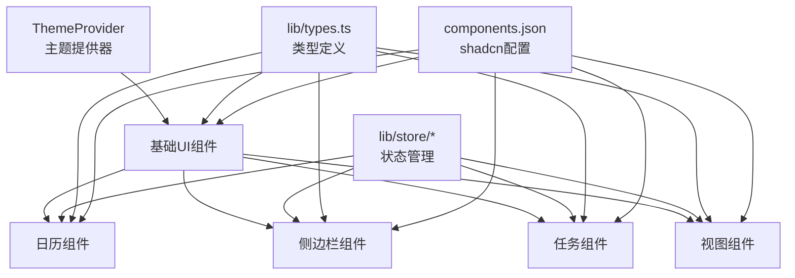
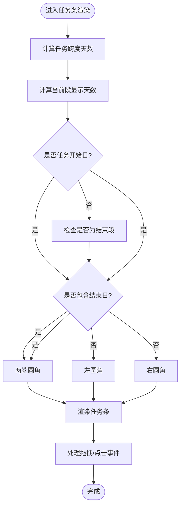
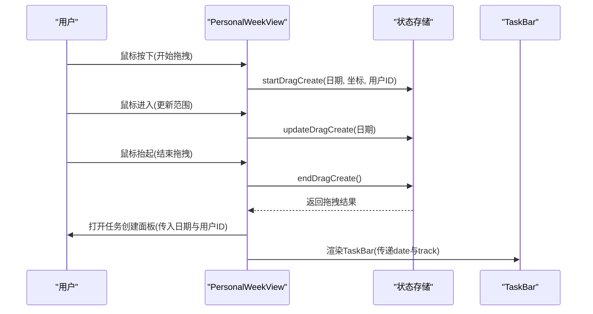
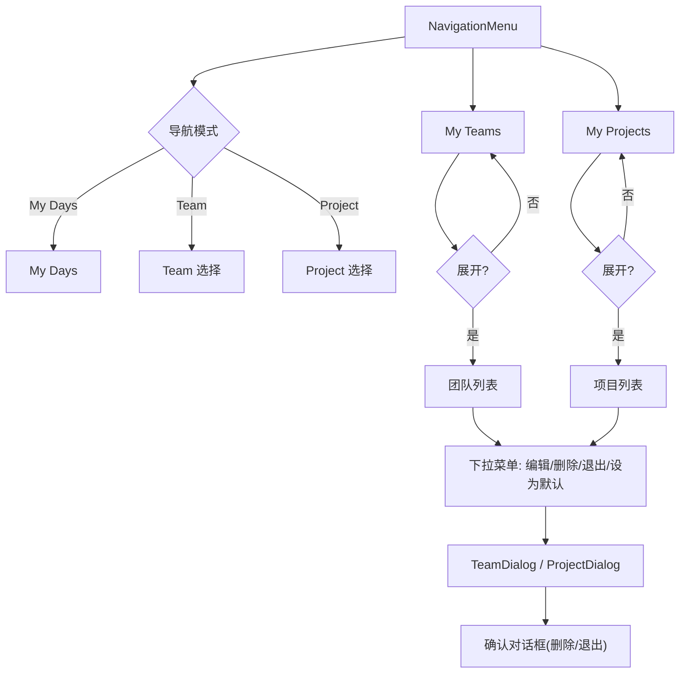
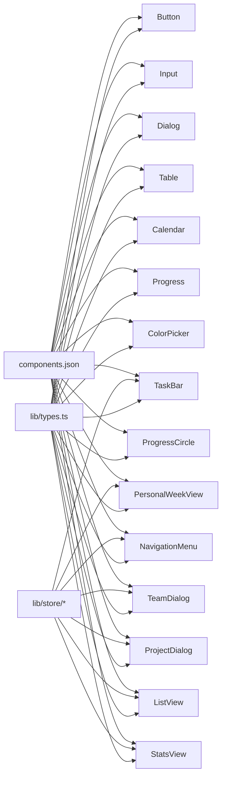

# UI组件库

<cite>
**本文档引用的文件**
- [components.json](file://components.json)
- [components/ui/button.tsx](file://components/ui/button.tsx)
- [components/ui/input.tsx](file://components/ui/input.tsx)
- [components/ui/dialog.tsx](file://components/ui/dialog.tsx)
- [components/ui/table.tsx](file://components/ui/table.tsx)
- [components/ui/calendar.tsx](file://components/ui/calendar.tsx)
- [components/ui/progress.tsx](file://components/ui/progress.tsx)
- [components/theme-provider.tsx](file://components/theme-provider.tsx)
- [components/calendar/task-bar.tsx](file://components/calendar/task-bar.tsx)
- [components/calendar/personal-week-view.tsx](file://components/calendar/personal-week-view.tsx)
- [components/sidebar/navigation-menu.tsx](file://components/sidebar/navigation-menu.tsx)
- [components/sidebar/team-dialog.tsx](file://components/sidebar/team-dialog.tsx)
- [components/sidebar/project-dialog.tsx](file://components/sidebar/project-dialog.tsx)
- [components/task/color-picker.tsx](file://components/task/color-picker.tsx)
- [components/task/progress-circle.tsx](file://components/task/progress-circle.tsx)
- [lib/types.ts](file://lib/types.ts)
</cite>

## 更新摘要
**所做更改**
- 新增 shadcn/ui 组件系统配置说明
- 扩展基础UI组件文档，增加更多组件类型
- 完善日历组件交互模式说明
- 增强侧边栏组件的权限控制文档
- 补充任务管理组件的进度控制机制
- 更新主题系统和响应式设计指南

## 目录
1. [简介](#简介)
2. [项目结构](#项目结构)
3. [核心组件](#核心组件)
4. [架构概览](#架构概览)
5. [详细组件分析](#详细组件分析)
6. [依赖关系分析](#依赖关系分析)
7. [性能考量](#性能考量)
8. [故障排查指南](#故障排查指南)
9. [结论](#结论)
10. [附录](#附录)

## 简介
本文件系统性梳理日历任务管理系统中的UI组件库，覆盖基础UI组件、日历专用组件、任务管理组件与侧边栏组件。内容包括组件职责、属性与事件、样式定制、响应式与无障碍支持、跨浏览器兼容性、组合模式、主题定制与样式覆盖最佳实践，以及组件间依赖与集成方式。

**更新** 新增对 shadcn/ui 组件系统的完整集成文档，提供标准化的组件开发和样式定制指南。

## 项目结构
UI组件主要位于 components 目录，按功能域划分：
- components/ui：通用基础UI组件（按钮、输入框、对话框、表格、日历、进度条等）
- components/calendar：日历视图与任务条相关组件
- components/sidebar：侧边导航与团队/项目对话框
- components/task：任务相关的颜色选择器、进度圈等
- lib/types.ts：类型定义（任务、团队、项目、颜色等）

```mermaid
graph TB
subgraph "UI基础组件"
UI_Button["Button"]
UI_Input["Input"]
UI_Dialog["Dialog"]
UI_Table["Table"]
UI_Calendar["Calendar"]
UI_Progress["Progress"]
UI_Accordion["Accordion"]
UI_Alert["Alert"]
UI_Badge["Badge"]
UI_ButtonGroup["ButtonGroup"]
UI_Card["Card"]
UI_Checkbox["Checkbox"]
UI_Command["Command"]
UI_ContextMenu["ContextMenu"]
UI_DateRangePicker["DateRangePicker"]
UI_Drawer["Drawer"]
UI_DropdownMenu["DropdownMenu"]
UI_Empty["Empty"]
UI_Field["Field"]
UI_Form["Form"]
UI_HoverCard["HoverCard"]
UI_InputGroup["InputGroup"]
UI_InputOTP["InputOTP"]
UI_Item["Item"]
UI_Kbd["Kbd"]
UI_Label["Label"]
UI_Menubar["Menubar"]
UI_NavigationMenu["NavigationMenu"]
UI_Pagination["Pagination"]
UI_Popover["Popover"]
UI_RadioGroup["RadioGroup"]
UI_Resizable["Resizable"]
UI_ScrollArea["ScrollArea"]
UI_Select["Select"]
UI_Separator["Separator"]
UI_Sheet["Sheet"]
UI_Sidebar["Sidebar"]
UI_Skeleton["Skeleton"]
UI_Slider["Slider"]
UI_Sonner["Sonner"]
UI_Spinner["Spinner"]
UI_Switch["Switch"]
UI_Tabs["Tabs"]
UI_Textarea["Textarea"]
UI_TimePicker["TimePicker"]
UI_Toast["Toast"]
UI_Toaster["Toaster"]
UI_Toggle["Toggle"]
UI_ToggleGroup["ToggleGroup"]
UI_Tooltip["Tooltip"]
end
subgraph "日历组件"
Cal_TaskBar["TaskBar"]
Cal_PersonalWeek["PersonalWeekView"]
Cal_ViewToggle["ViewToggle"]
Cal_TaskSizeToggle["TaskSizeToggle"]
Cal_TeamMemberRow["TeamMemberRow"]
end
subgraph "侧边栏组件"
Side_NavMenu["NavigationMenu"]
Side_TeamDialog["TeamDialog"]
Side_ProjectDialog["ProjectDialog"]
Side_MiniCalendar["MiniCalendar"]
end
subgraph "任务组件"
Task_ColorPicker["ColorPicker"]
Task_ProgressCircle["ProgressCircle"]
Task_ProgressSlider["ProgressSlider"]
Task_TaskFormPanel["TaskFormPanel"]
Task_UserMultiSelector["UserMultiSelector"]
Task_UserSelector["UserSelector"]
end
subgraph "视图组件"
Views_ListView["ListView"]
Views_StatsView["StatsView"]
Views_LayoutToggle["ListLayoutToggle"]
Views_GroupToggle["ListGroupToggle"]
end
Types["lib/types.ts"]
UI_Button --> Types
UI_Input --> Types
UI_Dialog --> Types
UI_Table --> Types
UI_Calendar --> Types
UI_Progress --> Types
Cal_TaskBar --> Types
Cal_PersonalWeek --> Types
Side_NavMenu --> Types
Side_TeamDialog --> Types
Side_ProjectDialog --> Types
Task_ColorPicker --> Types
Task_ProgressCircle --> Types
Views_ListView --> Types
Views_StatsView --> Types
```

**图表来源**
- [components/ui/button.tsx](file://components/ui/button.tsx#L1-L61)
- [components/ui/input.tsx](file://components/ui/input.tsx#L1-L22)
- [components/ui/dialog.tsx](file://components/ui/dialog.tsx#L1-L144)
- [components/ui/table.tsx](file://components/ui/table.tsx#L1-L117)
- [components/ui/calendar.tsx](file://components/ui/calendar.tsx#L1-L214)
- [components/ui/progress.tsx](file://components/ui/progress.tsx#L1-L32)
- [components/calendar/task-bar.tsx](file://components/calendar/task-bar.tsx#L1-L700)
- [components/calendar/personal-week-view.tsx](file://components/calendar/personal-week-view.tsx#L1-L200)
- [components/sidebar/navigation-menu.tsx](file://components/sidebar/navigation-menu.tsx#L1-L561)
- [components/sidebar/team-dialog.tsx](file://components/sidebar/team-dialog.tsx#L1-L241)
- [components/sidebar/project-dialog.tsx](file://components/sidebar/project-dialog.tsx#L1-L243)
- [components/task/color-picker.tsx](file://components/task/color-picker.tsx#L1-L53)
- [components/task/progress-circle.tsx](file://components/task/progress-circle.tsx#L1-L102)
- [lib/types.ts](file://lib/types.ts#L1-L141)

**章节来源**
- [components/ui/button.tsx](file://components/ui/button.tsx#L1-L61)
- [components/ui/input.tsx](file://components/ui/input.tsx#L1-L22)
- [components/ui/dialog.tsx](file://components/ui/dialog.tsx#L1-L144)
- [components/ui/table.tsx](file://components/ui/table.tsx#L1-L117)
- [components/ui/calendar.tsx](file://components/ui/calendar.tsx#L1-L214)
- [components/ui/progress.tsx](file://components/ui/progress.tsx#L1-L32)
- [components/calendar/task-bar.tsx](file://components/calendar/task-bar.tsx#L1-L700)
- [components/calendar/personal-week-view.tsx](file://components/calendar/personal-week-view.tsx#L1-L200)
- [components/sidebar/navigation-menu.tsx](file://components/sidebar/navigation-menu.tsx#L1-L561)
- [components/sidebar/team-dialog.tsx](file://components/sidebar/team-dialog.tsx#L1-L241)
- [components/sidebar/project-dialog.tsx](file://components/sidebar/project-dialog.tsx#L1-L243)
- [components/task/color-picker.tsx](file://components/task/color-picker.tsx#L1-L53)
- [components/task/progress-circle.tsx](file://components/task/progress-circle.tsx#L1-L102)
- [lib/types.ts](file://lib/types.ts#L1-L141)

## 核心组件
本节概述各组件族的关键能力与公共特性。

- **基础UI组件**
  - Button：支持多种变体与尺寸，支持作为语义容器渲染，具备焦点环与无障碍状态样式
  - Input：统一的输入框样式，支持占位符与选中态，具备焦点环与无效态样式
  - Dialog：基于Radix UI的对话框，提供触发器、门户、覆盖层、内容、标题、描述与页脚等子组件
  - Table：表格容器与子组件（表头、表体、表尾、行、单元格、标题），支持响应式滚动与选中态
  - Calendar：基于react-day-picker的日历，内置按钮样式映射与多语言格式化，支持月份/年份下拉与方向图标
  - Progress：基于Radix UI的进度指示器，支持数值动画与自适应宽度

- **扩展UI组件**
  - Accordion：可折叠内容区域，支持多实例与单实例模式
  - Alert：通知提醒组件，支持多种类型与状态
  - Badge：徽章标签，支持多种形状与颜色
  - ButtonGroup：按钮组容器，支持水平/垂直排列
  - Card：卡片容器，支持头部、主体、底部结构
  - Checkbox：复选框组件，支持受控与非受控状态
  - Command：命令面板，支持搜索与快捷键
  - ContextMenu：上下文菜单，支持多级嵌套
  - DateRangePicker：日期范围选择器，支持多种格式
  - Drawer：抽屉组件，支持从边缘滑出
  - DropdownMenu：下拉菜单，支持触发器与内容分离
  - Empty：空状态组件，支持自定义图标与文案
  - Field：表单字段容器，支持标签与错误信息
  - Form：表单容器，支持验证与提交
  - HoverCard：悬停卡片，支持延迟显示
  - InputGroup：输入组，支持前后缀与按钮
  - InputOTP：一次性密码输入，支持自动跳转
  - Item：列表项，支持多种样式
  - Kbd：键盘按键，支持组合键
  - Label：标签组件，支持关联输入
  - Menubar：菜单栏，支持多级菜单
  - NavigationMenu：导航菜单，支持树形结构
  - Pagination：分页组件，支持跳转与显示
  - Popover：气泡框，支持触发器与定位
  - RadioGroup：单选组，支持值绑定
  - Resizable：可调整大小，支持方向与约束
  - ScrollArea：滚动区域，支持自定义滚动条
  - Select：选择器，支持搜索与多选
  - Separator：分隔符，支持方向与样式
  - Sheet：工作表，支持模态与非模态
  - Sidebar：侧边栏，支持折叠与固定
  - Skeleton：骨架屏，支持多种形状
  - Slider：滑块，支持范围与步进
  - Sonner：通知系统，支持多种通知类型
  - Spinner：加载指示器，支持多种样式
  - Switch：开关，支持受控状态
  - Tabs：标签页，支持动态添加
  - Textarea：多行输入框，支持自适应高度
  - TimePicker：时间选择器，支持格式化
  - Toast：吐司通知，支持堆叠管理
  - Toaster：通知容器，支持全局管理
  - Toggle：切换按钮，支持图标与文本
  - ToggleGroup：切换组，支持单选与多选
  - Tooltip：工具提示，支持延迟与定位

- **日历专用组件**
  - TaskBar：任务条渲染与交互（拖拽、进度拖拽、悬停高亮、跨段显示与圆角策略、负责人头像展示）
  - PersonalWeekView：个人周视图，支持拖拽创建任务、拖拽移动任务、周末隐藏、轨道分配与跨段渲染
  - ViewToggle：视图切换器，支持月/周/日视图切换
  - TaskSizeToggle：任务尺寸切换，支持紧凑/宽松模式
  - TeamMemberRow：团队成员行，支持成员信息展示

- **侧边栏组件**
  - NavigationMenu：团队/项目树状导航，支持展开/折叠、创建/编辑/删除/退出、默认团队设置、权限控制与确认对话框
  - TeamDialog：团队创建/编辑/查看对话框，含颜色选择、成员选择、权限设置、创建者变更
  - ProjectDialog：项目创建/编辑/查看对话框，含颜色选择、成员选择、权限设置、创建者变更
  - MiniCalendar：迷你日历，支持快速跳转

- **任务管理组件**
  - ColorPicker：任务颜色选择器，支持选中态放大与图标反馈
  - ProgressCircle：圆形进度指示器，支持根据颜色配置绘制扇形与数字显示切换
  - ProgressSlider：进度滑块，支持精确控制
  - TaskFormPanel：任务表单面板，支持创建与编辑
  - UserMultiSelector：用户多选器，支持搜索与批量选择
  - UserSelector：用户选择器，支持单选与搜索

- **视图组件**
  - ListView：列表视图，支持多种布局
  - StatsView：统计视图，支持数据可视化
  - ListLayoutToggle：列表布局切换，支持网格/列表模式
  - ListGroupToggle：列表分组切换，支持按项目/日期/用户分组

- **主题与环境**
  - ThemeProvider：基于next-themes的主题提供器，支持明暗主题切换

**章节来源**
- [components/ui/button.tsx](file://components/ui/button.tsx#L7-L37)
- [components/ui/input.tsx](file://components/ui/input.tsx#L5-L19)
- [components/ui/dialog.tsx](file://components/ui/dialog.tsx#L9-L143)
- [components/ui/table.tsx](file://components/ui/table.tsx#L7-L116)
- [components/ui/calendar.tsx](file://components/ui/calendar.tsx#L14-L173)
- [components/ui/progress.tsx](file://components/ui/progress.tsx#L8-L29)
- [components/calendar/task-bar.tsx](file://components/calendar/task-bar.tsx#L20-L699)
- [components/calendar/personal-week-view.tsx](file://components/calendar/personal-week-view.tsx#L10-L199)
- [components/sidebar/navigation-menu.tsx](file://components/sidebar/navigation-menu.tsx#L32-L559)
- [components/sidebar/team-dialog.tsx](file://components/sidebar/team-dialog.tsx#L38-L239)
- [components/sidebar/project-dialog.tsx](file://components/sidebar/project-dialog.tsx#L40-L241)
- [components/task/color-picker.tsx](file://components/task/color-picker.tsx#L11-L52)
- [components/task/progress-circle.tsx](file://components/task/progress-circle.tsx#L13-L101)
- [components/theme-provider.tsx](file://components/theme-provider.tsx#L9-L11)

## 架构概览
组件库采用"基础UI + 业务域组件"的分层架构，基础UI组件提供一致的视觉与交互基线，业务域组件在store驱动下完成复杂交互与数据流。

**图表来源**
- [components/theme-provider.tsx](file://components/theme-provider.tsx#L9-L11)
- [lib/types.ts](file://lib/types.ts#L1-L141)
- [components.json](file://components.json#L1-L22)

## 详细组件分析

### 基础UI组件

#### Button（按钮）
- **属性**
  - className：扩展类名
  - variant：变体（default、destructive、outline、secondary、ghost、link）
  - size：尺寸（default、sm、lg、icon、icon-sm、icon-lg）
  - asChild：是否以语义容器渲染
  - 其余原生button属性透传
- **事件**：原生事件透传
- **样式定制**
  - 基于cva的变体/尺寸组合，支持焦点环、无效态、SVG尺寸适配
  - 支持data-slot标注，便于样式覆盖
- **使用示例**
  - 作为提交按钮：variant="default"，size="default"
  - 作为危险操作：variant="destructive"
  - 作为图标按钮：size="icon"

**章节来源**
- [components/ui/button.tsx](file://components/ui/button.tsx#L39-L58)

#### Input（输入框）
- **属性**
  - className：扩展类名
  - type：原生input类型
  - 其余原生input属性透传
- **事件**：原生事件透传
- **样式定制**
  - 统一边框、背景、圆角、阴影与过渡
  - 焦点环与无效态样式，支持占位符与选中态
- **使用示例**
  - 文本输入：type="text"
  - 密码输入：type="password"

**章节来源**
- [components/ui/input.tsx](file://components/ui/input.tsx#L5-L19)

#### Dialog（对话框）
- **子组件**
  - DialogTrigger、DialogPortal、DialogOverlay、DialogContent、DialogHeader、DialogFooter、DialogTitle、DialogDescription
- **属性**
  - Root/Trigger/Portal/Overlay/Content/...：对应子组件属性
  - Content支持showCloseButton开关
- **事件**：原生事件透传
- **样式定制**
  - 内容区居中、最大宽度、动画入场/出场
  - 关闭按钮具备无障碍文本
- **使用示例**
  - 打开/关闭：通过Root与Trigger控制
  - 自定义页脚：使用DialogFooter放置操作按钮

**章节来源**
- [components/ui/dialog.tsx](file://components/ui/dialog.tsx#L9-L143)

#### Table（表格）
- **子组件**
  - Table、TableHeader、TableBody、TableFooter、TableRow、TableHead、TableCell、TableCaption
- **属性**：原生table/thead/tbody/...属性透传
- **事件**：原生事件透传
- **样式定制**
  - 容器支持横向滚动
  - 行悬停与选中态
  - 表头/单元格对齐与复选框适配
- **使用示例**
  - 响应式表格：在Table外层包裹容器

**章节来源**
- [components/ui/table.tsx](file://components/ui/table.tsx#L7-L116)

#### Calendar（日历）
- **属性**
  - className、classNames：扩展类名与样式映射
  - showOutsideDays、captionLayout、buttonVariant：显示策略与按钮变体
  - formatters、components：格式化器与组件替换
  - 其余DayPicker原生属性透传
- **事件**：原生事件透传
- **样式定制**
  - 内置按钮样式映射（继承Button变体）
  - 支持RTL翻转箭头
  - 下拉框、标题、单元格、范围选择等样式
- **使用示例**
  - 自定义按钮变体：buttonVariant="ghost"
  - 自定义格式化：formatMonthDropdown

**章节来源**
- [components/ui/calendar.tsx](file://components/ui/calendar.tsx#L14-L173)

#### Progress（进度条）
- **属性**
  - className：扩展类名
  - value：进度值（0-100）
  - 其余原生属性透传
- **事件**：原生事件透传
- **样式定制**
  - 背景条与进度指示器，支持动画过渡
- **使用示例**
  - 任务进度：value={task.progress}

**章节来源**
- [components/ui/progress.tsx](file://components/ui/progress.tsx#L8-L29)

### 扩展UI组件

#### Accordion（手风琴）
- **功能**：可折叠内容区域，支持多实例与单实例模式
- **属性**：value、onValueChange、type、collapsible
- **子组件**：AccordionItem、AccordionTrigger、AccordionContent
- **样式定制**：支持自定义展开/收起图标与动画

#### Alert（警告框）
- **功能**：通知提醒组件，支持多种类型（success、info、warning、error）
- **属性**：title、description、action、cancelButton
- **样式定制**：支持自定义颜色与图标

#### Badge（徽章）
- **功能**：徽章标签，支持多种形状（default、secondary、outline、destructive）
- **属性**：content、dotMode、max
- **样式定制**：支持自定义尺寸与颜色

#### ButtonGroup（按钮组）
- **功能**：按钮组容器，支持水平/垂直排列
- **属性**：orientation、disabled
- **样式定制**：支持边框连接与间距调整

#### Card（卡片）
- **功能**：卡片容器，支持头部、主体、底部结构
- **属性**：children、className
- **子组件**：CardHeader、CardTitle、CardDescription、CardContent、CardFooter
- **样式定制**：支持阴影与圆角

#### Checkbox（复选框）
- **功能**：复选框组件，支持受控与非受控状态
- **属性**：checked、onCheckedChange、disabled、required
- **样式定制**：支持自定义图标与尺寸

#### Command（命令面板）
- **功能**：命令面板，支持搜索与快捷键
- **属性**：value、onValueChange、shouldFilter
- **子组件**：CommandEmpty、CommandGroup、CommandItem、CommandList、CommandSeparator、CommandShortcut
- **样式定制**：支持自定义过滤与高亮

#### ContextMenu（上下文菜单）
- **功能**：上下文菜单，支持多级嵌套
- **属性**：open、onOpenChange
- **子组件**：ContextMenuTrigger、ContextMenuContent、ContextMenuItem、ContextMenuSeparator
- **样式定制**：支持定位与动画

#### DateRangePicker（日期范围选择器）
- **功能**：日期范围选择器，支持多种格式
- **属性**：value、onValueChange、placeholder、disabled
- **样式定制**：支持自定义格式与范围限制

#### Drawer（抽屉）
- **功能**：抽屉组件，支持从边缘滑出
- **属性**：open、onOpenChange、direction
- **样式定制**：支持尺寸与遮罩

#### DropdownMenu（下拉菜单）
- **功能**：下拉菜单，支持触发器与内容分离
- **属性**：open、onOpenChange、align、sideOffset
- **子组件**：DropdownMenuTrigger、DropdownMenuContent、DropdownMenuItem、DropdownMenuSeparator
- **样式定制**：支持定位与动画

#### Empty（空状态）
- **功能**：空状态组件，支持自定义图标与文案
- **属性**：image、title、description、action
- **样式定制**：支持自定义布局

#### Field（表单字段）
- **功能**：表单字段容器，支持标签与错误信息
- **属性**：label、error、description
- **样式定制**：支持布局与间距

#### Form（表单）
- **功能**：表单容器，支持验证与提交
- **属性**：onSubmit、resolver、values
- **子组件**：FormMessage、FormDescription、FormField
- **样式定制**：支持验证状态

#### HoverCard（悬停卡片）
- **功能**：悬停卡片，支持延迟显示
- **属性**：openDelay、closeDelay
- **样式定制**：支持定位与动画

#### InputGroup（输入组）
- **功能**：输入组，支持前后缀与按钮
- **属性**：prepend、append、disabled
- **样式定制**：支持边框连接

#### InputOTP（一次性密码）
- **功能**：一次性密码输入，支持自动跳转
- **属性**：value、onValueChange、numInputs、render
- **样式定制**：支持输入样式

#### Item（列表项）
- **功能**：列表项，支持多种样式
- **属性**：startIcon、endIcon、disabled
- **样式定制**：支持布局与间距

#### Kbd（键盘按键）
- **功能**：键盘按键，支持组合键
- **属性**：keys
- **样式定制**：支持尺寸与字体

#### Label（标签）
- **功能**：标签组件，支持关联输入
- **属性**：for
- **样式定制**：支持交互状态

#### Menubar（菜单栏）
- **功能**：菜单栏，支持多级菜单
- **属性**：value、onValueChange
- **子组件**：MenubarMenu、MenubarTrigger、MenubarContent、MenubarItem
- **样式定制**：支持布局与定位

#### NavigationMenu（导航菜单）
- **功能**：导航菜单，支持树形结构
- **属性**：value、onValueChange
- **子组件**：NavigationMenuList、NavigationMenuItem、NavigationMenuTrigger
- **样式定制**：支持展开与折叠

#### Pagination（分页）
- **功能**：分页组件，支持跳转与显示
- **属性**：count、pageSize、onPaginationChange
- **样式定制**：支持布局与样式

#### Popover（气泡框）
- **功能**：气泡框，支持触发器与定位
- **属性**：open、onOpenChange、align、sideOffset
- **样式定制**：支持定位与动画

#### RadioGroup（单选组）
- **功能**：单选组，支持值绑定
- **属性**：value、onValueChange、disabled
- **样式定制**：支持布局与间距

#### Resizable（可调整大小）
- **功能**：可调整大小，支持方向与约束
- **属性**：defaultSize、minSize、maxSize、direction
- **样式定制**：支持手柄与边界

#### ScrollArea（滚动区域）
- **功能**：滚动区域，支持自定义滚动条
- **属性**：type、scrollBar
- **样式定制**：支持滚动条样式

#### Select（选择器）
- **功能**：选择器，支持搜索与多选
- **属性**：value、onValueChange、disabled
- **子组件**：SelectTrigger、SelectContent、SelectItem、SelectSeparator
- **样式定制**：支持搜索与过滤

#### Separator（分隔符）
- **功能**：分隔符，支持方向与样式
- **属性**：orientation
- **样式定制**：支持颜色与厚度

#### Sheet（工作表）
- **功能**：工作表，支持模态与非模态
- **属性**：open、onOpenChange、side
- **样式定制**：支持尺寸与遮罩

#### Sidebar（侧边栏）
- **功能**：侧边栏，支持折叠与固定
- **属性**：open、onOpenChange、isCollapsed
- **样式定制**：支持宽度与动画

#### Skeleton（骨架屏）
- **功能**：骨架屏，支持多种形状
- **属性**：width、height、shape
- **样式定制**：支持动画与颜色

#### Slider（滑块）
- **功能**：滑块，支持范围与步进
- **属性**：value、onValueChange、min、max、step
- **样式定制**：支持尺寸与刻度

#### Sonner（通知系统）
- **功能**：通知系统，支持多种通知类型
- **属性**：position、toast
- **样式定制**：支持布局与样式

#### Spinner（加载指示器）
- **功能**：加载指示器，支持多种样式
- **属性**：size、variant
- **样式定制**：支持颜色与动画

#### Switch（开关）
- **功能**：开关，支持受控状态
- **属性**：checked、onCheckedChange、disabled
- **样式定制**：支持尺寸与颜色

#### Tabs（标签页）
- **功能**：标签页，支持动态添加
- **属性**：value、onValueChange
- **子组件**：TabsList、TabsTrigger、TabsContent
- **样式定制**：支持布局与动画

#### Textarea（多行输入框）
- **功能**：多行输入框，支持自适应高度
- **属性**：value、onValueChange、disabled
- **样式定制**：支持尺寸与边框

#### TimePicker（时间选择器）
- **功能**：时间选择器，支持格式化
- **属性**：value、onValueChange、placeholder
- **样式定制**：支持格式与范围

#### Toast（吐司通知）
- **功能**：吐司通知，支持堆叠管理
- **属性**：id、title、description
- **样式定制**：支持类型与持续时间

#### Toaster（通知容器）
- **功能**：通知容器，支持全局管理
- **属性**：toast
- **样式定制**：支持位置与样式

#### Toggle（切换按钮）
- **功能**：切换按钮，支持图标与文本
- **属性**：pressed、onPressedChange、disabled
- **样式定制**：支持尺寸与颜色

#### ToggleGroup（切换组）
- **功能**：切换组，支持单选与多选
- **属性**：type、value
- **子组件**：ToggleGroupItem
- **样式定制**：支持布局与间距

### 日历专用组件

#### TaskBar（任务条）
- **属性**
  - task：任务对象（来自lib/types）
  - date：当前渲染日期
  - track：轨道索引
  - showUserInfo：是否显示负责人头像与姓名
  - isPersonalWeekView：是否在个人周视图中
- **事件**
  - 鼠标点击：打开任务编辑
  - 鼠标拖拽：开始移动任务
  - 进度拖拽：更新任务总进度（乐观更新）
- **样式与行为**
  - 圆角策略：开始/结束/两端圆角
  - 颜色策略：按任务类型或自定义颜色
  - 跨段显示：计算显示天数与进度
  - 乐观进度：拖拽过程即时反馈，等待服务端确认
- **无障碍**
  - 关闭按钮含无障碍文本
  - 焦点状态与键盘可达性由底层Button提供

**图表来源**
- [components/calendar/task-bar.tsx](file://components/calendar/task-bar.tsx#L113-L231)

**章节来源**
- [components/calendar/task-bar.tsx](file://components/calendar/task-bar.tsx#L20-L699)
- [lib/types.ts](file://lib/types.ts#L61-L82)

#### PersonalWeekView（个人周视图）
- **属性**：无
- **事件**
  - 鼠标按下：开始拖拽创建任务
  - 鼠标进入：更新拖拽范围
  - 鼠标释放：结束拖拽并打开任务创建面板
- **样式与行为**
  - 周头部：显示星期与日期
  - 任务轨道：按track垂直排列
  - 拖拽范围高亮：蓝色背景与边框
  - 周末隐藏：可配置
- **与TaskBar协作**
  - 传递date与track
  - 个人视图显示负责人信息

**图表来源**
- [components/calendar/personal-week-view.tsx](file://components/calendar/personal-week-view.tsx#L114-L144)
- [components/calendar/task-bar.tsx](file://components/calendar/task-bar.tsx#L190-L210)

**章节来源**
- [components/calendar/personal-week-view.tsx](file://components/calendar/personal-week-view.tsx#L10-L199)

#### ViewToggle（视图切换器）
- **功能**：支持月/周/日视图切换
- **属性**：value、onValueChange
- **样式定制**：支持图标与文本

#### TaskSizeToggle（任务尺寸切换）
- **功能**：支持紧凑/宽松模式切换
- **属性**：value、onValueChange
- **样式定制**：支持尺寸与间距

#### TeamMemberRow（团队成员行）
- **功能**：显示团队成员信息
- **属性**：members、currentUser
- **样式定制**：支持头像与状态

### 侧边栏组件

#### NavigationMenu（导航菜单）
- **功能**
  - My Days、My Teams、My Projects 三段导航
  - 展开/折叠、创建/编辑/删除/退出团队/项目
  - 默认团队设置、权限控制（创建者/超管）
  - 确认对话框（删除/退出）
- **交互**
  - 点击切换导航模式与选中项
  - 下拉菜单提供操作入口
  - 对话框承载编辑/查看/确认流程

**图表来源**
- [components/sidebar/navigation-menu.tsx](file://components/sidebar/navigation-menu.tsx#L32-L559)

**章节来源**
- [components/sidebar/navigation-menu.tsx](file://components/sidebar/navigation-menu.tsx#L32-L559)

#### TeamDialog（团队对话框）
- **功能**
  - 创建/编辑/查看团队
  - 颜色预设、成员多选、权限选择、创建者变更
- **交互**
  - 表单校验（名称必填、成员至少一人）
  - 保存后关闭并回调

**章节来源**
- [components/sidebar/team-dialog.tsx](file://components/sidebar/team-dialog.tsx#L38-L239)

#### ProjectDialog（项目对话框）
- **功能**
  - 创建/编辑/查看项目
  - 颜色预设、成员多选、权限选择、创建者变更
- **交互**
  - 表单校验（名称必填、成员至少一人）
  - 保存后关闭并回调

**章节来源**
- [components/sidebar/project-dialog.tsx](file://components/sidebar/project-dialog.tsx#L40-L241)

#### MiniCalendar（迷你日历）
- **功能**：快速跳转到指定日期
- **属性**：value、onValueChange
- **样式定制**：支持紧凑布局

### 任务管理组件

#### ColorPicker（颜色选择器）
- **属性**
  - value：当前选中颜色值
  - onChange：颜色变更回调
- **事件**
  - 点击按钮：触发onChange
- **样式定制**
  - 选中态放大与勾选图标
  - 标题与无障碍标签

**章节来源**
- [components/task/color-picker.tsx](file://components/task/color-picker.tsx#L11-L52)

#### ProgressCircle（进度圆环）
- **属性**
  - progress：进度值（0-100）
  - color：颜色值（来自TASK_COLORS）
  - size：尺寸
  - showNumber：是否显示数字
- **事件**：无
- **样式定制**
  - 根据颜色生成扇形路径
  - 数字显示与饼图切换的过渡动画

**章节来源**
- [components/task/progress-circle.tsx](file://components/task/progress-circle.tsx#L13-L101)

#### ProgressSlider（进度滑块）
- **功能**：精确控制任务进度
- **属性**：value、onValueChange、disabled
- **样式定制**：支持颜色与尺寸

#### TaskFormPanel（任务表单面板）
- **功能**：创建与编辑任务
- **属性**：taskId、onSubmit
- **子组件**：TaskForm
- **样式定制**：支持展开与折叠

#### UserMultiSelector（用户多选器）
- **功能**：支持搜索与批量选择用户
- **属性**：selectedUserIds、onUserChange、lockedUserIds
- **样式定制**：支持搜索与过滤

#### UserSelector（用户选择器）
- **功能**：单选用户，支持搜索
- **属性**：selectedUserId、onUserChange、disabled
- **样式定制**：支持搜索与预览

### 视图组件

#### ListView（列表视图）
- **功能**：支持多种布局的列表视图
- **属性**：tasks、groupBy、layout
- **样式定制**：支持网格/列表模式

#### StatsView（统计视图）
- **功能**：数据可视化统计
- **属性**：data、metrics
- **样式定制**：支持图表与指标

#### ListLayoutToggle（列表布局切换）
- **功能**：切换网格/列表布局
- **属性**：value、onValueChange
- **样式定制**：支持图标与文本

#### ListGroupToggle（列表分组切换）
- **功能**：切换按项目/日期/用户分组
- **属性**：value、onValueChange
- **样式定制**：支持布局与间距

### 主题与环境

#### ThemeProvider（主题提供器）
- **功能**：基于next-themes的主题提供器
- **属性**：children、attribute、defaultTheme、themes
- **样式定制**：支持系统主题检测

**章节来源**
- [components/theme-provider.tsx](file://components/theme-provider.tsx#L9-L11)

## 依赖关系分析

**图表来源**
- [lib/types.ts](file://lib/types.ts#L61-L139)
- [components/calendar/task-bar.tsx](file://components/calendar/task-bar.tsx#L5-L10)
- [components/calendar/personal-week-view.tsx](file://components/calendar/personal-week-view.tsx#L11)
- [components/sidebar/navigation-menu.tsx](file://components/sidebar/navigation-menu.tsx#L6)
- [components/sidebar/team-dialog.tsx](file://components/sidebar/team-dialog.tsx#L9)
- [components/sidebar/project-dialog.tsx](file://components/sidebar/project-dialog.tsx#L9)
- [components/task/color-picker.tsx](file://components/task/color-picker.tsx#L3)
- [components/task/progress-circle.tsx](file://components/task/progress-circle.tsx#L4)
- [components.json](file://components.json#L1-L22)

**章节来源**
- [lib/types.ts](file://lib/types.ts#L1-L141)
- [components/calendar/task-bar.tsx](file://components/calendar/task-bar.tsx#L1-L700)
- [components/calendar/personal-week-view.tsx](file://components/calendar/personal-week-view.tsx#L1-L200)
- [components/sidebar/navigation-menu.tsx](file://components/sidebar/navigation-menu.tsx#L1-L561)
- [components/sidebar/team-dialog.tsx](file://components/sidebar/team-dialog.tsx#L1-L241)
- [components/sidebar/project-dialog.tsx](file://components/sidebar/project-dialog.tsx#L1-L243)
- [components/task/color-picker.tsx](file://components/task/color-picker.tsx#L1-L53)
- [components/task/progress-circle.tsx](file://components/task/progress-circle.tsx#L1-L102)
- [components.json](file://components.json#L1-L22)

## 性能考量
- **任务条渲染**
  - 使用useMemo过滤与分配轨道，减少重复计算
  - 跨段进度计算与乐观更新避免频繁重绘
- **周视图**
  - 全局mouseup监听仅在创建/移动阶段启用，避免常驻事件
  - 拖拽范围高亮与悬停态使用CSS类切换
- **对话框**
  - Portal将内容挂载至根节点，减少DOM层级
  - 动画入场/出场使用CSS过渡，避免JS动画阻塞
- **主题**
  - next-themes按需切换，避免全量重绘
- **组件优化**
  - 使用React.memo优化重复渲染
  - 使用useCallback稳定回调函数引用
  - 使用useRef访问DOM元素避免强制重渲染

## 故障排查指南
- **任务条进度异常**
  - 检查乐观进度与服务端同步时机，确认useEffect监听是否清除
  - 排查跨段进度换算逻辑（总天数、段内天数、百分比换算）
- **拖拽冲突**
  - 确认TaskBar阻止事件冒泡，避免与日历日单元格拖拽冲突
  - 检查全局mouseup监听是否正确移除
- **对话框焦点问题**
  - 确保首次聚焦元素设置，关闭时清理焦点
- **颜色选择无效**
  - 检查value与onChange一致性，确认颜色值在TASK_COLORS中存在
- **组件样式冲突**
  - 检查data-slot属性是否正确使用
  - 确认Tailwind类名优先级与覆盖规则
- **shadcn组件问题**
  - 检查components.json配置是否正确
  - 确认组件导入路径与别名设置

**章节来源**
- [components/calendar/task-bar.tsx](file://components/calendar/task-bar.tsx#L280-L381)
- [components/calendar/personal-week-view.tsx](file://components/calendar/personal-week-view.tsx#L16-L29)
- [components/ui/dialog.tsx](file://components/ui/dialog.tsx#L56-L80)
- [components/task/color-picker.tsx](file://components/task/color-picker.tsx#L11-L52)

## 结论
本UI组件库以基础UI组件为基座，围绕日历与任务场景构建了高内聚、低耦合的组件体系。通过shadcn/ui标准化的组件开发流程，提供了统一的样式规范与交互模式。通过store驱动与类型约束，保证了交互一致性与可维护性。建议在扩展新组件时遵循现有命名规范、样式覆盖约定与无障碍标准，确保整体体验一致。

**更新** 新增的shadcn/ui组件系统为项目提供了标准化的组件开发框架，包括统一的配置管理、样式定制指南和组件集成模式，大大提升了开发效率与代码质量。

## 附录

### 组件属性与事件速查
- **Button**
  - 属性：className、variant、size、asChild
  - 事件：原生button事件
- **Input**
  - 属性：className、type
  - 事件：原生input事件
- **Dialog**
  - 子组件：Trigger、Portal、Overlay、Content、Header、Footer、Title、Description
  - 属性：Root/Trigger/Portal/Overlay/Content/...，Content支持showCloseButton
- **Table**
  - 子组件：Table、Header、Body、Footer、Row、Head、Cell、Caption
- **Calendar**
  - 属性：className、classNames、showOutsideDays、captionLayout、buttonVariant、formatters、components
- **Progress**
  - 属性：className、value
- **TaskBar**
  - 属性：task、date、track、showUserInfo、isPersonalWeekView
  - 事件：点击、拖拽、进度拖拽
- **PersonalWeekView**
  - 事件：按下、进入、抬起
- **NavigationMenu**
  - 事件：导航切换、下拉操作、确认对话框
- **TeamDialog / ProjectDialog**
  - 事件：表单提交、关闭
- **shadcn组件**
  - 所有组件均支持data-slot属性进行样式覆盖
  - 支持variants/size组合与className合并
  - 遵循Tailwind CSS最佳实践

### 样式覆盖与主题定制最佳实践
- **使用data-slot属性**：定位组件内部元素，进行细粒度覆盖
- **通过variants/size组合**：与className合并，避免内联样式污染
- **主题切换时保持对比度**：确保无效态与焦点态清晰
- **为图标按钮提供最小点击热区**：提升移动端可用性
- **遵循shadcn配置**：使用components.json中的别名与样式变量
- **组件样式隔离**：避免全局样式污染，使用局部作用域

### 响应式与无障碍支持
- **响应式**
  - 表格容器支持横向滚动
  - 日历与对话框在小屏设备上限制最大宽度
  - 所有组件支持断点适配
- **无障碍**
  - 焦点环与键盘可达性由Button/Dialog等提供
  - 关闭按钮包含无障碍文本
  - 下拉菜单与确认对话框提供明确语义标签
  - 支持屏幕阅读器与键盘导航
- **shadcn无障碍标准**
  - 所有交互组件支持键盘操作
  - 提供适当的ARIA属性
  - 支持颜色对比度要求

### shadcn/ui组件系统配置
- **配置文件**：components.json
  - style：组件风格（new-york）
  - rsc：支持React Server Components
  - tsx：支持TSX语法
  - tailwind：Tailwind CSS配置
  - aliases：模块别名映射
  - iconLibrary：图标库（lucide）
- **安装与使用**
  - 使用npx shadcn@latest init初始化
  - 通过npx shadcn@latest add安装组件
  - 配置别名与样式变量
- **样式定制**
  - 支持主题色与透明度变量
  - 组件样式可完全覆盖
  - Tailwind插件集成

**章节来源**
- [components.json](file://components.json#L1-L22)