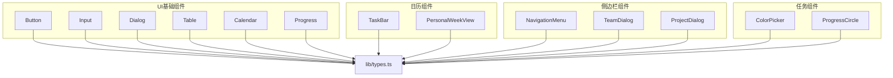
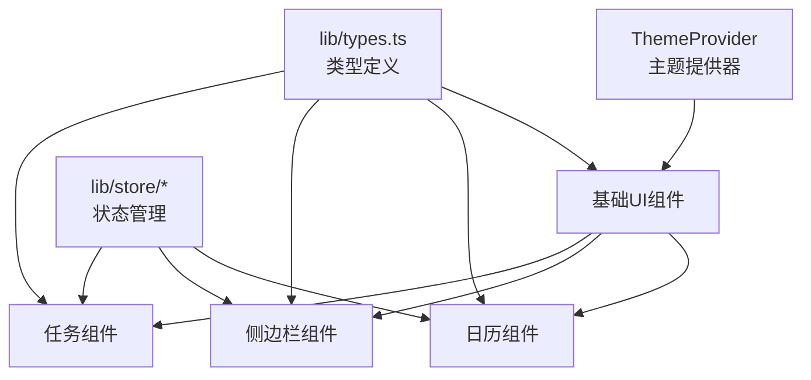
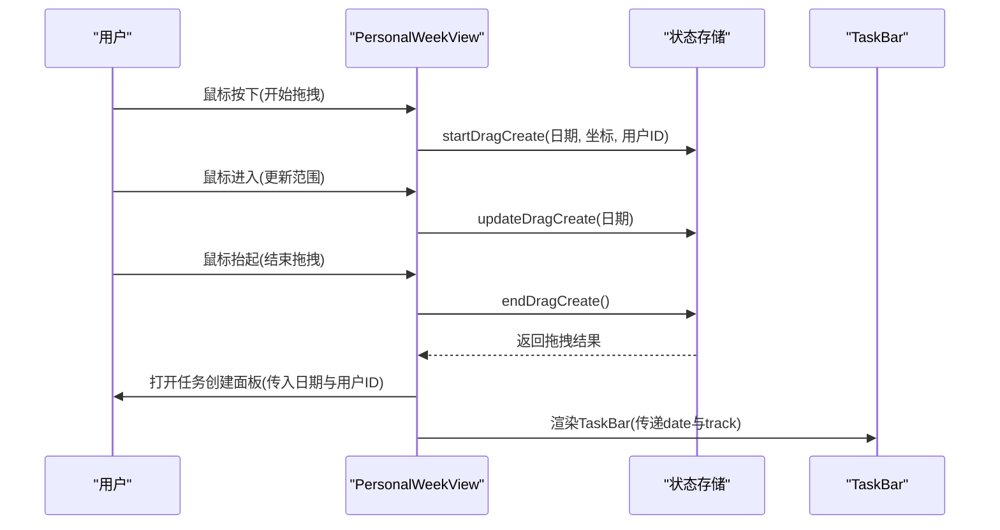
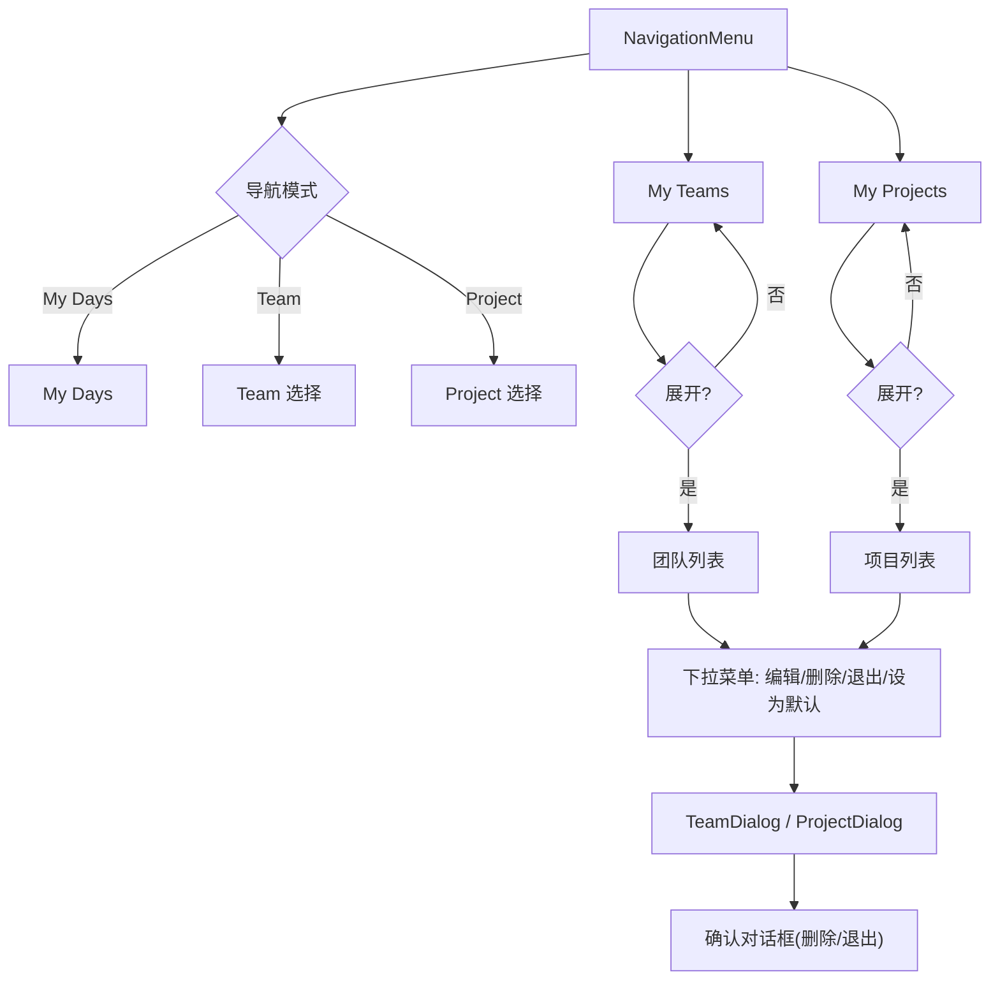
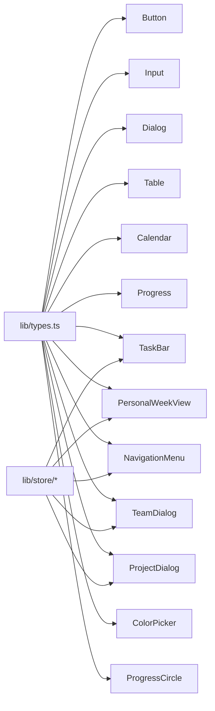

# UI组件库

<cite>
**本文档引用的文件**
- [components/ui/button.tsx](file://components/ui/button.tsx)
- [components/ui/input.tsx](file://components/ui/input.tsx)
- [components/ui/dialog.tsx](file://components/ui/dialog.tsx)
- [components/ui/table.tsx](file://components/ui/table.tsx)
- [components/ui/calendar.tsx](file://components/ui/calendar.tsx)
- [components/ui/progress.tsx](file://components/ui/progress.tsx)
- [components/theme-provider.tsx](file://components/theme-provider.tsx)
- [components/calendar/task-bar.tsx](file://components/calendar/task-bar.tsx)
- [components/calendar/personal-week-view.tsx](file://components/calendar/personal-week-view.tsx)
- [components/sidebar/navigation-menu.tsx](file://components/sidebar/navigation-menu.tsx)
- [components/sidebar/team-dialog.tsx](file://components/sidebar/team-dialog.tsx)
- [components/sidebar/project-dialog.tsx](file://components/sidebar/project-dialog.tsx)
- [components/task/color-picker.tsx](file://components/task/color-picker.tsx)
- [components/task/progress-circle.tsx](file://components/task/progress-circle.tsx)
- [lib/types.ts](file://lib/types.ts)
</cite>

## 目录
1. [简介](#简介)
2. [项目结构](#项目结构)
3. [核心组件](#核心组件)
4. [架构概览](#架构概览)
5. [详细组件分析](#详细组件分析)
6. [依赖关系分析](#依赖关系分析)
7. [性能考量](#性能考量)
8. [故障排查指南](#故障排查指南)
9. [结论](#结论)
10. [附录](#附录)

## 简介
本文件系统性梳理日历任务管理系统中的UI组件库，覆盖基础UI组件、日历专用组件、任务管理组件与侧边栏组件。内容包括组件职责、属性与事件、样式定制、响应式与无障碍支持、跨浏览器兼容性、组合模式、主题定制与样式覆盖最佳实践，以及组件间依赖与集成方式。

## 项目结构
UI组件主要位于 components 目录，按功能域划分：
- components/ui：通用基础UI组件（按钮、输入框、对话框、表格、日历、进度条等）
- components/calendar：日历视图与任务条相关组件
- components/sidebar：侧边导航与团队/项目对话框
- components/task：任务相关的颜色选择器、进度圈等
- lib/types.ts：类型定义（任务、团队、项目、颜色等）

图表来源
- [components/ui/button.tsx](file://components/ui/button.tsx#L1-L61)
- [components/ui/input.tsx](file://components/ui/input.tsx#L1-L22)
- [components/ui/dialog.tsx](file://components/ui/dialog.tsx#L1-L144)
- [components/ui/table.tsx](file://components/ui/table.tsx#L1-L117)
- [components/ui/calendar.tsx](file://components/ui/calendar.tsx#L1-L214)
- [components/ui/progress.tsx](file://components/ui/progress.tsx#L1-L32)
- [components/calendar/task-bar.tsx](file://components/calendar/task-bar.tsx#L1-L700)
- [components/calendar/personal-week-view.tsx](file://components/calendar/personal-week-view.tsx#L1-L200)
- [components/sidebar/navigation-menu.tsx](file://components/sidebar/navigation-menu.tsx#L1-L561)
- [components/sidebar/team-dialog.tsx](file://components/sidebar/team-dialog.tsx#L1-L241)
- [components/sidebar/project-dialog.tsx](file://components/sidebar/project-dialog.tsx#L1-L243)
- [components/task/color-picker.tsx](file://components/task/color-picker.tsx#L1-L53)
- [components/task/progress-circle.tsx](file://components/task/progress-circle.tsx#L1-L102)
- [lib/types.ts](file://lib/types.ts#L1-L141)

章节来源
- [components/ui/button.tsx](file://components/ui/button.tsx#L1-L61)
- [components/ui/input.tsx](file://components/ui/input.tsx#L1-L22)
- [components/ui/dialog.tsx](file://components/ui/dialog.tsx#L1-L144)
- [components/ui/table.tsx](file://components/ui/table.tsx#L1-L117)
- [components/ui/calendar.tsx](file://components/ui/calendar.tsx#L1-L214)
- [components/ui/progress.tsx](file://components/ui/progress.tsx#L1-L32)
- [components/calendar/task-bar.tsx](file://components/calendar/task-bar.tsx#L1-L700)
- [components/calendar/personal-week-view.tsx](file://components/calendar/personal-week-view.tsx#L1-L200)
- [components/sidebar/navigation-menu.tsx](file://components/sidebar/navigation-menu.tsx#L1-L561)
- [components/sidebar/team-dialog.tsx](file://components/sidebar/team-dialog.tsx#L1-L241)
- [components/sidebar/project-dialog.tsx](file://components/sidebar/project-dialog.tsx#L1-L243)
- [components/task/color-picker.tsx](file://components/task/color-picker.tsx#L1-L53)
- [components/task/progress-circle.tsx](file://components/task/progress-circle.tsx#L1-L102)
- [lib/types.ts](file://lib/types.ts#L1-L141)

## 核心组件
本节概述各组件族的关键能力与公共特性。

- 基础UI组件
  - Button：支持多种变体与尺寸，支持作为语义容器渲染，具备焦点环与无障碍状态样式。
  - Input：统一的输入框样式，支持占位符与选中态，具备焦点环与无效态样式。
  - Dialog：基于Radix UI的对话框，提供触发器、门户、覆盖层、内容、标题、描述与页脚等子组件。
  - Table：表格容器与子组件（表头、表体、表尾、行、单元格、标题），支持响应式滚动与选中态。
  - Calendar：基于react-day-picker的日历，内置按钮样式映射与多语言格式化，支持月份/年份下拉与方向图标。
  - Progress：基于Radix UI的进度指示器，支持数值动画与自适应宽度。

- 日历专用组件
  - TaskBar：任务条渲染与交互（拖拽、进度拖拽、悬停高亮、跨段显示与圆角策略、负责人头像展示）。
  - PersonalWeekView：个人周视图，支持拖拽创建任务、拖拽移动任务、周末隐藏、轨道分配与跨段渲染。

- 侧边栏组件
  - NavigationMenu：团队/项目树状导航，支持展开/折叠、创建/编辑/删除/退出、默认团队设置、权限控制与确认对话框。
  - TeamDialog：团队创建/编辑/查看对话框，含颜色选择、成员选择、权限设置、创建者变更。
  - ProjectDialog：项目创建/编辑/查看对话框，含颜色选择、成员选择、权限设置、创建者变更。

- 任务管理组件
  - ColorPicker：任务颜色选择器，支持选中态放大与图标反馈。
  - ProgressCircle：圆形进度指示器，支持根据颜色配置绘制扇形与数字显示切换。

- 主题与环境
  - ThemeProvider：基于next-themes的主题提供器，支持明暗主题切换。

章节来源
- [components/ui/button.tsx](file://components/ui/button.tsx#L7-L37)
- [components/ui/input.tsx](file://components/ui/input.tsx#L5-L19)
- [components/ui/dialog.tsx](file://components/ui/dialog.tsx#L9-L143)
- [components/ui/table.tsx](file://components/ui/table.tsx#L7-L116)
- [components/ui/calendar.tsx](file://components/ui/calendar.tsx#L14-L173)
- [components/ui/progress.tsx](file://components/ui/progress.tsx#L8-L29)
- [components/calendar/task-bar.tsx](file://components/calendar/task-bar.tsx#L20-L699)
- [components/calendar/personal-week-view.tsx](file://components/calendar/personal-week-view.tsx#L10-L199)
- [components/sidebar/navigation-menu.tsx](file://components/sidebar/navigation-menu.tsx#L32-L559)
- [components/sidebar/team-dialog.tsx](file://components/sidebar/team-dialog.tsx#L38-L239)
- [components/sidebar/project-dialog.tsx](file://components/sidebar/project-dialog.tsx#L40-L241)
- [components/task/color-picker.tsx](file://components/task/color-picker.tsx#L11-L52)
- [components/task/progress-circle.tsx](file://components/task/progress-circle.tsx#L13-L101)
- [components/theme-provider.tsx](file://components/theme-provider.tsx#L9-L11)

## 架构概览
组件库采用“基础UI + 业务域组件”的分层架构，基础UI组件提供一致的视觉与交互基线，业务域组件在store驱动下完成复杂交互与数据流。

图表来源
- [components/theme-provider.tsx](file://components/theme-provider.tsx#L9-L11)
- [lib/types.ts](file://lib/types.ts#L1-L141)

## 详细组件分析

### 基础UI组件

#### Button（按钮）
- 属性
  - className：扩展类名
  - variant：变体（default、destructive、outline、secondary、ghost、link）
  - size：尺寸（default、sm、lg、icon、icon-sm、icon-lg）
  - asChild：是否以语义容器渲染
  - 其余原生button属性透传
- 事件：原生事件透传
- 样式定制
  - 基于cva的变体/尺寸组合，支持焦点环、无效态、SVG尺寸适配
  - 支持data-slot标注，便于样式覆盖
- 使用示例
  - 作为提交按钮：variant="default"，size="default"
  - 作为危险操作：variant="destructive"
  - 作为图标按钮：size="icon"

章节来源
- [components/ui/button.tsx](file://components/ui/button.tsx#L39-L58)

#### Input（输入框）
- 属性
  - className：扩展类名
  - type：原生input类型
  - 其余原生input属性透传
- 事件：原生事件透传
- 样式定制
  - 统一边框、背景、圆角、阴影与过渡
  - 焦点环与无效态样式，支持占位符与选中态
- 使用示例
  - 文本输入：type="text"
  - 密码输入：type="password"

章节来源
- [components/ui/input.tsx](file://components/ui/input.tsx#L5-L19)

#### Dialog（对话框）
- 子组件
  - DialogTrigger、DialogPortal、DialogOverlay、DialogContent、DialogHeader、DialogFooter、DialogTitle、DialogDescription
- 属性
  - Root/Trigger/Portal/Overlay/Content/...：对应子组件属性
  - Content支持showCloseButton开关
- 事件：原生事件透传
- 样式定制
  - 内容区居中、最大宽度、动画入场/出场
  - 关闭按钮具备无障碍文本
- 使用示例
  - 打开/关闭：通过Root与Trigger控制
  - 自定义页脚：使用DialogFooter放置操作按钮

章节来源
- [components/ui/dialog.tsx](file://components/ui/dialog.tsx#L9-L143)

#### Table（表格）
- 子组件
  - Table、TableHeader、TableBody、TableFooter、TableRow、TableHead、TableCell、TableCaption
- 属性：原生table/thead/tbody/...属性透传
- 事件：原生事件透传
- 样式定制
  - 容器支持横向滚动
  - 行悬停与选中态
  - 表头/单元格对齐与复选框适配
- 使用示例
  - 响应式表格：在Table外层包裹容器

章节来源
- [components/ui/table.tsx](file://components/ui/table.tsx#L7-L116)

#### Calendar（日历）
- 属性
  - className、classNames：扩展类名与样式映射
  - showOutsideDays、captionLayout、buttonVariant：显示策略与按钮变体
  - formatters、components：格式化器与组件替换
  - 其余DayPicker原生属性透传
- 事件：原生事件透传
- 样式定制
  - 内置按钮样式映射（继承Button变体）
  - 支持RTL翻转箭头
  - 下拉框、标题、单元格、范围选择等样式
- 使用示例
  - 自定义按钮变体：buttonVariant="ghost"
  - 自定义格式化：formatMonthDropdown

章节来源
- [components/ui/calendar.tsx](file://components/ui/calendar.tsx#L14-L173)

#### Progress（进度条）
- 属性
  - className：扩展类名
  - value：进度值（0-100）
  - 其余原生属性透传
- 事件：原生事件透传
- 样式定制
  - 背景条与进度指示器，支持动画过渡
- 使用示例
  - 任务进度：value={task.progress}

章节来源
- [components/ui/progress.tsx](file://components/ui/progress.tsx#L8-L29)

### 日历专用组件

#### TaskBar（任务条）
- 属性
  - task：任务对象（来自lib/types）
  - date：当前渲染日期
  - track：轨道索引
  - showUserInfo：是否显示负责人头像与姓名
  - isPersonalWeekView：是否在个人周视图中
- 事件
  - 鼠标点击：打开任务编辑
  - 鼠标拖拽：开始移动任务
  - 进度拖拽：更新任务总进度（乐观更新）
- 样式与行为
  - 圆角策略：开始/结束/两端圆角
  - 颜色策略：按任务类型或自定义颜色
  - 跨段显示：计算显示天数与进度
  - 乐观进度：拖拽过程即时反馈，等待服务端确认
- 无障碍
  - 关闭按钮含无障碍文本
  - 焦点状态与键盘可达性由底层Button提供

图表来源
- [components/calendar/task-bar.tsx](file://components/calendar/task-bar.tsx#L113-L231)

章节来源
- [components/calendar/task-bar.tsx](file://components/calendar/task-bar.tsx#L20-L699)
- [lib/types.ts](file://lib/types.ts#L61-L82)

#### PersonalWeekView（个人周视图）
- 属性：无
- 事件
  - 鼠标按下：开始拖拽创建任务
  - 鼠标进入：更新拖拽范围
  - 鼠标释放：结束拖拽并打开任务创建面板
- 样式与行为
  - 周头部：显示星期与日期
  - 任务轨道：按track垂直排列
  - 拖拽范围高亮：蓝色背景与边框
  - 周末隐藏：可配置
- 与TaskBar协作
  - 传递date与track
  - 个人视图显示负责人信息

图表来源
- [components/calendar/personal-week-view.tsx](file://components/calendar/personal-week-view.tsx#L114-L144)
- [components/calendar/task-bar.tsx](file://components/calendar/task-bar.tsx#L190-L210)

章节来源
- [components/calendar/personal-week-view.tsx](file://components/calendar/personal-week-view.tsx#L10-L199)

### 侧边栏组件

#### NavigationMenu（导航菜单）
- 功能
  - My Days、My Teams、My Projects 三段导航
  - 展开/折叠、创建/编辑/删除/退出团队/项目
  - 默认团队设置、权限控制（创建者/超管）
  - 确认对话框（删除/退出）
- 交互
  - 点击切换导航模式与选中项
  - 下拉菜单提供操作入口
  - 对话框承载编辑/查看/确认流程

图表来源
- [components/sidebar/navigation-menu.tsx](file://components/sidebar/navigation-menu.tsx#L32-L559)

章节来源
- [components/sidebar/navigation-menu.tsx](file://components/sidebar/navigation-menu.tsx#L32-L559)

#### TeamDialog（团队对话框）
- 功能
  - 创建/编辑/查看团队
  - 颜色预设、成员多选、权限选择、创建者变更
- 交互
  - 表单校验（名称必填、成员至少一人）
  - 保存后关闭并回调

章节来源
- [components/sidebar/team-dialog.tsx](file://components/sidebar/team-dialog.tsx#L38-L239)

#### ProjectDialog（项目对话框）
- 功能
  - 创建/编辑/查看项目
  - 颜色预设、成员多选、权限选择、创建者变更
- 交互
  - 表单校验（名称必填、成员至少一人）
  - 保存后关闭并回调

章节来源
- [components/sidebar/project-dialog.tsx](file://components/sidebar/project-dialog.tsx#L40-L241)

### 任务管理组件

#### ColorPicker（颜色选择器）
- 属性
  - value：当前选中颜色值
  - onChange：颜色变更回调
- 事件
  - 点击按钮：触发onChange
- 样式定制
  - 选中态放大与勾选图标
  - 标题与无障碍标签

章节来源
- [components/task/color-picker.tsx](file://components/task/color-picker.tsx#L11-L52)

#### ProgressCircle（进度圆环）
- 属性
  - progress：进度值（0-100）
  - color：颜色值（来自TASK_COLORS）
  - size：尺寸
  - showNumber：是否显示数字
- 事件：无
- 样式定制
  - 根据颜色生成扇形路径
  - 数字显示与饼图切换的过渡动画

章节来源
- [components/task/progress-circle.tsx](file://components/task/progress-circle.tsx#L13-L101)

## 依赖关系分析

图表来源
- [lib/types.ts](file://lib/types.ts#L61-L139)
- [components/calendar/task-bar.tsx](file://components/calendar/task-bar.tsx#L5-L10)
- [components/calendar/personal-week-view.tsx](file://components/calendar/personal-week-view.tsx#L11)
- [components/sidebar/navigation-menu.tsx](file://components/sidebar/navigation-menu.tsx#L6)
- [components/sidebar/team-dialog.tsx](file://components/sidebar/team-dialog.tsx#L9)
- [components/sidebar/project-dialog.tsx](file://components/sidebar/project-dialog.tsx#L9)
- [components/task/color-picker.tsx](file://components/task/color-picker.tsx#L3)
- [components/task/progress-circle.tsx](file://components/task/progress-circle.tsx#L4)

章节来源
- [lib/types.ts](file://lib/types.ts#L1-L141)
- [components/calendar/task-bar.tsx](file://components/calendar/task-bar.tsx#L1-L700)
- [components/calendar/personal-week-view.tsx](file://components/calendar/personal-week-view.tsx#L1-L200)
- [components/sidebar/navigation-menu.tsx](file://components/sidebar/navigation-menu.tsx#L1-L561)
- [components/sidebar/team-dialog.tsx](file://components/sidebar/team-dialog.tsx#L1-L241)
- [components/sidebar/project-dialog.tsx](file://components/sidebar/project-dialog.tsx#L1-L243)
- [components/task/color-picker.tsx](file://components/task/color-picker.tsx#L1-L53)
- [components/task/progress-circle.tsx](file://components/task/progress-circle.tsx#L1-L102)

## 性能考量
- 任务条渲染
  - 使用useMemo过滤与分配轨道，减少重复计算
  - 跨段进度计算与乐观更新避免频繁重绘
- 周视图
  - 全局mouseup监听仅在创建/移动阶段启用，避免常驻事件
  - 拖拽范围高亮与悬停态使用CSS类切换
- 对话框
  - Portal将内容挂载至根节点，减少DOM层级
  - 动画入场/出场使用CSS过渡，避免JS动画阻塞
- 主题
  - next-themes按需切换，避免全量重绘

## 故障排查指南
- 任务条进度异常
  - 检查乐观进度与服务端同步时机，确认useEffect监听是否清除
  - 排查跨段进度换算逻辑（总天数、段内天数、百分比换算）
- 拖拽冲突
  - 确认TaskBar阻止事件冒泡，避免与日历日单元格拖拽冲突
  - 检查全局mouseup监听是否正确移除
- 对话框焦点问题
  - 确保首次聚焦元素设置，关闭时清理焦点
- 颜色选择无效
  - 检查value与onChange一致性，确认颜色值在TASK_COLORS中存在

章节来源
- [components/calendar/task-bar.tsx](file://components/calendar/task-bar.tsx#L280-L381)
- [components/calendar/personal-week-view.tsx](file://components/calendar/personal-week-view.tsx#L16-L29)
- [components/ui/dialog.tsx](file://components/ui/dialog.tsx#L56-L80)
- [components/task/color-picker.tsx](file://components/task/color-picker.tsx#L11-L52)

## 结论
本UI组件库以基础UI组件为基座，围绕日历与任务场景构建了高内聚、低耦合的组件体系。通过store驱动与类型约束，保证了交互一致性与可维护性。建议在扩展新组件时遵循现有命名规范、样式覆盖约定与无障碍标准，确保整体体验一致。

## 附录

### 组件属性与事件速查
- Button
  - 属性：className、variant、size、asChild
  - 事件：原生button事件
- Input
  - 属性：className、type
  - 事件：原生input事件
- Dialog
  - 子组件：Trigger、Portal、Overlay、Content、Header、Footer、Title、Description
  - 属性：Root/Trigger/Portal/Overlay/Content/...，Content支持showCloseButton
- Table
  - 子组件：Table、Header、Body、Footer、Row、Head、Cell、Caption
- Calendar
  - 属性：className、classNames、showOutsideDays、captionLayout、buttonVariant、formatters、components
- Progress
  - 属性：className、value
- TaskBar
  - 属性：task、date、track、showUserInfo、isPersonalWeekView
  - 事件：点击、拖拽、进度拖拽
- PersonalWeekView
  - 事件：按下、进入、抬起
- NavigationMenu
  - 事件：导航切换、下拉操作、确认对话框
- TeamDialog / ProjectDialog
  - 事件：表单提交、关闭

### 样式覆盖与主题定制最佳实践
- 使用data-slot属性定位组件内部元素，进行细粒度覆盖
- 通过variants/size组合与className合并，避免内联样式污染
- 主题切换时保持对比度与可读性，确保无效态与焦点态清晰
- 为图标按钮提供最小点击热区，提升移动端可用性

### 响应式与无障碍支持
- 响应式
  - 表格容器支持横向滚动
  - 日历与对话框在小屏设备上限制最大宽度
- 无障碍
  - 焦点环与键盘可达性由Button/Dialog等提供
  - 关闭按钮包含无障碍文本
  - 下拉菜单与确认对话框提供明确语义标签