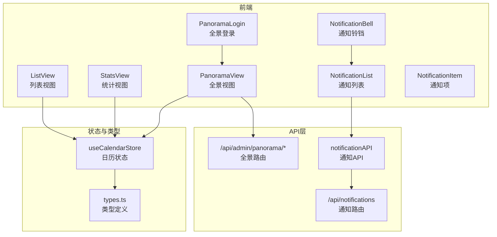
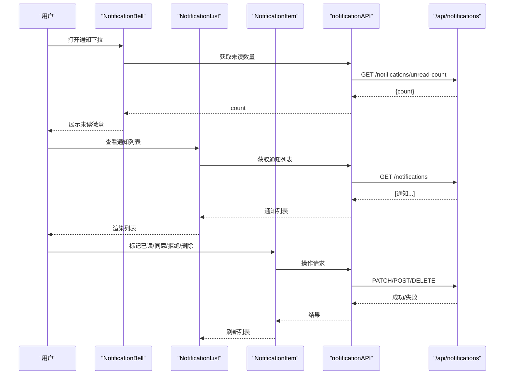
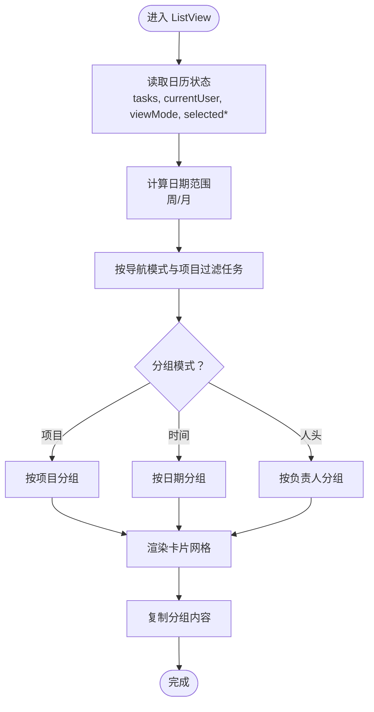
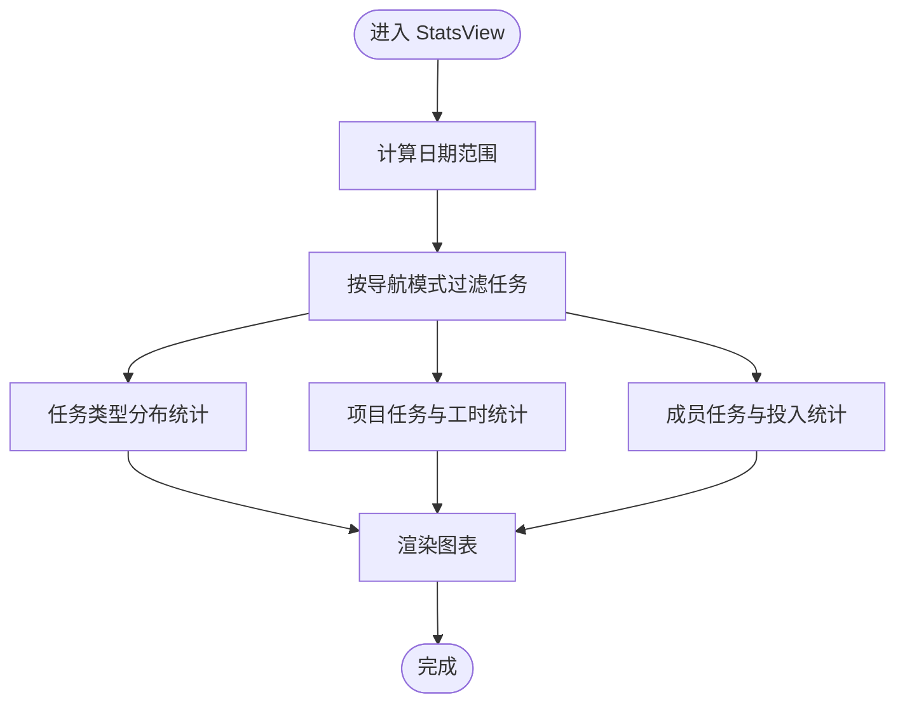
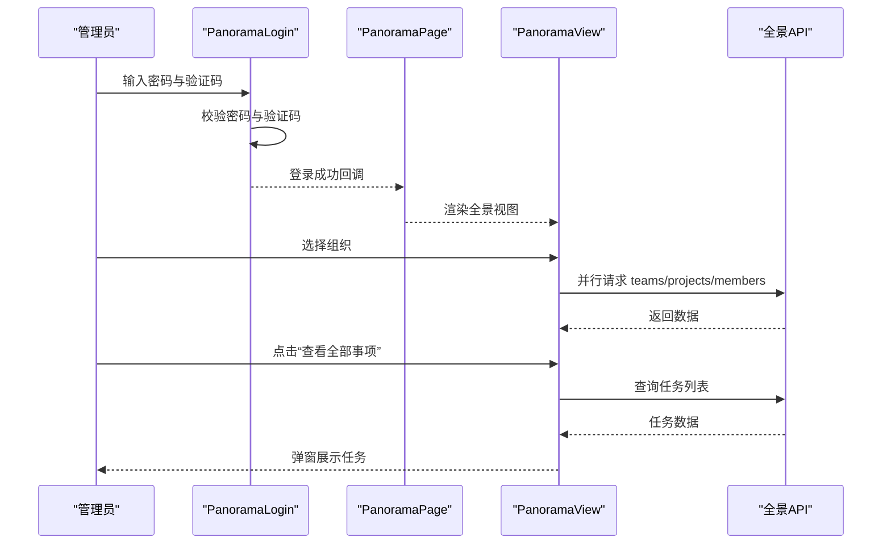
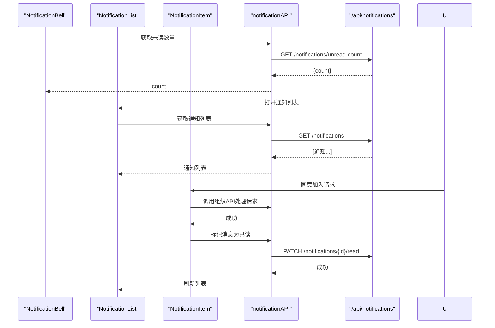
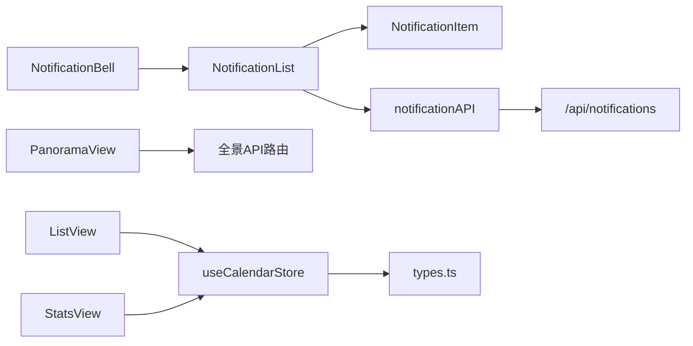

# 专用功能组件

<cite>
**本文引用的文件**
- [app/admin/panorama/page.tsx](file://app/admin/panorama/page.tsx)
- [components/admin/panorama-login.tsx](file://components/admin/panorama-login.tsx)
- [components/admin/panorama-view.tsx](file://components/admin/panorama-view.tsx)
- [app/api/admin/panorama/organizations/route.ts](file://app/api/admin/panorama/organizations/route.ts)
- [app/api/admin/panorama/organizations/[id]/route.ts](file://app/api/admin/panorama/organizations/[id]/route.ts)
- [app/api/admin/panorama/organizations/[id]/members/route.ts](file://app/api/admin/panorama/organizations/[id]/members/route.ts)
- [app/api/admin/panorama/organizations/[id]/projects/route.ts](file://app/api/admin/panorama/organizations/[id]/projects/route.ts)
- [app/api/admin/panorama/organizations/[id]/teams/route.ts](file://app/api/admin/panorama/organizations/[id]/teams/route.ts)
- [app/api/admin/panorama/tasks/route.ts](file://app/api/admin/panorama/tasks/route.ts)
- [components/views/list-view.tsx](file://components/views/list-view.tsx)
- [components/views/stats-view.tsx](file://components/views/stats-view.tsx)
- [components/views/list-group-toggle.tsx](file://components/views/list-group-toggle.tsx)
- [components/views/list-layout-toggle.tsx](file://components/views/list-layout-toggle.tsx)
- [lib/store/calendar-store.ts](file://lib/store/calendar-store.ts)
- [components/notification-bell.tsx](file://components/notification-bell.tsx)
- [components/notification-list.tsx](file://components/notification-list.tsx)
- [components/notification-item.tsx](file://components/notification-item.tsx)
- [lib/api/notification.ts](file://lib/api/notification.ts)
- [app/api/notifications/route.ts](file://app/api/notifications/route.ts)
- [lib/types.ts](file://lib/types.ts)
</cite>

## 目录
1. [简介](#简介)
2. [项目结构](#项目结构)
3. [核心组件](#核心组件)
4. [架构总览](#架构总览)
5. [组件详解](#组件详解)
6. [依赖关系分析](#依赖关系分析)
7. [性能考量](#性能考量)
8. [故障排查指南](#故障排查指南)
9. [结论](#结论)
10. [附录](#附录)

## 简介
本文件聚焦系统中的“专用功能组件”，涵盖以下能力：
- 列表视图：支持按项目/时间/人头分组与多列布局的可定制清单展示
- 统计视图：提供任务类型分布、项目任务与工时、成员任务与投入天数的可视化统计
- 全景管理：超级管理员的组织全貌视图，支持组织信息编辑、删除以及成员/团队/项目/任务的快速查看
- 通知系统：未读计数轮询、消息列表、操作动作（标记已读、一键清空、删除）、组织加入/邀请的交互处理
- 用户管理：通过全景视图对组织成员进行管理，支持成员任务聚合查看

这些组件通过统一的状态存储与API层协作，形成清晰的数据流与交互链路。

## 项目结构
围绕专用功能组件的关键目录与文件：
- 视图与页面
  - 列表视图与统计视图：components/views/*
  - 全景管理页面：app/admin/panorama/*
  - 通知入口与列表：components/notification-*.tsx
- 状态与类型
  - 日历状态存储：lib/store/calendar-store.ts
  - 类型定义：lib/types.ts
- API层
  - 通知API：lib/api/notification.ts
  - 后端路由：app/api/* 与 app/api/admin/panorama/*

图表来源
- [components/views/list-view.tsx](file://components/views/list-view.tsx#L22-L374)
- [components/views/stats-view.tsx](file://components/views/stats-view.tsx#L12-L309)
- [components/admin/panorama-login.tsx](file://components/admin/panorama-login.tsx#L16-L148)
- [components/admin/panorama-view.tsx](file://components/admin/panorama-view.tsx#L142-L823)
- [components/notification-bell.tsx](file://components/notification-bell.tsx#L16-L76)
- [components/notification-list.tsx](file://components/notification-list.tsx#L17-L177)
- [components/notification-item.tsx](file://components/notification-item.tsx#L30-L364)
- [lib/store/calendar-store.ts](file://lib/store/calendar-store.ts#L200-L800)
- [lib/api/notification.ts](file://lib/api/notification.ts#L20-L70)
- [app/api/notifications/route.ts](file://app/api/notifications/route.ts#L6-L103)
- [app/api/admin/panorama/organizations/route.ts](file://app/api/admin/panorama/organizations/route.ts)
- [app/api/admin/panorama/organizations/[id]/route.ts](file://app/api/admin/panorama/organizations/[id]/route.ts)
- [app/api/admin/panorama/organizations/[id]/members/route.ts](file://app/api/admin/panorama/organizations/[id]/members/route.ts)
- [app/api/admin/panorama/organizations/[id]/projects/route.ts](file://app/api/admin/panorama/organizations/[id]/projects/route.ts)
- [app/api/admin/panorama/organizations/[id]/teams/route.ts](file://app/api/admin/panorama/organizations/[id]/teams/route.ts)
- [app/api/admin/panorama/tasks/route.ts](file://app/api/admin/panorama/tasks/route.ts)

章节来源
- [components/views/list-view.tsx](file://components/views/list-view.tsx#L22-L374)
- [components/views/stats-view.tsx](file://components/views/stats-view.tsx#L12-L309)
- [components/admin/panorama-login.tsx](file://components/admin/panorama-login.tsx#L16-L148)
- [components/admin/panorama-view.tsx](file://components/admin/panorama-view.tsx#L142-L823)
- [components/notification-bell.tsx](file://components/notification-bell.tsx#L16-L76)
- [components/notification-list.tsx](file://components/notification-list.tsx#L17-L177)
- [components/notification-item.tsx](file://components/notification-item.tsx#L30-L364)
- [lib/store/calendar-store.ts](file://lib/store/calendar-store.ts#L200-L800)
- [lib/api/notification.ts](file://lib/api/notification.ts#L20-L70)
- [app/api/notifications/route.ts](file://app/api/notifications/route.ts#L6-L103)

## 核心组件
- 列表视图（ListView）
  - 支持按项目/时间/人头三种分组模式，支持1-4列网格布局
  - 基于日历状态过滤与分组，渲染任务卡片并支持复制分组内容
- 统计视图（StatsView）
  - 提供任务总览、任务类型分布饼图、项目任务与工时柱状图、成员任务与投入天数横向柱状图
  - 基于当前日期范围与导航模式过滤任务
- 全景管理（PanoramaView + PanoramaLogin）
  - 超级管理员登录后进入全景视图，可浏览所有组织、团队、项目、成员与任务
  - 支持组织信息编辑、删除；支持查看成员与任务聚合
- 通知系统（NotificationBell + NotificationList + NotificationItem）
  - 未读计数定时轮询；消息列表支持标记已读、一键清空、逐条删除
  - 针对组织加入/邀请请求提供同意/拒绝操作
- 用户管理（PanoramaView）
  - 在全景视图中查看与聚合成员任务，便于管理员掌握组织人员负载

章节来源
- [components/views/list-view.tsx](file://components/views/list-view.tsx#L22-L374)
- [components/views/stats-view.tsx](file://components/views/stats-view.tsx#L12-L309)
- [components/admin/panorama-login.tsx](file://components/admin/panorama-login.tsx#L16-L148)
- [components/admin/panorama-view.tsx](file://components/admin/panorama-view.tsx#L142-L823)
- [components/notification-bell.tsx](file://components/notification-bell.tsx#L16-L76)
- [components/notification-list.tsx](file://components/notification-list.tsx#L17-L177)
- [components/notification-item.tsx](file://components/notification-item.tsx#L30-L364)

## 架构总览
专用功能组件的运行时交互流程如下：

图表来源
- [components/notification-bell.tsx](file://components/notification-bell.tsx#L20-L45)
- [components/notification-list.tsx](file://components/notification-list.tsx#L24-L100)
- [components/notification-item.tsx](file://components/notification-item.tsx#L106-L237)
- [lib/api/notification.ts](file://lib/api/notification.ts#L20-L70)
- [app/api/notifications/route.ts](file://app/api/notifications/route.ts#L6-L103)

## 组件详解

### 列表视图（ListView）
- 分组与过滤
  - 根据导航模式（My Days/Team/Project）与项目过滤器筛选任务
  - 日期范围计算：周视图或月视图起止时间
  - 分组策略：按项目、按时间（日期）、按人头（负责人）
- 布局与交互
  - 支持1-4列网格布局，动态生成CSS类名
  - 每个分组卡片支持复制为纯文本内容
- 数据与类型
  - 使用日历状态存储的任务、项目、用户、团队数据
  - 任务类型标签与颜色映射

图表来源
- [components/views/list-view.tsx](file://components/views/list-view.tsx#L42-L194)
- [lib/store/calendar-store.ts](file://lib/store/calendar-store.ts#L200-L800)
- [lib/types.ts](file://lib/types.ts#L127-L141)

章节来源
- [components/views/list-view.tsx](file://components/views/list-view.tsx#L22-L374)
- [components/views/list-group-toggle.tsx](file://components/views/list-group-toggle.tsx#L8-L39)
- [components/views/list-layout-toggle.tsx](file://components/views/list-layout-toggle.tsx#L8-L39)
- [lib/store/calendar-store.ts](file://lib/store/calendar-store.ts#L200-L800)
- [lib/types.ts](file://lib/types.ts#L127-L141)

### 统计视图（StatsView）
- 过滤与聚合
  - 导航模式与日期范围过滤
  - 任务类型分布（日常/会议/假期）
  - 项目维度：任务数与工作天数
  - 成员维度：任务数与投入天数（排序）
- 可视化
  - 饼图：任务类型占比
  - 柱状图：项目任务数与工作天数
  - 横向柱状图：成员任务数与投入天数

图表来源
- [components/views/stats-view.tsx](file://components/views/stats-view.tsx#L29-L172)
- [lib/store/calendar-store.ts](file://lib/store/calendar-store.ts#L200-L800)
- [lib/types.ts](file://lib/types.ts#L127-L141)

章节来源
- [components/views/stats-view.tsx](file://components/views/stats-view.tsx#L12-L309)
- [lib/store/calendar-store.ts](file://lib/store/calendar-store.ts#L200-L800)
- [lib/types.ts](file://lib/types.ts#L127-L141)

### 全景管理（PanoramaView + PanoramaLogin）
- 登录与会话
  - 管理员密码校验与验证码校验
  - 登录成功写入会话存储，切换到全景视图
- 组织与详情
  - 列出所有组织，支持选择组织查看团队/项目/成员
  - 支持查看组织下的全部任务
  - 支持编辑组织名称与认证状态、删除组织（需满足约束）
- 成员与任务聚合
  - 成员卡片展示角色与任务数量
  - 团队/项目卡片展示成员与任务数量
  - 通过“查看全部事项”弹窗展示具体任务明细

图表来源
- [components/admin/panorama-login.tsx](file://components/admin/panorama-login.tsx#L36-L63)
- [app/admin/panorama/page.tsx](file://app/admin/panorama/page.tsx#L7-L29)
- [components/admin/panorama-view.tsx](file://components/admin/panorama-view.tsx#L169-L228)
- [components/admin/panorama-view.tsx](file://components/admin/panorama-view.tsx#L230-L254)
- [app/api/admin/panorama/organizations/route.ts](file://app/api/admin/panorama/organizations/route.ts)
- [app/api/admin/panorama/organizations/[id]/members/route.ts](file://app/api/admin/panorama/organizations/[id]/members/route.ts)
- [app/api/admin/panorama/organizations/[id]/projects/route.ts](file://app/api/admin/panorama/organizations/[id]/projects/route.ts)
- [app/api/admin/panorama/organizations/[id]/teams/route.ts](file://app/api/admin/panorama/organizations/[id]/teams/route.ts)
- [app/api/admin/panorama/tasks/route.ts](file://app/api/admin/panorama/tasks/route.ts)

章节来源
- [app/admin/panorama/page.tsx](file://app/admin/panorama/page.tsx#L7-L29)
- [components/admin/panorama-login.tsx](file://components/admin/panorama-login.tsx#L16-L148)
- [components/admin/panorama-view.tsx](file://components/admin/panorama-view.tsx#L142-L823)

### 通知系统（NotificationBell + NotificationList + NotificationItem）
- 未读计数轮询
  - 初始化与打开下拉菜单时刷新未读数量
  - 每30秒轮询一次
- 列表与操作
  - 获取通知列表，标记已读、一键清空、逐条删除
  - 操作完成后刷新列表并更新未读计数
- 业务动作
  - 组织加入请求：同意/拒绝（更新请求状态与消息状态）
  - 组织邀请：接受/拒绝（切换用户组织）

图表来源
- [components/notification-bell.tsx](file://components/notification-bell.tsx#L20-L45)
- [components/notification-list.tsx](file://components/notification-list.tsx#L24-L100)
- [components/notification-item.tsx](file://components/notification-item.tsx#L106-L237)
- [lib/api/notification.ts](file://lib/api/notification.ts#L20-L70)
- [app/api/notifications/route.ts](file://app/api/notifications/route.ts#L6-L103)

章节来源
- [components/notification-bell.tsx](file://components/notification-bell.tsx#L16-L76)
- [components/notification-list.tsx](file://components/notification-list.tsx#L17-L177)
- [components/notification-item.tsx](file://components/notification-item.tsx#L30-L364)
- [lib/api/notification.ts](file://lib/api/notification.ts#L20-L70)
- [app/api/notifications/route.ts](file://app/api/notifications/route.ts#L6-L103)

## 依赖关系分析
- 组件耦合
  - ListView/StatsView 依赖日历状态存储，解耦于UI与数据源
  - 通知组件通过API模块与后端路由解耦
  - 全景视图通过API路由与数据库交互
- 外部依赖
  - 图表库：recharts（统计视图）
  - 日期工具：date-fns（日期范围与格式化）
  - 状态管理：zustand（日历状态）
- 潜在循环依赖
  - 未发现直接循环依赖；组件间通过状态与API层间接通信

图表来源
- [components/views/list-view.tsx](file://components/views/list-view.tsx#L22-L374)
- [components/views/stats-view.tsx](file://components/views/stats-view.tsx#L12-L309)
- [components/admin/panorama-view.tsx](file://components/admin/panorama-view.tsx#L142-L823)
- [components/notification-bell.tsx](file://components/notification-bell.tsx#L16-L76)
- [components/notification-list.tsx](file://components/notification-list.tsx#L17-L177)
- [components/notification-item.tsx](file://components/notification-item.tsx#L30-L364)
- [lib/store/calendar-store.ts](file://lib/store/calendar-store.ts#L200-L800)
- [lib/api/notification.ts](file://lib/api/notification.ts#L20-L70)
- [app/api/notifications/route.ts](file://app/api/notifications/route.ts#L6-L103)
- [lib/types.ts](file://lib/types.ts#L1-L141)

章节来源
- [lib/store/calendar-store.ts](file://lib/store/calendar-store.ts#L200-L800)
- [lib/types.ts](file://lib/types.ts#L1-L141)

## 性能考量
- 列表视图
  - 使用 useMemo 缓存过滤与分组结果，减少重复计算
  - 网格布局按列数动态生成，避免过度DOM节点
- 统计视图
  - 仅在任务集合变化时重新计算统计，图表容器响应式适配
- 通知系统
  - 未读计数每30秒轮询一次，避免频繁请求
  - 列表加载与删除时使用覆盖层提示，提升交互反馈
- 全景视图
  - 选择组织后并行请求团队/项目/成员数据，缩短等待时间
  - 事项弹窗采用虚拟滚动容器，限制最大高度

## 故障排查指南
- 列表视图无数据
  - 检查当前导航模式与项目过滤器是否为空
  - 确认日历状态中任务数据已加载
- 统计视图无数据
  - 检查日期范围与导航模式过滤条件
  - 确认任务集合非空且包含有效日期
- 通知未读计数不更新
  - 检查轮询间隔与网络请求状态
  - 确认后端路由返回正确格式
- 全景视图组织删除失败
  - 确认组织无成员/团队/项目，满足删除前置条件
  - 检查API返回的错误信息并提示用户

章节来源
- [components/views/list-view.tsx](file://components/views/list-view.tsx#L56-L114)
- [components/views/stats-view.tsx](file://components/views/stats-view.tsx#L44-L106)
- [components/notification-bell.tsx](file://components/notification-bell.tsx#L20-L45)
- [components/admin/panorama-view.tsx](file://components/admin/panorama-view.tsx#L306-L340)

## 结论
专用功能组件围绕“可配置的列表视图、可视化的统计视图、管理员级的全景管理、完善的通知系统”构建，通过统一的状态与API层实现高内聚低耦合。组件具备良好的扩展性与可维护性，适合在多组织、多团队场景下进一步增强权限控制与数据聚合能力。

## 附录
- 高级配置与自定义扩展
  - 列表视图：新增分组模式或布局列数，可在状态存储中扩展枚举并在UI中映射
  - 统计视图：新增指标（如任务优先级分布）只需扩展聚合逻辑与图表渲染
  - 通知系统：新增通知类型与动作，需同步扩展API与后端路由
  - 全景视图：新增组织维度统计或任务类型，需扩展后端聚合查询
- 集成方法
  - 将ListView/StatsView作为页面子视图集成，通过状态存储驱动
  - 将NotificationBell集成至全局导航，NotificationList作为下拉面板
  - 将PanoramaView集成到管理员入口，配合后端路由提供数据
- 使用场景与最佳实践
  - 列表视图：适用于日常任务浏览与导出
  - 统计视图：适用于项目复盘与资源分配
  - 通知系统：适用于自动化流程与审批闭环
  - 全景视图：适用于组织治理与审计追踪