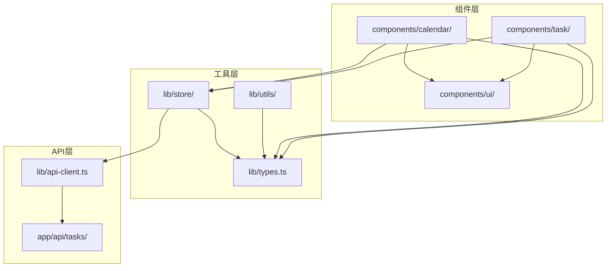
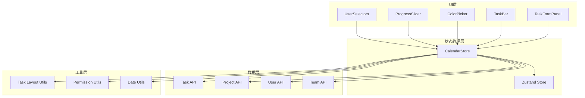
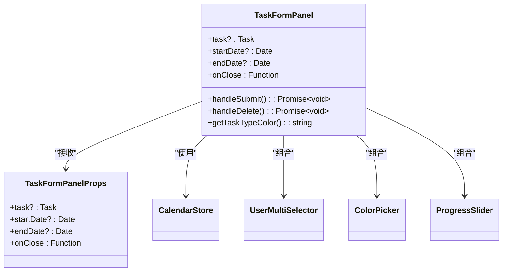
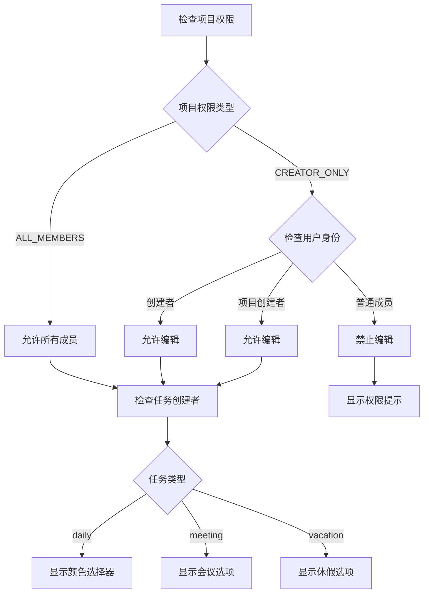
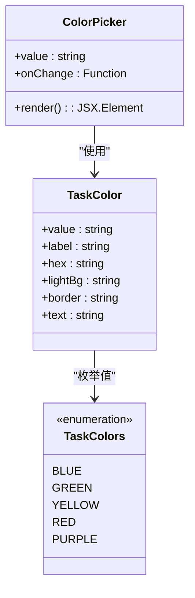
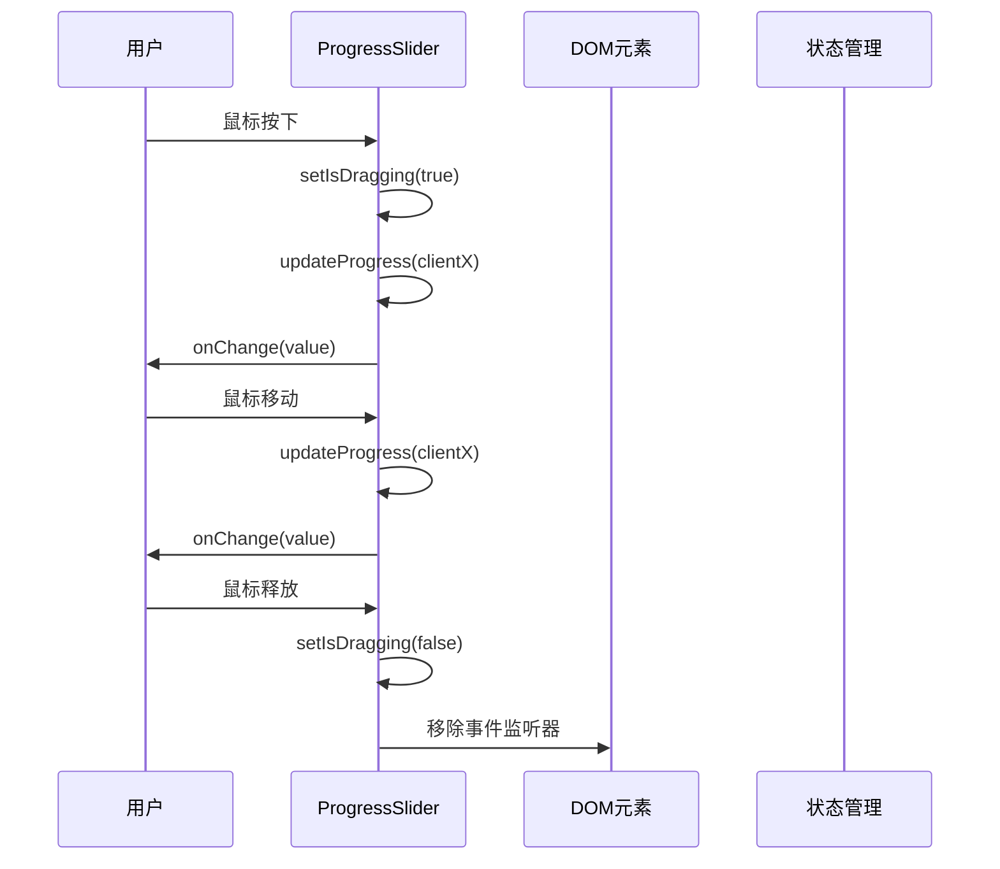
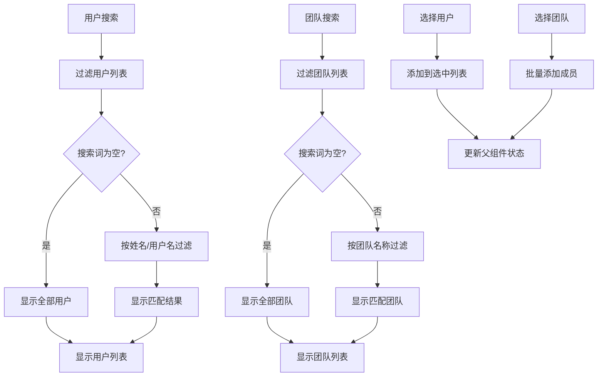
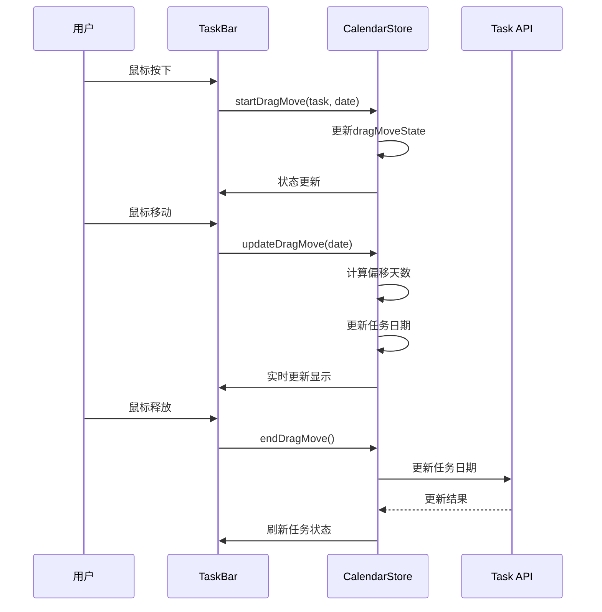
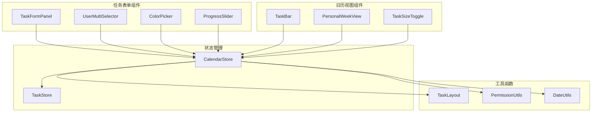

# 任务管理组件

<cite>
**本文档引用的文件**
- [task-form-panel.tsx](file://components/task/task-form-panel.tsx)
- [color-picker.tsx](file://components/task/color-picker.tsx)
- [progress-slider.tsx](file://components/task/progress-slider.tsx)
- [progress-circle.tsx](file://components/task/progress-circle.tsx)
- [user-selector.tsx](file://components/task/user-selector.tsx)
- [user-multi-selector.tsx](file://components/task/user-multi-selector.tsx)
- [task-bar.tsx](file://components/calendar/task-bar.tsx)
- [task-size-toggle.tsx](file://components/calendar/task-size-toggle.tsx)
- [personal-week-view.tsx](file://components/calendar/personal-week-view.tsx)
- [task-layout.ts](file://lib/utils/task-layout.ts)
- [calendar-store.ts](file://lib/store/calendar-store.ts)
- [types.ts](file://lib/types.ts)
</cite>

## 目录
1. [简介](#简介)
2. [项目结构](#项目结构)
3. [核心组件](#核心组件)
4. [架构概览](#架构概览)
5. [详细组件分析](#详细组件分析)
6. [依赖关系分析](#依赖关系分析)
7. [性能考量](#性能考量)
8. [故障排除指南](#故障排除指南)
9. [结论](#结论)
10. [附录](#附录)

## 简介

任务管理组件是日历应用中的核心功能模块，提供了完整的任务生命周期管理能力。该系统支持多种任务类型、丰富的交互功能和灵活的权限控制机制。组件采用现代化的React Hooks和Zustand状态管理，结合Tailwind CSS进行样式定制，实现了高性能、可扩展的任务管理解决方案。

## 项目结构

任务管理组件主要分布在以下目录结构中：

**图表来源**
- [task-form-panel.tsx](file://components/task/task-form-panel.tsx#L1-L627)
- [calendar-store.ts](file://lib/store/calendar-store.ts#L1-L800)

**章节来源**
- [task-form-panel.tsx](file://components/task/task-form-panel.tsx#L1-L627)
- [calendar-store.ts](file://lib/store/calendar-store.ts#L1-L800)

## 核心组件

任务管理系统的五大核心组件构成了完整的功能体系：

### 1. 任务表单面板 (TaskFormPanel)
- **功能**: 提供任务创建和编辑的完整表单界面
- **特性**: 支持多项目选择、多负责人管理、颜色选择、进度控制
- **权限**: 基于项目权限的动态控制

### 2. 颜色选择器 (ColorPicker)
- **功能**: 提供预定义的颜色选择界面
- **特性**: 支持12种颜色方案，视觉反馈明确

### 3. 进度滑块 (ProgressSlider)
- **功能**: 提供直观的进度条拖拽控制
- **特性**: 支持拖拽、键盘输入、快速数值选择

### 4. 用户选择器 (UserSelector/UserMultiSelector)
- **功能**: 提供单用户和多用户的选择界面
- **特性**: 支持搜索过滤、团队批量选择、权限控制

### 5. 任务条 (TaskBar)
- **功能**: 在日历视图中显示任务条
- **特性**: 支持拖拽移动、进度拖拽、多用户头像显示

**章节来源**
- [task-form-panel.tsx](file://components/task/task-form-panel.tsx#L42-L47)
- [color-picker.tsx](file://components/task/color-picker.tsx#L6-L9)
- [progress-slider.tsx](file://components/task/progress-slider.tsx#L9-L13)
- [user-selector.tsx](file://components/task/user-selector.tsx#L18-L23)
- [user-multi-selector.tsx](file://components/task/user-multi-selector.tsx#L18-L24)

## 架构概览

系统采用分层架构设计，确保各组件职责清晰、耦合度低：

**图表来源**
- [calendar-store.ts](file://lib/store/calendar-store.ts#L200-L200)
- [task-form-panel.tsx](file://components/task/task-form-panel.tsx#L49-L63)

## 详细组件分析

### 任务表单面板 (TaskFormPanel)

#### 组件架构

**图表来源**
- [task-form-panel.tsx](file://components/task/task-form-panel.tsx#L42-L47)
- [task-form-panel.tsx](file://components/task/task-form-panel.tsx#L49-L63)

#### 数据绑定机制
组件使用React状态管理任务表单的数据绑定：

| 字段 | 类型 | 绑定方式 | 验证规则 |
|------|------|----------|----------|
| title | string | useState | 必填，非空 |
| description | string | useState | 可选 |
| dateRange | object | useState | 必填，日期有效 |
| startTime | string | useState | 可选 |
| endTime | string | useState | 可选 |
| taskType | TaskType | useState | 枚举值 |
| color | string | useState | 颜色值 |
| progress | number | useState | 0-100 |
| projectId | string | useState | 项目存在 |
| assigneeIds | string[] | useState | 至少一个 |

#### 权限控制逻辑

**图表来源**
- [task-form-panel.tsx](file://components/task/task-form-panel.tsx#L108-L114)

#### 表单验证规则
- **必填字段**: 标题、项目、负责人
- **日期验证**: 开始日期必须早于等于结束日期
- **权限验证**: 基于项目权限和用户身份
- **业务规则**: 个人项目自动绑定当前用户

**章节来源**
- [task-form-panel.tsx](file://components/task/task-form-panel.tsx#L124-L210)
- [task-form-panel.tsx](file://components/task/task-form-panel.tsx#L142-L150)

### 颜色选择器 (ColorPicker)

#### 颜色配置系统

**图表来源**
- [color-picker.tsx](file://components/task/color-picker.tsx#L6-L9)
- [types.ts](file://lib/types.ts#L133-L139)

#### 交互行为
- **点击选择**: 点击颜色按钮触发onChange回调
- **视觉反馈**: 选中颜色显示对勾图标，放大效果
- **无障碍支持**: 提供title和aria-label属性

**章节来源**
- [color-picker.tsx](file://components/task/color-picker.tsx#L11-L52)

### 进度滑块 (ProgressSlider)

#### 拖拽控制系统

**图表来源**
- [progress-slider.tsx](file://components/task/progress-slider.tsx#L26-L59)

#### 输入验证机制
- **范围限制**: 0-100之间的整数
- **实时验证**: 输入时即时验证并修正
- **键盘支持**: 支持键盘输入和焦点管理

**章节来源**
- [progress-slider.tsx](file://components/task/progress-slider.tsx#L61-L73)

### 用户选择器 (UserSelector/UserMultiSelector)

#### 多用户选择器功能

**图表来源**
- [user-multi-selector.tsx](file://components/task/user-multi-selector.tsx#L42-L54)

#### 权限控制机制
- **锁定用户**: 创建者不可移除，确保任务完整性
- **组织过滤**: 仅显示当前组织的用户和团队
- **团队批量操作**: 支持团队全选/取消选择

**章节来源**
- [user-multi-selector.tsx](file://components/task/user-multi-selector.tsx#L60-L91)

### 任务条 (TaskBar)

#### 拖拽移动实现

**图表来源**
- [task-bar.tsx](file://components/calendar/task-bar.tsx#L102-L110)
- [calendar-store.ts](file://lib/store/calendar-store.ts#L1167-L1270)

#### 进度拖拽功能
- **段内进度**: 支持在任务条段内拖拽调整进度
- **跨段计算**: 自动计算总进度百分比
- **乐观更新**: 实时更新UI，失败时自动回滚

**章节来源**
- [task-bar.tsx](file://components/calendar/task-bar.tsx#L280-L381)

## 依赖关系分析

### 组件间依赖关系

**图表来源**
- [calendar-store.ts](file://lib/store/calendar-store.ts#L200-L200)
- [task-layout.ts](file://lib/utils/task-layout.ts#L28-L68)

### 数据流分析
系统采用单向数据流设计，确保状态一致性：

1. **用户交互** → **组件状态** → **状态管理** → **API调用** → **数据更新** → **UI刷新**

2. **权限控制** → **状态管理** → **组件渲染** → **功能启用/禁用**

3. **拖拽操作** → **乐观更新** → **异步同步** → **错误回滚**

**章节来源**
- [calendar-store.ts](file://lib/store/calendar-store.ts#L550-L748)
- [task-layout.ts](file://lib/utils/task-layout.ts#L28-L68)

## 性能考量

### 优化策略

#### 1. 渲染性能优化
- **虚拟滚动**: 大列表使用虚拟滚动减少DOM节点
- **记忆化**: 使用useMemo和useCallback避免不必要的重渲染
- **条件渲染**: 根据权限和状态动态渲染组件

#### 2. 状态管理优化
- **局部状态**: 组件内部状态与全局状态分离
- **批量更新**: 使用批量状态更新减少重渲染
- **持久化**: 使用Zustand持久化存储提升用户体验

#### 3. API调用优化
- **并发请求**: 使用Promise.all并行加载数据
- **缓存策略**: 合理的缓存和失效机制
- **错误处理**: 完善的错误边界和降级策略

### 内存管理
- **事件监听器**: 组件卸载时及时清理事件监听器
- **定时器**: 使用useEffect返回清理函数管理定时器
- **大对象**: 避免在组件中创建大型临时对象

## 故障排除指南

### 常见问题及解决方案

#### 1. 任务权限问题
**症状**: 无法编辑或删除任务
**原因**: 用户权限不足或项目权限设置
**解决**:
- 检查用户在项目中的角色
- 验证项目权限设置
- 确认任务创建者身份

#### 2. 拖拽功能异常
**症状**: 拖拽创建或移动任务失败
**原因**: 浏览器兼容性或事件冲突
**解决**:
- 检查浏览器支持情况
- 确认事件监听器正确绑定
- 验证拖拽状态管理

#### 3. 进度更新失败
**症状**: 进度条无法拖拽或显示异常
**原因**: 网络请求失败或状态不同步
**解决**:
- 检查网络连接状态
- 验证API响应格式
- 确认乐观更新机制

**章节来源**
- [calendar-store.ts](file://lib/store/calendar-store.ts#L550-L748)
- [task-bar.tsx](file://components/calendar/task-bar.tsx#L364-L377)

## 结论

任务管理组件系统展现了现代前端开发的最佳实践，通过合理的架构设计、完善的权限控制和优秀的用户体验，构建了一个功能完整、性能优异的任务管理系统。组件间的协作机制清晰，状态管理高效，为后续功能扩展奠定了坚实基础。

系统的主要优势包括：
- **模块化设计**: 组件职责明确，易于维护和扩展
- **权限控制**: 细粒度的权限管理确保数据安全
- **用户体验**: 流畅的交互和响应式设计
- **性能优化**: 多层次的性能优化策略

## 附录

### 配置选项

#### 任务类型配置
| 类型 | 颜色 | 用途 | 特殊属性 |
|------|------|------|----------|
| daily | 蓝色 | 日常任务 | 支持颜色选择和进度 |
| meeting | 黄色 | 会议安排 | 时间范围显示 |
| vacation | 红色 | 休假计划 | 无颜色选择 |

#### 样式定制
- **颜色主题**: 支持12种预定义颜色
- **尺寸调节**: 紧凑型和宽松型两种显示模式
- **布局适配**: 响应式布局支持不同屏幕尺寸

#### 扩展方法
- **自定义颜色**: 通过TASK_COLORS配置新增颜色
- **权限扩展**: 通过权限工具类扩展权限控制
- **组件定制**: 通过props和CSS变量定制外观