# 侧边栏导航组件

<cite>
**本文档引用的文件**
- [navigation-menu.tsx](file://components/sidebar/navigation-menu.tsx)
- [team-dialog.tsx](file://components/sidebar/team-dialog.tsx)
- [project-dialog.tsx](file://components/sidebar/project-dialog.tsx)
- [mini-calendar.tsx](file://components/sidebar/mini-calendar.tsx)
- [main-navigation.tsx](file://components/navigation/main-navigation.tsx)
- [calendar-store.ts](file://lib/store/calendar-store.ts)
- [types.ts](file://lib/types.ts)
- [page.tsx](file://app/page.tsx)
- [sidebar.tsx](file://components/ui/sidebar.tsx)
- [use-mobile.tsx](file://hooks/use-mobile.ts)
</cite>

## 目录
1. [简介](#简介)
2. [项目结构](#项目结构)
3. [核心组件](#核心组件)
4. [架构概览](#架构概览)
5. [详细组件分析](#详细组件分析)
6. [依赖关系分析](#依赖关系分析)
7. [性能考虑](#性能考虑)
8. [故障排除指南](#故障排除指南)
9. [结论](#结论)

## 简介

本文件详细介绍应用的侧边栏导航系统组件，包括导航菜单、团队对话框、项目对话框和迷你日历等核心功能。该导航系统采用现代化的响应式设计，支持桌面端和移动端的无缝切换，提供完整的团队协作和项目管理功能。

## 项目结构

导航系统主要由以下层次组成：

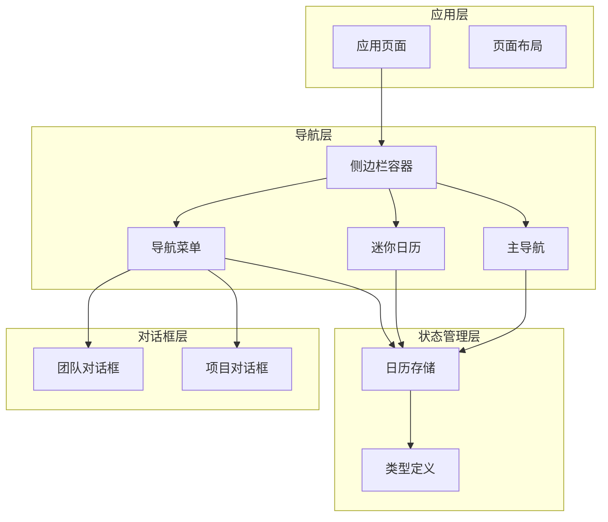

**图表来源**
- [page.tsx](file://app/page.tsx#L148-L182)
- [navigation-menu.tsx](file://components/sidebar/navigation-menu.tsx#L205-L560)
- [mini-calendar.tsx](file://components/sidebar/mini-calendar.tsx#L10-L114)

**章节来源**
- [page.tsx](file://app/page.tsx#L148-L182)
- [sidebar.tsx](file://components/ui/sidebar.tsx#L154-L206)

## 核心组件

### 导航菜单组件

导航菜单是侧边栏的核心组件，提供以下功能：
- My Days 视图切换
- 团队列表管理
- 项目列表管理
- 团队/项目操作（创建、编辑、删除、退出）
- 默认团队设置

### 团队对话框

团队对话框提供完整的团队管理功能：
- 团队基本信息管理（名称、描述、颜色）
- 成员管理（多选用户选择器）
- 创建者权限管理
- 协同权限设置
- 表单验证和错误处理

### 项目对话框

项目对话框提供项目管理功能：
- 项目基本信息管理
- 成员管理功能
- 创建者权限控制
- 协同权限配置
- 只读模式支持

### 迷你日历

迷你日历提供快速日期导航功能：
- 月度视图展示
- 任务标记显示
- 今日高亮
- 月份切换
- 日期点击事件

**章节来源**
- [navigation-menu.tsx](file://components/sidebar/navigation-menu.tsx#L32-L561)
- [team-dialog.tsx](file://components/sidebar/team-dialog.tsx#L38-L241)
- [project-dialog.tsx](file://components/sidebar/project-dialog.tsx#L40-L243)
- [mini-calendar.tsx](file://components/sidebar/mini-calendar.tsx#L10-L114)

## 架构概览

导航系统采用分层架构设计，确保组件间的清晰分离和职责明确：

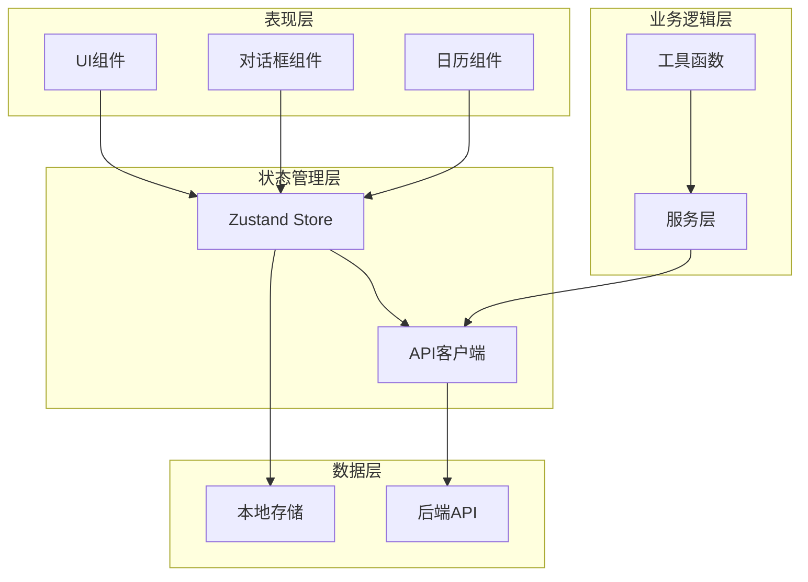

**图表来源**
- [calendar-store.ts](file://lib/store/calendar-store.ts#L200-L546)
- [types.ts](file://lib/types.ts#L127-L141)

## 详细组件分析

### 导航菜单组件详解

导航菜单组件实现了复杂的交互逻辑和状态管理：

#### 状态管理结构

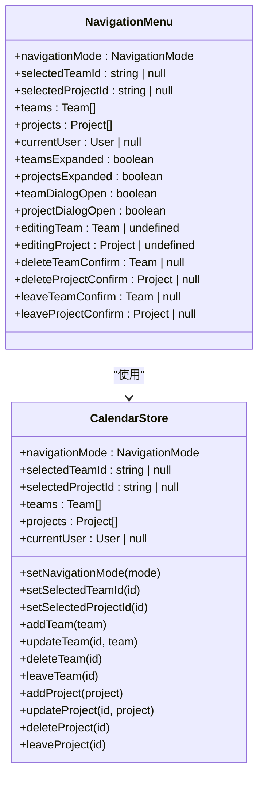

**图表来源**
- [navigation-menu.tsx](file://components/sidebar/navigation-menu.tsx#L32-L48)
- [calendar-store.ts](file://lib/store/calendar-store.ts#L33-L198)

#### 权限控制系统

组件实现了多层次的权限控制机制：

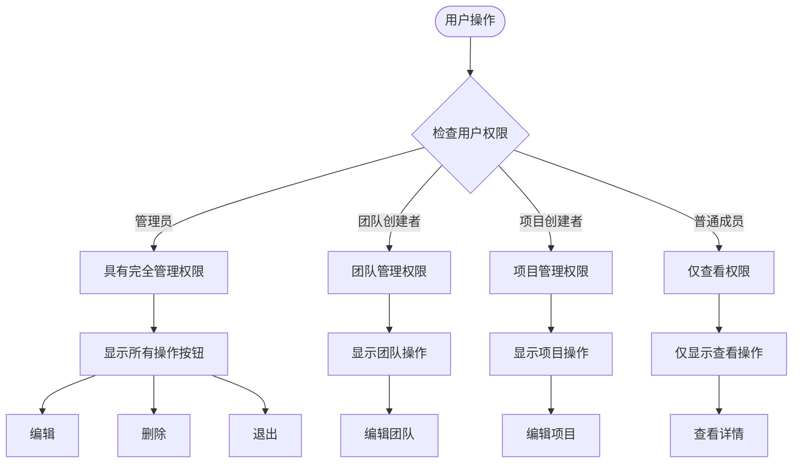

**图表来源**
- [navigation-menu.tsx](file://components/sidebar/navigation-menu.tsx#L87-L95)

#### 数据流处理

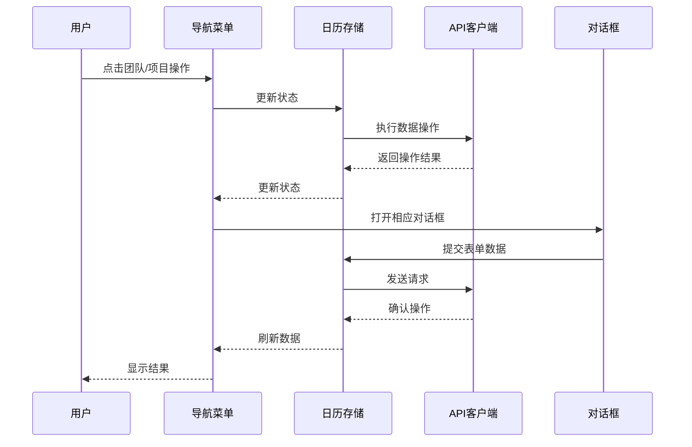

**图表来源**
- [navigation-menu.tsx](file://components/sidebar/navigation-menu.tsx#L193-L203)
- [calendar-store.ts](file://lib/store/calendar-store.ts#L120-L138)

**章节来源**
- [navigation-menu.tsx](file://components/sidebar/navigation-menu.tsx#L32-L561)
- [calendar-store.ts](file://lib/store/calendar-store.ts#L200-L546)

### 团队对话框组件

团队对话框提供了完整的团队管理功能：

#### 表单字段设计

| 字段 | 类型 | 必填 | 描述 |
|------|------|------|------|
| 名称 | String | 是 | 团队名称，必填且不能为空 |
| 描述 | String | 否 | 团队描述信息 |
| 颜色 | Color | 是 | 团队颜色标识，预设8种颜色 |
| 创建者 | User | 是 | 团队创建者，管理员可修改 |
| 成员 | Array | 是 | 团队成员列表，至少包含一个成员 |
| 协同权限 | Enum | 是 | ALL_MEMBERS 或 CREATOR_ONLY |

#### 表单验证流程

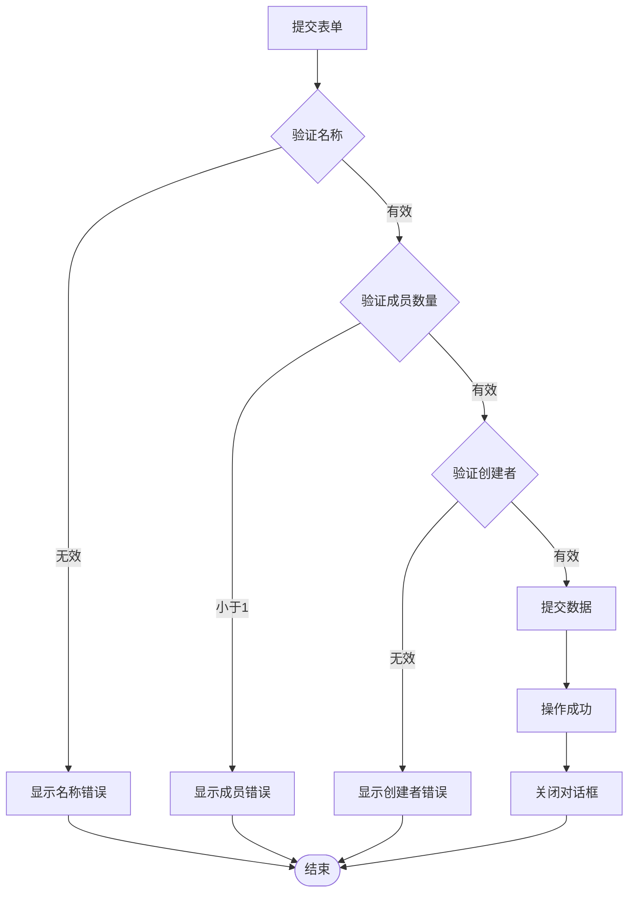

**图表来源**
- [team-dialog.tsx](file://components/sidebar/team-dialog.tsx#L60-L96)

**章节来源**
- [team-dialog.tsx](file://components/sidebar/team-dialog.tsx#L38-L241)

### 项目对话框组件

项目对话框与团队对话框类似，但有一些特定差异：

#### 项目特殊处理

- **个人事务项目**：系统会自动将包含"个人事务"的项目置顶显示
- **默认项目处理**：第一个项目（通常为个人事务）不显示编辑/删除按钮
- **权限继承**：项目权限设置影响任务协作行为

#### 项目排序逻辑

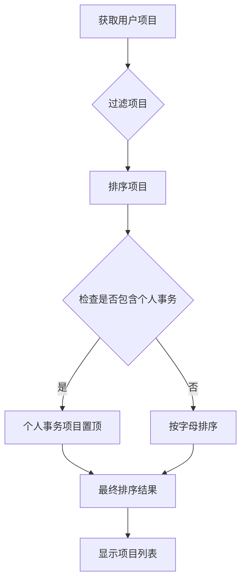

**图表来源**
- [navigation-menu.tsx](file://components/sidebar/navigation-menu.tsx#L66-L78)

**章节来源**
- [project-dialog.tsx](file://components/sidebar/project-dialog.tsx#L40-L243)
- [navigation-menu.tsx](file://components/sidebar/navigation-menu.tsx#L66-L78)

### 迷你日历组件

迷你日历提供了简洁的日期导航功能：

#### 日期处理逻辑

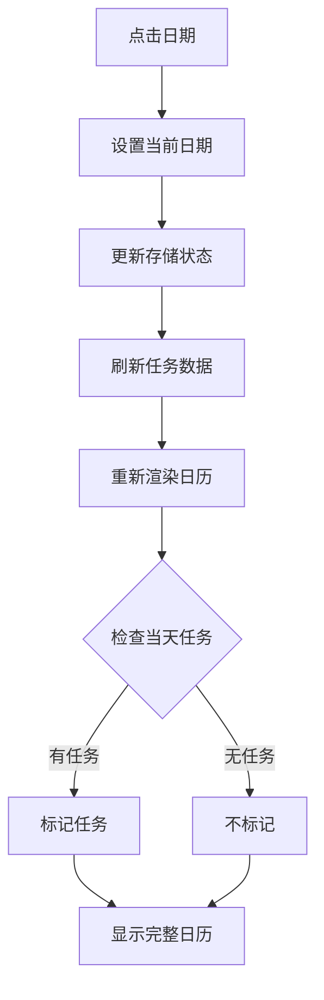

**图表来源**
- [mini-calendar.tsx](file://components/sidebar/mini-calendar.tsx#L44-L46)

#### 任务标记算法

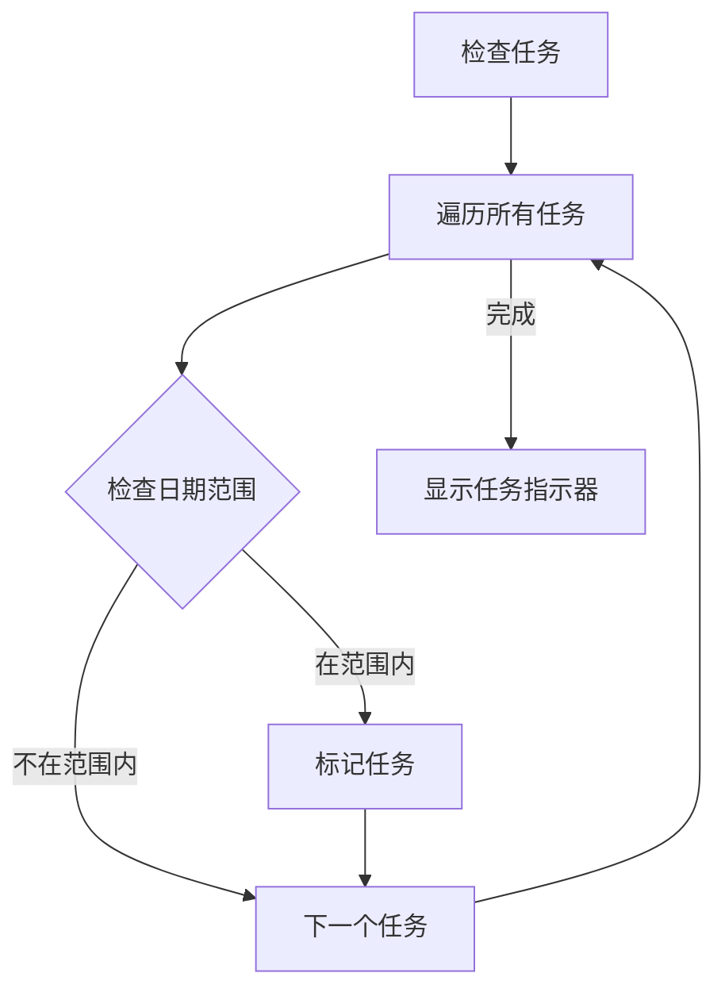

**图表来源**
- [mini-calendar.tsx](file://components/sidebar/mini-calendar.tsx#L33-L42)

**章节来源**
- [mini-calendar.tsx](file://components/sidebar/mini-calendar.tsx#L10-L114)

### 主导航组件

主导航组件提供三种视图模式的切换：

| 模式 | 图标 | 功能 | 适用场景 |
|------|------|------|----------|
| 日历 | 📅 | 日历视图 | 任务可视化展示 |
| 清单 | 📋 | 列表视图 | 任务列表管理 |
| 统计 | 📊 | 统计视图 | 数据分析和报告 |

**章节来源**
- [main-navigation.tsx](file://components/navigation/main-navigation.tsx#L8-L38)

## 依赖关系分析

### 组件间依赖关系

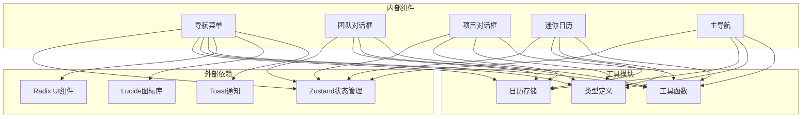

**图表来源**
- [navigation-menu.tsx](file://components/sidebar/navigation-menu.tsx#L1-L31)
- [team-dialog.tsx](file://components/sidebar/team-dialog.tsx#L1-L18)
- [project-dialog.tsx](file://components/sidebar/project-dialog.tsx#L1-L18)

### 状态管理依赖

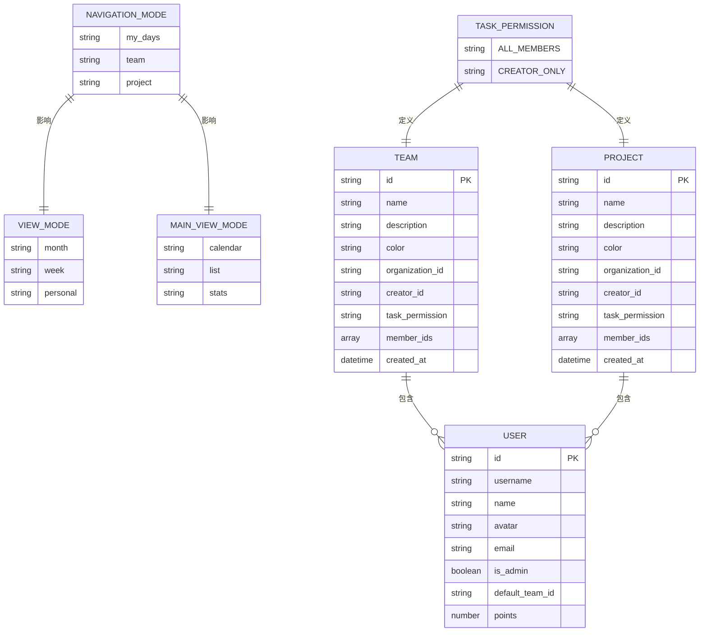

**图表来源**
- [types.ts](file://lib/types.ts#L127-L141)
- [types.ts](file://lib/types.ts#L84-L106)
- [types.ts](file://lib/types.ts#L108-L120)

**章节来源**
- [calendar-store.ts](file://lib/store/calendar-store.ts#L33-L198)
- [types.ts](file://lib/types.ts#L127-L141)

## 性能考虑

### 状态管理优化

1. **局部状态分离**：每个组件只管理必要的状态，减少不必要的重渲染
2. **批量更新**：使用Zustand的批量更新机制，避免频繁的状态变更
3. **持久化存储**：关键状态通过localStorage持久化，提升用户体验

### 数据加载优化

1. **并发加载**：使用Promise.all并行加载用户、团队和项目数据
2. **延迟加载**：任务数据根据导航模式动态加载，减少初始负载
3. **缓存策略**：合理利用浏览器缓存和本地存储

### 渲染性能优化

1. **虚拟滚动**：对于大量任务的场景，考虑实现虚拟滚动
2. **防抖处理**：对频繁触发的操作进行防抖处理
3. **条件渲染**：只渲染可见区域的内容

## 故障排除指南

### 常见问题及解决方案

#### 权限相关问题

**问题**：用户无法编辑团队或项目
**原因**：用户不是创建者且不是管理员
**解决方案**：
1. 检查用户角色和权限
2. 验证创建者身份
3. 确认管理员权限

#### 数据同步问题

**问题**：导航状态与实际数据不一致
**原因**：状态重置逻辑或API调用失败
**解决方案**：
1. 检查fetchAllData函数的执行
2. 验证导航状态的有效性
3. 确认API响应的正确性

#### 响应式布局问题

**问题**：移动端显示异常
**原因**：断点设置或CSS样式问题
**解决方案**：
1. 检查MOBILE_BREAKPOINT常量
2. 验证媒体查询规则
3. 测试不同屏幕尺寸

**章节来源**
- [calendar-store.ts](file://lib/store/calendar-store.ts#L488-L527)
- [sidebar.tsx](file://components/ui/sidebar.tsx#L69-L94)

## 结论

侧边栏导航系统是一个功能完整、架构清晰的组件集合。它通过合理的状态管理、权限控制和响应式设计，为用户提供了流畅的导航体验。系统的主要优势包括：

1. **模块化设计**：各组件职责明确，便于维护和扩展
2. **权限安全**：多层次的权限控制确保数据安全
3. **用户体验**：流畅的交互和响应式布局
4. **性能优化**：合理的状态管理和数据加载策略
5. **可扩展性**：清晰的架构为未来功能扩展奠定基础

该系统为整个应用提供了坚实的导航基础设施，是构建复杂任务管理应用的重要组成部分。