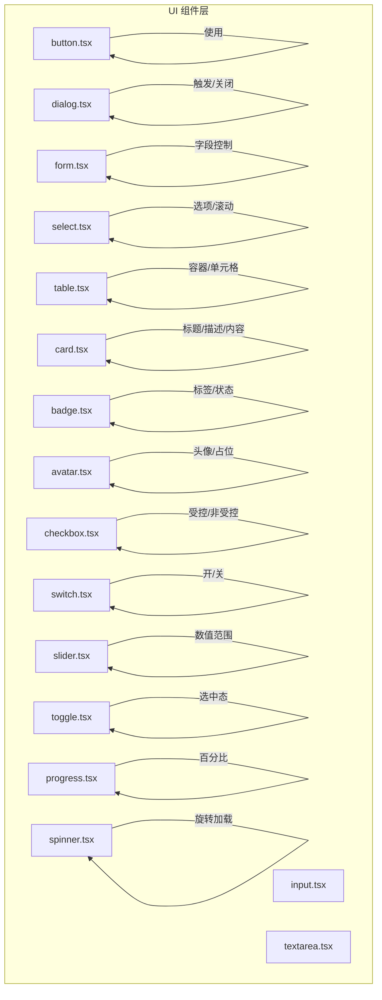
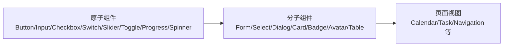
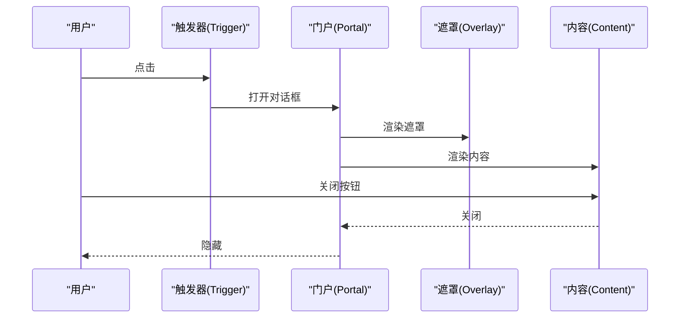
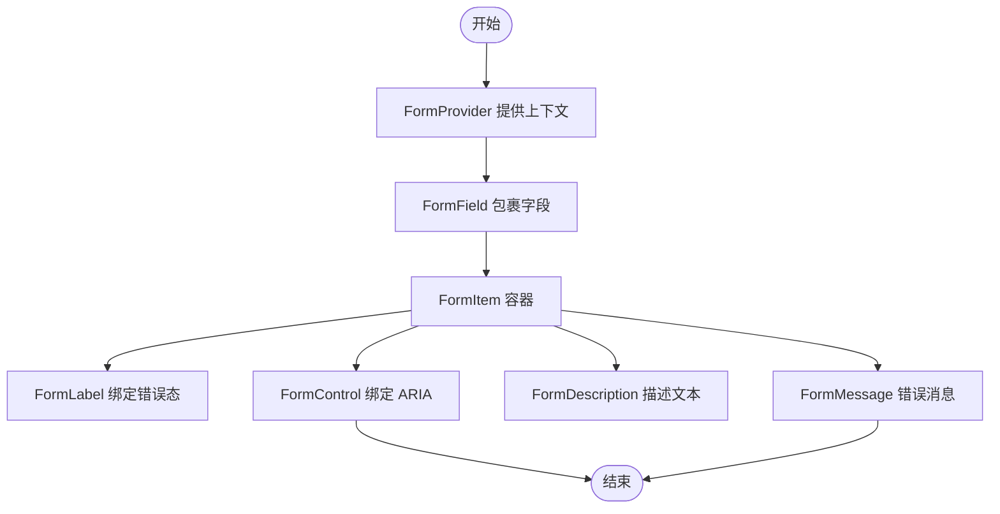
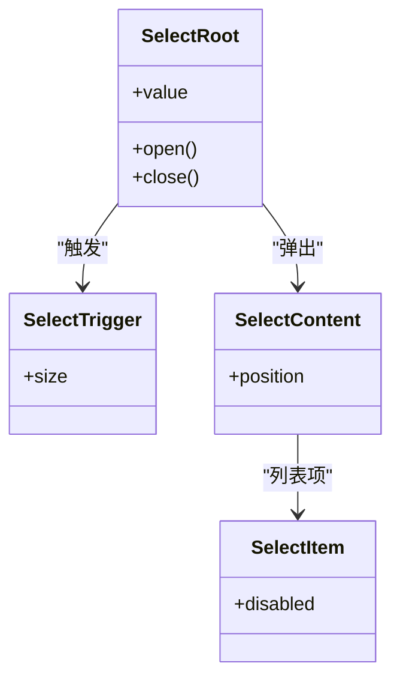
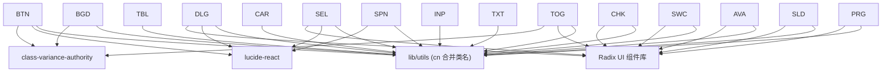

# 基础UI组件

<cite>
**本文引用的文件**
- [components/ui/button.tsx](file://components/ui/button.tsx)
- [components/ui/input.tsx](file://components/ui/input.tsx)
- [components/ui/dialog.tsx](file://components/ui/dialog.tsx)
- [components/ui/form.tsx](file://components/ui/form.tsx)
- [components/ui/select.tsx](file://components/ui/select.tsx)
- [components/ui/table.tsx](file://components/ui/table.tsx)
- [components/ui/card.tsx](file://components/ui/card.tsx)
- [components/ui/badge.tsx](file://components/ui/badge.tsx)
- [components/ui/avatar.tsx](file://components/ui/avatar.tsx)
- [components/ui/textarea.tsx](file://components/ui/textarea.tsx)
- [components/ui/checkbox.tsx](file://components/ui/checkbox.tsx)
- [components/ui/switch.tsx](file://components/ui/switch.tsx)
- [components/ui/slider.tsx](file://components/ui/slider.tsx)
- [components/ui/toggle.tsx](file://components/ui/toggle.tsx)
- [components/ui/progress.tsx](file://components/ui/progress.tsx)
- [components/ui/spinner.tsx](file://components/ui/spinner.tsx)
</cite>

## 目录
1. [简介](#简介)
2. [项目结构](#项目结构)
3. [核心组件](#核心组件)
4. [架构总览](#架构总览)
5. [组件详解](#组件详解)
6. [依赖关系分析](#依赖关系分析)
7. [性能与可访问性](#性能与可访问性)
8. [故障排查指南](#故障排查指南)
9. [结论](#结论)
10. [附录：使用示例与最佳实践](#附录使用示例与最佳实践)

## 简介
本文件系统化梳理项目中的基础UI组件，覆盖按钮、输入框、对话框、表单、选择器、表格、卡片、徽章、头像、多行文本输入、复选框、开关、滑块、切换按钮、进度条、加载指示器等。内容包括：
- 组件属性、事件与状态管理
- 样式定制与主题适配
- 验证规则与无障碍支持（ARIA）
- 响应式设计与组合模式
- 性能优化建议与常见问题排查

## 项目结构
UI组件集中于 components/ui 目录，采用 Radix UI 原子组件进行语义化封装，结合 class-variance-authority 实现变体风格，统一通过工具函数合并类名。

图表来源
- [components/ui/button.tsx](file://components/ui/button.tsx#L1-L61)
- [components/ui/dialog.tsx](file://components/ui/dialog.tsx#L1-L144)
- [components/ui/form.tsx](file://components/ui/form.tsx#L1-L168)
- [components/ui/select.tsx](file://components/ui/select.tsx#L1-L186)
- [components/ui/table.tsx](file://components/ui/table.tsx#L1-L117)
- [components/ui/card.tsx](file://components/ui/card.tsx#L1-L93)
- [components/ui/badge.tsx](file://components/ui/badge.tsx#L1-L47)
- [components/ui/avatar.tsx](file://components/ui/avatar.tsx#L1-L54)
- [components/ui/input.tsx](file://components/ui/input.tsx#L1-L22)
- [components/ui/textarea.tsx](file://components/ui/textarea.tsx#L1-L19)
- [components/ui/checkbox.tsx](file://components/ui/checkbox.tsx#L1-L33)
- [components/ui/switch.tsx](file://components/ui/switch.tsx#L1-L32)
- [components/ui/slider.tsx](file://components/ui/slider.tsx#L1-L64)
- [components/ui/toggle.tsx](file://components/ui/toggle.tsx#L1-L48)
- [components/ui/progress.tsx](file://components/ui/progress.tsx#L1-L32)
- [components/ui/spinner.tsx](file://components/ui/spinner.tsx#L1-L17)

章节来源
- [components/ui/button.tsx](file://components/ui/button.tsx#L1-L61)
- [components/ui/dialog.tsx](file://components/ui/dialog.tsx#L1-L144)
- [components/ui/form.tsx](file://components/ui/form.tsx#L1-L168)
- [components/ui/select.tsx](file://components/ui/select.tsx#L1-L186)
- [components/ui/table.tsx](file://components/ui/table.tsx#L1-L117)
- [components/ui/card.tsx](file://components/ui/card.tsx#L1-L93)
- [components/ui/badge.tsx](file://components/ui/badge.tsx#L1-L47)
- [components/ui/avatar.tsx](file://components/ui/avatar.tsx#L1-L54)
- [components/ui/input.tsx](file://components/ui/input.tsx#L1-L22)
- [components/ui/textarea.tsx](file://components/ui/textarea.tsx#L1-L19)
- [components/ui/checkbox.tsx](file://components/ui/checkbox.tsx#L1-L33)
- [components/ui/switch.tsx](file://components/ui/switch.tsx#L1-L32)
- [components/ui/slider.tsx](file://components/ui/slider.tsx#L1-L64)
- [components/ui/toggle.tsx](file://components/ui/toggle.tsx#L1-L48)
- [components/ui/progress.tsx](file://components/ui/progress.tsx#L1-L32)
- [components/ui/spinner.tsx](file://components/ui/spinner.tsx#L1-L17)

## 核心组件
- 按钮 Button：支持多种变体与尺寸，支持作为容器渲染，具备聚焦环与无效态样式。
- 输入 Input/Textarea：统一边框、圆角、阴影与聚焦环；支持无效态与禁用态。
- 对话框 Dialog：包含根节点、触发器、门户、遮罩、内容、标题、描述、页眉/页脚等。
- 表单 Form：基于 react-hook-form 的上下文封装，提供字段、标签、控制、描述、错误信息。
- 选择器 Select：触发器、内容、项、分隔符、滚动按钮等，支持大小与位置变体。
- 表格 Table：容器、表头、表体、表尾、行、列、标题、单元格、标题注释。
- 卡片 Card：头部、标题、描述、操作、内容、底部。
- 徽章 Badge：多种变体，支持作为容器渲染。
- 头像 Avatar：根节点、图像、占位。
- 复选框 Checkbox、开关 Switch、滑块 Slider、切换按钮 Toggle：原生交互语义与视觉反馈。
- 进度条 Progress、加载指示器 Spinner：状态可视化。

章节来源
- [components/ui/button.tsx](file://components/ui/button.tsx#L7-L37)
- [components/ui/input.tsx](file://components/ui/input.tsx#L5-L19)
- [components/ui/textarea.tsx](file://components/ui/textarea.tsx#L5-L18)
- [components/ui/dialog.tsx](file://components/ui/dialog.tsx#L9-L143)
- [components/ui/form.tsx](file://components/ui/form.tsx#L19-L167)
- [components/ui/select.tsx](file://components/ui/select.tsx#L9-L185)
- [components/ui/table.tsx](file://components/ui/table.tsx#L7-L116)
- [components/ui/card.tsx](file://components/ui/card.tsx#L5-L92)
- [components/ui/badge.tsx](file://components/ui/badge.tsx#L7-L46)
- [components/ui/avatar.tsx](file://components/ui/avatar.tsx#L8-L53)
- [components/ui/checkbox.tsx](file://components/ui/checkbox.tsx#L9-L32)
- [components/ui/switch.tsx](file://components/ui/switch.tsx#L8-L31)
- [components/ui/slider.tsx](file://components/ui/slider.tsx#L8-L63)
- [components/ui/toggle.tsx](file://components/ui/toggle.tsx#L9-L47)
- [components/ui/progress.tsx](file://components/ui/progress.tsx#L8-L31)
- [components/ui/spinner.tsx](file://components/ui/spinner.tsx#L5-L16)

## 架构总览
组件遵循“原子-分子-组织”的分层思想：
- 原子层：Button、Input、Checkbox、Switch、Slider、Toggle、Progress、Spinner
- 分子层：Form、Select、Dialog、Card、Badge、Avatar、Table
- 组织层：页面视图与复合交互（由上层页面组件组合使用）

## 组件详解

### 按钮 Button
- 属性
  - className：自定义类名
  - variant：变体（default、destructive、outline、secondary、ghost、link）
  - size：尺寸（default、sm、lg、icon、icon-sm、icon-lg）
  - asChild：是否以子元素容器渲染
  - 其余继承自原生 button
- 事件与状态
  - 支持点击、禁用、聚焦环、无效态样式联动
- 样式与主题
  - 使用变体与尺寸生成类，支持深色模式与无效态
- 无障碍
  - 聚焦可见性、无效态 ARIA 属性
- 示例路径
  - [按钮组件实现](file://components/ui/button.tsx#L39-L58)

章节来源
- [components/ui/button.tsx](file://components/ui/button.tsx#L7-L37)
- [components/ui/button.tsx](file://components/ui/button.tsx#L39-L58)

### 输入框 Input
- 属性
  - className、type：继承自原生 input
- 样式与主题
  - 统一边框、圆角、阴影、聚焦环、无效态与禁用态
- 无障碍
  - 聚焦环、无效态 ARIA 属性
- 示例路径
  - [输入框组件实现](file://components/ui/input.tsx#L5-L19)

章节来源
- [components/ui/input.tsx](file://components/ui/input.tsx#L5-L19)

### 多行文本输入 Textarea
- 属性
  - className：继承自原生 textarea
- 样式与主题
  - 统一边框、圆角、阴影、聚焦环、无效态与禁用态
- 无障碍
  - 聚焦环、无效态 ARIA 属性
- 示例路径
  - [多行文本输入组件实现](file://components/ui/textarea.tsx#L5-L18)

章节来源
- [components/ui/textarea.tsx](file://components/ui/textarea.tsx#L5-L18)

### 对话框 Dialog
- 子组件
  - Root、Trigger、Portal、Overlay、Content、Header、Footer、Title、Description、Close
- 属性
  - Content 支持 showCloseButton 控制关闭按钮显示
  - Overlay/Content 支持动画进入/退出
- 无障碍
  - 关闭按钮含隐藏文本，便于读屏
- 示例路径
  - [对话框组件实现](file://components/ui/dialog.tsx#L9-L143)

图表来源
- [components/ui/dialog.tsx](file://components/ui/dialog.tsx#L15-L81)

章节来源
- [components/ui/dialog.tsx](file://components/ui/dialog.tsx#L9-L143)

### 表单 Form（基于 react-hook-form）
- 组件
  - Form、FormField、FormItem、FormLabel、FormControl、FormDescription、FormMessage
  - useFormField 提供字段状态与 ARIA 属性绑定
- 无障碍
  - 自动设置 aria-describedby、aria-invalid
- 示例路径
  - [表单组件实现](file://components/ui/form.tsx#L19-L167)

图表来源
- [components/ui/form.tsx](file://components/ui/form.tsx#L32-L167)

章节来源
- [components/ui/form.tsx](file://components/ui/form.tsx#L19-L167)

### 选择器 Select
- 子组件
  - Root、Trigger、Content、Viewport、Label、Item、Separator、ScrollUp/DownButton、Value、Group
- 属性
  - Trigger 支持 size（sm/default）
  - Content 支持 position（popper）
- 无障碍
  - 项支持指示器与键盘导航
- 示例路径
  - [选择器组件实现](file://components/ui/select.tsx#L9-L185)

图表来源
- [components/ui/select.tsx](file://components/ui/select.tsx#L9-L185)

章节来源
- [components/ui/select.tsx](file://components/ui/select.tsx#L9-L185)

### 表格 Table
- 子组件
  - Table、TableHeader、TableBody、TableFooter、TableRow、TableHead、TableCell、TableCaption
- 特性
  - 容器支持横向滚动，行悬停与选中态
- 示例路径
  - [表格组件实现](file://components/ui/table.tsx#L7-L116)

章节来源
- [components/ui/table.tsx](file://components/ui/table.tsx#L7-L116)

### 卡片 Card
- 子组件
  - Card、CardHeader、CardTitle、CardDescription、CardAction、CardContent、CardFooter
- 特性
  - 统一圆角、边框、阴影；头部布局支持操作区对齐
- 示例路径
  - [卡片组件实现](file://components/ui/card.tsx#L5-L92)

章节来源
- [components/ui/card.tsx](file://components/ui/card.tsx#L5-L92)

### 徽章 Badge
- 属性
  - variant：default、secondary、destructive、outline
  - asChild：是否以子元素容器渲染
- 示例路径
  - [徽章组件实现](file://components/ui/badge.tsx#L28-L46)

章节来源
- [components/ui/badge.tsx](file://components/ui/badge.tsx#L7-L46)

### 头像 Avatar
- 子组件
  - Avatar、AvatarImage、AvatarFallback
- 特性
  - 支持占位与回退
- 示例路径
  - [头像组件实现](file://components/ui/avatar.tsx#L8-L53)

章节来源
- [components/ui/avatar.tsx](file://components/ui/avatar.tsx#L8-L53)

### 复选框 Checkbox
- 属性
  - className：继承自原生复选框
- 特性
  - 受控/非受控，选中态视觉指示
- 示例路径
  - [复选框组件实现](file://components/ui/checkbox.tsx#L9-L32)

章节来源
- [components/ui/checkbox.tsx](file://components/ui/checkbox.tsx#L9-L32)

### 开关 Switch
- 属性
  - className：继承自原生开关
- 特性
  - 开/关状态视觉反馈
- 示例路径
  - [开关组件实现](file://components/ui/switch.tsx#L8-L31)

章节来源
- [components/ui/switch.tsx](file://components/ui/switch.tsx#L8-L31)

### 滑块 Slider
- 属性
  - defaultValue、value、min、max：支持单值/双值
- 特性
  - 水平/垂直方向，多手柄
- 示例路径
  - [滑块组件实现](file://components/ui/slider.tsx#L8-L63)

章节来源
- [components/ui/slider.tsx](file://components/ui/slider.tsx#L8-L63)

### 切换按钮 Toggle
- 属性
  - variant：default、outline
  - size：default、sm、lg
- 特性
  - 选中态样式
- 示例路径
  - [切换按钮组件实现](file://components/ui/toggle.tsx#L31-L47)

章节来源
- [components/ui/toggle.tsx](file://components/ui/toggle.tsx#L9-L47)

### 进度条 Progress
- 属性
  - value：百分比
- 特性
  - 百分比指示器
- 示例路径
  - [进度条组件实现](file://components/ui/progress.tsx#L8-L31)

章节来源
- [components/ui/progress.tsx](file://components/ui/progress.tsx#L8-L31)

### 加载指示器 Spinner
- 属性
  - className：SVG 图标
- 特性
  - 动画旋转，ARIA 角色与标签
- 示例路径
  - [加载指示器组件实现](file://components/ui/spinner.tsx#L5-L16)

章节来源
- [components/ui/spinner.tsx](file://components/ui/spinner.tsx#L5-L16)

## 依赖关系分析
- 组件间耦合
  - Form 与 Label、Input/Select 等控件通过上下文与 ARIA 属性解耦
  - Dialog 通过 Portal 将内容挂载到文档根部，避免层级与样式干扰
  - Select/Dialog/Table/Card 等为复合组件，内部依赖各自子组件
- 外部依赖
  - Radix UI：用于可访问性与状态管理（Dialog、Select、Checkbox、Switch、Slider、Toggle、Progress、Avatar 等）
  - class-variance-authority：用于变体与尺寸生成类名（Button、Badge、Toggle）
  - lucide-react：图标库（X、Check、ChevronUp/Down、Loader2 等）
- 潜在循环依赖
  - 当前组件均为 UI 原子封装，未见直接循环导入

图表来源
- [components/ui/button.tsx](file://components/ui/button.tsx#L1-L6)
- [components/ui/dialog.tsx](file://components/ui/dialog.tsx#L1-L8)
- [components/ui/select.tsx](file://components/ui/select.tsx#L1-L8)
- [components/ui/table.tsx](file://components/ui/table.tsx#L1-L6)
- [components/ui/card.tsx](file://components/ui/card.tsx#L1-L4)
- [components/ui/badge.tsx](file://components/ui/badge.tsx#L1-L6)
- [components/ui/avatar.tsx](file://components/ui/avatar.tsx#L1-L7)
- [components/ui/textarea.tsx](file://components/ui/textarea.tsx#L1-L4)
- [components/ui/checkbox.tsx](file://components/ui/checkbox.tsx#L1-L8)
- [components/ui/switch.tsx](file://components/ui/switch.tsx#L1-L7)
- [components/ui/slider.tsx](file://components/ui/slider.tsx#L1-L7)
- [components/ui/toggle.tsx](file://components/ui/toggle.tsx#L1-L8)
- [components/ui/progress.tsx](file://components/ui/progress.tsx#L1-L7)
- [components/ui/spinner.tsx](file://components/ui/spinner.tsx#L1-L4)

## 性能与可访问性
- 性能
  - 使用 useMemo 优化滑块默认值计算，避免重复渲染
  - 通过 Portal 减少 DOM 深度，降低布局抖动
  - 变体类名通过工具函数合并，减少运行时拼接成本
- 可访问性
  - 所有表单控件均设置聚焦环与无效态 ARIA 属性
  - 对话框关闭按钮包含隐藏文本，提升读屏体验
  - Select/Dialog 内容支持键盘导航与动画过渡
- 响应式
  - 组件普遍使用相对单位与断点相关类名，适配移动端与桌面端

章节来源
- [components/ui/slider.tsx](file://components/ui/slider.tsx#L16-L24)
- [components/ui/dialog.tsx](file://components/ui/dialog.tsx#L69-L77)
- [components/ui/form.tsx](file://components/ui/form.tsx#L107-L123)

## 故障排查指南
- 表单字段未显示错误
  - 检查是否在 FormField 中包裹字段，useFormField 是否正确调用
  - 确认 FormControl 是否绑定了 aria-describedby 与 aria-invalid
  - 参考路径：[表单上下文与字段钩子](file://components/ui/form.tsx#L45-L66)
- 对话框无法关闭或遮罩不生效
  - 确认 DialogTrigger 与 DialogClose 的使用，检查 Portal 是否渲染
  - 参考路径：[对话框子组件](file://components/ui/dialog.tsx#L15-L81)
- 选择器内容未对齐或滚动异常
  - 检查 Trigger 的 size 与 Content 的 position
  - 参考路径：[选择器触发器与内容](file://components/ui/select.tsx#L34-L85)
- 输入框无效态颜色不符合预期
  - 检查无效态 ARIA 与主题变量映射
  - 参考路径：[输入与多行输入](file://components/ui/input.tsx#L10-L15), [多行输入](file://components/ui/textarea.tsx#L9-L12)
- 按钮/徽章/切换按钮样式错乱
  - 检查变体与尺寸参数是否匹配
  - 参考路径：[按钮变体](file://components/ui/button.tsx#L10-L31), [徽章变体](file://components/ui/badge.tsx#L10-L21), [切换按钮变体](file://components/ui/toggle.tsx#L12-L23)

章节来源
- [components/ui/form.tsx](file://components/ui/form.tsx#L45-L66)
- [components/ui/dialog.tsx](file://components/ui/dialog.tsx#L15-L81)
- [components/ui/select.tsx](file://components/ui/select.tsx#L34-L85)
- [components/ui/input.tsx](file://components/ui/input.tsx#L10-L15)
- [components/ui/textarea.tsx](file://components/ui/textarea.tsx#L9-L12)
- [components/ui/button.tsx](file://components/ui/button.tsx#L10-L31)
- [components/ui/badge.tsx](file://components/ui/badge.tsx#L10-L21)
- [components/ui/toggle.tsx](file://components/ui/toggle.tsx#L12-L23)

## 结论
本项目的基础 UI 组件体系以 Radix UI 为核心，结合 class-variance-authority 与 Tailwind 类名策略，实现了高可定制、强可访问、跨平台一致性的组件库。通过 Form 上下文与 ARIA 属性，组件在表单场景中具备完善的错误提示与无障碍支持；Dialog、Select 等复合组件提供了丰富的交互能力与主题适配空间。建议在实际使用中遵循组件提供的变体与尺寸规范，配合全局主题变量与 Tailwind 配置，实现一致的视觉与交互体验。

## 附录：使用示例与最佳实践
- 组合使用模式
  - 表单：Form + FormField + FormControl(Input/Select/Checkbox) + FormMessage
  - 弹窗：DialogTrigger + Dialog + DialogContent + DialogHeader/DialogFooter
  - 列表：Select + SelectItem + SelectSeparator
  - 数据展示：Table + TableHeader/TableBody + TableRow + TableCell
- 主题定制
  - 通过变体参数（variant/size）与 className 覆盖默认样式
  - 使用 Tailwind 断点与暗色模式类名适配不同设备与主题
- 最佳实践
  - 优先使用语义化子组件（如 DialogTitle/Description），确保可访问性
  - 在复杂表单中使用 FormProvider 提供上下文，避免重复传递 props
  - 对需要高性能的场景（如大量滑块/进度条）使用默认值缓存与最小重渲染
- 常见场景
  - 登录/注册：Input + Button + Form（含校验与错误提示）
  - 设置面板：Switch + Toggle + Slider + Card
  - 数据浏览：Table + Badge + Avatar
  - 确认对话框：DialogTrigger + Dialog + DialogFooter（确认/取消按钮）