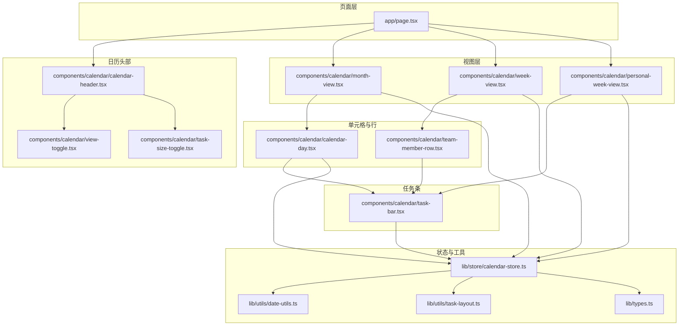
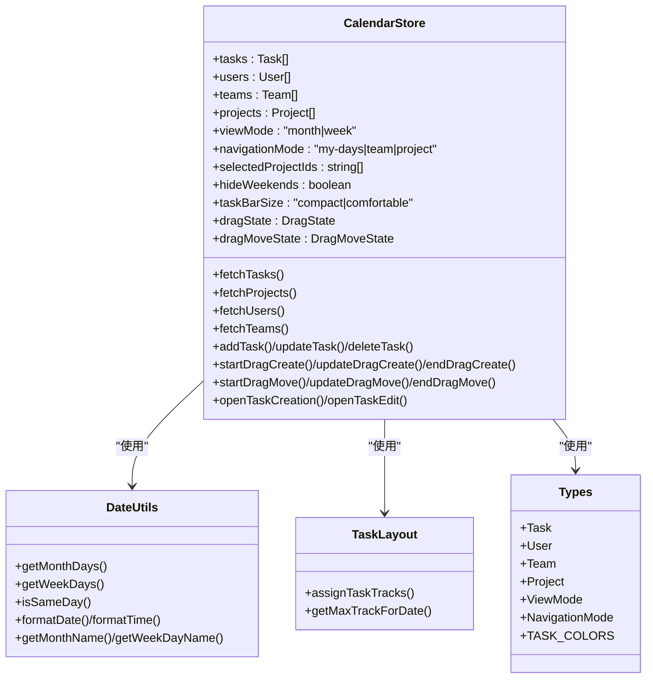
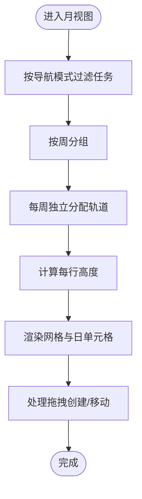
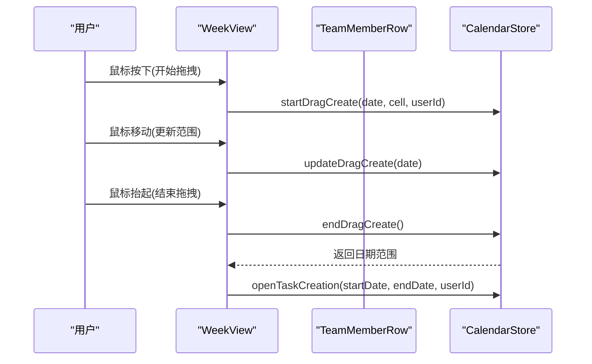
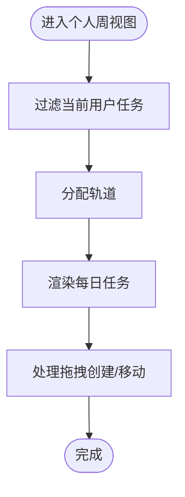
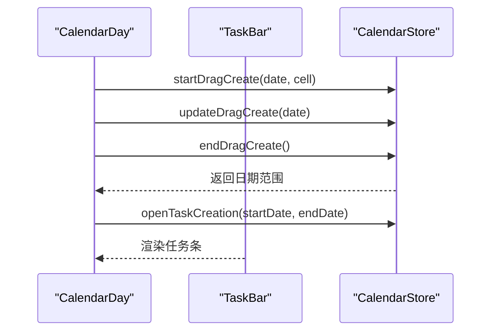
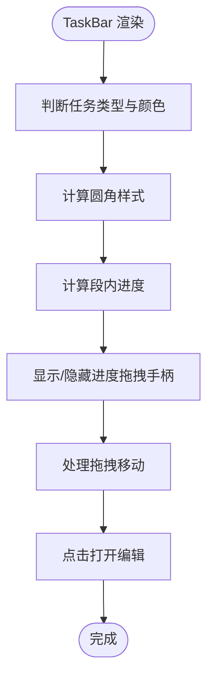
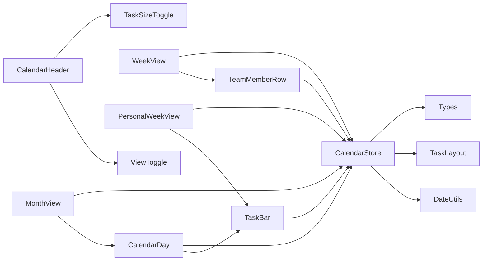

# 日历组件

<cite>
**本文引用的文件**
- [components/calendar/month-view.tsx](file://components/calendar/month-view.tsx)
- [components/calendar/week-view.tsx](file://components/calendar/week-view.tsx)
- [components/calendar/personal-week-view.tsx](file://components/calendar/personal-week-view.tsx)
- [components/calendar/calendar-day.tsx](file://components/calendar/calendar-day.tsx)
- [components/calendar/team-member-row.tsx](file://components/calendar/team-member-row.tsx)
- [components/calendar/task-bar.tsx](file://components/calendar/task-bar.tsx)
- [components/calendar/view-toggle.tsx](file://components/calendar/view-toggle.tsx)
- [components/calendar/task-size-toggle.tsx](file://components/calendar/task-size-toggle.tsx)
- [components/calendar/calendar-header.tsx](file://components/calendar/calendar-header.tsx)
- [lib/store/calendar-store.ts](file://lib/store/calendar-store.ts)
- [lib/utils/date-utils.ts](file://lib/utils/date-utils.ts)
- [lib/utils/task-layout.ts](file://lib/utils/task-layout.ts)
- [lib/types.ts](file://lib/types.ts)
- [app/page.tsx](file://app/page.tsx)
</cite>

## 目录
1. [简介](#简介)
2. [项目结构](#项目结构)
3. [核心组件](#核心组件)
4. [架构总览](#架构总览)
5. [详细组件分析](#详细组件分析)
6. [依赖关系分析](#依赖关系分析)
7. [性能考量](#性能考量)
8. [故障排查指南](#故障排查指南)
9. [结论](#结论)
10. [附录](#附录)

## 简介
本文件系统性梳理日历组件体系，覆盖月视图、周视图、个人视图（个人周视图）等日历模式，以及任务条渲染、日程安排、拖拽交互、视图切换、数据绑定、事件处理、样式定制与响应式布局等能力。文档同时提供配置项、国际化支持与性能优化策略，并给出集成与使用示例。

## 项目结构
日历相关组件集中在 components/calendar，状态管理位于 lib/store，通用工具位于 lib/utils，类型定义位于 lib/types，页面入口 app/page.tsx 负责根据导航模式与视图模式渲染相应视图。

**图表来源**
- [app/page.tsx](file://app/page.tsx#L104-L142)
- [components/calendar/calendar-header.tsx](file://components/calendar/calendar-header.tsx#L63-L125)
- [components/calendar/month-view.tsx](file://components/calendar/month-view.tsx#L9-L306)
- [components/calendar/week-view.tsx](file://components/calendar/week-view.tsx#L9-L109)
- [components/calendar/personal-week-view.tsx](file://components/calendar/personal-week-view.tsx#L10-L200)
- [components/calendar/calendar-day.tsx](file://components/calendar/calendar-day.tsx#L22-L164)
- [components/calendar/team-member-row.tsx](file://components/calendar/team-member-row.tsx#L18-L211)
- [components/calendar/task-bar.tsx](file://components/calendar/task-bar.tsx#L20-L700)
- [lib/store/calendar-store.ts](file://lib/store/calendar-store.ts#L200-L800)
- [lib/utils/date-utils.ts](file://lib/utils/date-utils.ts#L1-L86)
- [lib/utils/task-layout.ts](file://lib/utils/task-layout.ts#L1-L77)
- [lib/types.ts](file://lib/types.ts#L61-L141)

**章节来源**
- [app/page.tsx](file://app/page.tsx#L104-L142)
- [components/calendar/calendar-header.tsx](file://components/calendar/calendar-header.tsx#L12-L127)

## 核心组件
- 月视图 MonthView：按周网格渲染，支持 My Days/团队/项目三种导航模式，按周独立分配轨道，自动滚动至本周。
- 周视图 WeekView：团队成员行视图，按导航模式过滤显示用户，支持拖拽创建任务。
- 个人周视图 PersonalWeekView：当前用户单行视图，支持拖拽创建与拖拽移动任务。
- 日历单元格 CalendarDay：单日容器，负责任务筛选与渲染，支持拖拽创建与拖拽移动。
- 团队成员行 TeamMemberRow：单成员行，按导航模式过滤任务，支持拖拽创建与拖拽移动。
- 任务条 TaskBar：任务条渲染与交互，支持拖拽移动、进度拖拽、跨段进度显示、用户头像展示。
- 视图切换 ViewToggle：切换月/周视图。
- 任务条尺寸切换 TaskSizeToggle：切换紧凑/宽松两种尺寸。
- 日历头部 CalendarHeader：标题、导航、周末隐藏、任务条尺寸切换、清单视图下的分组与布局切换。

**章节来源**
- [components/calendar/month-view.tsx](file://components/calendar/month-view.tsx#L9-L306)
- [components/calendar/week-view.tsx](file://components/calendar/week-view.tsx#L9-L109)
- [components/calendar/personal-week-view.tsx](file://components/calendar/personal-week-view.tsx#L10-L200)
- [components/calendar/calendar-day.tsx](file://components/calendar/calendar-day.tsx#L22-L164)
- [components/calendar/team-member-row.tsx](file://components/calendar/team-member-row.tsx#L18-L211)
- [components/calendar/task-bar.tsx](file://components/calendar/task-bar.tsx#L20-L700)
- [components/calendar/view-toggle.tsx](file://components/calendar/view-toggle.tsx#L7-L52)
- [components/calendar/task-size-toggle.tsx](file://components/calendar/task-size-toggle.tsx#L8-L40)
- [components/calendar/calendar-header.tsx](file://components/calendar/calendar-header.tsx#L12-L127)

## 架构总览
日历采用“状态集中 + 组件解耦”的架构：
- 状态中心：Zustand + persist，持久化用户偏好与视图状态。
- 数据来源：API 客户端封装，统一错误处理与加载延迟。
- 工具函数：日期计算、任务轨道分配、类型定义。
- 视图渲染：根据 navigationMode 与 viewMode 动态选择组件组合。

**图表来源**
- [lib/store/calendar-store.ts](file://lib/store/calendar-store.ts#L33-L198)
- [lib/utils/date-utils.ts](file://lib/utils/date-utils.ts#L1-L86)
- [lib/utils/task-layout.ts](file://lib/utils/task-layout.ts#L1-L77)
- [lib/types.ts](file://lib/types.ts#L61-L141)

## 详细组件分析

### 月视图 MonthView
- 导航模式过滤：My Days（当前用户在选中项目中的任务）、团队（团队成员任务）、项目（项目成员任务）。
- 日期网格：基于 hideWeekends 生成 5/7 列网格，按周分组。
- 轨道分配：对每周任务独立进行轨道分配，计算每行最小高度。
- 拖拽创建：全局 mouseup 保证拖拽状态清理。
- 自动滚动：首次加载或月份切换时滚动至包含今天的周。

**图表来源**
- [components/calendar/month-view.tsx](file://components/calendar/month-view.tsx#L50-L174)
- [lib/utils/task-layout.ts](file://lib/utils/task-layout.ts#L28-L68)

**章节来源**
- [components/calendar/month-view.tsx](file://components/calendar/month-view.tsx#L9-L306)
- [lib/utils/date-utils.ts](file://lib/utils/date-utils.ts#L1-L41)
- [lib/utils/task-layout.ts](file://lib/utils/task-layout.ts#L28-L77)

### 周视图 WeekView
- 用户过滤：根据导航模式过滤显示用户（团队/项目模式下仅显示相关成员）。
- 成员行：逐行渲染 TeamMemberRow，每行高度由最大轨道决定。
- 拖拽创建：全局 mouseup 保证状态清理。

**图表来源**
- [components/calendar/week-view.tsx](file://components/calendar/week-view.tsx#L53-L68)
- [components/calendar/team-member-row.tsx](file://components/calendar/team-member-row.tsx#L109-L141)
- [lib/store/calendar-store.ts](file://lib/store/calendar-store.ts#L1089-L1164)

**章节来源**
- [components/calendar/week-view.tsx](file://components/calendar/week-view.tsx#L9-L109)
- [components/calendar/team-member-row.tsx](file://components/calendar/team-member-row.tsx#L18-L211)

### 个人周视图 PersonalWeekView
- 任务过滤：仅显示当前用户的任务（负责人或创建人）。
- 轨道分配：对用户任务进行轨道分配，计算最大轨道数。
- 拖拽创建/移动：支持开始、更新、结束拖拽，打开任务创建面板。
- 任务条渲染：支持跨段显示与进度拖拽。

**图表来源**
- [components/calendar/personal-week-view.tsx](file://components/calendar/personal-week-view.tsx#L31-L94)
- [components/calendar/task-bar.tsx](file://components/calendar/task-bar.tsx#L101-L130)

**章节来源**
- [components/calendar/personal-week-view.tsx](file://components/calendar/personal-week-view.tsx#L10-L200)

### 日历单元格 CalendarDay
- 任务筛选：当日开始或周一跨周继续的任务。
- 拖拽创建：阻止在任务条上触发创建，支持拖拽范围高亮。
- 任务渲染：使用 TaskBar 渲染任务条。

**图表来源**
- [components/calendar/calendar-day.tsx](file://components/calendar/calendar-day.tsx#L88-L115)
- [components/calendar/task-bar.tsx](file://components/calendar/task-bar.tsx#L272-L278)

**章节来源**
- [components/calendar/calendar-day.tsx](file://components/calendar/calendar-day.tsx#L22-L164)

### 团队成员行 TeamMemberRow
- 任务过滤：仅显示该成员作为负责人（不含仅创建人）的任务。
- 拖拽创建：限制拖拽用户 ID，仅当 dragState.userId 为空或匹配时高亮。
- 行高计算：根据最大轨道数动态计算行高。

**章节来源**
- [components/calendar/team-member-row.tsx](file://components/calendar/team-member-row.tsx#L18-L211)

### 任务条 TaskBar
- 任务条渲染：根据任务类型与颜色配置渲染，支持自定义 daily 颜色。
- 圆角策略：根据任务开始/结束段与跨段情况动态计算圆角。
- 跨段进度：支持在段内拖拽进度，转换为总进度并乐观更新。
- 拖拽移动：支持跨日移动，计算偏移天数并提交更新。
- 用户信息：在个人周视图中可显示负责人头像与名称。

**图表来源**
- [components/calendar/task-bar.tsx](file://components/calendar/task-bar.tsx#L233-L270)
- [components/calendar/task-bar.tsx](file://components/calendar/task-bar.tsx#L405-L435)
- [components/calendar/task-bar.tsx](file://components/calendar/task-bar.tsx#L101-L130)

**章节来源**
- [components/calendar/task-bar.tsx](file://components/calendar/task-bar.tsx#L20-L700)

### 视图切换与头部控件
- 视图切换 ViewToggle：切换月/周视图。
- 任务条尺寸切换 TaskSizeToggle：切换紧凑/宽松尺寸，影响任务条高度与间距。
- 日历头部 CalendarHeader：根据当前视图显示标题与导航按钮，支持隐藏周末、清单视图下的分组与布局切换。

**章节来源**
- [components/calendar/view-toggle.tsx](file://components/calendar/view-toggle.tsx#L7-L52)
- [components/calendar/task-size-toggle.tsx](file://components/calendar/task-size-toggle.tsx#L8-L40)
- [components/calendar/calendar-header.tsx](file://components/calendar/calendar-header.tsx#L12-L127)

## 依赖关系分析
- 组件间依赖：MonthView/WeekView/PersonalWeekView 依赖 CalendarDay/TeamMemberRow/TaskBar；CalendarHeader 依赖 ViewToggle/TaskSizeToggle。
- 状态依赖：所有组件通过 useCalendarStore 访问状态与动作。
- 工具依赖：日期计算与任务轨道分配由工具模块提供。
- 类型依赖：Task/User/Team/Project/ViewMode/NavigationMode/TASK_COLORS 定义于类型模块。

**图表来源**
- [components/calendar/month-view.tsx](file://components/calendar/month-view.tsx#L3-L8)
- [components/calendar/week-view.tsx](file://components/calendar/week-view.tsx#L3-L7)
- [components/calendar/personal-week-view.tsx](file://components/calendar/personal-week-view.tsx#L3-L8)
- [components/calendar/calendar-day.tsx](file://components/calendar/calendar-day.tsx#L3-L6)
- [components/calendar/team-member-row.tsx](file://components/calendar/team-member-row.tsx#L3-L10)
- [components/calendar/task-bar.tsx](file://components/calendar/task-bar.tsx#L3-L10)
- [components/calendar/calendar-header.tsx](file://components/calendar/calendar-header.tsx#L3-L10)
- [lib/store/calendar-store.ts](file://lib/store/calendar-store.ts#L17-L31)

**章节来源**
- [lib/store/calendar-store.ts](file://lib/store/calendar-store.ts#L200-L800)
- [lib/utils/date-utils.ts](file://lib/utils/date-utils.ts#L1-L86)
- [lib/utils/task-layout.ts](file://lib/utils/task-layout.ts#L1-L77)
- [lib/types.ts](file://lib/types.ts#L61-L141)

## 性能考量
- 任务轨道分配：使用稳定的轨道分配算法，按开始/结束时间排序，避免重复计算冲突。
- 渲染优化：useMemo 缓存过滤结果与轨道计算，减少不必要的重渲染。
- 滚动优化：月视图仅在首次加载或月份切换时滚动，避免频繁滚动。
- 拖拽性能：拖拽创建与移动使用全局 mouseup 清理，避免内存泄漏；进度拖拽使用乐观更新与防抖策略。
- 响应式：通过任务条尺寸切换与隐藏周末控制渲染密度，提升移动端体验。

[本节为通用性能建议，无需特定文件引用]

## 故障排查指南
- 拖拽创建无效：确认未在任务条上触发拖拽；检查 startDragCreate/updateDragCreate/endDragCreate 的调用链。
- 拖拽移动异常：检查 startDragMove/updateDragMove/endDragMove 的状态流转与 API 更新。
- 任务未显示：检查 navigationMode 与 selectedProjectIds 的过滤逻辑；确认任务日期范围与轨道分配。
- 进度拖拽回弹：确认乐观更新与状态同步，避免在 store 更新前出现回弹。
- 错误提示：统一通过 handleAPIError 与 toast 展示错误信息，必要时设置全局 error 状态。

**章节来源**
- [lib/store/calendar-store.ts](file://lib/store/calendar-store.ts#L1089-L1280)
- [lib/store/calendar-store.ts](file://lib/store/calendar-store.ts#L550-L748)

## 结论
该日历组件体系通过清晰的组件职责划分与集中状态管理，实现了月/周/个人周等多种视图模式，具备完善的任务条渲染、拖拽交互与视图切换能力。配合轨道分配算法与响应式布局，满足多场景使用需求。建议在集成时关注导航模式与项目过滤的联动，以及拖拽与进度更新的用户体验一致性。

## 附录

### 使用示例与集成指南
- 在页面入口根据 navigationMode 与 viewMode 渲染相应视图：
  - 月视图：viewMode 为 "month"。
  - 周视图：navigationMode 为 "my-days" 时使用 PersonalWeekView，否则使用 WeekView。
- 初始化数据：调用 fetchAllData 加载用户、团队、项目与任务数据。
- 切换视图：通过 ViewToggle 与 CalendarHeader 的导航按钮切换月/周与本周/本月。
- 自定义样式：通过 TaskSizeToggle 切换任务条尺寸；通过 CalendarHeader 的周末隐藏按钮控制周末显示。

**章节来源**
- [app/page.tsx](file://app/page.tsx#L104-L142)
- [lib/store/calendar-store.ts](file://lib/store/calendar-store.ts#L455-L546)
- [components/calendar/calendar-header.tsx](file://components/calendar/calendar-header.tsx#L63-L125)

### 配置选项
- 视图模式：viewMode ∈ {"month","week"}
- 导航模式：navigationMode ∈ {"my-days","team","project"}
- 项目过滤：selectedProjectIds 用于过滤任务
- 隐藏周末：hideWeekends
- 任务条尺寸：taskBarSize ∈ {"compact","comfortable"}

**章节来源**
- [lib/types.ts](file://lib/types.ts#L127-L129)
- [lib/store/calendar-store.ts](file://lib/store/calendar-store.ts#L54-L62)

### 国际化支持
- 日期与星期名称：getMonthName/getWeekDayName 返回中文名称。
- 本地化扩展：可在 date-utils 中增加语言映射，替换硬编码中文。

**章节来源**
- [lib/utils/date-utils.ts](file://lib/utils/date-utils.ts#L77-L85)