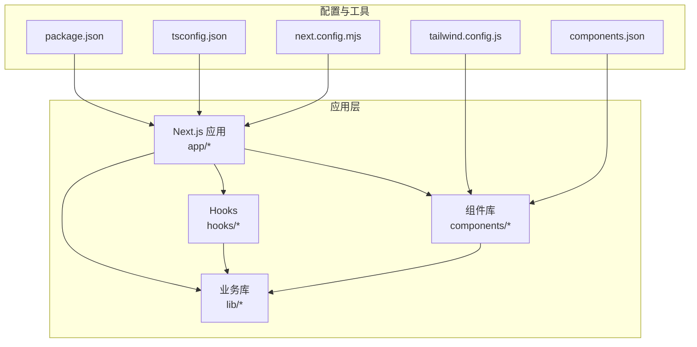
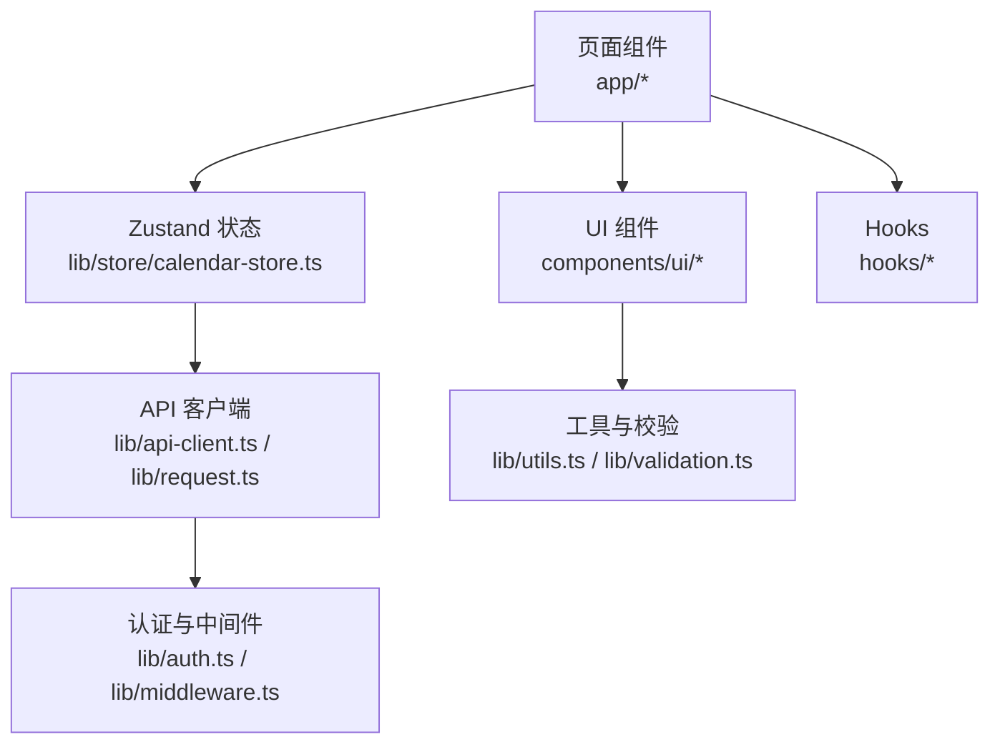
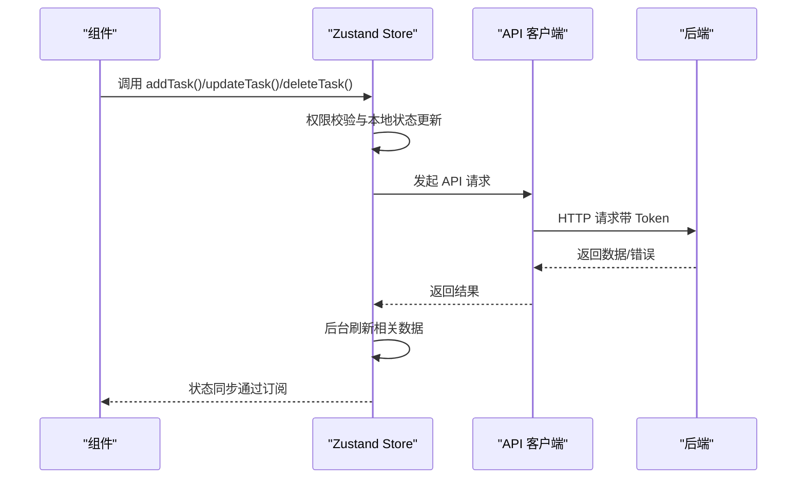
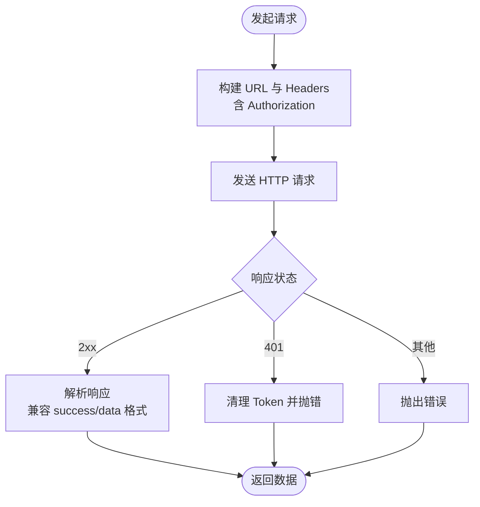
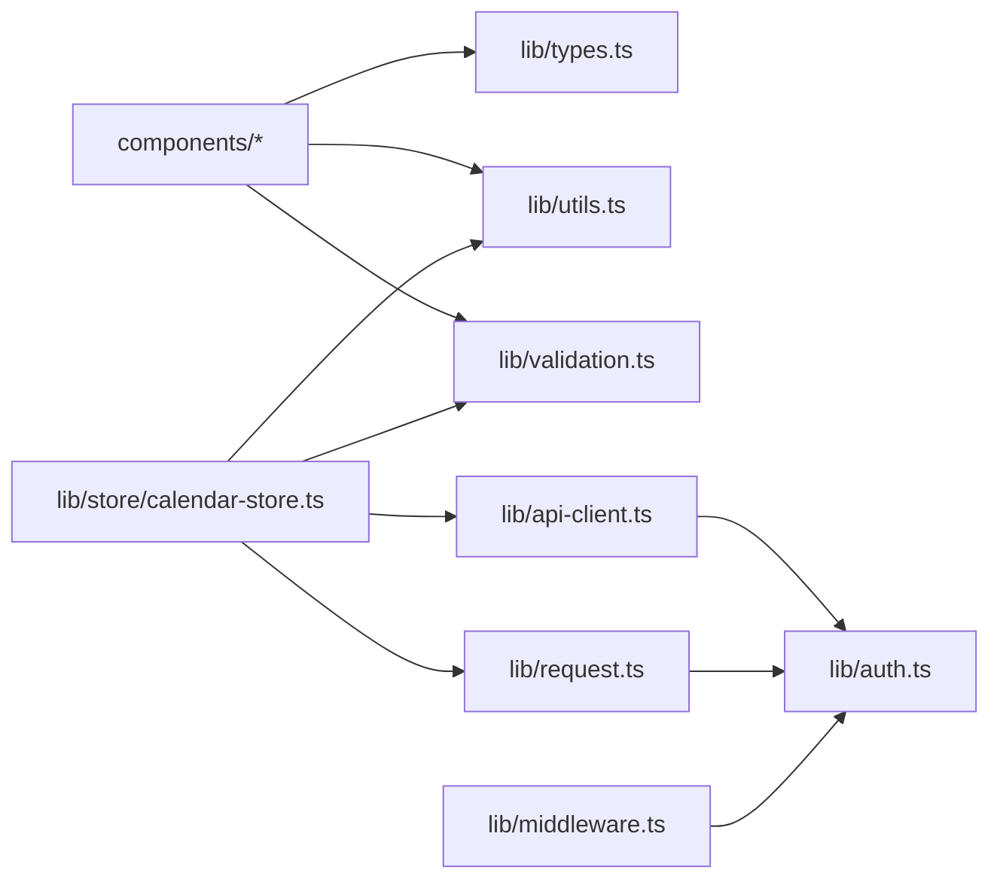

# 代码规范与最佳实践

<cite>
**本文引用的文件**
- [package.json](file://package.json)
- [tsconfig.json](file://tsconfig.json)
- [next.config.mjs](file://next.config.mjs)
- [tailwind.config.js](file://tailwind.config.js)
- [components.json](file://components.json)
- [lib/types.ts](file://lib/types.ts)
- [lib/utils.ts](file://lib/utils.ts)
- [lib/validation.ts](file://lib/validation.ts)
- [lib/store/calendar-store.ts](file://lib/store/calendar-store.ts)
- [lib/api-client.ts](file://lib/api-client.ts)
- [lib/request.ts](file://lib/request.ts)
- [lib/middleware.ts](file://lib/middleware.ts)
- [lib/auth.ts](file://lib/auth.ts)
- [hooks/use-toast.ts](file://hooks/use-toast.ts)
- [hooks/use-loading-delay.ts](file://hooks/use-loading-delay.ts)
- [hooks/use-mobile.ts](file://hooks/use-mobile.ts)
</cite>

## 目录
1. [引言](#引言)
2. [项目结构](#项目结构)
3. [核心组件](#核心组件)
4. [架构总览](#架构总览)
5. [详细组件分析](#详细组件分析)
6. [依赖关系分析](#依赖关系分析)
7. [性能考虑](#性能考虑)
8. [故障排查指南](#故障排查指南)
9. [结论](#结论)
10. [附录](#附录)

## 引言
本文件旨在为日历任务管理系统提供统一的代码规范与最佳实践，覆盖 TypeScript 类型定义、React 组件命名与组织、文件导入导出规则、代码格式化与 ESLint 规则、Git 提交信息格式、组件开发与状态管理使用规范、API 调用模式、错误处理标准、性能优化建议以及安全编码要求。目标是提升团队协作效率、保证代码一致性与可维护性。

## 项目结构
系统采用 Next.js 应用程序目录结构，前端组件位于 app、components、hooks、lib 等目录；API 路由位于 app/api 下；UI 组件库基于 Radix UI 与 shadcn/ui，样式通过 Tailwind CSS 管理；状态管理采用 Zustand；认证与权限控制贯穿前后端。

**图表来源**
- [package.json](file://package.json#L1-L75)
- [tsconfig.json](file://tsconfig.json#L1-L44)
- [next.config.mjs](file://next.config.mjs#L1-L20)
- [tailwind.config.js](file://tailwind.config.js#L1-L12)
- [components.json](file://components.json#L1-L22)

**章节来源**
- [package.json](file://package.json#L1-L75)
- [tsconfig.json](file://tsconfig.json#L1-L44)
- [next.config.mjs](file://next.config.mjs#L1-L20)
- [tailwind.config.js](file://tailwind.config.js#L1-L12)
- [components.json](file://components.json#L1-L22)

## 核心组件
- 类型系统：集中于 lib/types.ts，定义实体类型、枚举与视图模式等，确保前后端一致的数据契约。
- 工具函数：lib/utils.ts 提供类名合并工具；lib/validation.ts 提供表单与数据校验。
- 状态管理：lib/store/calendar-store.ts 使用 Zustand 管理任务、项目、团队、用户与视图状态，封装加载、增删改查与拖拽交互。
- API 客户端：lib/api-client.ts 与 lib/request.ts 提供统一的请求封装、鉴权、错误处理与响应格式兼容。
- 认证与中间件：lib/auth.ts 提供密码哈希、JWT 生成与校验；lib/middleware.ts 提供请求级认证中间件。
- 通知与加载：hooks/use-toast.ts 提供轻量通知；hooks/use-loading-delay.ts 保障加载动画最小显示时长；hooks/use-mobile.ts 提供移动端断点检测。

**章节来源**
- [lib/types.ts](file://lib/types.ts#L1-L141)
- [lib/utils.ts](file://lib/utils.ts#L1-L7)
- [lib/validation.ts](file://lib/validation.ts#L1-L168)
- [lib/store/calendar-store.ts](file://lib/store/calendar-store.ts#L1-L800)
- [lib/api-client.ts](file://lib/api-client.ts#L1-L525)
- [lib/request.ts](file://lib/request.ts#L1-L300)
- [lib/auth.ts](file://lib/auth.ts#L1-L78)
- [lib/middleware.ts](file://lib/middleware.ts#L1-L47)
- [hooks/use-toast.ts](file://hooks/use-toast.ts#L1-L192)
- [hooks/use-loading-delay.ts](file://hooks/use-loading-delay.ts#L1-L28)
- [hooks/use-mobile.ts](file://hooks/use-mobile.ts#L1-L20)

## 架构总览
系统采用“页面路由 + 组件 + 状态 + API 客户端”的分层架构。页面通过 Zustand 状态管理发起 API 请求，API 客户端负责统一鉴权与错误处理，UI 组件基于 shadcn/ui 与 Radix UI 构建，Tailwind 提供样式基础。

**图表来源**
- [lib/store/calendar-store.ts](file://lib/store/calendar-store.ts#L1-L800)
- [lib/api-client.ts](file://lib/api-client.ts#L1-L525)
- [lib/request.ts](file://lib/request.ts#L1-L300)
- [lib/auth.ts](file://lib/auth.ts#L1-L78)
- [lib/middleware.ts](file://lib/middleware.ts#L1-L47)
- [lib/utils.ts](file://lib/utils.ts#L1-L7)
- [lib/validation.ts](file://lib/validation.ts#L1-L168)
- [hooks/use-toast.ts](file://hooks/use-toast.ts#L1-L192)
- [hooks/use-loading-delay.ts](file://hooks/use-loading-delay.ts#L1-L28)
- [hooks/use-mobile.ts](file://hooks/use-mobile.ts#L1-L20)

## 详细组件分析

### TypeScript 类型定义规范
- 枚举与联合类型：优先使用字面量联合类型表达有限取值，如任务类型、权限、视图模式等，提升编译期安全性。
- 接口与可选属性：明确区分必填与可选字段，避免运行时空指针；对 API 返回的可选元数据使用 Record<string, any> 表达。
- 日期处理：统一使用 Date 类型，API 层进行序列化/反序列化转换，避免字符串与 Date 混用导致的时区问题。
- 视图与布局：通过枚举约束视图模式与分组方式，减少分支判断复杂度。

**章节来源**
- [lib/types.ts](file://lib/types.ts#L1-L141)

### React 组件命名约定与文件组织
- 文件命名：组件文件使用帕斯卡命名（如 TaskFormPanel.tsx），页面文件使用 page.tsx 命名。
- 组件导出：默认导出组件，必要时提供具名导出；UI 组件统一放置于 components/ui 下，业务组件置于 components 下。
- 组织结构：按功能域划分目录（如 calendar、task、sidebar、views），避免扁平化导致的维护困难。
- 路由与页面：Next.js App Router 下，页面组件位于 app 下，API 路由位于 app/api 下，保持清晰边界。

**章节来源**
- [components.json](file://components.json#L1-L22)

### 导入导出规则
- 路径别名：通过 tsconfig.json 的 paths 配置 @/*，统一相对路径，便于迁移与重构。
- 组件别名：components.json 配置 aliases，确保 UI 组件、工具函数与 hooks 的导入路径一致。
- 分层依赖：UI 组件不应直接依赖业务逻辑；业务逻辑通过 lib 层封装，组件只消费接口。

**章节来源**
- [tsconfig.json](file://tsconfig.json#L25-L29)
- [components.json](file://components.json#L13-L19)

### 代码格式化与 ESLint 规则
- 格式化：推荐使用 Prettier 统一格式，结合编辑器保存时自动格式化。
- ESLint：启用 strict 模式与 TypeScript 支持，禁止 any 与未使用的变量；对 React Hooks 与异步函数进行规则约束。
- Git 钩子：在 pre-commit 中执行格式化与 Lint，确保提交质量。

（本节为通用规范说明，不直接分析具体文件）

### Git 提交信息格式
- 规范格式：type(scope): subject
  - type: feat、fix、docs、style、refactor、perf、test、chore、revert
  - scope: 模块名（如 calendar、store、api）
  - subject: 简洁描述，不超过 50 字
- 示例：feat(calendar): 优化拖拽创建任务交互

（本节为通用规范说明，不直接分析具体文件）

### 组件开发最佳实践
- 单一职责：每个组件聚焦单一功能，避免过度耦合。
- 受控与非受控：对于表单与输入，优先使用受控组件；复杂场景使用 React Hook Form。
- 可访问性：为按钮、输入等元素提供 aria 属性与键盘支持。
- 性能：使用 React.memo、useMemo、useCallback 降低重渲染；虚拟滚动用于大量列表。

（本节为通用规范说明，不直接分析具体文件）

### 状态管理使用规范（Zustand）
- Store 设计：将状态与动作分离，避免在组件中直接操作 store；通过 actions 封装副作用。
- 异步流程：异步操作统一在 store 内部处理，先更新本地状态，再后台刷新数据，避免阻塞 UI。
- 权限与错误：在 store 中集中处理权限校验与错误提示，统一使用 toast 与错误状态。

**图表来源**
- [lib/store/calendar-store.ts](file://lib/store/calendar-store.ts#L550-L748)
- [lib/api-client.ts](file://lib/api-client.ts#L112-L182)

**章节来源**
- [lib/store/calendar-store.ts](file://lib/store/calendar-store.ts#L1-L800)
- [lib/api-client.ts](file://lib/api-client.ts#L1-L525)

### API 调用模式
- 统一客户端：优先使用 lib/api-client.ts 的 taskAPI、userAPI、projectAPI、teamAPI；必要时使用 lib/request.ts 的 axios 封装。
- 请求头与鉴权：自动注入 Authorization: Bearer Token；401 时清理本地 token 并触发登出。
- 响应格式：兼容新旧格式（{success,data,error} 与 {data}），统一解析与错误抛出。
- 日期处理：在请求体中将 Date 转为 ISO 字符串，在响应中将字符串解析为 Date。

**图表来源**
- [lib/api-client.ts](file://lib/api-client.ts#L44-L100)
- [lib/request.ts](file://lib/request.ts#L23-L102)

**章节来源**
- [lib/api-client.ts](file://lib/api-client.ts#L1-L525)
- [lib/request.ts](file://lib/request.ts#L1-L300)

### 错误处理标准
- 统一错误：API 层统一抛出 Error，message 来源于后端 error 字段或默认提示。
- 用户反馈：使用 toast 提示错误与成功信息；对认证失败进行登出处理。
- 加载体验：使用 use-loading-delay 保证 loading 至少显示指定时长，避免闪烁。

**章节来源**
- [lib/api-client.ts](file://lib/api-client.ts#L502-L507)
- [lib/request.ts](file://lib/request.ts#L65-L102)
- [hooks/use-toast.ts](file://hooks/use-toast.ts#L1-L192)
- [hooks/use-loading-delay.ts](file://hooks/use-loading-delay.ts#L1-L28)

### 性能优化建议
- 状态粒度：拆分细粒度 store，避免全局大对象导致不必要的重渲染。
- 异步并发：使用 Promise.all 并发加载多源数据；后台刷新不阻塞主线程。
- 图片与媒体：压缩图片、懒加载、限制尺寸；上传时进行体积与格式校验。
- 样式：Tailwind 动态类名按需引入，避免全量引入造成包体膨胀。
- 构建：生产环境使用 standalone 输出，减少依赖打包体积。

（本节为通用性能建议，不直接分析具体文件）

### 安全编码要求
- 认证：JWT 密钥来自环境变量；Token 存储于 localStorage，注意 XSS 防护；401 自动登出。
- 输入校验：前端使用 lib/validation.ts 校验邮箱、用户名、密码、日期范围、颜色与必填字段。
- 权限：在 store 中进行权限校验，拒绝越权操作；对敏感操作二次确认。
- CORS 与中间件：后端中间件从 Authorization 头提取 Token，支持 Bearer 与裸 Token 两种格式。

**章节来源**
- [lib/auth.ts](file://lib/auth.ts#L1-L78)
- [lib/middleware.ts](file://lib/middleware.ts#L1-L47)
- [lib/validation.ts](file://lib/validation.ts#L1-L168)

## 依赖关系分析
- 组件依赖：components/ui 依赖 Radix UI 与 shadcn/ui；业务组件依赖 lib/types.ts 与 lib/utils.ts。
- 状态依赖：lib/store/calendar-store.ts 依赖 API 客户端与工具函数；通过 actions 调用 API。
- 工具依赖：lib/utils.ts 依赖 clsx 与 tailwind-merge；lib/validation.ts 提供纯函数校验。
- 配置依赖：tsconfig.json 与 components.json 影响路径别名与组件导入；tailwind.config.js 控制样式扫描范围。

**图表来源**
- [lib/types.ts](file://lib/types.ts#L1-L141)
- [lib/utils.ts](file://lib/utils.ts#L1-L7)
- [lib/validation.ts](file://lib/validation.ts#L1-L168)
- [lib/store/calendar-store.ts](file://lib/store/calendar-store.ts#L1-L800)
- [lib/api-client.ts](file://lib/api-client.ts#L1-L525)
- [lib/request.ts](file://lib/request.ts#L1-L300)
- [lib/auth.ts](file://lib/auth.ts#L1-L78)
- [lib/middleware.ts](file://lib/middleware.ts#L1-L47)

**章节来源**
- [lib/store/calendar-store.ts](file://lib/store/calendar-store.ts#L1-L800)
- [lib/api-client.ts](file://lib/api-client.ts#L1-L525)
- [lib/request.ts](file://lib/request.ts#L1-L300)
- [lib/auth.ts](file://lib/auth.ts#L1-L78)
- [lib/middleware.ts](file://lib/middleware.ts#L1-L47)
- [lib/types.ts](file://lib/types.ts#L1-L141)
- [lib/utils.ts](file://lib/utils.ts#L1-L7)
- [lib/validation.ts](file://lib/validation.ts#L1-L168)

## 性能考虑
- 状态与渲染：使用 React.memo 与 useMemo 缓存计算结果；避免在渲染期间进行昂贵操作。
- 数据加载：并发加载多源数据，后台刷新不阻塞 UI；合理使用 loading 延迟。
- 样式与包体：按需引入组件与图标，避免全量引入；Tailwind 扫描范围限定在 app/components/pages。
- 构建优化：生产环境启用 standalone 输出，减少容器体积与启动时间。

（本节为通用性能建议，不直接分析具体文件）

## 故障排查指南
- 认证失败：检查 Authorization 头格式与 Token 是否存在；401 时确认是否自动登出。
- API 返回异常：查看后端 error 字段与状态码，确认是否为 {success,data,error} 格式。
- 加载闪烁：确认 use-loading-delay 是否正确使用，最小显示时长是否足够。
- 权限不足：核对当前用户角色与项目/团队权限策略，确认 canManageTaskInProject 逻辑。

**章节来源**
- [lib/api-client.ts](file://lib/api-client.ts#L75-L82)
- [lib/request.ts](file://lib/request.ts#L69-L102)
- [hooks/use-loading-delay.ts](file://hooks/use-loading-delay.ts#L1-L28)
- [lib/store/calendar-store.ts](file://lib/store/calendar-store.ts#L550-L748)

## 结论
通过统一的类型系统、组件命名与文件组织、API 客户端与状态管理规范、错误处理与安全策略，团队可以显著提升开发效率与代码质量。建议在日常开发中严格遵循本文规范，并在 PR 审查中重点检查上述要点。

## 附录
- Next.js 配置：生产环境输出模式、图片优化与实验特性。
- Tailwind 配置：content 扫描范围与主题扩展。
- shadcn/ui 配置：组件别名与样式变量。

**章节来源**
- [next.config.mjs](file://next.config.mjs#L1-L20)
- [tailwind.config.js](file://tailwind.config.js#L1-L12)
- [components.json](file://components.json#L1-L22)