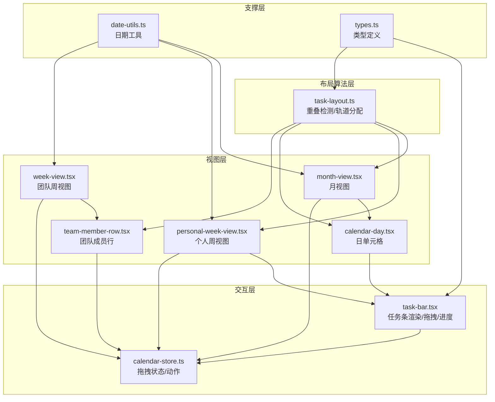
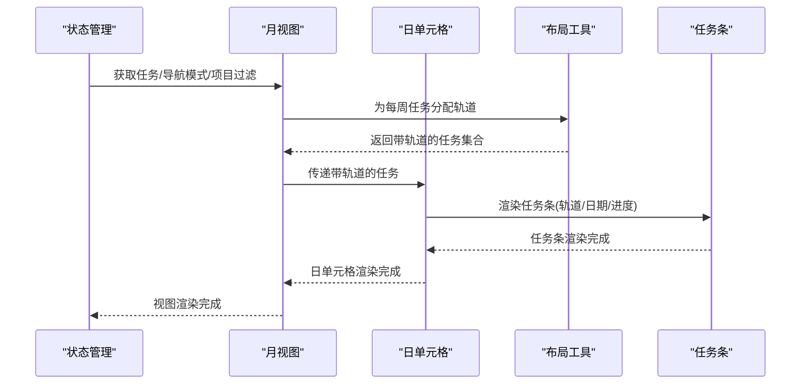
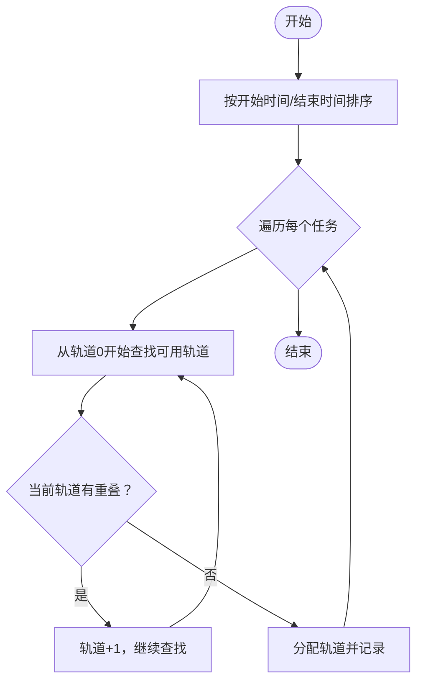
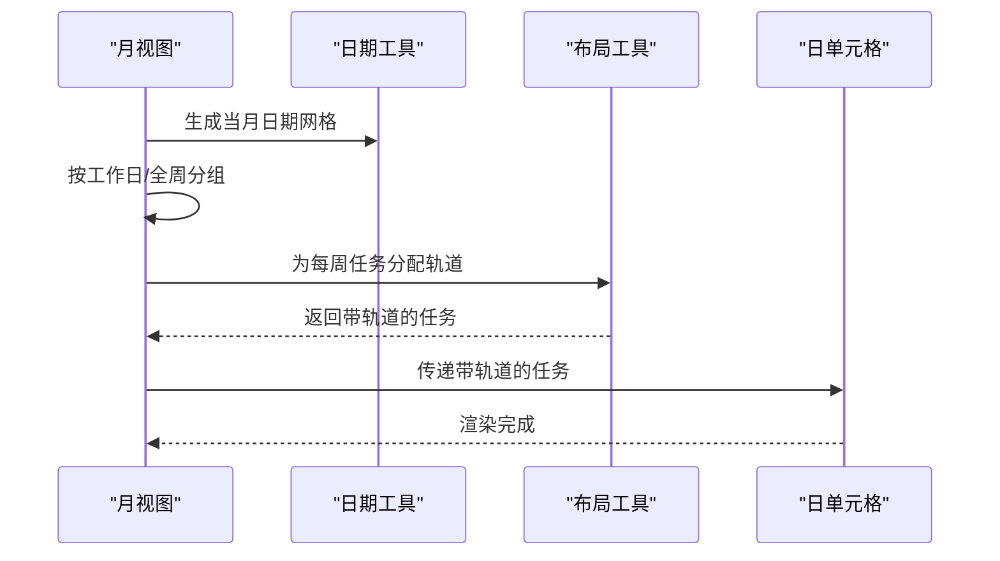
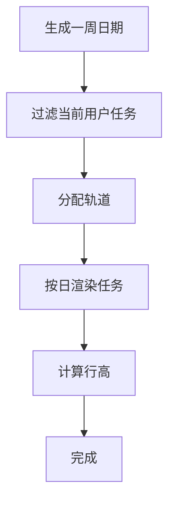
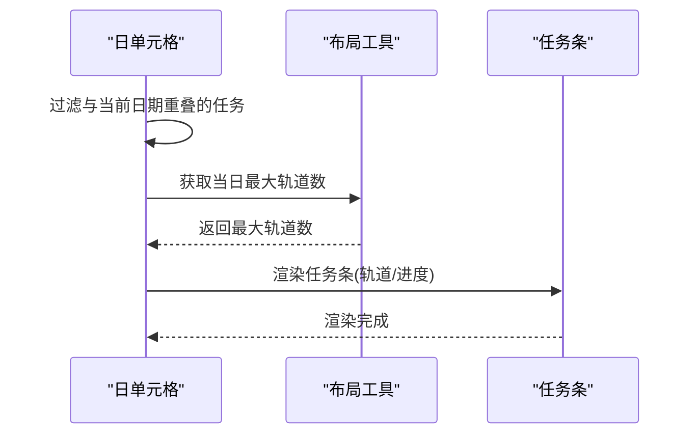
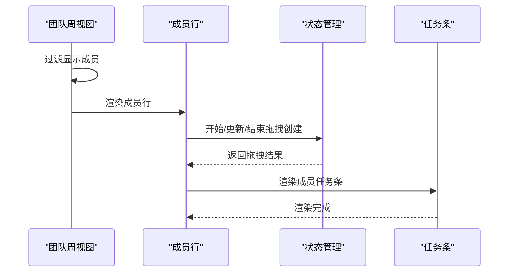
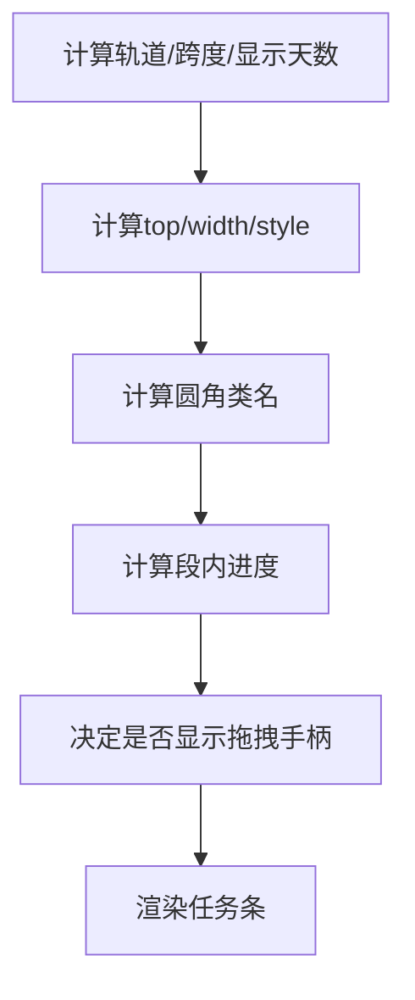
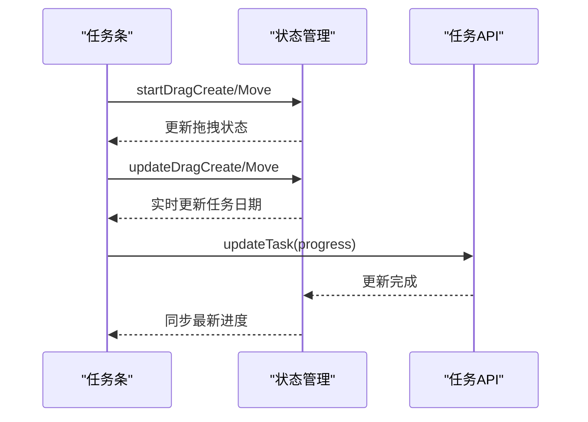
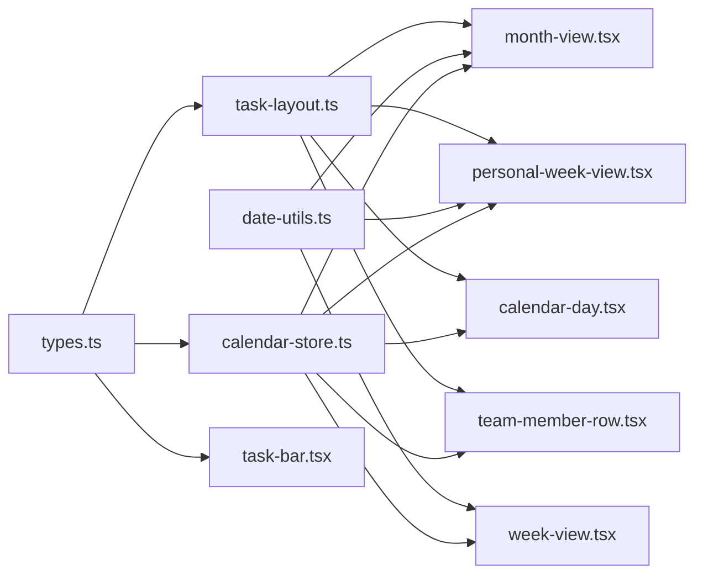

# 任务布局工具

<cite>
**本文档引用的文件**
- [task-layout.ts](file://lib/utils/task-layout.ts)
- [task-bar.tsx](file://components/calendar/task-bar.tsx)
- [month-view.tsx](file://components/calendar/month-view.tsx)
- [personal-week-view.tsx](file://components/calendar/personal-week-view.tsx)
- [calendar-day.tsx](file://components/calendar/calendar-day.tsx)
- [week-view.tsx](file://components/calendar/week-view.tsx)
- [team-member-row.tsx](file://components/calendar/team-member-row.tsx)
- [calendar-store.ts](file://lib/store/calendar-store.ts)
- [types.ts](file://lib/types.ts)
- [date-utils.ts](file://lib/utils/date-utils.ts)
</cite>

## 目录
1. [简介](#简介)
2. [项目结构](#项目结构)
3. [核心组件](#核心组件)
4. [架构概览](#架构概览)
5. [详细组件分析](#详细组件分析)
6. [依赖关系分析](#依赖关系分析)
7. [性能考量](#性能考量)
8. [故障排查指南](#故障排查指南)
9. [结论](#结论)
10. [附录](#附录)

## 简介
本指南聚焦于日历视图中的任务布局与可视化工具函数，系统讲解任务在月视图、周视图、日视图中的位置计算、重叠检测与空间分配算法，并提供任务条渲染、拖拽定位与尺寸调整的实现方法。文档同时覆盖冲突解决、自动排列与手动调整的处理逻辑，以及不同视图模式下的布局策略、响应式适配与性能优化技术，帮助开发者构建灵活高效的任务可视化解决方案。

## 项目结构
围绕任务布局与可视化的关键模块如下：
- 布局算法层：任务轨道分配与重叠检测
- 视图层：月视图、周视图、日视图、团队成员行
- 交互层：拖拽创建、拖拽移动、进度拖拽
- 状态层：Zustand 状态管理与全局配置

图表来源
- [task-layout.ts](file://lib/utils/task-layout.ts#L1-L77)
- [month-view.tsx](file://components/calendar/month-view.tsx#L1-L306)
- [personal-week-view.tsx](file://components/calendar/personal-week-view.tsx#L1-L200)
- [calendar-day.tsx](file://components/calendar/calendar-day.tsx#L1-L164)
- [week-view.tsx](file://components/calendar/week-view.tsx#L1-L109)
- [team-member-row.tsx](file://components/calendar/team-member-row.tsx#L1-L211)
- [task-bar.tsx](file://components/calendar/task-bar.tsx#L1-L700)
- [calendar-store.ts](file://lib/store/calendar-store.ts#L1-L1457)
- [date-utils.ts](file://lib/utils/date-utils.ts#L1-L86)
- [types.ts](file://lib/types.ts#L1-L141)

章节来源
- [task-layout.ts](file://lib/utils/task-layout.ts#L1-L77)
- [month-view.tsx](file://components/calendar/month-view.tsx#L1-L306)
- [personal-week-view.tsx](file://components/calendar/personal-week-view.tsx#L1-L200)
- [calendar-day.tsx](file://components/calendar/calendar-day.tsx#L1-L164)
- [week-view.tsx](file://components/calendar/week-view.tsx#L1-L109)
- [team-member-row.tsx](file://components/calendar/team-member-row.tsx#L1-L211)
- [task-bar.tsx](file://components/calendar/task-bar.tsx#L1-L700)
- [calendar-store.ts](file://lib/store/calendar-store.ts#L1-L1457)
- [date-utils.ts](file://lib/utils/date-utils.ts#L1-L86)
- [types.ts](file://lib/types.ts#L1-L141)

## 核心组件
- 任务轨道分配与重叠检测：基于日期范围的轨道分配，确保同一轨道上无重叠
- 任务条渲染与交互：支持拖拽创建、拖拽移动、进度拖拽、跨段高亮
- 视图适配：月视图按周分组、周视图按日分段、日视图按日期过滤
- 状态管理：统一的拖拽状态与动作，保证跨组件一致性

章节来源
- [task-layout.ts](file://lib/utils/task-layout.ts#L1-L77)
- [task-bar.tsx](file://components/calendar/task-bar.tsx#L1-L700)
- [month-view.tsx](file://components/calendar/month-view.tsx#L1-L306)
- [personal-week-view.tsx](file://components/calendar/personal-week-view.tsx#L1-L200)
- [calendar-day.tsx](file://components/calendar/calendar-day.tsx#L1-L164)
- [week-view.tsx](file://components/calendar/week-view.tsx#L1-L109)
- [team-member-row.tsx](file://components/calendar/team-member-row.tsx#L1-L211)
- [calendar-store.ts](file://lib/store/calendar-store.ts#L1-L1457)

## 架构概览
任务布局与可视化的整体流程：
- 数据准备：从全局状态获取任务、项目、用户、团队与导航模式
- 过滤与分组：按导航模式与项目筛选任务，按周/日进行分组
- 轨道分配：对每组任务执行重叠检测与轨道分配
- 渲染：根据轨道与日期计算位置，渲染任务条与进度
- 交互：拖拽创建/移动、进度拖拽、跨段高亮

图表来源
- [calendar-store.ts](file://lib/store/calendar-store.ts#L1-L1457)
- [month-view.tsx](file://components/calendar/month-view.tsx#L1-L306)
- [calendar-day.tsx](file://components/calendar/calendar-day.tsx#L1-L164)
- [task-layout.ts](file://lib/utils/task-layout.ts#L1-L77)
- [task-bar.tsx](file://components/calendar/task-bar.tsx#L1-L700)

## 详细组件分析

### 布局算法：重叠检测与轨道分配
- 重叠检测：将任务的开始/结束日期归零到当天00:00:00与23:59:59，判断区间是否相交
- 轨道分配：按开始时间升序、结束时间升序排序，逐个任务寻找最低可用轨道，避免同轨道重叠
- 最大轨道数：按日期或周维度统计最大轨道数，用于容器高度计算

图表来源
- [task-layout.ts](file://lib/utils/task-layout.ts#L10-L68)

章节来源
- [task-layout.ts](file://lib/utils/task-layout.ts#L1-L77)

### 月视图：按周分组与轨道分配
- 日期生成：根据当前月份与周末隐藏策略生成整月日期网格
- 分周：按工作日或全周分组
- 每周任务过滤：仅保留与该周有重叠的任务
- 轨道分配：对每周任务独立分配轨道
- 高度计算：按最大轨道数与任务条尺寸动态计算行高

图表来源
- [month-view.tsx](file://components/calendar/month-view.tsx#L31-L174)
- [date-utils.ts](file://lib/utils/date-utils.ts#L1-L86)
- [task-layout.ts](file://lib/utils/task-layout.ts#L1-L77)

章节来源
- [month-view.tsx](file://components/calendar/month-view.tsx#L1-L306)

### 个人周视图：按日渲染与轨道分配
- 日期生成：根据当前周与周末隐藏策略生成一周日期
- 任务过滤：仅显示当前用户负责的任务
- 轨道分配：对用户任务分配轨道
- 日渲染：按日期过滤任务，仅渲染开始日期或跨周延续任务
- 高度计算：按最大轨道数与任务条尺寸计算行高

图表来源
- [personal-week-view.tsx](file://components/calendar/personal-week-view.tsx#L14-L94)
- [task-layout.ts](file://lib/utils/task-layout.ts#L1-L77)

章节来源
- [personal-week-view.tsx](file://components/calendar/personal-week-view.tsx#L1-L200)

### 日单元格：按日期过滤与渲染
- 日期过滤：仅渲染与当前日期重叠的任务（开始日期或周一跨周延续）
- 轨道渲染：根据任务轨道与日期计算top位置
- 高度计算：按当日最大轨道数计算容器高度

图表来源
- [calendar-day.tsx](file://components/calendar/calendar-day.tsx#L38-L86)
- [task-layout.ts](file://lib/utils/task-layout.ts#L73-L76)
- [task-bar.tsx](file://components/calendar/task-bar.tsx#L491-L496)

章节来源
- [calendar-day.tsx](file://components/calendar/calendar-day.tsx#L1-L164)

### 团队周视图：成员行与拖拽创建
- 成员过滤：根据导航模式过滤显示成员
- 成员行：为每个成员渲染一行，包含头像与一周日期
- 拖拽创建：限制拖拽用户ID，仅允许当前成员创建任务
- 轨道分配：对成员任务分配轨道

图表来源
- [week-view.tsx](file://components/calendar/week-view.tsx#L29-L51)
- [team-member-row.tsx](file://components/calendar/team-member-row.tsx#L110-L141)
- [calendar-store.ts](file://lib/store/calendar-store.ts#L1158-L1164)

章节来源
- [week-view.tsx](file://components/calendar/week-view.tsx#L1-L109)
- [team-member-row.tsx](file://components/calendar/team-member-row.tsx#L1-L211)

### 任务条渲染：位置计算与尺寸调整
- 位置计算：根据轨道与任务条尺寸计算top；宽度根据跨天数计算
- 圆角策略：开始段左圆角、结束段右圆角、跨段两端圆角
- 进度渲染：按段内进度百分比绘制进度背景
- 拖拽手柄：仅日常任务显示，按进度位置动态定位
- 交互控制：拖拽时禁用其他任务交互，跨段高亮通过全局状态实现

图表来源
- [task-bar.tsx](file://components/calendar/task-bar.tsx#L113-L173)
- [task-bar.tsx](file://components/calendar/task-bar.tsx#L208-L231)
- [task-bar.tsx](file://components/calendar/task-bar.tsx#L406-L435)
- [task-bar.tsx](file://components/calendar/task-bar.tsx#L440-L460)

章节来源
- [task-bar.tsx](file://components/calendar/task-bar.tsx#L1-L700)

### 拖拽定位与尺寸调整
- 拖拽创建：记录起始日期与结束日期，实时更新拖拽范围
- 拖拽移动：计算偏移天数，实时更新任务开始/结束日期
- 进度拖拽：将段内进度转换为总进度，提交更新并使用乐观状态避免回弹

图表来源
- [task-bar.tsx](file://components/calendar/task-bar.tsx#L280-L381)
- [calendar-store.ts](file://lib/store/calendar-store.ts#L1167-L1222)

章节来源
- [task-bar.tsx](file://components/calendar/task-bar.tsx#L1-L700)
- [calendar-store.ts](file://lib/store/calendar-store.ts#L1-L1457)

## 依赖关系分析
- 布局算法依赖任务类型与日期范围，输出带轨道的任务集合
- 视图组件依赖布局算法与日期工具，按周/日维度分组与渲染
- 交互组件依赖状态管理，实现拖拽创建/移动与进度更新
- 类型定义贯穿各层，确保任务、用户、项目、团队与导航模式的一致性

图表来源
- [task-layout.ts](file://lib/utils/task-layout.ts#L1-L77)
- [month-view.tsx](file://components/calendar/month-view.tsx#L1-L306)
- [personal-week-view.tsx](file://components/calendar/personal-week-view.tsx#L1-L200)
- [calendar-day.tsx](file://components/calendar/calendar-day.tsx#L1-L164)
- [week-view.tsx](file://components/calendar/week-view.tsx#L1-L109)
- [team-member-row.tsx](file://components/calendar/team-member-row.tsx#L1-L211)
- [task-bar.tsx](file://components/calendar/task-bar.tsx#L1-L700)
- [calendar-store.ts](file://lib/store/calendar-store.ts#L1-L1457)
- [date-utils.ts](file://lib/utils/date-utils.ts#L1-L86)
- [types.ts](file://lib/types.ts#L1-L141)

章节来源
- [task-layout.ts](file://lib/utils/task-layout.ts#L1-L77)
- [calendar-store.ts](file://lib/store/calendar-store.ts#L1-L1457)
- [types.ts](file://lib/types.ts#L1-L141)

## 性能考量
- 计算复杂度：轨道分配为O(n^2)，建议在任务量较大时启用分页或虚拟化
- 渲染优化：使用Memo化减少重复计算，按周/日维度分组渲染
- 交互优化：拖拽移动采用实时更新与乐观状态，避免频繁网络请求
- 响应式适配：根据任务条尺寸与轨道数动态计算容器高度，支持紧凑/宽松两种模式

## 故障排查指南
- 任务重叠异常：检查重叠检测逻辑与日期归零处理
- 轨道分配错误：确认排序规则与冲突检测条件
- 拖拽创建无效：检查拖拽用户ID限制与状态同步
- 进度拖拽回弹：确认乐观状态与状态同步机制

章节来源
- [task-layout.ts](file://lib/utils/task-layout.ts#L10-L68)
- [task-bar.tsx](file://components/calendar/task-bar.tsx#L358-L376)
- [calendar-store.ts](file://lib/store/calendar-store.ts#L1167-L1222)

## 结论
本指南提供了完整的任务布局与可视化工具函数使用方法，涵盖月视图、周视图、日视图的布局策略与交互实现。通过轨道分配与重叠检测算法、跨段进度渲染与拖拽交互，开发者可以构建灵活高效的任务可视化解决方案，并在不同视图模式下实现良好的响应式适配与性能优化。

## 附录
- 任务类型与颜色配置：支持日常、会议、假期类型与自定义颜色
- 导航模式：My Days、团队、项目三种模式下的任务过滤与渲染
- 日期工具：月视图与周视图的日期生成与格式化

章节来源
- [types.ts](file://lib/types.ts#L1-L141)
- [date-utils.ts](file://lib/utils/date-utils.ts#L1-L86)
- [week-view.tsx](file://components/calendar/week-view.tsx#L29-L51)