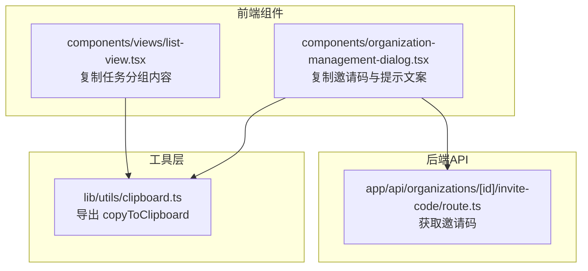
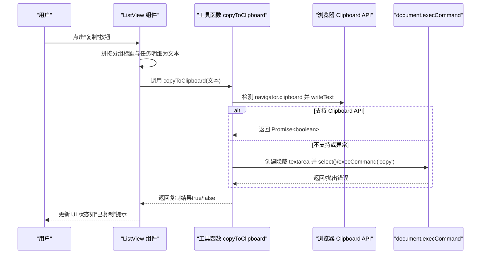
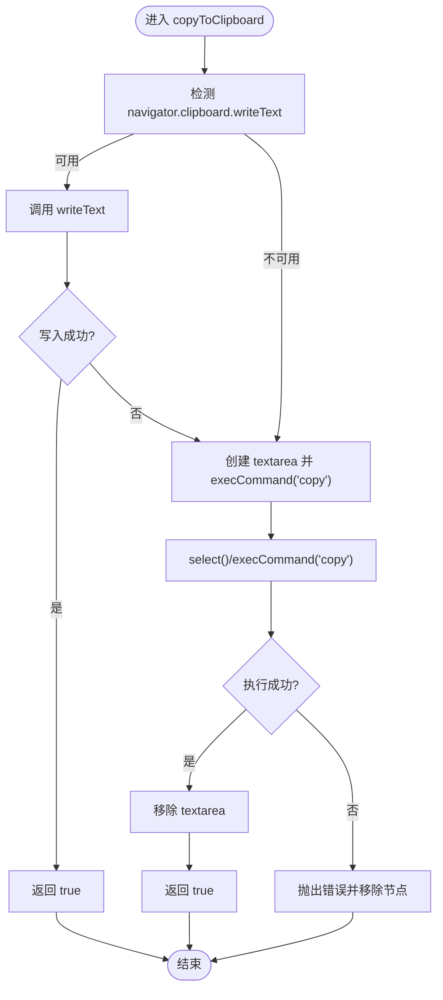
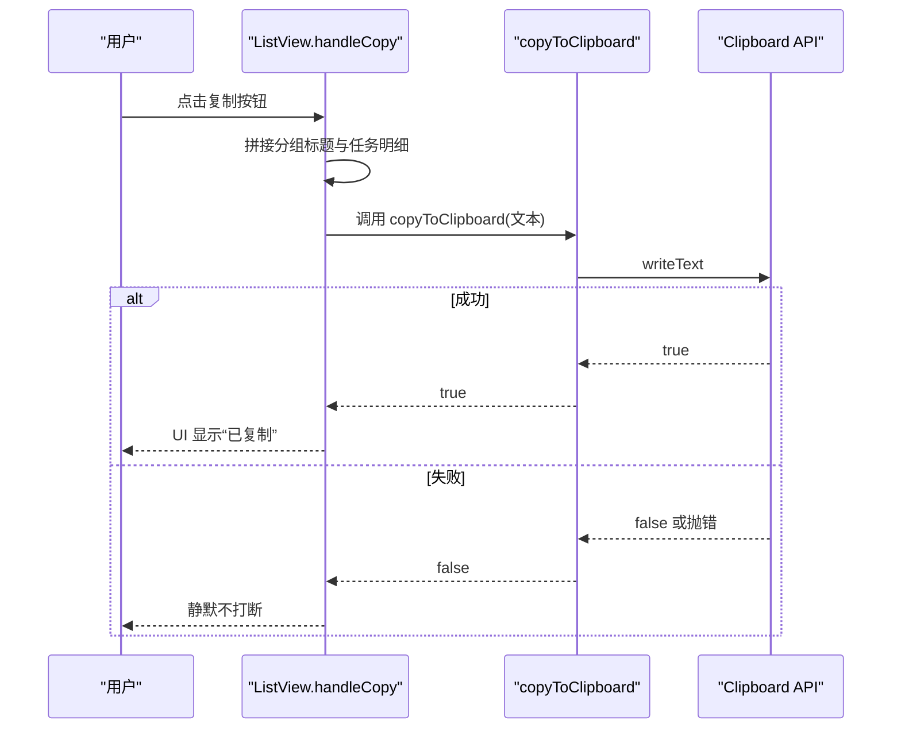
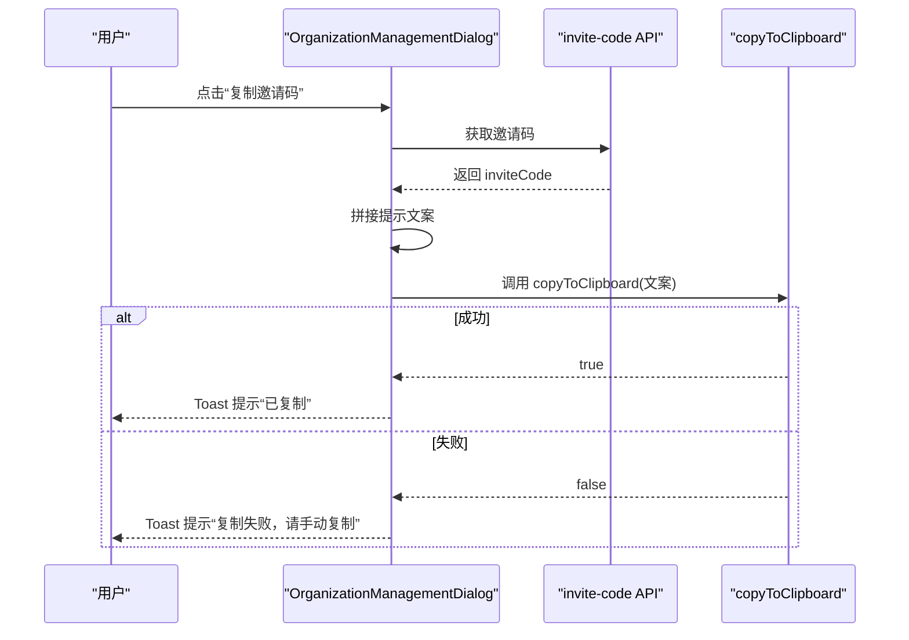
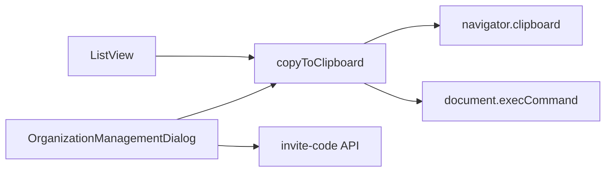

# 剪贴板工具

<cite>
**本文引用的文件**
- [lib/utils/clipboard.ts](file://lib/utils/clipboard.ts)
- [components/views/list-view.tsx](file://components/views/list-view.tsx)
- [components/organization-management-dialog.tsx](file://components/organization-management-dialog.tsx)
- [app/api/organizations/[id]/invite-code/route.ts](file://app/api/organizations/[id]/invite-code/route.ts)
- [INVITE_CODE_SYSTEM.md](file://INVITE_CODE_SYSTEM.md)
</cite>

## 目录
1. [简介](#简介)
2. [项目结构](#项目结构)
3. [核心组件](#核心组件)
4. [架构总览](#架构总览)
5. [详细组件分析](#详细组件分析)
6. [依赖关系分析](#依赖关系分析)
7. [性能考量](#性能考量)
8. [故障排查指南](#故障排查指南)
9. [结论](#结论)
10. [附录](#附录)

## 简介
本指南围绕“剪贴板工具”展开，重点讲解 copyToClipboard 函数的实现原理、浏览器兼容性与错误处理策略，并结合项目中的实际使用场景（任务列表批量复制、组织邀请码复制等）给出可操作的使用范式与最佳实践。同时覆盖权限检查、安全注意事项与用户体验优化建议，帮助开发者在不同浏览器环境下稳定地实现复制能力。

## 项目结构
剪贴板工具位于 lib/utils/clipboard.ts，被多个前端组件调用：
- 任务视图组件（list-view.tsx）：将分组后的任务内容拼接为文本后复制
- 组织管理对话框（organization-management-dialog.tsx）：复制邀请码与提示文案
- 邀请码 API（invite-code/route.ts）：提供邀请码数据源
- 文档（INVITE_CODE_SYSTEM.md）：补充邀请码复制与交互细节

图表来源
- [lib/utils/clipboard.ts](file://lib/utils/clipboard.ts#L1-L39)
- [components/views/list-view.tsx](file://components/views/list-view.tsx#L196-L225)
- [components/organization-management-dialog.tsx](file://components/organization-management-dialog.tsx#L370-L402)
- [app/api/organizations/[id]/invite-code/route.ts](file://app/api/organizations/[id]/invite-code/route.ts#L1-L54)

章节来源
- [lib/utils/clipboard.ts](file://lib/utils/clipboard.ts#L1-L39)
- [components/views/list-view.tsx](file://components/views/list-view.tsx#L1-L374)
- [components/organization-management-dialog.tsx](file://components/organization-management-dialog.tsx#L370-L402)
- [app/api/organizations/[id]/invite-code/route.ts](file://app/api/organizations/[id]/invite-code/route.ts#L1-L54)

## 核心组件
- 剪贴板工具函数：copyToClipboard(text: string) -> Promise<boolean>
  - 优先使用现代 Clipboard API；若不可用则回退到 document.execCommand('copy') 的传统方案
  - 对异常进行捕获与降级处理，保证调用方能获得布尔结果
- 任务视图组件：将分组标题与任务明细拼接为文本，调用工具函数复制
- 组织管理对话框：从后端获取邀请码，拼接提示文案，调用工具函数复制，并通过 Toast 与状态反馈用户

章节来源
- [lib/utils/clipboard.ts](file://lib/utils/clipboard.ts#L8-L38)
- [components/views/list-view.tsx](file://components/views/list-view.tsx#L196-L225)
- [components/organization-management-dialog.tsx](file://components/organization-management-dialog.tsx#L370-L402)

## 架构总览
下面的序列图展示了“复制任务分组内容”的典型调用链路，体现从前端组件到工具函数再到浏览器剪贴板的交互过程。

图表来源
- [components/views/list-view.tsx](file://components/views/list-view.tsx#L196-L225)
- [lib/utils/clipboard.ts](file://lib/utils/clipboard.ts#L8-L38)

## 详细组件分析

### 剪贴板工具函数 copyToClipboard
- 设计要点
  - 现代优先：优先使用 navigator.clipboard.writeText
  - 优雅降级：当 Clipboard API 不可用或抛错时，回退到 document.execCommand('copy')
  - 错误收敛：统一捕获异常并返回布尔结果，便于调用方进行 UI 反馈
- 数据流与复杂度
  - 输入：字符串文本
  - 输出：Promise<boolean> 表示是否成功
  - 时间复杂度：O(1)，主要受浏览器实现影响
  - 空间复杂度：O(n)，其中 n 为文本长度（临时 textarea）

图表来源
- [lib/utils/clipboard.ts](file://lib/utils/clipboard.ts#L8-L38)

章节来源
- [lib/utils/clipboard.ts](file://lib/utils/clipboard.ts#L8-L38)

### 任务视图组件中的复制逻辑
- 功能概述
  - 将当前分组的标题与每个任务的标题、描述、时间、负责人、项目等信息拼接为文本
  - 调用工具函数 copyToClipboard 执行复制
  - 成功后短暂高亮“已复制”，失败时静默处理（不打断用户）
- 关键点
  - 文本拼接遵循清晰的换行与分隔，便于粘贴后阅读
  - 失败路径不阻断 UI，保持流畅体验

图表来源
- [components/views/list-view.tsx](file://components/views/list-view.tsx#L196-L225)
- [lib/utils/clipboard.ts](file://lib/utils/clipboard.ts#L8-L38)

章节来源
- [components/views/list-view.tsx](file://components/views/list-view.tsx#L196-L225)

### 组织管理对话框中的邀请码复制
- 功能概述
  - 从后端 API 获取邀请码
  - 拼接“注册时空间组织输入...并输入邀请码”的提示文案
  - 调用工具函数复制，成功后 Toast 提示并短暂高亮“已复制”，失败则提示“请手动复制”
- 关键点
  - 严格校验邀请码存在性，避免空文案
  - 失败路径提供明确的用户指引

图表来源
- [components/organization-management-dialog.tsx](file://components/organization-management-dialog.tsx#L370-L402)
- [app/api/organizations/[id]/invite-code/route.ts](file://app/api/organizations/[id]/invite-code/route.ts#L1-L54)
- [lib/utils/clipboard.ts](file://lib/utils/clipboard.ts#L8-L38)

章节来源
- [components/organization-management-dialog.tsx](file://components/organization-management-dialog.tsx#L370-L402)
- [app/api/organizations/[id]/invite-code/route.ts](file://app/api/organizations/[id]/invite-code/route.ts#L1-L54)

## 依赖关系分析
- 组件依赖
  - ListView 依赖工具函数 copyToClipboard
  - OrganizationManagementDialog 依赖工具函数 copyToClipboard 与 invite-code API
- 工具函数依赖
  - 浏览器原生 API：navigator.clipboard 与 document.execCommand
- 外部集成
  - 邀请码 API 提供数据源，保障复制内容的时效性与准确性

图表来源
- [components/views/list-view.tsx](file://components/views/list-view.tsx#L13)
- [components/organization-management-dialog.tsx](file://components/organization-management-dialog.tsx#L22)
- [lib/utils/clipboard.ts](file://lib/utils/clipboard.ts#L10-L32)

章节来源
- [components/views/list-view.tsx](file://components/views/list-view.tsx#L13)
- [components/organization-management-dialog.tsx](file://components/organization-management-dialog.tsx#L22)
- [lib/utils/clipboard.ts](file://lib/utils/clipboard.ts#L10-L32)

## 性能考量
- 复制操作本身为 O(1) 级别，主要开销在于文本拼接与 DOM 操作
- 在高频触发场景（如批量复制）中，建议：
  - 合并多次复制请求，减少 UI 刷新
  - 对长文本进行必要的裁剪或分段复制
  - 使用防抖/节流避免重复点击导致的资源浪费
- 降级路径（execCommand）在移动端或受限环境中更常见，但性能与稳定性不如 Clipboard API

## 故障排查指南
- 常见问题与定位
  - 复制失败：检查浏览器是否支持 Clipboard API；若不支持，确认回退路径是否正常创建并移除 textarea
  - 权限限制：在 HTTP 环境或非 HTTPS 页面，Clipboard API 可能受限；建议在 HTTPS 环境使用
  - 用户交互时机：确保复制发生在用户主动触发的上下文中（如 click 事件），避免被浏览器拦截
  - 文本为空：确认拼接逻辑是否正确，避免传入空字符串
- 建议的调试步骤
  - 在调用前打印文本长度与内容摘要
  - 捕获并记录工具函数返回值与异常堆栈
  - 在失败路径提供 Toast 或提示，引导用户手动复制

章节来源
- [lib/utils/clipboard.ts](file://lib/utils/clipboard.ts#L34-L38)
- [components/views/list-view.tsx](file://components/views/list-view.tsx#L218-L225)
- [components/organization-management-dialog.tsx](file://components/organization-management-dialog.tsx#L395-L401)

## 结论
copyToClipboard 作为通用工具，提供了现代与传统双通道的复制能力，配合组件层的文案拼接与状态反馈，能够稳定支撑任务批量复制与邀请码复制等场景。建议在生产环境中：
- 优先使用 Clipboard API，并在失败时优雅降级
- 在用户交互上下文中触发复制，提升成功率
- 对失败路径提供明确的用户提示，避免静默失败
- 在 HTTPS 环境下运行，规避权限限制

## 附录

### 使用示例与最佳实践
- 复制纯文本
  - 场景：复制任务标题、描述、时间等
  - 建议：先拼接好文本，再调用工具函数；成功后短暂高亮“已复制”，失败时 Toast 提示
  - 参考路径：[components/views/list-view.tsx](file://components/views/list-view.tsx#L196-L225)
- 复制邀请码与提示文案
  - 场景：组织邀请码复制
  - 建议：先从 API 获取最新邀请码，再拼接提示文案；复制成功后 Toast 提示，失败则提示“请手动复制”
  - 参考路径：[components/organization-management-dialog.tsx](file://components/organization-management-dialog.tsx#L370-L402)、[app/api/organizations/[id]/invite-code/route.ts](file://app/api/organizations/[id]/invite-code/route.ts#L1-L54)
- 复杂数据复制
  - 场景：将结构化数据（如 JSON）转换为可读文本后复制
  - 建议：使用合适的缩进与换行，便于粘贴后阅读；必要时提供“复制失败，请手动复制”的兜底提示
  - 参考路径：[lib/utils/clipboard.ts](file://lib/utils/clipboard.ts#L8-L38)

### 浏览器兼容性与降级策略
- 现代 API：navigator.clipboard.writeText
  - 优点：无需用户交互即可写入剪贴板，安全性更高
  - 限制：需 HTTPS 环境；部分浏览器可能受限于上下文
- 传统方案：document.execCommand('copy')
  - 优点：兼容性更好，适用于旧版浏览器或受限环境
  - 注意：需要创建并聚焦 textarea，复制后及时移除节点
- 降级流程：当 Clipboard API 不可用或抛错时，回退到 execCommand；若仍失败，则抛出错误并返回 false

章节来源
- [lib/utils/clipboard.ts](file://lib/utils/clipboard.ts#L8-L38)

### 权限检查与安全考虑
- 权限检查
  - 仅在用户主动触发的上下文中调用复制，避免被浏览器拦截
  - 在非 HTTPS 环境下，Clipboard API 可能不可用，应提前提示或引导用户切换到 HTTPS
- 安全考虑
  - 邀请码属于敏感信息，复制后应尽快清理 UI 状态，避免长时间暴露
  - 复制失败时不要静默忽略，应提供明确提示，引导用户手动复制
- 用户体验优化
  - 成功复制后提供即时反馈（如“已复制”徽章或 Toast）
  - 失败时提供替代方案（如“请手动复制”）与最小化的错误提示

章节来源
- [components/views/list-view.tsx](file://components/views/list-view.tsx#L218-L225)
- [components/organization-management-dialog.tsx](file://components/organization-management-dialog.tsx#L395-L401)
- [INVITE_CODE_SYSTEM.md](file://INVITE_CODE_SYSTEM.md#L356-L371)