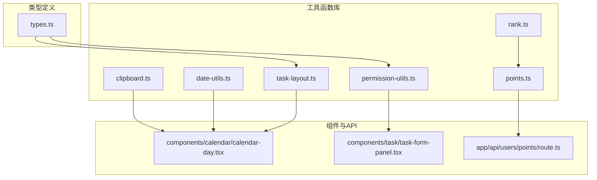
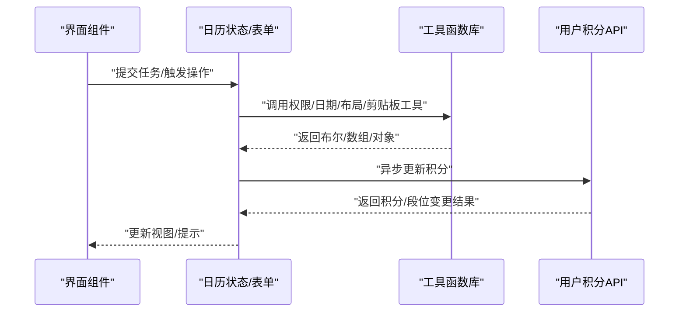
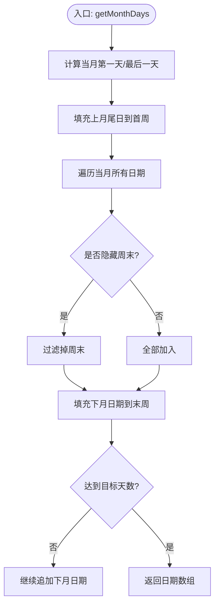
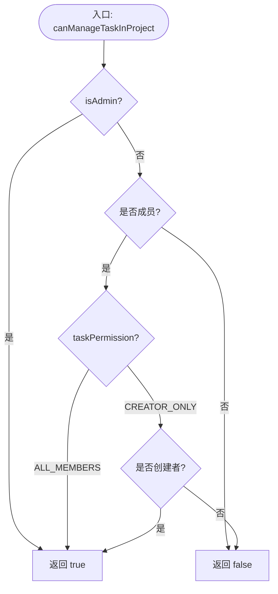
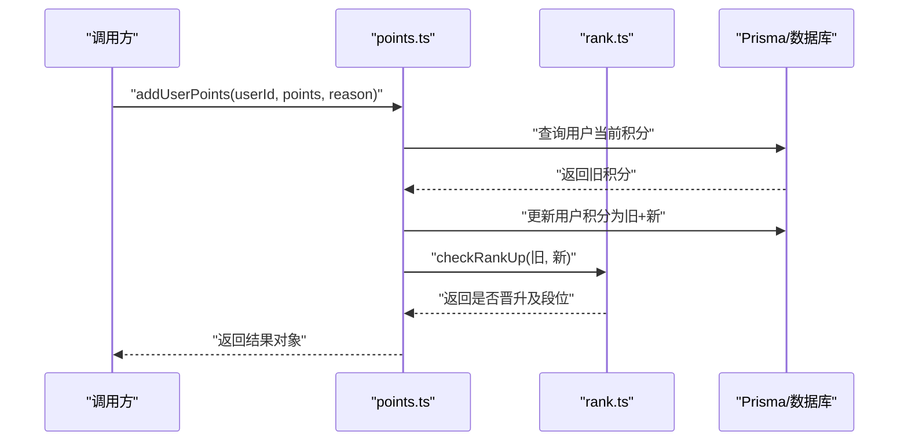
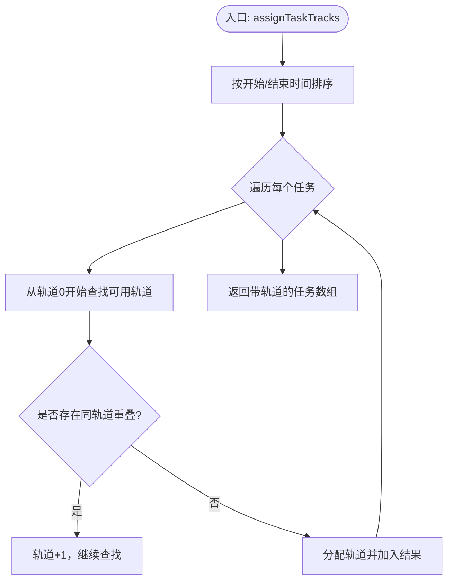
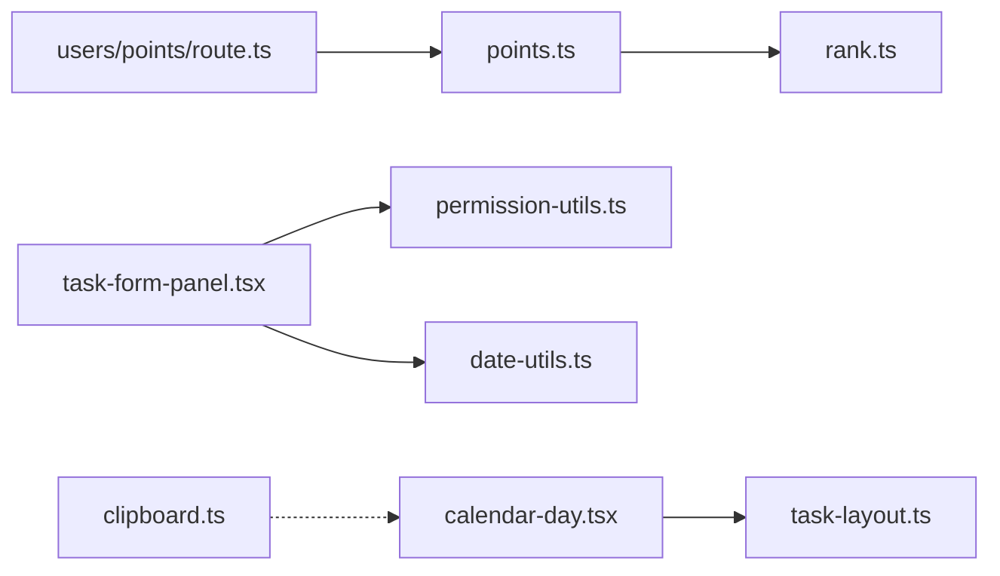

# 工具函数库使用

<cite>
**本文引用的文件**
- [lib/utils/clipboard.ts](file://lib/utils/clipboard.ts)
- [lib/utils/date-utils.ts](file://lib/utils/date-utils.ts)
- [lib/utils/permission-utils.ts](file://lib/utils/permission-utils.ts)
- [lib/utils/points.ts](file://lib/utils/points.ts)
- [lib/utils/rank.ts](file://lib/utils/rank.ts)
- [lib/utils/task-layout.ts](file://lib/utils/task-layout.ts)
- [lib/types.ts](file://lib/types.ts)
- [components/calendar/calendar-day.tsx](file://components/calendar/calendar-day.tsx)
- [components/task/task-form-panel.tsx](file://components/task/task-form-panel.tsx)
- [app/api/users/points/route.ts](file://app/api/users/points/route.ts)
- [DEPLOY_2025.11.26_TASK_FEATURES.md](file://DEPLOY_2025.11.26_TASK_FEATURES.md)
- [TASK_PERMISSION_FEATURE.md](file://TASK_PERMISSION_FEATURE.md)
</cite>

## 目录
1. [简介](#简介)
2. [项目结构](#项目结构)
3. [核心组件](#核心组件)
4. [架构概览](#架构概览)
5. [详细组件分析](#详细组件分析)
6. [依赖分析](#依赖分析)
7. [性能考虑](#性能考虑)
8. [故障排查指南](#故障排查指南)
9. [结论](#结论)
10. [附录](#附录)

## 简介
本指南面向日历任务管理系统的开发者，系统化介绍工具函数库中的六大类实用工具：剪贴板操作、日期时间处理、权限验证、积分计算、等级系统、任务布局算法。文档提供每个工具函数的API说明、参数与返回值、内部实现原理、性能特性、边界情况处理与最佳实践，帮助你在前端与后端高效集成与扩展。

## 项目结构
工具函数库位于 lib/utils 下，围绕以下职责划分：
- 剪贴板操作：提供跨浏览器的复制能力
- 日期时间工具：生成日历网格、周视图、格式化日期时间
- 权限验证：基于项目/团队协作策略与用户角色进行权限判定
- 积分计算：原子化地增加用户积分并联动等级晋升检查
- 等级系统：段位、星级、进度计算与行为积分配置
- 任务布局：基于时间重叠的任务轨道分配与最大轨道数计算

图表来源
- [lib/utils/clipboard.ts](file://lib/utils/clipboard.ts#L1-L39)
- [lib/utils/date-utils.ts](file://lib/utils/date-utils.ts#L1-L86)
- [lib/utils/permission-utils.ts](file://lib/utils/permission-utils.ts#L1-L72)
- [lib/utils/points.ts](file://lib/utils/points.ts#L1-L99)
- [lib/utils/rank.ts](file://lib/utils/rank.ts#L1-L156)
- [lib/utils/task-layout.ts](file://lib/utils/task-layout.ts#L1-L77)
- [lib/types.ts](file://lib/types.ts#L1-L141)
- [components/calendar/calendar-day.tsx](file://components/calendar/calendar-day.tsx#L1-L164)
- [components/task/task-form-panel.tsx](file://components/task/task-form-panel.tsx#L1-L200)
- [app/api/users/points/route.ts](file://app/api/users/points/route.ts#L42-L101)

章节来源
- [lib/utils/clipboard.ts](file://lib/utils/clipboard.ts#L1-L39)
- [lib/utils/date-utils.ts](file://lib/utils/date-utils.ts#L1-L86)
- [lib/utils/permission-utils.ts](file://lib/utils/permission-utils.ts#L1-L72)
- [lib/utils/points.ts](file://lib/utils/points.ts#L1-L99)
- [lib/utils/rank.ts](file://lib/utils/rank.ts#L1-L156)
- [lib/utils/task-layout.ts](file://lib/utils/task-layout.ts#L1-L77)
- [lib/types.ts](file://lib/types.ts#L1-L141)
- [components/calendar/calendar-day.tsx](file://components/calendar/calendar-day.tsx#L1-L164)
- [components/task/task-form-panel.tsx](file://components/task/task-form-panel.tsx#L1-L200)
- [app/api/users/points/route.ts](file://app/api/users/points/route.ts#L42-L101)

## 核心组件
- 剪贴板操作：提供复制文本到剪贴板的能力，优先使用 Clipboard API，不支持时降级到 execCommand，并处理异常与返回值。
- 日期时间工具：生成月视图网格、周视图日期序列、同日比较、日期/时间格式化、月份与星期名称映射。
- 权限验证：根据项目/团队的协作策略（ALL_MEMBERS/CREATOR_ONLY）与用户角色（管理员/成员/创建者）判定任务管理权限。
- 积分计算：原子化地增加用户积分，返回旧/新积分、是否晋升及段位信息；提供快捷方法用于任务/团队/项目创建与邀请奖励。
- 等级系统：定义段位配置、获取当前段位/下一阶段位、计算距离下一阶段所需积分、王者段位星级与段位内进度百分比；提供行为积分配置与晋升检查。
- 任务布局：判断任务日期范围重叠，按开始/结束时间排序后为任务分配轨道，保证重叠任务在不同轨道；计算某日最大轨道数以决定容器高度。

章节来源
- [lib/utils/clipboard.ts](file://lib/utils/clipboard.ts#L1-L39)
- [lib/utils/date-utils.ts](file://lib/utils/date-utils.ts#L1-L86)
- [lib/utils/permission-utils.ts](file://lib/utils/permission-utils.ts#L1-L72)
- [lib/utils/points.ts](file://lib/utils/points.ts#L1-L99)
- [lib/utils/rank.ts](file://lib/utils/rank.ts#L1-L156)
- [lib/utils/task-layout.ts](file://lib/utils/task-layout.ts#L1-L77)

## 架构概览
工具函数库与业务组件/API的交互关系如下：

图表来源
- [components/calendar/calendar-day.tsx](file://components/calendar/calendar-day.tsx#L1-L164)
- [components/task/task-form-panel.tsx](file://components/task/task-form-panel.tsx#L1-L200)
- [lib/utils/permission-utils.ts](file://lib/utils/permission-utils.ts#L1-L72)
- [lib/utils/date-utils.ts](file://lib/utils/date-utils.ts#L1-L86)
- [lib/utils/task-layout.ts](file://lib/utils/task-layout.ts#L1-L77)
- [lib/utils/clipboard.ts](file://lib/utils/clipboard.ts#L1-L39)
- [app/api/users/points/route.ts](file://app/api/users/points/route.ts#L42-L101)

## 详细组件分析

### 剪贴板操作函数
- 函数名：copyToClipboard
- 参数
  - text: string，要复制的文本内容
- 返回值
  - Promise<boolean>，复制是否成功
- 内部实现要点
  - 优先使用 navigator.clipboard.writeText；若不可用则创建隐藏 textarea，select 并 execCommand('copy')，最后清理节点
  - 异常捕获：记录错误并返回 false；execCommand 失败时抛出错误
- 边界情况
  - HTTP/IP 环境下 Clipboard API 不可用，需依赖降级方案
  - 文本为空或浏览器不支持时返回 false
- 性能特性
  - 仅在需要时创建 DOM 节点，执行后立即移除，开销极低
- 使用示例路径
  - 右键菜单/长按手势触发复制任务链接或详情
- 注意事项
  - HTTPS 环境下优先使用 Clipboard API；HTTP/IP 环境需提示用户手动复制

章节来源
- [lib/utils/clipboard.ts](file://lib/utils/clipboard.ts#L1-L39)
- [DEPLOY_2025.11.26_TASK_FEATURES.md](file://DEPLOY_2025.11.26_TASK_FEATURES.md#L290-L296)

### 日期时间处理工具
- getMonthDays(year, month, hideWeekends=false)
  - 生成指定年月的日历网格（填充上月/下月日期），支持隐藏周末
  - 返回 Date[]，长度通常为 30 或 42（6周×5天或6周×7天）
- getWeekDays(date, hideWeekends=false)
  - 以周一为一周开始，返回当周日期序列（5天或7天）
- isSameDay(date1, date2)
  - 比较两个日期是否为同一天
- formatDate(date)
  - 格式化为 YYYY-MM-DD
- formatTime(date)
  - 格式化为 HH:mm
- getMonthName(month)
  - 返回中文月份名称
- getWeekDayName(day)
  - 返回中文星期名称

图表来源
- [lib/utils/date-utils.ts](file://lib/utils/date-utils.ts#L1-L41)

章节来源
- [lib/utils/date-utils.ts](file://lib/utils/date-utils.ts#L1-L86)

### 权限验证函数
- canManageTaskInProject(userId, project, isAdmin=false)
  - 超级管理员直接通过；非成员无权限；ALL_MEMBERS 允许成员管理；CREATOR_ONLY 仅创建者可管理
- canManageTaskInTeam(userId, team, isAdmin=false)
  - 同上，针对团队
- getPermissionDeniedMessage(permission)
  - 根据权限策略返回友好提示

图表来源
- [lib/utils/permission-utils.ts](file://lib/utils/permission-utils.ts#L11-L30)

章节来源
- [lib/utils/permission-utils.ts](file://lib/utils/permission-utils.ts#L1-L72)
- [TASK_PERMISSION_FEATURE.md](file://TASK_PERMISSION_FEATURE.md#L1-L84)

### 积分计算工具
- addUserPoints(userId, points, reason)
  - 原子化增加用户积分，返回旧/新积分、是否晋升及段位信息
- addPointsForTaskCreation(userId)
- addPointsForTeamCreation(userId)
- addPointsForProjectCreation(userId)
- addPointsForUserInvitation(inviterId, invitedUserName)

图表来源
- [lib/utils/points.ts](file://lib/utils/points.ts#L11-L70)
- [lib/utils/rank.ts](file://lib/utils/rank.ts#L142-L155)
- [app/api/users/points/route.ts](file://app/api/users/points/route.ts#L42-L66)

章节来源
- [lib/utils/points.ts](file://lib/utils/points.ts#L1-L99)
- [lib/utils/rank.ts](file://lib/utils/rank.ts#L1-L156)
- [app/api/users/points/route.ts](file://app/api/users/points/route.ts#L42-L101)

### 等级系统函数
- 段位配置 RANKS：包含名称、最小积分、颜色与档次
- getRank(score)：根据积分获取当前段位
- getNextRank(score)：获取下一阶段位
- getPointsToNextRank(score)：距离下一阶段还需积分
- getKingStars(score)：王者段位总星数
- getCurrentRankStars(score)：当前段位内星数
- getRankProgress(score)：当前段位内进度百分比
- POINT_ACTIONS：行为积分配置（创建任务/团队/项目/邀请用户）

章节来源
- [lib/utils/rank.ts](file://lib/utils/rank.ts#L1-L156)

### 任务布局算法
- doTasksOverlap(task1, task2)
  - 将日期转换为当天起始/结束时间，判断时间区间是否重叠
- assignTaskTracks(tasks)
  - 按开始时间升序、结束时间升序排序；为每个任务寻找最低可用轨道（避免与同轨道重叠）
- getMaxTrackForDate(tasksWithTracks)
  - 计算某日最大轨道数，用于确定容器高度

图表来源
- [lib/utils/task-layout.ts](file://lib/utils/task-layout.ts#L28-L68)

章节来源
- [lib/utils/task-layout.ts](file://lib/utils/task-layout.ts#L1-L77)
- [components/calendar/calendar-day.tsx](file://components/calendar/calendar-day.tsx#L84-L86)

## 依赖分析
- 组件与工具函数的耦合
  - 日历单元格组件依赖任务布局工具计算轨道与容器高度
  - 任务表单组件依赖权限工具判断编辑/删除权限
  - 剪贴板工具可在多种交互场景中被调用
- 外部依赖
  - 积分系统依赖 Prisma 与数据库；等级系统依赖常量配置与纯函数计算
- 潜在循环依赖
  - 工具函数均为纯函数或轻量模块，无循环依赖风险

图表来源
- [components/calendar/calendar-day.tsx](file://components/calendar/calendar-day.tsx#L1-L164)
- [components/task/task-form-panel.tsx](file://components/task/task-form-panel.tsx#L1-L200)
- [lib/utils/task-layout.ts](file://lib/utils/task-layout.ts#L1-L77)
- [lib/utils/permission-utils.ts](file://lib/utils/permission-utils.ts#L1-L72)
- [lib/utils/date-utils.ts](file://lib/utils/date-utils.ts#L1-L86)
- [app/api/users/points/route.ts](file://app/api/users/points/route.ts#L42-L101)
- [lib/utils/points.ts](file://lib/utils/points.ts#L1-L99)
- [lib/utils/rank.ts](file://lib/utils/rank.ts#L1-L156)
- [lib/utils/clipboard.ts](file://lib/utils/clipboard.ts#L1-L39)

章节来源
- [lib/types.ts](file://lib/types.ts#L61-L106)
- [lib/utils/task-layout.ts](file://lib/utils/task-layout.ts#L1-L77)
- [lib/utils/permission-utils.ts](file://lib/utils/permission-utils.ts#L1-L72)
- [lib/utils/points.ts](file://lib/utils/points.ts#L1-L99)
- [lib/utils/rank.ts](file://lib/utils/rank.ts#L1-L156)
- [lib/utils/date-utils.ts](file://lib/utils/date-utils.ts#L1-L86)
- [lib/utils/clipboard.ts](file://lib/utils/clipboard.ts#L1-L39)
- [components/calendar/calendar-day.tsx](file://components/calendar/calendar-day.tsx#L1-L164)
- [components/task/task-form-panel.tsx](file://components/task/task-form-panel.tsx#L1-L200)
- [app/api/users/points/route.ts](file://app/api/users/points/route.ts#L42-L101)

## 性能考虑
- 剪贴板
  - 仅在调用时创建临时 textarea，执行后销毁，DOM 操作成本极低
- 日期工具
  - getMonthDays/getWeekDays 为 O(n) 遍历，n 为天数上限（42），开销可忽略
- 权限工具
  - 为 O(1)/O(m) 查询（m 为成员列表长度），通常较小
- 积分与等级
  - addUserPoints 为一次查询+一次更新+一次纯函数计算，复杂度低；等级查询为线性扫描 RANKS，RANKS 固定长度，可视为 O(1)
- 任务布局
  - assignTaskTracks 对每个任务进行轨道查找，最坏 O(n^2)，但实际中冲突较少，整体表现良好；getMaxTrackForDate 为 O(n)

[本节为通用性能讨论，不直接分析具体文件]

## 故障排查指南
- 剪贴板复制失败
  - 确认环境是否为 HTTPS；HTTP/IP 环境需依赖降级方案
  - 捕获返回值 false 或异常，引导用户手动复制
- 日期显示异常
  - 检查 getMonthDays 的 hideWeekends 参数与本地化月份/星期名称映射
- 权限判定错误
  - 核对项目/团队的 taskPermission 设置与用户成员身份
  - 确认 isAdmin 标志传递正确
- 积分更新失败
  - 检查用户存在性与数据库连接；查看 API 返回的错误响应
- 任务轨道错乱
  - 确认任务时间范围标准化（起始/结束均归一到当日边界）
  - 检查排序规则（开始时间优先，结束时间次之）

章节来源
- [lib/utils/clipboard.ts](file://lib/utils/clipboard.ts#L1-L39)
- [lib/utils/date-utils.ts](file://lib/utils/date-utils.ts#L1-L86)
- [lib/utils/permission-utils.ts](file://lib/utils/permission-utils.ts#L1-L72)
- [lib/utils/points.ts](file://lib/utils/points.ts#L1-L99)
- [lib/utils/task-layout.ts](file://lib/utils/task-layout.ts#L1-L77)
- [DEPLOY_2025.11.26_TASK_FEATURES.md](file://DEPLOY_2025.11.26_TASK_FEATURES.md#L290-L296)

## 结论
工具函数库提供了日历任务管理系统的基础设施能力：稳定的剪贴板复制、灵活的日期时间处理、严谨的权限校验、可扩展的积分与等级体系、以及高效的任务布局算法。遵循本文档的最佳实践与边界处理建议，可显著提升开发效率与用户体验。

[本节为总结性内容，不直接分析具体文件]

## 附录
- API 文档速览（示例）
  - copyToClipboard(text: string): Promise<boolean>
  - getMonthDays(year: number, month: number, hideWeekends?: boolean): Date[]
  - getWeekDays(date: Date, hideWeekends?: boolean): Date[]
  - isSameDay(date1: Date, date2: Date): boolean
  - formatDate(date: Date): string
  - formatTime(date: Date): string
  - getMonthName(month: number): string
  - getWeekDayName(day: number): string
  - canManageTaskInProject(userId: string, project: Project, isAdmin?: boolean): boolean
  - canManageTaskInTeam(userId: string, team: Team, isAdmin?: boolean): boolean
  - getPermissionDeniedMessage(permission: TaskPermission): string
  - addUserPoints(userId: string, points: number, reason: string): Promise<{ success: boolean; oldPoints: number; newPoints: number; hasRankUp: boolean; oldRank?: string; newRank?: string }>
  - addPointsForTaskCreation(userId: string)
  - addPointsForTeamCreation(userId: string)
  - addPointsForProjectCreation(userId: string)
  - addPointsForUserInvitation(inviterId: string, invitedUserName: string)
  - getRank(score: number): RankInfo
  - getNextRank(score: number): RankInfo | null
  - getPointsToNextRank(score: number): number | null
  - getKingStars(score: number): number | null
  - getCurrentRankStars(score: number): number | null
  - getRankProgress(score: number): number
  - doTasksOverlap(task1: Task, task2: Task): boolean
  - assignTaskTracks(tasks: Task[]): TaskWithTrack[]
  - getMaxTrackForDate(tasks: TaskWithTrack[]): number

[本节为概览性内容，不直接分析具体文件]