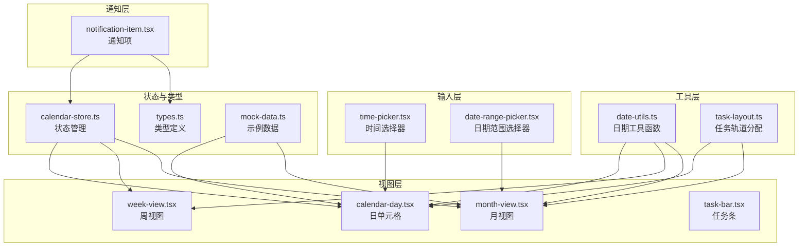
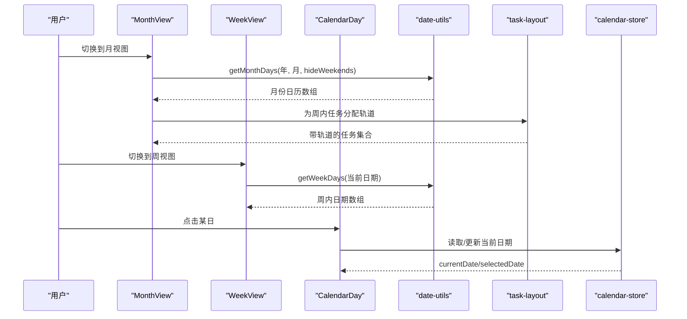
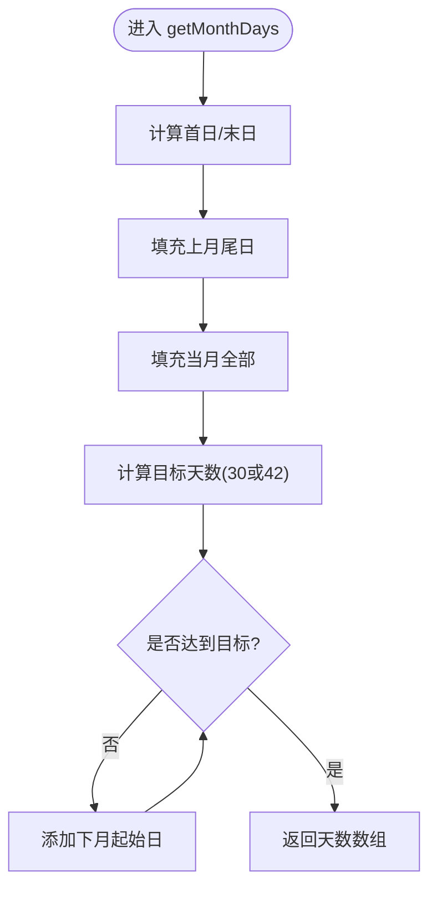
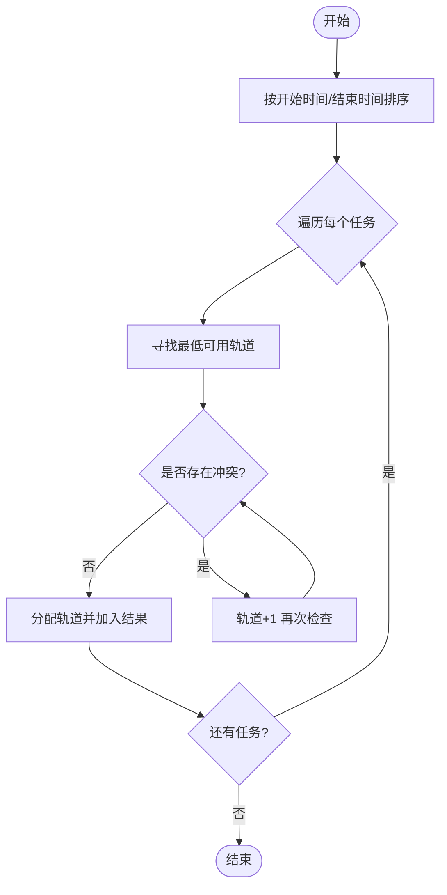
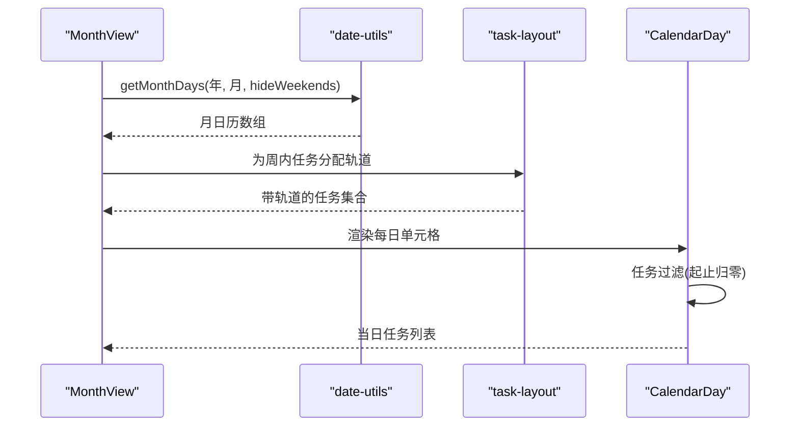
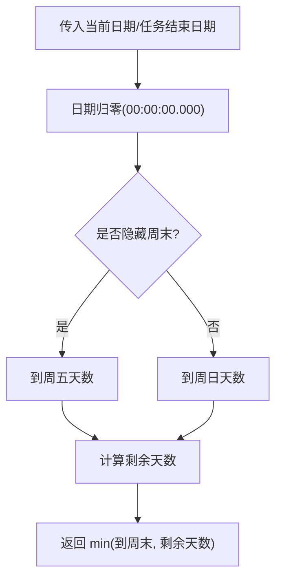
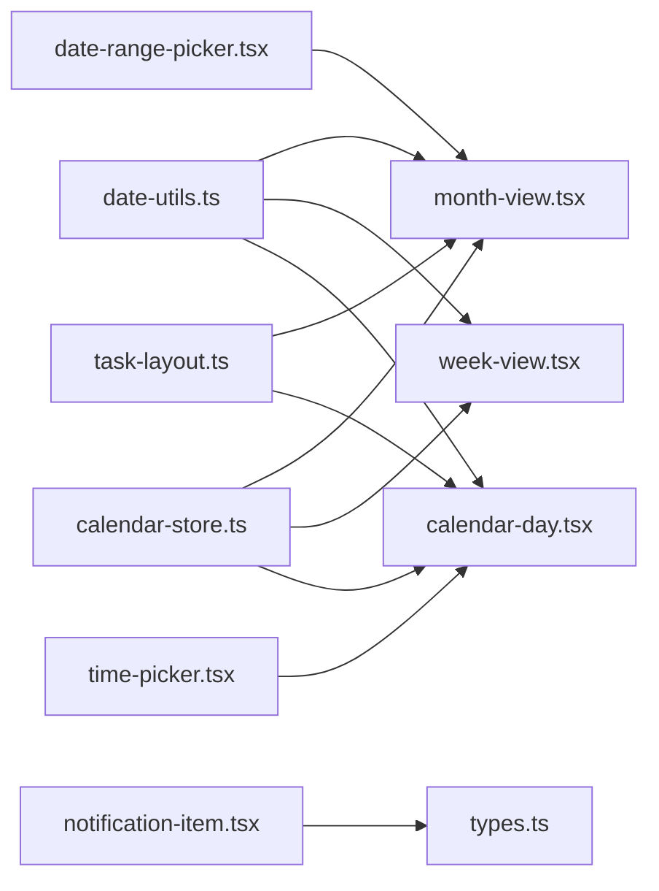

# 日期时间工具

<cite>
**本文档引用的文件**
- [lib/utils/date-utils.ts](file://lib/utils/date-utils.ts)
- [components/calendar/month-view.tsx](file://components/calendar/month-view.tsx)
- [components/calendar/week-view.tsx](file://components/calendar/week-view.tsx)
- [components/calendar/calendar-day.tsx](file://components/calendar/calendar-day.tsx)
- [components/calendar/task-bar.tsx](file://components/calendar/task-bar.tsx)
- [lib/utils/task-layout.ts](file://lib/utils/task-layout.ts)
- [lib/store/calendar-store.ts](file://lib/store/calendar-store.ts)
- [components/ui/time-picker.tsx](file://components/ui/time-picker.tsx)
- [components/ui/date-range-picker.tsx](file://components/ui/date-range-picker.tsx)
- [components/notification-item.tsx](file://components/notification-item.tsx)
- [lib/types.ts](file://lib/types.ts)
- [lib/mock-data.ts](file://lib/mock-data.ts)
</cite>

## 目录
1. [简介](#简介)
2. [项目结构](#项目结构)
3. [核心组件](#核心组件)
4. [架构总览](#架构总览)
5. [详细组件分析](#详细组件分析)
6. [依赖分析](#依赖分析)
7. [性能考量](#性能考量)
8. [故障排查指南](#故障排查指南)
9. [结论](#结论)
10. [附录](#附录)

## 简介
本指南围绕日历任务管理系统的日期时间处理工具函数，系统讲解日期解析、格式化、计算与比较；时区与本地化支持；夏令时转换；日期范围计算、工作日判断、季度与月份操作；以及与 JavaScript 原生 Date 对象的集成与替代方案。同时给出在日历视图切换、任务到期提醒等场景中的实践示例，并总结性能优化技巧与边界情况处理。

## 项目结构
与日期时间处理密切相关的模块分布如下：
- 工具函数：lib/utils/date-utils.ts 提供月份/周/日期格式化与工作日判断
- 视图组件：components/calendar/* 负责月视图、周视图、日单元格与任务条渲染
- 任务布局：lib/utils/task-layout.ts 负责任务轨道分配与重叠检测
- 状态管理：lib/store/calendar-store.ts 负责日期状态持久化与拖拽移动
- 输入组件：components/ui/time-picker.tsx、components/ui/date-range-picker.tsx 提供时间与日期范围选择
- 通知与相对时间：components/notification-item.tsx 使用 date-fns 格式化相对时间
- 类型定义：lib/types.ts 定义任务与通知等实体的日期字段
- 示例数据：lib/mock-data.ts 包含带日期的任务样例

图表来源
- [lib/utils/date-utils.ts](file://lib/utils/date-utils.ts#L1-L86)
- [lib/utils/task-layout.ts](file://lib/utils/task-layout.ts#L1-L76)
- [components/calendar/month-view.tsx](file://components/calendar/month-view.tsx#L1-L200)
- [components/calendar/week-view.tsx](file://components/calendar/week-view.tsx#L1-L109)
- [components/calendar/calendar-day.tsx](file://components/calendar/calendar-day.tsx#L1-L164)
- [components/calendar/task-bar.tsx](file://components/calendar/task-bar.tsx#L153-L192)
- [components/ui/time-picker.tsx](file://components/ui/time-picker.tsx#L1-L200)
- [components/ui/date-range-picker.tsx](file://components/ui/date-range-picker.tsx#L1-L83)
- [lib/store/calendar-store.ts](file://lib/store/calendar-store.ts#L1089-L1222)
- [lib/types.ts](file://lib/types.ts#L61-L82)
- [lib/mock-data.ts](file://lib/mock-data.ts#L57-L183)

章节来源
- [lib/utils/date-utils.ts](file://lib/utils/date-utils.ts#L1-L86)
- [components/calendar/month-view.tsx](file://components/calendar/month-view.tsx#L1-L200)
- [components/calendar/week-view.tsx](file://components/calendar/week-view.tsx#L1-L109)
- [components/calendar/calendar-day.tsx](file://components/calendar/calendar-day.tsx#L1-L164)
- [components/calendar/task-bar.tsx](file://components/calendar/task-bar.tsx#L153-L192)
- [lib/utils/task-layout.ts](file://lib/utils/task-layout.ts#L1-L76)
- [lib/store/calendar-store.ts](file://lib/store/calendar-store.ts#L1089-L1222)
- [components/ui/time-picker.tsx](file://components/ui/time-picker.tsx#L1-L200)
- [components/ui/date-range-picker.tsx](file://components/ui/date-range-picker.tsx#L1-L83)
- [components/notification-item.tsx](file://components/notification-item.tsx#L1-L200)
- [lib/types.ts](file://lib/types.ts#L61-L82)
- [lib/mock-data.ts](file://lib/mock-data.ts#L57-L183)

## 核心组件
本节聚焦于日期时间工具函数及其在视图与状态中的使用。

- 月份天数与填充
  - getMonthDays(year, month, hideWeekends=false)：生成指定月份的日历网格，按需填充上月/下月尾部，支持隐藏周末
  - 适用场景：月视图渲染、日历网格生成
- 周内日期集合
  - getWeekDays(date, hideWeekends=false)：返回以周一为起点的一周日期数组
  - 适用场景：周视图与日单元格的周范围计算
- 日期比较与格式化
  - isSameDay(date1, date2)：按年/月/日比较两日期是否同日
  - formatDate(date)：标准化日期字符串格式
  - formatTime(date)：标准化时间字符串格式
  - getMonthName(month)/getWeekDayName(day)：本地化月份与星期名称
  - 适用场景：任务过滤、渲染标签、通知时间显示

章节来源
- [lib/utils/date-utils.ts](file://lib/utils/date-utils.ts#L1-L86)
- [components/calendar/month-view.tsx](file://components/calendar/month-view.tsx#L31-L36)
- [components/calendar/week-view.tsx](file://components/calendar/week-view.tsx#L27-L27)

## 架构总览
下图展示了从工具函数到视图组件、输入组件与状态管理的整体调用链路。

图表来源
- [components/calendar/month-view.tsx](file://components/calendar/month-view.tsx#L31-L36)
- [components/calendar/week-view.tsx](file://components/calendar/week-view.tsx#L27-L27)
- [components/calendar/calendar-day.tsx](file://components/calendar/calendar-day.tsx#L34-L35)
- [lib/utils/date-utils.ts](file://lib/utils/date-utils.ts#L1-L86)
- [lib/utils/task-layout.ts](file://lib/utils/task-layout.ts#L28-L68)
- [lib/store/calendar-store.ts](file://lib/store/calendar-store.ts#L1427-L1456)

## 详细组件分析

### 日期工具函数族
- getMonthDays
  - 功能要点：计算首日/末日，填充上月尾日与下月起始日，按需裁剪周末，保证6周网格
  - 复杂度：O(D) 生成 D 天列表，空间 O(D)
  - 边界：月份切换、闰年、hideWeekends=true 时目标天数为 30
- getWeekDays
  - 功能要点：以周一为一周起点，返回连续 5/7 天数组
  - 复杂度：O(1) 生成固定长度数组
- isSameDay/formatDate/formatTime
  - 功能要点：按日粒度比较与格式化，便于过滤与显示
- getMonthName/getWeekDayName
  - 功能要点：中文本地化名称，配合 UI 渲染

图表来源
- [lib/utils/date-utils.ts](file://lib/utils/date-utils.ts#L1-L41)

章节来源
- [lib/utils/date-utils.ts](file://lib/utils/date-utils.ts#L1-L86)

### 任务轨道分配与重叠检测
- doTasksOverlap
  - 功能要点：将任务起止时间归零到天粒度，判断时间区间是否重叠
  - 注意：起始日设 00:00:00.000，结束日设 23:59:59.999，确保跨日边界正确
- assignTaskTracks
  - 功能要点：按开始时间与结束时间排序，贪心分配最小可用轨道，避免重叠
  - 复杂度：O(N^2)（每任务检查已有轨道冲突），N 为任务数
- getMaxTrackForDate
  - 功能要点：按日期聚合最大轨道数，用于计算行高

图表来源
- [lib/utils/task-layout.ts](file://lib/utils/task-layout.ts#L10-L68)

章节来源
- [lib/utils/task-layout.ts](file://lib/utils/task-layout.ts#L1-L76)

### 日历视图中的日期处理
- 月视图
  - 使用 getMonthDays 生成网格，按周分组，独立为每周任务分配轨道
  - 通过 isSameDay 与日期归零逻辑过滤周内任务
- 周视图
  - 使用 getWeekDays 生成周一至周日或周一至周五数组
  - 与导航模式结合，按团队/项目/我的天数过滤用户与任务
- 日单元格
  - 过滤当日任务：起止时间归零后与当前日期比较
  - 跨周延续：周一且任务在周前开始、周内结束的情况特殊处理

图表来源
- [components/calendar/month-view.tsx](file://components/calendar/month-view.tsx#L104-L140)
- [components/calendar/month-view.tsx](file://components/calendar/month-view.tsx#L113-L140)
- [components/calendar/calendar-day.tsx](file://components/calendar/calendar-day.tsx#L38-L78)
- [lib/utils/date-utils.ts](file://lib/utils/date-utils.ts#L1-L86)
- [lib/utils/task-layout.ts](file://lib/utils/task-layout.ts#L28-L68)

章节来源
- [components/calendar/month-view.tsx](file://components/calendar/month-view.tsx#L1-L200)
- [components/calendar/week-view.tsx](file://components/calendar/week-view.tsx#L1-L109)
- [components/calendar/calendar-day.tsx](file://components/calendar/calendar-day.tsx#L1-L164)

### 任务条中的剩余天数与到期判断
- calculateDisplayDays
  - 计算当前段到周末或任务结束的最小天数，考虑 hideWeekends
- isTaskStart/isSegmentEnd
  - 通过将日期归零后比较，判断是否为任务开始或当前段是否包含结束日

图表来源
- [components/calendar/task-bar.tsx](file://components/calendar/task-bar.tsx#L153-L173)

章节来源
- [components/calendar/task-bar.tsx](file://components/calendar/task-bar.tsx#L153-L192)

### 时间与日期范围选择器
- TimePicker
  - 支持直接输入与可视化时钟表盘选择，角度计算与时针/分针联动
  - 快捷时间列表与数字输入框，便于快速设置
- DateRangePicker
  - 基于 date-fns 本地化，支持双月展示与天数计算

章节来源
- [components/ui/time-picker.tsx](file://components/ui/time-picker.tsx#L1-L200)
- [components/ui/date-range-picker.tsx](file://components/ui/date-range-picker.tsx#L1-L83)

### 通知与相对时间
- NotificationItem
  - 使用 formatDistanceToNow 与 zhCN 本地化显示“几分钟前”等相对时间
  - 与 Notification 类型定义配合，统一时间字段

章节来源
- [components/notification-item.tsx](file://components/notification-item.tsx#L1-L200)
- [lib/types.ts](file://lib/types.ts#L18-L28)

### 状态管理中的日期序列化
- calendar-store
  - onRehydrateStorage 中将字符串恢复为 Date 对象，确保状态持久化后日期仍可用
  - dragState/dragMoveState 中对日期进行归零比较与偏移计算

章节来源
- [lib/store/calendar-store.ts](file://lib/store/calendar-store.ts#L1427-L1456)
- [lib/store/calendar-store.ts](file://lib/store/calendar-store.ts#L1089-L1222)

## 依赖分析
- 组件耦合
  - month-view 与 week-view 依赖 date-utils 提供的日期集合
  - calendar-day 与 task-bar 依赖 task-layout 的轨道分配
  - notification-item 依赖 date-fns 的相对时间格式化
- 外部依赖
  - date-fns：本地化与相对时间格式化
  - 原生 Date：基础日期运算与比较
- 循环依赖
  - 未发现直接循环导入；各模块职责清晰

图表来源
- [lib/utils/date-utils.ts](file://lib/utils/date-utils.ts#L1-L86)
- [lib/utils/task-layout.ts](file://lib/utils/task-layout.ts#L1-L76)
- [components/calendar/month-view.tsx](file://components/calendar/month-view.tsx#L1-L200)
- [components/calendar/week-view.tsx](file://components/calendar/week-view.tsx#L1-L109)
- [components/calendar/calendar-day.tsx](file://components/calendar/calendar-day.tsx#L1-L164)
- [components/ui/time-picker.tsx](file://components/ui/time-picker.tsx#L1-L200)
- [components/ui/date-range-picker.tsx](file://components/ui/date-range-picker.tsx#L1-L83)
- [lib/store/calendar-store.ts](file://lib/store/calendar-store.ts#L1089-L1222)
- [components/notification-item.tsx](file://components/notification-item.tsx#L1-L200)
- [lib/types.ts](file://lib/types.ts#L18-L28)

## 性能考量
- 任务轨道分配
  - 当前算法为 O(N^2)，适合中小规模任务；若任务数较多，可考虑区间树或事件扫描优化
- 日期归零
  - 多处对日期进行 setHours(0,0,0,0) 与 setHours(23,59,59,999)，避免重复构造，提升可读性与一致性
- 计算开销
  - 月视图按周分组并独立分配轨道，减少全局冲突检查范围
- 输入组件
  - TimePicker 与 date-range-picker 通过本地化与预设快捷值降低用户输入成本，间接提升性能（减少错误重试）

## 故障排查指南
- 任务重叠显示异常
  - 检查任务起止时间是否正确归零；确认 doTasksOverlap 的边界条件
- 周视图显示不完整
  - 确认 getWeekDays 的 hideWeekends 参数与 UI 周标题一致
- 日期比较误判
  - 使用 isSameDay 或对齐到同一天 00:00:00.000 再比较
- 拖拽移动日期偏移异常
  - 检查 dragState/dragMoveState 中的偏移计算与日期归零逻辑
- 通知相对时间显示异常
  - 确认使用 zhCN 本地化与 formatDistanceToNow 的参数

章节来源
- [lib/utils/task-layout.ts](file://lib/utils/task-layout.ts#L10-L22)
- [components/calendar/week-view.tsx](file://components/calendar/week-view.tsx#L27-L27)
- [components/calendar/calendar-day.tsx](file://components/calendar/calendar-day.tsx#L44-L52)
- [lib/store/calendar-store.ts](file://lib/store/calendar-store.ts#L1187-L1220)
- [components/notification-item.tsx](file://components/notification-item.tsx#L18-L19)

## 结论
本项目在日期时间处理方面形成了“工具函数 + 视图组件 + 输入组件 + 状态管理”的清晰架构。通过原生 Date 与 date-fns 的组合，实现了本地化、相对时间与高效的任务轨道分配。建议在大规模任务场景下进一步优化轨道分配算法，并完善边界与异常处理，以提升整体性能与稳定性。

## 附录

### 常用工具函数速查
- 月份/周/日集合：getMonthDays、getWeekDays、isSameDay
- 格式化：formatDate、formatTime、getMonthName、getWeekDayName
- 任务轨道：assignTaskTracks、doTasksOverlap、getMaxTrackForDate
- 输入组件：TimePicker、DateRangePicker
- 通知相对时间：formatDistanceToNow + zhCN

章节来源
- [lib/utils/date-utils.ts](file://lib/utils/date-utils.ts#L1-L86)
- [lib/utils/task-layout.ts](file://lib/utils/task-layout.ts#L1-L76)
- [components/ui/time-picker.tsx](file://components/ui/time-picker.tsx#L1-L200)
- [components/ui/date-range-picker.tsx](file://components/ui/date-range-picker.tsx#L1-L83)
- [components/notification-item.tsx](file://components/notification-item.tsx#L1-L200)