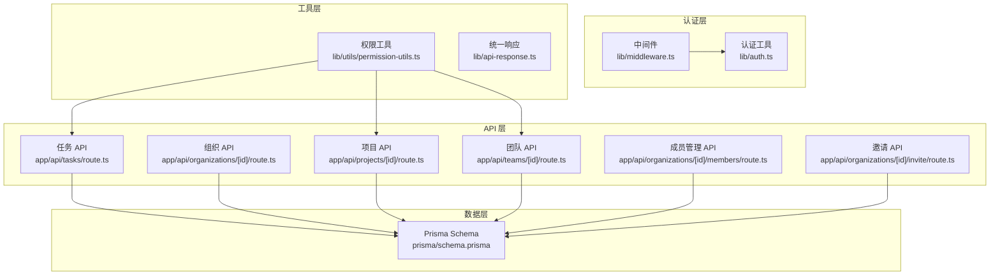
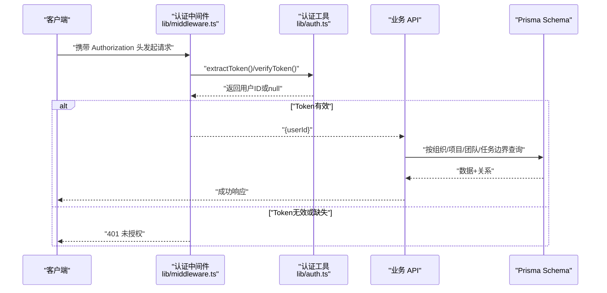
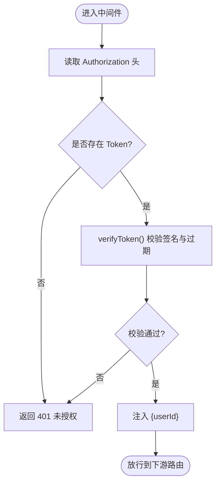
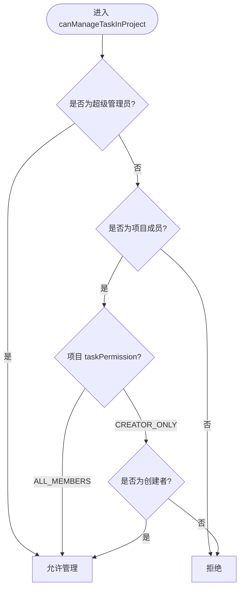
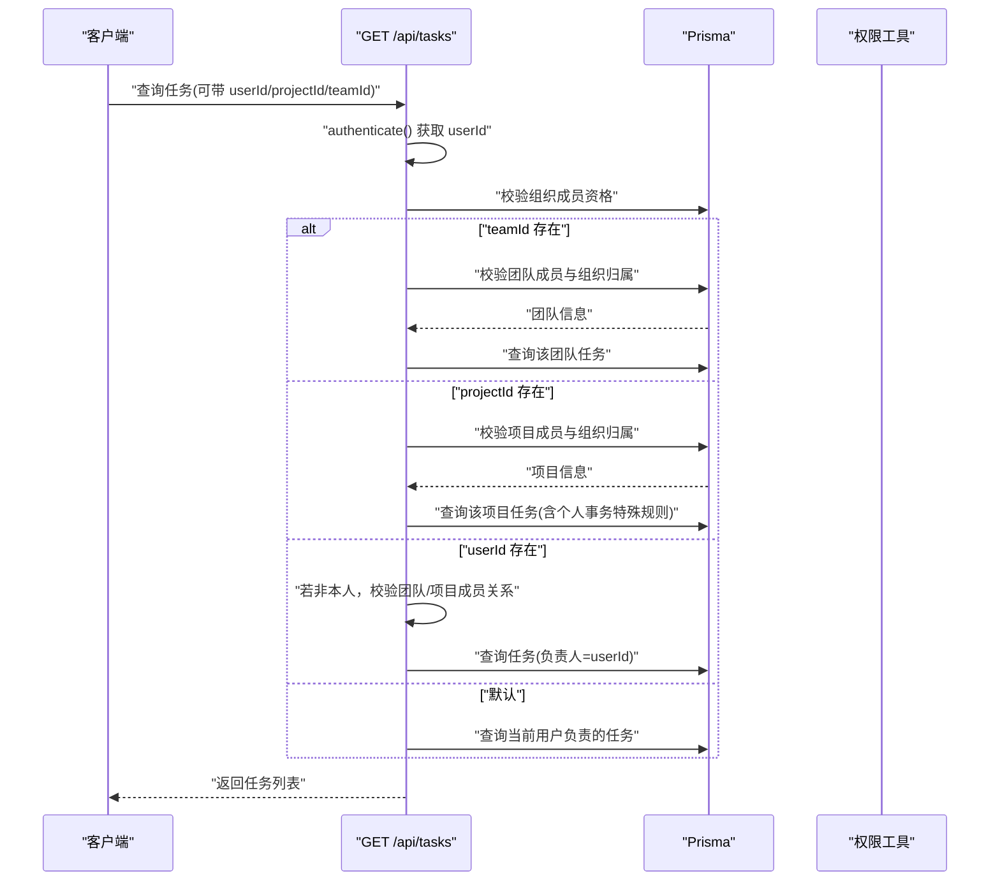
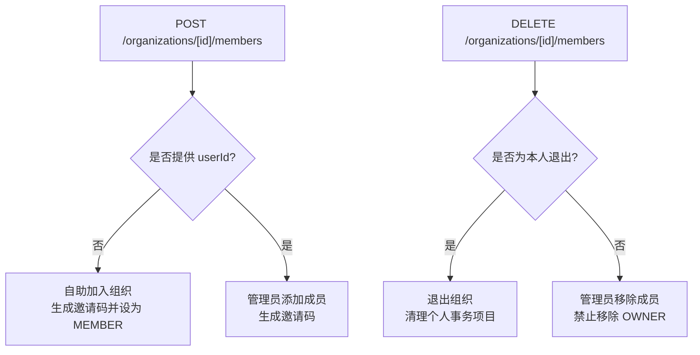
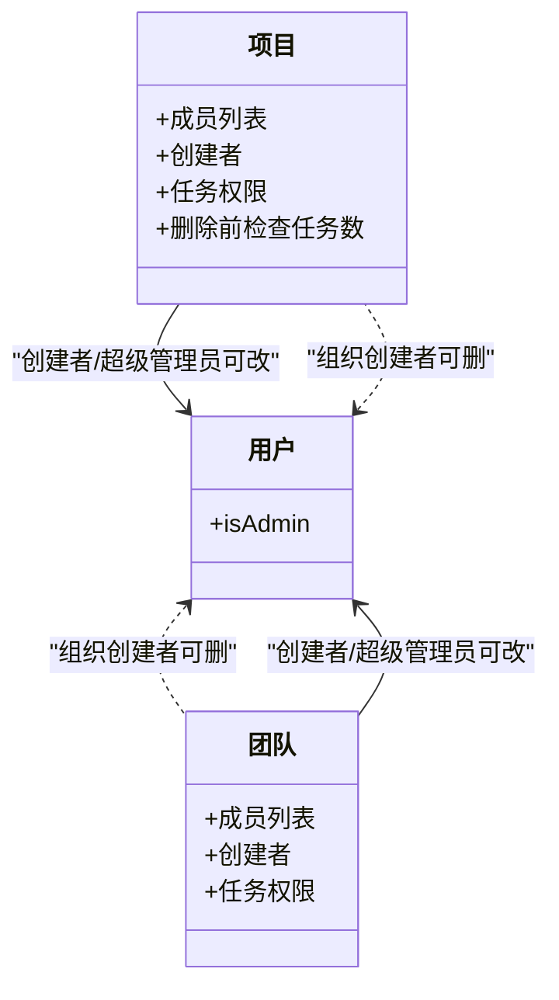
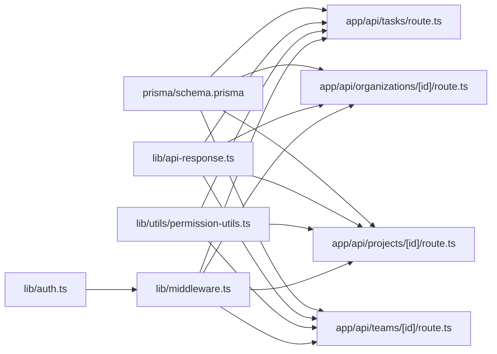

# 权限工具

<cite>
**本文引用的文件**
- [lib/utils/permission-utils.ts](file://lib/utils/permission-utils.ts)
- [lib/middleware.ts](file://lib/middleware.ts)
- [lib/auth.ts](file://lib/auth.ts)
- [lib/types.ts](file://lib/types.ts)
- [lib/api-response.ts](file://lib/api-response.ts)
- [app/api/tasks/route.ts](file://app/api/tasks/route.ts)
- [app/api/organizations/[id]/route.ts](file://app/api/organizations/[id]/route.ts)
- [app/api/projects/[id]/route.ts](file://app/api/projects/[id]/route.ts)
- [app/api/teams/[id]/route.ts](file://app/api/teams/[id]/route.ts)
- [app/api/organizations/[id]/members/route.ts](file://app/api/organizations/[id]/members/route.ts)
- [app/api/organizations/[id]/invite/route.ts](file://app/api/organizations/[id]/invite/route.ts)
- [prisma/schema.prisma](file://prisma/schema.prisma)
</cite>

## 目录
1. [简介](#简介)
2. [项目结构](#项目结构)
3. [核心组件](#核心组件)
4. [架构总览](#架构总览)
5. [详细组件分析](#详细组件分析)
6. [依赖分析](#依赖分析)
7. [性能考虑](#性能考虑)
8. [故障排查指南](#故障排查指南)
9. [结论](#结论)
10. [附录](#附录)

## 简介
本指南围绕权限验证与管理工具函数，系统讲解用户权限检查、角色验证与访问控制的实现机制，并覆盖任务权限、组织权限与系统权限的验证方法与使用示例。文档同时阐述权限缓存策略、权限继承关系与动态权限评估，给出权限配置、权限升级与权限撤销的操作流程，帮助开发者在团队协作与项目管理场景中构建安全可靠的权限控制方案。

## 项目结构
权限体系由“认证中间件 + 类型与常量 + 工具函数 + API 层 + 数据模型”构成，形成“自顶向下”的权限控制闭环：
- 认证层：从请求头提取并校验 JWT，输出用户标识
- 工具层：提供任务权限检查、错误消息生成等工具函数
- API 层：在各业务路由中进行组织/项目/团队/任务的细粒度权限校验
- 数据层：Prisma 模型定义组织、项目、团队、任务及成员关系，支撑权限继承与跨域访问控制

图表来源
- [lib/middleware.ts](file://lib/middleware.ts#L10-L39)
- [lib/auth.ts](file://lib/auth.ts#L36-L58)
- [lib/utils/permission-utils.ts](file://lib/utils/permission-utils.ts#L11-L71)
- [app/api/tasks/route.ts](file://app/api/tasks/route.ts#L1-L497)
- [app/api/organizations/[id]/route.ts](file://app/api/organizations/[id]/route.ts#L1-L212)
- [app/api/projects/[id]/route.ts](file://app/api/projects/[id]/route.ts#L1-L283)
- [app/api/teams/[id]/route.ts](file://app/api/teams/[id]/route.ts#L1-L221)
- [app/api/organizations/[id]/members/route.ts](file://app/api/organizations/[id]/members/route.ts#L1-L501)
- [app/api/organizations/[id]/invite/route.ts](file://app/api/organizations/[id]/invite/route.ts#L1-L122)
- [prisma/schema.prisma](file://prisma/schema.prisma#L17-L314)

章节来源
- [lib/middleware.ts](file://lib/middleware.ts#L10-L39)
- [lib/auth.ts](file://lib/auth.ts#L36-L58)
- [lib/utils/permission-utils.ts](file://lib/utils/permission-utils.ts#L11-L71)
- [app/api/tasks/route.ts](file://app/api/tasks/route.ts#L1-L497)
- [app/api/organizations/[id]/route.ts](file://app/api/organizations/[id]/route.ts#L1-L212)
- [app/api/projects/[id]/route.ts](file://app/api/projects/[id]/route.ts#L1-L283)
- [app/api/teams/[id]/route.ts](file://app/api/teams/[id]/route.ts#L1-L221)
- [app/api/organizations/[id]/members/route.ts](file://app/api/organizations/[id]/members/route.ts#L1-L501)
- [app/api/organizations/[id]/invite/route.ts](file://app/api/organizations/[id]/invite/route.ts#L1-L122)
- [prisma/schema.prisma](file://prisma/schema.prisma#L17-L314)

## 核心组件
- 认证中间件：从 Authorization 头部提取 Token，支持 Bearer 与裸 Token 两种格式；解码失败或缺失时返回未授权响应
- 权限工具：提供“在项目/团队中管理任务”的权限判定，以及权限不足时的提示消息生成
- 统一响应：封装成功/错误/未授权/禁止访问/未找到/服务器错误等响应格式
- 类型与常量：定义任务权限枚举（ALL_MEMBERS、CREATOR_ONLY）、组织成员角色（OWNER、ADMIN、MEMBER）等
- API 层权限：在任务、组织、项目、团队、成员管理、邀请等路由中进行细粒度权限校验

章节来源
- [lib/middleware.ts](file://lib/middleware.ts#L10-L39)
- [lib/utils/permission-utils.ts](file://lib/utils/permission-utils.ts#L11-L71)
- [lib/api-response.ts](file://lib/api-response.ts#L19-L100)
- [lib/types.ts](file://lib/types.ts#L3-L5)
- [app/api/tasks/route.ts](file://app/api/tasks/route.ts#L1-L497)
- [app/api/organizations/[id]/route.ts](file://app/api/organizations/[id]/route.ts#L1-L212)
- [app/api/projects/[id]/route.ts](file://app/api/projects/[id]/route.ts#L1-L283)
- [app/api/teams/[id]/route.ts](file://app/api/teams/[id]/route.ts#L1-L221)
- [app/api/organizations/[id]/members/route.ts](file://app/api/organizations/[id]/members/route.ts#L1-L501)
- [app/api/organizations/[id]/invite/route.ts](file://app/api/organizations/[id]/invite/route.ts#L1-L122)

## 架构总览
权限控制遵循“认证前置、按域校验、按角色继承”的原则：
- 认证：中间件统一拦截，校验 Token 并注入用户标识
- 组织域：API 层强制限定组织边界，防止越权访问
- 项目/团队域：在项目/团队维度进行成员与权限继承校验
- 任务域：结合项目/团队的协同权限策略，决定是否允许管理任务

图表来源
- [lib/middleware.ts](file://lib/middleware.ts#L10-L39)
- [lib/auth.ts](file://lib/auth.ts#L65-L77)
- [lib/auth.ts](file://lib/auth.ts#L45-L58)
- [app/api/tasks/route.ts](file://app/api/tasks/route.ts#L18-L63)
- [prisma/schema.prisma](file://prisma/schema.prisma#L17-L314)

## 详细组件分析

### 认证中间件与工具
- 功能要点
  - 支持 Bearer 与裸 Token 两种头部格式
  - 解析失败或缺失时返回统一未授权响应
  - 日志记录请求路径、方法与 Token 摘要，便于审计与排障
- 使用建议
  - 在所有受保护路由前置调用认证中间件
  - 对于公开接口，避免强制认证

图表来源
- [lib/middleware.ts](file://lib/middleware.ts#L10-L39)
- [lib/auth.ts](file://lib/auth.ts#L45-L58)
- [lib/auth.ts](file://lib/auth.ts#L65-L77)

章节来源
- [lib/middleware.ts](file://lib/middleware.ts#L10-L39)
- [lib/auth.ts](file://lib/auth.ts#L36-L58)
- [lib/auth.ts](file://lib/auth.ts#L65-L77)

### 权限工具函数
- canManageTaskInProject
  - 逻辑：超级管理员直接放行；否则需为项目成员；根据项目 taskPermission 决定是否允许管理
  - 场景：项目协同权限为 ALL_MEMBERS 时，成员可修改任务字段；为 CREATOR_ONLY 时仅创建者可管理
- canManageTaskInTeam
  - 逻辑：与项目类似，但作用域为团队
- getPermissionDeniedMessage
  - 依据 taskPermission 返回对应提示消息

图表来源
- [lib/utils/permission-utils.ts](file://lib/utils/permission-utils.ts#L11-L30)

章节来源
- [lib/utils/permission-utils.ts](file://lib/utils/permission-utils.ts#L11-L30)
- [lib/utils/permission-utils.ts](file://lib/utils/permission-utils.ts#L40-L59)
- [lib/utils/permission-utils.ts](file://lib/utils/permission-utils.ts#L66-L71)

### 任务权限验证（API 层）
- 组织边界校验：强制要求组织 ID，若未提供则回退到用户 currentOrganizationId；若仍为空则拒绝
- 团队/项目/用户维度的权限与可见性控制：
  - 团队：仅团队成员可查看该团队任务；团队需属于当前组织
  - 项目：仅项目成员可查看；个人事务项目仅允许创建者或负责人查看
  - 用户：仅本人或与其在同一团队/项目且在同一组织下的人可查看他人任务
- 任务创建：校验项目成员身份，必要时自动将负责人加入项目/团队

图表来源
- [app/api/tasks/route.ts](file://app/api/tasks/route.ts#L18-L177)
- [lib/utils/permission-utils.ts](file://lib/utils/permission-utils.ts#L11-L30)

章节来源
- [app/api/tasks/route.ts](file://app/api/tasks/route.ts#L18-L177)

### 组织权限与成员管理
- 组织详情：仅成员可查看；支持统计成员/团队/项目数量
- 组织更新：仅 OWNER/ADMIN 可修改；名称唯一性校验；可调整加入是否需要审批
- 组织删除：仅组织 OWNER 可删除；当前所在组织不可删除
- 成员管理：
  - 自助加入：生成唯一邀请码，自动设置 currentOrganizationId（若为空）
  - 管理员添加：OWNER/ADMIN 可添加成员并生成邀请码
  - 管理员移除：OWNER/ADMIN 可移除普通成员；所有者不可被移除；退出时清理其个人事务项目
- 邀请流程：仅组织创建者可邀请；向被邀请人发送站内通知

图表来源
- [app/api/organizations/[id]/members/route.ts](file://app/api/organizations/[id]/members/route.ts#L83-L272)
- [app/api/organizations/[id]/members/route.ts](file://app/api/organizations/[id]/members/route.ts#L274-L501)
- [app/api/organizations/[id]/invite/route.ts](file://app/api/organizations/[id]/invite/route.ts#L12-L122)

章节来源
- [app/api/organizations/[id]/route.ts](file://app/api/organizations/[id]/route.ts#L6-L106)
- [app/api/organizations/[id]/route.ts](file://app/api/organizations/[id]/route.ts#L108-L163)
- [app/api/organizations/[id]/route.ts](file://app/api/organizations/[id]/route.ts#L165-L212)
- [app/api/organizations/[id]/members/route.ts](file://app/api/organizations/[id]/members/route.ts#L83-L272)
- [app/api/organizations/[id]/members/route.ts](file://app/api/organizations/[id]/members/route.ts#L274-L501)
- [app/api/organizations/[id]/invite/route.ts](file://app/api/organizations/[id]/invite/route.ts#L12-L122)

### 项目权限与团队权限
- 项目更新：仅项目创建者或超级管理员可修改；可变更成员列表、任务权限等
- 项目删除：仅项目创建者、组织创建者或超级管理员可删除；项目下不得仍有任务
- 团队更新：仅团队创建者或超级管理员可修改；可变更成员列表、任务权限等
- 团队删除：仅团队创建者、组织创建者或超级管理员可删除；删除后通知成员

图表来源
- [app/api/projects/[id]/route.ts](file://app/api/projects/[id]/route.ts#L64-L187)
- [app/api/projects/[id]/route.ts](file://app/api/projects/[id]/route.ts#L189-L283)
- [app/api/teams/[id]/route.ts](file://app/api/teams/[id]/route.ts#L13-L135)
- [app/api/teams/[id]/route.ts](file://app/api/teams/[id]/route.ts#L137-L221)

章节来源
- [app/api/projects/[id]/route.ts](file://app/api/projects/[id]/route.ts#L64-L187)
- [app/api/projects/[id]/route.ts](file://app/api/projects/[id]/route.ts#L189-L283)
- [app/api/teams/[id]/route.ts](file://app/api/teams/[id]/route.ts#L13-L135)
- [app/api/teams/[id]/route.ts](file://app/api/teams/[id]/route.ts#L137-L221)

### 权限配置、升级与撤销
- 配置
  - 项目/团队任务权限：ALL_MEMBERS 或 CREATOR_ONLY
  - 组织成员角色：OWNER、ADMIN、MEMBER
- 升级
  - 成员晋升：管理员将成员角色提升为 ADMIN/MEMBER
  - 创建者转让：项目/团队创建者可变更 creatorId（需校验新创建者存在）
- 撤销
  - 移除成员：管理员移除普通成员；所有者不可被移除
  - 退出组织：成员可主动退出；退出时清理其个人事务项目

章节来源
- [lib/types.ts](file://lib/types.ts#L3-L5)
- [lib/types.ts](file://lib/types.ts#L58-L62)
- [app/api/projects/[id]/route.ts](file://app/api/projects/[id]/route.ts#L94-L120)
- [app/api/teams/[id]/route.ts](file://app/api/teams/[id]/route.ts#L43-L68)
- [app/api/organizations/[id]/members/route.ts](file://app/api/organizations/[id]/members/route.ts#L385-L417)

## 依赖分析
- 组件耦合
  - API 层强依赖认证中间件与统一响应
  - 权限工具函数独立，仅依赖类型定义
  - 数据模型为所有 API 提供权限继承与边界约束
- 外部依赖
  - JWT 解析与校验
  - Prisma ORM 与 PostgreSQL

图表来源
- [lib/auth.ts](file://lib/auth.ts#L36-L58)
- [lib/middleware.ts](file://lib/middleware.ts#L10-L39)
- [lib/utils/permission-utils.ts](file://lib/utils/permission-utils.ts#L11-L71)
- [lib/api-response.ts](file://lib/api-response.ts#L19-L100)
- [app/api/tasks/route.ts](file://app/api/tasks/route.ts#L1-L497)
- [app/api/organizations/[id]/route.ts](file://app/api/organizations/[id]/route.ts#L1-L212)
- [app/api/projects/[id]/route.ts](file://app/api/projects/[id]/route.ts#L1-L283)
- [app/api/teams/[id]/route.ts](file://app/api/teams/[id]/route.ts#L1-L221)
- [prisma/schema.prisma](file://prisma/schema.prisma#L17-L314)

章节来源
- [lib/auth.ts](file://lib/auth.ts#L36-L58)
- [lib/middleware.ts](file://lib/middleware.ts#L10-L39)
- [lib/utils/permission-utils.ts](file://lib/utils/permission-utils.ts#L11-L71)
- [lib/api-response.ts](file://lib/api-response.ts#L19-L100)
- [app/api/tasks/route.ts](file://app/api/tasks/route.ts#L1-L497)
- [app/api/organizations/[id]/route.ts](file://app/api/organizations/[id]/route.ts#L1-L212)
- [app/api/projects/[id]/route.ts](file://app/api/projects/[id]/route.ts#L1-L283)
- [app/api/teams/[id]/route.ts](file://app/api/teams/[id]/route.ts#L1-L221)
- [prisma/schema.prisma](file://prisma/schema.prisma#L17-L314)

## 性能考虑
- 认证开销
  - JWT 校验为 O(1)，建议在网关或边缘层缓存近期活跃 Token 的解码结果以降低重复计算
- 查询优化
  - API 层广泛使用索引字段（如组织、项目、团队、用户主键与索引），建议保持 schema 索引策略
  - 对于高频查询，可在应用层引入轻量内存缓存（如 LRU）存放“用户-组织-项目/团队”映射，减少数据库往返
- 权限评估
  - canManageTaskInProject/canManageTaskInTeam 为常量时间判断，适合在热点路径直接调用
- 事务与批量写
  - 成员移除与邀请等操作采用事务，保证一致性；批量创建/删除时尽量合并为一次调用

## 故障排查指南
- 401 未授权
  - 检查请求头是否包含有效的 Authorization（支持 Bearer 与裸 Token）
  - 核对 JWT_SECRET 是否正确配置，Token 是否过期
- 403 禁止访问
  - 组织/项目/团队权限不足：确认当前用户角色（OWNER/ADMIN/MEMBER）与操作范围
  - 任务查看权限：确认是否为项目/团队成员，或是否满足个人事务项目规则
- 400/404 验证/未找到
  - 参数校验失败或资源不存在；检查必填字段与资源 ID
- 日志定位
  - 中间件会打印请求路径、方法与 Token 摘要，便于快速定位问题

章节来源
- [lib/middleware.ts](file://lib/middleware.ts#L14-L20)
- [lib/middleware.ts](file://lib/middleware.ts#L22-L38)
- [lib/auth.ts](file://lib/auth.ts#L45-L58)
- [lib/api-response.ts](file://lib/api-response.ts#L56-L70)
- [app/api/tasks/route.ts](file://app/api/tasks/route.ts#L133-L167)
- [app/api/projects/[id]/route.ts](file://app/api/projects/[id]/route.ts#L94-L97)
- [app/api/teams/[id]/route.ts](file://app/api/teams/[id]/route.ts#L43-L46)

## 结论
本权限工具体系以“认证前置、组织边界、成员继承、任务协同权限”为核心，结合 Prisma 的关系模型与 API 层的细粒度校验，实现了在团队协作与项目管理场景下的安全可控权限管理。通过工具函数与统一响应，开发者可快速在各业务路由中集成权限控制，保障数据隔离与操作合规。

## 附录
- 关键类型与枚举
  - 任务权限：ALL_MEMBERS、CREATOR_ONLY
  - 组织成员角色：OWNER、ADMIN、MEMBER
- 常用工具函数
  - canManageTaskInProject、canManageTaskInTeam、getPermissionDeniedMessage
- 常见使用场景
  - 任务创建：校验项目成员身份并自动补全负责人成员关系
  - 任务查看：按组织/团队/项目/用户维度进行权限与可见性控制
  - 组织管理：成员加入/移除、邀请、角色变更与退出流程

章节来源
- [lib/types.ts](file://lib/types.ts#L3-L5)
- [lib/types.ts](file://lib/types.ts#L58-L62)
- [lib/utils/permission-utils.ts](file://lib/utils/permission-utils.ts#L11-L71)
- [app/api/tasks/route.ts](file://app/api/tasks/route.ts#L275-L391)
- [app/api/tasks/route.ts](file://app/api/tasks/route.ts#L18-L177)
- [app/api/organizations/[id]/members/route.ts](file://app/api/organizations/[id]/members/route.ts#L83-L272)
- [app/api/organizations/[id]/invite/route.ts](file://app/api/organizations/[id]/invite/route.ts#L12-L122)