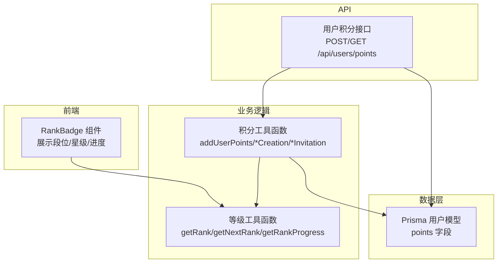
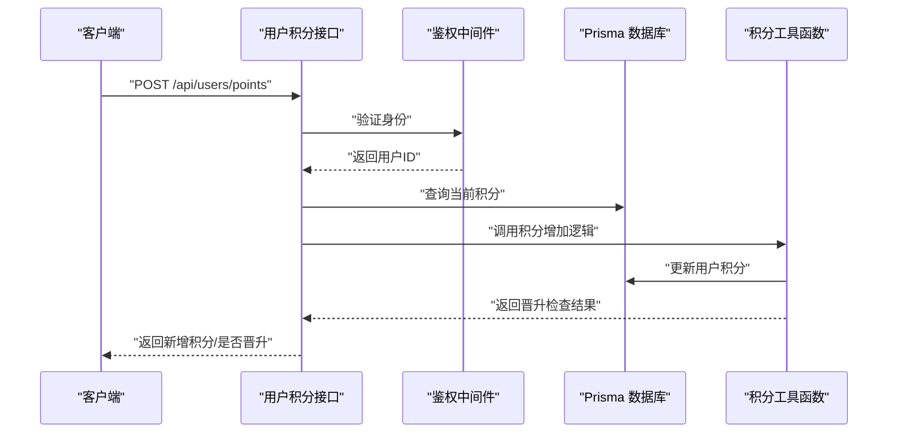
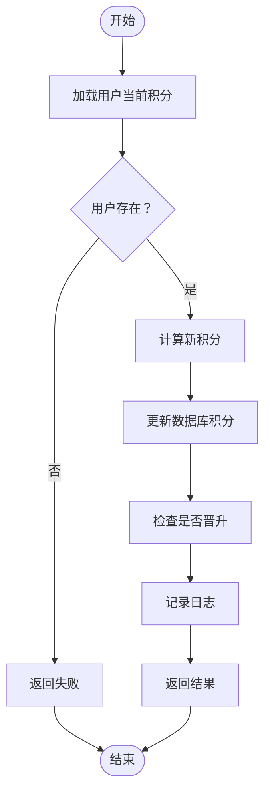
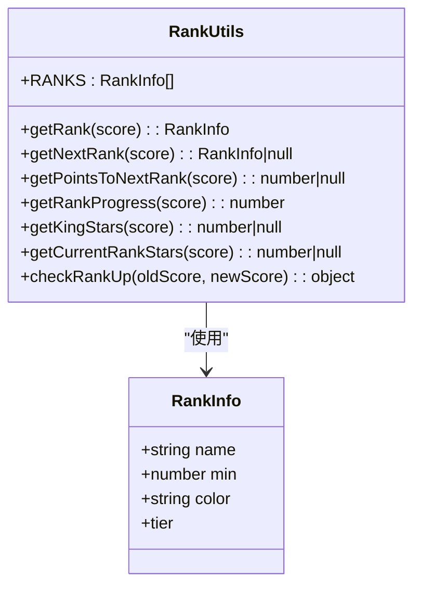
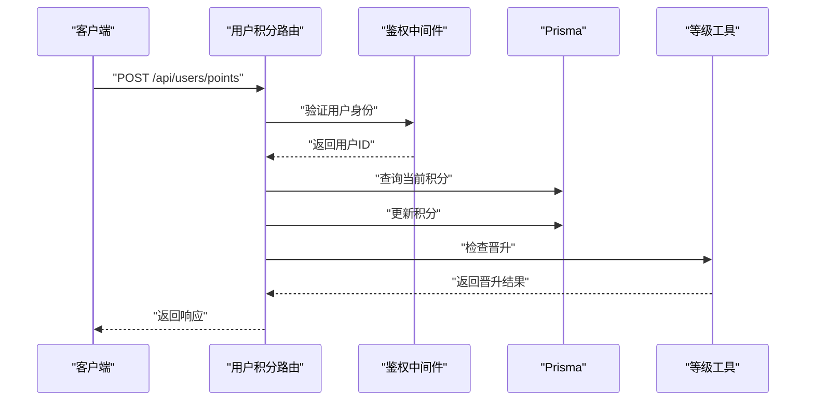
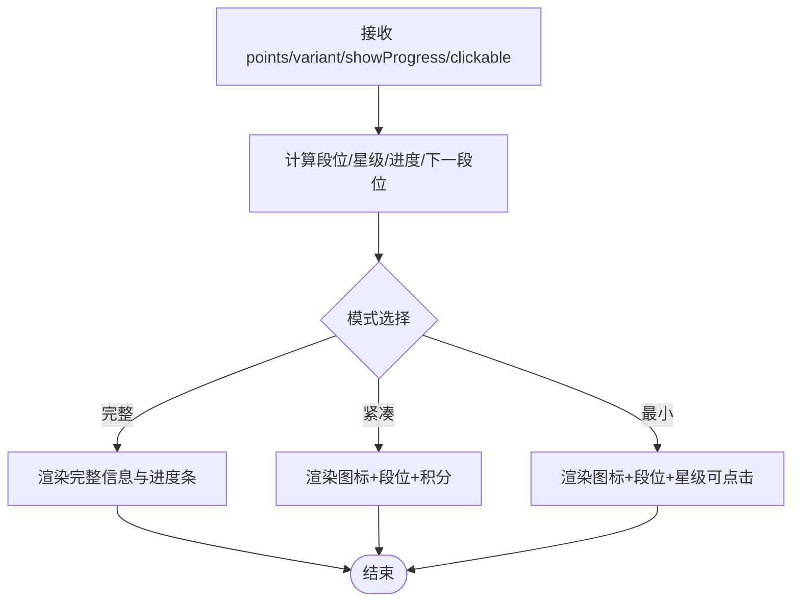
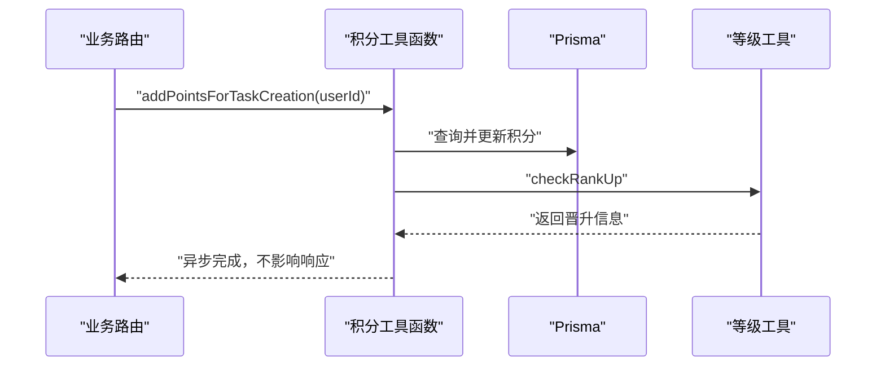
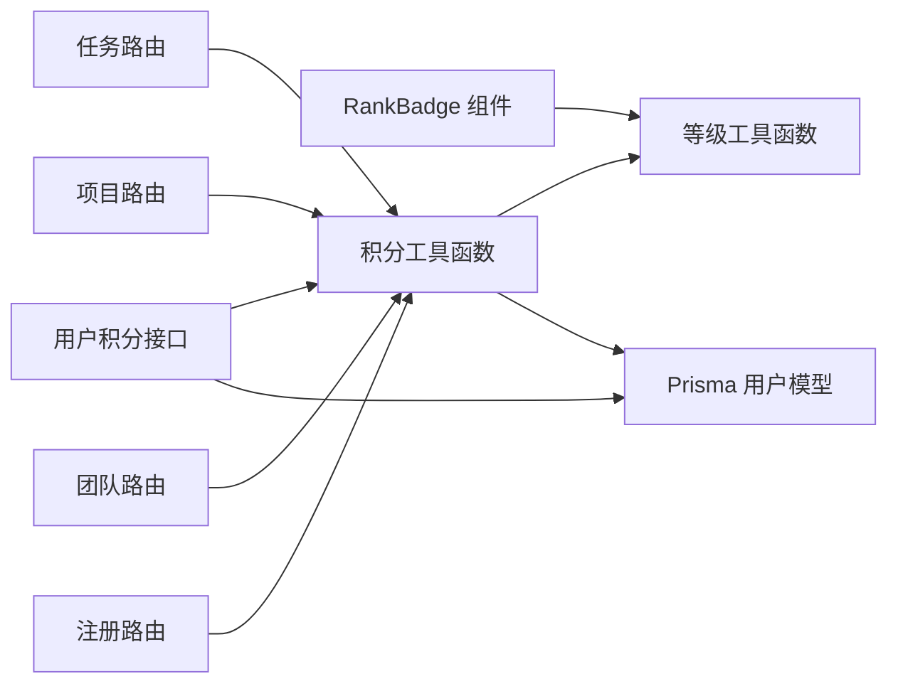

# 积分与等级工具

<cite>
**本文引用的文件**
- [lib/utils/points.ts](file://lib/utils/points.ts)
- [lib/utils/rank.ts](file://lib/utils/rank.ts)
- [app/api/users/points/route.ts](file://app/api/users/points/route.ts)
- [components/rank-badge.tsx](file://components/rank-badge.tsx)
- [prisma/schema.prisma](file://prisma/schema.prisma)
- [app/api/tasks/route.ts](file://app/api/tasks/route.ts)
- [app/api/projects/route.ts](file://app/api/projects/route.ts)
- [app/api/teams/route.ts](file://app/api/teams/route.ts)
- [app/api/auth/register/route.ts](file://app/api/auth/register/route.ts)
- [app/api/organizations/invites/[id]/accept/route.ts](file://app/api/organizations/invites/[id]/accept/route.ts)
</cite>

## 目录
1. [简介](#简介)
2. [项目结构](#项目结构)
3. [核心组件](#核心组件)
4. [架构概览](#架构概览)
5. [详细组件分析](#详细组件分析)
6. [依赖分析](#依赖分析)
7. [性能考虑](#性能考虑)
8. [故障排除指南](#故障排除指南)
9. [结论](#结论)
10. [附录](#附录)

## 简介
本指南围绕日历任务管理系统的积分与等级工具进行全面解析，涵盖积分获取规则、消耗机制与累积算法；等级计算、经验值管理与升级条件；积分流水记录、等级历史追踪与排行榜计算；安全校验与防作弊机制；以及扩展性与定制化配置。同时提供在任务完成奖励、活跃度统计等场景中的使用示例与最佳实践。

## 项目结构
积分与等级系统由以下层次构成：
- 数据层：Prisma 模型定义用户积分字段与相关实体关系
- 工具层：积分工具函数与等级计算工具函数
- API 层：用户积分增删改查接口
- 前端组件层：段位徽章组件，展示段位、星级与进度
- 业务集成层：在任务创建、项目创建、团队创建、邀请注册等关键路径自动发放积分

**图表来源**
- [components/rank-badge.tsx](file://components/rank-badge.tsx#L1-L206)
- [app/api/users/points/route.ts](file://app/api/users/points/route.ts#L1-L101)
- [lib/utils/points.ts](file://lib/utils/points.ts#L1-L98)
- [lib/utils/rank.ts](file://lib/utils/rank.ts#L1-L155)
- [prisma/schema.prisma](file://prisma/schema.prisma#L64-L96)

**章节来源**
- [prisma/schema.prisma](file://prisma/schema.prisma#L64-L96)
- [lib/utils/points.ts](file://lib/utils/points.ts#L1-L98)
- [lib/utils/rank.ts](file://lib/utils/rank.ts#L1-L155)
- [app/api/users/points/route.ts](file://app/api/users/points/route.ts#L1-L101)
- [components/rank-badge.tsx](file://components/rank-badge.tsx#L1-L206)

## 核心组件
- 积分工具函数：提供统一的积分增加入口、快捷行为奖励方法与晋升检查
- 等级工具函数：提供段位查询、下一段位、进度百分比、星级计算等能力
- 用户积分 API：提供积分查询与增加的 REST 接口，并返回是否晋升
- 段位徽章组件：在前端直观展示段位、星级与进度条
- 业务集成：在任务/项目/团队创建与邀请注册等关键流程自动发放积分

**章节来源**
- [lib/utils/points.ts](file://lib/utils/points.ts#L1-L98)
- [lib/utils/rank.ts](file://lib/utils/rank.ts#L1-L155)
- [app/api/users/points/route.ts](file://app/api/users/points/route.ts#L1-L101)
- [components/rank-badge.tsx](file://components/rank-badge.tsx#L1-L206)

## 架构概览
积分与等级系统采用“工具函数 + API + 前端组件 + 业务集成”的分层架构。工具函数负责纯逻辑计算与数据库更新；API 提供鉴权与参数校验；前端组件负责可视化展示；业务集成在关键操作完成后异步发放积分，保证用户体验不受阻塞。

**图表来源**
- [app/api/users/points/route.ts](file://app/api/users/points/route.ts#L11-L66)
- [lib/utils/points.ts](file://lib/utils/points.ts#L11-L70)

**章节来源**
- [app/api/users/points/route.ts](file://app/api/users/points/route.ts#L1-L101)
- [lib/utils/points.ts](file://lib/utils/points.ts#L1-L98)

## 详细组件分析

### 积分工具函数
- 功能概述
  - 统一增加用户积分的入口，支持传入用户ID、积分数量与原因
  - 返回旧积分、新积分、是否晋升及晋升前后段位名称
  - 内置行为奖励快捷方法：任务创建、团队创建、项目创建、邀请用户
- 关键点
  - 使用 Prisma 查询当前积分并原子性更新
  - 调用等级工具函数进行晋升检查
  - 异步执行，避免阻塞主流程（业务集成中广泛采用）

**图表来源**
- [lib/utils/points.ts](file://lib/utils/points.ts#L11-L70)

**章节来源**
- [lib/utils/points.ts](file://lib/utils/points.ts#L1-L98)

### 等级工具函数
- 功能概述
  - 段位配置表：包含名称、最低分、颜色与段位档次
  - 段位查询：根据当前积分返回所在段位
  - 下一段位与还需积分：用于进度提示
  - 段位进度百分比：当前段位内的完成度
  - 王者星级：按规则计算总星数与当前段位内星级
  - 行为积分配置：定义各类行为的奖励值
  - 晋升检查：比较旧/新积分对应的段位，判断是否晋升
- 关键点
  - 段位配置表有序且单调递增，便于二分或线性查找
  - 王者段位的星级计算基于固定区间累加

**图表来源**
- [lib/utils/rank.ts](file://lib/utils/rank.ts#L6-L155)

**章节来源**
- [lib/utils/rank.ts](file://lib/utils/rank.ts#L1-L155)

### 用户积分 API
- 功能概述
  - POST /api/users/points：增加用户积分，进行参数校验与晋升检查
  - GET /api/users/points：查询当前用户积分
- 关键点
  - 鉴权中间件确保只有合法用户可操作
  - 参数校验：积分必须为正数
  - 返回结构包含新增积分、原因与晋升信息

**图表来源**
- [app/api/users/points/route.ts](file://app/api/users/points/route.ts#L11-L66)
- [lib/utils/rank.ts](file://lib/utils/rank.ts#L142-L155)

**章节来源**
- [app/api/users/points/route.ts](file://app/api/users/points/route.ts#L1-L101)

### 段位徽章组件
- 功能概述
  - 支持完整/紧凑/最小三种展示模式
  - 展示段位图标、名称、星级与进度条
  - 提供积分规则说明与最高段位提示
- 关键点
  - 使用等级工具函数计算段位、星级与进度
  - 最小模式支持点击弹出完整信息

**图表来源**
- [components/rank-badge.tsx](file://components/rank-badge.tsx#L27-L206)
- [lib/utils/rank.ts](file://lib/utils/rank.ts#L51-L127)

**章节来源**
- [components/rank-badge.tsx](file://components/rank-badge.tsx#L1-L206)
- [lib/utils/rank.ts](file://lib/utils/rank.ts#L1-L155)

### 业务集成与使用示例
- 任务创建奖励
  - 在任务创建成功后异步发放任务创建积分
  - 示例路径：[app/api/tasks/route.ts](file://app/api/tasks/route.ts#L457-L460)
- 项目创建奖励
  - 在项目创建成功后异步发放项目创建积分
  - 示例路径：[app/api/projects/route.ts](file://app/api/projects/route.ts#L208-L211)
- 团队创建奖励
  - 在团队创建成功后异步发放团队创建积分
  - 示例路径：[app/api/teams/route.ts](file://app/api/teams/route.ts#L211-L214)
- 邀请注册奖励
  - 注册成功后若存在邀请人，异步发放邀请奖励
  - 示例路径：
    - [app/api/auth/register/route.ts](file://app/api/auth/register/route.ts#L317-L322)
    - [app/api/organizations/invites/[id]/accept/route.ts](file://app/api/organizations/invites/[id]/accept/route.ts#L133-L136)

**图表来源**
- [app/api/tasks/route.ts](file://app/api/tasks/route.ts#L457-L460)
- [lib/utils/points.ts](file://lib/utils/points.ts#L75-L77)
- [lib/utils/rank.ts](file://lib/utils/rank.ts#L142-L155)

**章节来源**
- [app/api/tasks/route.ts](file://app/api/tasks/route.ts#L457-L460)
- [app/api/projects/route.ts](file://app/api/projects/route.ts#L208-L211)
- [app/api/teams/route.ts](file://app/api/teams/route.ts#L211-L214)
- [app/api/auth/register/route.ts](file://app/api/auth/register/route.ts#L317-L322)
- [app/api/organizations/invites/[id]/accept/route.ts](file://app/api/organizations/invites/[id]/accept/route.ts#L133-L136)
- [lib/utils/points.ts](file://lib/utils/points.ts#L75-L98)

## 依赖分析
- 组件耦合
  - 前端组件依赖等级工具函数进行展示计算
  - API 路由依赖鉴权中间件与等级工具函数
  - 业务路由依赖积分工具函数进行奖励发放
- 外部依赖
  - Prisma 作为 ORM，提供用户积分字段的持久化
- 潜在循环依赖
  - 当前模块间为单向依赖，无明显循环

**图表来源**
- [components/rank-badge.tsx](file://components/rank-badge.tsx#L1-L206)
- [app/api/users/points/route.ts](file://app/api/users/points/route.ts#L1-L101)
- [lib/utils/points.ts](file://lib/utils/points.ts#L1-L98)
- [lib/utils/rank.ts](file://lib/utils/rank.ts#L1-L155)
- [prisma/schema.prisma](file://prisma/schema.prisma#L64-L96)
- [app/api/tasks/route.ts](file://app/api/tasks/route.ts#L457-L460)
- [app/api/projects/route.ts](file://app/api/projects/route.ts#L208-L211)
- [app/api/teams/route.ts](file://app/api/teams/route.ts#L211-L214)
- [app/api/auth/register/route.ts](file://app/api/auth/register/route.ts#L317-L322)

**章节来源**
- [components/rank-badge.tsx](file://components/rank-badge.tsx#L1-L206)
- [app/api/users/points/route.ts](file://app/api/users/points/route.ts#L1-L101)
- [lib/utils/points.ts](file://lib/utils/points.ts#L1-L98)
- [lib/utils/rank.ts](file://lib/utils/rank.ts#L1-L155)
- [prisma/schema.prisma](file://prisma/schema.prisma#L64-L96)
- [app/api/tasks/route.ts](file://app/api/tasks/route.ts#L457-L460)
- [app/api/projects/route.ts](file://app/api/projects/route.ts#L208-L211)
- [app/api/teams/route.ts](file://app/api/teams/route.ts#L211-L214)
- [app/api/auth/register/route.ts](file://app/api/auth/register/route.ts#L317-L322)

## 性能考虑
- 异步发放积分：在业务路由中采用异步执行，避免阻塞主流程，提升响应速度
- 前端懒计算：段位徽章组件在渲染时计算段位/进度/星级，建议在高频场景缓存计算结果
- 数据库写入：积分更新为单字段原子更新，复杂度低；建议在高并发场景配合数据库事务与索引优化
- 前端进度条：进度计算为 O(n) 查找段位，段位配置表较小，影响可忽略

[本节为通用指导，无需特定文件来源]

## 故障排除指南
- 常见问题
  - 用户不存在：API 返回用户不存在错误
  - 积分非正数：参数校验失败，返回错误信息
  - 数据库更新异常：捕获异常并返回服务器错误
- 建议排查步骤
  - 确认鉴权中间件返回的用户ID有效
  - 检查 Prisma 用户模型是否存在 points 字段
  - 核对积分工具函数的返回值与日志输出
  - 在业务集成处确认异步发放是否触发

**章节来源**
- [app/api/users/points/route.ts](file://app/api/users/points/route.ts#L21-L33)
- [lib/utils/points.ts](file://lib/utils/points.ts#L30-L37)

## 结论
本积分与等级工具体系通过清晰的分层设计与工具函数抽象，实现了稳定的积分发放、等级计算与前端展示。系统在任务/项目/团队创建与邀请注册等关键路径自动发放积分，具备良好的扩展性与定制化能力。建议在生产环境中结合异步队列与缓存进一步优化性能，并完善审计与风控策略以增强安全性。

[本节为总结性内容，无需特定文件来源]

## 附录

### 积分获取规则与消耗机制
- 获取规则
  - 创建任务：+2 积分
  - 创建团队：+5 积分
  - 创建项目：+5 积分
  - 邀请用户成功注册并激活：+10 积分
- 消耗机制
  - 当前代码未实现积分消耗功能，可在后续版本中扩展

**章节来源**
- [lib/utils/rank.ts](file://lib/utils/rank.ts#L132-L137)
- [lib/utils/points.ts](file://lib/utils/points.ts#L75-L98)

### 等级计算与经验值管理
- 段位计算：根据当前积分匹配段位配置表
- 下一段位与还需积分：用于进度提示
- 段位进度百分比：当前段位内的完成度
- 王者星级：按固定区间累加星数

**章节来源**
- [lib/utils/rank.ts](file://lib/utils/rank.ts#L51-L127)
- [lib/utils/rank.ts](file://lib/utils/rank.ts#L93-L108)

### 等级提升条件与晋升检查
- 晋升检查：比较旧/新积分对应的段位，判断是否晋升
- 返回信息：包含是否晋升及晋升前后段位名称

**章节来源**
- [lib/utils/rank.ts](file://lib/utils/rank.ts#L142-L155)
- [lib/utils/points.ts](file://lib/utils/points.ts#L48-L60)

### 积分流水记录与等级历史追踪
- 流水记录
  - 建议在积分工具函数中增加日志记录，包含用户ID、变更数量、原因与时间戳
- 等级历史追踪
  - 可在晋升检查后记录等级变更历史，便于审计与回溯

[本节为通用指导，无需特定文件来源]

### 排行榜计算与优化策略
- 排行榜计算
  - 基于用户积分排序，支持分页与筛选
- 优化策略
  - 前端缓存热门用户信息
  - 后端使用数据库索引与物化视图加速查询
  - 异步更新排行榜，避免高峰时段阻塞

[本节为通用指导，无需特定文件来源]

### 积分安全校验与防作弊机制
- 安全校验
  - API 层参数校验与鉴权
  - 业务层异步发放，避免同步阻塞
- 防作弊机制
  - 引入频率限制与行为检测
  - 对异常行为进行审计与封禁

[本节为通用指导，无需特定文件来源]

### 扩展性与定制化配置
- 段位配置表可调整段位名称、最低分与颜色
- 行为奖励值可通过常量配置进行调整
- 前端展示模式可根据需求扩展

**章节来源**
- [lib/utils/rank.ts](file://lib/utils/rank.ts#L14-L46)
- [lib/utils/rank.ts](file://lib/utils/rank.ts#L132-L137)
- [components/rank-badge.tsx](file://components/rank-badge.tsx#L20-L25)

### 应用场景示例
- 任务完成奖励：在任务创建成功后异步发放积分
- 活跃度统计：基于用户积分与行为日志统计活跃度指标

**章节来源**
- [app/api/tasks/route.ts](file://app/api/tasks/route.ts#L457-L460)
- [app/api/projects/route.ts](file://app/api/projects/route.ts#L208-L211)
- [app/api/teams/route.ts](file://app/api/teams/route.ts#L211-L214)
- [app/api/auth/register/route.ts](file://app/api/auth/register/route.ts#L317-L322)