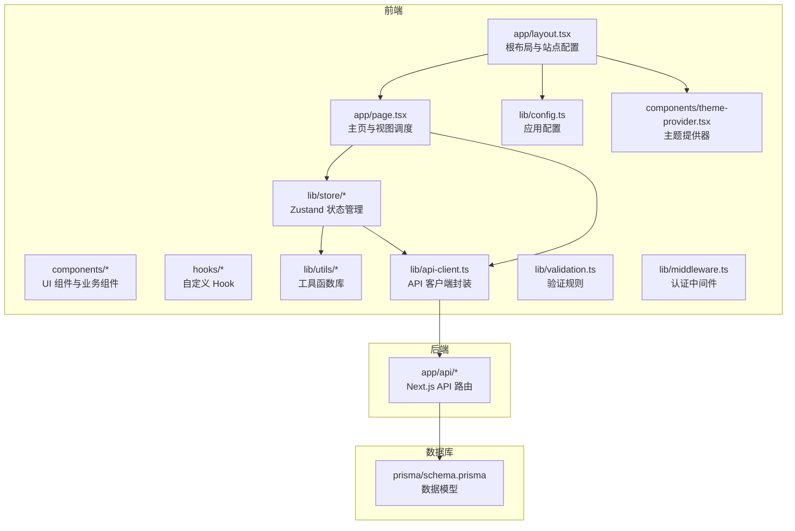
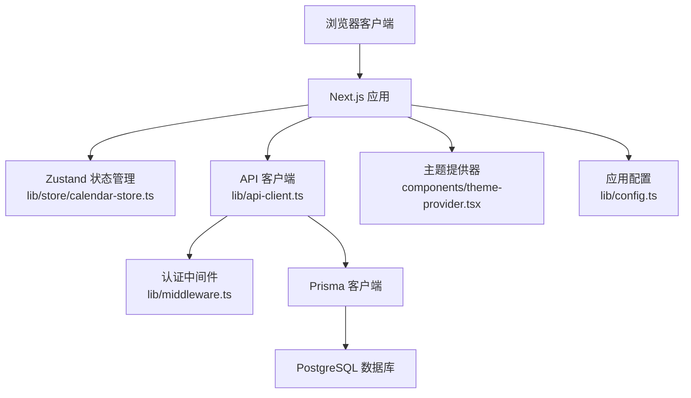
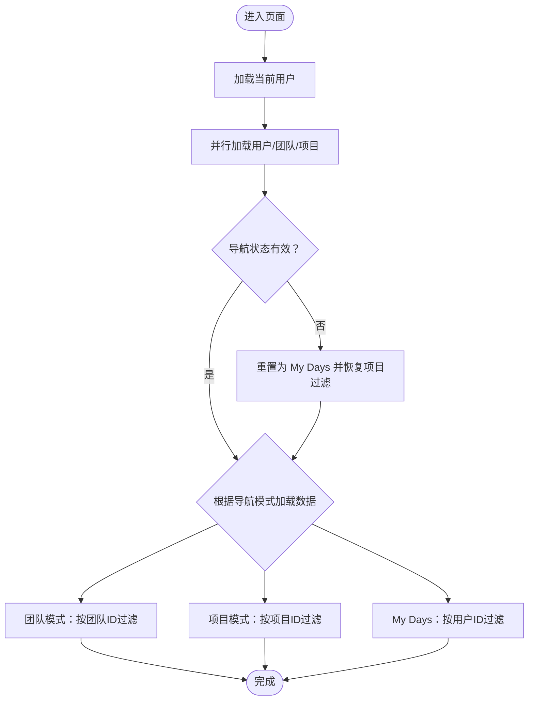
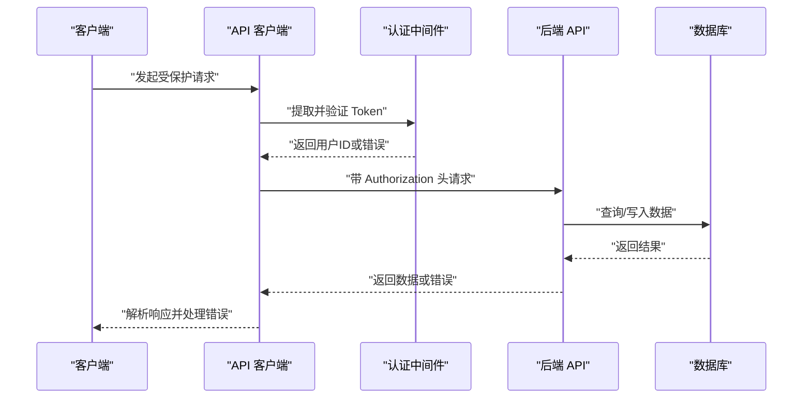
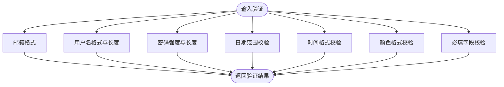
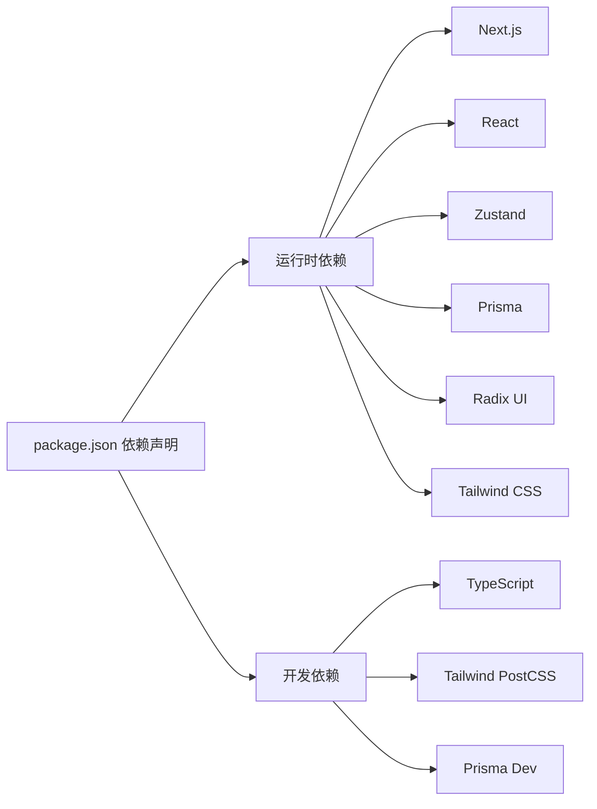

# 开发指南

<cite>
**本文引用的文件**
- [package.json](file://package.json)
- [README.md](file://README.md)
- [next.config.mjs](file://next.config.mjs)
- [tsconfig.json](file://tsconfig.json)
- [prisma/schema.prisma](file://prisma/schema.prisma)
- [lib/middleware.ts](file://lib/middleware.ts)
- [lib/config.ts](file://lib/config.ts)
- [app/layout.tsx](file://app/layout.tsx)
- [lib/store/calendar-store.ts](file://lib/store/calendar-store.ts)
- [lib/utils/date-utils.ts](file://lib/utils/date-utils.ts)
- [lib/validation.ts](file://lib/validation.ts)
- [hooks/use-toast.ts](file://hooks/use-toast.ts)
- [lib/api-client.ts](file://lib/api-client.ts)
- [lib/auth.ts](file://lib/auth.ts)
- [app/page.tsx](file://app/page.tsx)
- [components/theme-provider.tsx](file://components/theme-provider.tsx)
</cite>

## 目录
1. [简介](#简介)
2. [项目结构](#项目结构)
3. [核心组件](#核心组件)
4. [架构总览](#架构总览)
5. [详细组件分析](#详细组件分析)
6. [依赖分析](#依赖分析)
7. [性能考虑](#性能考虑)
8. [故障排查指南](#故障排查指南)
9. [结论](#结论)
10. [附录](#附录)

## 简介
本开发指南面向日历任务管理系统的开发者，提供从环境搭建、代码规范、Git 工作流、测试策略到技术架构、设计模式与最佳实践的全流程指导。文档还涵盖工具函数库、验证规则、中间件设计、自定义 Hook、配置管理与国际化支持、调试技巧、性能优化、代码审查标准以及贡献流程与问题反馈机制。

## 项目结构
项目采用 Next.js App Router 的目录组织方式，前端以组件为中心进行模块化拆分，后端 API 路由位于 app/api 下，业务逻辑与工具函数集中在 lib 目录，数据库模型与迁移由 Prisma 管理。

图表来源
- [app/layout.tsx](file://app/layout.tsx#L1-L45)
- [app/page.tsx](file://app/page.tsx#L1-L234)
- [lib/store/calendar-store.ts](file://lib/store/calendar-store.ts#L1-L200)
- [lib/api-client.ts](file://lib/api-client.ts#L1-L120)
- [lib/validation.ts](file://lib/validation.ts#L1-L168)
- [lib/middleware.ts](file://lib/middleware.ts#L1-L47)
- [lib/config.ts](file://lib/config.ts#L1-L30)
- [components/theme-provider.tsx](file://components/theme-provider.tsx#L1-L12)
- [prisma/schema.prisma](file://prisma/schema.prisma#L1-L314)

章节来源
- [README.md](file://README.md#L139-L166)
- [package.json](file://package.json#L1-L75)

## 核心组件
- 状态管理：基于 Zustand 的全局状态 store，负责任务、项目、团队、用户数据与视图状态的统一管理，并集成持久化中间件。
- API 客户端：统一封装 fetch 请求，自动携带认证头、处理 401 与新旧接口兼容、集中错误处理。
- 认证中间件：从请求头提取并校验 JWT，提供统一的鉴权能力。
- 工具函数：日期工具、验证规则、权限判断等。
- 自定义 Hook：Toast 通知、移动端适配、加载延迟等。
- 配置管理：头像服务、站点配置等通过环境变量与默认值组合。
- 主题系统：基于 next-themes 的主题提供器。

章节来源
- [lib/store/calendar-store.ts](file://lib/store/calendar-store.ts#L1-L200)
- [lib/api-client.ts](file://lib/api-client.ts#L1-L120)
- [lib/middleware.ts](file://lib/middleware.ts#L1-L47)
- [lib/validation.ts](file://lib/validation.ts#L1-L168)
- [hooks/use-toast.ts](file://hooks/use-toast.ts#L1-L192)
- [lib/config.ts](file://lib/config.ts#L1-L30)
- [components/theme-provider.tsx](file://components/theme-provider.tsx#L1-L12)

## 架构总览
系统采用前后端分离的 SPA 架构，前端通过 Next.js App Router 提供页面与路由，API 路由位于 app/api 下，数据库通过 Prisma 访问 PostgreSQL。认证采用 JWT，状态管理采用 Zustand，UI 使用 Radix UI 与 Tailwind CSS。

图表来源
- [lib/store/calendar-store.ts](file://lib/store/calendar-store.ts#L1-L200)
- [lib/api-client.ts](file://lib/api-client.ts#L1-L120)
- [lib/middleware.ts](file://lib/middleware.ts#L1-L47)
- [prisma/schema.prisma](file://prisma/schema.prisma#L1-L314)
- [components/theme-provider.tsx](file://components/theme-provider.tsx#L1-L12)
- [lib/config.ts](file://lib/config.ts#L1-L30)

## 详细组件分析

### 状态管理与数据流（Zustand）
- 状态切片：任务、项目、团队、用户、视图模式、导航模式、日期选择、拖拽状态、设置等。
- 数据加载：支持按用户、项目、团队与日期范围过滤；加载时长最小化保障体验。
- 权限控制：在新增/更新/删除任务前进行权限校验，必要时触发后台刷新。
- 错误处理：统一错误提示与全局错误状态，认证失败时引导重新登录。

图表来源
- [lib/store/calendar-store.ts](file://lib/store/calendar-store.ts#L455-L546)

章节来源
- [lib/store/calendar-store.ts](file://lib/store/calendar-store.ts#L1-L800)

### API 客户端与认证流程
- 统一封装：自动注入 Authorization 头，处理 401 清理 token，兼容新旧返回格式。
- 认证中间件：从请求头提取 Token，支持 Bearer 与裸 Token 两种格式，统一返回用户 ID 或错误响应。
- 登录/注册：返回 token 并保存至本地存储，后续请求自动携带。

图表来源
- [lib/api-client.ts](file://lib/api-client.ts#L1-L120)
- [lib/middleware.ts](file://lib/middleware.ts#L1-L47)

章节来源
- [lib/api-client.ts](file://lib/api-client.ts#L1-L525)
- [lib/middleware.ts](file://lib/middleware.ts#L1-L47)
- [lib/auth.ts](file://lib/auth.ts#L1-L78)

### 工具函数库与验证规则
- 日期工具：月/周日期计算、同日判断、格式化、周起始与周末隐藏。
- 验证规则：邮箱、用户名、密码强度、日期范围、时间格式、颜色格式、必填字段清理。

图表来源
- [lib/utils/date-utils.ts](file://lib/utils/date-utils.ts#L1-L86)
- [lib/validation.ts](file://lib/validation.ts#L1-L168)

章节来源
- [lib/utils/date-utils.ts](file://lib/utils/date-utils.ts#L1-L86)
- [lib/validation.ts](file://lib/validation.ts#L1-L168)

### 自定义 Hook 设计
- use-toast：基于 reducer 的轻量通知系统，支持去重、定时消失、批量关闭。
- use-loading-delay：保证加载动画最小显示时长，提升交互体验。
- use-mobile：移动端断点检测与 UI 行为适配。

章节来源
- [hooks/use-toast.ts](file://hooks/use-toast.ts#L1-L192)

### 配置管理与国际化支持
- 应用配置：头像服务 URL 与路径模板，支持环境变量覆盖。
- 站点配置：页面标题、描述、图标等，根布局中统一注入。
- 国际化：当前代码未见 i18n 相关实现，建议引入 next-i18next 或类似方案并在根布局中启用语言切换。

章节来源
- [lib/config.ts](file://lib/config.ts#L1-L30)
- [app/layout.tsx](file://app/layout.tsx#L1-L45)

### 主题系统与 UI 组件
- 主题提供器：基于 next-themes，支持明暗主题切换与系统跟随。
- UI 组件：基于 Radix UI 与 shadcn/ui，结合 Tailwind CSS 实现一致的视觉与交互。

章节来源
- [components/theme-provider.tsx](file://components/theme-provider.tsx#L1-L12)

## 依赖分析
- 前端运行时依赖：Next.js、React、Radix UI、Lucide React、Tailwind CSS、Zustand、Immer、Axios、date-fns、Recharts 等。
- 开发依赖：TypeScript、TailwindCSS、Prisma、PostCSS 等。
- 数据库：PostgreSQL，Prisma 作为 ORM。

图表来源
- [package.json](file://package.json#L1-L75)

章节来源
- [package.json](file://package.json#L1-L75)
- [tsconfig.json](file://tsconfig.json#L1-L44)
- [next.config.mjs](file://next.config.mjs#L1-L20)
- [prisma/schema.prisma](file://prisma/schema.prisma#L1-L314)

## 性能考虑
- 状态持久化：Zustand persist 中间件减少重复加载。
- 并行数据加载：初始化阶段并行获取用户、团队、项目数据。
- 加载最小显示时长：use-loading-delay 保障加载动画体验。
- 图片优化：Next.js 图像优化与静态资源处理。
- 构建优化：Docker 生产输出模式与包导入优化。

章节来源
- [lib/store/calendar-store.ts](file://lib/store/calendar-store.ts#L473-L477)
- [hooks/use-toast.ts](file://hooks/use-toast.ts#L1-L192)
- [next.config.mjs](file://next.config.mjs#L1-L20)

## 故障排查指南
- 认证失败：检查 Authorization 头格式（Bearer 或裸 Token）、JWT 密钥与过期时间；查看中间件日志与 API 客户端 401 处理。
- 数据加载异常：确认 API 返回格式、过滤参数与日期格式；检查 store 中错误状态与 Toast 提示。
- 日期显示异常：核对 getWeekDays/getMonthDays 的周起始与周末隐藏逻辑。
- 头像服务：确认 AVATAR_API_URL 环境变量与路径模板正确。

章节来源
- [lib/middleware.ts](file://lib/middleware.ts#L1-L47)
- [lib/api-client.ts](file://lib/api-client.ts#L72-L100)
- [lib/utils/date-utils.ts](file://lib/utils/date-utils.ts#L43-L58)
- [lib/config.ts](file://lib/config.ts#L1-L30)

## 结论
本指南提供了从环境搭建到架构实现、从工具函数到中间件设计的系统性开发指导。建议在现有基础上完善国际化、单元测试与端到端测试、代码审查流程与贡献指南，持续提升系统的可维护性与扩展性。

## 附录

### 开发环境搭建
- 安装依赖：使用包管理器安装项目依赖。
- 启动数据库：使用 Docker Compose 启动 PostgreSQL。
- 迁移数据库：执行 Prisma 迁移命令。
- 启动开发服务器：运行 Next.js 开发服务器。

章节来源
- [README.md](file://README.md#L121-L137)

### 代码规范
- TypeScript：严格类型检查，使用路径别名 @/*。
- 样式：Tailwind CSS 与 Radix UI 组件组合，避免内联样式。
- 状态：Zustand 动作与状态分离，避免在组件中直接操作 store。
- API：统一使用 API 客户端封装，集中处理错误与认证。

章节来源
- [tsconfig.json](file://tsconfig.json#L25-L29)
- [lib/api-client.ts](file://lib/api-client.ts#L1-L120)

### Git 工作流程
- 分支策略：主分支保护，功能开发在 feature/*，修复在 hotfix/*。
- 提交规范：遵循约定式提交，清晰描述变更类型与影响范围。
- 合并与审查：开启 Pull Request，至少一名审查者批准后合并。

### 测试策略
- 单元测试：针对工具函数与验证规则编写测试。
- 集成测试：使用 API 客户端模拟请求，验证鉴权与错误处理。
- 端到端测试：使用自动化测试框架覆盖关键用户流程。

### 调试技巧
- 控制台日志：中间件与 store 中的关键路径打印请求与状态。
- 状态检查：利用浏览器 Redux DevTools 或 Zustand Devtools。
- 网络面板：检查请求头、响应状态与错误信息。

### 性能优化
- 资源压缩：生产构建与图片优化。
- 状态缓存：合理使用 persist 中间件与本地存储。
- 渲染优化：避免不必要的重渲染，使用 React.memo 与 selector。

### 代码审查标准
- 正确性：通过单元与集成测试。
- 可读性：命名规范、注释与模块划分清晰。
- 安全性：鉴权与输入验证覆盖完整。
- 兼容性：API 返回格式与错误处理向后兼容。

### 贡献指南
- 提交 Issue：描述问题背景、复现步骤与期望行为。
- 功能请求：说明使用场景、收益与实现建议。
- 提交 PR：关联 Issue，提供测试与文档更新。