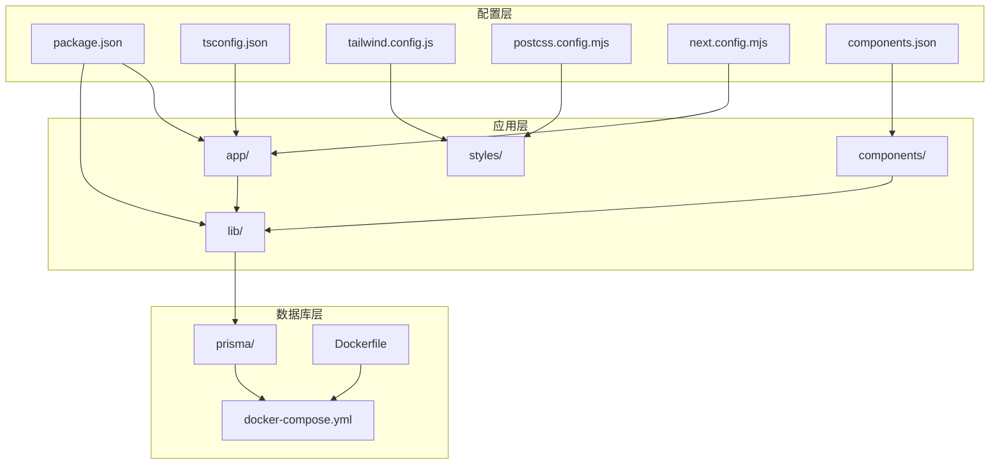
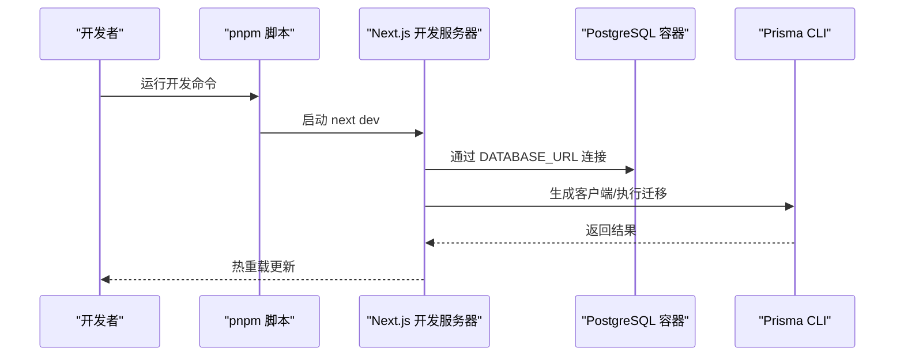
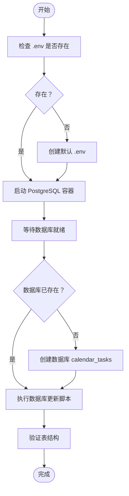
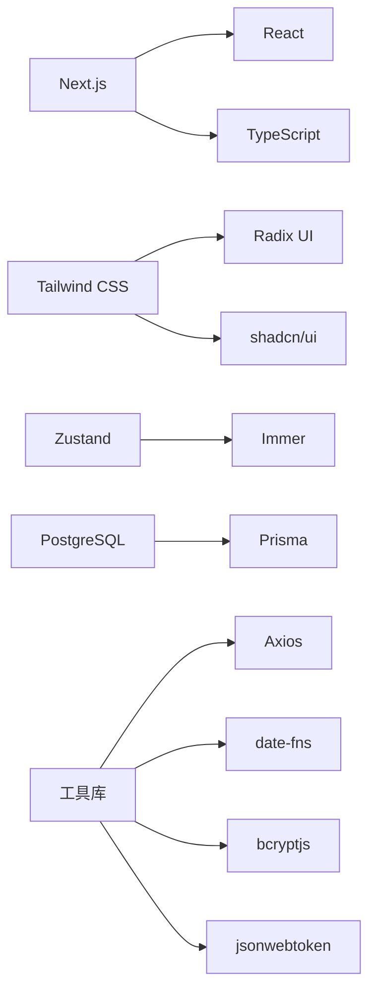

# 开发环境搭建

<cite>
**本文档引用的文件**
- [package.json](file://package.json)
- [tsconfig.json](file://tsconfig.json)
- [tailwind.config.js](file://tailwind.config.js)
- [postcss.config.mjs](file://postcss.config.mjs)
- [next.config.mjs](file://next.config.mjs)
- [prisma/schema.prisma](file://prisma/schema.prisma)
- [prisma.config.ts](file://prisma.config.ts)
- [components.json](file://components.json)
- [lib/prisma.ts](file://lib/prisma.ts)
- [lib/config.ts](file://lib/config.ts)
- [lib/auth.ts](file://lib/auth.ts)
- [docker-compose.yml](file://docker-compose.yml)
- [Dockerfile](file://Dockerfile)
- [README.md](file://README.md)
- [deploy/scripts/2-init-database.sh](file://deploy/scripts/2-init-database.sh)
- [scripts/seed-organizations.ts](file://scripts/seed-organizations.ts)
</cite>

## 目录
1. [简介](#简介)
2. [项目结构](#项目结构)
3. [核心组件](#核心组件)
4. [架构总览](#架构总览)
5. [详细组件分析](#详细组件分析)
6. [依赖分析](#依赖分析)
7. [性能考虑](#性能考虑)
8. [故障排除指南](#故障排除指南)
9. [结论](#结论)
10. [附录](#附录)

## 简介
本指南面向首次参与日历任务管理系统的开发者，提供从零开始的开发环境搭建步骤。内容涵盖 Node.js 版本要求、包管理器选择（pnpm）、IDE 推荐设置与 VS Code 扩展配置、项目依赖安装、TypeScript 与 Tailwind CSS 配置、数据库连接与初始化、本地开发服务器启动、热重载与调试设置，以及环境变量配置与种子数据加载。同时提供 Windows/macOS/Linux 三大平台的具体操作指引与常见问题解决方案。

## 项目结构
该项目采用 Next.js 16 App Router 架构，核心目录与职责如下：
- app：Next.js 应用入口、API 路由与页面组件
- components：业务组件与 UI 组件库（基于 Radix UI 与 shadcn/ui）
- lib：工具库、业务逻辑、Prisma 客户端、配置与认证模块
- prisma：数据库模型、迁移与种子脚本
- scripts：数据库维护与数据初始化脚本
- deploy：部署相关脚本与配置
- styles：全局样式入口
- 根目录配置：package.json、tsconfig.json、tailwind.config.js、postcss.config.mjs、next.config.mjs 等

图表来源
- [package.json](file://package.json#L1-L75)
- [tsconfig.json](file://tsconfig.json#L1-L44)
- [tailwind.config.js](file://tailwind.config.js#L1-L12)
- [postcss.config.mjs](file://postcss.config.mjs#L1-L10)
- [next.config.mjs](file://next.config.mjs#L1-L20)
- [components.json](file://components.json#L1-L22)
- [prisma/schema.prisma](file://prisma/schema.prisma#L1-L314)
- [docker-compose.yml](file://docker-compose.yml#L1-L77)
- [Dockerfile](file://Dockerfile#L1-L72)

章节来源
- [README.md](file://README.md#L139-L166)

## 核心组件
- 包管理器与运行脚本：使用 pnpm 管理依赖，提供 dev/build/start/lint 脚本
- TypeScript：严格模式、ESNext 目标、路径映射 @/*
- Tailwind CSS：内容扫描范围覆盖 app/components/pages；PostCSS 插件链启用 Tailwind 与 autoprefixer
- Next.js：生产输出为 standalone；忽略构建期 TypeScript 错误；禁用图片优化以适配 Docker
- 数据库：PostgreSQL + Prisma；通过 DATABASE_URL 环境变量连接；提供迁移与种子脚本
- 开发工具：Docker Compose 快速启动数据库；Prisma Studio 本地可视化

章节来源
- [package.json](file://package.json#L5-L10)
- [tsconfig.json](file://tsconfig.json#L2-L29)
- [tailwind.config.js](file://tailwind.config.js#L3-L7)
- [postcss.config.mjs](file://postcss.config.mjs#L2-L6)
- [next.config.mjs](file://next.config.mjs#L6-L16)
- [prisma/schema.prisma](file://prisma/schema.prisma#L11-L14)
- [prisma.config.ts](file://prisma.config.ts#L10-L12)

## 架构总览
开发环境的核心交互包括：本地开发服务器监听源码变更触发热重载；数据库通过 Docker Compose 提供；Prisma 生成客户端并执行迁移；应用通过环境变量连接数据库；种子脚本初始化演示数据。

图表来源
- [package.json](file://package.json#L5-L10)
- [docker-compose.yml](file://docker-compose.yml#L36-L48)
- [prisma/schema.prisma](file://prisma/schema.prisma#L11-L14)

## 详细组件分析

### Node.js 与包管理器
- Node.js 版本：Dockerfile 使用 node:20-alpine，建议本地也使用 Node.js 20.x LTS
- 包管理器：推荐使用 pnpm，根目录提供 pnpm-lock.yaml，确保依赖锁定一致
- 依赖安装：使用 pnpm install 安装所有依赖（含 devDependencies）

章节来源
- [Dockerfile](file://Dockerfile#L2)
- [package.json](file://package.json#L1-L75)

### IDE 推荐设置与 VS Code 扩展
- VS Code 扩展建议：
  - ESLint：统一代码风格与静态检查
  - Prettier：格式化
  - TypeScript Importer：自动导入
  - Tailwind CSS IntelliSense：类名提示
  - Prisma：数据库 schema 语法高亮与校验
  - DotENV：.env 文件语法高亮
- 工作区设置要点：
  - 使用 pnpm 作为默认包管理器
  - 启用 TypeScript 严格模式（项目已开启）
  - Tailwind CSS 内容扫描路径与项目结构保持一致

章节来源
- [tsconfig.json](file://tsconfig.json#L11-L12)
- [tailwind.config.js](file://tailwind.config.js#L3-L7)

### TypeScript 配置
- 目标与模块：ES6 目标、ESNext 模块解析、bundler 解析策略
- 严格模式：启用 strict、noEmit、incremental
- 路径映射：@/* 指向项目根目录，便于相对导入
- JSX：使用 react-jsx，配合 Next.js

章节来源
- [tsconfig.json](file://tsconfig.json#L2-L29)

### Tailwind CSS 设置
- 内容扫描：覆盖 app、components、pages 下的 js/ts/tsx/mdx
- 插件：未启用额外插件，保持最小化配置
- 与 PostCSS 集成：通过 @tailwindcss/postcss 与 autoprefixer 插件链

章节来源
- [tailwind.config.js](file://tailwind.config.js#L3-L7)
- [postcss.config.mjs](file://postcss.config.mjs#L2-L6)
- [components.json](file://components.json#L6-L12)

### Next.js 配置
- 生产输出：standalone，便于 Docker 部署
- TypeScript：忽略构建期错误，提升开发体验
- 图片：关闭优化，适配 Docker 构建环境
- 依赖优化：启用 optimizePackageImports 以减少打包体积

章节来源
- [next.config.mjs](file://next.config.mjs#L3-L16)

### 数据库连接与初始化
- 连接方式：通过 DATABASE_URL 环境变量连接 PostgreSQL
- Docker Compose：提供 postgres 服务与健康检查；应用服务依赖数据库健康状态
- 初始化脚本：提供数据库初始化脚本，自动创建数据库、执行 SQL 更新并验证结构
- Prisma 配置：schema.prisma 指定 datasource 为 postgresql 并读取 DATABASE_URL；prisma.config.ts 读取环境变量

图表来源
- [deploy/scripts/2-init-database.sh](file://deploy/scripts/2-init-database.sh#L10-L82)
- [docker-compose.yml](file://docker-compose.yml#L9-L18)

章节来源
- [prisma/schema.prisma](file://prisma/schema.prisma#L11-L14)
- [prisma.config.ts](file://prisma.config.ts#L10-L12)
- [docker-compose.yml](file://docker-compose.yml#L36-L48)
- [deploy/scripts/2-init-database.sh](file://deploy/scripts/2-init-database.sh#L50-L76)

### 本地开发服务器启动与热重载
- 启动命令：使用 pnpm dev 启动 Next.js 开发服务器
- 热重载：修改源码后自动刷新浏览器
- Docker 数据库：可选择使用 docker-compose up -d postgres 提前启动数据库

章节来源
- [package.json](file://package.json#L5-L10)
- [README.md](file://README.md#L121-L136)

### 调试设置
- 环境变量：NODE_ENV=development 时 Prisma 输出 error/warn 日志
- Prisma Studio：通过 docker-compose profiles: dev 启动，端口 5555，便于本地查看数据库
- JWT 与头像服务：JWT_SECRET 与 AVATAR_API_URL 可通过环境变量配置

章节来源
- [lib/prisma.ts](file://lib/prisma.ts#L7-L9)
- [docker-compose.yml](file://docker-compose.yml#L55-L66)
- [lib/config.ts](file://lib/config.ts#L13-L19)
- [lib/auth.ts](file://lib/auth.ts#L4-L6)

### 环境变量配置
- 数据库：DATABASE_URL=postgresql://postgres:${POSTGRES_PASSWORD:-postgres}@postgres:5432/calendar_tasks?schema=public
- 头像服务：AVATAR_API_URL=https://api.dicebear.com（默认公网）
- JWT：JWT_SECRET（生产环境必须替换）
- Next.js：NEXT_TELEMETRY_DISABLED=1（关闭遥测）

章节来源
- [docker-compose.yml](file://docker-compose.yml#L36-L48)
- [lib/config.ts](file://lib/config.ts#L13-L19)
- [lib/auth.ts](file://lib/auth.ts#L4-L6)
- [Dockerfile](file://Dockerfile#L40-L41)

### 数据库初始化与种子数据加载
- 迁移：npx prisma migrate dev
- 种子数据：使用 scripts/seed-organizations.ts 创建演示组织、成员、团队、项目与任务
- 注意：种子脚本依赖已存在的数据库与迁移

章节来源
- [README.md](file://README.md#L121-L136)
- [scripts/seed-organizations.ts](file://scripts/seed-organizations.ts#L1-L301)

## 依赖分析
- 前端框架：Next.js 16、React 19、TypeScript 5
- UI 框架：Tailwind CSS 4、Radix UI、Lucide React、shadcn/ui
- 状态管理：Zustand、Immer
- 数据库：PostgreSQL + Prisma
- 工具链：Axios、date-fns、bcryptjs、jsonwebtoken、Recharts、Tailwind CSS 动画工具

图表来源
- [package.json](file://package.json#L11-L61)

章节来源
- [package.json](file://package.json#L11-L75)

## 性能考虑
- 生产输出：standalone 减少运行时依赖
- 图片优化：开发环境关闭优化，避免 Docker 构建时字体访问问题
- 依赖优化：optimizePackageImports 仅按需引入图标库
- Docker 层缓存：Dockerfile 分阶段构建，先复制依赖再复制源码，充分利用缓存

章节来源
- [next.config.mjs](file://next.config.mjs#L13-L16)
- [Dockerfile](file://Dockerfile#L12-L29)

## 故障排除指南
- 数据库连接失败
  - 检查 DATABASE_URL 是否正确（包含密码与数据库名）
  - 使用 docker-compose ps 确认 postgres 容器健康
  - 使用 docker logs calendar-postgres 查看数据库日志
- 迁移失败
  - 确保数据库已初始化且可访问
  - 使用 npx prisma migrate dev 或 migrate deploy
- 端口冲突
  - 修改 docker-compose.yml 中的端口映射（如 5432:5432 -> 5433:5432）
- 热重载不生效
  - 确认使用 pnpm dev 启动
  - 检查 tsconfig.json 严格模式与路径映射
- 头像加载失败
  - 检查 AVATAR_API_URL 环境变量
  - 如需内网部署，设置内网头像服务地址

章节来源
- [docker-compose.yml](file://docker-compose.yml#L13-L18)
- [prisma/schema.prisma](file://prisma/schema.prisma#L11-L14)
- [lib/config.ts](file://lib/config.ts#L13-L19)

## 结论
本指南提供了从零开始搭建日历任务管理系统开发环境的完整路径。遵循本文档的步骤，可在 Windows/macOS/Linux 上快速完成依赖安装、数据库初始化、开发服务器启动与调试配置。遇到问题时，可依据故障排除章节进行定位与修复。

## 附录

### 不同操作系统安装步骤

- Windows
  - 安装 Node.js 20.x LTS 与 pnpm
  - 安装 Docker Desktop 并启动
  - 在项目根目录执行：pnpm install
  - 启动数据库：docker-compose up -d postgres
  - 执行迁移：npx prisma migrate dev
  - 启动开发服务器：pnpm dev
  - 访问 http://localhost:3000

- macOS
  - 使用 Homebrew 安装 Node.js 20.x 与 pnpm
  - 安装并启动 Docker Desktop
  - 在项目根目录执行：pnpm install
  - 启动数据库：docker-compose up -d postgres
  - 执行迁移：npx prisma migrate dev
  - 启动开发服务器：pnpm dev
  - 访问 http://localhost:3000

- Linux
  - 使用包管理器安装 Node.js 20.x 与 pnpm
  - 安装并启动 Docker
  - 在项目根目录执行：pnpm install
  - 启动数据库：docker-compose up -d postgres
  - 执行迁移：npx prisma migrate dev
  - 启动开发服务器：pnpm dev
  - 访问 http://localhost:3000

章节来源
- [README.md](file://README.md#L121-L136)
- [package.json](file://package.json#L5-L10)
- [docker-compose.yml](file://docker-compose.yml#L36-L48)