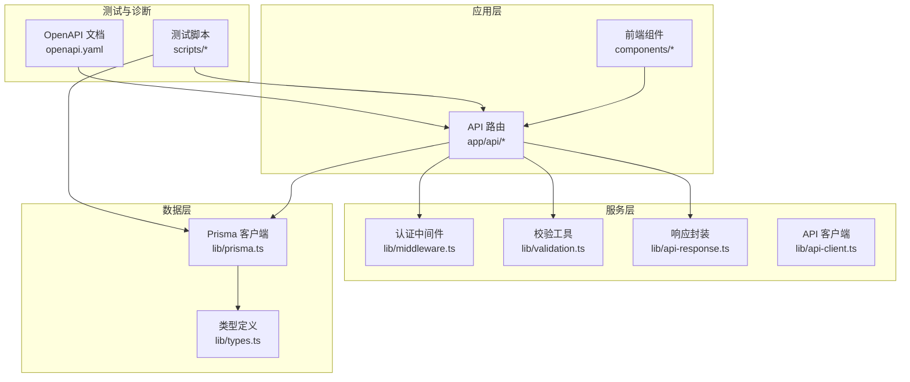
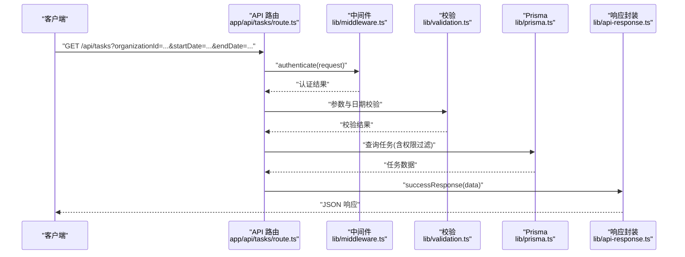
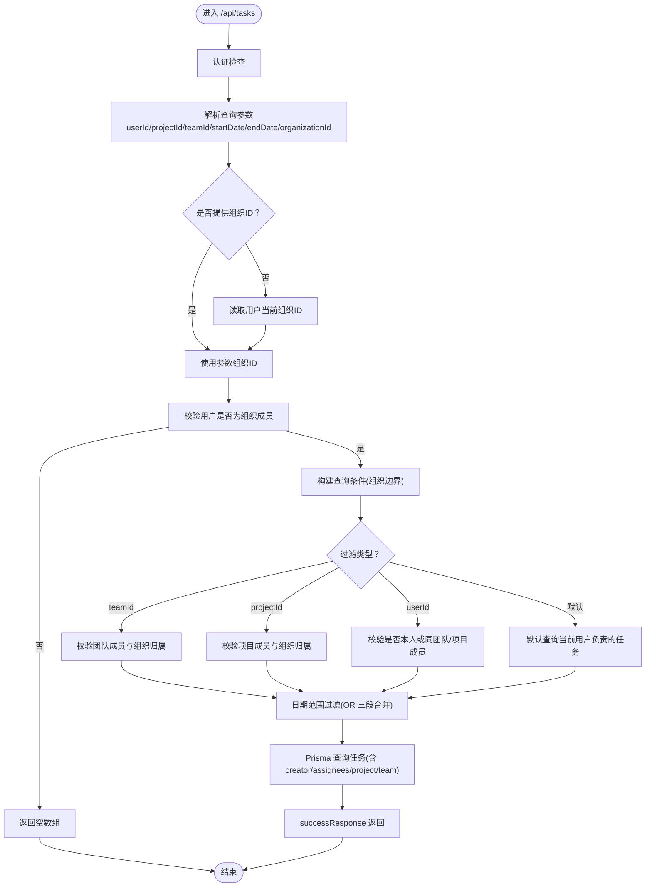
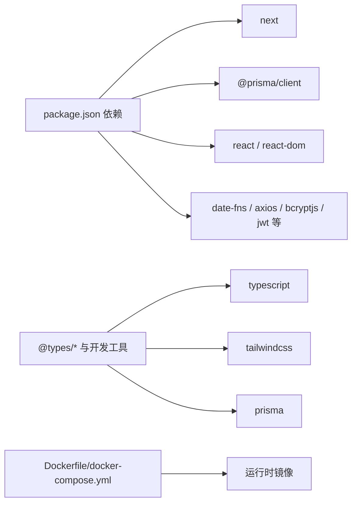

# 测试与调试

<cite>
**本文引用的文件**
- [package.json](file://package.json)
- [lib/prisma.ts](file://lib/prisma.ts)
- [lib/types.ts](file://lib/types.ts)
- [lib/mock-data.ts](file://lib/mock-data.ts)
- [lib/mock-data-new.ts](file://lib/mock-data-new.ts)
- [lib/api-client.ts](file://lib/api-client.ts)
- [lib/api-response.ts](file://lib/api-response.ts)
- [lib/validation.ts](file://lib/validation.ts)
- [lib/middleware.ts](file://lib/middleware.ts)
- [app/api/tasks/route.ts](file://app/api/tasks/route.ts)
- [app/api/users/me/route.ts](file://app/api/users/me/route.ts)
- [scripts/test-notifications.ts](file://scripts/test-notifications.ts)
- [scripts/test-invite-codes.ts](file://scripts/test-invite-codes.ts)
- [scripts/test-api-response-size.ts](file://scripts/test-api-response-size.ts)
- [scripts/test-all-api-sizes.ts](file://scripts/test-all-api-sizes.ts)
- [scripts/diagnose-database.ts](file://scripts/diagnose-database.ts)
- [scripts/cleanup-database.ts](file://scripts/cleanup-database.ts)
- [scripts/server-diagnose.sh](file://scripts/server-diagnose.sh)
- [scripts/verify-invite-codes.ts](file://scripts/verify-invite-codes.ts)
- [scripts/verify-personal-projects.ts](file://scripts/verify-personal-projects.ts)
- [scripts/verify-user-projects.ts](file://scripts/verify-user-projects.ts)
- [scripts/seed-two-spaces.ts](file://scripts/seed-two-spaces.ts)
- [scripts/restore-database.sh](file://scripts/restore-database.sh)
- [scripts/deploy.sh](file://scripts/deploy.sh)
- [docker-compose.yml](file://docker-compose.yml)
- [Dockerfile](file://Dockerfile)
- [openapi.yaml](file://openapi.yaml)
- [API_DOCUMENTATION.md](file://API_DOCUMENTATION.md)
- [NOTIFICATION_SYSTEM.md](file://NOTIFICATION_SYSTEM.md)
- [INVITE_CODE_SYSTEM.md](file://INVITE_CODE_SYSTEM.md)
- [TASK_PROJECT_VALIDATION.md](file://TASK_PROJECT_VALIDATION.md)
</cite>

## 目录
1. [简介](#简介)
2. [项目结构](#项目结构)
3. [核心组件](#核心组件)
4. [架构总览](#架构总览)
5. [详细组件分析](#详细组件分析)
6. [依赖分析](#依赖分析)
7. [性能考虑](#性能考虑)
8. [故障排查指南](#故障排查指南)
9. [结论](#结论)
10. [附录](#附录)

## 简介
本指南面向开发者与测试工程师，系统化介绍日历任务管理系统的测试与调试策略。内容涵盖单元测试、集成测试与端到端测试的实施方法；API 测试脚本的使用与数据库验证工具；性能测试策略；调试工具配置、错误追踪与日志分析技巧；测试数据准备、模拟环境搭建与持续集成配置；以及完整的质量保证体系与问题排查流程。

## 项目结构
系统采用 Next.js 16 应用，API 路由位于 app/api 下，业务逻辑集中在路由处理器中，数据访问通过 Prisma 客户端，类型定义集中于 lib/types.ts，测试与诊断脚本位于 scripts/ 目录，部署与容器化配置位于根目录与 deploy/ 目录。

图表来源
- [app/api/tasks/route.ts](file://app/api/tasks/route.ts#L1-L497)
- [lib/prisma.ts](file://lib/prisma.ts#L1-L12)
- [lib/types.ts](file://lib/types.ts#L1-L141)
- [lib/validation.ts](file://lib/validation.ts)
- [lib/middleware.ts](file://lib/middleware.ts)
- [lib/api-response.ts](file://lib/api-response.ts)
- [lib/api-client.ts](file://lib/api-client.ts)
- [scripts/test-notifications.ts](file://scripts/test-notifications.ts#L1-L81)
- [openapi.yaml](file://openapi.yaml)

章节来源
- [package.json](file://package.json#L1-L75)
- [docker-compose.yml](file://docker-compose.yml)
- [Dockerfile](file://Dockerfile)

## 核心组件
- API 路由：提供任务、用户等核心资源的 CRUD 与权限控制，统一响应封装与错误处理。
- Prisma 客户端：集中初始化与日志配置，开发环境开启错误与警告日志。
- 类型系统：统一定义实体与权限模型，保障前后端契约一致。
- 校验与中间件：统一请求参数校验与认证流程。
- 测试与诊断脚本：覆盖通知、邀请码、API 响应大小、数据库诊断与清理等场景。

章节来源
- [app/api/tasks/route.ts](file://app/api/tasks/route.ts#L1-L497)
- [app/api/users/me/route.ts](file://app/api/users/me/route.ts#L1-L115)
- [lib/prisma.ts](file://lib/prisma.ts#L1-L12)
- [lib/types.ts](file://lib/types.ts#L1-L141)
- [lib/validation.ts](file://lib/validation.ts)
- [lib/middleware.ts](file://lib/middleware.ts)
- [lib/api-response.ts](file://lib/api-response.ts)

## 架构总览
系统采用“前端组件 + Next.js API 路由 + Prisma 数据访问”的三层架构。API 路由负责认证、权限校验、数据校验与业务逻辑，Prisma 提供类型安全的数据访问，测试脚本与诊断脚本贯穿开发与运维阶段。

图表来源
- [app/api/tasks/route.ts](file://app/api/tasks/route.ts#L18-L273)
- [lib/middleware.ts](file://lib/middleware.ts)
- [lib/validation.ts](file://lib/validation.ts)
- [lib/prisma.ts](file://lib/prisma.ts#L1-L12)
- [lib/api-response.ts](file://lib/api-response.ts)

## 详细组件分析

### API 路由：任务管理
- GET /api/tasks：支持按用户、项目、团队、组织与日期范围过滤，强制组织边界与成员权限校验，返回带关联信息的任务列表。
- POST /api/tasks：创建任务，校验必填字段与日期范围，自动将负责人加入项目/团队，异步发放积分并推送任务分配通知。

图表来源
- [app/api/tasks/route.ts](file://app/api/tasks/route.ts#L18-L273)

章节来源
- [app/api/tasks/route.ts](file://app/api/tasks/route.ts#L1-L497)

### API 路由：用户信息
- GET /api/users/me：返回当前用户信息，包含基础资料与默认团队等。
- PUT /api/users/me：更新用户信息，邮箱格式与性别值校验，返回更新后的用户数据。

章节来源
- [app/api/users/me/route.ts](file://app/api/users/me/route.ts#L1-L115)

### 数据模型与类型
- 统一定义任务类型、权限策略、通知类型、组织/团队/项目/用户等实体结构，确保前后端契约一致。

章节来源
- [lib/types.ts](file://lib/types.ts#L1-L141)

### 测试脚本：通知系统
- 创建组织加入申请与对应通知，统计未读数，指导人工验证通知流。

章节来源
- [scripts/test-notifications.ts](file://scripts/test-notifications.ts#L1-L81)

### 测试脚本：邀请码系统
- 验证每用户每组织唯一邀请码、组织隔离性与全局唯一性，并模拟 API 验证逻辑。

章节来源
- [scripts/test-invite-codes.ts](file://scripts/test-invite-codes.ts#L1-L130)

### 性能测试：API 响应大小
- 分别测试 /api/teams 与 /api/users 等接口的响应大小与查询耗时，提供简化查询对比，识别异常大对象。

章节来源
- [scripts/test-api-response-size.ts](file://scripts/test-api-response-size.ts#L1-L132)
- [scripts/test-all-api-sizes.ts](file://scripts/test-all-api-sizes.ts#L1-L215)

### 数据库诊断与清理
- 诊断脚本：检查重复成员关系、默认团队有效性、表记录数等。
- 清理脚本：删除过期已读通知，降低存储压力。

章节来源
- [scripts/diagnose-database.ts](file://scripts/diagnose-database.ts#L1-L175)
- [scripts/cleanup-database.ts](file://scripts/cleanup-database.ts#L167-L192)

### 服务器诊断脚本
- Docker 容器状态、资源使用、日志、数据库表大小与记录数检查。

章节来源
- [scripts/server-diagnose.sh](file://scripts/server-diagnose.sh#L1-L62)

### 测试数据准备与模拟环境
- mock 数据：提供历史版本与新版示例数据，便于前端与集成测试。
- 种子脚本：快速生成多空间测试数据，包含个人事务与跨天任务。

章节来源
- [lib/mock-data.ts](file://lib/mock-data.ts#L1-L184)
- [lib/mock-data-new.ts](file://lib/mock-data-new.ts#L1-L349)
- [scripts/seed-two-spaces.ts](file://scripts/seed-two-spaces.ts#L330-L372)

### API 文档与规范
- OpenAPI 文档与 API 文档：提供接口契约与调用规范，支撑自动化测试与集成验证。

章节来源
- [openapi.yaml](file://openapi.yaml)
- [API_DOCUMENTATION.md](file://API_DOCUMENTATION.md)

## 依赖分析
- 运行时依赖：Next.js、Prisma Client、React 生态、工具库等。
- 开发依赖：Prisma、TailwindCSS、TypeScript 等。
- 容器化与编排：Dockerfile 与 docker-compose.yml 支持本地与生产部署。

图表来源
- [package.json](file://package.json#L11-L74)
- [Dockerfile](file://Dockerfile)
- [docker-compose.yml](file://docker-compose.yml)

章节来源
- [package.json](file://package.json#L1-L75)
- [Dockerfile](file://Dockerfile)
- [docker-compose.yml](file://docker-compose.yml)

## 性能考虑
- 响应大小与查询耗时：通过脚本对比完整与简化查询，识别异常大对象，必要时调整 include 字段与分页策略。
- 日志级别：开发环境开启错误与警告日志，生产环境仅错误日志，平衡可观测性与性能。
- 通知清理：定期清理过期通知，降低数据库膨胀与查询成本。

章节来源
- [scripts/test-api-response-size.ts](file://scripts/test-api-response-size.ts#L1-L132)
- [scripts/test-all-api-sizes.ts](file://scripts/test-all-api-sizes.ts#L1-L215)
- [lib/prisma.ts](file://lib/prisma.ts#L7-L9)
- [scripts/cleanup-database.ts](file://scripts/cleanup-database.ts#L167-L192)

## 故障排查指南

### 调试工具与配置
- Prisma 日志：开发环境输出错误与警告，便于定位查询与约束问题。
- 服务器诊断脚本：检查容器状态、资源使用、日志与数据库表大小与记录数。
- 数据库诊断脚本：检测重复成员关系、默认团队有效性与表记录数。

章节来源
- [lib/prisma.ts](file://lib/prisma.ts#L7-L9)
- [scripts/server-diagnose.sh](file://scripts/server-diagnose.sh#L1-L62)
- [scripts/diagnose-database.ts](file://scripts/diagnose-database.ts#L1-L175)

### 错误追踪与日志分析
- API 层统一错误响应封装，便于前端与测试捕获。
- 中间件认证失败与权限不足时返回明确错误信息。
- 建议结合 Prisma 日志与服务器日志定位问题。

章节来源
- [app/api/tasks/route.ts](file://app/api/tasks/route.ts#L47-L63)
- [app/api/tasks/route.ts](file://app/api/tasks/route.ts#L269-L272)
- [lib/api-response.ts](file://lib/api-response.ts)

### 测试数据准备与模拟环境
- 使用 mock 数据快速搭建测试场景，覆盖任务类型、跨周与重叠任务等边界。
- 种子脚本生成多空间测试数据，包含个人事务与跨天任务，便于端到端验证。

章节来源
- [lib/mock-data.ts](file://lib/mock-data.ts#L1-L184)
- [lib/mock-data-new.ts](file://lib/mock-data-new.ts#L1-L349)
- [scripts/seed-two-spaces.ts](file://scripts/seed-two-spaces.ts#L330-L372)

### 持续集成配置
- 建议在 CI 中执行：
  - Lint 与类型检查
  - 数据库迁移与种子数据注入
  - API 响应大小与邀请码等专项测试脚本
  - 服务器诊断脚本验证部署后状态

章节来源
- [package.json](file://package.json#L5-L10)
- [scripts/test-all-api-sizes.ts](file://scripts/test-all-api-sizes.ts#L1-L215)
- [scripts/test-invite-codes.ts](file://scripts/test-invite-codes.ts#L1-L130)
- [scripts/server-diagnose.sh](file://scripts/server-diagnose.sh#L1-L62)

### API 测试脚本使用方法
- 通知系统测试：创建申请与通知，统计未读数，指导人工验证。
- 邀请码系统测试：验证唯一性与组织隔离性，模拟 API 验证逻辑。
- 响应大小测试：对比完整与简化查询，识别异常大对象。

章节来源
- [scripts/test-notifications.ts](file://scripts/test-notifications.ts#L1-L81)
- [scripts/test-invite-codes.ts](file://scripts/test-invite-codes.ts#L1-L130)
- [scripts/test-api-response-size.ts](file://scripts/test-api-response-size.ts#L1-L132)
- [scripts/test-all-api-sizes.ts](file://scripts/test-all-api-sizes.ts#L1-L215)

### 数据库验证工具
- 诊断脚本：检查重复成员关系、默认团队有效性、表记录数。
- 清理脚本：删除过期通知，降低存储压力。
- 备份与恢复：提供数据库备份与恢复脚本，保障测试与回滚安全。

章节来源
- [scripts/diagnose-database.ts](file://scripts/diagnose-database.ts#L1-L175)
- [scripts/cleanup-database.ts](file://scripts/cleanup-database.ts#L167-L192)
- [scripts/restore-database.sh](file://scripts/restore-database.sh)

### 错误处理与权限校验
- 未指定组织ID、无权访问组织数据、项目/团队不属于当前组织、非本人任务访问等场景均有明确错误提示。
- 任务创建时自动将负责人加入项目/团队，避免权限缺失导致的失败。

章节来源
- [app/api/tasks/route.ts](file://app/api/tasks/route.ts#L35-L63)
- [app/api/tasks/route.ts](file://app/api/tasks/route.ts#L100-L132)
- [app/api/tasks/route.ts](file://app/api/tasks/route.ts#L332-L348)
- [app/api/tasks/route.ts](file://app/api/tasks/route.ts#L367-L390)

## 结论
本测试与调试指南提供了从单元、集成到端到端的完整测试策略，结合 API 测试脚本、数据库验证工具与性能测试方法，辅以调试工具配置与持续集成建议，帮助团队建立稳定的质量保证体系与高效的问题排查流程。建议在开发与发布各阶段严格执行相应测试步骤，并根据实际业务演进持续完善测试矩阵与诊断脚本。

## 附录

### API 测试清单
- 任务查询：组织边界、项目/团队/用户过滤、日期范围、权限校验
- 任务创建：必填字段、日期范围、类型与颜色、负责人加入、通知推送
- 用户信息：获取与更新，邮箱与性别校验

章节来源
- [app/api/tasks/route.ts](file://app/api/tasks/route.ts#L18-L273)
- [app/api/users/me/route.ts](file://app/api/users/me/route.ts#L16-L115)

### 专项测试清单
- 邀请码：唯一性、组织隔离性、API 验证逻辑
- 通知：申请与通知创建、未读统计、人工验证
- 响应大小：完整与简化查询对比、异常大对象识别
- 数据库：重复成员关系、默认团队有效性、表记录数

章节来源
- [scripts/test-invite-codes.ts](file://scripts/test-invite-codes.ts#L1-L130)
- [scripts/test-notifications.ts](file://scripts/test-notifications.ts#L1-L81)
- [scripts/test-api-response-size.ts](file://scripts/test-api-response-size.ts#L1-L132)
- [scripts/diagnose-database.ts](file://scripts/diagnose-database.ts#L1-L175)