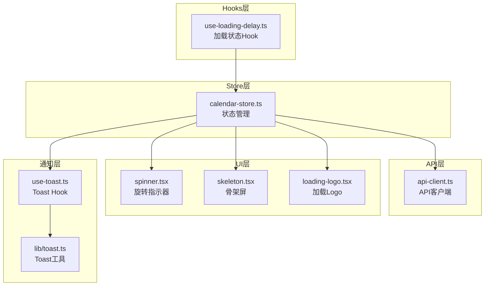
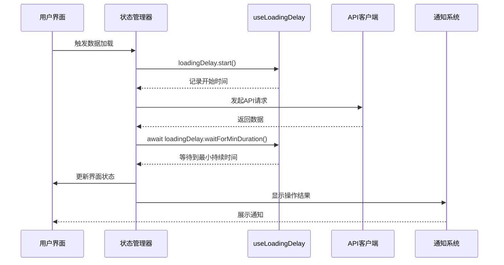
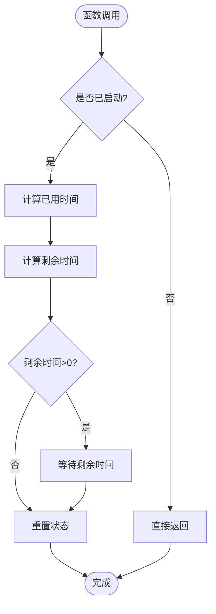
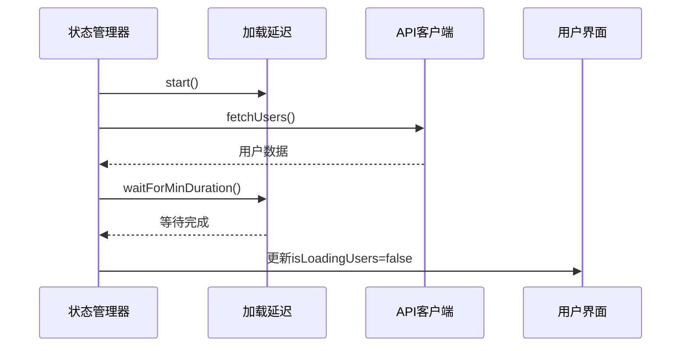
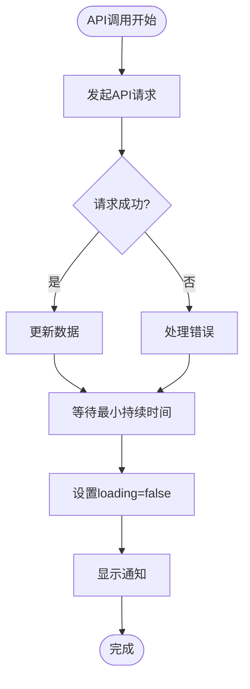
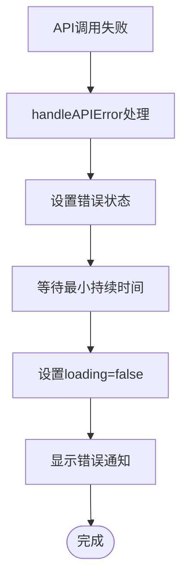
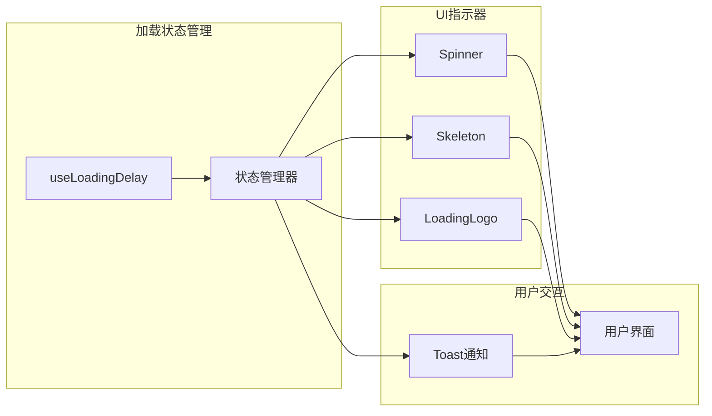
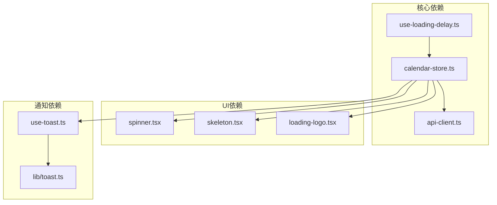

# 加载状态Hook

<cite>
**本文档引用的文件**
- [hooks/use-loading-delay.ts](file://hooks/use-loading-delay.ts)
- [lib/store/calendar-store.ts](file://lib/store/calendar-store.ts)
- [lib/api-client.ts](file://lib/api-client.ts)
- [hooks/use-toast.ts](file://hooks/use-toast.ts)
- [lib/toast.ts](file://lib/toast.ts)
- [components/ui/spinner.tsx](file://components/ui/spinner.tsx)
- [components/ui/skeleton.tsx](file://components/ui/skeleton.tsx)
- [components/loading-logo.tsx](file://components/loading-logo.tsx)
</cite>

## 目录
1. [简介](#简介)
2. [项目结构](#项目结构)
3. [核心组件](#核心组件)
4. [架构概览](#架构概览)
5. [详细组件分析](#详细组件分析)
6. [依赖关系分析](#依赖关系分析)
7. [性能考虑](#性能考虑)
8. [故障排除指南](#故障排除指南)
9. [结论](#结论)
10. [附录](#附录)

## 简介

useLoadingDelay Hook 是一个专为优化用户体验而设计的加载状态管理工具。它通过确保加载状态至少持续指定的时间来防止界面闪烁，提供更加流畅和一致的用户交互体验。该Hook的核心价值在于解决快速响应导致的"闪现"问题，让用户能够感知到明确的操作过程。

本Hook采用轻量级设计，仅包含两个核心方法：`start()` 和 `waitForMinDuration()`，通过简单的API实现了复杂的加载状态管理逻辑。它被广泛应用于项目的各个数据获取场景，包括任务、项目、用户和团队数据的加载。

## 项目结构

useLoadingDelay Hook 在项目中的位置和相关组件分布如下：



**图表来源**
- [hooks/use-loading-delay.ts](file://hooks/use-loading-delay.ts#L1-L28)
- [lib/store/calendar-store.ts](file://lib/store/calendar-store.ts#L1-L50)

**章节来源**
- [hooks/use-loading-delay.ts](file://hooks/use-loading-delay.ts#L1-L28)
- [lib/store/calendar-store.ts](file://lib/store/calendar-store.ts#L1-L50)

## 核心组件

### useLoadingDelay Hook概述

useLoadingDelay Hook 提供了以下核心功能：

- **最小持续时间保证**：确保加载状态至少显示指定的毫秒数
- **智能延迟计算**：根据实际耗时动态计算剩余等待时间
- **异步等待机制**：提供非阻塞的等待功能
- **状态管理**：维护内部计时状态，避免竞态条件

### 参数配置

Hook接受一个可选的 `minDuration` 参数，默认值为800毫秒：

```typescript
// 基本用法
const loadingDelay = useLoadingDelay();

// 自定义延迟时间
const loadingDelay = useLoadingDelay(1200); // 1.2秒
```

### 返回值结构

Hook返回包含两个方法的对象：

| 方法名 | 类型 | 描述 | 使用场景 |
|--------|------|------|----------|
| `start()` | `() => void` | 启动计时器，记录开始时间 | 在API调用前调用 |
| `waitForMinDuration()` | `() => Promise<void>` | 等待到最小持续时间 | 在API调用完成后调用 |

**章节来源**
- [hooks/use-loading-delay.ts](file://hooks/use-loading-delay.ts#L6-L27)

## 架构概览

useLoadingDelay Hook 在整个应用架构中的位置和交互关系：



**图表来源**
- [lib/store/calendar-store.ts](file://lib/store/calendar-store.ts#L388-L412)
- [hooks/use-loading-delay.ts](file://hooks/use-loading-delay.ts#L9-L24)

## 详细组件分析

### useLoadingDelay 实现分析

#### 核心算法流程



**图表来源**
- [hooks/use-loading-delay.ts](file://hooks/use-loading-delay.ts#L13-L24)

#### 关键实现细节

1. **时间计算精度**：使用 `Date.now()` 获取高精度时间戳
2. **边界处理**：使用 `Math.max(0, minDuration - elapsedTime)` 确保非负值
3. **内存管理**：执行完成后重置 `startTime` 为 `null`
4. **异步等待**：使用 `Promise` 和 `setTimeout` 实现非阻塞等待

#### 错误处理机制

Hook具备完善的错误处理能力：

- **未启动状态**：如果 `startTime` 为 `null`，直接返回
- **竞态条件防护**：确保在多次调用时的正确行为
- **异常安全**：即使发生异常也不会影响外部状态

**章节来源**
- [hooks/use-loading-delay.ts](file://hooks/use-loading-delay.ts#L1-L28)

### 在状态管理中的应用

#### 数据加载流程集成



**图表来源**
- [lib/store/calendar-store.ts](file://lib/store/calendar-store.ts#L388-L412)

#### 错误状态处理

在API调用失败时，Hook同样发挥作用：



**图表来源**
- [lib/store/calendar-store.ts](file://lib/store/calendar-store.ts#L403-L412)

**章节来源**
- [lib/store/calendar-store.ts](file://lib/store/calendar-store.ts#L388-L412)

### 与API系统的集成

#### API客户端协作

useLoadingDelay Hook 与API客户端的协作模式：

1. **前置启动**：在API调用前调用 `start()`
2. **后置等待**：在API调用后调用 `waitForMinDuration()`
3. **状态同步**：确保UI状态与Hook状态保持一致

#### 错误处理策略

API调用失败时的处理流程：



**图表来源**
- [lib/store/calendar-store.ts](file://lib/store/calendar-store.ts#L403-L412)
- [lib/api-client.ts](file://lib/api-client.ts#L502-L507)

**章节来源**
- [lib/api-client.ts](file://lib/api-client.ts#L502-L507)
- [lib/store/calendar-store.ts](file://lib/store/calendar-store.ts#L403-L412)

### UI组件集成

#### 加载指示器组件

项目提供了多种加载指示器组件：

| 组件 | 特点 | 使用场景 |
|------|------|----------|
| Spinner | 旋转动画指示器 | 简单加载状态 |
| Skeleton | 骨架屏占位符 | 内容区域加载 |
| LoadingLogo | Logo加载动画 | 应用初始化 |

#### 组件集成模式



**图表来源**
- [components/ui/spinner.tsx](file://components/ui/spinner.tsx#L1-L17)
- [components/ui/skeleton.tsx](file://components/ui/skeleton.tsx#L1-L14)
- [components/loading-logo.tsx](file://components/loading-logo.tsx#L1-L18)

**章节来源**
- [components/ui/spinner.tsx](file://components/ui/spinner.tsx#L1-L17)
- [components/ui/skeleton.tsx](file://components/ui/skeleton.tsx#L1-L14)
- [components/loading-logo.tsx](file://components/loading-logo.tsx#L1-L18)

## 依赖关系分析

### 组件耦合度分析



**图表来源**
- [hooks/use-loading-delay.ts](file://hooks/use-loading-delay.ts#L1-L28)
- [lib/store/calendar-store.ts](file://lib/store/calendar-store.ts#L25-L25)

### 外部依赖分析

| 依赖项 | 用途 | 版本要求 | 重要性 |
|--------|------|----------|--------|
| React | Hook运行环境 | ^18.0 | 必需 |
| Next.js | SSR支持 | ^13.0 | 可选 |
| Zustand | 状态管理 | ^4.0 | 可选 |
| Lucide React | 图标库 | ^0.300 | 可选 |

**章节来源**
- [hooks/use-loading-delay.ts](file://hooks/use-loading-delay.ts#L1-L28)
- [lib/store/calendar-store.ts](file://lib/store/calendar-store.ts#L1-L32)

## 性能考虑

### 时间复杂度分析

- **start() 方法**：O(1) 时间复杂度，O(1) 空间复杂度
- **waitForMinDuration() 方法**：O(1) 时间复杂度，最坏情况下可能阻塞等待
- **整体性能**：对应用性能影响极小，主要开销来自网络I/O而非Hook本身

### 内存使用优化

- **状态存储**：仅存储单一时间戳变量
- **生命周期管理**：自动清理状态，避免内存泄漏
- **异步处理**：使用Promise避免阻塞主线程

### 用户体验优化

- **最小延迟时间**：默认800ms，平衡性能和用户体验
- **智能等待**：根据实际耗时动态调整等待时间
- **非阻塞设计**：不影响其他UI操作的响应性

## 故障排除指南

### 常见问题及解决方案

#### 问题1：加载状态不消失

**症状**：页面一直显示加载状态

**可能原因**：
- 忘记调用 `waitForMinDuration()`
- 异常处理中未正确设置loading状态

**解决方案**：
```typescript
// 确保在finally块中调用
try {
  await apiCall();
} catch (error) {
  handleError(error);
} finally {
  await loadingDelay.waitForMinDuration();
  setLoading(false);
}
```

#### 问题2：延迟时间过长

**症状**：用户等待时间过长

**解决方案**：
```typescript
// 调整延迟时间
const loadingDelay = useLoadingDelay(500); // 减少到500ms
```

#### 问题3：并发请求冲突

**症状**：多个并发请求导致状态混乱

**解决方案**：
```typescript
// 为每个请求创建独立的Hook实例
const delay1 = useLoadingDelay();
const delay2 = useLoadingDelay();
```

**章节来源**
- [lib/store/calendar-store.ts](file://lib/store/calendar-store.ts#L388-L412)

### 调试技巧

1. **日志跟踪**：在关键节点添加console.log输出
2. **状态监控**：使用浏览器开发者工具监控状态变化
3. **性能分析**：使用性能面板分析加载时间

## 结论

useLoadingDelay Hook 为项目提供了优雅的加载状态管理解决方案。通过确保最小持续时间和智能延迟计算，它有效解决了界面闪烁问题，提升了用户体验的一致性和流畅性。

该Hook的设计体现了以下优势：
- **简单易用**：仅需两个方法即可实现完整的加载状态管理
- **性能友好**：非阻塞设计不影响应用响应性
- **灵活配置**：支持自定义延迟时间
- **错误处理**：完善的异常处理机制

建议在所有涉及API调用的场景中使用此Hook，以确保一致的用户体验。

## 附录

### 使用示例模板

#### 基础使用模式

```typescript
// 1. 创建Hook实例
const loadingDelay = useLoadingDelay();

// 2. 启动加载状态
loadingDelay.start();

// 3. 执行API调用
try {
  const data = await apiCall();
  // 处理数据...
} catch (error) {
  handleError(error);
} finally {
  // 4. 等待最小持续时间
  await loadingDelay.waitForMinDuration();
  // 5. 关闭加载状态
  setLoading(false);
}
```

#### 高级配置选项

```typescript
// 自定义延迟时间
const loadingDelay = useLoadingDelay(1000); // 1秒

// 与其他Hook组合使用
const { toast } = useToast();
const loadingDelay = useLoadingDelay(800);

// 错误处理集成
try {
  await apiCall();
} catch (error) {
  toast.error('操作失败', error.message);
} finally {
  await loadingDelay.waitForMinDuration();
  setLoading(false);
}
```

### 最佳实践建议

1. **始终成对使用**：start() 和 waitForMinDuration() 必须配对使用
2. **异常安全**：在finally块中调用waitForMinDuration()
3. **合理配置**：根据API响应时间调整minDuration参数
4. **状态同步**：确保UI状态与Hook状态保持一致