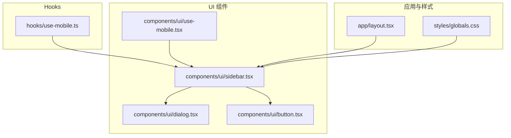
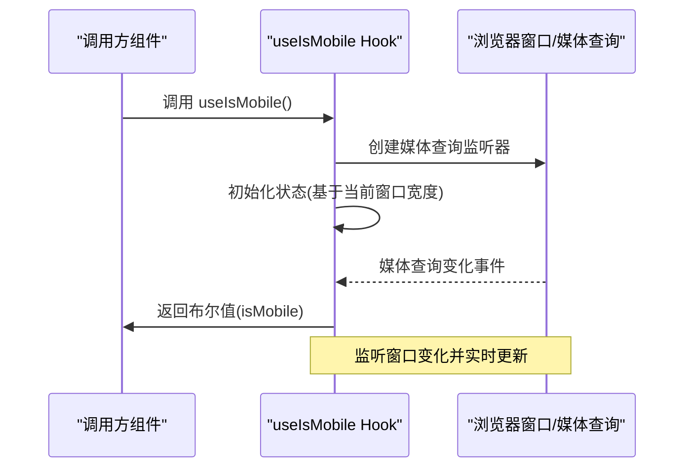
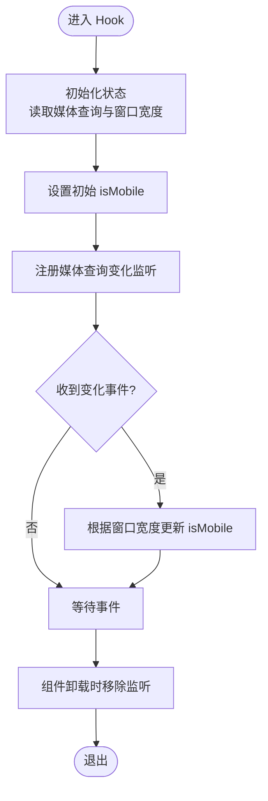
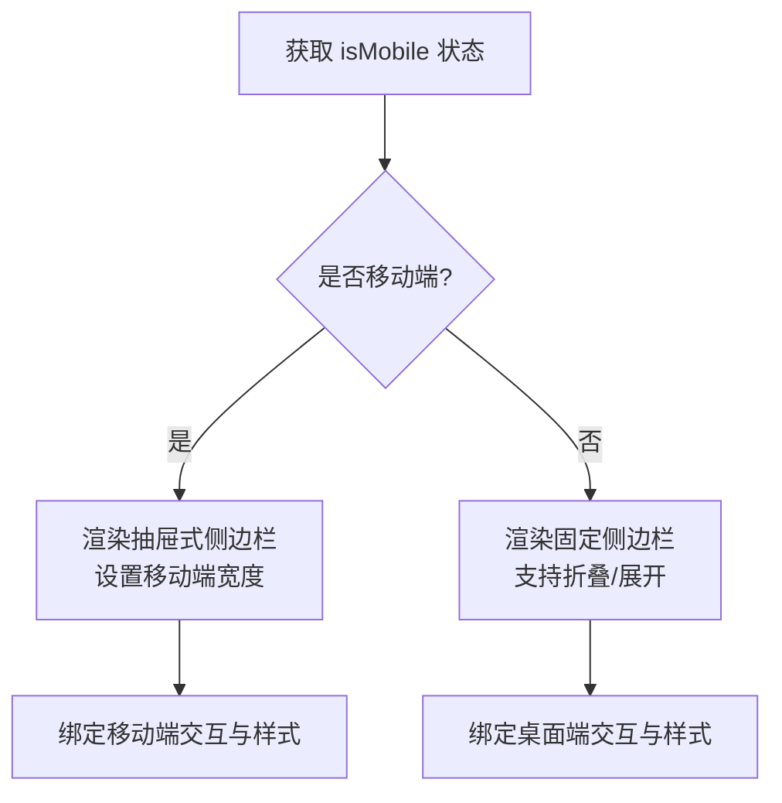
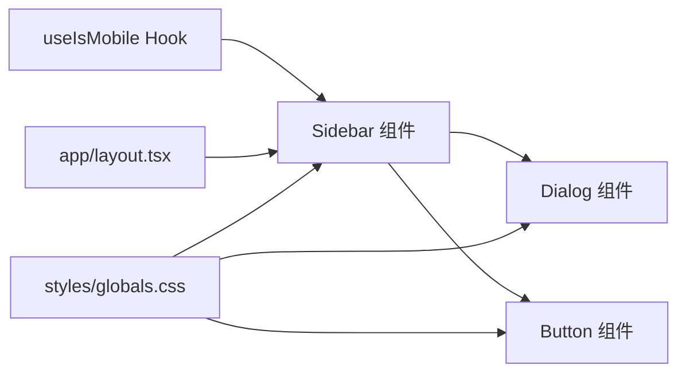

# 响应式Hook

<cite>
**本文引用的文件**
- [hooks/use-mobile.ts](file://hooks/use-mobile.ts)
- [components/ui/use-mobile.tsx](file://components/ui/use-mobile.tsx)
- [components/ui/sidebar.tsx](file://components/ui/sidebar.tsx)
- [components/ui/dialog.tsx](file://components/ui/dialog.tsx)
- [components/ui/button.tsx](file://components/ui/button.tsx)
- [app/layout.tsx](file://app/layout.tsx)
- [styles/globals.css](file://styles/globals.css)
</cite>

## 目录
1. [简介](#简介)
2. [项目结构](#项目结构)
3. [核心组件](#核心组件)
4. [架构总览](#架构总览)
5. [详细组件分析](#详细组件分析)
6. [依赖关系分析](#依赖关系分析)
7. [性能考量](#性能考量)
8. [故障排查指南](#故障排查指南)
9. [结论](#结论)
10. [附录](#附录)

## 简介
本指南围绕 useMobile Hook 的设备检测、断点判断与屏幕适配机制展开，结合项目中的实际用法（如侧边栏在移动端与桌面端的差异化呈现），系统讲解窗口尺寸监听、方向变化检测与触摸事件处理的建议方案，并给出配置选项、返回值语义、性能优化策略与最佳实践，帮助你在多端环境中构建灵活、可维护的响应式界面。

## 项目结构
本项目采用按功能分层的组织方式：Hooks 放置于 hooks 目录，UI 组件位于 components/ui，页面布局与全局样式分别在 app 与 styles 下。useMobile Hook 在 hooks 与 components/ui 中存在两个相同实现，用于在不同上下文中提供设备检测能力。

**图表来源**
- [hooks/use-mobile.ts](file://hooks/use-mobile.ts#L1-L19)
- [components/ui/use-mobile.tsx](file://components/ui/use-mobile.tsx#L1-L19)
- [components/ui/sidebar.tsx](file://components/ui/sidebar.tsx#L1-L727)
- [components/ui/dialog.tsx](file://components/ui/dialog.tsx#L1-L144)
- [components/ui/button.tsx](file://components/ui/button.tsx#L1-L61)
- [app/layout.tsx](file://app/layout.tsx#L1-L45)
- [styles/globals.css](file://styles/globals.css#L1-L126)

**章节来源**
- [hooks/use-mobile.ts](file://hooks/use-mobile.ts#L1-L19)
- [components/ui/use-mobile.tsx](file://components/ui/use-mobile.tsx#L1-L19)
- [components/ui/sidebar.tsx](file://components/ui/sidebar.tsx#L1-L727)
- [app/layout.tsx](file://app/layout.tsx#L1-L45)
- [styles/globals.css](file://styles/globals.css#L1-L126)

## 核心组件
- useIsMobile Hook：提供当前是否为移动设备的布尔状态，内部通过媒体查询与窗口宽度进行断点判断，默认断点为 768px。
- Sidebar 组件：在移动端使用抽屉式展示，在桌面端使用固定侧边栏；根据 useIsMobile 的结果切换渲染逻辑。
- 其他 UI 组件：如 Dialog、Button 等，配合断点条件控制显示与交互行为。

关键要点
- 断点常量：默认断点为 768px，可在 Hook 内部或调用处统一调整。
- 返回值：布尔值，true 表示移动端，false 表示非移动端。
- 初始化与更新：首次渲染时立即设置一次状态，随后监听媒体查询变化事件以动态更新。

**章节来源**
- [hooks/use-mobile.ts](file://hooks/use-mobile.ts#L1-L19)
- [components/ui/use-mobile.tsx](file://components/ui/use-mobile.tsx#L1-L19)
- [components/ui/sidebar.tsx](file://components/ui/sidebar.tsx#L68-L94)

## 架构总览
useMobile Hook 作为底层设备检测能力，向上游 UI 组件提供断点判断依据，从而实现“同一套逻辑在不同终端差异化呈现”的目标。

**图表来源**
- [hooks/use-mobile.ts](file://hooks/use-mobile.ts#L5-L19)
- [components/ui/use-mobile.tsx](file://components/ui/use-mobile.tsx#L5-L19)
- [components/ui/sidebar.tsx](file://components/ui/sidebar.tsx#L68-L94)

## 详细组件分析

### useIsMobile Hook 分析
- 设备检测原理
  - 使用媒体查询 `(max-width: ${MOBILE_BREAKPOINT - 1}px)` 判断是否处于移动端范围。
  - 同时读取 window.innerWidth 以确保断点判断与当前视口一致。
- 生命周期管理
  - 首次渲染时设置初始状态。
  - 添加媒体查询变化监听，在组件卸载时移除监听，避免内存泄漏。
- 可扩展性
  - 断点阈值可通过修改常量或传参方式定制。
  - 可进一步扩展为多断点（如小屏/中屏/大屏）的枚举返回值。

**图表来源**
- [hooks/use-mobile.ts](file://hooks/use-mobile.ts#L5-L19)
- [components/ui/use-mobile.tsx](file://components/ui/use-mobile.tsx#L5-L19)

**章节来源**
- [hooks/use-mobile.ts](file://hooks/use-mobile.ts#L1-L19)
- [components/ui/use-mobile.tsx](file://components/ui/use-mobile.tsx#L1-L19)

### Sidebar 组件的断点适配
- 移动端（isMobile 为真）
  - 使用抽屉（Sheet）承载侧边栏内容，宽度与移动端体验更匹配。
- 桌面端（isMobile 为假）
  - 使用固定容器与过渡动画，支持折叠/展开等交互。
- 键盘快捷键与 Cookie 记忆
  - 提供键盘快捷键快速切换侧边栏。
  - 使用 Cookie 记录用户上次打开状态，提升一致性体验。

**图表来源**
- [components/ui/sidebar.tsx](file://components/ui/sidebar.tsx#L68-L94)
- [components/ui/sidebar.tsx](file://components/ui/sidebar.tsx#L183-L206)
- [components/ui/sidebar.tsx](file://components/ui/sidebar.tsx#L208-L253)

**章节来源**
- [components/ui/sidebar.tsx](file://components/ui/sidebar.tsx#L68-L94)
- [components/ui/sidebar.tsx](file://components/ui/sidebar.tsx#L183-L206)
- [components/ui/sidebar.tsx](file://components/ui/sidebar.tsx#L208-L253)

### Dialog 与 Button 的响应式协作
- Dialog
  - 在移动端通常采用全屏或接近全屏的弹窗尺寸，减少横向滚动与拥挤感。
  - 关闭按钮与内容区域的布局在小屏上更紧凑。
- Button
  - 尺寸变体（如 icon、sm、lg）在不同断点下提供更合适的点击面积与视觉权重。
  - 与 Sidebar 的交互（如移动端触发抽屉）保持一致的触达体验。

**章节来源**
- [components/ui/dialog.tsx](file://components/ui/dialog.tsx#L56-L81)
- [components/ui/button.tsx](file://components/ui/button.tsx#L23-L36)

### 窗口大小监听、方向变化检测与触摸事件处理
- 窗口大小监听
  - Hook 已通过媒体查询监听断点变化；若需更细粒度的窗口尺寸信息，可在业务层引入节流的 resize 监听并缓存结果。
- 方向变化检测
  - 可结合 screen.orientation 或 resize 事件判断横竖屏切换，再结合 useIsMobile 进行差异化渲染。
- 触摸事件处理
  - 在移动端优先使用触摸手势（如滑动、长按）替代鼠标悬停；在桌面端保留 hover 与键盘操作。
  - 对于交互元素（如按钮、菜单项）增加合适的命中区与反馈。

[本节为通用实践建议，不直接分析具体文件，故无“章节来源”]

## 依赖关系分析
- useMobile Hook 与 Sidebar 的耦合
  - Sidebar 通过 useIsMobile 切换移动端抽屉与桌面端固定布局，形成“状态驱动渲染”的清晰边界。
- 样式与主题
  - 全局样式与主题变量为断点适配提供基础，组件在不同断点下的尺寸与间距由 CSS 变量与工具类共同决定。
- 应用入口
  - 页面根布局负责注入字体、主题与全局样式，保证断点相关样式在各组件中一致生效。

**图表来源**
- [hooks/use-mobile.ts](file://hooks/use-mobile.ts#L5-L19)
- [components/ui/sidebar.tsx](file://components/ui/sidebar.tsx#L68-L94)
- [components/ui/dialog.tsx](file://components/ui/dialog.tsx#L56-L81)
- [components/ui/button.tsx](file://components/ui/button.tsx#L23-L36)
- [app/layout.tsx](file://app/layout.tsx#L25-L42)
- [styles/globals.css](file://styles/globals.css#L77-L126)

**章节来源**
- [hooks/use-mobile.ts](file://hooks/use-mobile.ts#L1-L19)
- [components/ui/sidebar.tsx](file://components/ui/sidebar.tsx#L68-L94)
- [app/layout.tsx](file://app/layout.tsx#L25-L42)
- [styles/globals.css](file://styles/globals.css#L77-L126)

## 性能考量
- 媒体查询监听
  - 使用 matchMedia 的 change 事件进行断点判断，避免频繁重排与重绘。
- 状态更新与渲染
  - 初次渲染即设置状态，后续仅在断点变化时更新，降低无效渲染。
- 清理监听
  - 在 useEffect 的清理函数中移除监听，防止内存泄漏与重复监听。
- 扩展建议
  - 若需要更精细的窗口尺寸信息，可对 resize 事件进行节流（如 16ms ~ 32ms），并在业务层做缓存与去抖。
  - 对于复杂布局，可将断点判断抽象为独立的 Context 或 Store，减少跨层级传递带来的重复计算。

[本节为通用性能建议，不直接分析具体文件，故无“章节来源”]

## 故障排查指南
- 现象：断点切换不生效
  - 检查媒体查询监听是否正确注册与移除。
  - 确认断点阈值与期望一致，必要时在 Hook 内部或调用处统一调整。
- 现象：抽屉与固定侧边栏切换异常
  - 确保 Sidebar 在移动端使用抽屉模式、桌面端使用固定容器。
  - 检查 isMobile 状态是否正确传递到子组件。
- 现象：样式错乱或尺寸异常
  - 检查全局样式与主题变量是否正确加载。
  - 确认组件在不同断点下的尺寸变体与布局类名未被覆盖。

**章节来源**
- [hooks/use-mobile.ts](file://hooks/use-mobile.ts#L8-L16)
- [components/ui/sidebar.tsx](file://components/ui/sidebar.tsx#L183-L206)
- [components/ui/sidebar.tsx](file://components/ui/sidebar.tsx#L208-L253)
- [app/layout.tsx](file://app/layout.tsx#L31-L42)
- [styles/globals.css](file://styles/globals.css#L77-L126)

## 结论
useMobile Hook 以简洁的方式提供了可靠的设备检测能力，配合 Sidebar 等组件实现了移动端与桌面端的差异化适配。通过媒体查询监听与状态驱动渲染，项目在多端环境下具备良好的一致性与可维护性。建议在实际开发中结合业务需求扩展断点策略、优化窗口尺寸监听的粒度，并在交互层面充分考虑移动端与桌面端的差异。

## 附录

### 配置选项与返回值说明
- 配置选项
  - 断点阈值：默认 768px，可在 Hook 内部或调用处统一调整。
  - 多断点扩展：可将返回值从布尔扩展为枚举（如 small/medium/large），以支持更复杂的布局策略。
- 返回值
  - 布尔值：true 表示移动端，false 表示桌面端或更大设备。
- 使用建议
  - 在需要差异化渲染的组件中统一引入 useIsMobile，避免分散的断点判断逻辑。
  - 对于需要更细粒度尺寸信息的场景，结合节流的 resize 监听与缓存策略使用。

**章节来源**
- [hooks/use-mobile.ts](file://hooks/use-mobile.ts#L3-L19)
- [components/ui/use-mobile.tsx](file://components/ui/use-mobile.tsx#L3-L19)