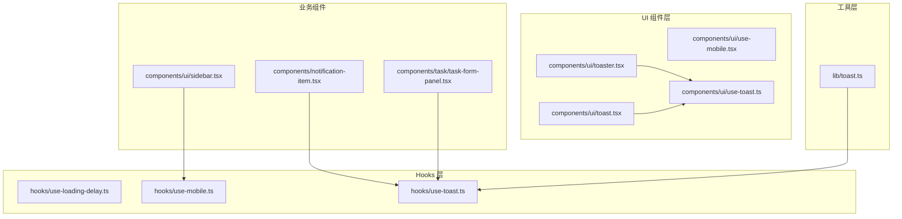
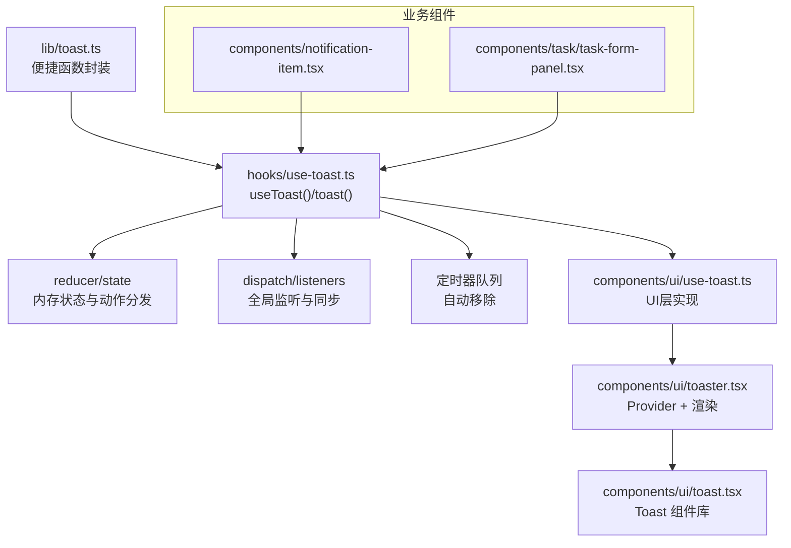
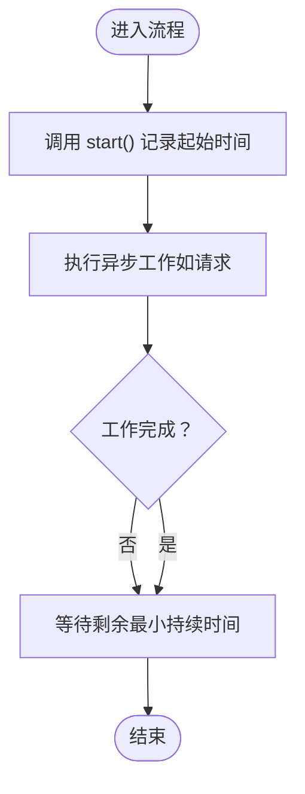
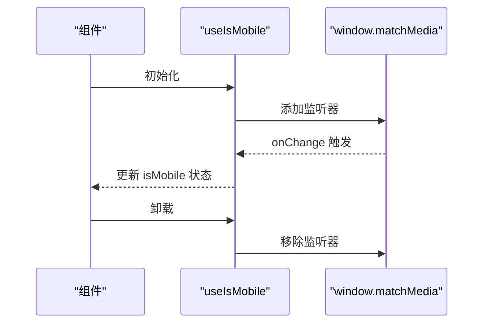
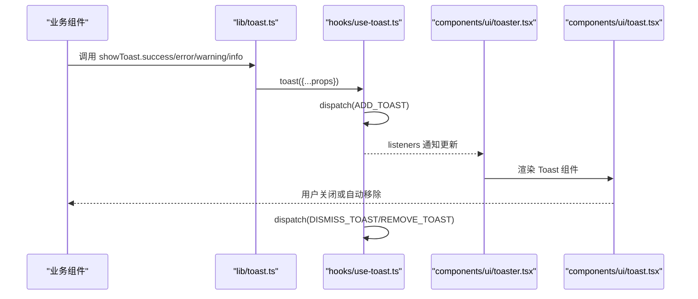
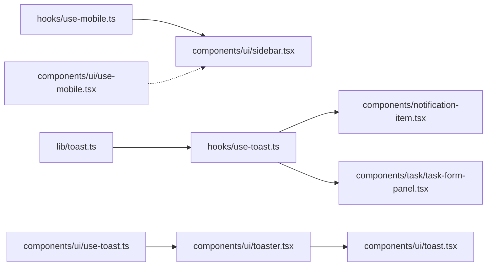

# 自定义Hook开发

<cite>
**本文引用的文件**
- [hooks/use-loading-delay.ts](file://hooks/use-loading-delay.ts)
- [hooks/use-mobile.ts](file://hooks/use-mobile.ts)
- [hooks/use-toast.ts](file://hooks/use-toast.ts)
- [components/ui/use-mobile.tsx](file://components/ui/use-mobile.tsx)
- [components/ui/use-toast.ts](file://components/ui/use-toast.ts)
- [components/ui/toaster.tsx](file://components/ui/toaster.tsx)
- [components/ui/toast.tsx](file://components/ui/toast.tsx)
- [components/ui/sidebar.tsx](file://components/ui/sidebar.tsx)
- [components/notification-item.tsx](file://components/notification-item.tsx)
- [components/task/task-form-panel.tsx](file://components/task/task-form-panel.tsx)
- [lib/toast.ts](file://lib/toast.ts)
</cite>

## 目录
1. [简介](#简介)
2. [项目结构](#项目结构)
3. [核心组件](#核心组件)
4. [架构总览](#架构总览)
5. [详细组件分析](#详细组件分析)
6. [依赖关系分析](#依赖关系分析)
7. [性能考量](#性能考量)
8. [故障排查指南](#故障排查指南)
9. [结论](#结论)
10. [附录：Hook开发模板与最佳实践](#附录hook开发模板与最佳实践)

## 简介
本指南面向日历任务管理系统的前端开发者，系统性讲解自定义Hook的设计与实现方法，重点覆盖以下三个Hook：
- useLoadingDelay：确保加载态至少维持指定时长，避免闪烁与抖动
- useIsMobile：响应式移动端检测，支持窗口尺寸变化监听
- useToast/useToast（UI层）：全局轻提示系统，支持多类型提示、自动移除与状态同步

文档将从架构、数据流、生命周期、副作用处理、组合使用、性能优化与内存泄漏防护等方面进行深入剖析，并提供创建新Hook的模板、测试策略与文档规范。

## 项目结构
本项目采用按功能分层的目录组织方式，自定义Hook位于 hooks 目录；UI层Toast组件位于 components/ui 目录；业务组件通过 hooks/use-toast.ts 或 lib/toast.ts 使用提示能力；移动端检测在 hooks/use-mobile.ts 与 components/ui/use-mobile.tsx 中分别提供。

图表来源
- [hooks/use-loading-delay.ts](file://hooks/use-loading-delay.ts#L1-L28)
- [hooks/use-mobile.ts](file://hooks/use-mobile.ts#L1-L20)
- [hooks/use-toast.ts](file://hooks/use-toast.ts#L1-L192)
- [components/ui/use-mobile.tsx](file://components/ui/use-mobile.tsx#L1-L20)
- [components/ui/use-toast.ts](file://components/ui/use-toast.ts#L1-L192)
- [components/ui/toaster.tsx](file://components/ui/toaster.tsx#L1-L52)
- [components/ui/toast.tsx](file://components/ui/toast.tsx#L1-L133)
- [components/ui/sidebar.tsx](file://components/ui/sidebar.tsx#L1-L200)
- [components/notification-item.tsx](file://components/notification-item.tsx#L1-L200)
- [components/task/task-form-panel.tsx](file://components/task/task-form-panel.tsx#L1-L200)
- [lib/toast.ts](file://lib/toast.ts#L1-L34)

章节来源
- [hooks/use-loading-delay.ts](file://hooks/use-loading-delay.ts#L1-L28)
- [hooks/use-mobile.ts](file://hooks/use-mobile.ts#L1-L20)
- [hooks/use-toast.ts](file://hooks/use-toast.ts#L1-L192)
- [components/ui/use-mobile.tsx](file://components/ui/use-mobile.tsx#L1-L20)
- [components/ui/use-toast.ts](file://components/ui/use-toast.ts#L1-L192)
- [components/ui/toaster.tsx](file://components/ui/toaster.tsx#L1-L52)
- [components/ui/toast.tsx](file://components/ui/toast.tsx#L1-L133)
- [components/ui/sidebar.tsx](file://components/ui/sidebar.tsx#L1-L200)
- [components/notification-item.tsx](file://components/notification-item.tsx#L1-L200)
- [components/task/task-form-panel.tsx](file://components/task/task-form-panel.tsx#L1-L200)
- [lib/toast.ts](file://lib/toast.ts#L1-L34)

## 核心组件
本节对三个关键Hook进行功能、实现原理与使用场景的系统化说明。

- useLoadingDelay
  - 功能：确保加载态至少持续指定时长，避免因请求过快导致的闪烁与抖动
  - 实现要点：记录起始时间，计算剩余时间，必要时等待至最小持续时间
  - 典型使用：表单提交、数据拉取等异步流程的加载态控制
  - 生命周期：无外部订阅，仅在调用方控制 start 与 waitForMinDuration 的时机
  - 副作用：内部无副作用，返回纯函数对象，避免内存泄漏风险

- useIsMobile
  - 功能：检测是否为移动端，支持窗口尺寸变化监听
  - 实现要点：使用媒体查询监听器，变更时更新状态；组件卸载时移除监听
  - 典型使用：侧边栏在移动端以抽屉形式展示、布局切换
  - 生命周期：挂载时注册监听，卸载时清理；初始值可能为 undefined，需在渲染层做容错
  - 副作用：存在 DOM 监听器，必须在 useEffect 清理函数中移除

- useToast/useToast（UI层）
  - 功能：全局轻提示系统，支持添加、更新、关闭与自动移除
  - 实现要点：基于 Redux 风格的 reducer 管理状态，dispatch 分发动作，多个监听者同步更新
  - 典型使用：表单校验失败、操作成功/失败反馈、批量操作提示
  - 生命周期：useToast 订阅全局状态，组件卸载时移除监听；定时器通过 Map 跟踪并在移除时清理
  - 副作用：定时器队列与全局监听器，需在清理阶段释放

章节来源
- [hooks/use-loading-delay.ts](file://hooks/use-loading-delay.ts#L1-L28)
- [hooks/use-mobile.ts](file://hooks/use-mobile.ts#L1-L20)
- [hooks/use-toast.ts](file://hooks/use-toast.ts#L1-L192)
- [components/ui/use-mobile.tsx](file://components/ui/use-mobile.tsx#L1-L20)
- [components/ui/use-toast.ts](file://components/ui/use-toast.ts#L1-L192)

## 架构总览
下图展示了 Toast 子系统的整体架构：lib/toast.ts 提供便捷入口，hooks/use-toast.ts 提供 Hook 能力，components/ui/use-toast.ts 与 components/ui/toaster.tsx 提供 UI 组件与 Provider 包装。

图表来源
- [lib/toast.ts](file://lib/toast.ts#L1-L34)
- [hooks/use-toast.ts](file://hooks/use-toast.ts#L1-L192)
- [components/ui/use-toast.ts](file://components/ui/use-toast.ts#L1-L192)
- [components/ui/toaster.tsx](file://components/ui/toaster.tsx#L1-L52)
- [components/ui/toast.tsx](file://components/ui/toast.tsx#L1-L133)
- [components/notification-item.tsx](file://components/notification-item.tsx#L1-L200)
- [components/task/task-form-panel.tsx](file://components/task/task-form-panel.tsx#L1-L200)

## 详细组件分析

### useLoadingDelay：加载态最小持续时间保障
- 设计目标：避免“闪一下就消失”的加载态，提升用户体验
- 关键点
  - 记录起始时间，计算剩余时间，必要时阻塞等待
  - 返回 start 与 waitForMinDuration 两个函数，调用方决定何时开始与结束
  - 默认最小持续时间可配置
- 使用建议
  - 在提交前调用 start，在提交完成后调用 waitForMinDuration
  - 与异步流程配合，确保 UI 状态稳定过渡

图表来源
- [hooks/use-loading-delay.ts](file://hooks/use-loading-delay.ts#L1-L28)

章节来源
- [hooks/use-loading-delay.ts](file://hooks/use-loading-delay.ts#L1-L28)

### useIsMobile：移动端检测与响应式布局
- 设计目标：根据窗口宽度判断是否移动端，支持动态变化
- 关键点
  - 使用媒体查询监听器，变更时更新状态
  - 初始值可能为 undefined，需在渲染层做容错处理
  - 卸载时移除监听，防止内存泄漏
- 使用建议
  - 在布局组件中作为条件渲染依据
  - 与 UI 抽屉、折叠面板等组件配合

图表来源
- [hooks/use-mobile.ts](file://hooks/use-mobile.ts#L1-L20)
- [components/ui/use-mobile.tsx](file://components/ui/use-mobile.tsx#L1-L20)

章节来源
- [hooks/use-mobile.ts](file://hooks/use-mobile.ts#L1-L20)
- [components/ui/use-mobile.tsx](file://components/ui/use-mobile.tsx#L1-L20)
- [components/ui/sidebar.tsx](file://components/ui/sidebar.tsx#L1-L200)

### useToast/useToast（UI层）：全局轻提示系统
- 设计目标：提供统一的提示入口，支持多种类型与自动移除
- 关键点
  - 内存状态 + reducer 管理提示队列，限制最大数量
  - 通过 listeners 同步到多个订阅者
  - 定时器队列按 id 管理自动移除
- 使用建议
  - 业务组件通过 hooks/use-toast.ts 获取 toast 方法
  - 可通过 lib/toast.ts 封装统一的成功/失败提示
  - UI 层通过 components/ui/toaster.tsx 渲染提示

图表来源
- [lib/toast.ts](file://lib/toast.ts#L1-L34)
- [hooks/use-toast.ts](file://hooks/use-toast.ts#L1-L192)
- [components/ui/toaster.tsx](file://components/ui/toaster.tsx#L1-L52)
- [components/ui/toast.tsx](file://components/ui/toast.tsx#L1-L133)
- [components/notification-item.tsx](file://components/notification-item.tsx#L1-L200)
- [components/task/task-form-panel.tsx](file://components/task/task-form-panel.tsx#L1-L200)

章节来源
- [lib/toast.ts](file://lib/toast.ts#L1-L34)
- [hooks/use-toast.ts](file://hooks/use-toast.ts#L1-L192)
- [components/ui/use-toast.ts](file://components/ui/use-toast.ts#L1-L192)
- [components/ui/toaster.tsx](file://components/ui/toaster.tsx#L1-L52)
- [components/ui/toast.tsx](file://components/ui/toast.tsx#L1-L133)
- [components/notification-item.tsx](file://components/notification-item.tsx#L1-L200)
- [components/task/task-form-panel.tsx](file://components/task/task-form-panel.tsx#L1-L200)

## 依赖关系分析
- useIsMobile 与 use-mobile.tsx 提供相同能力，但命名空间不同，注意避免重复引入
- useToast 与 UI 层实现解耦：hooks/use-toast.ts 提供逻辑，components/ui/use-toast.ts 与 components/ui/toaster.tsx 提供 UI 包装
- lib/toast.ts 作为业务层便捷入口，统一调用 hooks/use-toast.ts 的 toast 方法

图表来源
- [hooks/use-mobile.ts](file://hooks/use-mobile.ts#L1-L20)
- [components/ui/use-mobile.tsx](file://components/ui/use-mobile.tsx#L1-L20)
- [components/ui/sidebar.tsx](file://components/ui/sidebar.tsx#L1-L200)
- [hooks/use-toast.ts](file://hooks/use-toast.ts#L1-L192)
- [components/notification-item.tsx](file://components/notification-item.tsx#L1-L200)
- [components/task/task-form-panel.tsx](file://components/task/task-form-panel.tsx#L1-L200)
- [lib/toast.ts](file://lib/toast.ts#L1-L34)
- [components/ui/use-toast.ts](file://components/ui/use-toast.ts#L1-L192)
- [components/ui/toaster.tsx](file://components/ui/toaster.tsx#L1-L52)
- [components/ui/toast.tsx](file://components/ui/toast.tsx#L1-L133)

章节来源
- [hooks/use-mobile.ts](file://hooks/use-mobile.ts#L1-L20)
- [components/ui/use-mobile.tsx](file://components/ui/use-mobile.tsx#L1-L20)
- [components/ui/sidebar.tsx](file://components/ui/sidebar.tsx#L1-L200)
- [hooks/use-toast.ts](file://hooks/use-toast.ts#L1-L192)
- [components/notification-item.tsx](file://components/notification-item.tsx#L1-L200)
- [components/task/task-form-panel.tsx](file://components/task/task-form-panel.tsx#L1-L200)
- [lib/toast.ts](file://lib/toast.ts#L1-L34)
- [components/ui/use-toast.ts](file://components/ui/use-toast.ts#L1-L192)
- [components/ui/toaster.tsx](file://components/ui/toaster.tsx#L1-L52)
- [components/ui/toast.tsx](file://components/ui/toast.tsx#L1-L133)

## 性能考量
- useLoadingDelay
  - 时间复杂度：O(1)，等待时间不超过 minDuration
  - 优化建议：合理设置最小持续时间，避免过长导致交互迟滞
- useIsMobile
  - 监听器只在挂载时注册一次，卸载时清理
  - 优化建议：避免在渲染期间频繁读取 window，可在 useEffect 中缓存
- useToast
  - 内存状态与 listeners 数组常驻，定时器队列按 id 管理
  - 优化建议：限制提示数量、及时 dismiss，避免大量定时器堆积

[本节为通用指导，不直接分析具体文件]

## 故障排查指南
- useIsMobile 未更新
  - 检查是否正确在 useEffect 清理阶段移除监听
  - 确认初始值为 undefined 的渲染容错
- useToast 无法显示或重复出现
  - 检查 TOAST_LIMIT 与 TOAST_REMOVE_DELAY 设置
  - 确认 listeners 是否被正确移除，定时器是否被清理
- lib/toast.ts 未生效
  - 确认是否正确导入 hooks/use-toast.ts 的 toast 函数
  - 检查 UI 层 Toaster 是否包裹在应用根部

章节来源
- [hooks/use-mobile.ts](file://hooks/use-mobile.ts#L1-L20)
- [hooks/use-toast.ts](file://hooks/use-toast.ts#L1-L192)
- [lib/toast.ts](file://lib/toast.ts#L1-L34)
- [components/ui/toaster.tsx](file://components/ui/toaster.tsx#L1-L52)

## 结论
本指南系统梳理了日历任务管理系统的三个关键自定义Hook：useLoadingDelay、useIsMobile 与 useToast。通过明确的功能边界、生命周期管理与副作用处理策略，开发者可以构建可复用、可维护且高性能的Hook。建议在实际开发中遵循本文提供的最佳实践与模板，确保Hook的稳定性与可扩展性。

[本节为总结性内容，不直接分析具体文件]

## 附录：Hook开发模板与最佳实践
- 创建新Hook的步骤
  - 明确职责：单一职责，避免跨域副作用
  - 设计签名：参数尽量简单，返回值清晰
  - 生命周期：在 useEffect 中注册/清理副作用
  - 副作用隔离：DOM、定时器、订阅等均需清理
  - 性能优化：避免不必要的重渲染，使用 useCallback/memo
  - 测试策略：单元测试关注状态变化与副作用清理；集成测试验证与组件协作
  - 文档规范：说明用途、参数、返回值、注意事项与典型用法
- Hook 组合使用
  - 将 useIsMobile 与 UI 抽屉组合，实现移动端适配
  - 将 useLoadingDelay 与 useToast 组合，先保证加载态稳定再反馈结果
- 内存泄漏防护
  - 所有 DOM 监听器、定时器、订阅均需在清理函数中释放
  - 对于全局状态订阅，确保在组件卸载时移除监听

[本节为通用指导，不直接分析具体文件]