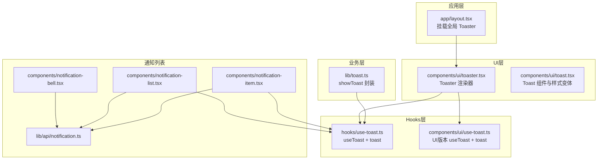
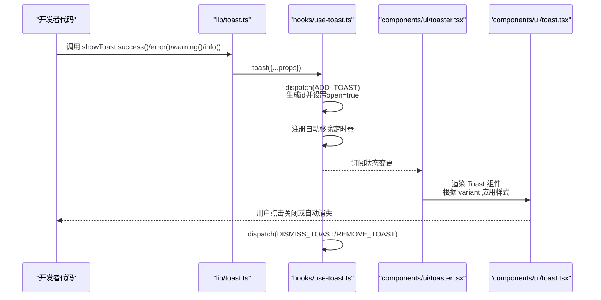
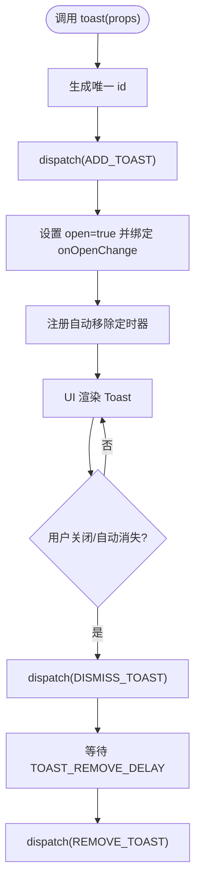
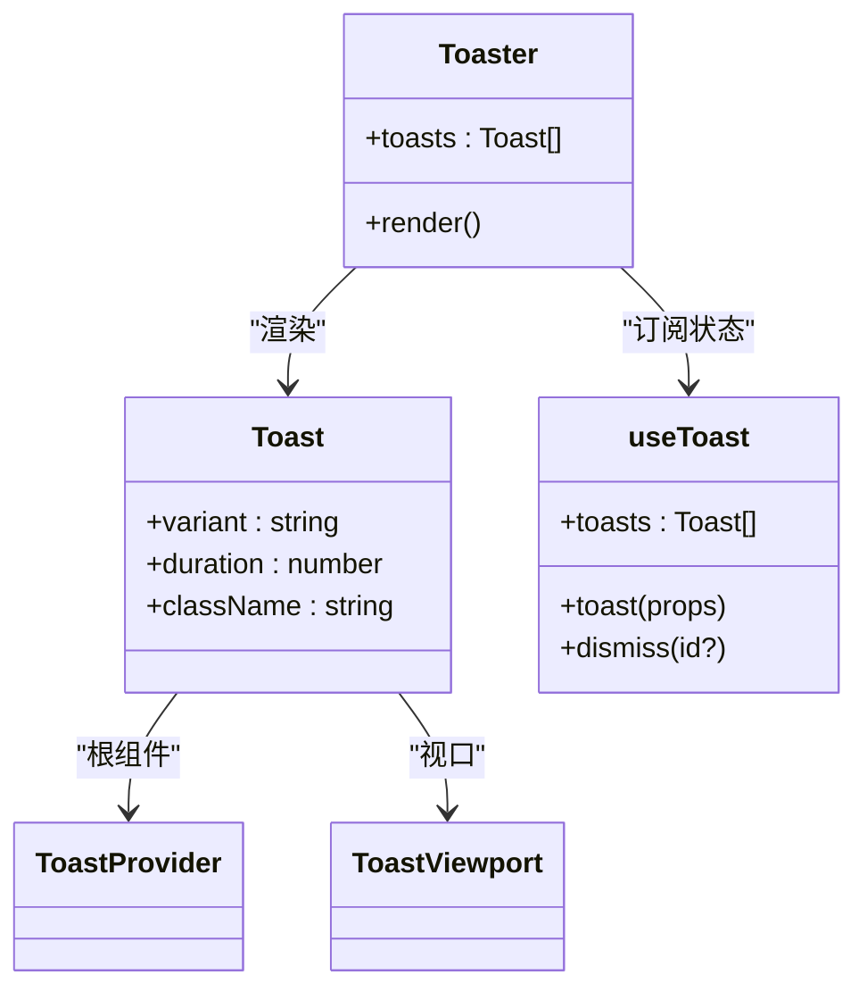
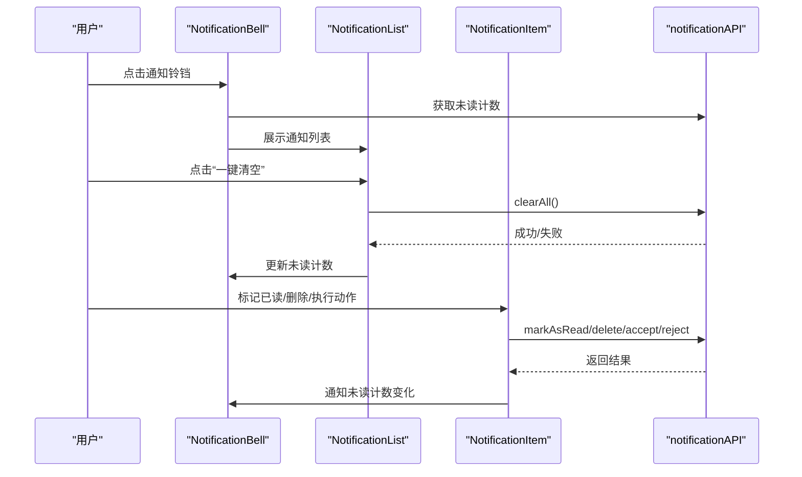
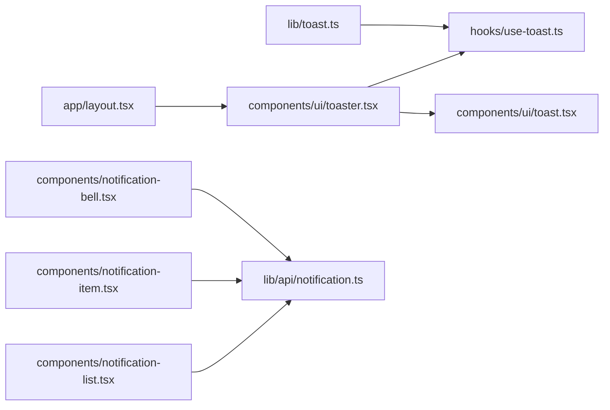

# 通知Hook

<cite>
**本文档引用的文件**
- [hooks/use-toast.ts](file://hooks/use-toast.ts)
- [components/ui/use-toast.ts](file://components/ui/use-toast.ts)
- [lib/toast.ts](file://lib/toast.ts)
- [components/ui/toaster.tsx](file://components/ui/toaster.tsx)
- [components/ui/toast.tsx](file://components/ui/toast.tsx)
- [components/notification-bell.tsx](file://components/notification-bell.tsx)
- [components/notification-list.tsx](file://components/notification-list.tsx)
- [components/notification-item.tsx](file://components/notification-item.tsx)
- [lib/api/notification.ts](file://lib/api/notification.ts)
- [app/layout.tsx](file://app/layout.tsx)
- [NOTIFICATION_SYSTEM.md](file://NOTIFICATION_SYSTEM.md)
</cite>

## 目录
1. [简介](#简介)
2. [项目结构](#项目结构)
3. [核心组件](#核心组件)
4. [架构总览](#架构总览)
5. [组件详细分析](#组件详细分析)
6. [依赖关系分析](#依赖关系分析)
7. [性能考量](#性能考量)
8. [故障排查指南](#故障排查指南)
9. [结论](#结论)
10. [附录](#附录)

## 简介
本指南面向开发者，系统讲解通知系统Hook的使用与最佳实践，重点覆盖以下方面：
- useToast Hook的通知管理、消息展示与用户交互机制
- 不同类型通知的创建、更新与销毁流程
- 通知队列管理、自动消失与手动关闭策略
- 通知样式定制、位置配置与动画效果
- 结合UI组件与全局Toaster的统一通知解决方案

本通知体系同时包含两类：
- 应用内即时反馈通知（基于Radix Toast的轻量提示）
- 后台站内消息通知（基于数据库的持久化消息列表）

本指南将分别说明这两类通知的实现与使用方式。

## 项目结构
通知系统涉及以下关键文件与职责划分：
- Hooks层：提供通知状态管理与调度（应用内即时反馈）
- UI层：提供Toast容器、Toast组件与Toaster渲染器
- 业务层：提供统一的showToast便捷函数
- 通知列表：提供通知铃铛、列表与单项组件（站内消息）
- API层：提供通知相关的REST接口封装

图表来源
- [app/layout.tsx](file://app/layout.tsx#L1-L45)
- [hooks/use-toast.ts](file://hooks/use-toast.ts#L1-L192)
- [components/ui/use-toast.ts](file://components/ui/use-toast.ts#L1-L192)
- [components/ui/toaster.tsx](file://components/ui/toaster.tsx#L1-L53)
- [components/ui/toast.tsx](file://components/ui/toast.tsx#L1-L134)
- [lib/toast.ts](file://lib/toast.ts#L1-L35)
- [components/notification-bell.tsx](file://components/notification-bell.tsx#L1-L76)
- [components/notification-list.tsx](file://components/notification-list.tsx#L1-L177)
- [components/notification-item.tsx](file://components/notification-item.tsx#L1-L364)
- [lib/api/notification.ts](file://lib/api/notification.ts#L1-L70)

章节来源
- [app/layout.tsx](file://app/layout.tsx#L1-L45)
- [hooks/use-toast.ts](file://hooks/use-toast.ts#L1-L192)
- [components/ui/use-toast.ts](file://components/ui/use-toast.ts#L1-L192)
- [components/ui/toaster.tsx](file://components/ui/toaster.tsx#L1-L53)
- [components/ui/toast.tsx](file://components/ui/toast.tsx#L1-L134)
- [lib/toast.ts](file://lib/toast.ts#L1-L35)
- [components/notification-bell.tsx](file://components/notification-bell.tsx#L1-L76)
- [components/notification-list.tsx](file://components/notification-list.tsx#L1-L177)
- [components/notification-item.tsx](file://components/notification-item.tsx#L1-L364)
- [lib/api/notification.ts](file://lib/api/notification.ts#L1-L70)

## 核心组件
本节聚焦“应用内即时反馈通知”（Toast）的Hook与UI组件，涵盖：
- useToast/useToast（UI版）：提供状态订阅、toast创建、dismiss与update能力
- toast.tsx/toaster.tsx：提供Toast容器、Toast组件与样式变体
- lib/toast.ts：提供success/error/warning/info等便捷调用

关键要点：
- 通知队列上限与移除延迟：通过常量控制最多保留数量与自动消失时间
- 通知生命周期：添加、更新、手动关闭、自动移除
- 样式与动画：基于Radix UI与CVA，支持多种变体与滑入/淡出动画

章节来源
- [hooks/use-toast.ts](file://hooks/use-toast.ts#L1-L192)
- [components/ui/use-toast.ts](file://components/ui/use-toast.ts#L1-L192)
- [components/ui/toaster.tsx](file://components/ui/toaster.tsx#L1-L53)
- [components/ui/toast.tsx](file://components/ui/toast.tsx#L1-L134)
- [lib/toast.ts](file://lib/toast.ts#L1-L35)

## 架构总览
下图展示了“应用内即时反馈通知”的端到端流程：从调用toast到UI渲染与自动消失。

图表来源
- [lib/toast.ts](file://lib/toast.ts#L1-L35)
- [hooks/use-toast.ts](file://hooks/use-toast.ts#L140-L169)
- [components/ui/toaster.tsx](file://components/ui/toaster.tsx#L14-L52)
- [components/ui/toast.tsx](file://components/ui/toast.tsx#L27-L45)

## 组件详细分析

### useToast Hook（应用内即时反馈）
- 提供状态订阅：useToast返回当前toasts数组与toast/dismiss方法
- 通知创建：toast(props)会生成唯一id、设置open为true，并在onOpenChange回调中自动dismiss
- 通知更新：toast.update({...})通过dispatch(UPDATE_TOAST)更新指定id的通知
- 通知移除：toast.dismiss()或全局dismiss()触发DISMISS_TOAST，随后按延迟自动REMOVE_TOAST
- 队列管理：ADD_TOAST时仅保留TOAST_LIMIT条记录，确保UI不拥挤

图表来源
- [hooks/use-toast.ts](file://hooks/use-toast.ts#L56-L72)
- [hooks/use-toast.ts](file://hooks/use-toast.ts#L74-L127)
- [hooks/use-toast.ts](file://hooks/use-toast.ts#L140-L169)

章节来源
- [hooks/use-toast.ts](file://hooks/use-toast.ts#L1-L192)

### UI Toast组件与Toaster渲染器
- Toaster：订阅useToast状态，遍历toasts并渲染Toast，内置图标映射与视口布局
- Toast：基于Radix UI，支持多种变体（default/destructive/success/warning），内置动画类
- 视口定位：固定在右上角，支持sm:bottom-0/sm:right-0/sm:top-auto等响应式定位

图表来源
- [components/ui/toaster.tsx](file://components/ui/toaster.tsx#L14-L52)
- [components/ui/toast.tsx](file://components/ui/toast.tsx#L10-L25)
- [components/ui/toast.tsx](file://components/ui/toast.tsx#L27-L45)
- [hooks/use-toast.ts](file://hooks/use-toast.ts#L171-L189)

章节来源
- [components/ui/toaster.tsx](file://components/ui/toaster.tsx#L1-L53)
- [components/ui/toast.tsx](file://components/ui/toast.tsx#L1-L134)
- [hooks/use-toast.ts](file://hooks/use-toast.ts#L1-L192)

### showToast 便捷函数
- 提供success/error/warning/info四个快捷入口，内部统一调用toast
- 适合在业务层快速展示反馈，避免重复传入variant与title/description

章节来源
- [lib/toast.ts](file://lib/toast.ts#L1-L35)

### 站内消息通知（通知列表）
- NotificationBell：显示未读计数徽章，打开下拉菜单展示通知列表
- NotificationList：加载通知列表，支持一键清空、标记已读、删除
- NotificationItem：渲染单条通知，根据类型显示不同图标与动作按钮（同意/拒绝/接受邀请/删除）
- API封装：notificationAPI提供获取列表、未读数、标记已读、清空等接口

图表来源
- [components/notification-bell.tsx](file://components/notification-bell.tsx#L16-L75)
- [components/notification-list.tsx](file://components/notification-list.tsx#L17-L177)
- [components/notification-item.tsx](file://components/notification-item.tsx#L30-L364)
- [lib/api/notification.ts](file://lib/api/notification.ts#L20-L70)

章节来源
- [components/notification-bell.tsx](file://components/notification-bell.tsx#L1-L76)
- [components/notification-list.tsx](file://components/notification-list.tsx#L1-L177)
- [components/notification-item.tsx](file://components/notification-item.tsx#L1-L364)
- [lib/api/notification.ts](file://lib/api/notification.ts#L1-L70)
- [NOTIFICATION_SYSTEM.md](file://NOTIFICATION_SYSTEM.md#L1-L200)

## 依赖关系分析
- 全局挂载：app/layout.tsx引入Toaster，确保整站可用Toast
- 组件依赖：Toaster依赖hooks/use-toast.ts；Toast依赖components/ui/toast.tsx
- 业务依赖：lib/toast.ts依赖hooks/use-toast.ts；通知列表组件依赖lib/api/notification.ts
- 通知类型：NOTIFICATION_SYSTEM.md定义了通知类型与元数据结构，支撑前端渲染与交互

图表来源
- [app/layout.tsx](file://app/layout.tsx#L1-L45)
- [components/ui/toaster.tsx](file://components/ui/toaster.tsx#L1-L53)
- [hooks/use-toast.ts](file://hooks/use-toast.ts#L1-L192)
- [components/ui/toast.tsx](file://components/ui/toast.tsx#L1-L134)
- [lib/toast.ts](file://lib/toast.ts#L1-L35)
- [components/notification-list.tsx](file://components/notification-list.tsx#L1-L177)
- [components/notification-item.tsx](file://components/notification-item.tsx#L1-L364)
- [components/notification-bell.tsx](file://components/notification-bell.tsx#L1-L76)
- [lib/api/notification.ts](file://lib/api/notification.ts#L1-L70)

章节来源
- [app/layout.tsx](file://app/layout.tsx#L1-L45)
- [components/ui/toaster.tsx](file://components/ui/toaster.tsx#L1-L53)
- [hooks/use-toast.ts](file://hooks/use-toast.ts#L1-L192)
- [components/ui/toast.tsx](file://components/ui/toast.tsx#L1-L134)
- [lib/toast.ts](file://lib/toast.ts#L1-L35)
- [components/notification-list.tsx](file://components/notification-list.tsx#L1-L177)
- [components/notification-item.tsx](file://components/notification-item.tsx#L1-L364)
- [components/notification-bell.tsx](file://components/notification-bell.tsx#L1-L76)
- [lib/api/notification.ts](file://lib/api/notification.ts#L1-L70)

## 性能考量
- 队列长度与移除延迟：通过TOAST_LIMIT与TOAST_REMOVE_DELAY控制内存占用与渲染压力
- 自动移除：使用Map维护每个toast的定时器，避免重复注册与泄漏
- UI渲染：Toaster仅渲染最新N条通知，Toast使用CSS动画而非复杂JS动画
- 通知列表：分页/限制数量（参考NOTIFICATION_SYSTEM.md中的查询限制建议），避免一次性加载过多数据

章节来源
- [hooks/use-toast.ts](file://hooks/use-toast.ts#L8-L9)
- [hooks/use-toast.ts](file://hooks/use-toast.ts#L56-L72)
- [components/ui/toaster.tsx](file://components/ui/toaster.tsx#L14-L52)
- [NOTIFICATION_SYSTEM.md](file://NOTIFICATION_SYSTEM.md#L641-L659)

## 故障排查指南
- Toast不显示
  - 确认已在根布局挂载Toaster
  - 检查useToast是否正确导入与使用
- Toast立即消失
  - 检查onOpenChange回调是否被意外触发
  - 确认TOAST_REMOVE_DELAY是否过小
- 无法手动关闭
  - 确认toast.dismiss()或全局dismiss()是否被调用
  - 检查DISMISS_TOAST/REMOVE_TOAST分支逻辑
- 通知列表异常
  - 检查notificationAPI接口调用是否成功
  - 确认未读计数计算逻辑与UI联动

章节来源
- [app/layout.tsx](file://app/layout.tsx#L37-L40)
- [hooks/use-toast.ts](file://hooks/use-toast.ts#L90-L127)
- [components/notification-list.tsx](file://components/notification-list.tsx#L44-L100)
- [lib/api/notification.ts](file://lib/api/notification.ts#L20-L70)

## 结论
本通知系统提供了两套完整方案：
- 应用内即时反馈：以useToast为核心，配合Toaster与Toast组件，实现轻量、可控、可定制的提示体验
- 站内消息通知：以通知列表组件与API封装为基础，支持未读统计、批量操作与丰富交互

通过统一的Hook与UI组件，开发者可以快速集成一致的通知体验，并依据业务场景灵活选择合适的展示方式。

## 附录

### 使用清单（应用内即时反馈）
- 在根布局挂载Toaster
- 通过lib/toast.ts的便捷函数或直接调用useToast/toast创建通知
- 使用toast.update()动态更新内容，使用toast.dismiss()手动关闭
- 根据需要调整样式变体与动画时长

章节来源
- [app/layout.tsx](file://app/layout.tsx#L37-L40)
- [lib/toast.ts](file://lib/toast.ts#L1-L35)
- [hooks/use-toast.ts](file://hooks/use-toast.ts#L140-L169)

### 使用清单（站内消息通知）
- 在页面中引入NotificationBell/NotificationList
- 通过notificationAPI进行列表获取、未读计数、标记已读与清空
- 在NotificationItem中处理具体动作（同意/拒绝/接受邀请/删除）

章节来源
- [components/notification-bell.tsx](file://components/notification-bell.tsx#L16-L75)
- [components/notification-list.tsx](file://components/notification-list.tsx#L17-L177)
- [components/notification-item.tsx](file://components/notification-item.tsx#L30-L364)
- [lib/api/notification.ts](file://lib/api/notification.ts#L20-L70)