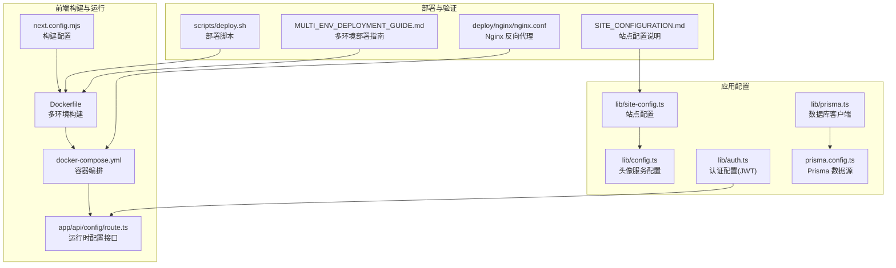
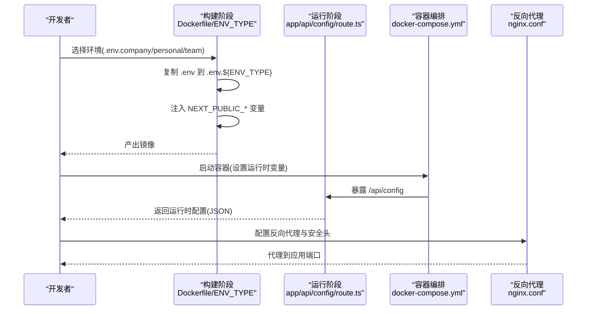
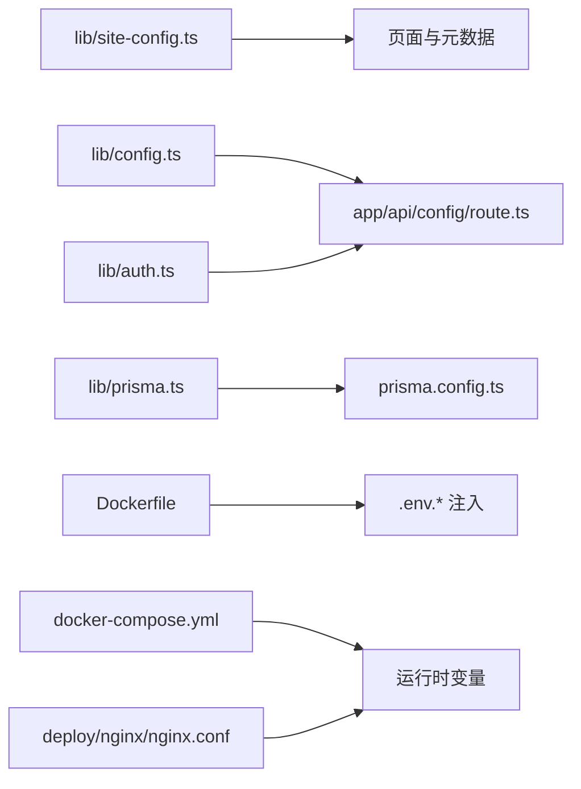

# 配置管理

<cite>
**本文引用的文件**
- [lib/config.ts](file://lib/config.ts)
- [lib/site-config.ts](file://lib/site-config.ts)
- [lib/auth.ts](file://lib/auth.ts)
- [lib/prisma.ts](file://lib/prisma.ts)
- [prisma.config.ts](file://prisma.config.ts)
- [app/api/config/route.ts](file://app/api/config/route.ts)
- [next.config.mjs](file://next.config.mjs)
- [Dockerfile](file://Dockerfile)
- [docker-compose.yml](file://docker-compose.yml)
- [deploy/nginx/nginx.conf](file://deploy/nginx/nginx.conf)
- [scripts/deploy.sh](file://scripts/deploy.sh)
- [SITE_CONFIGURATION.md](file://SITE_CONFIGURATION.md)
- [MULTI_ENV_DEPLOYMENT_GUIDE.md](file://MULTI_ENV_DEPLOYMENT_GUIDE.md)
- [MULTI_ENV_DEPLOYMENT.md](file://MULTI_ENV_DEPLOYMENT.md)
- [QUICK_DEPLOY.md](file://QUICK_DEPLOY.md)
- [package.json](file://package.json)
</cite>

## 目录
1. [简介](#简介)
2. [项目结构](#项目结构)
3. [核心组件](#核心组件)
4. [架构总览](#架构总览)
5. [详细组件分析](#详细组件分析)
6. [依赖关系分析](#依赖关系分析)
7. [性能考量](#性能考量)
8. [故障排查指南](#故障排查指南)
9. [结论](#结论)
10. [附录](#附录)

## 简介
本指南系统阐述日历任务管理系统的配置管理体系，覆盖站点配置、运行时配置与构建配置三类配置的定义、加载顺序与优先级规则；说明环境变量管理策略、配置验证方法与热更新能力；并给出不同环境（开发、Docker、生产）下的配置差异、敏感信息保护与配置加密建议，帮助开发者建立灵活、安全且可维护的配置管理方案。

## 项目结构
围绕配置管理的关键文件分布如下：
- 站点配置：lib/site-config.ts 与 SITE_CONFIGURATION.md
- 运行时配置：lib/auth.ts、lib/prisma.ts、prisma.config.ts、app/api/config/route.ts
- 构建配置：next.config.mjs、Dockerfile、docker-compose.yml、scripts/deploy.sh
- 环境变量与部署：.env.*、MULTI_ENV_DEPLOYMENT_GUIDE.md、MULTI_ENV_DEPLOYMENT.md、QUICK_DEPLOY.md
- Web 服务器：deploy/nginx/nginx.conf

图表来源
- [next.config.mjs](file://next.config.mjs#L1-L20)
- [Dockerfile](file://Dockerfile#L1-L72)
- [docker-compose.yml](file://docker-compose.yml#L1-L77)
- [app/api/config/route.ts](file://app/api/config/route.ts#L1-L11)
- [lib/site-config.ts](file://lib/site-config.ts#L1-L34)
- [lib/config.ts](file://lib/config.ts#L1-L30)
- [lib/auth.ts](file://lib/auth.ts#L1-L78)
- [lib/prisma.ts](file://lib/prisma.ts#L1-L12)
- [prisma.config.ts](file://prisma.config.ts#L1-L14)
- [scripts/deploy.sh](file://scripts/deploy.sh#L1-L56)
- [SITE_CONFIGURATION.md](file://SITE_CONFIGURATION.md#L1-L267)
- [MULTI_ENV_DEPLOYMENT_GUIDE.md](file://MULTI_ENV_DEPLOYMENT_GUIDE.md#L1-L152)
- [deploy/nginx/nginx.conf](file://deploy/nginx/nginx.conf#L1-L114)

章节来源
- [next.config.mjs](file://next.config.mjs#L1-L20)
- [Dockerfile](file://Dockerfile#L1-L72)
- [docker-compose.yml](file://docker-compose.yml#L1-L77)
- [lib/site-config.ts](file://lib/site-config.ts#L1-L34)
- [lib/config.ts](file://lib/config.ts#L1-L30)
- [lib/auth.ts](file://lib/auth.ts#L1-L78)
- [lib/prisma.ts](file://lib/prisma.ts#L1-L12)
- [prisma.config.ts](file://prisma.config.ts#L1-L14)
- [app/api/config/route.ts](file://app/api/config/route.ts#L1-L11)
- [scripts/deploy.sh](file://scripts/deploy.sh#L1-L56)
- [SITE_CONFIGURATION.md](file://SITE_CONFIGURATION.md#L1-L267)
- [MULTI_ENV_DEPLOYMENT_GUIDE.md](file://MULTI_ENV_DEPLOYMENT_GUIDE.md#L1-L152)
- [deploy/nginx/nginx.conf](file://deploy/nginx/nginx.conf#L1-L114)

## 核心组件
- 站点配置（客户端可见）：lib/site-config.ts 从 NEXT_PUBLIC_* 环境变量读取，提供默认值与派生字段（如 SEO 描述、Logo Alt 文本、完整标题），用于页面标题、描述与文案定制。
- 运行时配置（服务端）：app/api/config/route.ts 提供运行时配置接口，当前返回头像服务地址；lib/auth.ts 读取 JWT_SECRET；lib/prisma.ts 依据 NODE_ENV 控制日志级别；prisma.config.ts 通过 dotenv 读取 DATABASE_URL。
- 构建配置：next.config.mjs 控制输出模式、TS 忽略错误、图片优化；Dockerfile 基于 ARG ENV_TYPE 选择 .env.* 并在构建时注入 NEXT_PUBLIC_*；docker-compose.yml 定义运行时环境变量与端口映射。
- 部署与验证：scripts/deploy.sh 自动检查 .env.*、构建镜像、启动容器并验证；MULTI_ENV_DEPLOYMENT_GUIDE.md 与 MULTI_ENV_DEPLOYMENT.md 提供多环境部署流程与差异说明。

章节来源
- [lib/site-config.ts](file://lib/site-config.ts#L1-L34)
- [app/api/config/route.ts](file://app/api/config/route.ts#L1-L11)
- [lib/auth.ts](file://lib/auth.ts#L1-L78)
- [lib/prisma.ts](file://lib/prisma.ts#L1-L12)
- [prisma.config.ts](file://prisma.config.ts#L1-L14)
- [next.config.mjs](file://next.config.mjs#L1-L20)
- [Dockerfile](file://Dockerfile#L1-L72)
- [docker-compose.yml](file://docker-compose.yml#L1-L77)
- [scripts/deploy.sh](file://scripts/deploy.sh#L1-L56)

## 架构总览
下图展示配置在不同阶段的来源与流向：构建期注入 NEXT_PUBLIC_*，运行期通过 API 返回运行时配置，容器与服务器层面通过环境变量与配置文件进行差异化管理。

图表来源
- [Dockerfile](file://Dockerfile#L21-L22)
- [scripts/deploy.sh](file://scripts/deploy.sh#L34-L35)
- [docker-compose.yml](file://docker-compose.yml#L36-L48)
- [app/api/config/route.ts](file://app/api/config/route.ts#L7-L11)
- [deploy/nginx/nginx.conf](file://deploy/nginx/nginx.conf#L42-L57)

## 详细组件分析

### 站点配置（NEXT_PUBLIC_*）
- 来源与默认值：lib/site-config.ts 从 NEXT_PUBLIC_* 环境变量读取，若未设置则采用默认值。
- 派生字段：pageDescription、logoAlt、fullTitle 基于基础字段计算，减少重复配置。
- 使用方式：在组件与 metadata 中直接引用，确保页面标题、描述与文案可按环境定制。
- 验证与故障排查：可通过浏览器控制台或组件打印确认变量是否生效；开发环境自动刷新，生产/容器需重新构建或重启。

章节来源
- [lib/site-config.ts](file://lib/site-config.ts#L1-L34)
- [SITE_CONFIGURATION.md](file://SITE_CONFIGURATION.md#L1-L267)

### 头像服务配置（运行时）
- 配置来源：lib/config.ts 与 app/api/config/route.ts 读取 AVATAR_API_URL；Dockerfile 默认回退到公网 DiceBear API。
- 使用场景：头像 URL 生成与运行时切换头像服务地址。
- 环境差异：开发使用公网 API，内网可指向内网服务地址；Docker 通过环境变量覆盖。

章节来源
- [lib/config.ts](file://lib/config.ts#L1-L30)
- [app/api/config/route.ts](file://app/api/config/route.ts#L1-L11)
- [docker-compose.yml](file://docker-compose.yml#L39-L39)
- [MULTI_ENV_DEPLOYMENT.md](file://MULTI_ENV_DEPLOYMENT.md#L1-L78)

### 认证与安全配置（JWT）
- 密钥来源：lib/auth.ts 从 JWT_SECRET 读取，未设置时使用默认值（生产务必替换）。
- 令牌策略：固定有效期与签名算法；提供密码哈希、校验与 Token 提取工具。
- 安全建议：生产环境必须设置强密钥，避免硬编码；结合 HTTPS 与安全头。

章节来源
- [lib/auth.ts](file://lib/auth.ts#L1-L78)

### 数据库与 Prisma 配置
- 连接字符串：prisma.config.ts 通过 dotenv 读取 DATABASE_URL；lib/prisma.ts 根据 NODE_ENV 控制日志级别。
- 运行时差异：开发环境开启 warn/error 日志，生产仅 error，便于调试与性能平衡。

章节来源
- [prisma.config.ts](file://prisma.config.ts#L1-L14)
- [lib/prisma.ts](file://lib/prisma.ts#L1-L12)

### 构建与运行时配置（Next.js）
- 构建配置：next.config.mjs 控制输出模式（生产 standalone）、TS 忽略错误、图片优化与实验特性。
- 运行时注入：Dockerfile 基于 ARG ENV_TYPE 复制对应 .env.*，使 NEXT_PUBLIC_* 在构建时注入代码。
- 部署脚本：scripts/deploy.sh 自动选择 .env.*、构建镜像、启动容器并验证。

章节来源
- [next.config.mjs](file://next.config.mjs#L1-L20)
- [Dockerfile](file://Dockerfile#L4-L29)
- [scripts/deploy.sh](file://scripts/deploy.sh#L1-L56)

### 多环境部署与配置差异
- 环境文件：.env.company、.env.personal、.env.team 等，分别定义站点配置与运行时变量。
- 部署方式：支持脚本一键部署、手动复制 .env.*、或直接传入 --build-arg ENV_TYPE。
- 运行时变量：DATABASE_URL、JWT_SECRET、NODE_ENV、AVATAR_API_URL 等在容器启动时读取，修改后仅需重启容器。

章节来源
- [MULTI_ENV_DEPLOYMENT_GUIDE.md](file://MULTI_ENV_DEPLOYMENT_GUIDE.md#L1-L152)
- [MULTI_ENV_DEPLOYMENT.md](file://MULTI_ENV_DEPLOYMENT.md#L1-L78)
- [QUICK_DEPLOY.md](file://QUICK_DEPLOY.md#L1-L80)
- [docker-compose.yml](file://docker-compose.yml#L36-L48)

### Web 服务器与反向代理
- Nginx 配置：部署 nginx.conf，启用 HTTPS、安全头、超时与缓存策略，代理到应用端口。
- 与应用交互：通过 proxy_set_header 透传必要头部，确保应用能识别真实协议与来源。

章节来源
- [deploy/nginx/nginx.conf](file://deploy/nginx/nginx.conf#L1-L114)

## 依赖关系分析
- 组件耦合与职责：
  - lib/site-config.ts 与页面层（layout、page、login）解耦，通过 NEXT_PUBLIC_* 注入，降低运行时开销。
  - app/api/config/route.ts 作为运行时配置入口，仅暴露必要变量，避免泄露敏感信息。
  - Dockerfile 与 scripts/deploy.sh 将“环境选择”与“构建注入”解耦，提升灵活性。
- 外部依赖：
  - Next.js 构建与运行时行为受 next.config.mjs 影响。
  - Prisma 通过 dotenv 读取 DATABASE_URL，与 lib/prisma.ts 的日志策略共同影响数据库连接体验。

图表来源
- [lib/site-config.ts](file://lib/site-config.ts#L1-L34)
- [lib/config.ts](file://lib/config.ts#L1-L30)
- [app/api/config/route.ts](file://app/api/config/route.ts#L1-L11)
- [lib/auth.ts](file://lib/auth.ts#L1-L78)
- [lib/prisma.ts](file://lib/prisma.ts#L1-L12)
- [prisma.config.ts](file://prisma.config.ts#L1-L14)
- [Dockerfile](file://Dockerfile#L21-L22)
- [docker-compose.yml](file://docker-compose.yml#L36-L48)
- [deploy/nginx/nginx.conf](file://deploy/nginx/nginx.conf#L42-L57)

章节来源
- [lib/site-config.ts](file://lib/site-config.ts#L1-L34)
- [lib/config.ts](file://lib/config.ts#L1-L30)
- [app/api/config/route.ts](file://app/api/config/route.ts#L1-L11)
- [lib/auth.ts](file://lib/auth.ts#L1-L78)
- [lib/prisma.ts](file://lib/prisma.ts#L1-L12)
- [prisma.config.ts](file://prisma.config.ts#L1-L14)
- [Dockerfile](file://Dockerfile#L1-L72)
- [docker-compose.yml](file://docker-compose.yml#L1-L77)
- [deploy/nginx/nginx.conf](file://deploy/nginx/nginx.conf#L1-L114)

## 性能考量
- 构建时注入 NEXT_PUBLIC_*：减少运行时读取成本，但修改后需重新构建。
- 运行时配置最小化：仅暴露必要变量（如头像服务地址），避免频繁网络请求。
- 日志级别：根据 NODE_ENV 控制数据库日志级别，生产环境仅记录错误，降低 IO 压力。
- 静态资源缓存：Nginx 对静态与图片资源设置缓存头，提升加载速度。

章节来源
- [next.config.mjs](file://next.config.mjs#L6-L11)
- [lib/prisma.ts](file://lib/prisma.ts#L7-L9)
- [deploy/nginx/nginx.conf](file://deploy/nginx/nginx.conf#L60-L71)

## 故障排查指南
- 站点配置未生效
  - 确认 .env.* 是否存在且包含 NEXT_PUBLIC_*；开发环境需重启以触发重新注入。
  - 生产/容器环境需重新构建镜像或清理缓存后重启。
- Docker 部署后配置未生效
  - 检查 docker-compose.yml 的 environment 是否正确；必要时重建镜像并重启容器。
- 运行时配置接口异常
  - 检查 app/api/config/route.ts 返回值与环境变量；确认容器内变量已注入。
- JWT 相关问题
  - 确认 JWT_SECRET 已设置且与服务端一致；避免默认密钥导致签发/校验失败。
- 数据库连接问题
  - 检查 DATABASE_URL 与网络连通性；核对 Prisma schema 与迁移状态。

章节来源
- [scripts/deploy.sh](file://scripts/deploy.sh#L20-L25)
- [docker-compose.yml](file://docker-compose.yml#L36-L48)
- [app/api/config/route.ts](file://app/api/config/route.ts#L7-L11)
- [lib/auth.ts](file://lib/auth.ts#L4-L5)
- [lib/prisma.ts](file://lib/prisma.ts#L7-L9)
- [prisma.config.ts](file://prisma.config.ts#L10-L12)

## 结论
本项目通过“构建时注入 + 运行时接口 + 容器环境变量”的三层配置体系，实现了站点配置的灵活定制、运行时配置的按需暴露以及多环境的快速切换。配合严格的环境变量前缀规范与安全头策略，既保证了易用性，也兼顾了安全性与性能。建议在生产环境中严格管理敏感变量，定期轮换密钥，并通过 CI/CD 管理 .env.* 与镜像版本，确保配置变更可追溯、可审计。

## 附录

### 配置分类与用途
- 站点配置（NEXT_PUBLIC_*）
  - 作用：页面标题、描述、Logo 文案等客户端可见信息。
  - 来源：lib/site-config.ts；构建时注入。
- 运行时配置
  - 作用：头像服务地址、数据库连接、认证密钥等运行期变量。
  - 来源：app/api/config/route.ts、lib/config.ts、lib/auth.ts、lib/prisma.ts、prisma.config.ts。
- 构建配置
  - 作用：控制 Next.js 构建行为、Docker 多环境构建与容器编排。
  - 来源：next.config.mjs、Dockerfile、docker-compose.yml。

章节来源
- [lib/site-config.ts](file://lib/site-config.ts#L1-L34)
- [app/api/config/route.ts](file://app/api/config/route.ts#L1-L11)
- [lib/config.ts](file://lib/config.ts#L1-L30)
- [lib/auth.ts](file://lib/auth.ts#L1-L78)
- [lib/prisma.ts](file://lib/prisma.ts#L1-L12)
- [prisma.config.ts](file://prisma.config.ts#L1-L14)
- [next.config.mjs](file://next.config.mjs#L1-L20)
- [Dockerfile](file://Dockerfile#L1-L72)
- [docker-compose.yml](file://docker-compose.yml#L1-L77)

### 加载顺序与优先级规则
- 构建阶段
  - Dockerfile 基于 ARG ENV_TYPE 选择 .env.* 并复制为 .env，随后注入 NEXT_PUBLIC_*。
  - next.config.mjs 影响构建产物与优化策略。
- 运行阶段
  - app/api/config/route.ts 读取运行时变量并返回给客户端。
  - lib/config.ts 与 lib/auth.ts 读取对应环境变量，提供默认回退。
- 优先级
  - 容器环境变量 > .env.* > 默认值；NEXT_PUBLIC_* 仅在构建时注入，修改后需重新构建。

章节来源
- [Dockerfile](file://Dockerfile#L4-L29)
- [scripts/deploy.sh](file://scripts/deploy.sh#L34-L35)
- [docker-compose.yml](file://docker-compose.yml#L36-L48)
- [app/api/config/route.ts](file://app/api/config/route.ts#L7-L11)
- [lib/config.ts](file://lib/config.ts#L12-L13)
- [lib/auth.ts](file://lib/auth.ts#L4-L5)

### 环境变量管理与安全
- 前缀规范：客户端可见变量必须以 NEXT_PUBLIC_ 开头；敏感变量不应放入 NEXT_PUBLIC_*。
- 安全头：Nginx 配置包含 HSTS、X-Frame-Options、X-Content-Type-Options、X-XSS-Protection 等。
- 加密与密钥轮换：JWT_SECRET 必须强密钥，定期轮换；数据库连接字符串与第三方服务密钥应通过密钥管理服务或环境变量注入。

章节来源
- [SITE_CONFIGURATION.md](file://SITE_CONFIGURATION.md#L165-L187)
- [deploy/nginx/nginx.conf](file://deploy/nginx/nginx.conf#L28-L32)
- [lib/auth.ts](file://lib/auth.ts#L4-L5)

### 配置验证与热更新
- 验证方法
  - 浏览器控制台检查 process.env.NEXT_PUBLIC_*；组件打印 siteConfig；调用 /api/config 获取运行时配置。
- 热更新能力
  - NEXT_PUBLIC_* 需要重新构建；运行时变量（如 AVATAR_API_URL、JWT_SECRET）可在容器重启后生效。
  - 建议通过 CI/CD 自动化构建与发布，确保配置变更可追踪。

章节来源
- [SITE_CONFIGURATION.md](file://SITE_CONFIGURATION.md#L189-L211)
- [app/api/config/route.ts](file://app/api/config/route.ts#L7-L11)
- [scripts/deploy.sh](file://scripts/deploy.sh#L38-L39)