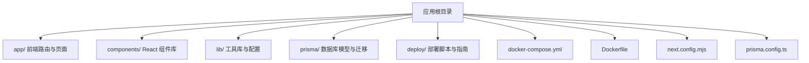
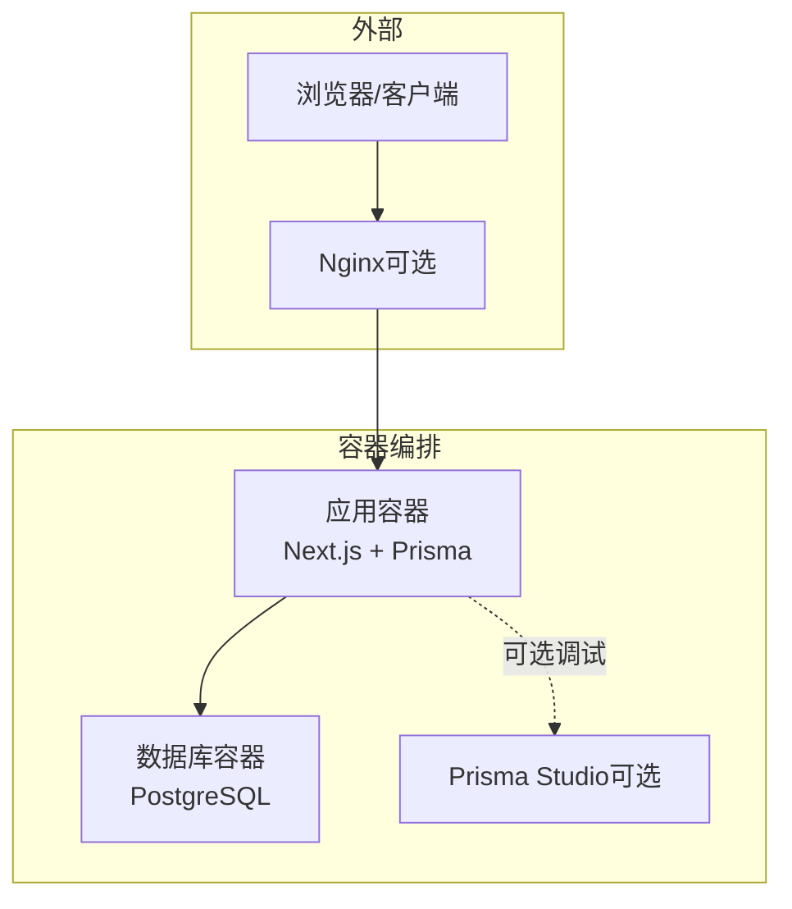
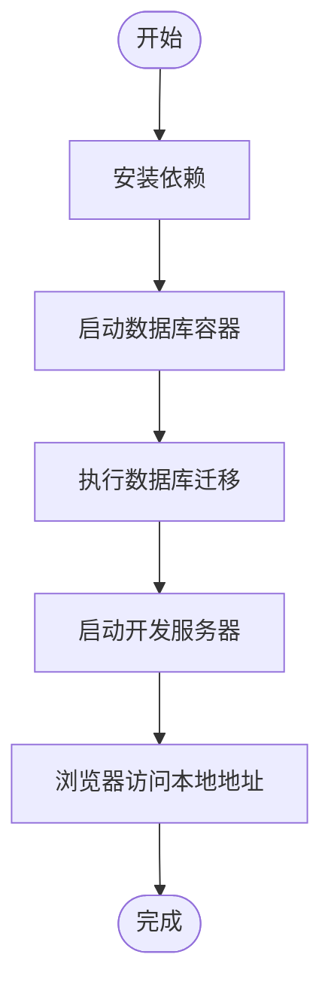
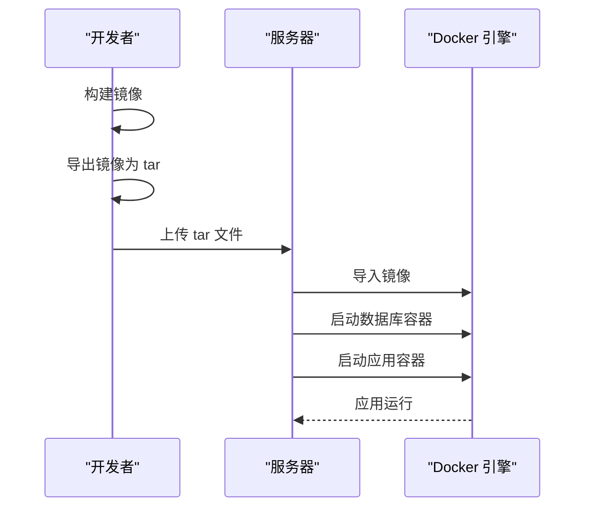
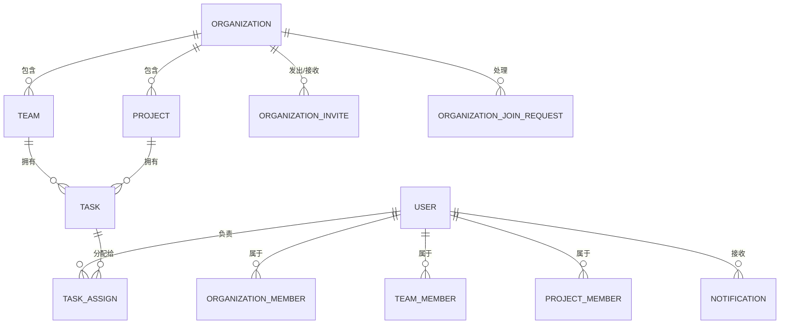
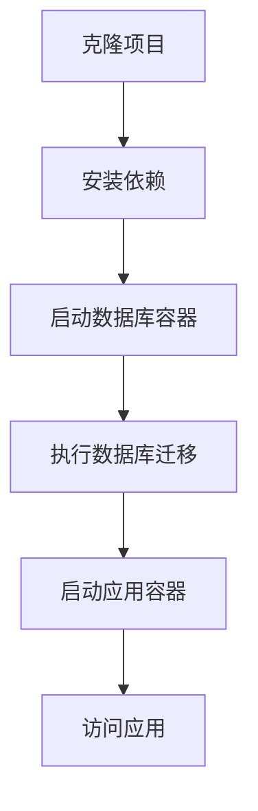

# 快速开始

<cite>
**本文引用的文件**
- [README.md](file://README.md)
- [package.json](file://package.json)
- [Dockerfile](file://Dockerfile)
- [docker-compose.yml](file://docker-compose.yml)
- [prisma/schema.prisma](file://prisma/schema.prisma)
- [next.config.mjs](file://next.config.mjs)
- [prisma.config.ts](file://prisma.config.ts)
- [lib/config.ts](file://lib/config.ts)
- [lib/site-config.ts](file://lib/site-config.ts)
- [deploy/DEPLOYMENT.md](file://deploy/DEPLOYMENT.md)
- [OFFLINE_DEPLOYMENT_GUIDE.md](file://OFFLINE_DEPLOYMENT_GUIDE.md)
- [MANUAL_DOCKER_DEPLOY.md](file://MANUAL_DOCKER_DEPLOY.md)
- [deploy/setup-server.sh](file://deploy/setup-server.sh)
- [deploy/pull-and-deploy.sh](file://deploy/pull-and-deploy.sh)
</cite>

## 目录
1. [简介](#简介)
2. [项目结构](#项目结构)
3. [核心组件](#核心组件)
4. [架构总览](#架构总览)
5. [详细组件分析](#详细组件分析)
6. [依赖分析](#依赖分析)
7. [性能考虑](#性能考虑)
8. [故障排查指南](#故障排查指南)
9. [结论](#结论)
10. [附录](#附录)

## 简介
本指南面向首次接触“日历任务管理系统”的用户，帮助你在最短时间内完成安装与部署，涵盖开发环境搭建、Docker 部署、离线部署等多种方式；并提供系统要求、依赖安装、数据库配置、环境变量设置、启动流程、常见问题排查、端口与网络配置等实用信息。

## 项目结构
该项目基于 Next.js 16 与 React 19，采用 TypeScript，使用 Prisma 管理 PostgreSQL 数据库，通过 Docker 进行容器化部署。前端组件以 App Router 组织，后端 API 路由位于 app/api 下，数据库模型与迁移位于 prisma 目录，部署相关脚本与配置位于 deploy 目录。

图表来源
- [README.md](file://README.md#L139-L166)
- [docker-compose.yml](file://docker-compose.yml#L1-L77)
- [Dockerfile](file://Dockerfile#L1-L72)

章节来源
- [README.md](file://README.md#L139-L166)

## 核心组件
- 前端框架与构建
  - Next.js 16、React 19、TypeScript 5
  - Tailwind CSS 4、Radix UI、Lucide React
- 状态管理与工具
  - Zustand（持久化中间件）、Immer
- 后端与数据库
  - PostgreSQL + Prisma ORM
- 容器化与部署
  - Docker + docker-compose
  - 多种部署方式：Docker 离线部署、手动 Docker 部署、阿里云服务器一键部署脚本

章节来源
- [README.md](file://README.md#L81-L104)
- [package.json](file://package.json#L1-L75)

## 架构总览
系统采用前后端一体化的 Next.js 应用，生产环境通过 Docker 镜像运行，数据库使用 PostgreSQL，Prisma 负责数据模型与迁移。Nginx 作为反向代理（在阿里云部署脚本中配置），容器间通过自定义网络通信。

图表来源
- [docker-compose.yml](file://docker-compose.yml#L3-L77)
- [deploy/setup-server.sh](file://deploy/setup-server.sh#L42-L120)

## 详细组件分析

### 系统要求与前置条件
- 操作系统：Windows/Linux/macOS（建议 Linux 便于 Docker）
- 软件要求
  - Node.js 20（容器内使用）
  - pnpm（包管理器）
  - Docker 与 Docker Compose
  - Git（用于克隆与更新）
- 网络要求
  - 开发环境：本地端口 3000（Next.js 开发服务器）
  - 生产环境：容器端口 3000（应用），5432（PostgreSQL），5555（Prisma Studio，开发环境）

章节来源
- [README.md](file://README.md#L105-L138)
- [docker-compose.yml](file://docker-compose.yml#L13-L14)
- [Dockerfile](file://Dockerfile#L65-L68)

### 开发环境搭建（本地启动）
- 安装依赖
  - 使用 pnpm 安装项目依赖
- 启动数据库（可选：本地已有可跳过）
  - 通过 docker-compose 启动 PostgreSQL
- 数据库迁移
  - 使用 Prisma 迁移命令更新数据库结构
- 启动开发服务器
  - 运行 Next.js 开发服务器
- 访问应用
  - 在浏览器打开本地地址

图表来源
- [README.md](file://README.md#L121-L137)

章节来源
- [README.md](file://README.md#L121-L137)

### Docker 离线部署（推荐）
- 本地构建镜像
  - 使用 Dockerfile 构建镜像并命名为指定版本
- 导出镜像
  - 将镜像保存为 tar 文件
- 上传至服务器
  - 通过 FTP/SCP 上传 tar 文件
- 服务器导入镜像
  - 在服务器上加载 tar 文件为本地镜像
- 执行数据库迁移（如需）
  - 进入容器执行 Prisma 迁移
- 启动服务
  - 使用 docker-compose 启动应用与数据库

图表来源
- [OFFLINE_DEPLOYMENT_GUIDE.md](file://OFFLINE_DEPLOYMENT_GUIDE.md#L18-L41)
- [OFFLINE_DEPLOYMENT_GUIDE.md](file://OFFLINE_DEPLOYMENT_GUIDE.md#L104-L138)
- [OFFLINE_DEPLOYMENT_GUIDE.md](file://OFFLINE_DEPLOYMENT_GUIDE.md#L289-L322)

章节来源
- [OFFLINE_DEPLOYMENT_GUIDE.md](file://OFFLINE_DEPLOYMENT_GUIDE.md#L1-L538)

### 手动 Docker 部署（FTP 上传镜像）
- 本地构建镜像并导出为 tar
- 通过 FTP 客户端上传到服务器指定目录
- 在服务器加载镜像
- 更新 docker-compose.yml 指定镜像版本
- 重启容器并执行数据库迁移（如需）

章节来源
- [MANUAL_DOCKER_DEPLOY.md](file://MANUAL_DOCKER_DEPLOY.md#L1-L121)

### 阿里云服务器一键部署（脚本化）
- 服务器初始化
  - 安装 Docker、Docker Compose、Nginx
  - 配置防火墙与项目目录
- 克隆项目并生成 .env
  - 输入数据库密码，自动生成 JWT 密钥
- 配置 SSL 证书目录
- 配置 Nginx 并重启
- 启动应用容器

章节来源
- [deploy/setup-server.sh](file://deploy/setup-server.sh#L1-L148)
- [deploy/DEPLOYMENT.md](file://deploy/DEPLOYMENT.md#L1-L379)

### 环境变量与配置
- 数据库连接
  - DATABASE_URL：PostgreSQL 连接字符串（生产环境建议使用容器网络域名）
- 应用运行
  - NODE_ENV：生产环境启用 standalone 输出
  - PORT/HOSTNAME：容器内暴露端口与绑定地址
- 头像服务
  - AVATAR_API_URL：头像 API 基础地址（默认公网 DiceBear）
- 站点信息（前端）
  - NEXT_PUBLIC_APP_NAME/SUBTITLE/SLOGAN/TITLE：用于页面标题与描述

章节来源
- [docker-compose.yml](file://docker-compose.yml#L36-L39)
- [Dockerfile](file://Dockerfile#L39-L68)
- [lib/config.ts](file://lib/config.ts#L6-L28)
- [lib/site-config.ts](file://lib/site-config.ts#L6-L32)
- [next.config.mjs](file://next.config.mjs#L1-L20)

### 数据库模型与迁移
- 数据库：PostgreSQL
- ORM：Prisma
- 模型概览：用户、组织、团队、项目、任务、通知、邀请与加入请求等
- 迁移：通过 Prisma 迁移目录管理数据库结构演进

图表来源
- [prisma/schema.prisma](file://prisma/schema.prisma#L16-L314)

章节来源
- [prisma/schema.prisma](file://prisma/schema.prisma#L1-L314)
- [prisma.config.ts](file://prisma.config.ts#L1-L14)

### 启动流程（从零到运行）
- 克隆项目
- 安装依赖（pnpm）
- 启动数据库容器（可选：本地已有可跳过）
- 执行数据库迁移
- 启动应用容器（docker-compose）
- 访问应用（浏览器）

图表来源
- [README.md](file://README.md#L121-L137)
- [docker-compose.yml](file://docker-compose.yml#L25-L48)

章节来源
- [README.md](file://README.md#L121-L137)
- [docker-compose.yml](file://docker-compose.yml#L25-L48)

## 依赖分析
- 前端依赖
  - Next.js、React、TypeScript、Tailwind CSS、Radix UI、Lucide React、Zustand、Immer 等
- 后端依赖
  - Prisma（客户端与引擎）、PostgreSQL
- 开发与构建
  - pnpm、Prisma CLI、Docker、Docker Compose
- 部署与运维
  - Nginx（可选）、fail2ban、ufw、GitHub Actions（可选）

章节来源
- [package.json](file://package.json#L11-L75)
- [docker-compose.yml](file://docker-compose.yml#L1-L77)
- [deploy/DEPLOYMENT.md](file://deploy/DEPLOYMENT.md#L1-L379)

## 性能考虑
- 构建输出
  - 生产环境使用 Next.js standalone 输出，减少运行时体积
- 图片与静态资源
  - 关闭图片优化以适配容器构建环境
- 容器资源
  - 为数据库与应用分别设置资源限制（可选）
- 网络与缓存
  - 使用 Nginx 作为反向代理，开启 gzip/缓存（可选）

章节来源
- [next.config.mjs](file://next.config.mjs#L1-L20)
- [Dockerfile](file://Dockerfile#L1-L72)

## 故障排查指南
- 容器无法启动
  - 查看容器日志与状态，必要时重建镜像
- 数据库连接失败
  - 检查 DATABASE_URL、密码、容器健康状态与网络连通
- 端口被占用
  - 更改 docker-compose.yml 中的端口映射或释放占用端口
- Nginx 配置错误
  - 测试配置语法、查看错误日志并重载
- 镜像导入失败
  - 校验 tar 文件完整性与传输模式
- 自动部署（GitHub Actions）
  - 检查服务器 SSH 密钥、Secrets 配置与网络连通

章节来源
- [deploy/DEPLOYMENT.md](file://deploy/DEPLOYMENT.md#L221-L284)
- [OFFLINE_DEPLOYMENT_GUIDE.md](file://OFFLINE_DEPLOYMENT_GUIDE.md#L426-L476)
- [deploy/pull-and-deploy.sh](file://deploy/pull-and-deploy.sh#L1-L69)

## 结论
通过本快速开始指南，你可以根据自身需求选择开发环境或生产部署路径。推荐优先使用 Docker 离线部署或阿里云一键脚本，以获得稳定一致的运行环境。遇到问题时，结合日志与本指南的排查步骤可快速定位并解决。

## 附录

### 常用命令速查
- 本地开发
  - 安装依赖、启动数据库、迁移、启动开发服务器
- 生产部署
  - 构建镜像、导出 tar、上传、导入镜像、启动容器、执行迁移
- 服务器运维
  - 查看日志、重启服务、备份数据库、更新应用

章节来源
- [README.md](file://README.md#L121-L137)
- [OFFLINE_DEPLOYMENT_GUIDE.md](file://OFFLINE_DEPLOYMENT_GUIDE.md#L480-L501)
- [deploy/DEPLOYMENT.md](file://deploy/DEPLOYMENT.md#L155-L217)