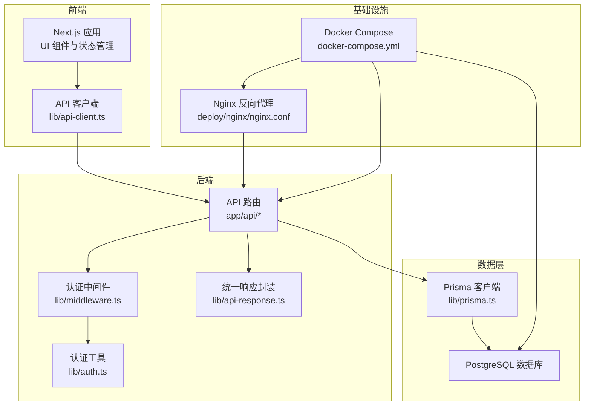
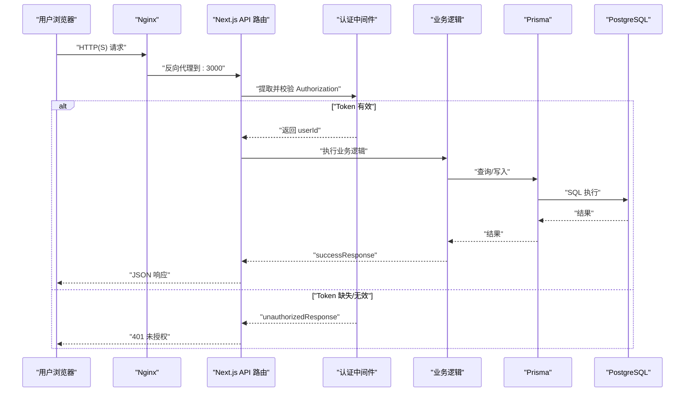
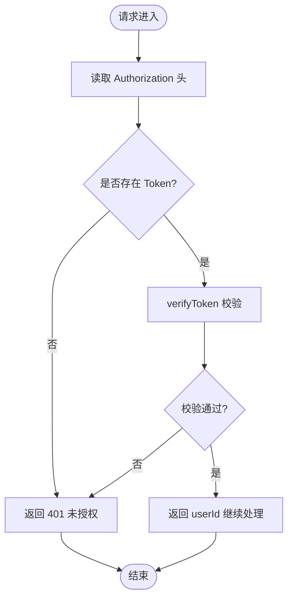
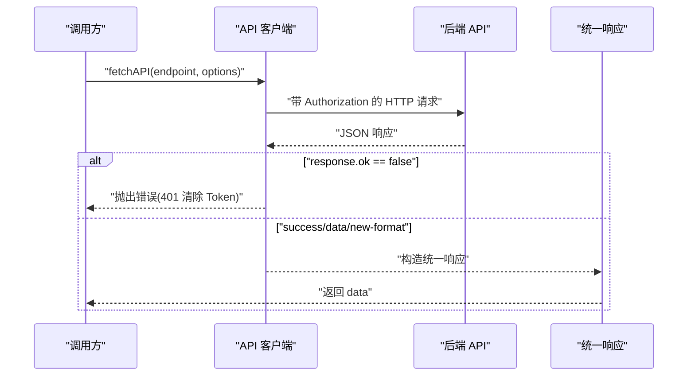
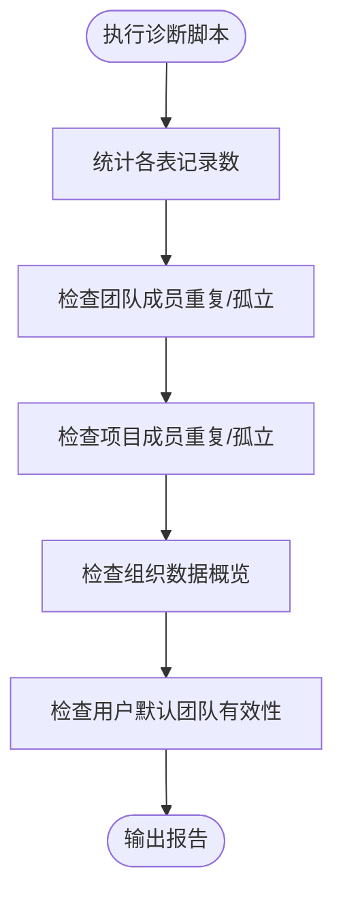
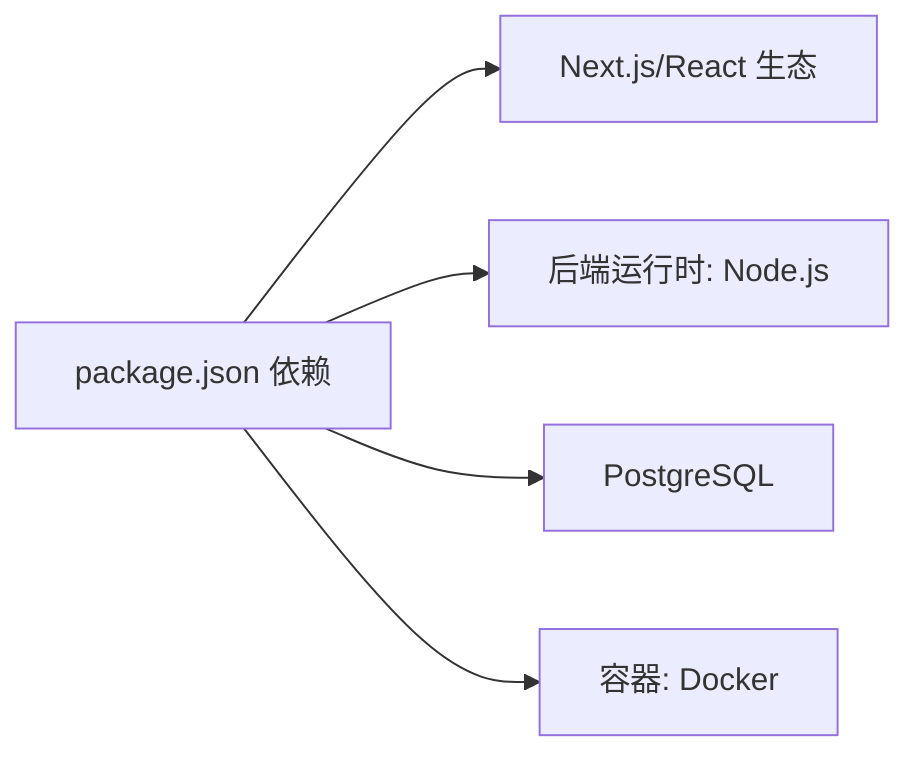

# 故障排除与常见问题

<cite>
**本文引用的文件**
- [README.md](file://README.md)
- [package.json](file://package.json)
- [docker-compose.yml](file://docker-compose.yml)
- [deploy/DEPLOYMENT.md](file://deploy/DEPLOYMENT.md)
- [deploy/nginx/nginx.conf](file://deploy/nginx/nginx.conf)
- [lib/prisma.ts](file://lib/prisma.ts)
- [lib/api-client.ts](file://lib/api-client.ts)
- [lib/middleware.ts](file://lib/middleware.ts)
- [lib/auth.ts](file://lib/auth.ts)
- [lib/api-response.ts](file://lib/api-response.ts)
- [app/api/config/route.ts](file://app/api/config/route.ts)
- [app/api/auth/login/route.ts](file://app/api/auth/login/route.ts)
- [app/api/tasks/route.ts](file://app/api/tasks/route.ts)
- [app/api/users/me/route.ts](file://app/api/users/me/route.ts)
- [scripts/diagnose-database.ts](file://scripts/diagnose-database.ts)
- [scripts/server-diagnose.sh](file://scripts/server-diagnose.sh)
- [API_DOCUMENTATION.md](file://API_DOCUMENTATION.md)
</cite>

## 目录
1. [简介](#简介)
2. [项目结构](#项目结构)
3. [核心组件](#核心组件)
4. [架构总览](#架构总览)
5. [详细组件分析](#详细组件分析)
6. [依赖分析](#依赖分析)
7. [性能考虑](#性能考虑)
8. [故障排除指南](#故障排除指南)
9. [结论](#结论)
10. [附录](#附录)

## 简介
本手册面向系统管理员与技术支持人员，聚焦于安装、配置、功能与性能方面的常见问题与排障流程。内容涵盖数据库连接问题、API 调用失败、界面显示异常、认证与权限异常、Nginx 与容器相关问题、日志分析与调试技巧，并提供系统监控指标与性能瓶颈识别建议。

## 项目结构
系统采用 Next.js App Router + Prisma + PostgreSQL + Docker 的全栈架构。前端通过统一 API 客户端发起请求，后端 API 路由经认证中间件与统一响应封装，最终访问数据库。

图表来源
- [docker-compose.yml](file://docker-compose.yml#L1-L77)
- [deploy/nginx/nginx.conf](file://deploy/nginx/nginx.conf#L1-L114)
- [lib/api-client.ts](file://lib/api-client.ts#L1-L525)
- [lib/middleware.ts](file://lib/middleware.ts#L1-L47)
- [lib/api-response.ts](file://lib/api-response.ts#L1-L101)
- [lib/auth.ts](file://lib/auth.ts#L1-L78)
- [lib/prisma.ts](file://lib/prisma.ts#L1-L12)

章节来源
- [README.md](file://README.md#L105-L138)
- [docker-compose.yml](file://docker-compose.yml#L1-L77)
- [deploy/nginx/nginx.conf](file://deploy/nginx/nginx.conf#L1-L114)

## 核心组件
- API 客户端：封装统一请求、Token 管理、错误处理与兼容旧版返回格式。
- 认证中间件：从请求头提取并校验 JWT，返回用户 ID 或 401。
- 统一响应：success/error/unauthorized/forbidden/notFound/serverError 等标准响应。
- 认证工具：密码哈希/校验、JWT 生成/校验、Token 提取。
- Prisma 客户端：开发/生产日志级别控制，全局实例管理。
- API 路由：任务、用户、认证等业务接口，含权限校验与数据清理。

章节来源
- [lib/api-client.ts](file://lib/api-client.ts#L1-L525)
- [lib/middleware.ts](file://lib/middleware.ts#L1-L47)
- [lib/api-response.ts](file://lib/api-response.ts#L1-L101)
- [lib/auth.ts](file://lib/auth.ts#L1-L78)
- [lib/prisma.ts](file://lib/prisma.ts#L1-L12)
- [app/api/tasks/route.ts](file://app/api/tasks/route.ts#L1-L497)
- [app/api/auth/login/route.ts](file://app/api/auth/login/route.ts#L1-L75)
- [app/api/users/me/route.ts](file://app/api/users/me/route.ts#L1-L115)

## 架构总览
系统通过 Nginx 将外部请求反向代理至 Next.js 应用，应用通过 Prisma 访问 PostgreSQL。认证采用 JWT，API 路由在进入业务逻辑前进行鉴权与参数校验。

图表来源
- [deploy/nginx/nginx.conf](file://deploy/nginx/nginx.conf#L42-L57)
- [lib/middleware.ts](file://lib/middleware.ts#L10-L39)
- [lib/api-response.ts](file://lib/api-response.ts#L19-L90)
- [lib/prisma.ts](file://lib/prisma.ts#L7-L11)
- [app/api/tasks/route.ts](file://app/api/tasks/route.ts#L18-L273)

## 详细组件分析

### 认证与权限组件
- 认证中间件从 Authorization 头部提取 Token，支持 Bearer 与裸 Token 两种格式；校验失败返回 401。
- 认证工具负责密码哈希/校验、JWT 生成/校验与 Token 提取；生产环境需正确配置 JWT_SECRET。
- API 路由在 GET/POST 等入口处进行权限校验（如组织/团队/项目成员身份），并按用户角色与关系过滤数据。

图表来源
- [lib/middleware.ts](file://lib/middleware.ts#L10-L39)
- [lib/auth.ts](file://lib/auth.ts#L45-L58)

章节来源
- [lib/middleware.ts](file://lib/middleware.ts#L1-L47)
- [lib/auth.ts](file://lib/auth.ts#L1-L78)
- [app/api/tasks/route.ts](file://app/api/tasks/route.ts#L332-L348)

### API 客户端与统一响应
- API 客户端封装 fetch，自动注入 Authorization 头，处理 401 清除 Token、兼容 success/data/new-format 与旧格式。
- 统一响应封装 successResponse/errorResponse/unauthorizedResponse 等，便于前后端一致处理。

图表来源
- [lib/api-client.ts](file://lib/api-client.ts#L44-L100)
- [lib/api-response.ts](file://lib/api-response.ts#L19-L90)

章节来源
- [lib/api-client.ts](file://lib/api-client.ts#L1-L525)
- [lib/api-response.ts](file://lib/api-response.ts#L1-L101)

### 数据库与诊断脚本
- Prisma 客户端在开发环境开启 error/warn 日志，生产环境仅 error，便于定位慢查询与异常。
- 提供诊断脚本用于检查重复成员关系、孤立关系、默认团队有效性、表记录数等。

图表来源
- [scripts/diagnose-database.ts](file://scripts/diagnose-database.ts#L5-L176)
- [lib/prisma.ts](file://lib/prisma.ts#L7-L11)

章节来源
- [lib/prisma.ts](file://lib/prisma.ts#L1-L12)
- [scripts/diagnose-database.ts](file://scripts/diagnose-database.ts#L1-L176)

### Nginx 与容器编排
- Nginx 配置包含 SSL、安全头、静态资源缓存、超时设置与反向代理到 localhost:3000。
- docker-compose 定义 postgres、app、可选 prisma-studio 服务，健康检查与端口映射。

章节来源
- [deploy/nginx/nginx.conf](file://deploy/nginx/nginx.conf#L1-L114)
- [docker-compose.yml](file://docker-compose.yml#L1-L77)

## 依赖分析
- 前端依赖：Next.js、React、Zustand、Radix UI、Tailwind CSS、Axios、date-fns、Recharts 等。
- 后端依赖：Prisma Client、jsonwebtoken、bcryptjs、dotenv 等。
- 运行时：Node.js、PostgreSQL、Docker。

图表来源
- [package.json](file://package.json#L11-L74)

章节来源
- [package.json](file://package.json#L1-L75)

## 性能考虑
- 日志级别：开发环境开启 error/warn，生产仅 error，减少日志开销。
- 资源监控：使用 docker stats/top、容器日志轮转、Nginx 访问/错误日志。
- 数据库：合理索引、避免 N+1 查询、批量写入与事务使用。
- 前端：组件懒加载、图片与静态资源缓存、减少不必要的重渲染。

章节来源
- [lib/prisma.ts](file://lib/prisma.ts#L7-L11)
- [deploy/DEPLOYMENT.md](file://deploy/DEPLOYMENT.md#L350-L358)

## 故障排除指南

### 一、安装与部署类问题
- 容器无法启动
  - 排查步骤：查看容器状态与日志，检查端口占用，必要时重建镜像。
  - 参考命令：docker-compose ps、logs、down + up -d --build。
- 端口被占用
  - 排查步骤：lsof 检查 3000/5432，修改 docker-compose.yml 端口映射。
- SSL 证书问题
  - 排查步骤：检查证书路径与权限、有效期，重新加载 Nginx。
- 首次部署失败
  - 排查步骤：确认 .env、数据库连接、域名解析、防火墙放通。

章节来源
- [deploy/DEPLOYMENT.md](file://deploy/DEPLOYMENT.md#L221-L284)
- [deploy/nginx/nginx.conf](file://deploy/nginx/nginx.conf#L17-L26)
- [docker-compose.yml](file://docker-compose.yml#L13-L14)

### 二、数据库连接问题
- 症状：应用启动卡住、API 报错“连接失败”。
- 排查步骤：
  - 检查数据库容器健康状态与日志。
  - 使用 psql 连接验证数据库可用性与表结构。
  - 核对 DATABASE_URL 与环境变量。
- 诊断脚本：
  - 使用 scripts/diagnose-database.ts 检查重复/孤立关系、默认团队有效性、表记录数。
  - 使用 scripts/server-diagnose.sh 检查容器资源、表记录数。

章节来源
- [deploy/DEPLOYMENT.md](file://deploy/DEPLOYMENT.md#L237-L247)
- [scripts/diagnose-database.ts](file://scripts/diagnose-database.ts#L1-L176)
- [scripts/server-diagnose.sh](file://scripts/server-diagnose.sh#L1-L63)
- [lib/prisma.ts](file://lib/prisma.ts#L7-L11)

### 三、API 调用失败
- 常见错误与定位：
  - 400 验证错误：检查请求体字段、日期格式、类型枚举。
  - 401 未授权：确认 Authorization 头、Token 是否过期或格式错误。
  - 403 禁止访问：检查用户对组织/团队/项目的成员身份与权限。
  - 500 服务器错误：查看后端日志，定位具体路由与业务逻辑。
- 客户端处理：
  - API 客户端会自动处理 401 清除本地 Token，并抛出错误。
  - 兼容 success/data/new-format 与旧格式返回。

章节来源
- [lib/api-client.ts](file://lib/api-client.ts#L72-L100)
- [lib/api-response.ts](file://lib/api-response.ts#L39-L100)
- [app/api/tasks/route.ts](file://app/api/tasks/route.ts#L18-L273)
- [app/api/auth/login/route.ts](file://app/api/auth/login/route.ts#L13-L75)

### 四、认证与权限异常
- 症状：登录失败、Token 无效、无法查看他人任务。
- 排查步骤：
  - 核对 JWT_SECRET 是否正确配置。
  - 检查用户是否存在、密码是否匹配。
  - 确认用户在目标组织/团队/项目中的成员身份。
  - 检查用户 defaultTeamId 是否指向有效团队。
- 相关路由与工具：
  - 登录路由：校验必填字段、查找用户、验证密码、签发 Token。
  - 认证中间件：提取并校验 Token。
  - 用户路由：获取/更新当前用户信息。

章节来源
- [lib/auth.ts](file://lib/auth.ts#L5-L58)
- [lib/middleware.ts](file://lib/middleware.ts#L10-L39)
- [app/api/auth/login/route.ts](file://app/api/auth/login/route.ts#L13-L75)
- [app/api/users/me/route.ts](file://app/api/users/me/route.ts#L16-L115)
- [scripts/diagnose-database.ts](file://scripts/diagnose-database.ts#L116-L147)

### 五、界面显示异常
- 可能原因：Nginx 反代未正确代理 WebSocket/升级头、静态资源缓存未生效、HTTPS 证书问题。
- 排查步骤：
  - 检查 Nginx location / 的 proxy_set_header 与升级头设置。
  - 检查静态资源缓存与缓存头。
  - 检查 SSL 证书链与有效期。

章节来源
- [deploy/nginx/nginx.conf](file://deploy/nginx/nginx.conf#L42-L57)
- [deploy/nginx/nginx.conf](file://deploy/nginx/nginx.conf#L67-L71)
- [deploy/nginx/nginx.conf](file://deploy/nginx/nginx.conf#L17-L26)

### 六、日志分析与调试
- 应用日志：docker-compose logs -f，分别查看 app 与 postgres 日志。
- Nginx 日志：access_log/error_log，定位代理层问题。
- 后端日志：Prisma 在开发环境输出 error/warn，生产仅 error。
- 前端调试：API 客户端 handleAPIError 输出错误信息，结合浏览器网络面板定位。

章节来源
- [deploy/DEPLOYMENT.md](file://deploy/DEPLOYMENT.md#L164-L175)
- [deploy/nginx/nginx.conf](file://deploy/nginx/nginx.conf#L34-L36)
- [lib/prisma.ts](file://lib/prisma.ts#L7-L11)
- [lib/api-client.ts](file://lib/api-client.ts#L502-L507)

### 七、系统监控与性能瓶颈
- 容器资源：docker stats、docker-compose top。
- 表规模与增长：使用诊断脚本检查 users/teams/projects/tasks 等表记录数。
- 慢查询定位：开启 Prisma 日志（开发环境），结合数据库 EXPLAIN 分析。
- 前端性能：关注首屏渲染、组件重渲染次数、图片压缩与懒加载。

章节来源
- [deploy/DEPLOYMENT.md](file://deploy/DEPLOYMENT.md#L350-L358)
- [scripts/server-diagnose.sh](file://scripts/server-diagnose.sh#L34-L59)
- [lib/prisma.ts](file://lib/prisma.ts#L7-L11)

### 八、常见 API 问题与修复
- 获取任务失败
  - 检查是否传入组织 ID 或用户 currentOrganizationId。
  - 检查团队/项目成员身份与权限。
- 创建任务失败
  - 检查必填字段、日期范围、类型与颜色枚举。
  - 检查项目成员身份与负责人是否在项目/团队中。
- 获取用户信息失败
  - 检查 Token 是否有效，用户是否存在。

章节来源
- [app/api/tasks/route.ts](file://app/api/tasks/route.ts#L18-L273)
- [app/api/users/me/route.ts](file://app/api/users/me/route.ts#L16-L115)
- [API_DOCUMENTATION.md](file://API_DOCUMENTATION.md#L30-L90)

## 结论
本手册提供了从安装部署到日常运维的全流程排障思路与实操步骤。建议在生产环境中：
- 明确日志策略与轮转；
- 配置健康检查与告警；
- 定期运行数据库诊断脚本；
- 对关键 API 做压测与容量评估；
- 保持依赖版本更新与安全补丁。

## 附录

### A. 常用命令速查
- 启动/停止/重启：docker-compose up/down/restart
- 查看日志：docker-compose logs -f
- 进入容器：docker exec -it <container> bash
- 数据库连接：docker exec -it calendar-postgres psql -U postgres
- 诊断脚本：ts-node scripts/diagnose-database.ts
- 服务器诊断：./scripts/server-diagnose.sh

章节来源
- [deploy/DEPLOYMENT.md](file://deploy/DEPLOYMENT.md#L155-L218)
- [scripts/diagnose-database.ts](file://scripts/diagnose-database.ts#L1-L176)
- [scripts/server-diagnose.sh](file://scripts/server-diagnose.sh#L1-L63)

### B. API 响应与状态码对照
- 200 成功：successResponse(data)
- 400 验证错误：validationErrorResponse
- 401 未授权：unauthorizedResponse
- 403 禁止访问：forbiddenResponse
- 404 资源不存在：notFoundResponse
- 500 服务器错误：serverErrorResponse

章节来源
- [lib/api-response.ts](file://lib/api-response.ts#L19-L100)