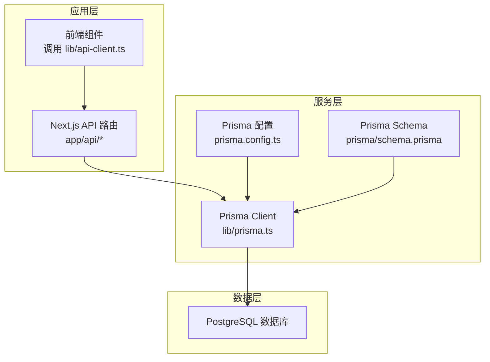
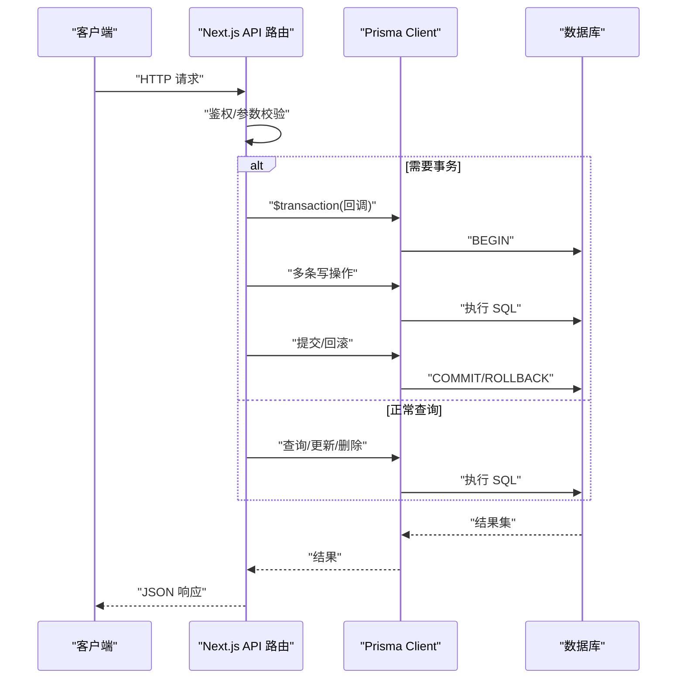
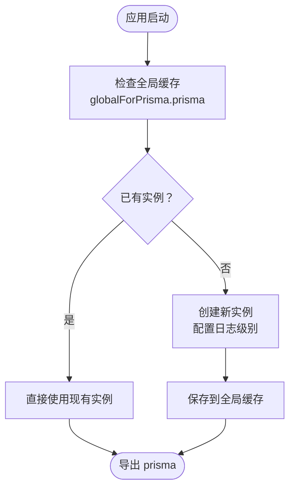
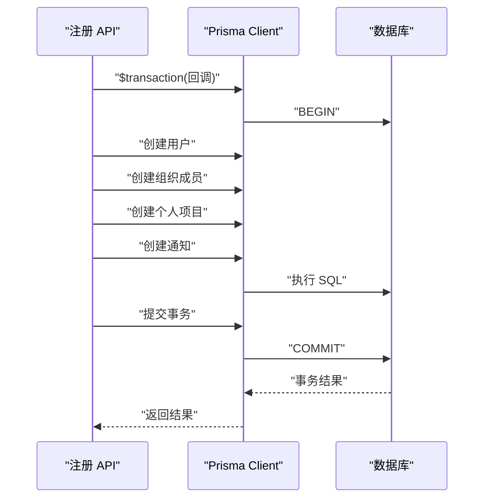
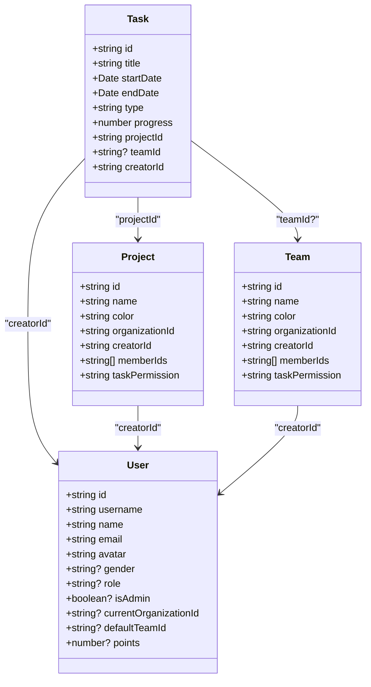
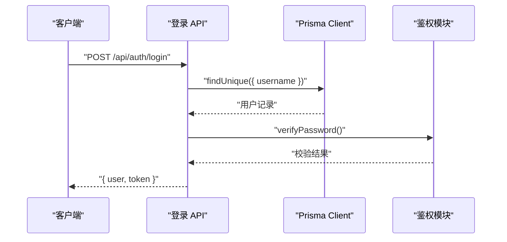
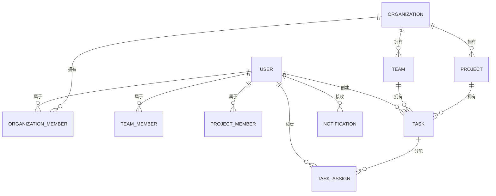
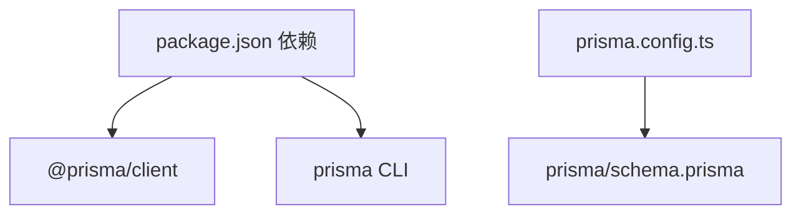

# ORM集成

<cite>
**本文引用的文件**   
- [prisma/schema.prisma](file://prisma/schema.prisma)
- [lib/prisma.ts](file://lib/prisma.ts)
- [prisma.config.ts](file://prisma.config.ts)
- [package.json](file://package.json)
- [app/api/tasks/route.ts](file://app/api/tasks/route.ts)
- [app/api/users/me/route.ts](file://app/api/users/me/route.ts)
- [app/api/auth/login/route.ts](file://app/api/auth/login/route.ts)
- [app/api/auth/register/route.ts](file://app/api/auth/register/route.ts)
- [app/api/organizations/[id]/route.ts](file://app/api/organizations/[id]/route.ts)
- [lib/api-client.ts](file://lib/api-client.ts)
- [lib/types.ts](file://lib/types.ts)
</cite>

## 目录
1. [简介](#简介)
2. [项目结构](#项目结构)
3. [核心组件](#核心组件)
4. [架构总览](#架构总览)
5. [详细组件分析](#详细组件分析)
6. [依赖分析](#依赖分析)
7. [性能考虑](#性能考虑)
8. [故障排查指南](#故障排查指南)
9. [结论](#结论)
10. [附录](#附录)

## 简介
本文件系统化阐述本项目中 Prisma ORM 的集成与使用，涵盖以下主题：
- Prisma Client 初始化与配置
- 连接池与日志策略
- 数据访问层设计模式与最佳实践（事务、批量操作、查询优化）
- Prisma Schema 与 TypeScript 类型集成
- 错误处理、连接重试策略与监控建议
- 在 Next.js API 路由中的使用范式
- 数据模型变更流程与向后兼容性保障

## 项目结构
本项目采用 Next.js App Router，API 路由位于 app/api 下，数据访问统一通过 lib/prisma.ts 中导出的 PrismaClient 实例完成。Prisma Schema 定义于 prisma/schema.prisma，工程化配置位于 prisma.config.ts。

**图表来源**
- [lib/prisma.ts](file://lib/prisma.ts#L1-L12)
- [prisma.config.ts](file://prisma.config.ts#L1-L14)
- [prisma/schema.prisma](file://prisma/schema.prisma#L1-L314)

**章节来源**
- [lib/prisma.ts](file://lib/prisma.ts#L1-L12)
- [prisma.config.ts](file://prisma.config.ts#L1-L14)
- [prisma/schema.prisma](file://prisma/schema.prisma#L1-L314)

## 核心组件
- Prisma Client 单例：通过 lib/prisma.ts 提供全局唯一的 PrismaClient 实例，开发环境启用更详细的日志，生产环境仅记录错误，避免噪声。
- Prisma 配置：prisma.config.ts 指定 schema 位置、迁移目录、引擎类型与数据源 URL。
- API 路由：各业务模块的 API 路由均通过 prisma 实例执行查询、更新与事务，统一返回结构化响应。
- 类型系统：lib/types.ts 定义前端侧 TypeScript 类型，配合 Prisma Client 的强类型查询结果，实现端到端类型安全。

**章节来源**
- [lib/prisma.ts](file://lib/prisma.ts#L1-L12)
- [prisma.config.ts](file://prisma.config.ts#L1-L14)
- [lib/types.ts](file://lib/types.ts#L1-L141)

## 架构总览
下图展示了从 API 路由到 Prisma Client 再到数据库的整体调用链路，并标注了事务与批量操作的关键节点。

**图表来源**
- [app/api/tasks/route.ts](file://app/api/tasks/route.ts#L396-L455)
- [app/api/auth/register/route.ts](file://app/api/auth/register/route.ts#L137-L315)
- [lib/prisma.ts](file://lib/prisma.ts#L1-L12)

## 详细组件分析

### Prisma Client 初始化与配置
- 单例模式：lib/prisma.ts 使用全局对象缓存 PrismaClient 实例，避免重复创建；开发环境开启错误与警告日志，生产环境仅记录错误。
- 配置文件：prisma.config.ts 指定 schema 路径、迁移目录、引擎类型与数据源 URL，确保 CLI 与运行时一致。
- 依赖声明：package.json 中包含 @prisma/client 与 prisma，确保生成客户端与工具链可用。

**图表来源**
- [lib/prisma.ts](file://lib/prisma.ts#L1-L12)

**章节来源**
- [lib/prisma.ts](file://lib/prisma.ts#L1-L12)
- [prisma.config.ts](file://prisma.config.ts#L1-L14)
- [package.json](file://package.json#L11-L75)

### 数据访问层设计模式与最佳实践
- 事务处理：在用户注册场景中，使用 $transaction 包裹创建用户、组织成员关系、个人项目与通知等多步骤写操作，保证原子性与一致性。
- 批量操作：在团队成员更新场景中，先计算需要新增与删除的成员集合，再分别执行 createMany 与 deleteMany，减少多次往返。
- 查询优化：API 路由中广泛使用 select/include 精准投影字段，避免 N+1 查询；对高频查询建立索引（Schema 中已定义）。
- 权限控制：在任务查询与创建中，严格校验用户与组织/项目/团队的关系，防止越权访问。

**图表来源**
- [app/api/auth/register/route.ts](file://app/api/auth/register/route.ts#L137-L315)

**章节来源**
- [app/api/auth/register/route.ts](file://app/api/auth/register/route.ts#L137-L315)
- [app/api/tasks/route.ts](file://app/api/tasks/route.ts#L74-L177)
- [app/api/organizations/[id]/route.ts](file://app/api/organizations/[id]/route.ts#L17-L29)

### API 客户端封装与类型安全
- API 客户端：lib/api-client.ts 封装了 fetchAPI 与各模块 API（任务、用户、项目、团队、认证），统一处理 token、错误与响应格式。
- 类型集成：lib/types.ts 定义了 Task、User、Project、Team 等接口，API 客户端返回类型与 Prisma 查询结果保持一致，实现端到端类型安全。

**图表来源**
- [lib/types.ts](file://lib/types.ts#L61-L120)

**章节来源**
- [lib/api-client.ts](file://lib/api-client.ts#L1-L525)
- [lib/types.ts](file://lib/types.ts#L1-L141)

### Next.js API 路由中的 Prisma 使用范式
- 登录路由：使用 prisma.user.findUnique 投影必要字段，结合密码校验生成 JWT。
- 注册路由：使用 $transaction 执行多步骤写操作，支持邀请码加入与审批流程。
- 任务路由：复杂查询与权限校验结合，使用 include 精准加载关联数据。
- 组织路由：基于成员关系与角色进行访问控制。

**图表来源**
- [app/api/auth/login/route.ts](file://app/api/auth/login/route.ts#L1-L75)

**章节来源**
- [app/api/auth/login/route.ts](file://app/api/auth/login/route.ts#L1-L75)
- [app/api/auth/register/route.ts](file://app/api/auth/register/route.ts#L1-L349)
- [app/api/tasks/route.ts](file://app/api/tasks/route.ts#L1-L497)
- [app/api/users/me/route.ts](file://app/api/users/me/route.ts#L1-L115)
- [app/api/organizations/[id]/route.ts](file://app/api/organizations/[id]/route.ts#L1-L212)

### 数据模型与索引设计
- 模型关系：组织、团队、项目、任务、用户、通知、邀请与加入申请等模型通过外键与关系字段连接，形成完整的协作与权限体系。
- 索引设计：Schema 中为常用查询字段建立索引（如组织名称、成员唯一组合、邀请码、时间范围等），提升查询性能。
- 枚举与权限：通过枚举类型（如任务类型、成员角色、通知类型）与权限策略（如任务权限）约束数据一致性。

**图表来源**
- [prisma/schema.prisma](file://prisma/schema.prisma#L17-L314)

**章节来源**
- [prisma/schema.prisma](file://prisma/schema.prisma#L1-L314)

### 查询优化策略
- 精准投影：使用 select/include 仅返回所需字段，避免全表扫描与多余序列化。
- 关联过滤：在 include 中嵌套 where，减少二次筛选成本。
- 索引利用：Schema 中已定义复合索引与单列索引，API 层查询条件尽量命中索引。
- 分页与排序：对大结果集使用分页与稳定排序键，避免 OFFSET 大量数据导致的性能问题。

**章节来源**
- [app/api/tasks/route.ts](file://app/api/tasks/route.ts#L220-L263)
- [app/api/users/me/route.ts](file://app/api/users/me/route.ts#L23-L39)
- [prisma/schema.prisma](file://prisma/schema.prisma#L33-L35)

### 错误处理与监控建议
- 统一错误响应：API 路由捕获异常并返回结构化错误，前端通过 lib/api-client.ts 统一解析。
- 认证失败处理：API 客户端在 401 时清理本地 token，触发重新登录。
- 日志策略：开发环境输出错误与警告，生产环境仅记录错误，便于定位问题。
- 监控建议：结合数据库慢查询日志、Prisma 查询日志与应用错误日志，建立告警阈值。

**章节来源**
- [lib/api-client.ts](file://lib/api-client.ts#L72-L100)
- [lib/prisma.ts](file://lib/prisma.ts#L7-L9)

### 数据模型变更与向后兼容
- 迁移管理：prisma/migrations 目录存放历史迁移脚本，Schema 变更通过 prisma migrate 命令生成新迁移。
- 向后兼容：Schema 中保留历史字段与关系，避免破坏既有查询；新增字段默认值与索引同步更新。
- 变更流程：先在本地/测试环境验证迁移与查询，再合并到主分支；发布前确认数据库版本与客户端版本一致。

**章节来源**
- [prisma/schema.prisma](file://prisma/schema.prisma#L1-L314)
- [prisma.config.ts](file://prisma.config.ts#L6-L8)

## 依赖分析
- Prisma 客户端与工具链：@prisma/client 与 prisma 在 package.json 中声明，确保生成客户端与 CLI 可用。
- 数据源：datasource db 指向 PostgreSQL，URL 来自环境变量 DATABASE_URL。
- 引擎与迁移：engine 设为 classic，迁移路径在 prisma.config.ts 中配置。

**图表来源**
- [package.json](file://package.json#L11-L75)
- [prisma.config.ts](file://prisma.config.ts#L1-L14)
- [prisma/schema.prisma](file://prisma/schema.prisma#L11-L14)

**章节来源**
- [package.json](file://package.json#L11-L75)
- [prisma.config.ts](file://prisma.config.ts#L1-L14)
- [prisma/schema.prisma](file://prisma/schema.prisma#L11-L14)

## 性能考虑
- 连接池：在生产环境中，建议通过数据库连接池参数与 Prisma 引擎配置优化并发与连接复用。
- 查询优化：优先使用索引字段过滤、精准投影与批量写入；避免 N+1 查询。
- 缓存策略：对静态或低频变更数据引入应用层缓存，减少数据库压力。
- 监控与告警：对慢查询、错误率与延迟建立监控，及时发现性能瓶颈。

## 故障排查指南
- 常见错误类型
  - 认证失败：检查 token 是否存在与有效，API 客户端会在 401 时清理 token。
  - 权限不足：确认用户与组织/项目/团队的关系与角色，API 路由中均有相应校验。
  - 参数校验失败：核对必填字段与格式，API 路由中包含严格的校验逻辑。
- 日志与调试
  - 开发环境启用详细日志，定位查询与事务问题。
  - 对批量写入与事务操作添加边界日志，便于回溯。
- 数据库层面
  - 检查索引是否命中，必要时重建或调整索引。
  - 使用数据库慢查询日志识别热点 SQL。

**章节来源**
- [lib/api-client.ts](file://lib/api-client.ts#L72-L100)
- [app/api/tasks/route.ts](file://app/api/tasks/route.ts#L47-L49)
- [lib/prisma.ts](file://lib/prisma.ts#L7-L9)

## 结论
本项目通过 Prisma 实现了类型安全、可维护的数据访问层。借助单例 PrismaClient、事务与批量操作、精准查询与索引设计，以及统一的 API 路由与错误处理，形成了高可靠、高性能的后端数据基础设施。建议持续完善监控与缓存策略，确保在业务增长过程中保持稳定与高效。

## 附录
- API 客户端使用要点
  - 使用 taskAPI/projectAPI/teamAPI/userAPI/authAPI 等模块进行 CRUD 操作。
  - 注意日期字段的序列化与反序列化，API 客户端提供辅助函数。
- 类型安全提示
  - 前端类型与 Prisma 查询结果保持一致，避免运行时类型错误。
- Schema 变更建议
  - 新增字段时提供默认值与索引；删除字段前确保无依赖关系。