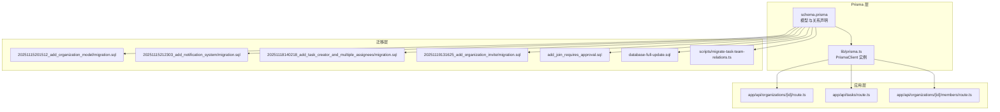
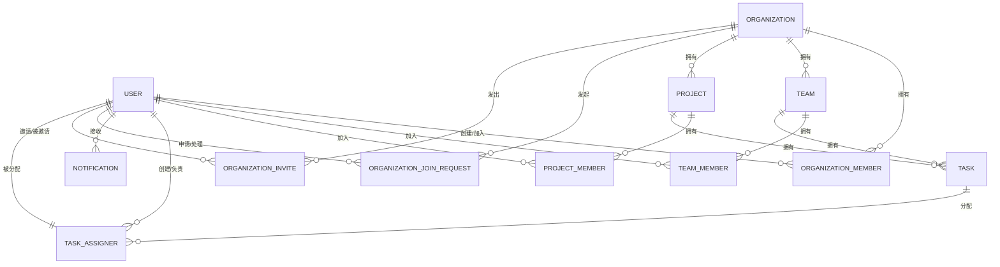
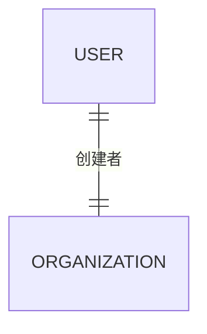
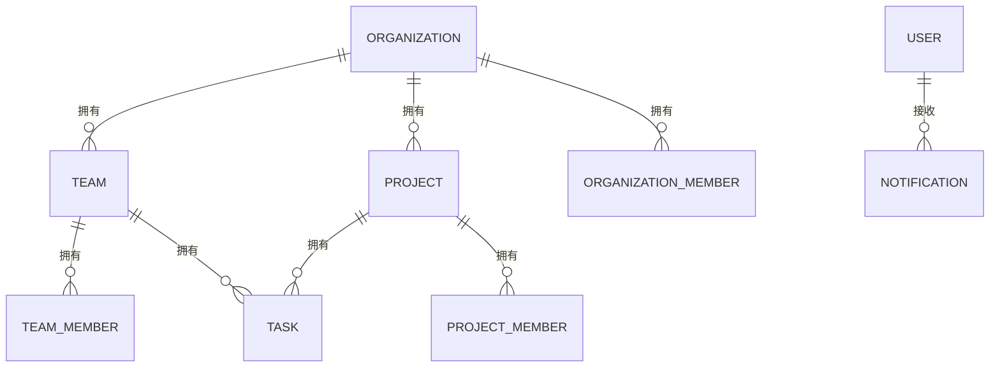
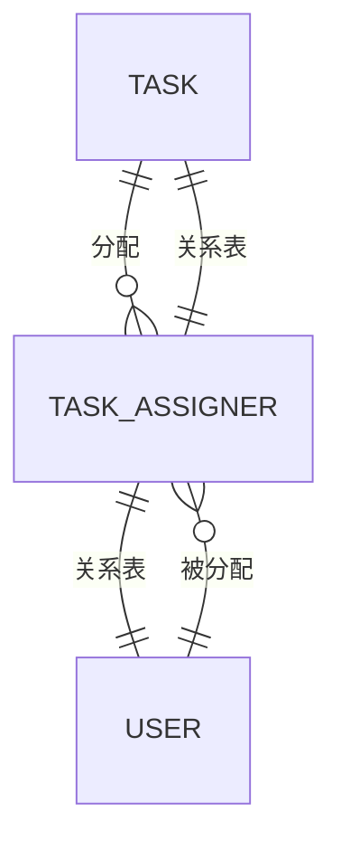
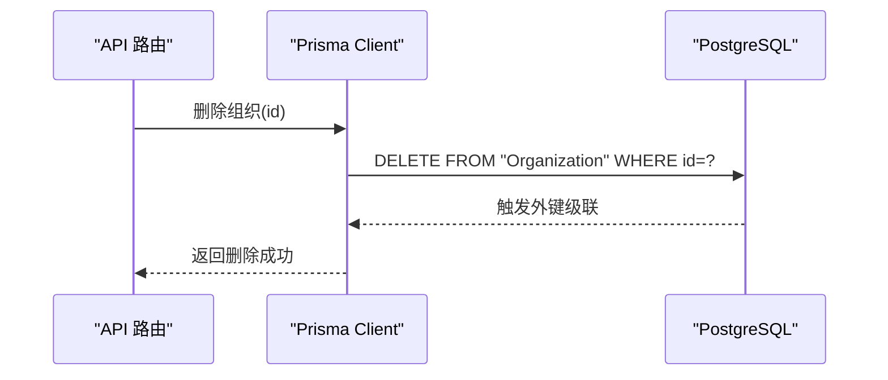
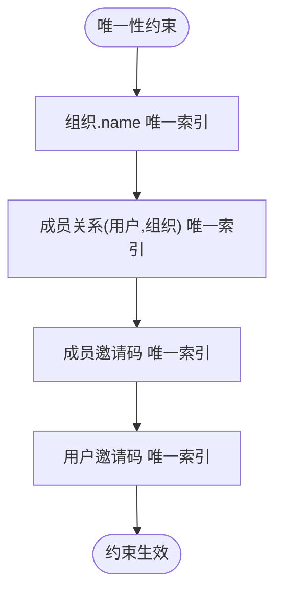
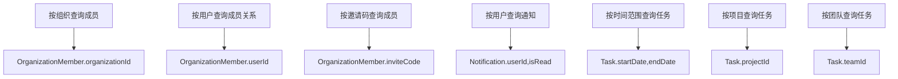
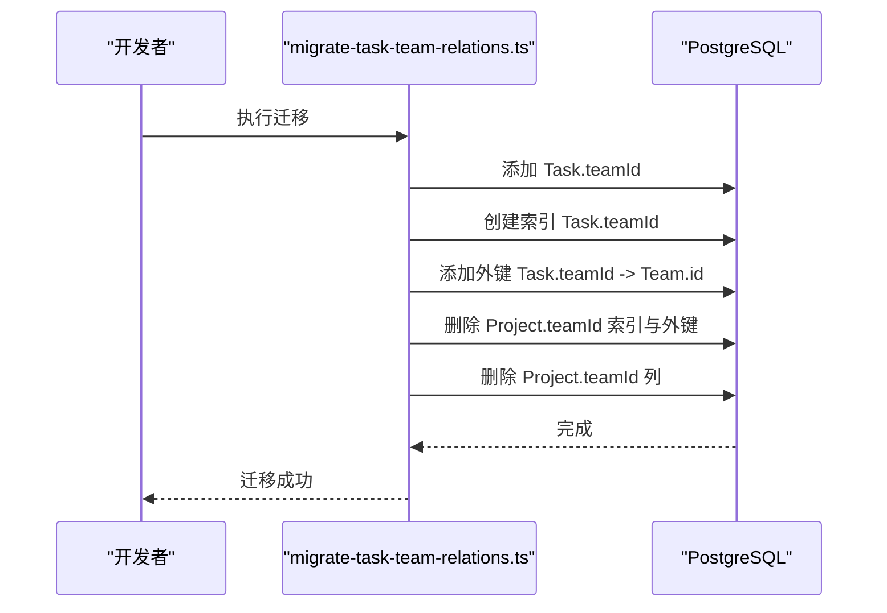
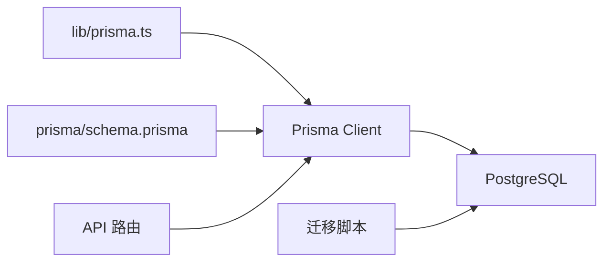

# 关系与约束

<cite>
**本文引用的文件**
- [prisma/schema.prisma](file://prisma/schema.prisma)
- [prisma/migrations/20251115201512_add_organization_model/migration.sql](file://prisma/migrations/20251115201512_add_organization_model/migration.sql)
- [prisma/migrations/20251115212303_add_notification_system/migration.sql](file://prisma/migrations/20251115212303_add_notification_system/migration.sql)
- [prisma/migrations/20251118140218_add_task_creator_and_multiple_assignees/migration.sql](file://prisma/migrations/20251118140218_add_task_creator_and_multiple_assignees/migration.sql)
- [prisma/migrations/20251119131625_add_organization_invite/migration.sql](file://prisma/migrations/20251119131625_add_organization_invite/migration.sql)
- [prisma/migrations/add_join_requires_approval.sql](file://prisma/migrations/add_join_requires_approval.sql)
- [database-full-update.sql](file://database-full-update.sql)
- [scripts/migrate-task-team-relations.ts](file://scripts/migrate-task-team-relations.ts)
- [lib/prisma.ts](file://lib/prisma.ts)
- [app/api/organizations/[id]/route.ts](file://app/api/organizations/[id]/route.ts)
- [app/api/tasks/route.ts](file://app/api/tasks/route.ts)
- [app/api/organizations/[id]/members/route.ts](file://app/api/organizations/[id]/members/route.ts)
</cite>

## 目录
1. [简介](#简介)
2. [项目结构](#项目结构)
3. [核心组件](#核心组件)
4. [架构总览](#架构总览)
5. [详细组件分析](#详细组件分析)
6. [依赖分析](#依赖分析)
7. [性能考量](#性能考量)
8. [故障排查指南](#故障排查指南)
9. [结论](#结论)
10. [附录](#附录)

## 简介
本文件聚焦于数据库关系与约束的设计与实现，结合 Prisma ORM 的模型定义与数据库迁移脚本，系统阐述一对一、一对多、多对多关系的建模方式与约束配置；详述外键约束、唯一性约束、检查约束与级联行为；总结索引策略、性能优化与查询效率分析；并给出数据完整性与参照完整性的维护策略及可视化关系图。

## 项目结构
本项目采用 Prisma Schema 描述数据模型，并通过 SQL 迁移脚本在数据库层面落地约束与索引。应用层 API 路由通过 Prisma Client 进行数据访问与业务校验，形成“模型定义 → 数据库约束 → 应用层校验”的三层保障。

图表来源
- [prisma/schema.prisma](file://prisma/schema.prisma#L1-L314)
- [lib/prisma.ts](file://lib/prisma.ts#L1-L12)
- [prisma/migrations/20251115201512_add_organization_model/migration.sql](file://prisma/migrations/20251115201512_add_organization_model/migration.sql#L1-L99)
- [prisma/migrations/20251115212303_add_notification_system/migration.sql](file://prisma/migrations/20251115212303_add_notification_system/migration.sql#L1-L64)
- [prisma/migrations/20251118140218_add_task_creator_and_multiple_assignees/migration.sql](file://prisma/migrations/20251118140218_add_task_creator_and_multiple_assignees/migration.sql#L1-L1)
- [prisma/migrations/20251119131625_add_organization_invite/migration.sql](file://prisma/migrations/20251119131625_add_organization_invite/migration.sql#L1-L50)
- [prisma/migrations/add_join_requires_approval.sql](file://prisma/migrations/add_join_requires_approval.sql#L1-L31)
- [database-full-update.sql](file://database-full-update.sql#L1-L344)
- [scripts/migrate-task-team-relations.ts](file://scripts/migrate-task-team-relations.ts#L1-L68)
- [app/api/organizations/[id]/route.ts](file://app/api/organizations/[id]/route.ts#L1-L212)
- [app/api/tasks/route.ts](file://app/api/tasks/route.ts#L1-L497)
- [app/api/organizations/[id]/members/route.ts](file://app/api/organizations/[id]/members/route.ts#L1-L501)

章节来源
- [prisma/schema.prisma](file://prisma/schema.prisma#L1-L314)
- [lib/prisma.ts](file://lib/prisma.ts#L1-L12)

## 核心组件
- 组织与用户：一对多（组织-成员）、一对一（创建者）。
- 团队与项目：一对多（组织-团队/项目），多对一（任务-团队/项目）。
- 任务与用户：多对多（任务-负责人），通过中间表 TaskAssignee 实现。
- 通知与加入请求/邀请：多对一（用户-通知），多对一（组织-加入请求/邀请）。
- 约束与索引：外键、唯一、索引覆盖常见查询路径。

章节来源
- [prisma/schema.prisma](file://prisma/schema.prisma#L17-L314)

## 架构总览
下图展示数据库层面的实体关系与约束，映射到 Prisma 模型与迁移脚本：

图表来源
- [prisma/schema.prisma](file://prisma/schema.prisma#L17-L314)
- [prisma/migrations/20251115201512_add_organization_model/migration.sql](file://prisma/migrations/20251115201512_add_organization_model/migration.sql#L31-L99)
- [prisma/migrations/20251115212303_add_notification_system/migration.sql](file://prisma/migrations/20251115212303_add_notification_system/migration.sql#L7-L64)
- [prisma/migrations/20251119131625_add_organization_invite/migration.sql](file://prisma/migrations/20251119131625_add_organization_invite/migration.sql#L16-L50)

## 详细组件分析

### 一对一关系
- 组织创建者：组织模型通过外键关联用户，Prisma 以关系修饰符表达一对一（组织-创建者）。
- 约束与索引：组织表对创建者字段建立索引，保证查询效率与外键一致性。

图表来源
- [prisma/schema.prisma](file://prisma/schema.prisma#L17-L35)
- [prisma/migrations/20251115201512_add_organization_model/migration.sql](file://prisma/migrations/20251115201512_add_organization_model/migration.sql#L32-L42)
- [prisma/migrations/20251115201512_add_organization_model/migration.sql](file://prisma/migrations/20251115201512_add_organization_model/migration.sql#L82-L83)

章节来源
- [prisma/schema.prisma](file://prisma/schema.prisma#L17-L35)
- [prisma/migrations/20251115201512_add_organization_model/migration.sql](file://prisma/migrations/20251115201512_add_organization_model/migration.sql#L32-L42)

### 一对多关系
- 组织-团队/项目/成员：组织拥有多个团队与项目，成员属于组织。
- 团队-成员：团队拥有多个成员。
- 项目-成员：项目拥有多个成员。
- 任务-团队/项目：任务属于团队与项目。
- 通知-用户：用户接收多条通知。

图表来源
- [prisma/schema.prisma](file://prisma/schema.prisma#L98-L136)
- [prisma/schema.prisma](file://prisma/schema.prisma#L138-L164)
- [prisma/schema.prisma](file://prisma/schema.prisma#L221-L236)

章节来源
- [prisma/schema.prisma](file://prisma/schema.prisma#L98-L136)
- [prisma/schema.prisma](file://prisma/schema.prisma#L138-L164)
- [prisma/schema.prisma](file://prisma/schema.prisma#L221-L236)

### 多对多关系
- 任务-负责人：通过中间表 TaskAssignee 实现，联合唯一索引保证“同一任务不可重复分配同一用户”。

图表来源
- [prisma/schema.prisma](file://prisma/schema.prisma#L138-L178)
- [prisma/migrations/20251115201512_add_organization_model/migration.sql](file://prisma/migrations/20251115201512_add_organization_model/migration.sql#L23-L23)

章节来源
- [prisma/schema.prisma](file://prisma/schema.prisma#L166-L178)

### 外键约束与级联行为
- 组织-用户（创建者）：删除组织时级联删除成员、团队、项目等；删除用户时级联删除其创建的资源。
- 组织-组织成员：删除组织或用户时级联删除成员关系。
- 团队-组织/用户：删除组织时级联删除团队；删除用户时级联删除其创建的团队。
- 项目-组织/用户：删除组织时级联删除项目；删除用户时级联删除其创建的项目。
- 任务-团队/项目/用户：删除团队时将任务团队字段置空；删除组织/用户时级联删除。
- 通知-用户：删除用户时级联删除通知。
- 加入请求/邀请-用户/组织：删除用户/组织时按需级联或置空。

图表来源
- [prisma/schema.prisma](file://prisma/schema.prisma#L17-L314)
- [prisma/migrations/20251115201512_add_organization_model/migration.sql](file://prisma/migrations/20251115201512_add_organization_model/migration.sql#L82-L99)
- [prisma/migrations/20251115212303_add_notification_system/migration.sql](file://prisma/migrations/20251115212303_add_notification_system/migration.sql#L53-L64)
- [prisma/migrations/20251119131625_add_organization_invite/migration.sql](file://prisma/migrations/20251119131625_add_organization_invite/migration.sql#L42-L50)

章节来源
- [prisma/schema.prisma](file://prisma/schema.prisma#L17-L314)
- [prisma/migrations/20251115201512_add_organization_model/migration.sql](file://prisma/migrations/20251115201512_add_organization_model/migration.sql#L82-L99)
- [prisma/migrations/20251115212303_add_notification_system/migration.sql](file://prisma/migrations/20251115212303_add_notification_system/migration.sql#L53-L64)
- [prisma/migrations/20251119131625_add_organization_invite/migration.sql](file://prisma/migrations/20251119131625_add_organization_invite/migration.sql#L42-L50)

### 唯一性约束
- 组织名称唯一：组织表对 name 建唯一索引。
- 组织成员关系唯一：成员关系表对 (userId, organizationId) 建唯一索引。
- 成员邀请码唯一：成员邀请码字段唯一。
- 用户邀请码唯一：用户邀请码字段唯一。
- 通知类型扩展：通过枚举扩展新增值，保证通知类型一致性。

图表来源
- [prisma/schema.prisma](file://prisma/schema.prisma#L19-L19)
- [prisma/schema.prisma](file://prisma/schema.prisma#L50-L50)
- [prisma/schema.prisma](file://prisma/schema.prisma#L45-L45)
- [prisma/schema.prisma](file://prisma/schema.prisma#L75-L75)
- [prisma/migrations/20251115201512_add_organization_model/migration.sql](file://prisma/migrations/20251115201512_add_organization_model/migration.sql#L55-L61)
- [prisma/migrations/20251115201512_add_organization_model/migration.sql](file://prisma/migrations/20251115201512_add_organization_model/migration.sql#L70-L70)
- [database-full-update.sql](file://database-full-update.sql#L24-L33)
- [database-full-update.sql](file://database-full-update.sql#L130-L149)

章节来源
- [prisma/schema.prisma](file://prisma/schema.prisma#L19-L19)
- [prisma/schema.prisma](file://prisma/schema.prisma#L45-L45)
- [prisma/schema.prisma](file://prisma/schema.prisma#L50-L50)
- [prisma/schema.prisma](file://prisma/schema.prisma#L75-L75)
- [prisma/migrations/20251115201512_add_organization_model/migration.sql](file://prisma/migrations/20251115201512_add_organization_model/migration.sql#L55-L61)
- [prisma/migrations/20251115201512_add_organization_model/migration.sql](file://prisma/migrations/20251115201512_add_organization_model/migration.sql#L70-L70)
- [database-full-update.sql](file://database-full-update.sql#L24-L33)
- [database-full-update.sql](file://database-full-update.sql#L130-L149)

### 检查约束与枚举
- 任务类型枚举：限制任务类型取值。
- 任务权限枚举：限制项目/团队的任务权限策略。
- 成员角色枚举：组织成员角色。
- 邀请状态枚举：组织邀请状态。
- 通知类型枚举：站内消息类型。
- 加入请求状态枚举：组织加入申请状态。
- 运行时通过迁移脚本向枚举追加新值，保证数据一致性。

章节来源
- [prisma/schema.prisma](file://prisma/schema.prisma#L180-L191)
- [prisma/schema.prisma](file://prisma/schema.prisma#L58-L62)
- [prisma/schema.prisma](file://prisma/schema.prisma#L307-L312)
- [prisma/schema.prisma](file://prisma/schema.prisma#L238-L254)
- [prisma/schema.prisma](file://prisma/schema.prisma#L280-L285)
- [prisma/migrations/20251119131625_add_organization_invite/migration.sql](file://prisma/migrations/20251119131625_add_organization_invite/migration.sql#L1-L15)
- [database-full-update.sql](file://database-full-update.sql#L9-L19)
- [database-full-update.sql](file://database-full-update.sql#L162-L194)
- [database-full-update.sql](file://database-full-update.sql#L287-L321)

### 索引策略与查询效率
- 组织：对 creatorId、name 建索引，支持按创建者与名称查询。
- 组织成员：对 userId、organizationId、inviterId、inviteCode 建索引，支持成员查询、邀请码查询与邀请人查询。
- 团队/项目：对 creatorId、organizationId 建索引，支持按创建者与组织查询。
- 任务：对 startDate、endDate、creatorId、projectId、teamId 建索引，支持时间范围与归属查询。
- 通知：对 userId、isRead、createdAt 建索引，支持用户未读统计与时间排序。
- 加入请求/邀请：复合索引覆盖组织状态、用户状态与创建时间，提升筛选效率。

图表来源
- [prisma/schema.prisma](file://prisma/schema.prisma#L33-L35)
- [prisma/schema.prisma](file://prisma/schema.prisma#L50-L55)
- [prisma/schema.prisma](file://prisma/schema.prisma#L114-L116)
- [prisma/schema.prisma](file://prisma/schema.prisma#L134-L136)
- [prisma/schema.prisma](file://prisma/schema.prisma#L160-L164)
- [prisma/schema.prisma](file://prisma/schema.prisma#L234-L236)
- [prisma/migrations/20251115212303_add_notification_system/migration.sql](file://prisma/migrations/20251115212303_add_notification_system/migration.sql#L38-L42)
- [prisma/migrations/20251119131625_add_organization_invite/migration.sql](file://prisma/migrations/20251119131625_add_organization_invite/migration.sql#L30-L41)

章节来源
- [prisma/schema.prisma](file://prisma/schema.prisma#L33-L35)
- [prisma/schema.prisma](file://prisma/schema.prisma#L50-L55)
- [prisma/schema.prisma](file://prisma/schema.prisma#L114-L116)
- [prisma/schema.prisma](file://prisma/schema.prisma#L134-L136)
- [prisma/schema.prisma](file://prisma/schema.prisma#L160-L164)
- [prisma/schema.prisma](file://prisma/schema.prisma#L234-L236)
- [prisma/migrations/20251115212303_add_notification_system/migration.sql](file://prisma/migrations/20251115212303_add_notification_system/migration.sql#L38-L42)
- [prisma/migrations/20251119131625_add_organization_invite/migration.sql](file://prisma/migrations/20251119131625_add_organization_invite/migration.sql#L30-L41)

### 数据完整性与参照完整性
- 外键约束：确保删除父记录时，子记录按策略处理（级联删除或置空）。
- 唯一约束：防止重复关系与重复标识。
- 枚举约束：限制枚举值，避免脏数据。
- 应用层校验：API 路由在业务上再次校验权限与数据合法性，降低数据库压力并提升用户体验。

章节来源
- [prisma/schema.prisma](file://prisma/schema.prisma#L17-L314)
- [app/api/organizations/[id]/route.ts](file://app/api/organizations/[id]/route.ts#L17-L29)
- [app/api/tasks/route.ts](file://app/api/tasks/route.ts#L52-L63)
- [app/api/tasks/route.ts](file://app/api/tasks/route.ts#L100-L122)

### Prisma 关系声明语法与数据库约束映射
- 关系修饰符：@relation(fields: [...], references: [...], onDelete: ...) 映射到外键与级联。
- 唯一修饰符：@unique 映射到唯一索引。
- 索引修饰符：@@index([...]) 映射到数据库索引。
- 枚举：enum 定义映射到数据库枚举类型。

章节来源
- [prisma/schema.prisma](file://prisma/schema.prisma#L17-L314)

### 团队与任务关系演进
- 初始阶段：项目曾直接关联团队，后迁移调整为任务直接关联团队，同时清理旧索引与外键。
- 迁移脚本：安全地添加字段、索引与外键，避免破坏现有数据。

图表来源
- [scripts/migrate-task-team-relations.ts](file://scripts/migrate-task-team-relations.ts#L9-L52)
- [prisma/migrations/20251115201512_add_organization_model/migration.sql](file://prisma/migrations/20251115201512_add_organization_model/migration.sql#L12-L16)

章节来源
- [scripts/migrate-task-team-relations.ts](file://scripts/migrate-task-team-relations.ts#L1-L68)
- [prisma/migrations/20251115201512_add_organization_model/migration.sql](file://prisma/migrations/20251115201512_add_organization_model/migration.sql#L12-L16)

## 依赖分析
- Prisma Client 依赖数据库连接配置与迁移脚本生成的约束。
- API 路由依赖 Prisma Client 提供的强类型查询能力与关系加载。
- 迁移脚本与数据库全量更新脚本共同决定最终的约束与索引布局。

图表来源
- [lib/prisma.ts](file://lib/prisma.ts#L1-L12)
- [prisma/schema.prisma](file://prisma/schema.prisma#L1-L14)
- [prisma/migrations/20251115201512_add_organization_model/migration.sql](file://prisma/migrations/20251115201512_add_organization_model/migration.sql#L1-L99)

章节来源
- [lib/prisma.ts](file://lib/prisma.ts#L1-L12)
- [prisma/schema.prisma](file://prisma/schema.prisma#L1-L14)

## 性能考量
- 复合索引：在高频过滤字段组合上建立复合索引（如通知按用户+未读、加入请求按组织+状态）。
- 覆盖查询：通过索引包含必要列减少回表。
- 级联策略：合理使用级联删除与置空，避免删除风暴与悬挂引用。
- 事务边界：批量删除（如移除成员时清理其个人项目）使用事务保证原子性与一致性。
- 查询路径：API 路由中强制基于组织维度过滤，配合索引与关系加载，降低扫描范围。

章节来源
- [prisma/schema.prisma](file://prisma/schema.prisma#L234-L236)
- [prisma/migrations/20251115212303_add_notification_system/migration.sql](file://prisma/migrations/20251115212303_add_notification_system/migration.sql#L38-L51)
- [app/api/tasks/route.ts](file://app/api/tasks/route.ts#L66-L71)
- [app/api/tasks/route.ts](file://app/api/tasks/route.ts#L172-L177)
- [app/api/organizations/[id]/members/route.ts](file://app/api/organizations/[id]/members/route.ts#L319-L346)

## 故障排查指南
- 外键冲突：当尝试插入或更新违反外键约束时，检查关联主键是否存在、类型是否匹配。
- 唯一冲突：违反唯一约束时，检查重复键（如组织名、成员关系、邀请码）。
- 枚举缺失：新增枚举值需通过迁移脚本追加，避免运行时报错。
- 索引缺失：慢查询时检查是否缺少覆盖查询的索引。
- 级联异常：确认 onDelete 策略是否符合预期（Cascade/SetNull）。
- 迁移失败：核对迁移脚本幂等性与数据库版本，必要时回滚并重试。

章节来源
- [prisma/schema.prisma](file://prisma/schema.prisma#L17-L314)
- [prisma/migrations/20251115201512_add_organization_model/migration.sql](file://prisma/migrations/20251115201512_add_organization_model/migration.sql#L82-L99)
- [prisma/migrations/20251119131625_add_organization_invite/migration.sql](file://prisma/migrations/20251119131625_add_organization_invite/migration.sql#L1-L15)
- [database-full-update.sql](file://database-full-update.sql#L1-L344)

## 结论
本项目通过 Prisma Schema 明确关系与约束，借助 SQL 迁移脚本在数据库层面固化外键、唯一与索引，再由应用层 API 在业务语义上进行二次校验，形成“模型-约束-业务”的三层保障。合理的索引策略与级联行为提升了查询效率与数据完整性，配合事务与幂等迁移脚本，有效降低了数据不一致风险。

## 附录
- 典型查询路径与索引建议
  - 按组织获取成员：使用 OrganizationMember.organizationId 索引。
  - 按用户获取通知：使用 Notification.userId,isRead 索引。
  - 按项目/团队获取任务：使用 Task.projectId、Task.teamId 索引。
  - 时间范围查询：使用 Task.startDate,endDate 复合索引。
- 约束示例
  - 组织名称唯一：组织表 name 唯一索引。
  - 成员关系唯一：成员关系表 (userId, organizationId) 唯一索引。
  - 任务负责人唯一：任务负责人关系表 (taskId, userId) 唯一索引。
- 级联策略
  - 删除组织：级联删除团队、项目、成员关系、通知等。
  - 删除用户：级联删除其创建的团队/项目/通知等；任务负责人关系按需清理。
  - 删除团队：任务团队字段置空。

章节来源
- [prisma/schema.prisma](file://prisma/schema.prisma#L19-L19)
- [prisma/schema.prisma](file://prisma/schema.prisma#L50-L50)
- [prisma/schema.prisma](file://prisma/schema.prisma#L175-L175)
- [prisma/migrations/20251115201512_add_organization_model/migration.sql](file://prisma/migrations/20251115201512_add_organization_model/migration.sql#L55-L61)
- [prisma/migrations/20251115201512_add_organization_model/migration.sql](file://prisma/migrations/20251115201512_add_organization_model/migration.sql#L70-L70)
- [prisma/migrations/20251115201512_add_organization_model/migration.sql](file://prisma/migrations/20251115201512_add_organization_model/migration.sql#L76-L77)
- [prisma/migrations/20251115201512_add_organization_model/migration.sql](file://prisma/migrations/20251115201512_add_organization_model/migration.sql#L79-L79)
- [prisma/migrations/20251115201512_add_organization_model/migration.sql](file://prisma/migrations/20251115201512_add_organization_model/migration.sql#L82-L99)
- [prisma/migrations/20251115212303_add_notification_system/migration.sql](file://prisma/migrations/20251115212303_add_notification_system/migration.sql#L38-L64)
- [prisma/migrations/20251119131625_add_organization_invite/migration.sql](file://prisma/migrations/20251119131625_add_organization_invite/migration.sql#L30-L50)
- [database-full-update.sql](file://database-full-update.sql#L130-L149)
- [database-full-update.sql](file://database-full-update.sql#L210-L248)