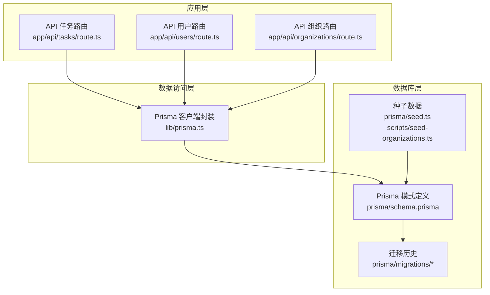
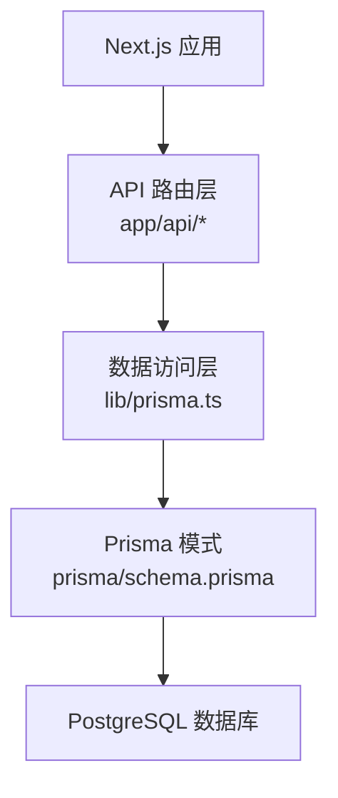
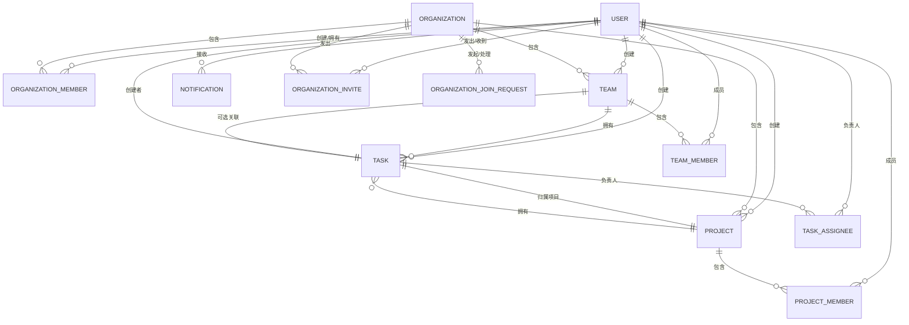

# 数据库设计

<cite>
**本文引用的文件**
- [prisma/schema.prisma](file://prisma/schema.prisma)
- [prisma/seed.ts](file://prisma/seed.ts)
- [prisma/migrations/20251114212844_init/migration.sql](file://prisma/migrations/20251114212844_init/migration.sql)
- [prisma/migrations/20251115201512_add_organization_model/migration.sql](file://prisma/migrations/20251115201512_add_organization_model/migration.sql)
- [prisma/migrations/20251118140218_add_task_creator_and_multiple_assignees/migration.sql](file://prisma/migrations/20251118140218_add_task_creator_and_multiple_assignees/migration.sql)
- [lib/prisma.ts](file://lib/prisma.ts)
- [prisma.config.ts](file://prisma.config.ts)
- [app/api/tasks/route.ts](file://app/api/tasks/route.ts)
- [app/api/users/route.ts](file://app/api/users/route.ts)
- [app/api/organizations/route.ts](file://app/api/organizations/route.ts)
- [scripts/seed-organizations.ts](file://scripts/seed-organizations.ts)
- [deploy/scripts/2-init-database.sh](file://deploy/scripts/2-init-database.sh)
- [package.json](file://package.json)
</cite>

## 目录
1. [简介](#简介)
2. [项目结构](#项目结构)
3. [核心组件](#核心组件)
4. [架构总览](#架构总览)
5. [详细组件分析](#详细组件分析)
6. [依赖分析](#依赖分析)
7. [性能考虑](#性能考虑)
8. [故障排查指南](#故障排查指南)
9. [结论](#结论)
10. [附录](#附录)

## 简介
本文件为日历任务管理系统的数据库设计文档，基于 Prisma ORM 的模式定义与迁移脚本，系统化梳理 User（用户）、Task（任务）、Team（团队）、Project（项目）、Organization（组织）等核心实体的字段、数据类型、约束与关系；明确一对一、一对多、多对多关系及外键约束；给出索引策略、查询优化与性能考量；阐述数据访问模式、缓存策略与一致性保障；说明 Prisma 使用、迁移管理与版本控制；并提供数据生命周期、备份恢复与安全建议，以及数据库初始化脚本与种子数据配置。

## 项目结构
数据库相关的核心位置集中在 prisma 目录，包含：
- 模式定义：prisma/schema.prisma
- 种子数据：prisma/seed.ts、scripts/seed-organizations.ts
- 迁移历史：prisma/migrations 下按时间戳命名的目录
- 客户端封装：lib/prisma.ts
- 配置：prisma.config.ts
- API 层调用 Prisma：app/api/* 路由

图表来源
- [prisma/schema.prisma](file://prisma/schema.prisma#L1-L314)
- [lib/prisma.ts](file://lib/prisma.ts#L1-L12)
- [prisma/migrations/20251114212844_init/migration.sql](file://prisma/migrations/20251114212844_init/migration.sql#L1-L132)
- [prisma/migrations/20251115201512_add_organization_model/migration.sql](file://prisma/migrations/20251115201512_add_organization_model/migration.sql#L1-L99)
- [prisma/migrations/20251118140218_add_task_creator_and_multiple_assignees/migration.sql](file://prisma/migrations/20251118140218_add_task_creator_and_multiple_assignees/migration.sql#L1-L1)
- [prisma/seed.ts](file://prisma/seed.ts#L1-L521)
- [scripts/seed-organizations.ts](file://scripts/seed-organizations.ts#L1-L301)
- [app/api/tasks/route.ts](file://app/api/tasks/route.ts#L1-L497)
- [app/api/users/route.ts](file://app/api/users/route.ts#L1-L132)
- [app/api/organizations/route.ts](file://app/api/organizations/route.ts#L1-L204)

章节来源
- [prisma/schema.prisma](file://prisma/schema.prisma#L1-L314)
- [lib/prisma.ts](file://lib/prisma.ts#L1-L12)
- [prisma.config.ts](file://prisma.config.ts#L1-L14)

## 核心组件
本节从数据模型角度，逐项说明核心实体的字段、类型与约束，并标注关系与索引。

- User（用户）
  - 关键字段：id（主键）、username（唯一）、password、name、email、avatar、gender、role、isAdmin、inviteCode（唯一）、currentOrganizationId、defaultTeamId、points、createdAt、updatedAt
  - 约束：username 唯一；password 默认值；points 默认 0；部分字符串字段允许为空
  - 关系：创建/拥有多个 Organization、Team、Project、Task；作为 TeamMember、ProjectMember、TaskAssignee、Notification、OrganizationInvite 等关系的一部分
  - 索引：Prisma 模式中未显式声明索引，但实际迁移中对常用查询列建立索引（见迁移文件）

- Organization（组织）
  - 关键字段：id（主键）、name（唯一）、description、isVerified、joinRequiresApproval、creatorId、createdAt、updatedAt
  - 约束：name 唯一；joinRequiresApproval 默认 false；isVerified 默认 false
  - 关系：由 User 创建；包含多个 Team、Project、OrganizationMember、OrganizationInvite、OrganizationJoinRequest
  - 索引：对 creatorId、name 建立索引

- Team（团队）
  - 关键字段：id（主键）、name、color、description、organizationId、creatorId、taskPermission、createdAt、updatedAt
  - 约束：taskPermission 默认 ALL_MEMBERS
  - 关系：属于 Organization；创建/拥有多个 TeamMember、Task；可选关联 Task
  - 索引：对 creatorId、organizationId 建立索引

- Project（项目）
  - 关键字段：id（主键）、name、color、description、organizationId、creatorId、taskPermission、createdAt、updatedAt
  - 约束：taskPermission 默认 ALL_MEMBERS
  - 关系：属于 Organization；创建/拥有多个 ProjectMember、Task
  - 索引：对 creatorId、organizationId 建立索引

- Task（任务）
  - 关键字段：id（主键）、title、description、startDate、endDate、startTime、endTime、type（枚举）、color、progress（0-100）、creatorId、projectId、teamId（可空）、createdAt、updatedAt
  - 约束：progress 默认 0；type 为枚举；teamId 可空
  - 关系：属于 Project 与 User（创建者）；多对多通过 TaskAssignee 关联 User；可选关联 Team
  - 索引：对 startDate、endDate、creatorId、projectId、teamId 建立索引

- TaskAssignee（任务负责人关系）
  - 关键字段：id（主键）、taskId、userId、createdAt
  - 约束：唯一索引（taskId, userId）
  - 关系：多对一到 Task 与 User

- TeamMember（团队成员关系）
  - 关键字段：id（主键）、userId、teamId、createdAt
  - 约束：唯一索引（userId, teamId）
  - 关系：多对一到 Team 与 User

- ProjectMember（项目成员关系）
  - 关键字段：id（主键）、userId、projectId、createdAt
  - 约束：唯一索引（userId, projectId）
  - 关系：多对一到 Project 与 User

- Notification（站内通知）
  - 关键字段：id（主键）、userId、type（枚举）、title、content、metadata（JSON）、isRead、createdAt、readAt
  - 约束：isRead 默认 false
  - 关系：多对一到 User

- OrganizationJoinRequest（组织加入申请）
  - 关键字段：id（主键）、organizationId、applicantId、status（枚举）、message、inviterId（可空）、handledBy、handledAt、rejectReason、createdAt、updatedAt
  - 关系：多对一到 Organization、User（applicant、inviter、handler）

- OrganizationInvite（组织邀请）
  - 关键字段：id（主键）、organizationId、inviterId、invitedUserId、status（枚举）、respondedAt、createdAt、updatedAt
  - 关系：多对一到 Organization、User（inviter、invitedUser）

章节来源
- [prisma/schema.prisma](file://prisma/schema.prisma#L16-L314)

## 架构总览
系统采用“模式驱动 + 迁移管理”的数据库架构，Prisma 模式定义实体与关系，迁移脚本落地到 PostgreSQL；应用层通过 lib/prisma.ts 提供单例化的 PrismaClient；API 层在 app/api/* 中以路由函数形式调用 Prisma 实现业务逻辑。

图表来源
- [lib/prisma.ts](file://lib/prisma.ts#L1-L12)
- [prisma/schema.prisma](file://prisma/schema.prisma#L1-L314)
- [app/api/tasks/route.ts](file://app/api/tasks/route.ts#L1-L497)
- [app/api/users/route.ts](file://app/api/users/route.ts#L1-L132)
- [app/api/organizations/route.ts](file://app/api/organizations/route.ts#L1-L204)

## 详细组件分析

### 实体关系图（ERD）

图表来源
- [prisma/schema.prisma](file://prisma/schema.prisma#L16-L314)

### 关系与外键约束
- User 与 OrganizationMember：一对多（级联删除），唯一索引（userId, organizationId）
- Organization 与 Team/Project：一对多（级联删除），Team/Project 外键指向 Organization
- Team 与 TeamMember：一对多（级联删除），唯一索引（userId, teamId）
- Project 与 ProjectMember：一对多（级联删除），唯一索引（userId, projectId）
- Task 与 TaskAssignee：一对多（级联删除），唯一索引（taskId, userId）
- Task 与 User（创建者）、Team、Project：多对一（级联删除或 SET NULL 规则）
- Notification 与 User：多对一（级联删除）
- OrganizationInvite 与 User：多对一（级联删除）
- OrganizationJoinRequest 与 User：多对一（级联删除）

章节来源
- [prisma/schema.prisma](file://prisma/schema.prisma#L16-L314)
- [prisma/migrations/20251114212844_init/migration.sql](file://prisma/migrations/20251114212844_init/migration.sql#L112-L132)
- [prisma/migrations/20251115201512_add_organization_model/migration.sql](file://prisma/migrations/20251115201512_add_organization_model/migration.sql#L82-L99)

### 索引策略与查询优化
- 任务查询常用过滤：startDate、endDate、creatorId、projectId、teamId；模式中已建立复合索引与单列索引
- 组织/团队/项目常用过滤：organizationId、creatorId；模式中已建立索引
- 用户/成员关系：userId、organizationId、teamId、projectId 建有索引
- 通知：userId、isRead、createdAt 建有索引
- 建议：
  - 对高频过滤条件（如任务的日期范围、用户维度查询）保持现有索引
  - 对复杂查询（如跨项目/团队统计）可考虑物化视图或应用侧缓存
  - 分页查询配合 ORDER BY（如按 startDate）使用 LIMIT/OFFSET，避免全表扫描

章节来源
- [prisma/schema.prisma](file://prisma/schema.prisma#L160-L164)
- [prisma/schema.prisma](file://prisma/schema.prisma#L33-L35)
- [prisma/schema.prisma](file://prisma/schema.prisma#L114-L116)
- [prisma/schema.prisma](file://prisma/schema.prisma#L134-L136)
- [prisma/schema.prisma](file://prisma/schema.prisma#L234-L236)
- [prisma/migrations/20251114212844_init/migration.sql](file://prisma/migrations/20251114212844_init/migration.sql#L79-L111)

### 数据访问模式与一致性
- 单例客户端：lib/prisma.ts 提供全局单例 PrismaClient，开发环境降低日志噪声
- API 层：app/api/* 路由中进行鉴权、参数校验、权限检查与数据查询，必要时使用事务（如创建任务时同时写入 Task 与 TaskAssignee）
- 关系查询：通过 Prisma include/where 嵌套查询，减少 N+1 查询风险
- 一致性保障：外键约束与级联规则保证删除一致性；事务用于跨表写入原子性

章节来源
- [lib/prisma.ts](file://lib/prisma.ts#L1-L12)
- [app/api/tasks/route.ts](file://app/api/tasks/route.ts#L396-L455)
- [app/api/tasks/route.ts](file://app/api/tasks/route.ts#L18-L273)
- [app/api/users/route.ts](file://app/api/users/route.ts#L1-L132)
- [app/api/organizations/route.ts](file://app/api/organizations/route.ts#L1-L204)

### 缓存策略与数据一致性
- 读多写少场景：对用户列表、组织列表、项目/团队成员列表可引入短期缓存（如 Redis），结合 TTL 与失效策略
- 写后读一致性：对高并发写入（如任务创建/分配）采用强一致读，或在写入后主动失效相关缓存键
- 通知与统计：通知列表按用户与状态分页查询，可结合游标分页与本地缓存热点数据

（本节为通用指导，不直接分析具体文件）

### Prisma 使用、迁移管理与版本控制
- 模式定义：prisma/schema.prisma 描述实体、关系、枚举与索引
- 客户端生成：package.json 中包含 @prisma/client 与 prisma
- 配置：prisma.config.ts 指定 schema、migrations 路径与 datasource
- 迁移：按时间戳命名的目录，每次变更生成新迁移；迁移锁定文件防止并发冲突
- 初始化：deploy/scripts/2-init-database.sh 通过 docker-compose 启动 Postgres 并执行 SQL 更新脚本

章节来源
- [package.json](file://package.json#L11-L75)
- [prisma.config.ts](file://prisma.config.ts#L1-L14)
- [prisma/schema.prisma](file://prisma/schema.prisma#L1-L314)
- [prisma/migrations/20251114212844_init/migration.sql](file://prisma/migrations/20251114212844_init/migration.sql#L1-L132)
- [prisma/migrations/20251115201512_add_organization_model/migration.sql](file://prisma/migrations/20251115201512_add_organization_model/migration.sql#L1-L99)
- [prisma/migrations/20251118140218_add_task_creator_and_multiple_assignees/migration.sql](file://prisma/migrations/20251118140218_add_task_creator_and_multiple_assignees/migration.sql#L1-L1)
- [deploy/scripts/2-init-database.sh](file://deploy/scripts/2-init-database.sh#L1-L83)

### 数据生命周期管理、备份恢复与安全
- 生命周期：通过外键级联删除管理软/硬删除；建议在业务层引入软删除标记与回收站机制
- 备份恢复：定期导出 SQL 或使用数据库快照；部署脚本 deploy/scripts/2-init-database.sh 展示了数据库初始化流程
- 安全：密码字段使用加密存储；API 层进行鉴权与权限校验；敏感字段（如邮箱）避免过度暴露

章节来源
- [app/api/tasks/route.ts](file://app/api/tasks/route.ts#L332-L348)
- [app/api/organizations/route.ts](file://app/api/organizations/route.ts#L119-L130)
- [deploy/scripts/2-init-database.sh](file://deploy/scripts/2-init-database.sh#L1-L83)

### 数据库初始化脚本与种子数据
- 初始化脚本：deploy/scripts/2-init-database.sh 启动 Postgres 容器、创建数据库、执行 SQL 更新脚本
- 种子数据：
  - prisma/seed.ts：创建用户、团队、项目、任务的最小演示数据
  - scripts/seed-organizations.ts：创建组织、成员、团队、项目与任务的示例数据，并输出登录凭据

章节来源
- [deploy/scripts/2-init-database.sh](file://deploy/scripts/2-init-database.sh#L1-L83)
- [prisma/seed.ts](file://prisma/seed.ts#L1-L521)
- [scripts/seed-organizations.ts](file://scripts/seed-organizations.ts#L1-L301)

## 依赖分析
- 外部依赖：PostgreSQL（数据源）、Prisma（ORM）、Next.js（应用框架）
- 内部依赖：API 路由依赖 lib/prisma.ts 提供的 PrismaClient；PrismaClient 依赖 schema.prisma 的模式定义；迁移脚本驱动数据库结构演进

图表来源
- [package.json](file://package.json#L11-L75)
- [prisma.config.ts](file://prisma.config.ts#L1-L14)
- [prisma/schema.prisma](file://prisma/schema.prisma#L1-L314)
- [lib/prisma.ts](file://lib/prisma.ts#L1-L12)

章节来源
- [package.json](file://package.json#L11-L75)
- [prisma.config.ts](file://prisma.config.ts#L1-L14)
- [lib/prisma.ts](file://lib/prisma.ts#L1-L12)

## 性能考虑
- 查询路径优化：利用现有索引（任务日期范围、用户/组织/团队/项目维度）减少全表扫描
- 写入路径优化：批量插入（如种子数据）与事务写入（任务创建）提升吞吐
- 缓存策略：热点数据（用户列表、组织列表、通知）引入短期缓存，写后失效
- 分页与排序：ORDER BY + LIMIT/OFFSET，避免一次性加载大量数据
- 连接池与日志：生产环境关闭冗余日志，合理配置连接池大小

（本节为通用指导，不直接分析具体文件）

## 故障排查指南
- 迁移失败：检查 prisma/migrations/* 的 SQL 语句与依赖顺序；确认迁移锁定文件未损坏
- 权限不足：API 层对组织/项目/团队成员身份进行校验，若报错需确认当前用户是否在目标组织/团队/项目中
- 查询异常：核对 where 条件与索引覆盖情况；关注日期范围过滤与 OR/AND 组合逻辑
- 初始化问题：deploy/scripts/2-init-database.sh 中检查数据库容器状态、SQL 脚本路径与数据库是否存在

章节来源
- [app/api/tasks/route.ts](file://app/api/tasks/route.ts#L52-L63)
- [app/api/tasks/route.ts](file://app/api/tasks/route.ts#L100-L122)
- [app/api/tasks/route.ts](file://app/api/tasks/route.ts#L180-L217)
- [deploy/scripts/2-init-database.sh](file://deploy/scripts/2-init-database.sh#L38-L70)

## 结论
本数据库设计以 Prisma 模式为核心，通过迁移脚本演进至支持组织/团队/项目的三层结构，并以多对多关系扩展任务负责人机制。通过合理的索引、权限校验与事务写入，兼顾查询性能与数据一致性。配合种子数据与部署脚本，可快速完成本地与生产环境初始化。建议在高并发场景引入缓存与分页策略，在运维层面完善备份与监控。

## 附录
- 字段与约束速览（摘自模式定义）
  - User：username 唯一、password 默认空串、points 默认 0、currentOrganizationId/inviteCode 唯一
  - Organization：name 唯一、joinRequiresApproval/isVerified 默认 false
  - Team/Project：taskPermission 默认 ALL_MEMBERS
  - Task：progress 默认 0、type 为枚举、teamId 可空
  - TaskAssignee/TeamMember/ProjectMember：唯一索引（联合主键）
  - Notification：isRead 默认 false

章节来源
- [prisma/schema.prisma](file://prisma/schema.prisma#L64-L96)
- [prisma/schema.prisma](file://prisma/schema.prisma#L16-L35)
- [prisma/schema.prisma](file://prisma/schema.prisma#L98-L136)
- [prisma/schema.prisma](file://prisma/schema.prisma#L138-L164)
- [prisma/schema.prisma](file://prisma/schema.prisma#L166-L178)
- [prisma/schema.prisma](file://prisma/schema.prisma#L193-L219)
- [prisma/schema.prisma](file://prisma/schema.prisma#L221-L236)