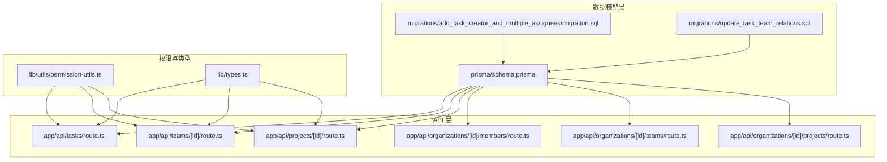
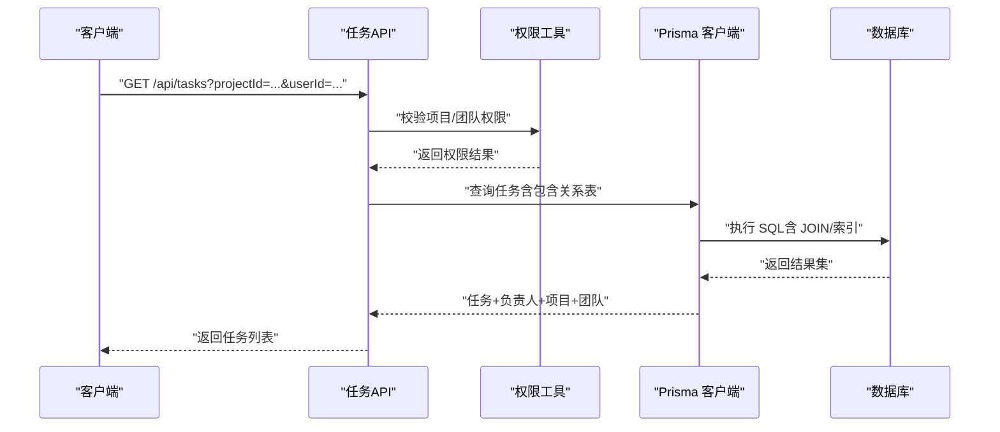
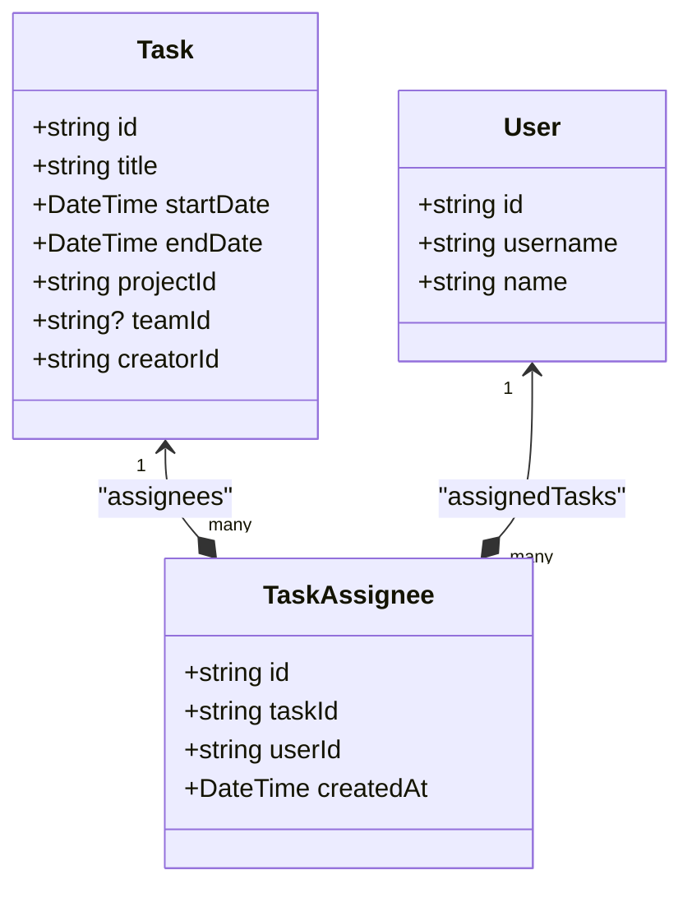
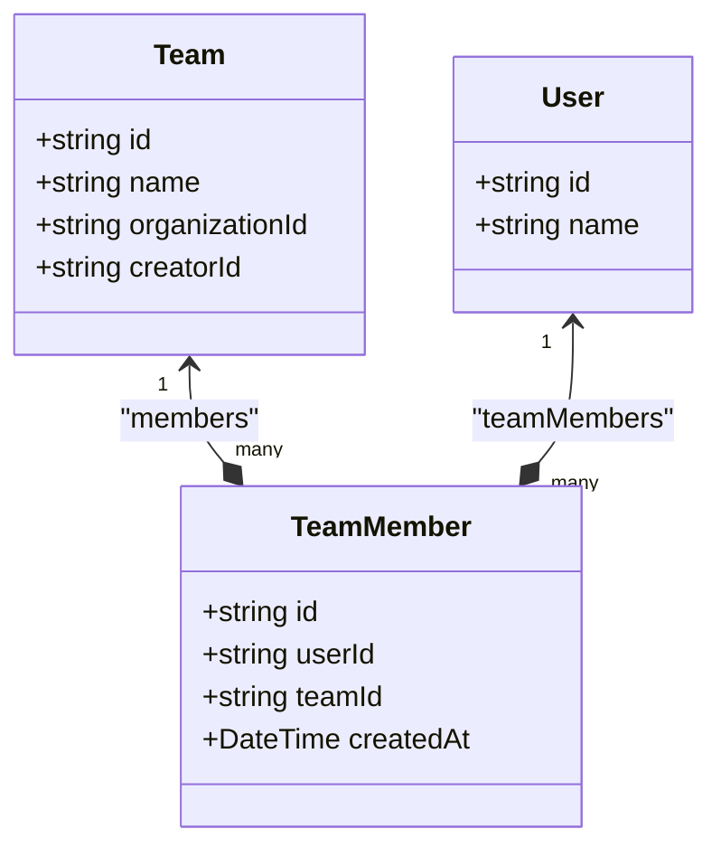
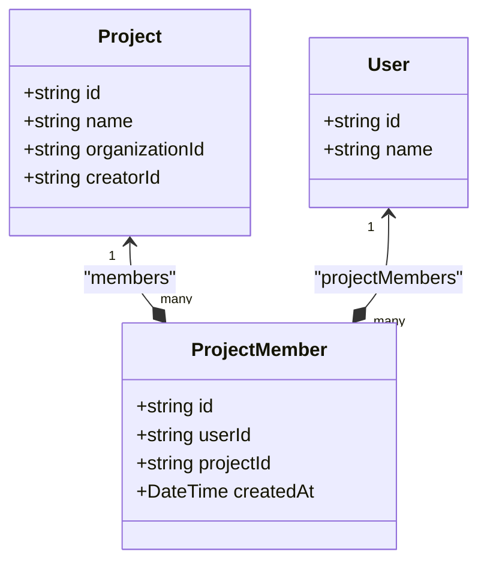
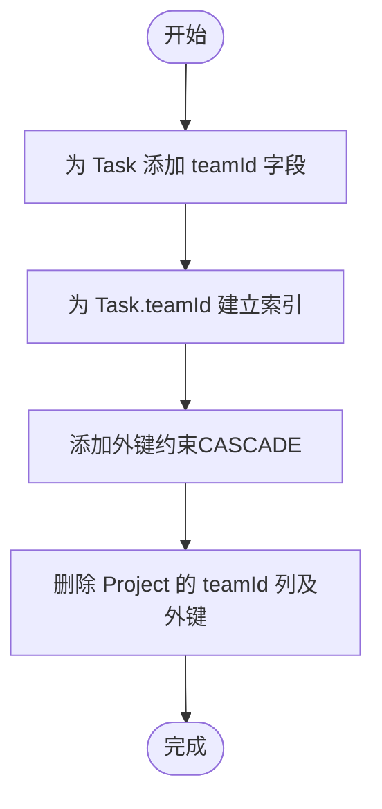
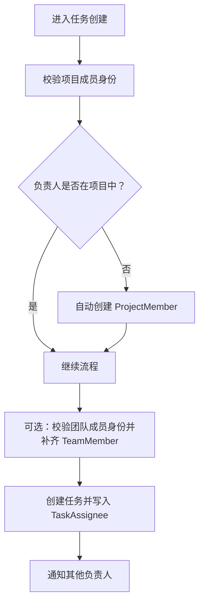

# 关系模型

<cite>
**本文引用的文件**
- [prisma/schema.prisma](file://prisma/schema.prisma)
- [prisma/migrations/update_task_team_relations.sql](file://prisma/migrations/update_task_team_relations.sql)
- [prisma/migrations/add_task_creator_and_multiple_assignees/migration.sql](file://prisma/migrations/add_task_creator_and_multiple_assignees/migration.sql)
- [app/api/tasks/route.ts](file://app/api/tasks/route.ts)
- [app/api/teams/[id]/route.ts](file://app/api/teams/[id]/route.ts)
- [app/api/projects/[id]/route.ts](file://app/api/projects/[id]/route.ts)
- [lib/utils/permission-utils.ts](file://lib/utils/permission-utils.ts)
- [lib/types.ts](file://lib/types.ts)
- [app/api/organizations/[id]/members/route.ts](file://app/api/organizations/[id]/members/route.ts)
- [app/api/organizations/[id]/teams/route.ts](file://app/api/organizations/[id]/teams/route.ts)
- [app/api/organizations/[id]/projects/route.ts](file://app/api/organizations/[id]/projects/route.ts)
</cite>

## 目录
1. [简介](#简介)
2. [项目结构](#项目结构)
3. [核心组件](#核心组件)
4. [架构总览](#架构总览)
5. [详细组件分析](#详细组件分析)
6. [依赖分析](#依赖分析)
7. [性能考虑](#性能考虑)
8. [故障排查指南](#故障排查指南)
9. [结论](#结论)

## 简介
本文件系统性梳理本项目的关系模型设计与实现，重点围绕多对多关系表：TaskAssignee（任务负责人关系）、TeamMember（团队成员关系）、ProjectMember（项目成员关系）。我们将从数据库层的模型定义与约束、迁移脚本的演进、API 层的权限校验与业务流程，到前端交互与性能优化策略进行全链路解析，帮助读者理解如何通过关系表实现灵活的多对多关联，并在权限控制、任务分配与团队协作场景中落地。

## 项目结构
本项目采用 Prisma 作为 ORM，关系模型在 schema 中集中定义；API 层通过中间件与权限工具函数进行访问控制；类型系统统一了前后端契约。下图展示与关系模型相关的核心文件与职责：



图表来源
- [prisma/schema.prisma](file://prisma/schema.prisma#L166-L219)
- [prisma/migrations/add_task_creator_and_multiple_assignees/migration.sql](file://prisma/migrations/add_task_creator_and_multiple_assignees/migration.sql#L1-L44)
- [prisma/migrations/update_task_team_relations.sql](file://prisma/migrations/update_task_team_relations.sql#L1-L22)
- [app/api/tasks/route.ts](file://app/api/tasks/route.ts#L1-L497)
- [app/api/teams/[id]/route.ts](file://app/api/teams/[id]/route.ts#L1-L221)
- [app/api/projects/[id]/route.ts](file://app/api/projects/[id]/route.ts#L1-L283)
- [lib/utils/permission-utils.ts](file://lib/utils/permission-utils.ts#L1-L72)
- [lib/types.ts](file://lib/types.ts#L1-L141)

章节来源
- [prisma/schema.prisma](file://prisma/schema.prisma#L166-L219)
- [prisma/migrations/add_task_creator_and_multiple_assignees/migration.sql](file://prisma/migrations/add_task_creator_and_multiple_assignees/migration.sql#L1-L44)
- [prisma/migrations/update_task_team_relations.sql](file://prisma/migrations/update_task_team_relations.sql#L1-L22)
- [app/api/tasks/route.ts](file://app/api/tasks/route.ts#L1-L497)
- [lib/utils/permission-utils.ts](file://lib/utils/permission-utils.ts#L1-L72)
- [lib/types.ts](file://lib/types.ts#L1-L141)

## 核心组件
本节聚焦三张核心关系表及其字段、约束与业务规则，以及它们如何支撑多对多关联与权限控制。

- TaskAssignee（任务负责人关系）
  - 字段与含义
    - id：关系主键
    - taskId：指向 Task 的外键
    - userId：指向 User 的外键
    - createdAt：创建时间
  - 约束与索引
    - 唯一性：(taskId, userId) 唯一键，保证同一任务的同一负责人不重复
    - 索引：分别对 taskId、userId 建立索引，支持按任务/用户快速检索
    - 外键：Cascade 删除，当任务或用户被删除时，关系自动清理
  - 业务规则
    - 一个任务可有多个负责人，一个用户可负责多个任务
    - 通过关系表实现“任务-负责人”的灵活多对多
  - 级联行为
    - 删除任务或用户时，自动删除对应关系，避免悬挂数据

- TeamMember（团队成员关系）
  - 字段与含义
    - id：关系主键
    - userId：指向 User 的外键
    - teamId：指向 Team 的外键
    - createdAt：创建时间
  - 约束与索引
    - 唯一性：(userId, teamId) 唯一键，防止重复加入
    - 索引：分别对 userId、teamId 建立索引
    - 外键：Cascade 删除
  - 业务规则
    - 团队成员关系随团队与用户生命周期同步
    - 用于权限判定（如能否在团队内创建/编辑任务）

- ProjectMember（项目成员关系）
  - 字段与含义
    - id：关系主键
    - userId：指向 User 的外键
    - projectId：指向 Project 的外键
    - createdAt：创建时间
  - 约束与索引
    - 唯一性：(userId, projectId) 唯一键
    - 索引：分别对 userId、projectId 建立索引
    - 外键：Cascade 删除
  - 业务规则
    - 项目成员关系决定用户对项目内任务的操作权限
    - 与任务创建/分配时的自动补齐逻辑配合

章节来源
- [prisma/schema.prisma](file://prisma/schema.prisma#L166-L178)
- [prisma/schema.prisma](file://prisma/schema.prisma#L194-L205)
- [prisma/schema.prisma](file://prisma/schema.prisma#L208-L219)

## 架构总览
下图展示关系模型在数据层与 API 层的交互路径，以及权限工具如何参与决策：



图表来源
- [app/api/tasks/route.ts](file://app/api/tasks/route.ts#L18-L273)
- [lib/utils/permission-utils.ts](file://lib/utils/permission-utils.ts#L11-L59)

章节来源
- [app/api/tasks/route.ts](file://app/api/tasks/route.ts#L18-L273)
- [lib/utils/permission-utils.ts](file://lib/utils/permission-utils.ts#L11-L59)

## 详细组件分析

### TaskAssignee（任务负责人关系）分析
- 数据模型与关系
  - TaskAssignee 通过外键与 Task、User 建立多对多关系
  - Task.assignees 与 User.assignedTasks 分别暴露为包含关系，便于 API 返回时一并加载
- 级联与唯一性
  - 外键删除策略：Cascade，保障数据一致性
  - 唯一键：(taskId, userId)，避免重复负责人
  - 索引：对 taskId、userId 建立索引，提升查询效率
- 迁移演进
  - 早期版本将负责人直接存于 Task.userId，迁移后改为关系表，支持多负责人
  - 迁移同时为 Task 添加 creatorId 并建立外键约束
- API 用法
  - 任务创建时，API 会根据传入的负责人集合批量写入 TaskAssignee
  - 任务查询时，API 通过 include 关联加载 assignees 及其 user 信息
  - 任务列表接口支持按 userId、projectId、teamId、organizationId 等维度过滤，并进行权限校验



图表来源
- [prisma/schema.prisma](file://prisma/schema.prisma#L139-L164)
- [prisma/schema.prisma](file://prisma/schema.prisma#L65-L96)
- [prisma/schema.prisma](file://prisma/schema.prisma#L167-L178)

章节来源
- [prisma/schema.prisma](file://prisma/schema.prisma#L139-L164)
- [prisma/schema.prisma](file://prisma/schema.prisma#L65-L96)
- [prisma/schema.prisma](file://prisma/schema.prisma#L167-L178)
- [prisma/migrations/add_task_creator_and_multiple_assignees/migration.sql](file://prisma/migrations/add_task_creator_and_multiple_assignees/migration.sql#L1-L44)
- [app/api/tasks/route.ts](file://app/api/tasks/route.ts#L350-L455)

### TeamMember（团队成员关系）分析
- 数据模型与关系
  - TeamMember 将 User 与 Team 解耦，支持用户在不同团队的成员身份
  - Team.members 与 User.teamMembers 分别暴露为包含关系
- 级联与唯一性
  - 外键删除策略：Cascade
  - 唯一键：(userId, teamId)
  - 索引：对 userId、teamId 建立索引
- API 用法
  - 团队更新接口支持成员变更：计算差集并批量增删 TeamMember
  - 团队删除接口使用事务，先删除团队，再级联删除 TeamMember，并向成员发送通知



图表来源
- [prisma/schema.prisma](file://prisma/schema.prisma#L99-L116)
- [prisma/schema.prisma](file://prisma/schema.prisma#L65-L96)
- [prisma/schema.prisma](file://prisma/schema.prisma#L194-L205)

章节来源
- [prisma/schema.prisma](file://prisma/schema.prisma#L99-L116)
- [prisma/schema.prisma](file://prisma/schema.prisma#L65-L96)
- [prisma/schema.prisma](file://prisma/schema.prisma#L194-L205)
- [app/api/teams/[id]/route.ts](file://app/api/teams/[id]/route.ts#L78-L130)
- [app/api/teams/[id]/route.ts](file://app/api/teams/[id]/route.ts#L185-L213)

### ProjectMember（项目成员关系）分析
- 数据模型与关系
  - ProjectMember 将 User 与 Project 解耦，支持用户在不同项目的成员身份
  - Project.members 与 User.projectMembers 分别暴露为包含关系
- 级联与唯一性
  - 外键删除策略：Cascade
  - 唯一键：(userId, projectId)
  - 索引：对 userId、projectId 建立索引
- API 用法
  - 项目更新接口支持成员变更：计算差集并批量增删 ProjectMember
  - 项目删除接口使用事务，先删除项目，再级联删除 ProjectMember，并向成员发送通知
  - 任务创建时，若负责人不在项目中，API 会自动补齐 ProjectMember



图表来源
- [prisma/schema.prisma](file://prisma/schema.prisma#L119-L136)
- [prisma/schema.prisma](file://prisma/schema.prisma#L65-L96)
- [prisma/schema.prisma](file://prisma/schema.prisma#L208-L219)

章节来源
- [prisma/schema.prisma](file://prisma/schema.prisma#L119-L136)
- [prisma/schema.prisma](file://prisma/schema.prisma#L65-L96)
- [prisma/schema.prisma](file://prisma/schema.prisma#L208-L219)
- [app/api/projects/[id]/route.ts](file://app/api/projects/[id]/route.ts#L130-L180)
- [app/api/projects/[id]/route.ts](file://app/api/projects/[id]/route.ts#L247-L275)
- [app/api/tasks/route.ts](file://app/api/tasks/route.ts#L353-L365)

### 任务-团队关联的演进与约束
- 迁移说明
  - 新增 Task.teamId 字段，建立外键约束，删除 Project 的 teamId 字段
  - 为 Task.teamId 建立索引，提升查询效率
- 业务影响
  - 任务可选择性地关联到团队，但项目不再与团队耦合
  - 团队与项目为独立实体，通过关系表实现灵活组合



图表来源
- [prisma/migrations/update_task_team_relations.sql](file://prisma/migrations/update_task_team_relations.sql#L1-L22)

章节来源
- [prisma/migrations/update_task_team_relations.sql](file://prisma/migrations/update_task_team_relations.sql#L1-L22)
- [prisma/schema.prisma](file://prisma/schema.prisma#L155-L156)

### 权限控制与业务规则
- 项目/团队任务协同权限
  - ALL_MEMBERS：项目/团队成员均可管理任务（包括修改负责人、归属项目等）
  - CREATOR_ONLY：仅创建者可管理任务
  - 工具函数提供统一的权限判定与错误消息
- API 层权限校验
  - 任务列表：按团队/项目/用户维度过滤前，先校验用户是否为成员
  - 任务创建：校验项目成员身份，必要时自动补齐 ProjectMember 与 TeamMember
  - 团队/项目更新：支持成员变更，内部通过差集计算批量增删关系
  - 组织成员管理：支持自助加入、管理员添加/移除、退出组织时的清理与通知



图表来源
- [app/api/tasks/route.ts](file://app/api/tasks/route.ts#L332-L455)
- [lib/utils/permission-utils.ts](file://lib/utils/permission-utils.ts#L11-L59)

章节来源
- [lib/utils/permission-utils.ts](file://lib/utils/permission-utils.ts#L11-L59)
- [app/api/tasks/route.ts](file://app/api/tasks/route.ts#L332-L455)
- [app/api/teams/[id]/route.ts](file://app/api/teams/[id]/route.ts#L78-L130)
- [app/api/projects/[id]/route.ts](file://app/api/projects/[id]/route.ts#L130-L180)

## 依赖分析
- 模型依赖
  - Task 依赖 Project、Team、User（创建者），并通过 TaskAssignee 间接依赖 User
  - Team、Project 通过 TeamMember、ProjectMember 间接依赖 User
- API 依赖
  - 任务 API 依赖权限工具与类型定义
  - 团队/项目 API 依赖关系表进行成员增删
- 外键与索引
  - 外键删除策略统一为 Cascade，确保级联清理
  - 关系表均建立唯一键与索引，保证查询与去重效率

```mermaid
erDiagram
USER {
string id PK
string username
string name
}
TASK {
string id PK
string title
datetime startDate
datetime endDate
string projectId FK
string? teamId FK
string creatorId FK
}
PROJECT {
string id PK
string name
string organizationId FK
string creatorId FK
}
TEAM {
string id PK
string name
string organizationId FK
string creatorId FK
}
TASKASSIGNEE {
string id PK
string taskId FK
string userId FK
}
TEAM_MEMBER {
string id PK
string userId FK
string teamId FK
}
PROJECT_MEMBER {
string id PK
string userId FK
string projectId FK
}
USER ||--o{ TASKASSIGNEE : "assignees"
TASKASSIGNEE }o--|| USER : "user"
TASK }o--|| PROJECT : "project"
TASK }o--|| TEAM : "team"
USER ||--o{ TEAM_MEMBER : "teamMembers"
TEAM_MEMBER }o--|| TEAM : "team"
USER ||--o{ PROJECT_MEMBER : "projectMembers"
PROJECT_MEMBER }o--|| PROJECT : "project"
```

图表来源
- [prisma/schema.prisma](file://prisma/schema.prisma#L65-L96)
- [prisma/schema.prisma](file://prisma/schema.prisma#L139-L164)
- [prisma/schema.prisma](file://prisma/schema.prisma#L119-L136)
- [prisma/schema.prisma](file://prisma/schema.prisma#L99-L116)
- [prisma/schema.prisma](file://prisma/schema.prisma#L167-L178)
- [prisma/schema.prisma](file://prisma/schema.prisma#L194-L205)
- [prisma/schema.prisma](file://prisma/schema.prisma#L208-L219)

章节来源
- [prisma/schema.prisma](file://prisma/schema.prisma#L65-L96)
- [prisma/schema.prisma](file://prisma/schema.prisma#L139-L164)
- [prisma/schema.prisma](file://prisma/schema.prisma#L119-L136)
- [prisma/schema.prisma](file://prisma/schema.prisma#L99-L116)
- [prisma/schema.prisma](file://prisma/schema.prisma#L167-L178)
- [prisma/schema.prisma](file://prisma/schema.prisma#L194-L205)
- [prisma/schema.prisma](file://prisma/schema.prisma#L208-L219)

## 性能考虑
- 索引策略
  - 关系表：为 (taskId, userId)、(userId, teamId)、(userId, projectId) 建立唯一索引，避免重复并加速查询
  - 关系表：分别为 taskId、userId、teamId、projectId 建立二级索引，支持按对象快速定位关系
  - Task：为 startDate、endDate、creatorId、teamId 建立索引，满足任务列表与过滤场景
- 外键删除策略
  - 全部采用 Cascade，减少悬挂数据，简化 GC 逻辑
- 查询优化
  - API 在查询任务时使用 include 关联关系表，建议在高并发场景下结合分页与缓存
  - 对高频过滤条件（如 userId、projectId、teamId、organizationId）尽量走索引路径

## 故障排查指南
- 常见问题与定位
  - 重复负责人：插入 TaskAssignee 时报唯一键冲突，检查 (taskId, userId) 是否已存在
  - 无权限访问：任务列表/任务创建返回权限错误，检查用户是否为项目/团队成员
  - 外键约束失败：删除用户/团队/项目时报外键约束，确认是否仍有关系记录未清理
- 排查步骤
  - 核对关系表唯一键与索引是否正确创建
  - 检查 API 中的权限校验逻辑与类型定义是否一致
  - 使用数据库审计工具核对外键删除策略是否生效

章节来源
- [app/api/tasks/route.ts](file://app/api/tasks/route.ts#L51-L63)
- [app/api/tasks/route.ts](file://app/api/tasks/route.ts#L100-L112)
- [app/api/tasks/route.ts](file://app/api/tasks/route.ts#L133-L167)
- [prisma/schema.prisma](file://prisma/schema.prisma#L167-L178)
- [prisma/schema.prisma](file://prisma/schema.prisma#L194-L205)
- [prisma/schema.prisma](file://prisma/schema.prisma#L208-L219)

## 结论
本项目通过 TaskAssignee、TeamMember、ProjectMember 三张关系表，实现了用户与任务、团队、项目的灵活多对多关联。配合外键 Cascade 删除策略、唯一键与索引，既保证了数据一致性，又提升了查询性能。API 层在权限校验、成员补齐与通知机制方面形成闭环，确保在权限控制、任务分配与团队协作场景中具备良好的可维护性与扩展性。