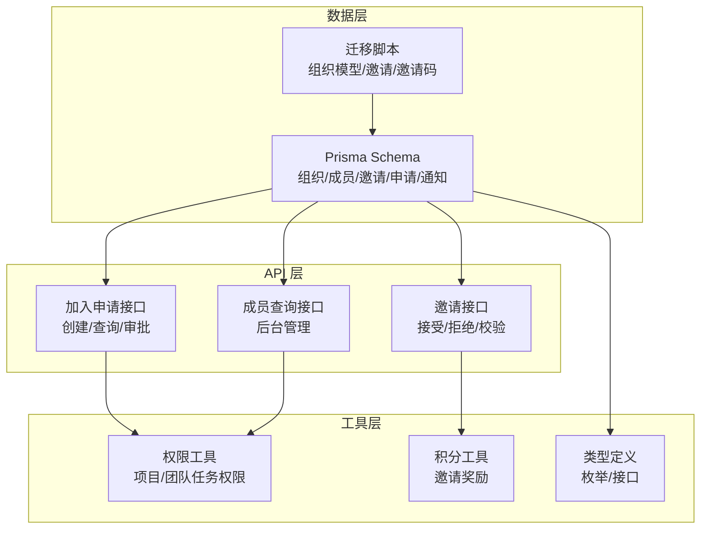
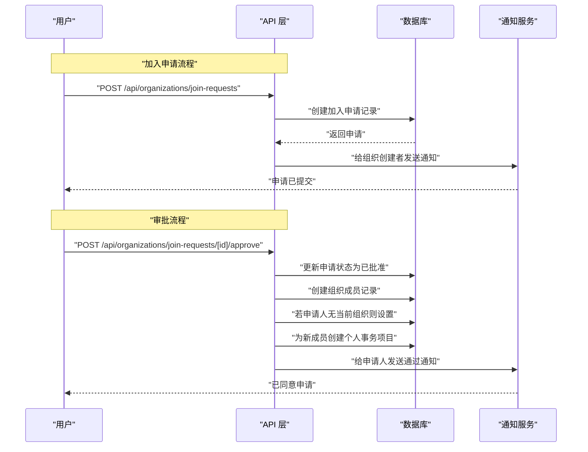
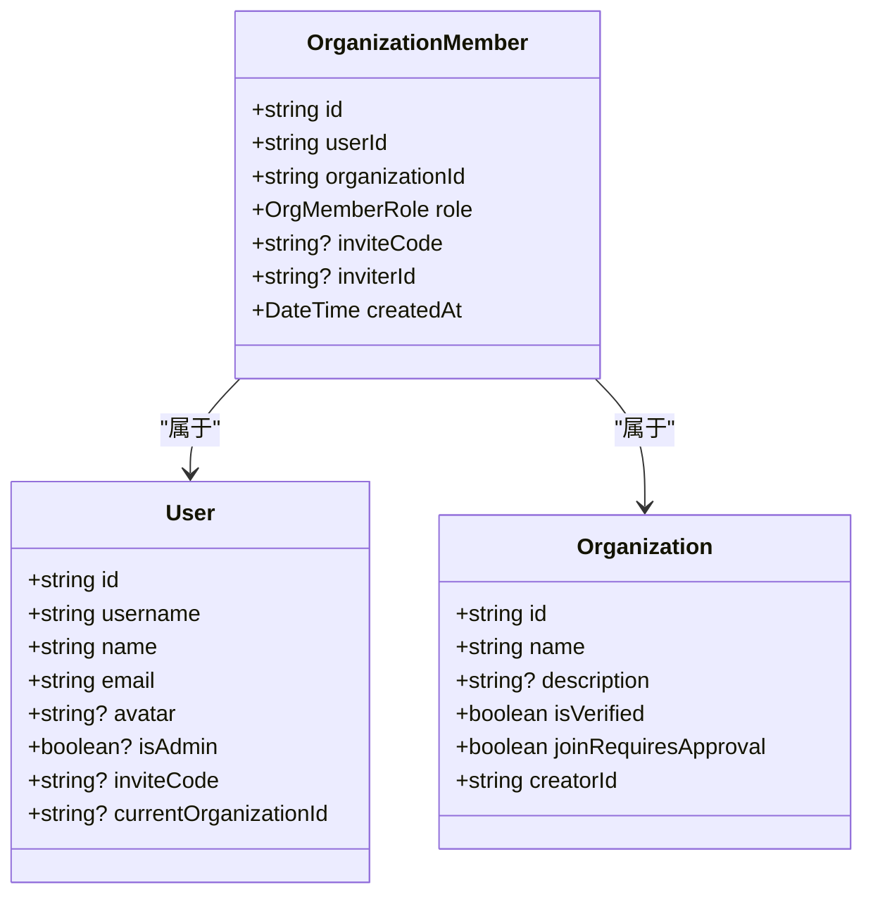
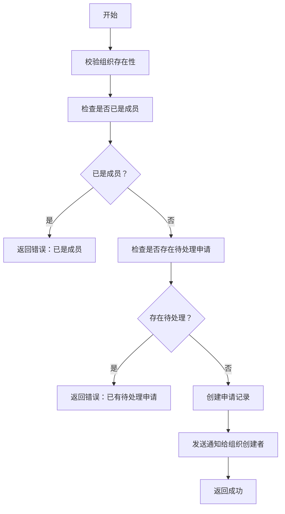
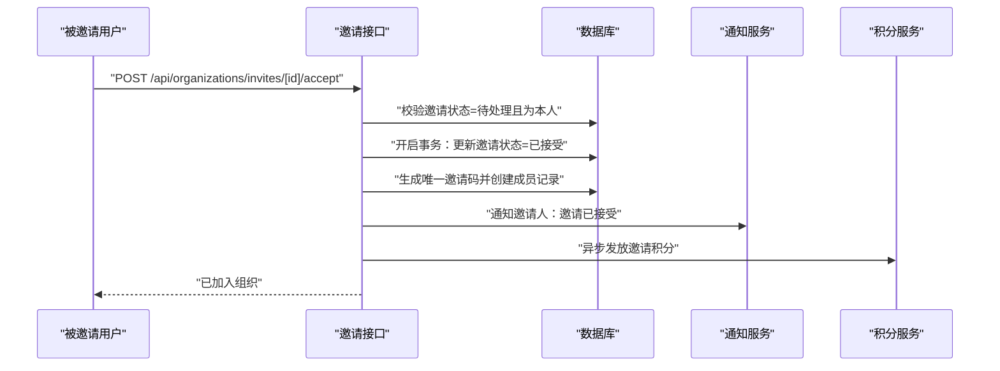
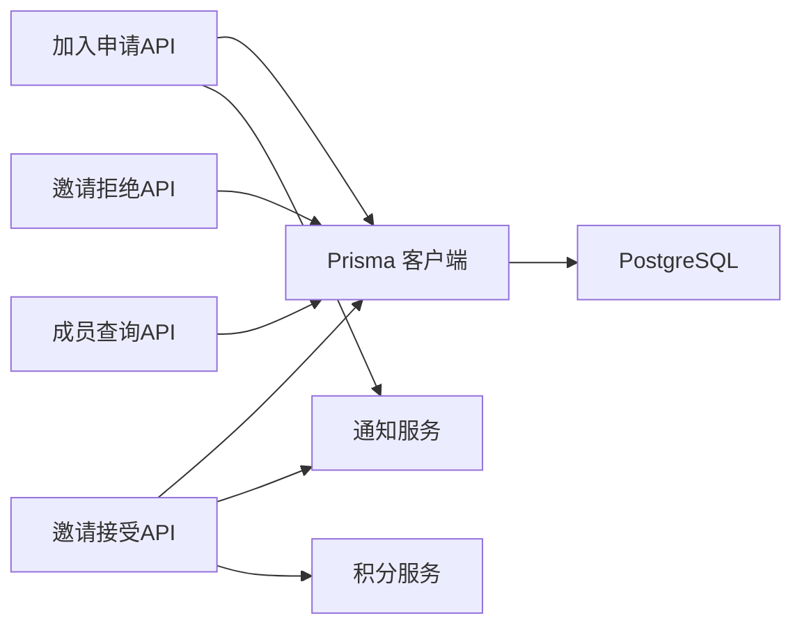
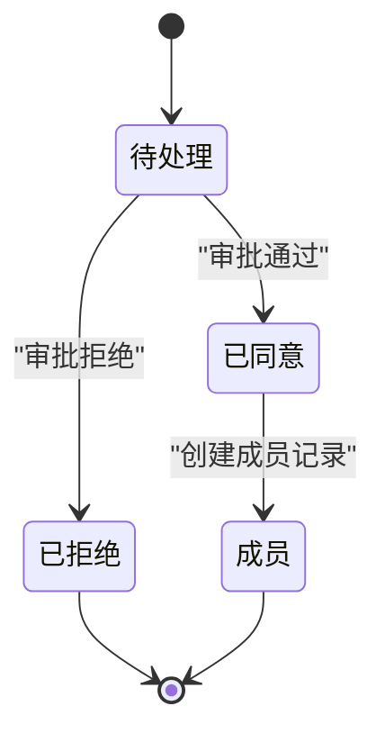

# 成员管理模型

<cite>
**本文引用的文件**
- [prisma/schema.prisma](file://prisma/schema.prisma)
- [prisma/migrations/20251115201512_add_organization_model/migration.sql](file://prisma/migrations/20251115201512_add_organization_model/migration.sql)
- [prisma/migrations/20251119131625_add_organization_invite/migration.sql](file://prisma/migrations/20251119131625_add_organization_invite/migration.sql)
- [prisma/migrations/20251118190313_add_invite_code_and_inviter/migration.sql](file://prisma/migrations/20251118190313_add_invite_code_and_inviter/migration.sql)
- [prisma/migrations/20251118192501_add_invite_code_to_organization_member/migration.sql](file://prisma/migrations/20251118192501_add_invite_code_to_organization_member/migration.sql)
- [app/api/organizations/join-requests/route.ts](file://app/api/organizations/join-requests/route.ts)
- [app/api/organizations/join-requests/[id]/approve/route.ts](file://app/api/organizations/join-requests/[id]/approve/route.ts)
- [app/api/organizations/join-requests/[id]/reject/route.ts](file://app/api/organizations/join-requests/[id]/reject/route.ts)
- [app/api/organizations/invites/[id]/accept/route.ts](file://app/api/organizations/invites/[id]/accept/route.ts)
- [app/api/organizations/invites/[id]/reject/route.ts](file://app/api/organizations/invites/[id]/reject/route.ts)
- [app/api/admin/panorama/organizations/[id]/members/route.ts](file://app/api/admin/panorama/organizations/[id]/members/route.ts)
- [lib/utils/permission-utils.ts](file://lib/utils/permission-utils.ts)
- [lib/utils/points.ts](file://lib/utils/points.ts)
- [lib/types.ts](file://lib/types.ts)
</cite>

## 目录
1. [简介](#简介)
2. [项目结构](#项目结构)
3. [核心组件](#核心组件)
4. [架构总览](#架构总览)
5. [详细组件分析](#详细组件分析)
6. [依赖分析](#依赖分析)
7. [性能考量](#性能考量)
8. [故障排查指南](#故障排查指南)
9. [结论](#结论)
10. [附录](#附录)

## 简介
本文件系统化梳理成员管理模型，围绕组织成员、加入申请与邀请三大核心实体，解释其数据结构、业务规则、状态流转与权限控制，并结合任务权限、团队协作与项目管理的关系进行说明。同时给出邀请码系统的设计原理与安全建议，以及审批流程与用户体验设计要点。

## 项目结构
成员管理相关代码主要分布在以下位置：
- 数据模型定义：Prisma Schema 与迁移脚本
- API 层：组织加入申请、邀请处理、成员查询等接口
- 权限与积分工具：任务权限判断、邀请积分发放等

图表来源
- [prisma/schema.prisma](file://prisma/schema.prisma#L16-L314)
- [prisma/migrations/20251115201512_add_organization_model/migration.sql](file://prisma/migrations/20251115201512_add_organization_model/migration.sql#L31-L99)
- [app/api/organizations/join-requests/route.ts](file://app/api/organizations/join-requests/route.ts#L6-L200)
- [app/api/organizations/invites/[id]/accept/route.ts](file://app/api/organizations/invites/[id]/accept/route.ts#L13-L147)
- [lib/utils/permission-utils.ts](file://lib/utils/permission-utils.ts#L1-L72)
- [lib/utils/points.ts](file://lib/utils/points.ts#L93-L99)
- [lib/types.ts](file://lib/types.ts#L5-L28)

章节来源
- [prisma/schema.prisma](file://prisma/schema.prisma#L16-L314)
- [prisma/migrations/20251115201512_add_organization_model/migration.sql](file://prisma/migrations/20251115201512_add_organization_model/migration.sql#L31-L99)

## 核心组件
- 组织（Organization）：组织基本信息、是否需要审批、创建者、成员/团队/项目/申请/邀请集合
- 组织成员（OrganizationMember）：用户与组织的多对多关系，含角色、邀请码、邀请人
- 加入申请（OrganizationJoinRequest）：申请人、组织、状态、处理人、邀请人溯源、拒绝原因
- 组织邀请（OrganizationInvite）：邀请发起人、被邀请人、组织、状态、响应时间
- 通知（Notification）：申请/邀请相关事件的通知类型与元数据
- 任务权限（TaskPermission）：项目/团队的任务协同权限策略
- 角色枚举（OrgMemberRole）：所有者、管理员、普通成员

章节来源
- [prisma/schema.prisma](file://prisma/schema.prisma#L16-L314)
- [lib/types.ts](file://lib/types.ts#L3-L6)

## 架构总览
成员管理涉及“申请—审批—入会”和“邀请—接受/拒绝—入会”两条主路径，均通过数据库事务保证一致性，并在关键节点发送站内通知。邀请码贯穿成员关系与邀请流程，用于邀请链接验证与成员识别。

图表来源
- [app/api/organizations/join-requests/route.ts](file://app/api/organizations/join-requests/route.ts#L6-L112)
- [app/api/organizations/join-requests/[id]/approve/route.ts](file://app/api/organizations/join-requests/[id]/approve/route.ts#L6-L154)
- [prisma/schema.prisma](file://prisma/schema.prisma#L256-L285)

## 详细组件分析

### 组织成员关系（OrganizationMember）
- 字段要点
  - 关系键：userId、organizationId
  - 角色：默认普通成员，支持所有者/管理员/成员
  - 邀请码：每成员在组织内的唯一邀请码，用于邀请链接与成员识别
  - 邀请人：记录邀请该成员的用户
  - 时间戳：创建时间
- 约束与索引
  - 用户-组织唯一约束
  - 用户、组织、邀请人、邀请码索引
- 业务规则
  - 每个用户在任一组织只能有一条成员记录
  - 邀请码全局唯一，便于安全分享与校验
  - 邀请人可为空（直接加入或系统导入）

图表来源
- [prisma/schema.prisma](file://prisma/schema.prisma#L37-L55)
- [lib/types.ts](file://lib/types.ts#L53-L59)

章节来源
- [prisma/schema.prisma](file://prisma/schema.prisma#L37-L55)
- [prisma/migrations/20251118192501_add_invite_code_to_organization_member/migration.sql](file://prisma/migrations/20251118192501_add_invite_code_to_organization_member/migration.sql#L7-L51)

### 组织加入申请（OrganizationJoinRequest）
- 字段要点
  - 申请人、组织、状态（待处理/已同意/已拒绝）
  - 申请留言、处理人、处理时间、拒绝原因
  - 邀请人溯源（通过邀请码加入时记录）
- 审批流程
  - 管理员（所有者/管理员）有权审批
  - 通过后创建成员记录、生成邀请码、设置当前组织（如未设置）、创建个人事务项目
  - 通知申请人审批结果
- 并发与幂等
  - 申请状态仅允许从“待处理”变更
  - 同一组织同一申请人仅允许存在一条待处理申请

图表来源
- [app/api/organizations/join-requests/route.ts](file://app/api/organizations/join-requests/route.ts#L6-L112)

章节来源
- [prisma/schema.prisma](file://prisma/schema.prisma#L256-L285)
- [app/api/organizations/join-requests/route.ts](file://app/api/organizations/join-requests/route.ts#L6-L112)
- [app/api/organizations/join-requests/[id]/approve/route.ts](file://app/api/organizations/join-requests/[id]/approve/route.ts#L54-L146)

### 组织邀请（OrganizationInvite）
- 字段要点
  - 邀请人、被邀请人、组织、状态（待处理/已接受/已拒绝/已过期）
  - 响应时间
- 流程
  - 接受：创建成员记录、生成邀请码、通知邀请人、异步发放邀请积分
  - 拒绝：更新状态并通知邀请人
- 安全与幂等
  - 仅被邀请人可处理
  - 状态必须为“待处理”
  - 已是成员时更新邀请状态并提示

图表来源
- [app/api/organizations/invites/[id]/accept/route.ts](file://app/api/organizations/invites/[id]/accept/route.ts#L69-L126)
- [lib/utils/points.ts](file://lib/utils/points.ts#L93-L99)

章节来源
- [prisma/schema.prisma](file://prisma/schema.prisma#L287-L313)
- [app/api/organizations/invites/[id]/accept/route.ts](file://app/api/organizations/invites/[id]/accept/route.ts#L13-L147)
- [app/api/organizations/invites/[id]/reject/route.ts](file://app/api/organizations/invites/[id]/reject/route.ts#L12-L78)

### 邀请码系统设计与安全
- 设计目标
  - 唯一性：成员邀请码全局唯一，避免冲突
  - 安全性：随机生成，长度适中，避免可预测性
  - 可追溯：邀请码与成员记录绑定，便于审计
- 实现要点
  - 数据库唯一约束
  - 生成算法：随机字符集组合，循环检测唯一性
  - 迁移：批量为既有成员生成邀请码
- 安全建议
  - 邀请码不暴露敏感信息
  - 限制邀请码重用与传播范围
  - 结合访问控制与日志审计

章节来源
- [prisma/migrations/20251118192501_add_invite_code_to_organization_member/migration.sql](file://prisma/migrations/20251118192501_add_invite_code_to_organization_member/migration.sql#L10-L44)
- [app/api/organizations/invites/[id]/accept/route.ts](file://app/api/organizations/invites/[id]/accept/route.ts#L80-L99)

### 权限控制机制与审批流程
- 角色与权限
  - 所有者：最高权限，可管理组织与成员
  - 管理员：可审批加入申请、管理成员
  - 普通成员：仅能发起加入申请或接收邀请
- 审批流程
  - 申请：管理员审批，通过后自动成为成员并初始化个人事务项目
  - 邀请：被邀请人接受后成为成员，邀请人获得积分
- 任务权限联动
  - 成员加入后，项目/团队的任务协同权限决定其对任务的编辑/删除能力
  - 通过权限工具函数判断用户在项目/团队中的任务管理权限

章节来源
- [lib/types.ts](file://lib/types.ts#L5-L6)
- [lib/utils/permission-utils.ts](file://lib/utils/permission-utils.ts#L11-L59)
- [app/api/organizations/join-requests/[id]/approve/route.ts](file://app/api/organizations/join-requests/[id]/approve/route.ts#L54-L128)

### 用户体验设计
- 申请入口清晰：用户可随时提交加入申请，重复申请会被拦截
- 审批反馈及时：审批通过/拒绝后向申请人发送通知
- 邀请体验顺畅：接受邀请后自动成为成员并获得初始资源（个人事务项目）
- 通知闭环：邀请人与被邀请人都收到相应通知，形成闭环

章节来源
- [app/api/organizations/join-requests/route.ts](file://app/api/organizations/join-requests/route.ts#L89-L105)
- [app/api/organizations/join-requests/[id]/approve/route.ts](file://app/api/organizations/join-requests/[id]/approve/route.ts#L130-L143)
- [app/api/organizations/invites/[id]/accept/route.ts](file://app/api/organizations/invites/[id]/accept/route.ts#L112-L125)

## 依赖分析
- 组件耦合
  - API 层依赖 Prisma 客户端与中间件进行鉴权
  - 事务封装确保申请/邀请处理的一致性
  - 通知与积分模块作为横切关注点被调用
- 外部依赖
  - 数据库：PostgreSQL（由 Prisma Schema 指定）
  - 通知系统：基于 Notification 模型扩展
  - 积分系统：基于 points 工具函数

图表来源
- [app/api/organizations/join-requests/route.ts](file://app/api/organizations/join-requests/route.ts#L6-L112)
- [app/api/organizations/invites/[id]/accept/route.ts](file://app/api/organizations/invites/[id]/accept/route.ts#L69-L126)
- [lib/utils/points.ts](file://lib/utils/points.ts#L93-L99)

章节来源
- [prisma/schema.prisma](file://prisma/schema.prisma#L11-L14)
- [app/api/admin/panorama/organizations/[id]/members/route.ts](file://app/api/admin/panorama/organizations/[id]/members/route.ts#L4-L84)

## 性能考量
- 查询优化
  - 为常用过滤字段建立索引（组织ID、状态、用户ID、邀请码）
  - 列表查询使用分页与排序，避免一次性加载过多数据
- 写入优化
  - 批量事务处理（申请审批、邀请接受）减少锁竞争
  - 邀请码生成采用唯一性检测，必要时限制并发
- 缓存与通知
  - 通知异步发送，避免阻塞主流程
  - 积分发放异步执行，不影响接口响应

## 故障排查指南
- 常见问题
  - 重复申请：系统会拦截同一组织同一申请人的待处理申请
  - 重复入会：接受邀请时若已是成员，仅更新邀请状态并提示
  - 权限不足：审批/处理需具备所有者或管理员角色
  - 邀请码冲突：生成算法会循环检测唯一性，如遇极端情况可重试
- 排查步骤
  - 检查数据库索引与唯一约束是否生效
  - 核对事务日志，确认邀请码生成与成员创建顺序
  - 查看通知与积分服务日志，确认回调是否成功

章节来源
- [app/api/organizations/join-requests/route.ts](file://app/api/organizations/join-requests/route.ts#L50-L61)
- [app/api/organizations/invites/[id]/accept/route.ts](file://app/api/organizations/invites/[id]/accept/route.ts#L49-L67)
- [app/api/organizations/join-requests/[id]/approve/route.ts](file://app/api/organizations/join-requests/[id]/approve/route.ts#L40-L52)

## 结论
成员管理模型以“组织—成员—申请—邀请”为核心，通过角色与状态驱动的流程实现可控的入会机制。邀请码系统保障了邀请链路的安全与可追溯；事务与通知机制确保流程一致性与用户体验。配合任务权限工具，成员加入后即可无缝融入团队协作与项目管理。

## 附录

### 状态转换图（概念）

### API 定义概览
- 加入申请
  - POST /api/organizations/join-requests
  - GET /api/organizations/join-requests
  - POST /api/organizations/join-requests/{id}/approve
  - POST /api/organizations/join-requests/{id}/reject
- 邀请
  - POST /api/organizations/invites/{id}/accept
  - POST /api/organizations/invites/{id}/reject
- 成员查询（后台）
  - GET /api/admin/panorama/organizations/{id}/members

章节来源
- [app/api/organizations/join-requests/route.ts](file://app/api/organizations/join-requests/route.ts#L6-L200)
- [app/api/organizations/join-requests/[id]/approve/route.ts](file://app/api/organizations/join-requests/[id]/approve/route.ts#L6-L154)
- [app/api/organizations/join-requests/[id]/reject/route.ts](file://app/api/organizations/join-requests/[id]/reject/route.ts#L6-L95)
- [app/api/organizations/invites/[id]/accept/route.ts](file://app/api/organizations/invites/[id]/accept/route.ts#L13-L147)
- [app/api/organizations/invites/[id]/reject/route.ts](file://app/api/organizations/invites/[id]/reject/route.ts#L12-L78)
- [app/api/admin/panorama/organizations/[id]/members/route.ts](file://app/api/admin/panorama/organizations/[id]/members/route.ts#L4-L84)