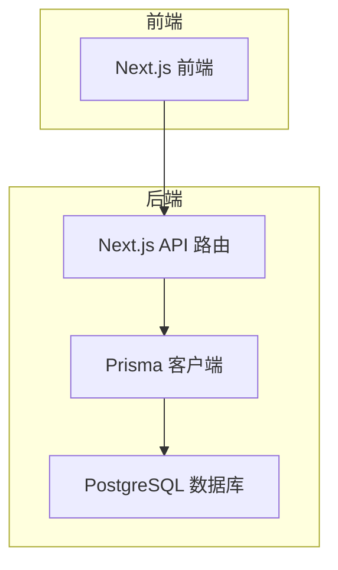
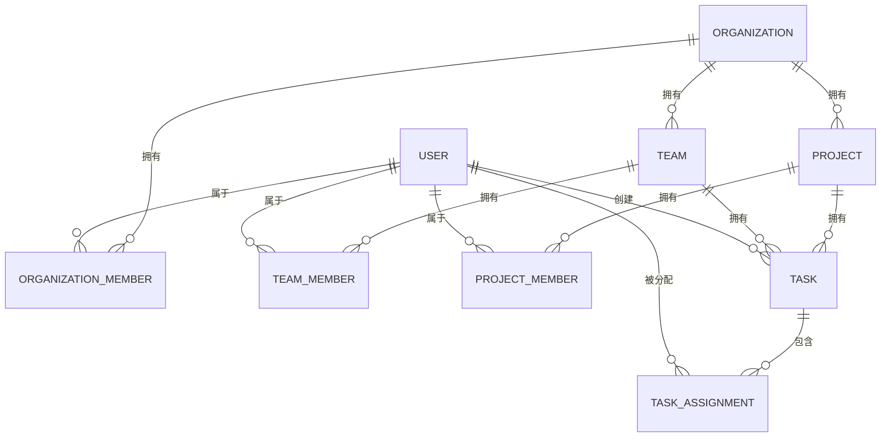
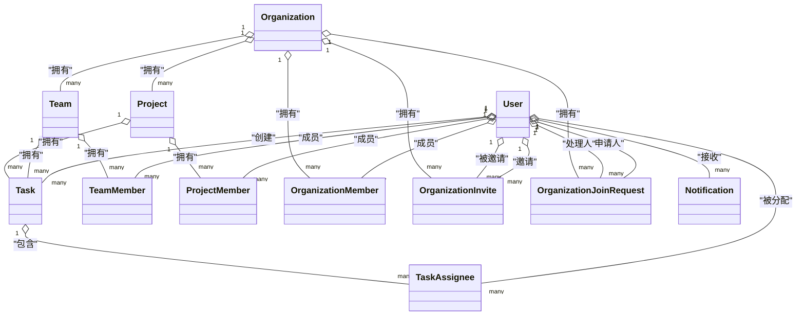
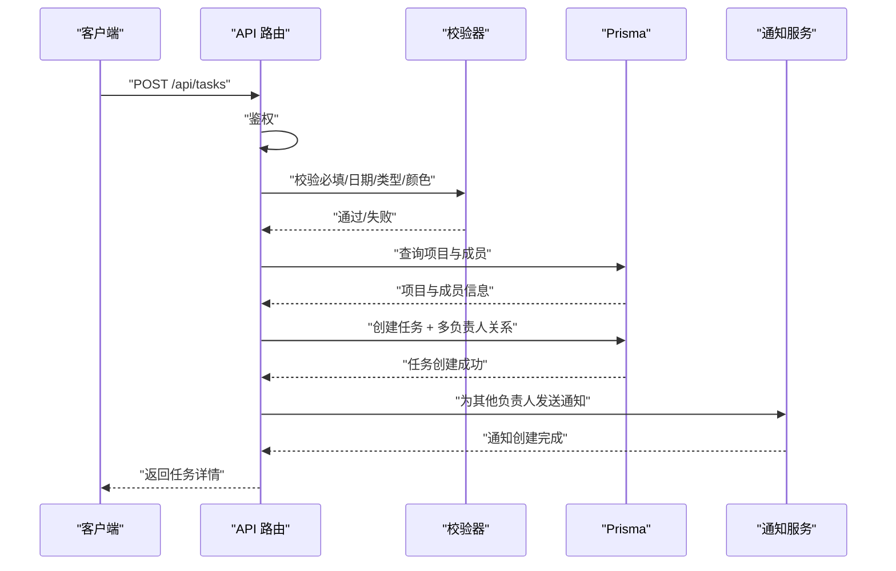
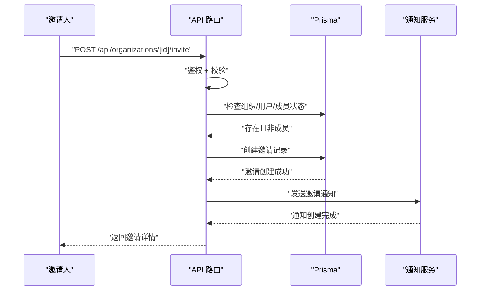
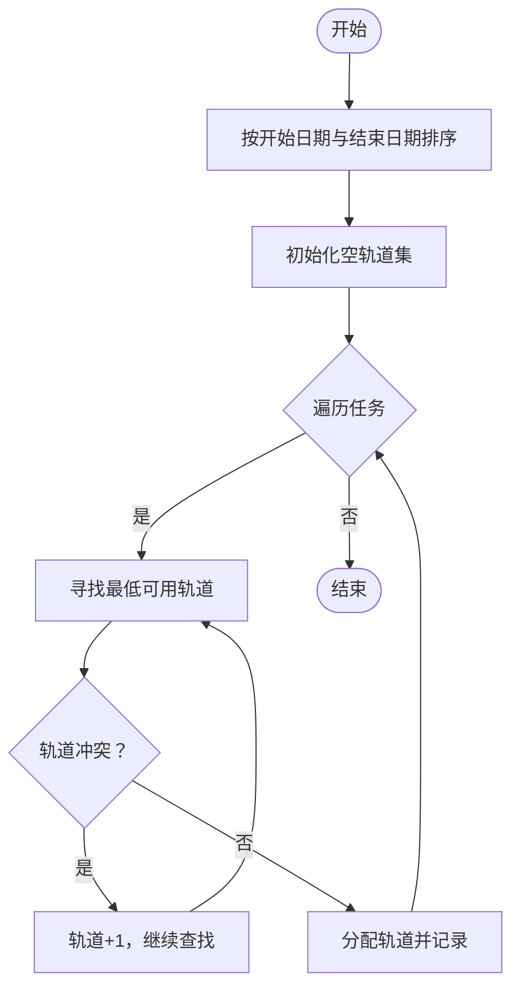

# 数据模型

<cite>
**本文引用的文件**
- [prisma/schema.prisma](file://prisma/schema.prisma)
- [prisma/migrations/20251115201512_add_organization_model/migration.sql](file://prisma/migrations/20251115201512_add_organization_model/migration.sql)
- [lib/types.ts](file://lib/types.ts)
- [lib/validation.ts](file://lib/validation.ts)
- [app/api/tasks/route.ts](file://app/api/tasks/route.ts)
- [app/api/projects/[id]/route.ts](file://app/api/projects/[id]/route.ts)
- [app/api/teams/[id]/route.ts](file://app/api/teams/[id]/route.ts)
- [app/api/organizations/[id]/route.ts](file://app/api/organizations/[id]/route.ts)
- [app/api/organizations/[id]/invite/route.ts](file://app/api/organizations/[id]/invite/route.ts)
- [app/api/organizations/[id]/invite-code/validate/route.ts](file://app/api/organizations/[id]/invite-code/validate/route.ts)
- [lib/prisma.ts](file://lib/prisma.ts)
- [lib/utils/points.ts](file://lib/utils/points.ts)
- [lib/utils/task-layout.ts](file://lib/utils/task-layout.ts)
- [prisma/seed.ts](file://prisma/seed.ts)
</cite>

## 目录
1. [简介](#简介)
2. [项目结构](#项目结构)
3. [核心组件](#核心组件)
4. [架构总览](#架构总览)
5. [详细组件分析](#详细组件分析)
6. [依赖分析](#依赖分析)
7. [性能考量](#性能考量)
8. [故障排查指南](#故障排查指南)
9. [结论](#结论)
10. [附录](#附录)

## 简介
本文件系统化梳理日历任务管理系统的数据模型，聚焦核心实体 User（用户）、Task（任务）、Team（团队）、Project（项目）、Organization（组织）及其关联关系。文档涵盖字段定义、数据类型、约束条件、业务规则、主外键关系、索引策略、级联行为、字段校验与默认值、数据完整性约束，并提供实体关系图与数据模型示例，帮助开发者与运维人员准确理解系统数据结构与运行机制。

## 项目结构
系统采用前后端同构架构，前端使用 Next.js，后端通过 Prisma ORM 访问 PostgreSQL 数据库。数据模型由 Prisma Schema 定义，配合迁移脚本与 API 路由实现业务逻辑与数据完整性控制。

图表来源
- [lib/prisma.ts](file://lib/prisma.ts#L1-L12)
- [prisma/schema.prisma](file://prisma/schema.prisma#L1-L314)

章节来源
- [lib/prisma.ts](file://lib/prisma.ts#L1-L12)
- [prisma/schema.prisma](file://prisma/schema.prisma#L1-L314)

## 核心组件
本节概述五大核心实体及关键枚举，说明其职责边界与典型用途：
- User：系统用户，支持登录、头像、性别、职业、积分、默认组织与团队等属性，承载任务创建、分配、组织与项目成员身份。
- Task：任务实体，包含标题、描述、起止时间、类型、颜色、进度等，支持多负责人与可选团队关联。
- Team：团队实体，隶属于组织，具备任务权限策略与成员集合。
- Project：项目实体，隶属于组织，具备任务权限策略与成员集合。
- Organization：组织实体，支持认证、加入审批、成员角色、邀请码等组织治理能力。

章节来源
- [prisma/schema.prisma](file://prisma/schema.prisma#L17-L314)
- [lib/types.ts](file://lib/types.ts#L1-L141)

## 架构总览
系统采用“组织-团队-项目-任务”的层级结构，User 在不同上下文（组织/团队/项目）中承担不同角色，任务围绕项目与团队进行组织与展示。

图表来源
- [prisma/schema.prisma](file://prisma/schema.prisma#L17-L314)

## 详细组件分析

### 实体：User（用户）
- 主键：id（cuid）
- 关键字段与约束
  - username：唯一、默认空字符串
  - password：默认空字符串（加密存储）
  - name：真实姓名/显示名称
  - email：邮箱（个人资料）
  - avatar：头像链接
  - gender：性别，默认“未设置”
  - role：职业，默认“未设置”
  - isAdmin：是否超级管理员，默认 false
  - inviteCode：唯一邀请码（可选）
  - currentOrganizationId：当前选择的组织ID（可选）
  - defaultTeamId：默认团队ID（可选）
  - points：积分，默认 0
- 关系
  - 创建的任务：一对多（Task.creator）
  - 被分配的任务：一对多（TaskAssignee.user）
  - 团队成员：一对多（TeamMember.user）
  - 项目成员：一对多（ProjectMember.user）
  - 组织成员：一对多（OrganizationMember.user）
  - 邀请的成员：一对多（OrganizationMember.inviter）
  - 发出的组织邀请：一对多（OrganizationInvite.inviter）
  - 收到的组织邀请：一对多（OrganizationInvite.invitedUser）
  - 通知：一对多（Notification.user）
  - 加入请求（申请人）：一对多（OrganizationJoinRequest.applicant）
  - 加入请求（处理人）：一对多（OrganizationJoinRequest.handler）
  - 加入请求（邀请人）：一对多（OrganizationJoinRequest.inviter）
- 索引策略
  - 唯一索引：username
  - 可选唯一索引：inviteCode
- 约束与默认值
  - 字符串字段默认值：空字符串或 null
  - 布尔字段默认值：false
  - 整数字段默认值：0
- 业务规则
  - 用户可拥有唯一邀请码，用于组织邀请与加入流程
  - 用户可切换当前所在组织，影响任务查询与权限判断
  - 用户积分用于段位系统，创建任务等行为可获得积分

章节来源
- [prisma/schema.prisma](file://prisma/schema.prisma#L65-L96)
- [lib/types.ts](file://lib/types.ts#L108-L120)

### 实体：Organization（组织）
- 主键：id（cuid）
- 关键字段与约束
  - name：唯一（全局唯一）
  - description：描述（可选）
  - isVerified：是否已认证，默认 false
  - joinRequiresApproval：加入是否需要审批，默认 false
  - creatorId：组织创建者（外键 User.id，级联删除）
- 关系
  - 成员：一对多（OrganizationMember.organization）
  - 团队：一对多（Team.organization）
  - 项目：一对多（Project.organization）
  - 加入请求：一对多（OrganizationJoinRequest.organization）
  - 邀请：一对多（OrganizationInvite.organization）
- 索引策略
  - creatorId 上建立索引
  - name 上建立唯一索引
- 约束与默认值
  - isVerified 默认 false
  - joinRequiresApproval 默认 false
- 业务规则
  - 组织创建者可邀请成员、管理加入审批策略
  - 组织下所有资源（团队、项目、成员）均受组织约束

章节来源
- [prisma/schema.prisma](file://prisma/schema.prisma#L17-L35)
- [prisma/migrations/20251115201512_add_organization_model/migration.sql](file://prisma/migrations/20251115201512_add_organization_model/migration.sql#L32-L99)

### 实体：Team（团队）
- 主键：id（cuid）
- 关键字段与约束
  - name：团队名称
  - color：颜色标识
  - description：描述（可选）
  - organizationId：所属组织（外键 Organization.id，级联删除）
  - creatorId：团队创建者（外键 User.id，级联删除）
  - taskPermission：任务权限策略，默认 ALL_MEMBERS
- 关系
  - 成员：一对多（TeamMember.team）
  - 任务：一对多（Task.team）
- 索引策略
  - creatorId 上建立索引
  - organizationId 上建立索引
- 约束与默认值
  - taskPermission 默认 ALL_MEMBERS
- 业务规则
  - 团队可设定任务权限策略，决定谁可创建/编辑/删除任务
  - 团队与组织强绑定，删除组织会级联删除团队

章节来源
- [prisma/schema.prisma](file://prisma/schema.prisma#L99-L116)
- [prisma/migrations/20251115201512_add_organization_model/migration.sql](file://prisma/migrations/20251115201512_add_organization_model/migration.sql#L22-L26)

### 实体：Project（项目）
- 主键：id（cuid）
- 关键字段与约束
  - name：项目名称
  - color：颜色标识
  - description：描述（可选）
  - organizationId：所属组织（外键 Organization.id，级联删除）
  - creatorId：项目创建者（外键 User.id，级联删除）
  - taskPermission：任务权限策略，默认 ALL_MEMBERS
- 关系
  - 成员：一对多（ProjectMember.project）
  - 任务：一对多（Task.project）
- 索引策略
  - creatorId 上建立索引
  - organizationId 上建立索引
- 约束与默认值
  - taskPermission 默认 ALL_MEMBERS
- 业务规则
  - 项目可设定任务权限策略，决定谁可创建/编辑/删除任务
  - 项目与组织强绑定，删除组织会级联删除项目

章节来源
- [prisma/schema.prisma](file://prisma/schema.prisma#L119-L136)
- [prisma/migrations/20251115201512_add_organization_model/migration.sql](file://prisma/migrations/20251115201512_add_organization_model/migration.sql#L18-L20)

### 实体：Task（任务）
- 主键：id（cuid）
- 关键字段与约束
  - title：任务标题
  - description：描述（可选）
  - startDate / endDate：起止日期（含时间范围）
  - startTime / endTime：可选时间段
  - type：任务类型（枚举：daily/meeting/vacation）
  - color：可选颜色（仅 daily 类型）
  - progress：进度百分比，默认 0
  - creatorId：创建人（外键 User.id，级联删除）
  - projectId：所属项目（外键 Project.id，级联删除）
  - teamId：可选所属团队（外键 Team.id，SetNull）
- 关系
  - 创建人：多对一（User）
  - 项目：多对一（Project）
  - 团队：多对一（Team，可空）
  - 负责人：多对多（通过 TaskAssignee 中间表）
- 索引策略
  - startDate / endDate 组合索引
  - creatorId、projectId、teamId 上建立索引
- 约束与默认值
  - progress 默认 0
  - color 仅在 daily 类型时生效
- 业务规则
  - 任务可归属团队或项目，支持多负责人
  - 任务类型与颜色、进度等字段存在条件约束

章节来源
- [prisma/schema.prisma](file://prisma/schema.prisma#L139-L164)
- [lib/types.ts](file://lib/types.ts#L61-L82)

### 关系表：TaskAssignee（任务-用户多对多）
- 主键：id（cuid）
- 字段
  - taskId：任务ID（外键 Task.id，级联删除）
  - userId：用户ID（外键 User.id，级联删除）
- 约束
  - 唯一索引：(taskId, userId)
  - 索引：taskId、userId
- 业务规则
  - 一个用户可被分配到多个任务，一个任务可有多个负责人

章节来源
- [prisma/schema.prisma](file://prisma/schema.prisma#L167-L178)

### 关系表：TeamMember（团队-用户多对多）
- 主键：id（cuid）
- 字段
  - userId：用户ID（外键 User.id，级联删除）
  - teamId：团队ID（外键 Team.id，级联删除）
- 约束
  - 唯一索引：(userId, teamId)
  - 索引：userId、teamId
- 业务规则
  - 用户与团队的成员关系

章节来源
- [prisma/schema.prisma](file://prisma/schema.prisma#L194-L205)

### 关系表：ProjectMember（项目-用户多对多）
- 主键：id（cuid）
- 字段
  - userId：用户ID（外键 User.id，级联删除）
  - projectId：项目ID（外键 Project.id，级联删除）
- 约束
  - 唯一索引：(userId, projectId)
  - 索引：userId、projectId
- 业务规则
  - 用户与项目的成员关系

章节来源
- [prisma/schema.prisma](file://prisma/schema.prisma#L208-L219)

### 实体：Notification（站内通知）
- 主键：id（cuid）
- 字段
  - userId：接收用户（外键 User.id，级联删除）
  - type：通知类型（枚举）
  - title/content：标题与内容
  - metadata：JSON 元数据（可选）
  - isRead：是否已读，默认 false
  - readAt：读取时间（可选）
- 索引策略
  - (userId, isRead) 组合索引
  - createdAt 索引
- 业务规则
  - 通知与用户强绑定，支持批量查询未读通知

章节来源
- [prisma/schema.prisma](file://prisma/schema.prisma#L222-L236)

### 实体：OrganizationMember（组织-用户多对多）
- 主键：id（cuid）
- 字段
  - userId：用户ID（外键 User.id，级联删除）
  - organizationId：组织ID（外键 Organization.id，级联删除）
  - role：成员角色（枚举：OWNER/ADMIN/MEMBER）
  - inviteCode：该用户在该组织的唯一邀请码（唯一）
  - inviterId：邀请人ID（外键 User.id，SetNull）
- 约束
  - 唯一索引：(userId, organizationId)
  - 索引：userId、organizationId、inviterId、inviteCode
- 业务规则
  - 组织成员角色与邀请码用于组织治理与加入流程

章节来源
- [prisma/schema.prisma](file://prisma/schema.prisma#L38-L55)

### 实体：OrganizationInvite（组织邀请）
- 主键：id（cuid）
- 字段
  - organizationId：组织ID（外键 Organization.id，级联删除）
  - inviterId：邀请人ID（外键 User.id，级联删除）
  - invitedUserId：被邀请用户ID（外键 User.id，级联删除）
  - status：邀请状态（枚举：PENDING/ACCEPTED/REJECTED/EXPIRED）
  - respondedAt：响应时间（可选）
- 索引策略
  - (organizationId, status)
  - (invitedUserId, status)
  - (inviterId)
  - createdAt
- 业务规则
  - 邀请状态变更触发通知与后续流程

章节来源
- [prisma/schema.prisma](file://prisma/schema.prisma#L288-L305)

### 实体：OrganizationJoinRequest（组织加入申请）
- 主键：id（cuid）
- 字段
  - organizationId：组织ID（外键 Organization.id，级联删除）
  - applicantId：申请人ID（外键 User.id，级联删除）
  - status：申请状态（枚举：PENDING/APPROVED/REJECTED）
  - message：申请留言（可选）
  - inviterId：邀请人ID（外键 User.id，SetNull）
  - handledBy：处理人ID（外键 User.id，SetNull）
  - handledAt：处理时间（可选）
  - rejectReason：拒绝原因（可选）
- 索引策略
  - (organizationId, status)
  - (applicantId, status)
  - (inviterId)
  - createdAt
- 业务规则
  - 组织可配置加入是否需要审批；审批流程与通知联动

章节来源
- [prisma/schema.prisma](file://prisma/schema.prisma#L257-L278)

### 枚举与类型
- TaskType：daily、meeting、vacation
- TaskPermission：ALL_MEMBERS、CREATOR_ONLY
- OrgMemberRole：OWNER、ADMIN、MEMBER
- NotificationType：组织与任务相关通知类型集合
- JoinRequestStatus：PENDING、APPROVED、REJECTED
- InviteStatus：PENDING、ACCEPTED、REJECTED、EXPIRED

章节来源
- [prisma/schema.prisma](file://prisma/schema.prisma#L181-L191)
- [prisma/schema.prisma](file://prisma/schema.prisma#L58-L62)
- [prisma/schema.prisma](file://prisma/schema.prisma#L239-L254)
- [prisma/schema.prisma](file://prisma/schema.prisma#L281-L285)
- [prisma/schema.prisma](file://prisma/schema.prisma#L308-L312)
- [lib/types.ts](file://lib/types.ts#L1-L17)

## 依赖分析
- 外键与级联
  - User.id -> OrganizationMember.userId（Cascade）
  - Organization.id -> OrganizationMember.organizationId（Cascade）
  - User.id -> TeamMember.userId（Cascade）
  - Team.id -> TeamMember.teamId（Cascade）
  - User.id -> ProjectMember.userId（Cascade）
  - Project.id -> ProjectMember.projectId（Cascade）
  - User.id -> TaskAssignee.userId（Cascade）
  - Task.id -> TaskAssignee.taskId（Cascade）
  - User.id -> Task.creatorId（Cascade）
  - Project.id -> Task.projectId（Cascade）
  - Team.id -> Task.teamId（SetNull）
  - Organization.id -> Team.organizationId（Cascade）
  - Organization.id -> Project.organizationId（Cascade）
  - User.id -> Organization.creatorId（Cascade）
  - Organization.id -> OrganizationInvite.organizationId（Cascade）
  - User.id -> OrganizationInvite.inviterId（Cascade）
  - User.id -> OrganizationInvite.invitedUserId（Cascade）
  - Organization.id -> OrganizationInvite.organizationId（Cascade）
  - User.id -> OrganizationJoinRequest.applicantId（Cascade）
  - Organization.id -> OrganizationJoinRequest.organizationId（Cascade）
  - User.id -> OrganizationJoinRequest.inviterId（SetNull）
  - User.id -> OrganizationJoinRequest.handledBy（SetNull）
  - User.id -> Notification.userId（Cascade）
- 索引与性能
  - 多处组合索引与单列索引用于加速查询（如任务日期范围、成员关系、邀请状态等）
- 业务耦合
  - 任务查询与权限严格依赖用户当前组织、项目/团队成员身份与任务权限策略
  - 通知系统贯穿组织邀请、加入申请、任务变更等关键事件

图表来源
- [prisma/schema.prisma](file://prisma/schema.prisma#L17-L314)

章节来源
- [prisma/schema.prisma](file://prisma/schema.prisma#L17-L314)

## 性能考量
- 索引策略
  - 任务按日期范围查询频繁，建议充分利用 startDate / endDate 组合索引
  - 成员关系表（TeamMember、ProjectMember、TaskAssignee）使用唯一复合索引，提升去重与关联查询效率
  - 组织邀请与加入申请使用多维索引，支持按状态与用户快速筛选
- 查询路径
  - 任务列表查询需结合组织、项目/团队、用户身份与日期范围，建议在 API 层统一构建 where 条件并利用索引
- 写入一致性
  - 任务创建涉及多条写入（任务本身、多负责人关系），建议使用事务保证原子性
- 缓存与通知
  - 通知系统采用异步处理，避免阻塞主流程

章节来源
- [app/api/tasks/route.ts](file://app/api/tasks/route.ts#L219-L273)
- [app/api/projects/[id]/route.ts](file://app/api/projects/[id]/route.ts#L140-L160)
- [app/api/teams/[id]/route.ts](file://app/api/teams/[id]/route.ts#L78-L108)

## 故障排查指南
- 常见问题与定位
  - 无权访问组织/项目/团队数据：检查当前用户是否为成员、是否处于正确组织上下文
  - 任务创建失败：核对必填字段、日期范围、项目成员身份、任务类型与颜色限制
  - 邀请与加入申请异常：确认邀请状态、邀请码有效性、审批策略
- 关键校验与报错
  - 日期范围校验：开始日期不得晚于结束日期
  - 用户名/密码/邮箱格式校验
  - 任务类型与颜色的有效性
- 日志与监控
  - 开发环境开启 Prisma 错误与警告日志，便于定位 SQL 异常
  - 通知发送失败不影响主流程，但需关注异步任务状态

章节来源
- [lib/validation.ts](file://lib/validation.ts#L65-L99)
- [lib/validation.ts](file://lib/validation.ts#L19-L25)
- [lib/validation.ts](file://lib/validation.ts#L106-L109)
- [lib/prisma.ts](file://lib/prisma.ts#L7-L9)
- [app/api/tasks/route.ts](file://app/api/tasks/route.ts#L285-L327)

## 结论
本数据模型以组织为核心，向下拆分为团队与项目，再承载任务与成员关系，形成清晰的层级结构。通过外键约束、索引策略与业务层权限控制，系统在保证数据完整性的同时，提供了灵活的任务权限与组织治理能力。建议在生产环境中持续优化查询路径、完善缓存与异步通知机制，并定期审查索引与迁移脚本，确保系统稳定与高性能。

## 附录

### 字段验证规则与默认值清单
- 字符串字段默认值：空字符串或 null
- 布尔字段默认值：false
- 整数字段默认值：0
- 任务类型与颜色：存在条件约束（仅 daily 类型允许颜色）
- 日期范围：开始日期 ≤ 结束日期
- 用户名格式：长度 3-20，字母数字下划线点连字符，必须以字母或数字开头
- 密码强度：最少 6 位，必须包含字母与数字

章节来源
- [prisma/schema.prisma](file://prisma/schema.prisma#L65-L96)
- [prisma/schema.prisma](file://prisma/schema.prisma#L139-L164)
- [lib/validation.ts](file://lib/validation.ts#L19-L25)
- [lib/validation.ts](file://lib/validation.ts#L34-L58)
- [lib/validation.ts](file://lib/validation.ts#L65-L99)
- [lib/validation.ts](file://lib/validation.ts#L106-L109)

### 数据模型示例（基于种子数据）
- 用户：6 个（张三、李四、王五、赵六、孙七、周八）
- 团队：4 个（工程、设计、市场、管理）
- 项目：6 个（Web 应用开发、移动端开发、UI/UX 设计、Q4 市场推广、个人事务、AI 技术研究）
- 任务：26+ 个，覆盖 daily、meeting、vacation 三种类型，包含多负责人与跨项目场景

章节来源
- [prisma/seed.ts](file://prisma/seed.ts#L19-L504)

### API 流程示例：创建任务

图表来源
- [app/api/tasks/route.ts](file://app/api/tasks/route.ts#L276-L496)

### API 流程示例：组织邀请

图表来源
- [app/api/organizations/[id]/invite/route.ts](file://app/api/organizations/[id]/invite/route.ts#L13-L121)

### 算法流程示例：任务轨道分配

图表来源
- [lib/utils/task-layout.ts](file://lib/utils/task-layout.ts#L28-L68)