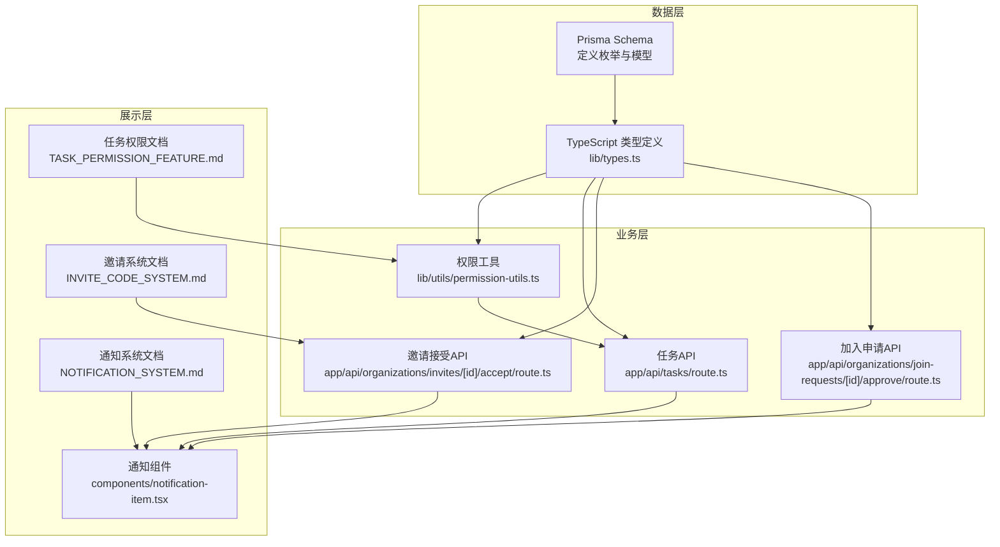
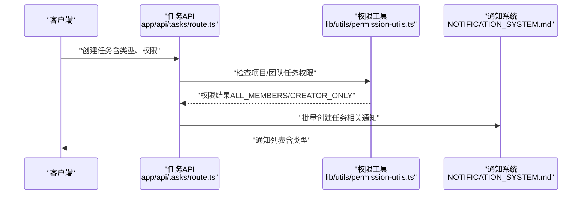
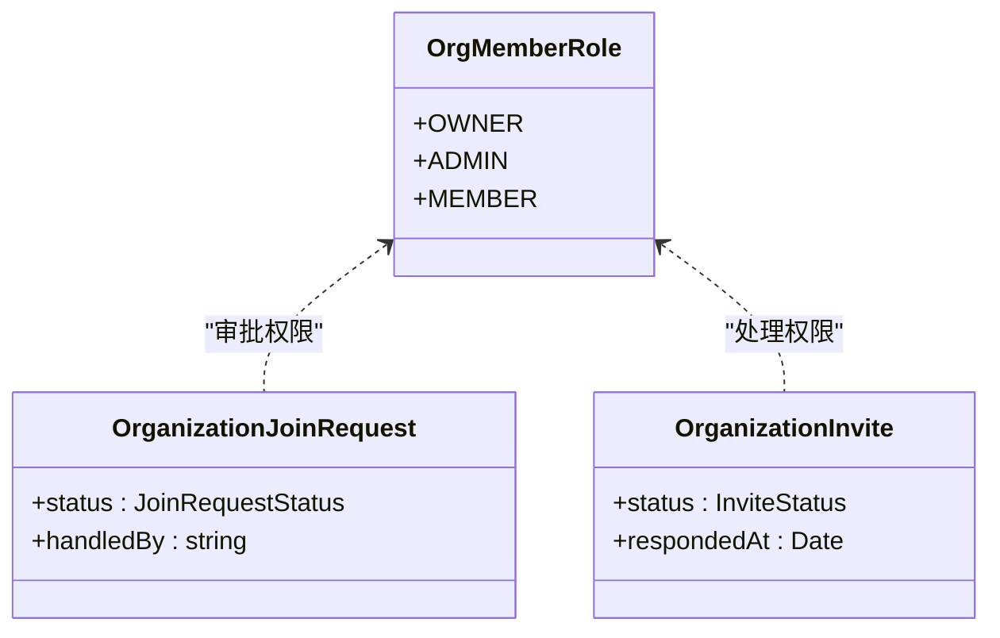
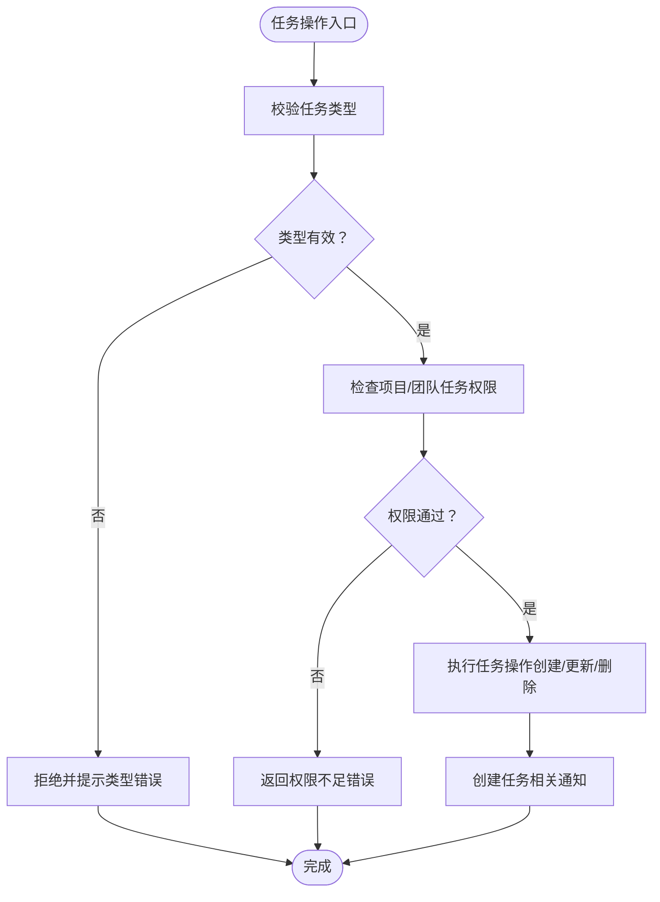
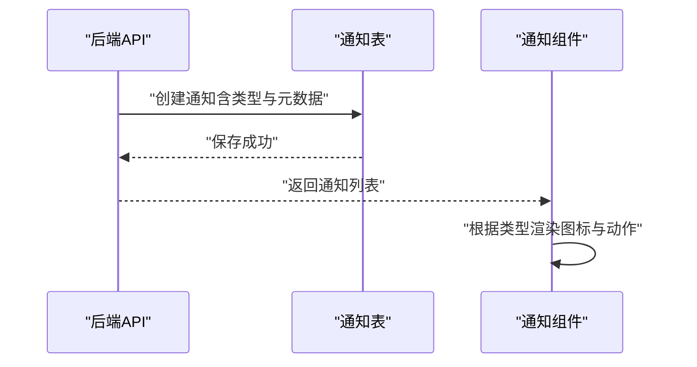
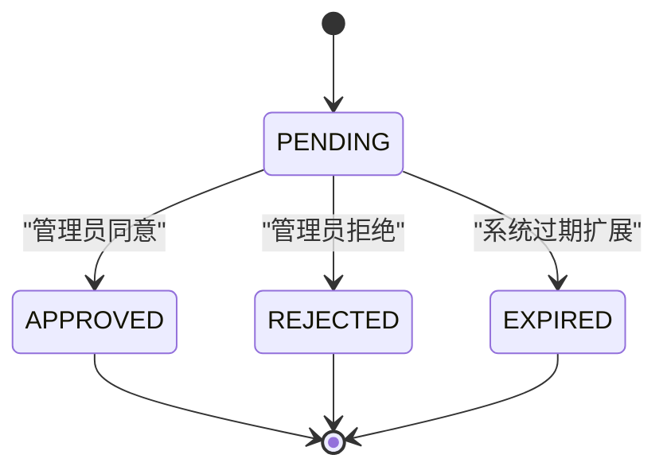
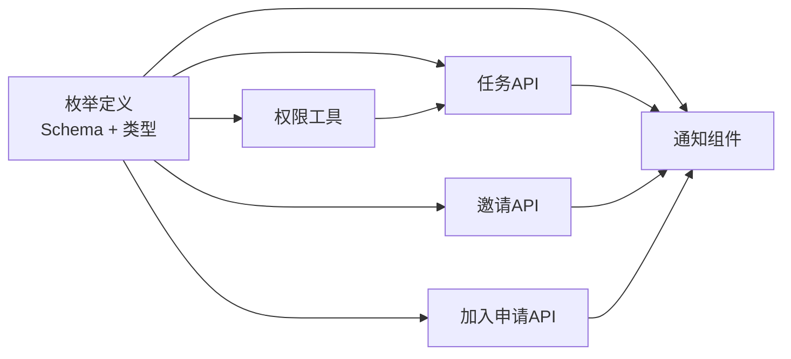

# 枚举类型

<cite>
**本文档引用的文件**
- [prisma/schema.prisma](file://prisma/schema.prisma)
- [lib/types.ts](file://lib/types.ts)
- [lib/utils/permission-utils.ts](file://lib/utils/permission-utils.ts)
- [NOTIFICATION_SYSTEM.md](file://NOTIFICATION_SYSTEM.md)
- [INVITE_CODE_SYSTEM.md](file://INVITE_CODE_SYSTEM.md)
- [TASK_PERMISSION_FEATURE.md](file://TASK_PERMISSION_FEATURE.md)
- [app/api/tasks/route.ts](file://app/api/tasks/route.ts)
- [app/api/organizations/invites/[id]/accept/route.ts](file://app/api/organizations/invites/[id]/accept/route.ts)
- [app/api/organizations/join-requests/[id]/approve/route.ts](file://app/api/organizations/join-requests/[id]/approve/route.ts)
- [components/notification-item.tsx](file://components/notification-item.tsx)
</cite>

## 目录
1. [简介](#简介)
2. [项目结构](#项目结构)
3. [核心组件](#核心组件)
4. [架构总览](#架构总览)
5. [详细组件分析](#详细组件分析)
6. [依赖分析](#依赖分析)
7. [性能考量](#性能考量)
8. [故障排查指南](#故障排查指南)
9. [结论](#结论)
10. [附录](#附录)

## 简介
本文件系统性梳理并深入解析本项目中使用的各类枚举类型，重点涵盖：
- 组织成员角色（OrgMemberRole）
- 任务类型（TaskType）
- 任务权限（TaskPermission）
- 通知类型（NotificationType）
- 加入申请状态（JoinRequestStatus）
- 邀请状态（InviteStatus）

文档不仅解释各枚举的定义与业务含义，还阐述其在权限控制、任务分类、通知管理与状态管理中的作用，并提供扩展方式与最佳实践建议。

## 项目结构
围绕枚举类型的关键文件分布如下：
- 数据库与类型定义：prisma/schema.prisma、lib/types.ts
- 权限控制工具：lib/utils/permission-utils.ts
- 通知系统：NOTIFICATION_SYSTEM.md、components/notification-item.tsx
- 邀请与加入流程：INVITE_CODE_SYSTEM.md、app/api/organizations/invites/[id]/accept/route.ts、app/api/organizations/join-requests/[id]/approve/route.ts
- 任务流程：app/api/tasks/route.ts、TASK_PERMISSION_FEATURE.md

图表来源
- [prisma/schema.prisma](file://prisma/schema.prisma#L57-L62)
- [lib/types.ts](file://lib/types.ts#L1-L17)
- [lib/utils/permission-utils.ts](file://lib/utils/permission-utils.ts#L1-L72)
- [app/api/tasks/route.ts](file://app/api/tasks/route.ts#L1-L497)
- [app/api/organizations/invites/[id]/accept/route.ts](file://app/api/organizations/invites/[id]/accept/route.ts#L1-L147)
- [app/api/organizations/join-requests/[id]/approve/route.ts](file://app/api/organizations/join-requests/[id]/approve/route.ts#L1-L154)
- [components/notification-item.tsx](file://components/notification-item.tsx#L1-L364)
- [NOTIFICATION_SYSTEM.md](file://NOTIFICATION_SYSTEM.md#L1-L1066)
- [INVITE_CODE_SYSTEM.md](file://INVITE_CODE_SYSTEM.md#L1-L608)
- [TASK_PERMISSION_FEATURE.md](file://TASK_PERMISSION_FEATURE.md#L1-L84)

章节来源
- [prisma/schema.prisma](file://prisma/schema.prisma#L57-L62)
- [lib/types.ts](file://lib/types.ts#L1-L17)

## 核心组件
本节对六大枚举进行逐一解析，包括定义、业务含义、权限级别、使用场景与业务规则。

### 组织成员角色（OrgMemberRole）
- 定义来源：prisma/schema.prisma 中的枚举定义
- 类型定义：lib/types.ts 中的 OrgMemberRole 类型
- 枚举值：
  - OWNER（所有者）
  - ADMIN（管理员）
  - MEMBER（普通成员）
- 权限级别（从高到低）：所有者 > 管理员 > 普通成员
- 业务含义与使用场景：
  - 所有者：拥有组织最高权限，可管理组织、团队、项目与成员，通常在创建组织时自动授予。
  - 管理员：可执行大部分管理操作，但对“所有者”权限存在边界；在加入申请审批、邀请处理等场景中具有决策权。
  - 普通成员：基础使用权限，遵循项目/团队的协同权限设置。
- 业务规则：
  - 加入申请审批：仅所有者与管理员可处理（见加入申请API）。
  - 邀请处理：邀请状态变更需对应权限（见邀请接受API）。
  - 通知系统：涉及组织管理类通知（如加入申请、邀请状态）的接收方通常为所有者/管理员。

章节来源
- [prisma/schema.prisma](file://prisma/schema.prisma#L57-L62)
- [lib/types.ts](file://lib/types.ts#L5-L59)
- [app/api/organizations/join-requests/[id]/approve/route.ts](file://app/api/organizations/join-requests/[id]/approve/route.ts#L40-L52)
- [app/api/organizations/invites/[id]/accept/route.ts](file://app/api/organizations/invites/[id]/accept/route.ts#L39-L47)

### 任务类型（TaskType）
- 定义来源：prisma/schema.prisma 中的枚举定义
- 类型定义：lib/types.ts 中的 TaskType 类型
- 枚举值：
  - daily（日常事务）
  - meeting（会议）
  - vacation（休假）
- 业务含义与使用场景：
  - daily：支持颜色配置，适合个人事务与日常安排。
  - meeting：用于会议类任务，强调协作与时间安排。
  - vacation：用于假期标注，便于日历视图与统计。
- 业务规则：
  - daily 类型可选颜色；meeting/vacation类型不强制颜色。
  - 任务创建时需校验类型有效性（见任务API）。
  - 通知系统中针对任务生命周期（创建、更新、删除、分配）进行推送。

章节来源
- [prisma/schema.prisma](file://prisma/schema.prisma#L180-L185)
- [lib/types.ts](file://lib/types.ts#L1-L1)
- [app/api/tasks/route.ts](file://app/api/tasks/route.ts#L317-L321)
- [NOTIFICATION_SYSTEM.md](file://NOTIFICATION_SYSTEM.md#L93-L104)

### 任务权限（TaskPermission）
- 定义来源：prisma/schema.prisma 中的枚举定义
- 类型定义：lib/types.ts 中的 TaskPermission 类型
- 枚举值：
  - ALL_MEMBERS（所有成员）
  - CREATOR_ONLY（仅创建者）
- 业务含义与使用场景：
  - ALL_MEMBERS：团队/项目成员均可创建、编辑、删除任务，适用于开放协作。
  - CREATOR_ONLY：仅任务创建者可进行管理，适用于机密或严格控制的项目。
- 权限控制逻辑（来自权限工具）：
  - 超级管理员拥有所有权限。
  - 非成员无权限。
  - ALL_MEMBERS：成员可管理任务。
  - CREATOR_ONLY：仅创建者可管理任务。
- 业务规则：
  - 默认值为 ALL_MEMBERS，保证向后兼容。
  - 任务创建/编辑/删除均需通过权限检查（见权限工具与任务API）。
  - 通知系统中任务相关通知面向负责人或项目成员。

章节来源
- [prisma/schema.prisma](file://prisma/schema.prisma#L187-L191)
- [lib/types.ts](file://lib/types.ts#L3-L3)
- [lib/utils/permission-utils.ts](file://lib/utils/permission-utils.ts#L11-L59)
- [TASK_PERMISSION_FEATURE.md](file://TASK_PERMISSION_FEATURE.md#L1-L84)
- [app/api/tasks/route.ts](file://app/api/tasks/route.ts#L344-L348)

### 通知类型（NotificationType）
- 定义来源：prisma/schema.prisma 中的枚举定义
- 类型定义：lib/types.ts 中的 NotificationType 类型
- 枚举值（来自文档与API使用）：
  - ORG_JOIN_REQUEST（组织加入申请）
  - ORG_JOIN_APPROVED（加入申请通过）
  - ORG_JOIN_REJECTED（加入申请被拒绝）
  - ORG_INVITE_RECEIVED（收到组织邀请）
  - ORG_INVITE_ACCEPTED（组织邀请被接受）
  - ORG_INVITE_REJECTED（组织邀请被拒绝）
  - ORG_MEMBER_REMOVED（被从组织中移除）
  - TEAM_DELETED（团队被删除）
  - PROJECT_DELETED（项目被删除）
  - USER_INVITED_JOINED（你邀请的用户已加入组织）
  - TASK_CREATED（任务被创建）
  - TASK_UPDATED（任务被修改）
  - TASK_DELETED（任务被删除）
  - TASK_ASSIGNED（任务被分配）
- 业务含义与使用场景：
  - 组织管理：加入申请、邀请状态、成员移除等。
  - 任务生命周期：创建、更新、删除、分配通知。
  - 邀请链路：邀请人与被邀请人之间的状态同步。
- 业务规则：
  - 通知创建遵循“发送方/接收方”与“元数据”的约定（见通知系统文档与API）。
  - 前端根据类型渲染不同图标与交互（见通知组件）。

章节来源
- [prisma/schema.prisma](file://prisma/schema.prisma#L238-L254)
- [lib/types.ts](file://lib/types.ts#L7-L14)
- [NOTIFICATION_SYSTEM.md](file://NOTIFICATION_SYSTEM.md#L93-L104)
- [components/notification-item.tsx](file://components/notification-item.tsx#L45-L68)

### 加入申请状态（JoinRequestStatus）
- 定义来源：prisma/schema.prisma 中的枚举定义
- 类型定义：lib/types.ts 中的 JoinRequestStatus 类型
- 枚举值：
  - PENDING（待处理）
  - APPROVED（已同意）
  - REJECTED（已拒绝）
- 业务含义与使用场景：
  - 申请创建时默认为待处理。
  - 管理员审批后进入已同意/已拒绝状态。
- 业务规则：
  - 仅所有者/管理员可处理（见加入申请API）。
  - 已处理的申请不可重复处理。

章节来源
- [prisma/schema.prisma](file://prisma/schema.prisma#L280-L285)
- [lib/types.ts](file://lib/types.ts#L16-L41)
- [app/api/organizations/join-requests/[id]/approve/route.ts](file://app/api/organizations/join-requests/[id]/approve/route.ts#L36-L38)

### 邀请状态（InviteStatus）
- 定义来源：prisma/schema.prisma 中的枚举定义
- 类型定义：lib/types.ts 中的 InviteStatus 类型
- 枚举值：
  - PENDING（待处理）
  - ACCEPTED（已接受）
  - REJECTED（已拒绝）
  - EXPIRED（已过期）
- 业务含义与使用场景：
  - 邀请创建后为待处理。
  - 被邀请人接受或拒绝后进入对应状态。
  - 系统可扩展到期逻辑（EXPIRED）。
- 业务规则：
  - 仅被邀请人可处理（见邀请接受API）。
  - 已处理的邀请不可重复处理。

章节来源
- [prisma/schema.prisma](file://prisma/schema.prisma#L307-L313)
- [lib/types.ts](file://lib/types.ts#L16-L41)
- [app/api/organizations/invites/[id]/accept/route.ts](file://app/api/organizations/invites/[id]/accept/route.ts#L44-L47)

## 架构总览
以下序列图展示了关键业务流程中枚举类型如何贯穿前后端：

图表来源
- [app/api/tasks/route.ts](file://app/api/tasks/route.ts#L344-L348)
- [lib/utils/permission-utils.ts](file://lib/utils/permission-utils.ts#L11-L59)
- [NOTIFICATION_SYSTEM.md](file://NOTIFICATION_SYSTEM.md#L93-L104)

## 详细组件分析

### 组织成员角色（OrgMemberRole）分析
- 角色层级与权限边界清晰，适用于多层级组织治理。
- 在加入申请与邀请处理中承担决策角色，确保组织安全与合规。

图表来源
- [prisma/schema.prisma](file://prisma/schema.prisma#L57-L62)
- [prisma/schema.prisma](file://prisma/schema.prisma#L257-L278)
- [prisma/schema.prisma](file://prisma/schema.prisma#L288-L305)

章节来源
- [prisma/schema.prisma](file://prisma/schema.prisma#L57-L62)
- [app/api/organizations/join-requests/[id]/approve/route.ts](file://app/api/organizations/join-requests/[id]/approve/route.ts#L40-L52)
- [app/api/organizations/invites/[id]/accept/route.ts](file://app/api/organizations/invites/[id]/accept/route.ts#L39-L47)

### 任务类型（TaskType）与任务权限（TaskPermission）分析
- 任务类型决定任务的呈现与行为（如颜色、会议提醒等）。
- 任务权限决定任务的协作边界，影响创建/编辑/删除的可操作性。

图表来源
- [app/api/tasks/route.ts](file://app/api/tasks/route.ts#L317-L321)
- [lib/utils/permission-utils.ts](file://lib/utils/permission-utils.ts#L11-L59)
- [NOTIFICATION_SYSTEM.md](file://NOTIFICATION_SYSTEM.md#L93-L104)

章节来源
- [app/api/tasks/route.ts](file://app/api/tasks/route.ts#L317-L348)
- [lib/utils/permission-utils.ts](file://lib/utils/permission-utils.ts#L11-L59)
- [TASK_PERMISSION_FEATURE.md](file://TASK_PERMISSION_FEATURE.md#L59-L64)

### 通知类型（NotificationType）分析
- 通知类型驱动前端UI渲染与交互（图标、动作按钮）。
- 通知元数据承载上下文信息，便于跳转与处理。

图表来源
- [NOTIFICATION_SYSTEM.md](file://NOTIFICATION_SYSTEM.md#L93-L104)
- [components/notification-item.tsx](file://components/notification-item.tsx#L45-L68)

章节来源
- [NOTIFICATION_SYSTEM.md](file://NOTIFICATION_SYSTEM.md#L93-L104)
- [components/notification-item.tsx](file://components/notification-item.tsx#L45-L68)

### 加入申请状态（JoinRequestStatus）与邀请状态（InviteStatus）分析
- 两者均采用三态或四态状态机，确保流程可追溯与幂等处理。
- 状态变更伴随通知，形成闭环。

图表来源
- [prisma/schema.prisma](file://prisma/schema.prisma#L280-L285)
- [prisma/schema.prisma](file://prisma/schema.prisma#L307-L313)

章节来源
- [prisma/schema.prisma](file://prisma/schema.prisma#L280-L285)
- [prisma/schema.prisma](file://prisma/schema.prisma#L307-L313)
- [app/api/organizations/join-requests/[id]/approve/route.ts](file://app/api/organizations/join-requests/[id]/approve/route.ts#L55-L64)
- [app/api/organizations/invites/[id]/accept/route.ts](file://app/api/organizations/invites/[id]/accept/route.ts#L69-L78)

## 依赖分析
- 数据层依赖：Prisma Schema 定义枚举，TypeScript 类型定义确保编译期安全。
- 权限依赖：权限工具函数依赖 TaskPermission 与用户角色，贯穿任务API。
- 通知依赖：通知类型驱动前端组件渲染与交互。
- 流程依赖：加入申请与邀请状态在API中被严格校验，防止重复处理。

图表来源
- [prisma/schema.prisma](file://prisma/schema.prisma#L57-L62)
- [lib/types.ts](file://lib/types.ts#L1-L17)
- [lib/utils/permission-utils.ts](file://lib/utils/permission-utils.ts#L1-L72)
- [app/api/tasks/route.ts](file://app/api/tasks/route.ts#L1-L497)
- [app/api/organizations/invites/[id]/accept/route.ts](file://app/api/organizations/invites/[id]/accept/route.ts#L1-L147)
- [app/api/organizations/join-requests/[id]/approve/route.ts](file://app/api/organizations/join-requests/[id]/approve/route.ts#L1-L154)
- [components/notification-item.tsx](file://components/notification-item.tsx#L1-L364)

章节来源
- [prisma/schema.prisma](file://prisma/schema.prisma#L57-L62)
- [lib/types.ts](file://lib/types.ts#L1-L17)
- [lib/utils/permission-utils.ts](file://lib/utils/permission-utils.ts#L1-L72)
- [app/api/tasks/route.ts](file://app/api/tasks/route.ts#L1-L497)
- [app/api/organizations/invites/[id]/accept/route.ts](file://app/api/organizations/invites/[id]/accept/route.ts#L1-L147)
- [app/api/organizations/join-requests/[id]/approve/route.ts](file://app/api/organizations/join-requests/[id]/approve/route.ts#L1-L154)
- [components/notification-item.tsx](file://components/notification-item.tsx#L1-L364)

## 性能考量
- 通知查询限制：最近30天、最多100条、按创建时间倒序，配合复合索引高效检索未读消息。
- 批量通知创建：减少数据库往返，提升通知吞吐。
- 权限检查前置：在任务创建/编辑前进行权限校验，避免无效写入。

章节来源
- [NOTIFICATION_SYSTEM.md](file://NOTIFICATION_SYSTEM.md#L321-L350)
- [NOTIFICATION_SYSTEM.md](file://NOTIFICATION_SYSTEM.md#L641-L697)
- [app/api/tasks/route.ts](file://app/api/tasks/route.ts#L472-L489)

## 故障排查指南
- 通知类型不匹配：确认后端创建通知时使用的类型与前端组件映射一致。
- 权限不足：检查项目/团队的 TaskPermission 设置与当前用户角色。
- 申请/邀请状态异常：确认状态流转是否符合预期，避免重复处理。
- 邀请码与加入流程：核对邀请码验证与加入申请流程的边界条件。

章节来源
- [components/notification-item.tsx](file://components/notification-item.tsx#L45-L68)
- [lib/utils/permission-utils.ts](file://lib/utils/permission-utils.ts#L66-L71)
- [app/api/organizations/join-requests/[id]/approve/route.ts](file://app/api/organizations/join-requests/[id]/approve/route.ts#L36-L38)
- [app/api/organizations/invites/[id]/accept/route.ts](file://app/api/organizations/invites/[id]/accept/route.ts#L44-L47)

## 结论
本项目的枚举体系以“明确职责、清晰边界、可追溯状态”为核心设计原则，贯穿权限控制、任务分类、通知管理与状态管理。通过Prisma Schema与TypeScript类型定义的双重约束，结合权限工具与API的严格校验，确保系统在复杂业务场景下的稳定性与可维护性。建议在扩展新枚举时遵循统一命名规范、完善文档与测试，并保持前后端一致的类型与行为约定。

## 附录
- 扩展方式与最佳实践
  - 新增枚举：先在Prisma Schema中定义，再在TypeScript中补充类型，最后在业务模块中使用并完善文档与测试。
  - 状态机扩展：如邀请状态新增“EXPIRED”，需在API中校验并更新通知与前端交互。
  - 权限边界：始终以“超级管理员 > 所有者/管理员 > 普通成员”的层级进行权限判定。
  - 通知一致性：统一通知类型与元数据结构，确保前端渲染与交互的一致性。
  - 性能优化：对高频查询建立合适索引，限制查询范围与数量，批量写入以降低延迟。

章节来源
- [prisma/schema.prisma](file://prisma/schema.prisma#L57-L62)
- [lib/types.ts](file://lib/types.ts#L1-L17)
- [NOTIFICATION_SYSTEM.md](file://NOTIFICATION_SYSTEM.md#L641-L697)
- [TASK_PERMISSION_FEATURE.md](file://TASK_PERMISSION_FEATURE.md#L59-L64)
- [INVITE_CODE_SYSTEM.md](file://INVITE_CODE_SYSTEM.md#L356-L371)