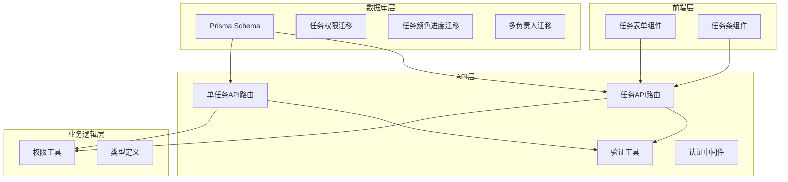
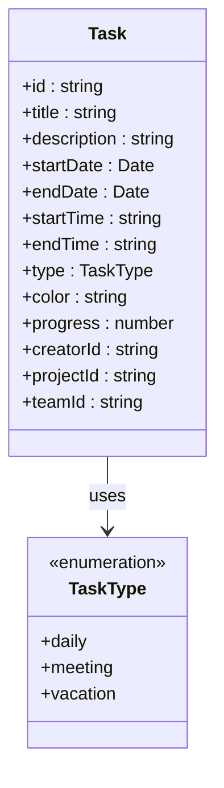
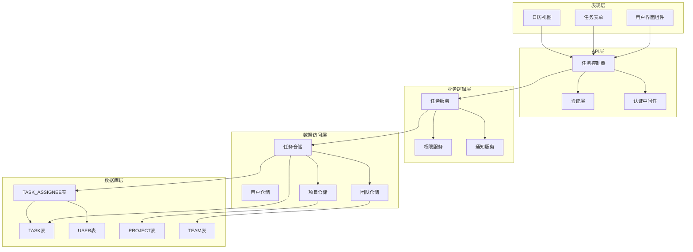
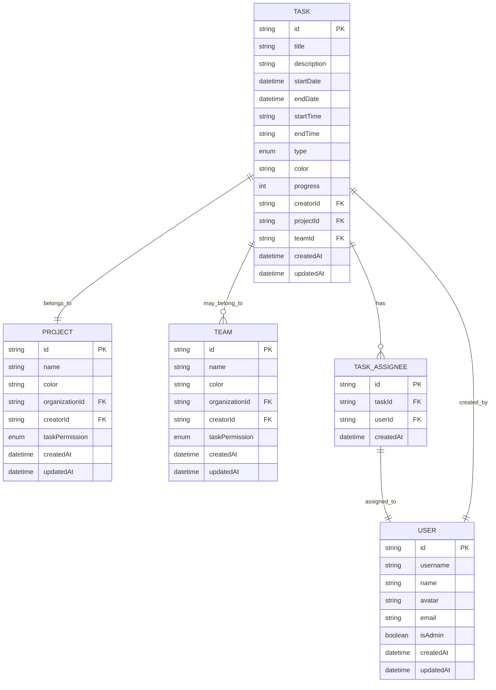
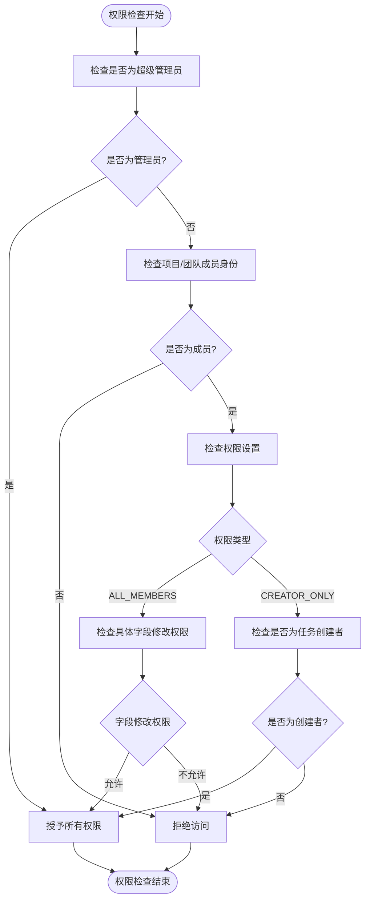
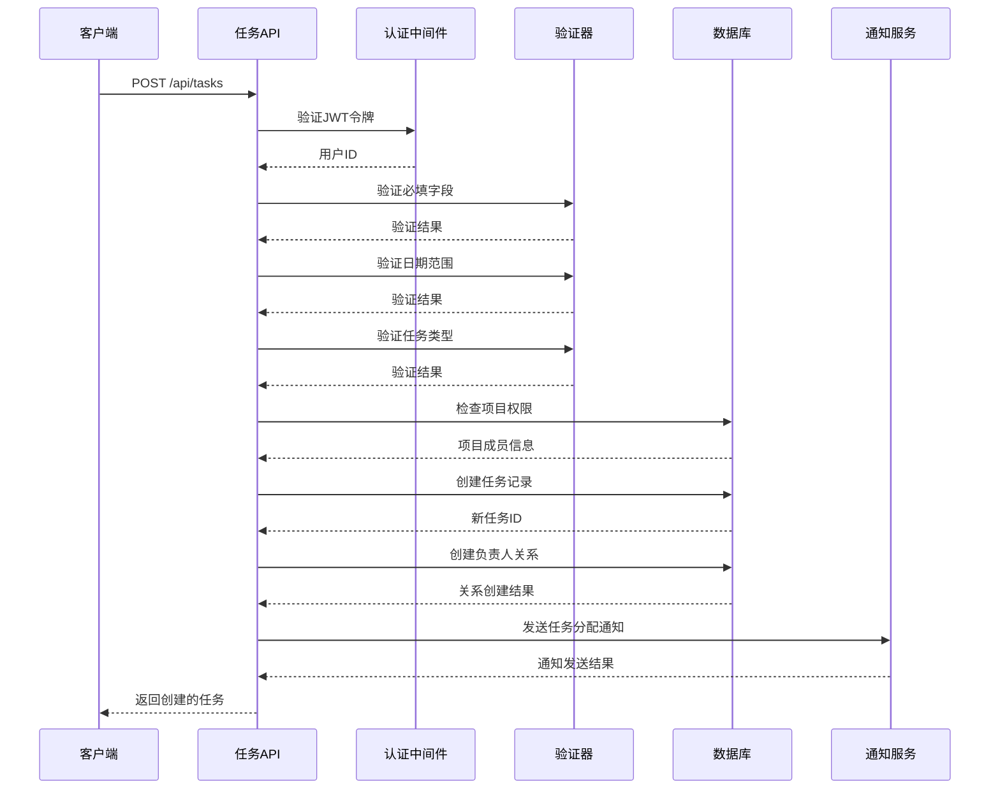
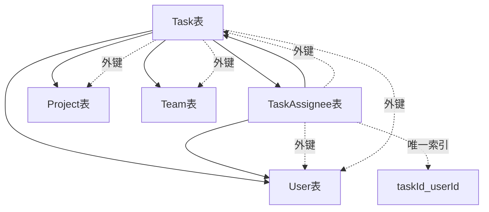

# 任务实体模型

<cite>
**本文档引用的文件**
- [prisma/schema.prisma](file://prisma/schema.prisma)
- [app/api/tasks/route.ts](file://app/api/tasks/route.ts)
- [app/api/tasks/[id]/route.ts](file://app/api/tasks/[id]/route.ts)
- [lib/validation.ts](file://lib/validation.ts)
- [lib/utils/permission-utils.ts](file://lib/utils/permission-utils.ts)
- [lib/types.ts](file://lib/types.ts)
- [components/task/task-form-panel.tsx](file://components/task/task-form-panel.tsx)
- [TASK_PERMISSION_FEATURE.md](file://TASK_PERMISSION_FEATURE.md)
- [TASK_FORM_IMPROVEMENTS.md](file://TASK_FORM_IMPROVEMENTS.md)
- [lib/middleware.ts](file://lib/middleware.ts)
- [lib/api-response.ts](file://lib/api-response.ts)
- [prisma/migrations/add_task_creator_and_multiple_assignees/migration.sql](file://prisma/migrations/add_task_creator_and_multiple_assignees/migration.sql)
- [prisma/migrations/20251125165512_add_task_color_and_progress/migration.sql](file://prisma/migrations/20251125165512_add_task_color_and_progress/migration.sql)
</cite>

## 目录
1. [简介](#简介)
2. [项目结构](#项目结构)
3. [核心组件](#核心组件)
4. [架构概览](#架构概览)
5. [详细组件分析](#详细组件分析)
6. [依赖关系分析](#依赖关系分析)
7. [性能考虑](#性能考虑)
8. [故障排除指南](#故障排除指南)
9. [结论](#结论)

## 简介

任务实体模型是日历任务管理系统的核心数据结构，负责管理用户创建的各种类型任务。该模型支持三种任务类型（日常任务、会议任务、休假任务），提供完整的任务生命周期管理，包括创建、编辑、删除、分配等功能。

本系统采用基于 Prisma 的数据库设计，实现了强类型的任务管理功能，支持多负责人协作、权限控制、进度跟踪和颜色标识等高级特性。

## 项目结构

任务实体模型涉及以下关键文件和组件：

**图表来源**
- [prisma/schema.prisma](file://prisma/schema.prisma#L138-L164)
- [app/api/tasks/route.ts](file://app/api/tasks/route.ts#L1-L497)
- [app/api/tasks/[id]/route.ts](file://app/api/tasks/[id]/route.ts#L1-L490)

## 核心组件

### 任务实体字段定义

任务实体包含以下核心字段：

| 字段名 | 数据类型 | 约束条件 | 业务含义 |
|--------|----------|----------|----------|
| id | String | 主键，自动生成 | 任务唯一标识符 |
| title | String | 必填，最大200字符 | 任务标题 |
| description | String | 可选，最大2000字符 | 任务详细描述 |
| startDate | DateTime | 必填 | 任务开始日期 |
| endDate | DateTime | 必填 | 任务结束日期 |
| startTime | String | 可选，格式HH:MM | 任务开始时间 |
| endTime | String | 可选，格式HH:MM | 任务结束时间 |
| type | TaskType | 必填，枚举值 | 任务类型（daily/meeting/vacation） |
| color | String | 可选，仅daily类型 | 任务颜色标识 |
| progress | Int | 0-100，默认0 | 任务完成进度百分比 |
| creatorId | String | 必填，外键 | 任务创建者ID |
| projectId | String | 必填，外键 | 任务所属项目ID |
| teamId | String | 可选，外键 | 任务所属团队ID |

### 任务类型枚举

系统支持三种任务类型：

**图表来源**
- [prisma/schema.prisma](file://prisma/schema.prisma#L180-L185)
- [lib/types.ts](file://lib/types.ts#L1-L1)

**章节来源**
- [prisma/schema.prisma](file://prisma/schema.prisma#L138-L164)
- [lib/types.ts](file://lib/types.ts#L61-L82)

## 架构概览

任务实体模型采用分层架构设计，确保职责分离和代码可维护性：

**图表来源**
- [app/api/tasks/route.ts](file://app/api/tasks/route.ts#L1-L497)
- [app/api/tasks/[id]/route.ts](file://app/api/tasks/[id]/route.ts#L1-L490)
- [lib/utils/permission-utils.ts](file://lib/utils/permission-utils.ts#L1-L72)

## 详细组件分析

### 任务实体关系模型

任务实体与用户、项目、团队之间存在复杂的多对多关系：

**图表来源**
- [prisma/schema.prisma](file://prisma/schema.prisma#L138-L178)

### 任务权限控制系统

系统实现了灵活的权限控制机制，支持团队和项目级别的权限设置：

**图表来源**
- [app/api/tasks/[id]/route.ts](file://app/api/tasks/[id]/route.ts#L158-L190)
- [lib/utils/permission-utils.ts](file://lib/utils/permission-utils.ts#L11-L30)

**章节来源**
- [app/api/tasks/[id]/route.ts](file://app/api/tasks/[id]/route.ts#L158-L190)
- [lib/utils/permission-utils.ts](file://lib/utils/permission-utils.ts#L1-L72)

### 任务创建业务流程

任务创建流程包含完整的验证、权限检查和数据处理：

**图表来源**
- [app/api/tasks/route.ts](file://app/api/tasks/route.ts#L275-L496)

**章节来源**
- [app/api/tasks/route.ts](file://app/api/tasks/route.ts#L275-L496)

### 任务权限控制机制

系统提供了两种权限控制模式：

| 权限模式 | 描述 | 适用场景 | 权限范围 |
|----------|------|----------|----------|
| ALL_MEMBERS | 所有成员都可以管理任务 | 开放协作项目 | 创建、编辑、删除、修改负责人 |
| CREATOR_ONLY | 仅创建者可以管理任务 | 机密项目、受控环境 | 仅创建者可管理 |

**章节来源**
- [TASK_PERMISSION_FEATURE.md](file://TASK_PERMISSION_FEATURE.md#L6-L15)
- [lib/utils/permission-utils.ts](file://lib/utils/permission-utils.ts#L11-L30)

### 进度跟踪系统

任务进度采用0-100的整数表示，支持实时更新和统计分析：

**图表来源**
- [app/api/tasks/route.ts](file://app/api/tasks/route.ts#L329-L331)
- [app/api/tasks/[id]/route.ts](file://app/api/tasks/[id]/route.ts#L332-L334)

**章节来源**
- [app/api/tasks/route.ts](file://app/api/tasks/route.ts#L329-L331)
- [app/api/tasks/[id]/route.ts](file://app/api/tasks/[id]/route.ts#L332-L334)

### 颜色标识系统

颜色系统专门为日常任务提供视觉标识，支持五种预定义颜色：

| 颜色值 | 中文名称 | HEX值 | 使用场景 |
|--------|----------|-------|----------|
| blue | 蓝色 | #3b82f6 | 日常工作、学习任务 |
| green | 绿色 | #10b981 | 健康、运动相关任务 |
| yellow | 黄色 | #f59e0b | 重要但不紧急任务 |
| red | 红色 | #ef4444 | 紧急、高优先级任务 |
| purple | 紫色 | #a855f7 | 创意、特殊项目任务 |

**章节来源**
- [lib/types.ts](file://lib/types.ts#L132-L139)
- [components/task/task-form-panel.tsx](file://components/task/task-form-panel.tsx#L468-L480)

## 依赖关系分析

### 数据库依赖关系

任务实体与相关表之间的依赖关系如下：

**图表来源**
- [prisma/schema.prisma](file://prisma/schema.prisma#L138-L178)
- [prisma/migrations/add_task_creator_and_multiple_assignees/migration.sql](file://prisma/migrations/add_task_creator_and_multiple_assignees/migration.sql#L1-L44)

### 外部依赖

系统依赖以下外部组件：

| 组件 | 版本 | 用途 |
|------|------|------|
| Prisma | ^5.0.0 | ORM框架，数据库抽象层 |
| Next.js | ^14.0.0 | Web框架，API路由 |
| TypeScript | ^5.0.0 | 类型安全，开发体验 |
| Postgresql | ^15.0 | 数据库存储 |

**章节来源**
- [prisma/schema.prisma](file://prisma/schema.prisma#L1-L14)

## 性能考虑

### 数据库索引策略

系统为提高查询性能建立了以下索引：

| 索引名称 | 字段组合 | 用途 | 性能收益 |
|----------|----------|------|----------|
| Task_startDate_endDate | startDate, endDate | 日期范围查询 | O(log n)查找 |
| Task_creatorId | creatorId | 创建者查询 | O(log n)查找 |
| Task_projectId | projectId | 项目任务查询 | O(log n)查找 |
| Task_teamId | teamId | 团队任务查询 | O(log n)查找 |
| TaskAssignee_taskId_userId | taskId, userId | 唯一约束 | O(1)查找 |
| TaskAssignee_taskId | taskId | 负责人查询 | O(log n)查找 |
| TaskAssignee_userId | userId | 用户任务查询 | O(log n)查找 |

### 查询优化建议

1. **批量查询优化**：使用`include`预加载关联数据，避免N+1查询问题
2. **分页处理**：对大量任务数据使用分页查询，限制单次查询数量
3. **缓存策略**：对频繁访问的用户任务列表实施缓存机制
4. **索引优化**：定期分析查询计划，优化慢查询语句

### 前端性能优化

1. **虚拟滚动**：对长列表任务采用虚拟滚动技术
2. **懒加载**：任务详情采用懒加载方式
3. **状态缓存**：本地缓存用户选择的项目和团队信息
4. **防抖处理**：输入验证采用防抖机制减少重复请求

## 故障排除指南

### 常见问题及解决方案

| 问题类型 | 症状 | 可能原因 | 解决方案 |
|----------|------|----------|----------|
| 权限错误 | 403 Forbidden | 用户无权限管理任务 | 检查项目/团队权限设置 |
| 验证失败 | 400 Bad Request | 数据格式不正确 | 检查输入数据格式和范围 |
| 任务不存在 | 404 Not Found | 任务ID错误或已被删除 | 验证任务ID的有效性 |
| 数据库约束冲突 | 409 Conflict | 外键约束或唯一约束冲突 | 检查关联数据的一致性 |

### 调试工具和方法

1. **API调试**：使用Postman或curl测试API端点
2. **数据库查询**：通过Prisma Studio查看数据状态
3. **日志分析**：检查服务器日志中的错误信息
4. **网络监控**：使用浏览器开发者工具监控API调用

**章节来源**
- [lib/api-response.ts](file://lib/api-response.ts#L56-L100)
- [lib/middleware.ts](file://lib/middleware.ts#L10-L39)

## 结论

任务实体模型通过精心设计的数据库结构、完善的权限控制机制和丰富的业务功能，为日历任务管理系统提供了坚实的数据基础。该模型支持多种任务类型、多负责人协作、灵活的权限控制和直观的进度跟踪，能够满足不同场景下的任务管理需求。

系统的模块化设计确保了良好的可扩展性和可维护性，为未来的功能扩展和技术升级奠定了良好基础。通过合理的性能优化策略和完善的错误处理机制，系统能够在保证功能完整性的同时，提供优秀的用户体验和稳定的运行性能。