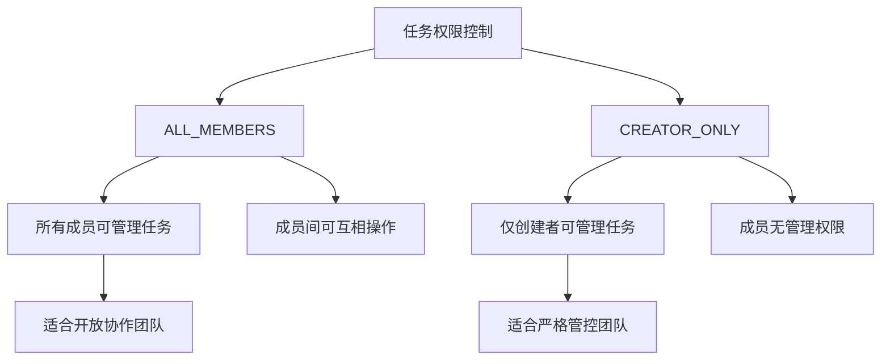
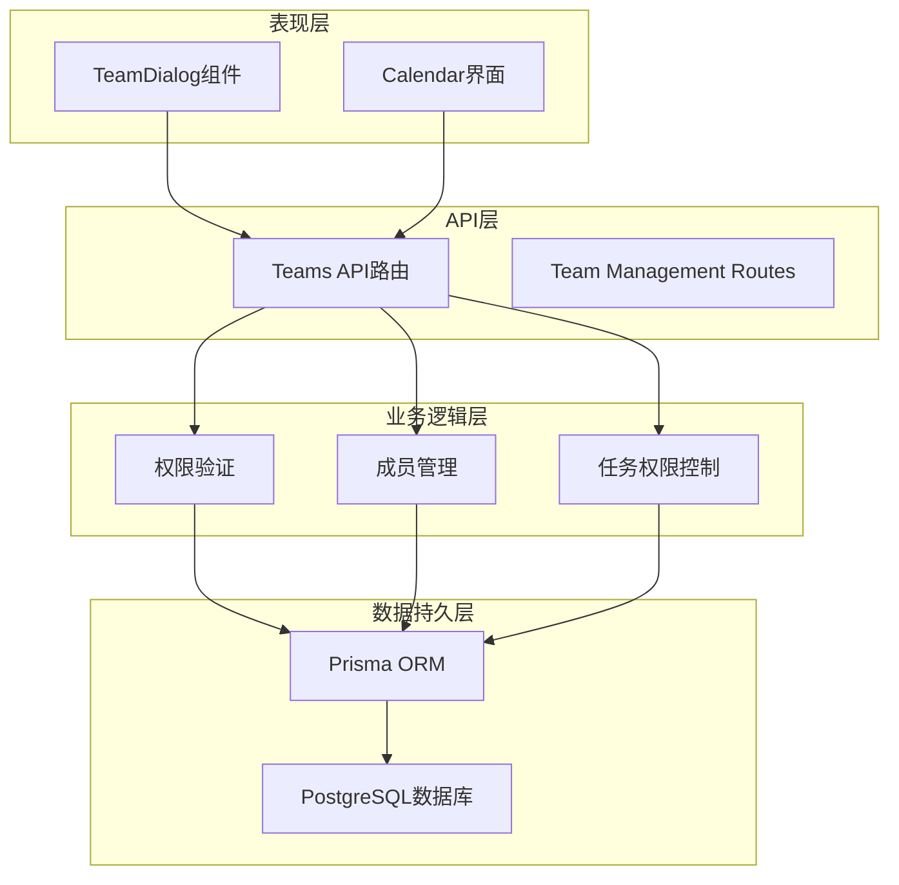
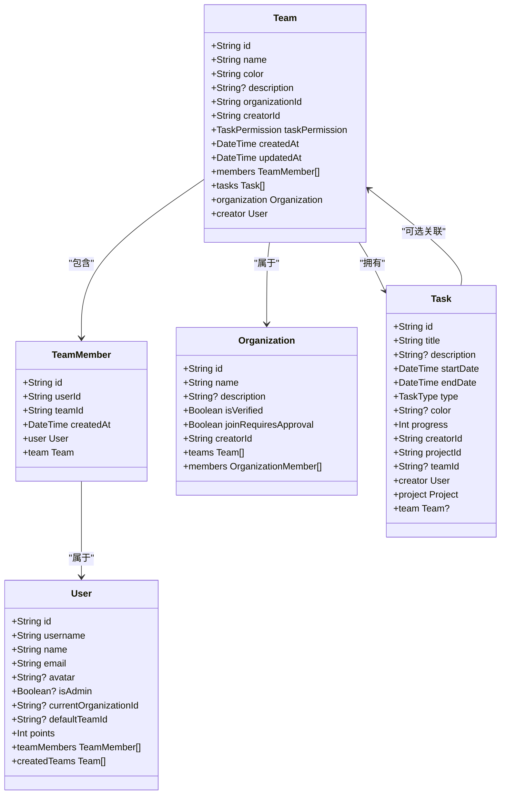
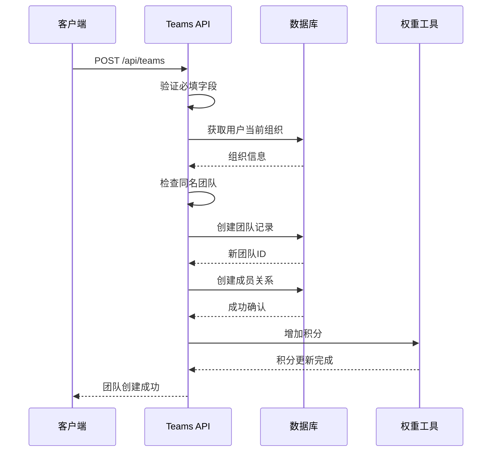
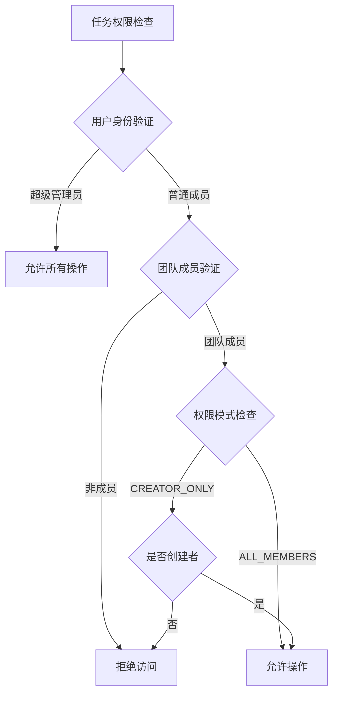
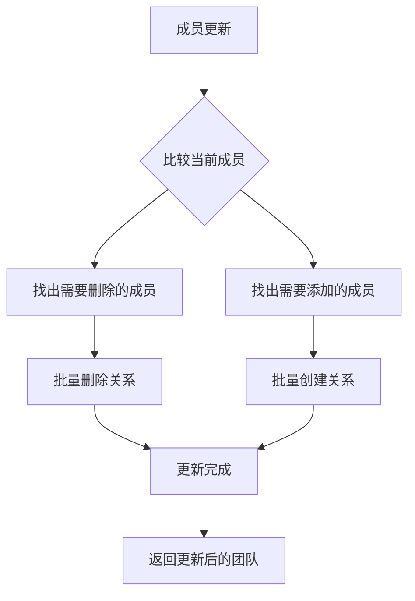
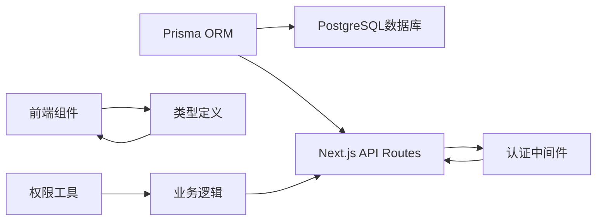
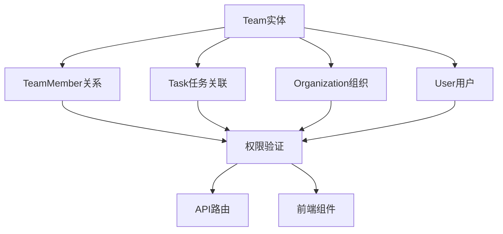
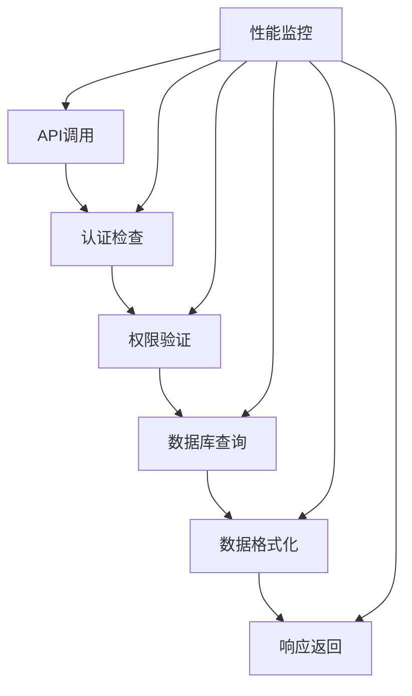

# 团队实体模型

<cite>
**本文档引用的文件**
- [prisma/schema.prisma](file://prisma/schema.prisma)
- [app/api/teams/route.ts](file://app/api/teams/route.ts)
- [app/api/teams/[id]/route.ts](file://app/api/teams/[id]/route.ts)
- [app/api/teams/[id]/join/route.ts](file://app/api/teams/[id]/join/route.ts)
- [app/api/teams/[id]/leave/route.ts](file://app/api/teams/[id]/leave/route.ts)
- [lib/types.ts](file://lib/types.ts)
- [lib/utils/permission-utils.ts](file://lib/utils/permission-utils.ts)
- [components/sidebar/team-dialog.tsx](file://components/sidebar/team-dialog.tsx)
- [scripts/migrate-default-team.ts](file://scripts/migrate-default-team.ts)
- [prisma/migrations/update_task_team_relations.sql](file://prisma/migrations/update_task_team_relations.sql)
- [TASK_PERMISSION_FEATURE.md](file://TASK_PERMISSION_FEATURE.md)
</cite>

## 目录
1. [简介](#简介)
2. [项目结构](#项目结构)
3. [核心组件](#核心组件)
4. [架构概览](#架构概览)
5. [详细组件分析](#详细组件分析)
6. [依赖关系分析](#依赖关系分析)
7. [性能考虑](#性能考虑)
8. [故障排除指南](#故障排除指南)
9. [结论](#结论)

## 简介

团队实体模型是日历任务管理系统中的核心数据结构，用于组织和管理用户协作关系。本模型实现了多组织环境下的团队管理功能，支持团队创建、成员管理、权限控制等核心业务流程。

团队实体基于Prisma ORM设计，采用CUID作为主键，支持软删除和级联操作。每个团队都与特定的组织关联，并通过TeamMember关系表实现多对多的成员关系管理。

## 项目结构

团队实体模型涉及以下关键文件：

```mermaid
graph TB
subgraph "数据模型层"
A[prisma/schema.prisma] --> B[Team模型]
A --> C[TeamMember关系表]
A --> D[TaskPermission枚举]
end
subgraph "API接口层"
E[teams/route.ts] --> F[GET团队列表]
E --> G[POST创建团队]
H[teams/[id]/route.ts] --> I[PUT更新团队]
H --> J[DELETE删除团队]
K[teams/[id]/join/route.ts] --> L[加入团队]
M[teams/[id]/leave/route.ts] --> N[退出团队]
end
subgraph "前端界面层"
O[team-dialog.tsx] --> P[团队对话框]
end
subgraph "工具层"
Q[permission-utils.ts] --> R[权限验证]
S[migrate-default-team.ts] --> T[默认团队迁移]
end
B --> E
B --> H
C --> E
C --> H
D --> Q
```

**图表来源**
- [prisma/schema.prisma](file://prisma/schema.prisma#L98-L116)
- [app/api/teams/route.ts](file://app/api/teams/route.ts#L6-L234)
- [lib/utils/permission-utils.ts](file://lib/utils/permission-utils.ts#L1-L72)

**章节来源**
- [prisma/schema.prisma](file://prisma/schema.prisma#L1-L314)
- [app/api/teams/route.ts](file://app/api/teams/route.ts#L1-L234)

## 核心组件

### Team实体模型

Team实体是团队管理的核心数据结构，包含以下关键字段：

| 字段名 | 数据类型 | 约束条件 | 业务含义 |
|--------|----------|----------|----------|
| id | String | @id @default(cuid()) | 团队唯一标识符 |
| name | String | 必填 | 团队名称，用于显示和识别 |
| color | String | 必填 | 团队颜色，用于界面可视化 |
| description | String? | 可选 | 团队描述信息 |
| organizationId | String | 外键约束 | 所属组织的ID |
| creatorId | String | 外键约束 | 创建者的用户ID |
| taskPermission | TaskPermission | 默认ALL_MEMBERS | 任务权限控制策略 |
| createdAt | DateTime | @default(now()) | 创建时间戳 |
| updatedAt | DateTime | @updatedAt | 更新时间戳 |

### TeamMember关系表

TeamMember表实现用户与团队之间的多对多关系：

| 字段名 | 数据类型 | 约束条件 | 业务含义 |
|--------|----------|----------|----------|
| id | String | @id @default(cuid()) | 关系记录唯一标识 |
| userId | String | 唯一索引 | 用户ID |
| teamId | String | 唯一索引 | 团队ID |
| createdAt | DateTime | @default(now()) | 加入时间 |

### TaskPermission枚举

任务权限控制机制提供两种权限模式：



**图表来源**
- [prisma/schema.prisma](file://prisma/schema.prisma#L187-L191)
- [lib/utils/permission-utils.ts](file://lib/utils/permission-utils.ts#L40-L59)

**章节来源**
- [prisma/schema.prisma](file://prisma/schema.prisma#L98-L116)
- [prisma/schema.prisma](file://prisma/schema.prisma#L193-L205)
- [prisma/schema.prisma](file://prisma/schema.prisma#L187-L191)

## 架构概览

团队实体模型采用分层架构设计，确保数据一致性和业务逻辑的清晰分离：



**图表来源**
- [components/sidebar/team-dialog.tsx](file://components/sidebar/team-dialog.tsx#L38-L96)
- [app/api/teams/route.ts](file://app/api/teams/route.ts#L119-L234)
- [lib/utils/permission-utils.ts](file://lib/utils/permission-utils.ts#L1-L72)

## 详细组件分析

### 数据模型类图



**图表来源**
- [prisma/schema.prisma](file://prisma/schema.prisma#L98-L116)
- [prisma/schema.prisma](file://prisma/schema.prisma#L193-L205)
- [prisma/schema.prisma](file://prisma/schema.prisma#L65-L96)
- [prisma/schema.prisma](file://prisma/schema.prisma#L17-L35)
- [prisma/schema.prisma](file://prisma/schema.prisma#L138-L164)

### 团队创建流程



**图表来源**
- [app/api/teams/route.ts](file://app/api/teams/route.ts#L119-L234)
- [lib/utils/points.ts](file://lib/utils/points.ts)

### 权限验证流程



**图表来源**
- [lib/utils/permission-utils.ts](file://lib/utils/permission-utils.ts#L40-L59)

**章节来源**
- [app/api/teams/route.ts](file://app/api/teams/route.ts#L119-L234)
- [lib/utils/permission-utils.ts](file://lib/utils/permission-utils.ts#L1-L72)

### 成员管理机制

团队成员管理支持动态增删成员，确保数据一致性：



**图表来源**
- [app/api/teams/[id]/route.ts](file://app/api/teams/[id]/route.ts#L78-L108)

**章节来源**
- [app/api/teams/[id]/route.ts](file://app/api/teams/[id]/route.ts#L78-L135)

## 依赖关系分析

### 外部依赖

团队实体模型依赖以下外部组件：



**图表来源**
- [prisma/schema.prisma](file://prisma/schema.prisma#L1-L14)
- [app/api/teams/route.ts](file://app/api/teams/route.ts#L1-L5)

### 内部依赖关系



**图表来源**
- [prisma/schema.prisma](file://prisma/schema.prisma#L98-L116)
- [prisma/schema.prisma](file://prisma/schema.prisma#L193-L205)

**章节来源**
- [prisma/schema.prisma](file://prisma/schema.prisma#L98-L116)
- [app/api/teams/route.ts](file://app/api/teams/route.ts#L1-L10)

## 性能考虑

### 数据库索引策略

团队实体模型采用以下索引策略优化查询性能：

| 索引类型 | 字段 | 用途 | 性能影响 |
|----------|------|------|----------|
| 主键索引 | id | 唯一标识 | O(log n)查找 |
| 外键索引 | organizationId | 组织过滤 | O(log n)过滤 |
| 外键索引 | creatorId | 创建者查询 | O(log n)查询 |
| 唯一索引 | (userId, teamId) | 成员关系去重 | O(log n)插入/查询 |
| 普通索引 | userId | 成员查询 | O(log n)查询 |
| 普通索引 | teamId | 团队成员查询 | O(log n)查询 |

### 查询优化建议

1. **批量查询优化**：使用`include`和`select`减少N+1查询问题
2. **分页处理**：对大量团队数据实施分页查询
3. **缓存策略**：对频繁访问的团队信息实施缓存
4. **索引维护**：定期分析和优化数据库索引

### API性能监控



**章节来源**
- [prisma/schema.prisma](file://prisma/schema.prisma#L114-L116)
- [prisma/schema.prisma](file://prisma/schema.prisma#L202-L205)

## 故障排除指南

### 常见问题及解决方案

| 问题类型 | 症状 | 可能原因 | 解决方案 |
|----------|------|----------|----------|
| 团队创建失败 | 400错误 | 缺少必填字段 | 验证name和color字段 |
| 权限不足 | 403错误 | 非团队成员 | 检查成员关系 |
| 同名团队冲突 | 409错误 | 组织内重复名称 | 修改团队名称 |
| 成员管理异常 | 数据不一致 | 并发操作 | 使用事务处理 |
| 权限验证失败 | 访问被拒绝 | 权限设置错误 | 检查taskPermission配置 |

### 调试工具和方法

1. **数据库查询分析**：使用EXPLAIN分析慢查询
2. **API响应监控**：跟踪请求响应时间和错误率
3. **日志记录**：记录关键业务操作和错误信息
4. **单元测试**：编写针对团队操作的测试用例

**章节来源**
- [app/api/teams/route.ts](file://app/api/teams/route.ts#L125-L143)
- [app/api/teams/[id]/route.ts](file://app/api/teams/[id]/route.ts#L43-L46)

## 结论

团队实体模型通过精心设计的数据结构和权限控制机制，为多组织协作提供了强大的基础支撑。模型的关键优势包括：

1. **清晰的层次结构**：团队与组织的明确关系，避免了复杂的嵌套依赖
2. **灵活的权限控制**：支持开放协作和严格管控两种模式
3. **完善的成员管理**：动态的成员关系管理和权限验证
4. **高性能的数据库设计**：合理的索引策略和查询优化
5. **完整的生命周期管理**：从创建到删除的全生命周期支持

该模型为日历任务管理系统的团队协作功能奠定了坚实的基础，支持复杂的企业级应用场景。