# 核心实体模型

<cite>
**本文档引用的文件**
- [schema.prisma](file://prisma/schema.prisma)
- [types.ts](file://lib/types.ts)
- [validation.ts](file://lib/validation.ts)
- [permission-utils.ts](file://lib/utils/permission-utils.ts)
- [route.ts](file://app/api/tasks/route.ts)
- [route.ts](file://app/api/users/route.ts)
- [route.ts](file://app/api/organizations/[id]/route.ts)
- [middleware.ts](file://lib/middleware.ts)
- [api-response.ts](file://lib/api-response.ts)
- [seed.ts](file://prisma/seed.ts)
</cite>

## 目录
1. [简介](#简介)
2. [项目结构概览](#项目结构概览)
3. [核心实体模型总览](#核心实体模型总览)
4. [User（用户）实体详解](#user用户实体详解)
5. [Task（任务）实体详解](#task任务实体详解)
6. [Team（团队）实体详解](#team团队实体详解)
7. [Project（项目）实体详解](#project项目实体详解)
8. [Organization（组织）实体详解](#organization组织实体详解)
9. [实体关系图](#实体关系图)
10. [数据完整性约束](#数据完整性约束)
11. [字段验证规则](#字段验证规则)
12. [索引策略与性能优化](#索引策略与性能优化)
13. [权限控制机制](#权限控制机制)
14. [多组织多团队多项目协作架构](#多组织多团队多项目协作架构)
15. [故障排除指南](#故障排除指南)
16. [结论](#结论)

## 简介

本系统采用基于Prisma的现代化数据库设计，实现了完整的多组织、多团队、多项目任务协作管理系统。系统围绕五个核心实体构建：User（用户）、Task（任务）、Team（团队）、Project（项目）和Organization（组织），形成了清晰的层次化架构。

该架构支持复杂的权限控制、数据完整性约束和高效的查询性能，能够满足企业级任务管理和协作需求。通过精心设计的实体关系和约束条件，系统确保了数据的一致性和安全性。

## 项目结构概览

系统采用前后端分离架构，核心数据模型通过Prisma ORM进行管理：

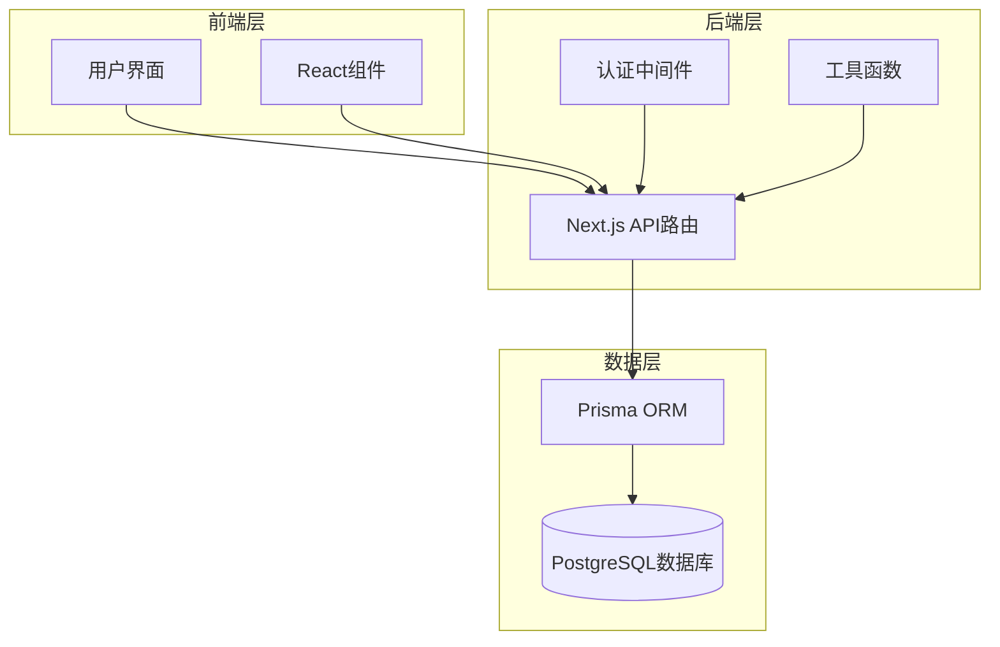

**图表来源**
- [schema.prisma](file://prisma/schema.prisma#L1-L314)
- [middleware.ts](file://lib/middleware.ts#L1-L47)

## 核心实体模型总览

系统的核心实体模型遵循以下设计原则：

- **层次化组织结构**：Organization → Team → Project → Task 的层级关系
- **多对多关联**：用户与团队、项目、任务之间的灵活关联
- **权限分层控制**：基于角色的权限管理和任务协作权限
- **数据完整性**：通过外键约束和级联操作确保数据一致性

每个实体都具备完整的生命周期管理，包括创建、更新、软删除等操作。

## User（用户）实体详解

### 字段定义与数据类型

| 字段名 | 数据类型 | 约束条件 | 默认值 | 描述 |
|--------|----------|----------|--------|------|
| id | String | @id @default(cuid()) | 自动生成 | 用户唯一标识符 |
| username | String | @unique @default("") | "" | 登录用户名 |
| password | String | @default("") | "" | 加密存储的密码 |
| name | String | 必填 | - | 真实姓名/显示名称 |
| email | String | 必填 | - | 邮箱地址（个人资料） |
| avatar | String | 可选 | null | 用户头像URL |
| gender | String | @default("未设置") | "未设置" | 性别信息 |
| role | String | @default("未设置") | "未设置" | 职业/角色 |
| isAdmin | Boolean | @default(false) | false | 是否为超级管理员 |
| inviteCode | String | @unique | null | 用户唯一邀请码 |
| currentOrganizationId | String | 可选 | null | 当前选择的组织ID |
| defaultTeamId | String | 可选 | null | 默认团队ID |
| points | Int | @default(0) | 0 | 用户积分，用于段位系统 |

### 关系映射

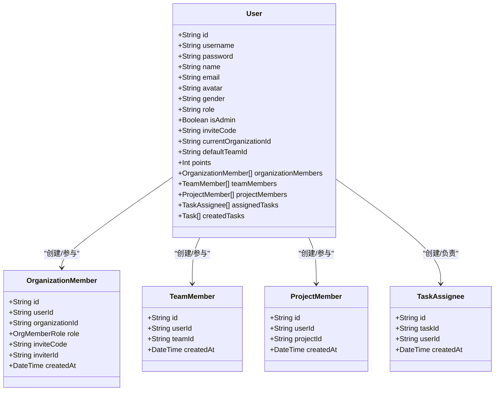

**图表来源**
- [schema.prisma](file://prisma/schema.prisma#L65-L96)
- [schema.prisma](file://prisma/schema.prisma#L38-L55)
- [schema.prisma](file://prisma/schema.prisma#L194-L205)
- [schema.prisma](file://prisma/schema.prisma#L208-L219)
- [schema.prisma](file://prisma/schema.prisma#L167-L178)

### 业务规则

1. **身份验证**：用户名和密码用于系统登录
2. **权限继承**：用户在不同组织中的角色独立管理
3. **默认设置**：提供合理的默认值确保数据完整性
4. **积分系统**：通过任务创建等行为获得积分

**章节来源**
- [schema.prisma](file://prisma/schema.prisma#L65-L96)
- [types.ts](file://lib/types.ts#L108-L120)

## Task（任务）实体详解

### 字段定义与数据类型

| 字段名 | 数据类型 | 约束条件 | 默认值 | 描述 |
|--------|----------|----------|--------|------|
| id | String | @id @default(cuid()) | 自动生成 | 任务唯一标识符 |
| title | String | 必填 | - | 任务标题 |
| description | String | 可选 | null | 任务描述 |
| startDate | DateTime | 必填 | - | 任务开始日期 |
| endDate | DateTime | 必填 | - | 任务结束日期 |
| startTime | String | 可选 | null | 开始时间（HH:MM） |
| endTime | String | 可选 | null | 结束时间（HH:MM） |
| type | TaskType | 必填 | - | 任务类型（daily/meeting/vacation） |
| color | String | 可选 | null | 任务颜色（仅daily类型） |
| progress | Int | @default(0) | 0 | 任务进度（0-100） |
| creatorId | String | 必填 | - | 创建人ID |
| projectId | String | 必填 | - | 所属项目ID |
| teamId | String | 可选 | null | 所属团队ID（可为空） |

### 关联关系

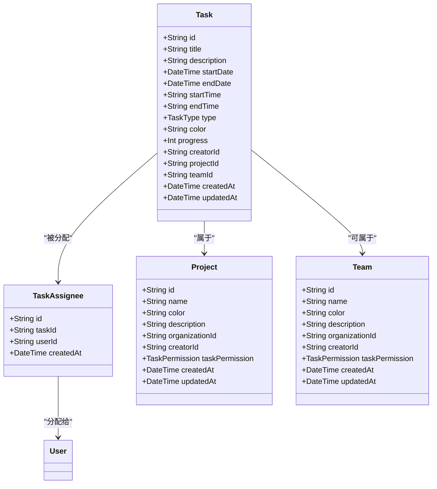

**图表来源**
- [schema.prisma](file://prisma/schema.prisma#L139-L164)
- [schema.prisma](file://prisma/schema.prisma#L167-L178)
- [schema.prisma](file://prisma/schema.prisma#L119-L136)
- [schema.prisma](file://prisma/schema.prisma#L99-L116)

### 任务类型与权限

系统支持三种任务类型：
- **daily**：日常任务，可设置颜色和时间段
- **meeting**：会议任务，通常为固定时间段
- **vacation**：假期任务，特殊标记

任务权限控制：
- **ALL_MEMBERS**：所有成员都可以创建/编辑/删除任务
- **CREATOR_ONLY**：仅创建者可以创建/编辑/删除任务

### 业务规则

1. **时间范围验证**：开始日期不能晚于结束日期
2. **负责人管理**：支持多负责人分配
3. **颜色限制**：颜色仅适用于daily类型的任务
4. **进度控制**：进度值限制在0-100范围内

**章节来源**
- [schema.prisma](file://prisma/schema.prisma#L139-L164)
- [schema.prisma](file://prisma/schema.prisma#L181-L191)
- [route.ts](file://app/api/tasks/route.ts#L275-L496)

## Team（团队）实体详解

### 字段定义与数据类型

| 字段名 | 数据类型 | 约束条件 | 默认值 | 描述 |
|--------|----------|----------|--------|------|
| id | String | @id @default(cuid()) | 自动生成 | 团队唯一标识符 |
| name | String | 必填 | - | 团队名称 |
| color | String | 必填 | - | 团队颜色标识 |
| description | String | 可选 | null | 团队描述 |
| organizationId | String | 必填 | - | 所属组织ID |
| creatorId | String | 必填 | - | 创建人ID |
| taskPermission | TaskPermission | @default(ALL_MEMBERS) | ALL_MEMBERS | 任务协作权限 |
| createdAt | DateTime | @default(now()) | 当前时间 | 创建时间 |
| updatedAt | DateTime | @updatedAt | 当前时间 | 更新时间 |

### 团队成员关系

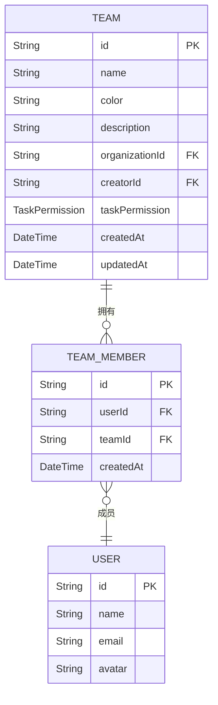

**图表来源**
- [schema.prisma](file://prisma/schema.prisma#L99-L116)
- [schema.prisma](file://prisma/schema.prisma#L194-L205)

### 业务规则

1. **组织归属**：团队必须属于特定组织
2. **权限继承**：团队权限影响其成员的任务协作能力
3. **创建者权限**：团队创建者拥有最高权限
4. **颜色标识**：用于界面显示和任务分类

**章节来源**
- [schema.prisma](file://prisma/schema.prisma#L99-L116)
- [types.ts](file://lib/types.ts#L84-L94)

## Project（项目）实体详解

### 字段定义与数据类型

| 字段名 | 数据类型 | 约束条件 | 默认值 | 描述 |
|--------|----------|----------|--------|------|
| id | String | @id @default(cuid()) | 自动生成 | 项目唯一标识符 |
| name | String | 必填 | - | 项目名称 |
| color | String | 必填 | - | 项目颜色标识 |
| description | String | 可选 | null | 项目描述 |
| organizationId | String | 必填 | - | 所属组织ID |
| creatorId | String | 必填 | - | 创建人ID |
| taskPermission | TaskPermission | @default(ALL_MEMBERS) | ALL_MEMBERS | 任务协作权限 |
| createdAt | DateTime | @default(now()) | 当前时间 | 创建时间 |
| updatedAt | DateTime | @updatedAt | 当前时间 | 更新时间 |

### 项目成员关系

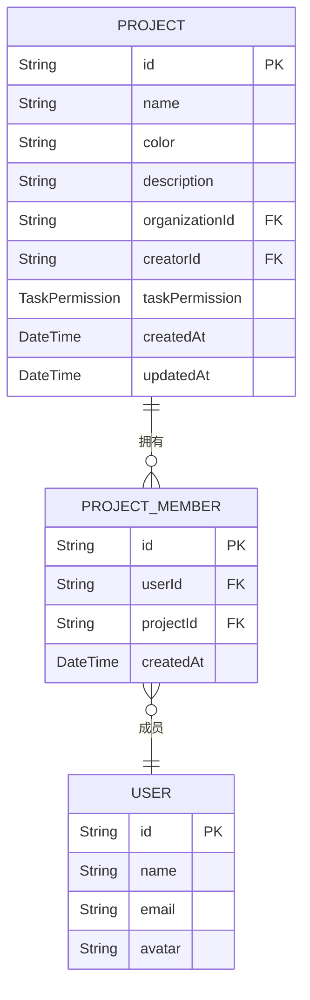

**图表来源**
- [schema.prisma](file://prisma/schema.prisma#L119-L136)
- [schema.prisma](file://prisma/schema.prisma#L208-L219)

### 特殊项目类型

系统支持特殊的"个人事务"项目，具有以下特性：
- **访问控制**：仅项目成员可见自己的任务
- **数据隔离**：个人任务与其他成员任务隔离
- **权限简化**：个人事务项目中的任务权限相对简化

**章节来源**
- [schema.prisma](file://prisma/schema.prisma#L119-L136)
- [route.ts](file://app/api/tasks/route.ts#L127-L132)
- [types.ts](file://lib/types.ts#L96-L106)

## Organization（组织）实体详解

### 字段定义与数据类型

| 字段名 | 数据类型 | 约束条件 | 默认值 | 描述 |
|--------|----------|----------|--------|------|
| id | String | @id @default(cuid()) | 自动生成 | 组织唯一标识符 |
| name | String | @unique | - | 组织名称 |
| description | String | 可选 | null | 组织描述 |
| isVerified | Boolean | @default(false) | false | 是否已认证 |
| joinRequiresApproval | Boolean | @default(false) | false | 加入是否需要审批 |
| creatorId | String | 必填 | - | 创建人ID |
| createdAt | DateTime | @default(now()) | 当前时间 | 创建时间 |
| updatedAt | DateTime | @updatedAt | 当前时间 | 更新时间 |

### 组织成员角色

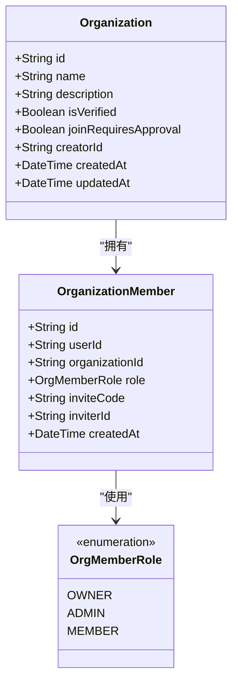

**图表来源**
- [schema.prisma](file://prisma/schema.prisma#L17-L35)
- [schema.prisma](file://prisma/schema.prisma#L38-L55)
- [schema.prisma](file://prisma/schema.prisma#L58-L62)

### 角色权限体系

- **OWNER（所有者）**：拥有组织的完全控制权，可删除组织
- **ADMIN（管理员）**：可管理组织设置和成员
- **MEMBER（普通成员）**：基本的组织成员权限

### 业务规则

1. **唯一性约束**：组织名称必须全局唯一
2. **认证机制**：支持组织认证功能
3. **加入控制**：可配置成员加入是否需要审批
4. **层级管理**：支持多层级的组织结构

**章节来源**
- [schema.prisma](file://prisma/schema.prisma#L17-L35)
- [schema.prisma](file://prisma/schema.prisma#L58-L62)
- [route.ts](file://app/api/organizations/[id]/route.ts#L108-L163)

## 实体关系图

系统的核心实体关系呈现清晰的层次化结构：

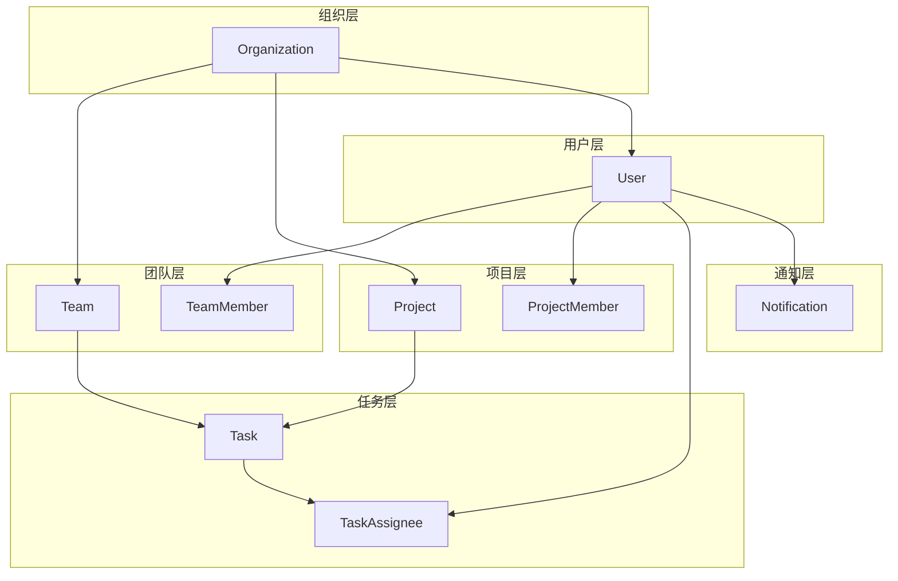

**图表来源**
- [schema.prisma](file://prisma/schema.prisma#L17-L35)
- [schema.prisma](file://prisma/schema.prisma#L99-L116)
- [schema.prisma](file://prisma/schema.prisma#L119-L136)
- [schema.prisma](file://prisma/schema.prisma#L139-L164)
- [schema.prisma](file://prisma/schema.prisma#L222-L236)

## 数据完整性约束

### 外键约束

系统通过外键约束确保实体间的数据完整性：

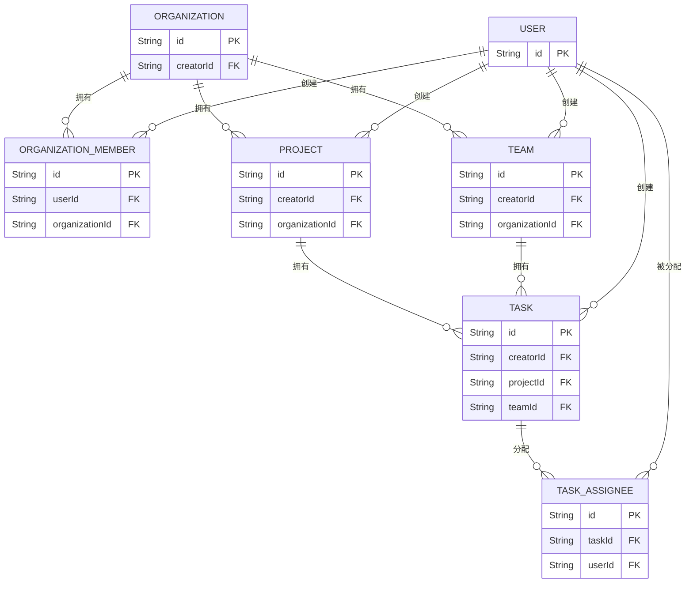

**图表来源**
- [schema.prisma](file://prisma/schema.prisma#L17-L35)
- [schema.prisma](file://prisma/schema.prisma#L99-L116)
- [schema.prisma](file://prisma/schema.prisma#L119-L136)
- [schema.prisma](file://prisma/schema.prisma#L139-L164)
- [schema.prisma](file://prisma/schema.prisma#L167-L178)

### 级联操作行为

系统采用智能的级联操作策略：

- **组织删除**：级联删除组织内的所有团队、项目、成员关系
- **用户删除**：级联删除用户创建的所有实体和关系
- **团队删除**：级联删除团队内的所有任务和成员关系
- **项目删除**：级联删除项目内的所有任务和成员关系

**章节来源**
- [schema.prisma](file://prisma/schema.prisma#L24-L24)
- [schema.prisma](file://prisma/schema.prisma#L107-L107)
- [schema.prisma](file://prisma/schema.prisma#L127-L127)
- [schema.prisma](file://prisma/schema.prisma#L156-L156)

## 字段验证规则

### 输入验证机制

系统实现了多层次的字段验证：

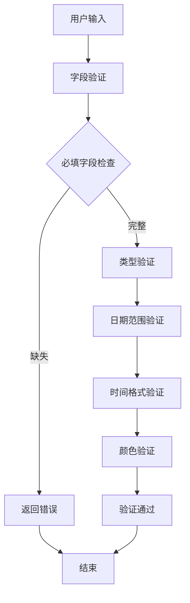

**图表来源**
- [validation.ts](file://lib/validation.ts#L138-L167)
- [validation.ts](file://lib/validation.ts#L76-L99)
- [validation.ts](file://lib/validation.ts#L106-L109)

### 具体验证规则

1. **必填字段验证**：确保关键字段不为空
2. **日期范围验证**：开始日期不能晚于结束日期
3. **时间格式验证**：严格的时间格式检查（HH:MM）
4. **颜色验证**：限制有效的颜色值集合
5. **字符串清理**：防止XSS攻击的字符串清理

**章节来源**
- [validation.ts](file://lib/validation.ts#L1-L168)
- [route.ts](file://app/api/tasks/route.ts#L285-L331)

## 索引策略与性能优化

### 数据库索引设计

系统针对高频查询场景设计了优化的索引策略：

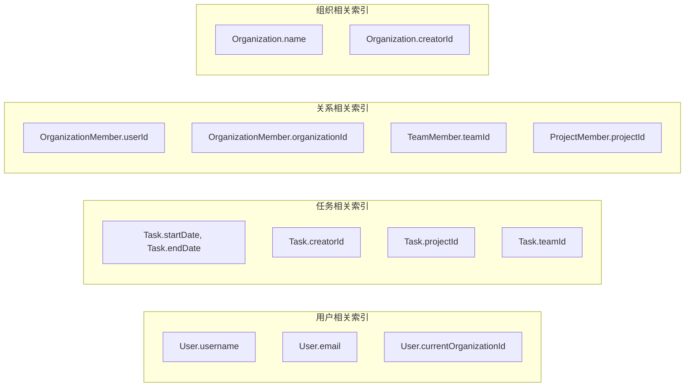

**图表来源**
- [schema.prisma](file://prisma/schema.prisma#L160-L164)
- [schema.prisma](file://prisma/schema.prisma#L33-L35)
- [schema.prisma](file://prisma/schema.prisma#L51-L55)
- [schema.prisma](file://prisma/schema.prisma#L203-L205)

### 性能优化建议

1. **查询优化**：使用适当的索引减少查询时间
2. **批量操作**：支持批量创建和更新操作
3. **缓存策略**：合理使用缓存减少数据库压力
4. **分页查询**：大数据量场景下使用分页
5. **连接池管理**：优化数据库连接池配置

**章节来源**
- [schema.prisma](file://prisma/schema.prisma#L160-L164)
- [schema.prisma](file://prisma/schema.prisma#L33-L35)

## 权限控制机制

### 多层次权限体系

系统实现了从用户到任务的多层级权限控制：

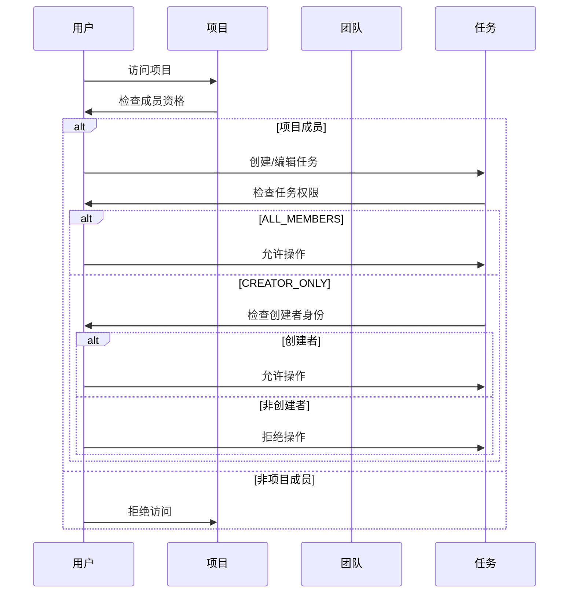

**图表来源**
- [permission-utils.ts](file://lib/utils/permission-utils.ts#L11-L30)
- [permission-utils.ts](file://lib/utils/permission-utils.ts#L40-L59)

### 权限检查流程

1. **身份验证**：确认用户身份的有效性
2. **组织验证**：验证用户在目标组织的成员身份
3. **项目/团队验证**：检查用户在项目或团队中的成员资格
4. **权限评估**：根据配置的协作权限决定操作权限
5. **操作执行**：执行相应的数据库操作

**章节来源**
- [permission-utils.ts](file://lib/utils/permission-utils.ts#L1-L72)
- [route.ts](file://app/api/tasks/route.ts#L74-L177)

## 多组织多团队多项目协作架构

### 层次化架构设计

系统采用清晰的层次化架构，支持复杂的多组织协作：

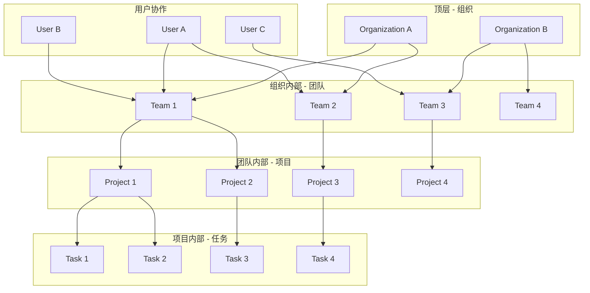

### 协作模式

1. **跨团队协作**：用户可以同时参与多个团队的任务
2. **跨项目协作**：单个任务可以涉及多个项目的资源
3. **权限继承**：用户在不同上下文中的权限独立管理
4. **数据隔离**：不同组织的数据完全隔离

**章节来源**
- [schema.prisma](file://prisma/schema.prisma#L17-L35)
- [schema.prisma](file://prisma/schema.prisma#L99-L116)
- [schema.prisma](file://prisma/schema.prisma#L119-L136)

## 故障排除指南

### 常见问题诊断

1. **认证失败**：检查JWT令牌的有效性和格式
2. **权限错误**：验证用户在目标组织/项目/团队中的成员身份
3. **数据约束冲突**：检查唯一性约束和外键约束
4. **查询性能问题**：分析索引使用情况和查询计划

### 调试工具

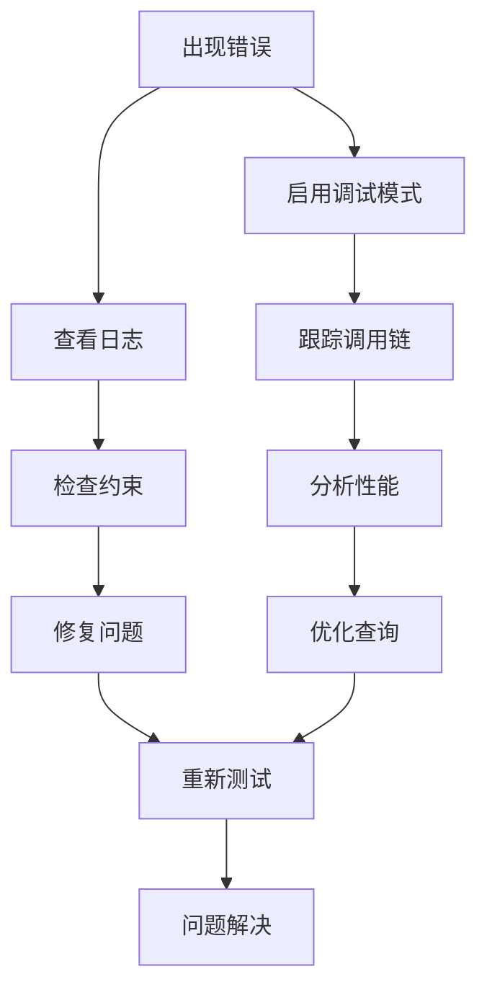

**图表来源**
- [middleware.ts](file://lib/middleware.ts#L10-L39)
- [api-response.ts](file://lib/api-response.ts#L1-L101)

### 性能监控

1. **慢查询监控**：识别和优化慢查询
2. **连接池监控**：确保数据库连接的合理使用
3. **内存使用监控**：监控应用内存使用情况
4. **错误率监控**：跟踪API错误率和异常情况

**章节来源**
- [middleware.ts](file://lib/middleware.ts#L1-L47)
- [api-response.ts](file://lib/api-response.ts#L1-L101)

## 结论

本系统的核心实体模型设计充分体现了现代任务管理系统的复杂需求。通过精心设计的层次化架构、严格的权限控制和完善的约束机制，系统能够有效支持多组织、多团队、多项目的协作管理。

### 主要优势

1. **清晰的层次结构**：从组织到任务的明确层级关系
2. **灵活的权限控制**：支持多种协作模式和权限配置
3. **完善的数据完整性**：通过外键约束和级联操作确保数据一致
4. **高性能的查询设计**：针对高频场景优化的索引策略
5. **安全的认证机制**：基于JWT的安全认证和授权

### 技术特色

- **现代化的ORM设计**：基于Prisma的类型安全和开发体验
- **完整的生命周期管理**：支持实体的创建、更新、删除和查询
- **灵活的扩展性**：易于添加新的实体和关系
- **强大的查询能力**：支持复杂的关联查询和聚合操作

该实体模型为构建企业级任务管理和协作系统奠定了坚实的基础，能够满足各种规模组织的协作需求。