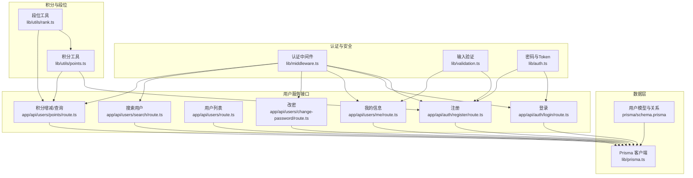
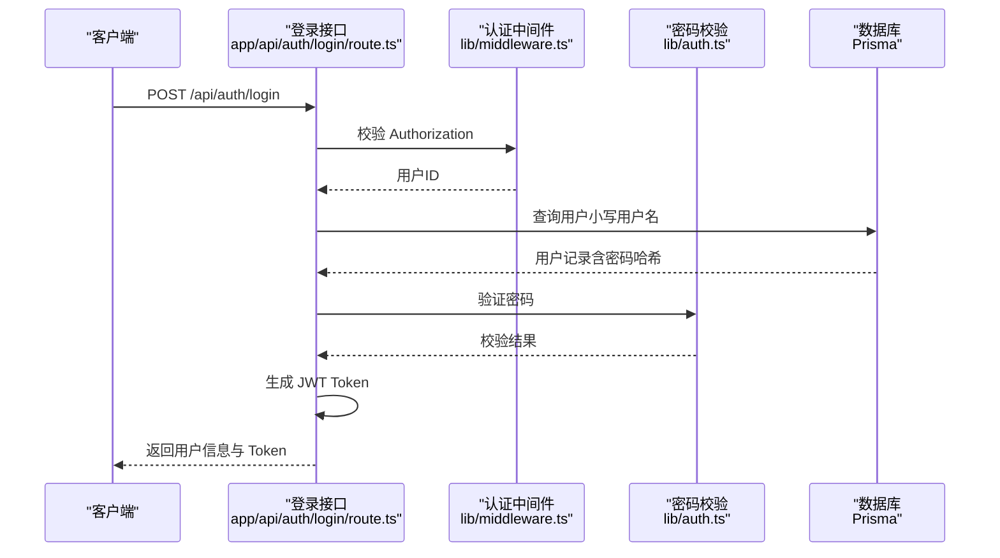
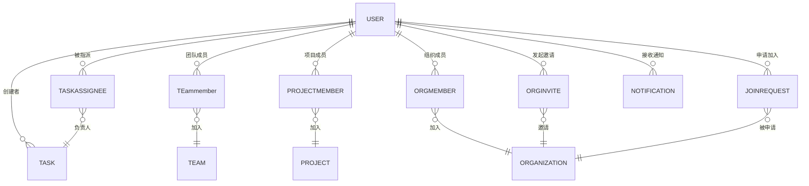
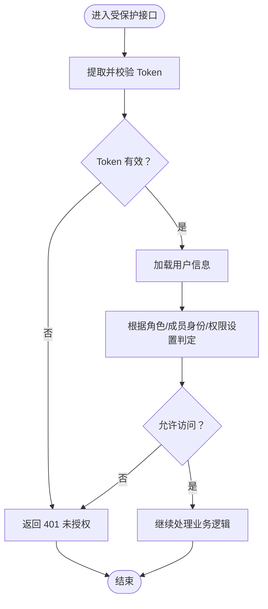
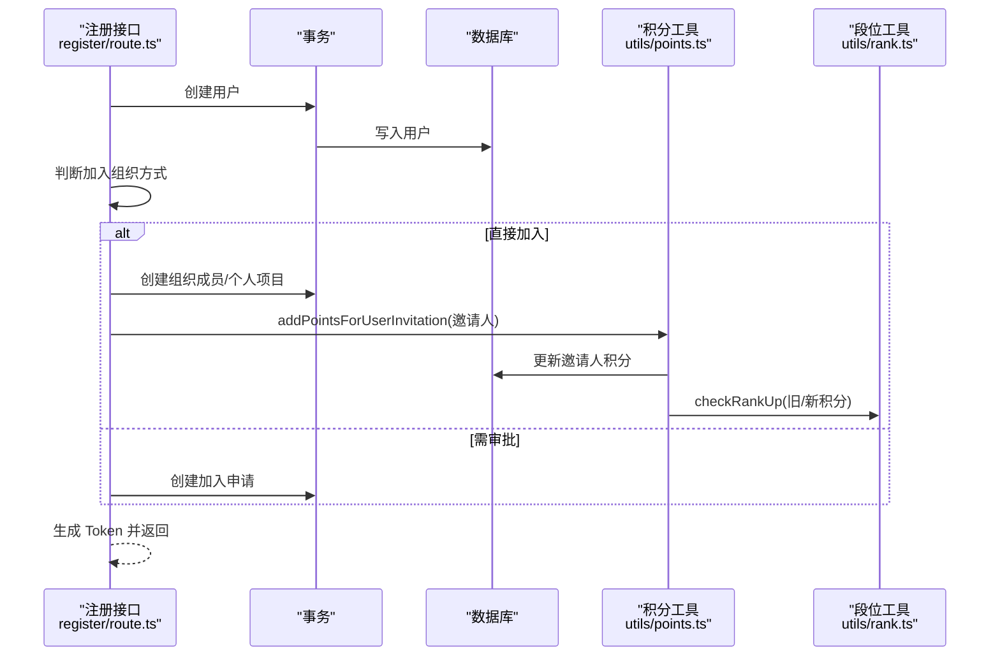
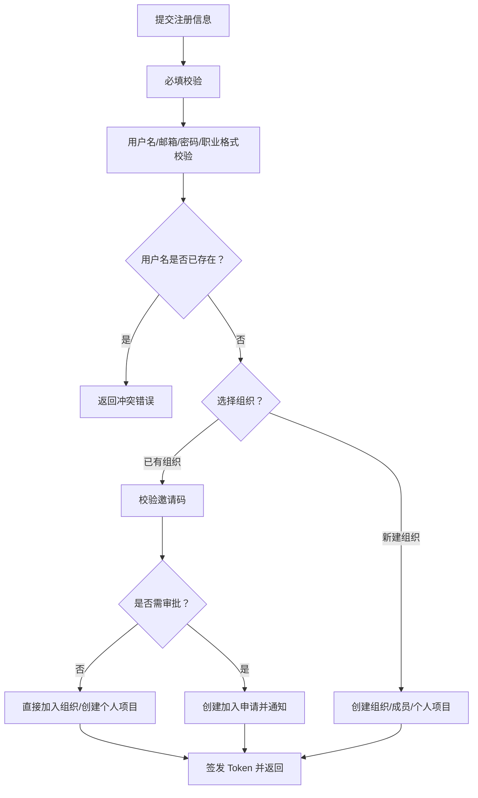
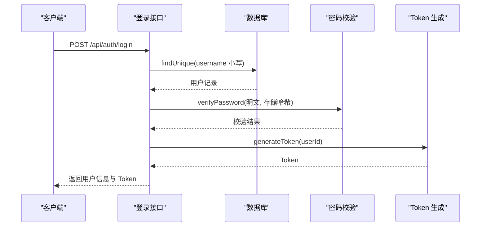
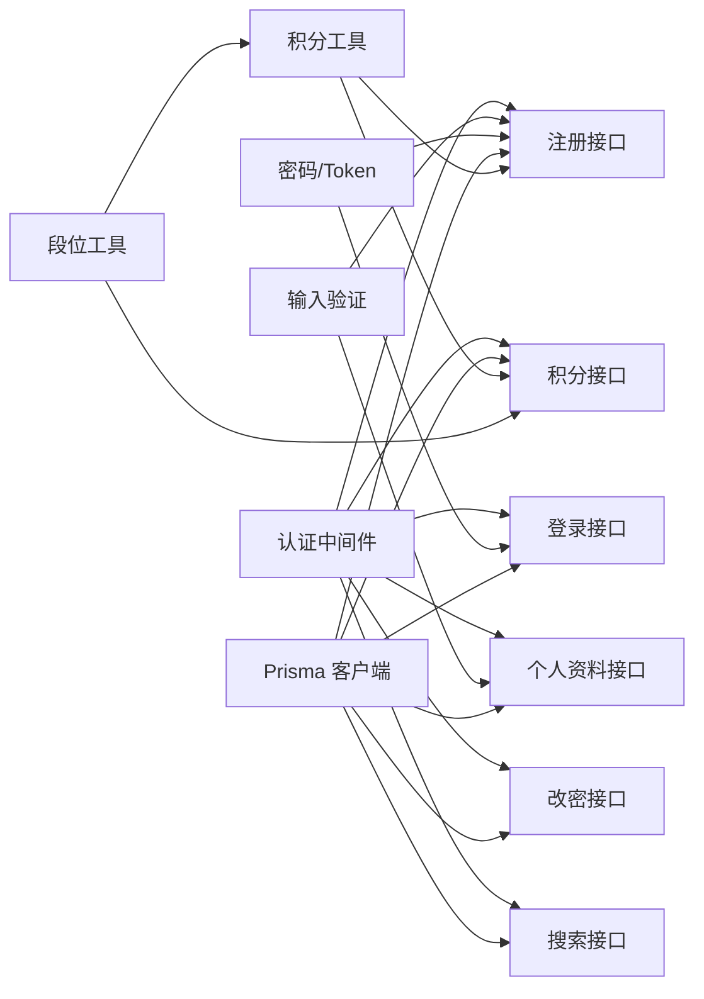

# 用户实体模型

<cite>
**本文引用的文件**
- [prisma/schema.prisma](file://prisma/schema.prisma)
- [lib/prisma.ts](file://lib/prisma.ts)
- [app/api/auth/register/route.ts](file://app/api/auth/register/route.ts)
- [app/api/auth/login/route.ts](file://app/api/auth/login/route.ts)
- [app/api/users/route.ts](file://app/api/users/route.ts)
- [app/api/users/me/route.ts](file://app/api/users/me/route.ts)
- [app/api/users/change-password/route.ts](file://app/api/users/change-password/route.ts)
- [app/api/users/search/route.ts](file://app/api/users/search/route.ts)
- [app/api/users/points/route.ts](file://app/api/users/points/route.ts)
- [lib/validation.ts](file://lib/validation.ts)
- [lib/auth.ts](file://lib/auth.ts)
- [lib/middleware.ts](file://lib/middleware.ts)
- [lib/utils/points.ts](file://lib/utils/points.ts)
- [lib/utils/rank.ts](file://lib/utils/rank.ts)
- [lib/utils/permission-utils.ts](file://lib/utils/permission-utils.ts)
</cite>

## 目录
1. [简介](#简介)
2. [项目结构](#项目结构)
3. [核心组件](#核心组件)
4. [架构总览](#架构总览)
5. [详细组件分析](#详细组件分析)
6. [依赖分析](#依赖分析)
7. [性能考量](#性能考量)
8. [故障排查指南](#故障排查指南)
9. [结论](#结论)
10. [附录](#附录)

## 简介
本文件系统化阐述用户实体模型的设计理念与实现细节，覆盖字段定义、约束与业务含义，用户与其他实体的关系，角色与权限控制机制，积分与段位体系，以及用户注册、登录、个人资料管理的业务流程。同时提供数据验证规则、安全考虑与性能优化建议，帮助开发者与产品人员准确理解与使用用户模型。

## 项目结构
围绕用户实体的关键代码分布在以下位置：
- 数据模型定义：prisma/schema.prisma 中的 User 模型及其关联关系
- 数据访问层：lib/prisma.ts 提供 Prisma 客户端实例
- 用户相关 API：注册、登录、查询、个人资料、改密、搜索、积分等接口
- 安全与验证：lib/auth.ts（JWT、密码哈希/校验）、lib/validation.ts（输入验证）、lib/middleware.ts（认证中间件）
- 积分与段位：lib/utils/points.ts、lib/utils/rank.ts
- 权限工具：lib/utils/permission-utils.ts（项目/团队任务权限）

图表来源
- [lib/prisma.ts](file://lib/prisma.ts#L1-L12)
- [prisma/schema.prisma](file://prisma/schema.prisma#L64-L96)
- [lib/middleware.ts](file://lib/middleware.ts#L1-L47)
- [lib/validation.ts](file://lib/validation.ts#L1-L168)
- [lib/auth.ts](file://lib/auth.ts#L1-L78)
- [app/api/auth/register/route.ts](file://app/api/auth/register/route.ts#L1-L349)
- [app/api/auth/login/route.ts](file://app/api/auth/login/route.ts#L1-L75)
- [app/api/users/route.ts](file://app/api/users/route.ts#L1-L132)
- [app/api/users/me/route.ts](file://app/api/users/me/route.ts#L1-L115)
- [app/api/users/change-password/route.ts](file://app/api/users/change-password/route.ts#L1-L74)
- [app/api/users/search/route.ts](file://app/api/users/search/route.ts#L1-L57)
- [app/api/users/points/route.ts](file://app/api/users/points/route.ts#L1-L101)
- [lib/utils/points.ts](file://lib/utils/points.ts#L1-L99)
- [lib/utils/rank.ts](file://lib/utils/rank.ts#L1-L156)

章节来源
- [prisma/schema.prisma](file://prisma/schema.prisma#L64-L96)
- [lib/prisma.ts](file://lib/prisma.ts#L1-L12)

## 核心组件
- 用户实体 User：承载用户身份、凭证、资料、组织/团队/项目关联、通知、积分等核心属性
- 关系模型：与任务（创建者、负责人）、团队成员、项目成员、组织成员、邀请、通知、加入申请等形成复杂关联
- 认证与授权：基于 JWT 的认证中间件，配合各接口的访问控制
- 积分与段位：用户积分累积与段位晋升逻辑，支持行为激励

章节来源
- [prisma/schema.prisma](file://prisma/schema.prisma#L64-L96)
- [lib/middleware.ts](file://lib/middleware.ts#L1-L47)
- [lib/utils/rank.ts](file://lib/utils/rank.ts#L1-L156)

## 架构总览
用户实体贯穿“认证—业务—数据”三层：
- 认证层：登录接口校验凭据，生成 Token；认证中间件统一拦截校验
- 业务层：注册、个人资料、改密、搜索、积分等接口围绕 User 实体展开
- 数据层：Prisma 模型定义字段、索引、外键与关系；通过 lib/prisma.ts 提供客户端

图表来源
- [app/api/auth/login/route.ts](file://app/api/auth/login/route.ts#L1-L75)
- [lib/middleware.ts](file://lib/middleware.ts#L1-L47)
- [lib/auth.ts](file://lib/auth.ts#L1-L78)
- [lib/prisma.ts](file://lib/prisma.ts#L1-L12)

## 详细组件分析

### 用户实体字段定义与业务语义
- id：字符串主键，cuid() 默认值，全局唯一
- username：字符串，唯一索引，默认空字符串，登录标识（小写存储）
- password：字符串，默认空字符串，存储加密后的密码
- name：字符串，真实姓名/显示名称
- email：字符串，个人资料中的邮箱
- avatar：字符串（可空），头像地址
- gender：字符串（可空），默认“未设置”，支持“男/女/其他”
- role：字符串（可空），默认“未设置”，职业信息（允许自定义，长度限制）
- isAdmin：布尔，默认 false，超级管理员标记
- inviteCode：字符串（可空），用户唯一邀请码（用于外部邀请）
- currentOrganizationId：字符串（可空），当前选择的组织
- defaultTeamId：字符串（可空），默认团队
- points：整数，默认 0，用户积分，驱动段位系统
- createdAt/updatedAt：时间戳，自动维护

字段约束与索引
- 唯一性：username、inviteCode、(userId, organizationId)（组织成员关系）
- 索引：creatorId、name、userId、organizationId、inviterId、inviteCode、userId/organizationId 组合索引等
- 外键：与 Organization、Team、Project、Task、Notification、OrganizationInvite、OrganizationJoinRequest 等模型建立关系

业务含义
- 凭据与安全：username/password 用于登录；password 存储加密
- 身份与资料：name/email/avatar/gender/role 用于展示与沟通
- 组织与协作：currentOrganizationId/defaultTeamId 管理上下文；points 驱动激励
- 关系网络：createdTasks/assignedTasks/teamMembers/projectMembers/organizationMembers 等反映用户在系统中的角色与连接

章节来源
- [prisma/schema.prisma](file://prisma/schema.prisma#L64-L96)

### 用户与其他实体的关系
- 任务
  - 创建者：User → Task（一对多，TaskCreator）
  - 负责人：User ← TaskAssignee → Task（多对多）
- 团队与项目
  - 团队成员：User → TeamMember → Team
  - 项目成员：User → ProjectMember → Project
- 组织
  - 组织成员：User → OrganizationMember → Organization
  - 组织邀请：User → OrganizationInvite（inviter、invitedUser）
  - 加入申请：User → OrganizationJoinRequest（applicant/handler/inviter）
- 通知：User → Notification（接收者）
- 角色与权限
  - 组织成员角色：OrgMemberRole（OWNER/ADMIN/MEMBER）
  - 项目/团队任务权限：TaskPermission（ALL_MEMBERS/CREATOR_ONLY），结合 canManageTaskInProject/canManageTaskInTeam 判定

图表来源
- [prisma/schema.prisma](file://prisma/schema.prisma#L64-L96)
- [prisma/schema.prisma](file://prisma/schema.prisma#L16-L35)
- [prisma/schema.prisma](file://prisma/schema.prisma#L98-L136)
- [prisma/schema.prisma](file://prisma/schema.prisma#L138-L178)
- [prisma/schema.prisma](file://prisma/schema.prisma#L221-L236)
- [prisma/schema.prisma](file://prisma/schema.prisma#L256-L285)
- [prisma/schema.prisma](file://prisma/schema.prisma#L287-L305)

章节来源
- [prisma/schema.prisma](file://prisma/schema.prisma#L64-L96)

### 用户角色系统与权限控制
- 组织成员角色：OWNER（拥有者）、ADMIN（管理员）、MEMBER（普通成员）
- 项目/团队任务权限：
  - ALL_MEMBERS：所有成员可管理任务
  - CREATOR_ONLY：仅创建者可管理任务
- 权限判定工具：
  - canManageTaskInProject / canManageTaskInTeam：综合 isAdmin、成员身份与权限设置进行判断
- 登录态与认证：
  - 认证中间件从 Authorization 头提取并校验 JWT，返回 userId
  - 登录接口校验密码并签发 Token

图表来源
- [lib/middleware.ts](file://lib/middleware.ts#L1-L47)
- [lib/utils/permission-utils.ts](file://lib/utils/permission-utils.ts#L1-L72)
- [app/api/auth/login/route.ts](file://app/api/auth/login/route.ts#L1-L75)

章节来源
- [prisma/schema.prisma](file://prisma/schema.prisma#L58-L62)
- [prisma/schema.prisma](file://prisma/schema.prisma#L187-L191)
- [lib/utils/permission-utils.ts](file://lib/utils/permission-utils.ts#L1-L72)
- [lib/middleware.ts](file://lib/middleware.ts#L1-L47)

### 积分系统与段位体系
- 积分来源与奖励：
  - 创建任务：+2
  - 创建团队：+5
  - 创建项目：+5
  - 成功邀请用户：+10
- 积分变更：
  - 注册流程中，若通过邀请加入且无需审批，异步为邀请人增加积分
  - 管理端/接口可直接为用户增加积分并返回段位变化
- 段位规则：
  - 按积分阈值映射到不同段位（青铜到王者），部分段位包含星级
  - 提供“距离下一段位还需积分”“段位进度百分比”等辅助信息

图表来源
- [app/api/auth/register/route.ts](file://app/api/auth/register/route.ts#L1-L349)
- [lib/utils/points.ts](file://lib/utils/points.ts#L1-L99)
- [lib/utils/rank.ts](file://lib/utils/rank.ts#L1-L156)

章节来源
- [lib/utils/points.ts](file://lib/utils/points.ts#L1-L99)
- [lib/utils/rank.ts](file://lib/utils/rank.ts#L1-L156)
- [app/api/auth/register/route.ts](file://app/api/auth/register/route.ts#L1-L349)

### 用户注册流程
- 输入校验：用户名、密码、姓名、邮箱、职业、组织信息必填
- 格式校验：用户名、邮箱、密码强度、职业长度
- 去重与清理：用户名唯一、输入清理
- 组织加入策略：
  - 已有组织：校验邀请码，决定是否直接加入或提交审批
  - 新组织：创建组织并成为 OWNER，初始化个人项目
- 积分与通知：邀请成功后为邀请人加分；根据加入方式发送站内信
- 登录态：注册成功后签发 Token

图表来源
- [app/api/auth/register/route.ts](file://app/api/auth/register/route.ts#L1-L349)
- [lib/validation.ts](file://lib/validation.ts#L1-L168)
- [lib/auth.ts](file://lib/auth.ts#L1-L78)

章节来源
- [app/api/auth/register/route.ts](file://app/api/auth/register/route.ts#L1-L349)
- [lib/validation.ts](file://lib/validation.ts#L1-L168)

### 用户登录流程
- 输入校验：用户名、密码必填
- 用户查找：按小写用户名查询
- 密码校验：bcrypt 对比哈希
- Token 签发：生成 JWT 返回客户端

图表来源
- [app/api/auth/login/route.ts](file://app/api/auth/login/route.ts#L1-L75)
- [lib/auth.ts](file://lib/auth.ts#L1-L78)

章节来源
- [app/api/auth/login/route.ts](file://app/api/auth/login/route.ts#L1-L75)
- [lib/auth.ts](file://lib/auth.ts#L1-L78)

### 个人资料管理与改密
- 获取/更新个人信息：支持 name、email、avatar、gender、role、defaultTeamId 等字段更新
- 邮箱格式与性别值校验
- 修改密码：校验旧密码、新密码长度与重复性，加密后更新

章节来源
- [app/api/users/me/route.ts](file://app/api/users/me/route.ts#L1-L115)
- [app/api/users/change-password/route.ts](file://app/api/users/change-password/route.ts#L1-L74)
- [lib/validation.ts](file://lib/validation.ts#L1-L168)

### 用户搜索与列表
- 搜索：按 username/name/email 模糊匹配，支持过滤已在组织内的用户
- 列表：按当前组织筛选用户，返回必要字段并排序

章节来源
- [app/api/users/search/route.ts](file://app/api/users/search/route.ts#L1-L57)
- [app/api/users/route.ts](file://app/api/users/route.ts#L1-L132)

## 依赖分析
- 数据模型依赖：User 与 Organization、Team、Project、Task、TaskAssignee、OrganizationMember、OrganizationInvite、OrganizationJoinRequest、Notification 等形成强耦合关系
- 认证依赖：所有受保护接口依赖认证中间件；登录依赖密码校验与 Token 生成
- 积分依赖：注册流程与管理端接口依赖积分工具；段位工具用于等级判定
- 工具依赖：输入验证、权限判定、Prisma 客户端

图表来源
- [lib/middleware.ts](file://lib/middleware.ts#L1-L47)
- [lib/validation.ts](file://lib/validation.ts#L1-L168)
- [lib/auth.ts](file://lib/auth.ts#L1-L78)
- [lib/prisma.ts](file://lib/prisma.ts#L1-L12)
- [lib/utils/points.ts](file://lib/utils/points.ts#L1-L99)
- [lib/utils/rank.ts](file://lib/utils/rank.ts#L1-L156)

章节来源
- [lib/middleware.ts](file://lib/middleware.ts#L1-L47)
- [lib/validation.ts](file://lib/validation.ts#L1-L168)
- [lib/auth.ts](file://lib/auth.ts#L1-L78)
- [lib/prisma.ts](file://lib/prisma.ts#L1-L12)
- [lib/utils/points.ts](file://lib/utils/points.ts#L1-L99)
- [lib/utils/rank.ts](file://lib/utils/rank.ts#L1-L156)

## 性能考量
- 索引优化
  - 为 username、inviteCode、(userId, organizationId) 等高频查询字段建立索引
  - 使用组合索引加速组织成员查询与通知检索
- 查询裁剪
  - 仅选择必要字段，避免 N+1 查询
  - 在列表与搜索接口限制返回字段与条数
- 缓存与批量
  - 对静态用户资料可引入缓存（注意一致性）
  - 批量操作时使用事务减少往返
- 密码与 Token
  - 密码哈希成本较高，避免在热路径重复计算
  - Token 体积小，尽量不在 Token 中携带敏感信息
- 日志与监控
  - 认证中间件输出关键日志，便于追踪异常

## 故障排查指南
- 认证失败
  - 检查 Authorization 头格式（支持 Bearer 与直传 Token）
  - 校验 JWT_SECRET 配置与过期时间
- 登录失败
  - 确认用户名大小写一致（小写存储）
  - 核对密码哈希是否正确
- 注册失败
  - 校验用户名唯一性与输入格式
  - 组织邀请码校验与审批流程
- 积分异常
  - 检查积分变更来源与事务一致性
  - 段位晋升逻辑是否触发

章节来源
- [lib/middleware.ts](file://lib/middleware.ts#L1-L47)
- [lib/auth.ts](file://lib/auth.ts#L1-L78)
- [app/api/auth/register/route.ts](file://app/api/auth/register/route.ts#L1-L349)
- [app/api/auth/login/route.ts](file://app/api/auth/login/route.ts#L1-L75)
- [lib/utils/points.ts](file://lib/utils/points.ts#L1-L99)

## 结论
用户实体模型以清晰的字段定义、完善的索引与关系设计支撑了完整的组织-团队-项目-任务协作体系。结合 JWT 认证、严格的输入验证、灵活的权限控制与可扩展的积分/段位系统，实现了从注册登录到个人资料管理、从协作权限到行为激励的闭环。建议在生产环境中强化安全配置（如 JWT_SECRET、HTTPS、速率限制）与性能优化（索引、缓存、批量处理）。

## 附录

### 字段一览与约束摘要
- id：字符串主键，cuid()
- username：字符串，唯一，登录标识（小写）
- password：字符串，加密存储
- name/email/avatar/gender/role：个人资料字段
- isAdmin：布尔，超级管理员
- inviteCode：字符串，唯一，用户邀请码
- currentOrganizationId/defaultTeamId：上下文关联
- points：整数，积分，驱动段位
- createdAt/updatedAt：时间戳

章节来源
- [prisma/schema.prisma](file://prisma/schema.prisma#L64-L96)