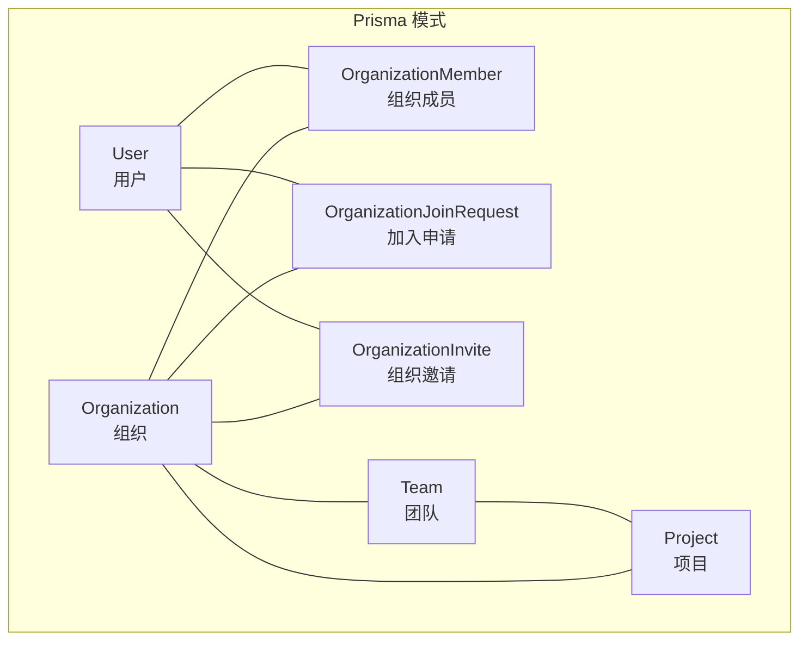
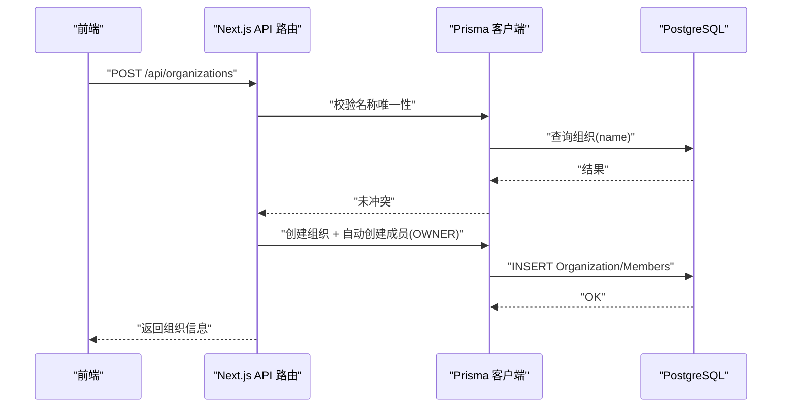
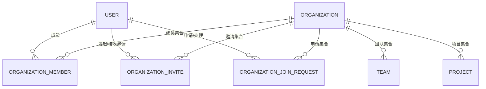
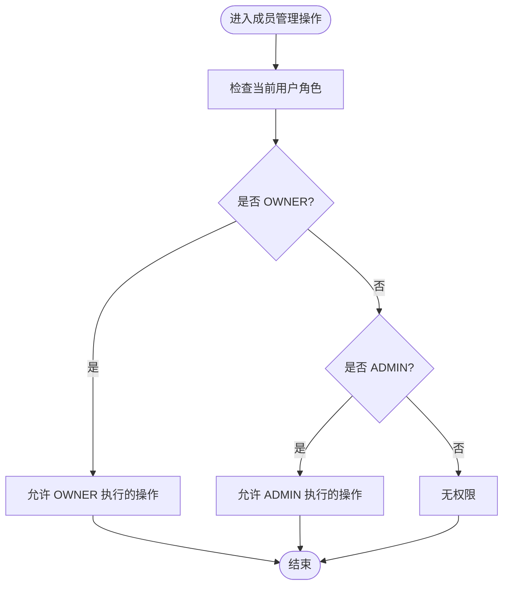
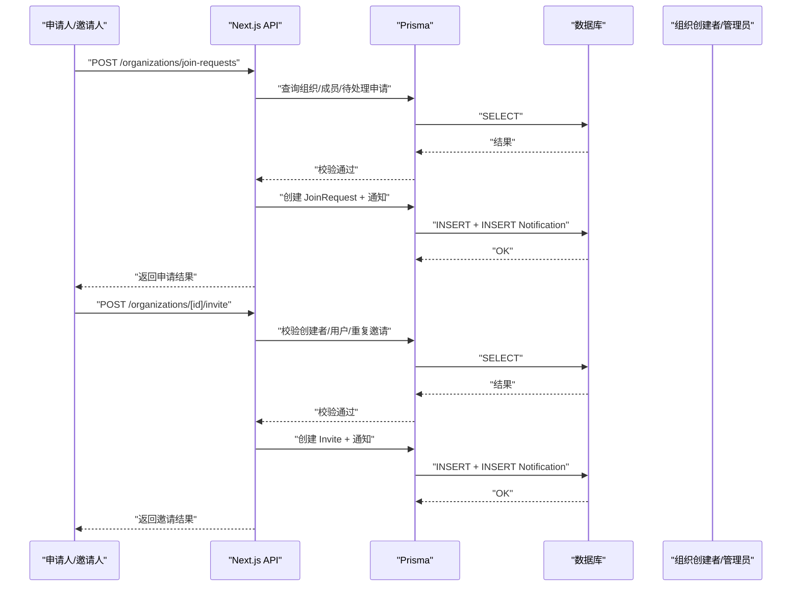
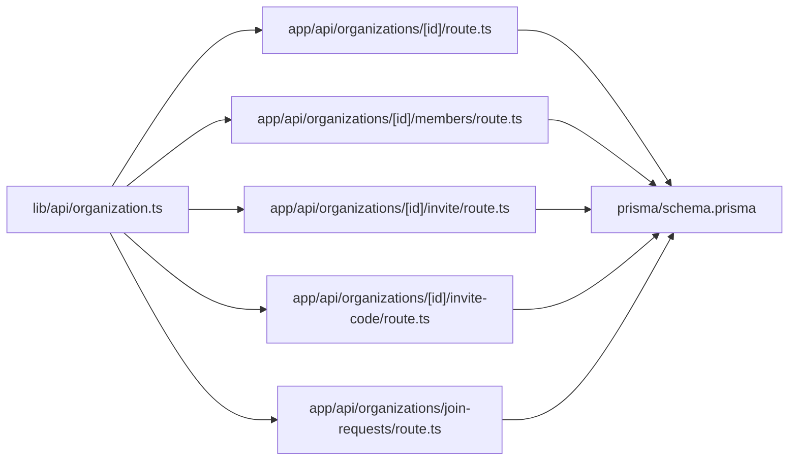

# 组织实体模型

<cite>
**本文引用的文件**
- [prisma/schema.prisma](file://prisma/schema.prisma)
- [prisma/migrations/20251115201512_add_organization_model/migration.sql](file://prisma/migrations/20251115201512_add_organization_model/migration.sql)
- [lib/api/organization.ts](file://lib/api/organization.ts)
- [app/api/organizations/route.ts](file://app/api/organizations/route.ts)
- [app/api/organizations/[id]/route.ts](file://app/api/organizations/[id]/route.ts)
- [app/api/organizations/[id]/members/route.ts](file://app/api/organizations/[id]/members/route.ts)
- [app/api/organizations/[id]/invite/route.ts](file://app/api/organizations/[id]/invite/route.ts)
- [app/api/organizations/[id]/invite-code/route.ts](file://app/api/organizations/[id]/invite-code/route.ts)
- [app/api/organizations/join-requests/route.ts](file://app/api/organizations/join-requests/route.ts)
- [lib/utils/permission-utils.ts](file://lib/utils/permission-utils.ts)
</cite>

## 目录
1. [简介](#简介)
2. [项目结构](#项目结构)
3. [核心组件](#核心组件)
4. [架构总览](#架构总览)
5. [详细组件分析](#详细组件分析)
6. [依赖分析](#依赖分析)
7. [性能考虑](#性能考虑)
8. [故障排查指南](#故障排查指南)
9. [结论](#结论)
10. [附录](#附录)

## 简介
本文件系统化阐述“组织”实体模型的设计理念与实现细节，覆盖字段定义、业务含义、与用户/团队/项目的关联关系、成员角色体系与权限控制、邀请与加入申请流程，并给出数据验证规则、索引策略与性能优化建议。目标是帮助开发者与产品人员全面理解组织模型在数据库层、API 层与前端交互层的协作方式。

## 项目结构
围绕组织实体的关键文件分布如下：
- 数据模型定义：prisma/schema.prisma
- 初始迁移脚本：prisma/migrations/.../add_organization_model/migration.sql
- 前端组织 API 定义：lib/api/organization.ts
- 组织服务端路由：
  - 全局组织 CRUD：app/api/organizations/route.ts
  - 单组织详情与更新/删除：app/api/organizations/[id]/route.ts
  - 成员管理：app/api/organizations/[id]/members/route.ts
  - 邀请与邀请码：app/api/organizations/[id]/invite/route.ts、app/api/organizations/[id]/invite-code/route.ts
  - 加入申请：app/api/organizations/join-requests/route.ts
- 权限工具：lib/utils/permission-utils.ts

图表来源
- [prisma/schema.prisma](file://prisma/schema.prisma#L17-L35)
- [prisma/schema.prisma](file://prisma/schema.prisma#L38-L55)
- [prisma/schema.prisma](file://prisma/schema.prisma#L257-L278)
- [prisma/schema.prisma](file://prisma/schema.prisma#L288-L305)

章节来源
- [prisma/schema.prisma](file://prisma/schema.prisma#L17-L35)
- [prisma/schema.prisma](file://prisma/schema.prisma#L38-L55)
- [prisma/schema.prisma](file://prisma/schema.prisma#L257-L278)
- [prisma/schema.prisma](file://prisma/schema.prisma#L288-L305)

## 核心组件
- 组织（Organization）：代表一个工作空间，包含名称、描述、是否认证、加入是否需审批、创建者、成员、团队、项目、加入申请、邀请等集合。
- 组织成员（OrganizationMember）：记录用户在组织中的角色、邀请码、邀请人等。
- 成员角色（OrgMemberRole）：OWNER（所有者）、ADMIN（管理员）、MEMBER（普通成员）。
- 加入申请（OrganizationJoinRequest）：记录用户加入组织的申请、状态、处理人等。
- 组织邀请（OrganizationInvite）：记录邀请发起、被邀请人、状态等。
- 用户（User）：与组织成员、团队、项目、通知等多方关联。
- 团队（Team）与项目（Project）：均属于组织维度的资源，受组织成员与权限控制影响。

章节来源
- [prisma/schema.prisma](file://prisma/schema.prisma#L17-L35)
- [prisma/schema.prisma](file://prisma/schema.prisma#L38-L55)
- [prisma/schema.prisma](file://prisma/schema.prisma#L58-L62)
- [prisma/schema.prisma](file://prisma/schema.prisma#L257-L278)
- [prisma/schema.prisma](file://prisma/schema.prisma#L288-L305)

## 架构总览
组织实体贯穿“模式层（Prisma）—服务端路由（Next.js API）—前端 API 客户端”的全链路。下图展示关键调用序列：

图表来源
- [app/api/organizations/route.ts](file://app/api/organizations/route.ts#L91-L203)
- [prisma/schema.prisma](file://prisma/schema.prisma#L17-L35)

章节来源
- [app/api/organizations/route.ts](file://app/api/organizations/route.ts#L91-L203)

## 详细组件分析

### 字段定义与业务语义
- id：字符串主键，使用 cuid() 生成，全局唯一。
- name：字符串，唯一索引，用于组织标识与搜索。
- description：字符串，可空，描述性信息。
- isVerified：布尔值，默认 false，用于标识组织是否通过认证。
- joinRequiresApproval：布尔值，默认 false，控制加入是否需要审批。
- creatorId：字符串，外键关联 User.id，级联删除。
- createdAt/updatedAt：时间戳，自动维护。
- 关系：
  - 一对多：Organization → OrganizationMember、Team、Project、OrganizationJoinRequest、OrganizationInvite
  - 多对一：OrganizationMember → User（inviterId 也指向 User）

字段来源与约束
- 字段与索引定义见 Prisma 模式
- 唯一性与外键约束由迁移脚本保证

章节来源
- [prisma/schema.prisma](file://prisma/schema.prisma#L17-L35)
- [prisma/migrations/20251115201512_add_organization_model/migration.sql](file://prisma/migrations/20251115201512_add_organization_model/migration.sql#L32-L42)
- [prisma/migrations/20251115201512_add_organization_model/migration.sql](file://prisma/migrations/20251115201512_add_organization_model/migration.sql#L55-L62)

### 组织与用户/团队/项目的关系
- 组织与用户：通过 OrganizationMember 关联，支持按角色区分权限。
- 组织与团队/项目：Team 和 Project 均以 organizationId 外键关联 Organization，形成组织内的资源树。
- 通知：当成员变更、邀请、加入申请等发生时，系统通过 Notification 表进行站内通知。

关系图

图表来源
- [prisma/schema.prisma](file://prisma/schema.prisma#L17-L35)
- [prisma/schema.prisma](file://prisma/schema.prisma#L38-L55)
- [prisma/schema.prisma](file://prisma/schema.prisma#L98-L136)
- [prisma/schema.prisma](file://prisma/schema.prisma#L257-L278)
- [prisma/schema.prisma](file://prisma/schema.prisma#L288-L305)

章节来源
- [prisma/schema.prisma](file://prisma/schema.prisma#L17-L35)
- [prisma/schema.prisma](file://prisma/schema.prisma#L98-L136)
- [prisma/schema.prisma](file://prisma/schema.prisma#L257-L278)
- [prisma/schema.prisma](file://prisma/schema.prisma#L288-L305)

### 成员角色系统与权限控制
- 角色枚举：OWNER、ADMIN、MEMBER。
- 权限边界：
  - 更新组织信息：仅 OWNER 或 ADMIN。
  - 删除组织：仅 OWNER。
  - 移除成员：仅 OWNER 或 ADMIN；禁止移除 OWNER。
  - 邀请成员：仅组织创建者。
  - 退出组织：普通成员可退，OWNER 不可自行退出。
- 项目/团队任务权限：项目与团队各自维护 taskPermission，配合 canManageTaskInProject/canManageTaskInTeam 判定成员在具体资源上的任务管理权限。

角色与权限流程图

图表来源
- [app/api/organizations/[id]/route.ts](file://app/api/organizations/[id]/route.ts#L121-L133)
- [app/api/organizations/[id]/route.ts](file://app/api/organizations/[id]/route.ts#L192-L194)
- [app/api/organizations/[id]/members/route.ts](file://app/api/organizations/[id]/members/route.ts#L386-L398)
- [app/api/organizations/[id]/invite/route.ts](file://app/api/organizations/[id]/invite/route.ts#L43-L46)
- [lib/utils/permission-utils.ts](file://lib/utils/permission-utils.ts#L11-L30)

章节来源
- [app/api/organizations/[id]/route.ts](file://app/api/organizations/[id]/route.ts#L121-L133)
- [app/api/organizations/[id]/route.ts](file://app/api/organizations/[id]/route.ts#L192-L194)
- [app/api/organizations/[id]/members/route.ts](file://app/api/organizations/[id]/members/route.ts#L386-L398)
- [app/api/organizations/[id]/invite/route.ts](file://app/api/organizations/[id]/invite/route.ts#L43-L46)
- [lib/utils/permission-utils.ts](file://lib/utils/permission-utils.ts#L11-L30)

### 邀请系统与加入申请系统
- 邀请流程：
  - 仅组织创建者可发起邀请。
  - 检查被邀请用户是否存在且非成员。
  - 若已有待处理邀请则阻止重复发送。
  - 创建邀请记录并发送站内通知给被邀请人。
- 加入申请流程：
  - 申请人提交申请，系统检查是否已是成员、是否存在待处理申请。
  - 创建申请记录并通知组织创建者。
  - 管理员可查看其管理组织的申请列表，进行审批或拒绝。

邀请与申请序列图

图表来源
- [app/api/organizations/join-requests/route.ts](file://app/api/organizations/join-requests/route.ts#L6-L112)
- [app/api/organizations/[id]/invite/route.ts](file://app/api/organizations/[id]/invite/route.ts#L12-L121)

章节来源
- [app/api/organizations/join-requests/route.ts](file://app/api/organizations/join-requests/route.ts#L6-L112)
- [app/api/organizations/[id]/invite/route.ts](file://app/api/organizations/[id]/invite/route.ts#L12-L121)

### 组织创建、成员管理、权限设置、邀请管理的完整业务流程
- 组织创建：
  - 校验名称唯一性与格式。
  - 自动创建成员记录并赋予 OWNER 角色。
  - 自动生成成员邀请码。
  - 如用户当前无组织，自动切换至新组织。
  - 自动创建“个人事务”项目并绑定创建者。
- 成员管理：
  - 查询成员列表（含邀请人信息与排序）。
  - 自助加入：生成 6 位邀请码并加入组织。
  - 管理员添加成员：生成邀请码并记录邀请人。
  - 退出组织：事务删除个人项目与成员关系；若为当前组织则切换组织。
  - 移除成员：禁止移除 OWNER；事务删除个人项目与成员关系并发送通知。
- 权限设置：
  - 组织层面：OWNER/ADMIN 可更新组织信息；OWNER 可删除组织。
  - 资源层面：项目/团队的 taskPermission 决定任务管理权限。
- 邀请管理：
  - 创建邀请并发送通知；支持查看邀请状态。

章节来源
- [app/api/organizations/route.ts](file://app/api/organizations/route.ts#L91-L203)
- [app/api/organizations/[id]/members/route.ts](file://app/api/organizations/[id]/members/route.ts#L6-L81)
- [app/api/organizations/[id]/members/route.ts](file://app/api/organizations/[id]/members/route.ts#L83-L272)
- [app/api/organizations/[id]/members/route.ts](file://app/api/organizations/[id]/members/route.ts#L274-L501)
- [app/api/organizations/[id]/route.ts](file://app/api/organizations/[id]/route.ts#L108-L163)
- [lib/utils/permission-utils.ts](file://lib/utils/permission-utils.ts#L11-L30)

## 依赖分析
- 模式层（Prisma）定义了组织、成员、邀请、申请、用户、团队、项目之间的关系与索引。
- 服务端路由层负责鉴权、输入校验、业务规则执行与数据库交互。
- 前端 API 客户端封装了组织相关接口，便于上层调用。

依赖图

图表来源
- [lib/api/organization.ts](file://lib/api/organization.ts#L84-L220)
- [app/api/organizations/[id]/route.ts](file://app/api/organizations/[id]/route.ts#L1-L212)
- [app/api/organizations/[id]/members/route.ts](file://app/api/organizations/[id]/members/route.ts#L1-L501)
- [app/api/organizations/[id]/invite/route.ts](file://app/api/organizations/[id]/invite/route.ts#L1-L122)
- [app/api/organizations/[id]/invite-code/route.ts](file://app/api/organizations/[id]/invite-code/route.ts#L1-L54)
- [app/api/organizations/join-requests/route.ts](file://app/api/organizations/join-requests/route.ts#L1-L200)
- [prisma/schema.prisma](file://prisma/schema.prisma#L17-L35)

章节来源
- [lib/api/organization.ts](file://lib/api/organization.ts#L84-L220)
- [app/api/organizations/[id]/route.ts](file://app/api/organizations/[id]/route.ts#L1-L212)
- [app/api/organizations/[id]/members/route.ts](file://app/api/organizations/[id]/members/route.ts#L1-L501)
- [app/api/organizations/[id]/invite/route.ts](file://app/api/organizations/[id]/invite/route.ts#L1-L122)
- [app/api/organizations/[id]/invite-code/route.ts](file://app/api/organizations/[id]/invite-code/route.ts#L1-L54)
- [app/api/organizations/join-requests/route.ts](file://app/api/organizations/join-requests/route.ts#L1-L200)
- [prisma/schema.prisma](file://prisma/schema.prisma#L17-L35)

## 性能考虑
- 索引策略（来自 Prisma 模式与迁移）：
  - Organization：creatorId、name 唯一索引。
  - OrganizationMember：userId、organizationId、inviterId、inviteCode 唯一索引。
  - OrganizationJoinRequest：organizationId+status、applicantId+status、inviterId、createdAt。
  - OrganizationInvite：organizationId+status、invitedUserId+status、inviterId、createdAt。
  - Team/Project：organizationId 等。
- 查询优化建议：
  - 在高频查询场景（如获取组织列表、成员列表）优先使用带索引的过滤条件。
  - 对于嵌套 include（如组织详情）应谨慎使用，避免 N+1 查询；必要时拆分查询或使用批量加载。
  - 对于大量成员/项目/团队的统计，可考虑缓存计数或延迟计算。
- 写入优化建议：
  - 批量插入成员或邀请时，尽量使用事务减少往返。
  - 邀请码生成冲突重试次数应限制，避免热点竞争。

章节来源
- [prisma/schema.prisma](file://prisma/schema.prisma#L33-L34)
- [prisma/schema.prisma](file://prisma/schema.prisma#L50-L54)
- [prisma/schema.prisma](file://prisma/schema.prisma#L274-L277)
- [prisma/schema.prisma](file://prisma/schema.prisma#L301-L304)
- [prisma/migrations/20251115201512_add_organization_model/migration.sql](file://prisma/migrations/20251115201512_add_organization_model/migration.sql#L55-L80)

## 故障排查指南
- 常见错误与定位
  - “无权访问/无权修改/无权删除”：检查当前用户在组织中的角色与操作权限。
  - “组织不存在/成员不存在”：确认组织 ID、用户 ID 正确性与存在性。
  - “该组织名称已存在”：检查名称唯一性约束。
  - “已是成员/已提交过申请/已发送过邀请”：检查重复状态与去重逻辑。
  - “邀请码尚未生成”：确认成员记录已创建并生成 inviteCode。
- 排查步骤
  - 核对鉴权中间件是否正确返回用户 ID。
  - 使用 Prisma 日志或数据库日志定位 SQL 执行情况。
  - 对事务性操作（退出/移除成员）确认回滚点与异常分支。
- 相关实现参考
  - 鉴权与错误响应封装：authenticate、successResponse、errorResponse。
  - 业务校验与事务：成员退出/移除、邀请创建、申请创建。

章节来源
- [app/api/organizations/[id]/route.ts](file://app/api/organizations/[id]/route.ts#L131-L133)
- [app/api/organizations/[id]/route.ts](file://app/api/organizations/[id]/route.ts#L192-L194)
- [app/api/organizations/[id]/members/route.ts](file://app/api/organizations/[id]/members/route.ts#L292-L308)
- [app/api/organizations/[id]/members/route.ts](file://app/api/organizations/[id]/members/route.ts#L414-L416)
- [app/api/organizations/[id]/invite/route.ts](file://app/api/organizations/[id]/invite/route.ts#L39-L46)
- [app/api/organizations/[id]/invite-code/route.ts](file://app/api/organizations/[id]/invite-code/route.ts#L38-L44)

## 结论
组织实体模型以清晰的领域边界与严格的权限控制为核心，结合邀请与加入申请机制，实现了从“创建—成员—权限—协作”的闭环。通过合理的索引与事务设计，能够在保证数据一致性的同时满足高并发场景下的可用性需求。建议在后续迭代中持续关注查询路径的性能与可维护性，逐步引入缓存与异步处理以进一步提升用户体验。

## 附录
- 前端组织 API 定义概览（类型与方法）
  - 组织对象、成员对象、团队对象、项目对象、加入请求、邀请等类型定义。
  - 组织 CRUD、成员管理、团队/项目查询、加入申请、邀请码与验证等接口。

章节来源
- [lib/api/organization.ts](file://lib/api/organization.ts#L10-L220)