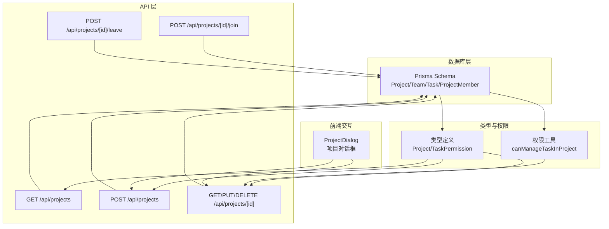

# 项目实体模型

<cite>
**本文档引用的文件**
- [prisma/schema.prisma](file://prisma/schema.prisma)
- [lib/types.ts](file://lib/types.ts)
- [lib/utils/permission-utils.ts](file://lib/utils/permission-utils.ts)
- [app/api/projects/route.ts](file://app/api/projects/route.ts)
- [app/api/projects/[id]/route.ts](file://app/api/projects/[id]/route.ts)
- [app/api/projects/[id]/join/route.ts](file://app/api/projects/[id]/join/route.ts)
- [app/api/projects/[id]/leave/route.ts](file://app/api/projects/[id]/leave/route.ts)
- [components/sidebar/project-dialog.tsx](file://components/sidebar/project-dialog.tsx)
- [lib/validation.ts](file://lib/validation.ts)
- [TASK_PERMISSION_FEATURE.md](file://TASK_PERMISSION_FEATURE.md)
- [prisma/migrations/20251115133624_add_task_permission/migration.sql](file://prisma/migrations/20251115133624_add_task_permission/migration.sql)
</cite>

## 目录
1. [简介](#简介)
2. [项目结构](#项目结构)
3. [核心组件](#核心组件)
4. [架构总览](#架构总览)
5. [详细组件分析](#详细组件分析)
6. [依赖关系分析](#依赖关系分析)
7. [性能考虑](#性能考虑)
8. [故障排除指南](#故障排除指南)
9. [结论](#结论)

## 简介
本文件系统化阐述项目实体模型的设计理念与实现细节，覆盖字段定义、业务含义、与组织/用户的关联关系、任务权限控制机制、以及在任务分类与管理中的作用。同时提供创建、成员管理、权限设置的业务流程说明，并给出数据验证规则、索引策略与性能优化建议。

## 项目结构
项目实体位于数据库层（Prisma Schema），并通过 API 层暴露 CRUD 与成员管理能力，前端通过对话框组件进行交互。整体采用“数据库模型 + 类型定义 + 权限工具 + API 控制器 + UI 对话框”的分层设计。

图表来源
- [prisma/schema.prisma](file://prisma/schema.prisma#L118-L136)
- [lib/types.ts](file://lib/types.ts#L96-L106)
- [lib/utils/permission-utils.ts](file://lib/utils/permission-utils.ts#L11-L30)
- [app/api/projects/route.ts](file://app/api/projects/route.ts#L6-L196)
- [app/api/projects/[id]/route.ts](file://app/api/projects/[id]/route.ts#L13-L283)
- [components/sidebar/project-dialog.tsx](file://components/sidebar/project-dialog.tsx#L40-L242)

章节来源
- [prisma/schema.prisma](file://prisma/schema.prisma#L118-L136)
- [lib/types.ts](file://lib/types.ts#L96-L106)
- [app/api/projects/route.ts](file://app/api/projects/route.ts#L6-L196)

## 核心组件
- 项目实体（Project）：承载项目基本信息、所属组织、创建者、成员集合、任务权限等。
- 项目成员关系（ProjectMember）：维护用户与项目的多对多关系。
- 任务权限枚举（TaskPermission）：定义 ALL_MEMBERS 与 CREATOR_ONLY 两种权限模式。
- 类型定义（lib/types.ts）：统一前后端对 Project 的接口约定。
- 权限工具（lib/utils/permission-utils.ts）：提供任务管理权限检查逻辑。
- API 控制器（app/api/projects/*）：实现项目 CRUD、成员加入/退出、权限校验。
- 前端对话框（components/sidebar/project-dialog.tsx）：提供项目创建/编辑/查看界面。

章节来源
- [prisma/schema.prisma](file://prisma/schema.prisma#L118-L136)
- [lib/types.ts](file://lib/types.ts#L96-L106)
- [lib/utils/permission-utils.ts](file://lib/utils/permission-utils.ts#L11-L30)
- [app/api/projects/route.ts](file://app/api/projects/route.ts#L116-L196)
- [app/api/projects/[id]/route.ts](file://app/api/projects/[id]/route.ts#L64-L187)
- [components/sidebar/project-dialog.tsx](file://components/sidebar/project-dialog.tsx#L40-L242)

## 架构总览
项目实体在系统中的职责与交互如下：
- 数据模型层：定义 Project、ProjectMember、TaskPermission 枚举及索引。
- 类型与权限层：定义 Project 接口与 canManageTaskInProject 权限检查。
- API 层：提供项目列表、创建、详情、更新、删除、成员加入/退出等接口，并进行权限与数据验证。
- 前端层：通过 ProjectDialog 统一收集表单数据并调用 API。

图表来源
- [components/sidebar/project-dialog.tsx](file://components/sidebar/project-dialog.tsx#L62-L98)
- [app/api/projects/route.ts](file://app/api/projects/route.ts#L116-L196)
- [lib/utils/permission-utils.ts](file://lib/utils/permission-utils.ts#L11-L30)

## 详细组件分析

### 项目实体字段定义与业务含义
- id：字符串主键，使用 cuid() 默认值，确保全局唯一。
- name：字符串，项目名称，必填；在同组织内需唯一。
- color：字符串，项目颜色，必填；用于前端展示与区分。
- description：字符串（可空），项目描述。
- organizationId：字符串，所属组织外键，用于限定项目归属。
- creatorId：字符串，创建者外键，用于权限判定与归属标识。
- taskPermission：枚举，任务权限控制，默认 ALL_MEMBERS。
- createdAt/updatedAt：时间戳，自动维护创建与更新时间。
- 关系：
  - organization：与 Organization 的多对一关系，onDelete: Cascade。
  - creator：与 User 的多对一关系，onDelete: Cascade。
  - members：与 ProjectMember 的一对多关系。
  - tasks：与 Task 的一对多关系。

字段约束与业务含义：
- 同组织内项目名称唯一，防止命名冲突。
- 任务权限默认 ALL_MEMBERS，向后兼容；支持 CREATOR_ONLY 严格控制。
- 成员通过 ProjectMember 关系表管理，支持动态增删。

章节来源
- [prisma/schema.prisma](file://prisma/schema.prisma#L118-L136)
- [app/api/projects/route.ts](file://app/api/projects/route.ts#L158-L174)

### 项目与组织、用户的关联关系
- 所属组织：organizationId 外键，限制项目归属；查询时通过组织维度过滤。
- 创建者：creatorId 外键，决定项目/组织层面的删除与转让权限。
- 成员关系：members 为 ProjectMember 的集合，实际成员 ID 通过 ProjectMember.userId 聚合。

图表来源
- [prisma/schema.prisma](file://prisma/schema.prisma#L17-L35)
- [prisma/schema.prisma](file://prisma/schema.prisma#L65-L96)
- [prisma/schema.prisma](file://prisma/schema.prisma#L118-L136)
- [prisma/schema.prisma](file://prisma/schema.prisma#L207-L219)

### 任务权限控制机制（ALL_MEMBERS vs CREATOR_ONLY）
- ALL_MEMBERS：项目成员均可创建/编辑/删除任务。
- CREATOR_ONLY：仅项目创建者可创建/编辑/删除任务。
- 权限检查逻辑：
  - 超级管理员（isAdmin: true）拥有所有权限。
  - 非成员无权限。
  - CREATOR_ONLY 模式下，仅 creatorId 与当前用户一致时才允许管理任务。
- 默认值：Project.taskPermission 默认为 ALL_MEMBERS，向后兼容。

图表来源
- [lib/utils/permission-utils.ts](file://lib/utils/permission-utils.ts#L11-L30)
- [lib/types.ts](file://lib/types.ts#L3-L3)
- [TASK_PERMISSION_FEATURE.md](file://TASK_PERMISSION_FEATURE.md#L59-L63)

章节来源
- [lib/utils/permission-utils.ts](file://lib/utils/permission-utils.ts#L11-L30)
- [lib/types.ts](file://lib/types.ts#L3-L3)
- [TASK_PERMISSION_FEATURE.md](file://TASK_PERMISSION_FEATURE.md#L1-L84)

### 项目在任务分类与管理中的作用
- 任务归属：Task.projectId 指向 Project，形成任务与项目的直接关联。
- 权限边界：通过 Project.taskPermission 控制任务的创建/编辑/删除权限，避免越权操作。
- 成员可见性：项目成员才能查看/管理项目下的任务，保障信息隔离。

章节来源
- [prisma/schema.prisma](file://prisma/schema.prisma#L138-L164)
- [lib/utils/permission-utils.ts](file://lib/utils/permission-utils.ts#L11-L30)

### 项目创建、成员管理、权限设置的业务流程

#### 项目创建流程

图表来源
- [app/api/projects/route.ts](file://app/api/projects/route.ts#L116-L196)
- [lib/validation.ts](file://lib/validation.ts#L127-L130)

章节来源
- [app/api/projects/route.ts](file://app/api/projects/route.ts#L116-L196)
- [lib/validation.ts](file://lib/validation.ts#L127-L130)

#### 成员加入/退出流程
- 加入项目：检查项目存在性与重复加入，创建 ProjectMember 关系。
- 退出项目：禁止项目创建者退出自己的项目；检查成员身份后删除关系，并通知创建者。

图表来源
- [app/api/projects/[id]/join/route.ts](file://app/api/projects/[id]/join/route.ts#L15-L59)
- [app/api/projects/[id]/leave/route.ts](file://app/api/projects/[id]/leave/route.ts#L12-L92)

章节来源
- [app/api/projects/[id]/join/route.ts](file://app/api/projects/[id]/join/route.ts#L15-L59)
- [app/api/projects/[id]/leave/route.ts](file://app/api/projects/[id]/leave/route.ts#L12-L92)

#### 权限设置与校验
- 前端：ProjectDialog 提供任务权限选择（ALL_MEMBERS/CREATOR_ONLY）。
- 后端：canManageTaskInProject 校验当前用户是否具备管理权限；API 在更新/删除等敏感操作中进行权限校验。

章节来源
- [components/sidebar/project-dialog.tsx](file://components/sidebar/project-dialog.tsx#L191-L225)
- [lib/utils/permission-utils.ts](file://lib/utils/permission-utils.ts#L11-L30)
- [app/api/projects/[id]/route.ts](file://app/api/projects/[id]/route.ts#L94-L97)

### 数据验证规则
- 必填字段：name、color、creatorId。
- 组织归属：创建者必须属于某个组织，且项目名称在同组织内唯一。
- 颜色格式：前端使用预设颜色，后端可扩展为十六进制颜色校验。
- 成员列表：至少包含一个成员；编辑时确保创建者在成员列表中。

章节来源
- [app/api/projects/route.ts](file://app/api/projects/route.ts#L120-L140)
- [app/api/projects/route.ts](file://app/api/projects/route.ts#L158-L174)
- [components/sidebar/project-dialog.tsx](file://components/sidebar/project-dialog.tsx#L62-L74)
- [lib/validation.ts](file://lib/validation.ts#L116-L119)

### 索引策略与性能优化建议
- 现有索引：
  - Project.creatorId、Project.organizationId：加速按创建者与组织的查询。
  - ProjectMember.userId、ProjectMember.projectId：加速成员关系查询。
  - Task.projectId：加速任务按项目筛选。
- 建议优化：
  - 为 Project.name + organizationId 建唯一索引，减少重复检查成本。
  - 为 ProjectMember(userId, projectId) 建复合索引，提升成员关系查询效率。
  - 对 Task.startDate/endDate 建索引，提升日程类任务查询性能。
  - 对 User.currentOrganizationId 建索引，提升用户组织切换查询。

章节来源
- [prisma/schema.prisma](file://prisma/schema.prisma#L134-L136)
- [prisma/schema.prisma](file://prisma/schema.prisma#L216-L219)
- [prisma/schema.prisma](file://prisma/schema.prisma#L160-L164)

## 依赖关系分析
- 数据模型依赖：Project 依赖 Organization、User；ProjectMember 依赖 User 与 Project；Task 依赖 Project。
- 类型依赖：lib/types.ts 定义 Project 接口与 TaskPermission 枚举，被 API 与前端共享。
- 权限依赖：lib/utils/permission-utils.ts 依赖 Project 接口与 TaskPermission 枚举，被 API 控制器调用。
- API 依赖：app/api/projects/* 依赖 Prisma 客户端与中间件，负责权限校验与数据验证。

图表来源
- [prisma/schema.prisma](file://prisma/schema.prisma#L118-L136)
- [lib/types.ts](file://lib/types.ts#L96-L106)
- [lib/utils/permission-utils.ts](file://lib/utils/permission-utils.ts#L1-L72)
- [app/api/projects/route.ts](file://app/api/projects/route.ts#L1-L196)

章节来源
- [prisma/schema.prisma](file://prisma/schema.prisma#L118-L136)
- [lib/types.ts](file://lib/types.ts#L96-L106)
- [lib/utils/permission-utils.ts](file://lib/utils/permission-utils.ts#L1-L72)
- [app/api/projects/route.ts](file://app/api/projects/route.ts#L1-L196)

## 性能考虑
- 查询优化：优先使用组织维度过滤项目列表；利用现有索引减少全表扫描。
- 写入优化：批量成员变更时使用 createMany/deleteMany，减少多次往返。
- 缓存策略：对常用项目列表与成员列表进行短期缓存，降低数据库压力。
- 分页与限制：对项目列表返回进行分页与条数限制，避免一次性加载过多数据。

## 故障排除指南
- 项目名称冲突：同组织内已存在同名项目，返回 409 冲突。
- 权限不足：非项目成员或非创建者在 CREATOR_ONLY 模式下尝试管理任务，返回 403。
- 成员加入重复：已是成员时再次加入，返回 400。
- 退出项目限制：项目创建者不可退出自己的项目，返回 403。
- 数据验证失败：必填字段缺失或格式不合法，返回 400。

章节来源
- [app/api/projects/route.ts](file://app/api/projects/route.ts#L120-L140)
- [app/api/projects/route.ts](file://app/api/projects/route.ts#L158-L174)
- [app/api/projects/[id]/route.ts](file://app/api/projects/[id]/route.ts#L94-L97)
- [app/api/projects/[id]/join/route.ts](file://app/api/projects/[id]/join/route.ts#L45-L57)
- [app/api/projects/[id]/leave/route.ts](file://app/api/projects/[id]/leave/route.ts#L36-L51)

## 结论
项目实体模型通过明确的字段定义、严格的权限控制与完善的成员管理流程，实现了任务在组织内的有序分类与安全协作。结合合理的索引策略与前端交互设计，能够在保证安全性的同时提供良好的用户体验。后续可在唯一索引与缓存策略上进一步优化性能表现。