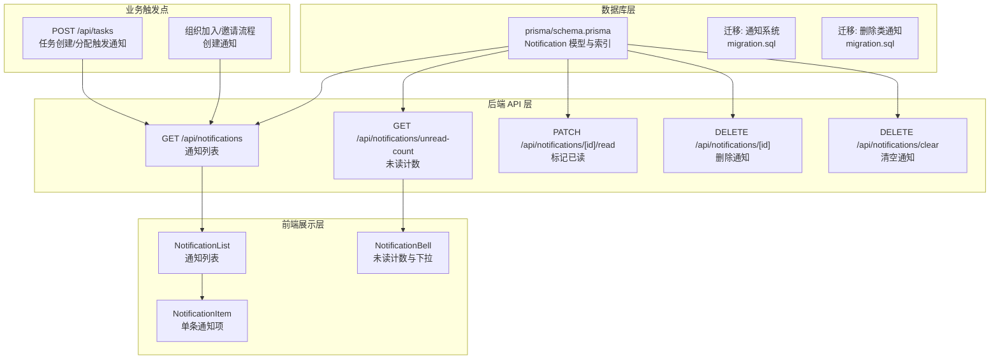
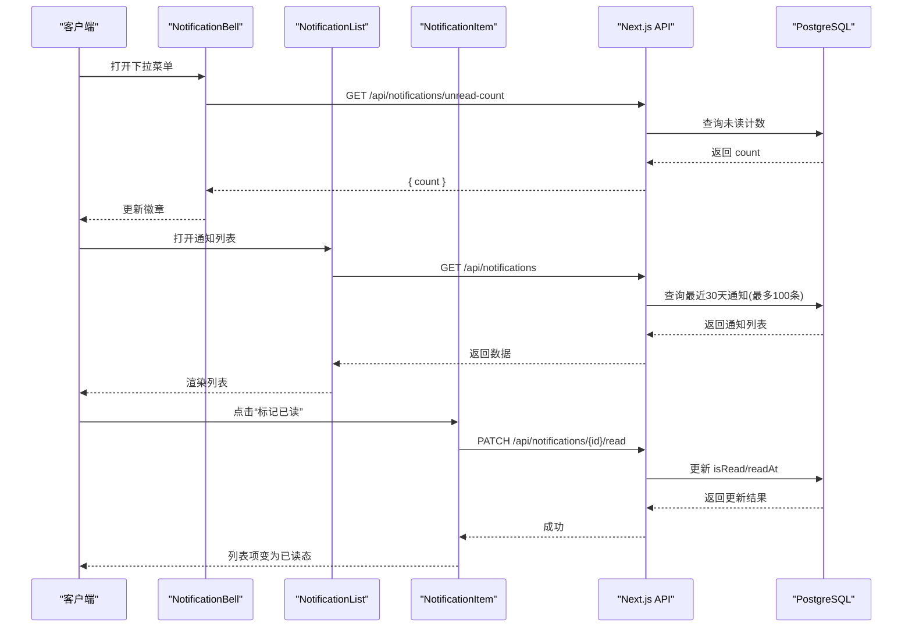
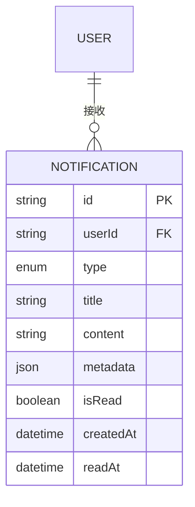
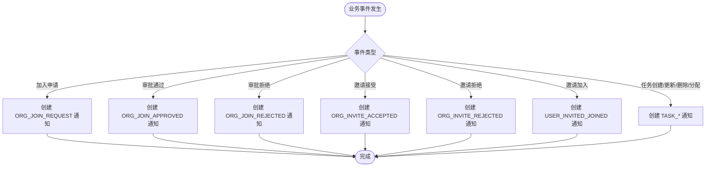
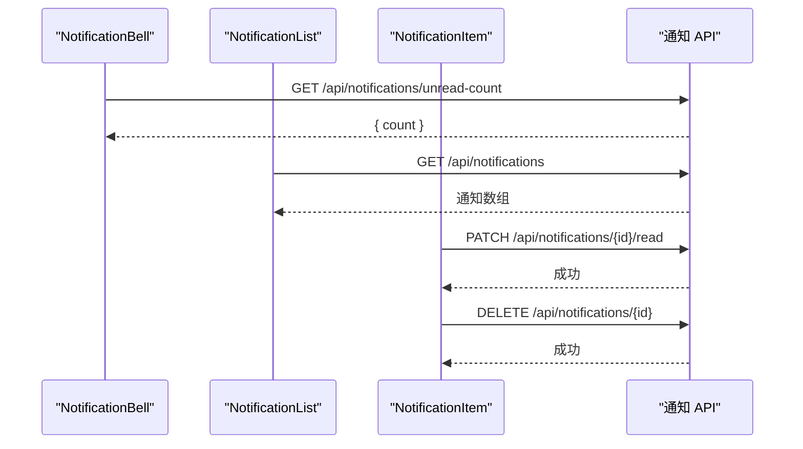
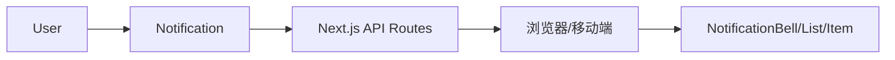

# 通知模型

<cite>
**本文引用的文件**
- [prisma/schema.prisma](file://prisma/schema.prisma)
- [prisma/migrations/20251115212303_add_notification_system/migration.sql](file://prisma/migrations/20251115212303_add_notification_system/migration.sql)
- [prisma/migrations/20251119132818_add_deletion_notifications/migration.sql](file://prisma/migrations/20251119132818_add_deletion_notifications/migration.sql)
- [lib/api/notification.ts](file://lib/api/notification.ts)
- [components/notification-bell.tsx](file://components/notification-bell.tsx)
- [components/notification-list.tsx](file://components/notification-list.tsx)
- [components/notification-item.tsx](file://components/notification-item.tsx)
- [app/api/notifications/route.ts](file://app/api/notifications/route.ts)
- [app/api/notifications/[id]/route.ts](file://app/api/notifications/[id]/route.ts)
- [app/api/notifications/clear/route.ts](file://app/api/notifications/clear/route.ts)
- [app/api/notifications/unread-count/route.ts](file://app/api/notifications/unread-count/route.ts)
- [NOTIFICATION_SYSTEM.md](file://NOTIFICATION_SYSTEM.md)
- [scripts/test-notifications.ts](file://scripts/test-notifications.ts)
- [app/api/tasks/route.ts](file://app/api/tasks/route.ts)
</cite>

## 目录
1. [简介](#简介)
2. [项目结构](#项目结构)
3. [核心组件](#核心组件)
4. [架构总览](#架构总览)
5. [详细组件分析](#详细组件分析)
6. [依赖分析](#依赖分析)
7. [性能考量](#性能考量)
8. [故障排查指南](#故障排查指南)
9. [结论](#结论)
10. [附录](#附录)

## 简介
本文件系统性阐述“通知模型”的设计与实现，覆盖数据库模型、字段定义、业务规则、触发机制、消息模板与发送策略、查询优化与性能考虑，并说明与用户权限、任务分配、团队协作的集成方式。通知系统采用关系型数据库与 JSON 元数据结合的方式，确保灵活性与可维护性。

## 项目结构
通知系统涉及三层：数据库模型层（Prisma）、后端 API 层（Next.js API Routes）、前端展示层（React 组件）。下图给出关键文件与模块的关系映射。

图表来源
- [prisma/schema.prisma](file://prisma/schema.prisma#L221-L236)
- [prisma/migrations/20251115212303_add_notification_system/migration.sql](file://prisma/migrations/20251115212303_add_notification_system/migration.sql#L7-L42)
- [app/api/notifications/route.ts](file://app/api/notifications/route.ts#L6-L82)
- [app/api/notifications/unread-count/route.ts](file://app/api/notifications/unread-count/route.ts#L6-L32)
- [app/api/notifications/[id]/route.ts](file://app/api/notifications/[id]/route.ts#L6-L42)
- [app/api/notifications/clear/route.ts](file://app/api/notifications/clear/route.ts#L6-L24)
- [components/notification-bell.tsx](file://components/notification-bell.tsx#L16-L75)
- [components/notification-list.tsx](file://components/notification-list.tsx#L17-L176)
- [components/notification-item.tsx](file://components/notification-item.tsx#L30-L363)
- [app/api/tasks/route.ts](file://app/api/tasks/route.ts#L462-L480)

章节来源
- [prisma/schema.prisma](file://prisma/schema.prisma#L221-L254)
- [prisma/migrations/20251115212303_add_notification_system/migration.sql](file://prisma/migrations/20251115212303_add_notification_system/migration.sql#L1-L64)
- [prisma/migrations/20251119132818_add_deletion_notifications/migration.sql](file://prisma/migrations/20251119132818_add_deletion_notifications/migration.sql#L1-L12)

## 核心组件
- 数据模型：Notification（通知）、NotificationType（消息类型枚举）、OrganizationJoinRequest（组织加入申请）、OrganizationInvite（组织邀请）。
- 后端 API：通知列表、未读计数、标记已读、删除单条、清空全部。
- 前端组件：通知铃铛、通知列表、单条通知项。
- 触发机制：组织加入/邀请、任务创建/更新/删除/分配等业务事件触发通知创建。

章节来源
- [lib/api/notification.ts](file://lib/api/notification.ts#L7-L70)
- [NOTIFICATION_SYSTEM.md](file://NOTIFICATION_SYSTEM.md#L1-L1066)

## 架构总览
通知系统遵循“事件驱动 + 关系存储 + JSON 元数据”的架构模式。业务事件发生时，系统在事务中创建通知；前端通过 API 获取列表、未读计数，并进行交互式操作（标记已读、删除、清空）。

图表来源
- [components/notification-bell.tsx](file://components/notification-bell.tsx#L20-L44)
- [components/notification-list.tsx](file://components/notification-list.tsx#L24-L42)
- [components/notification-item.tsx](file://components/notification-item.tsx#L44-L67)
- [app/api/notifications/route.ts](file://app/api/notifications/route.ts#L6-L82)
- [app/api/notifications/unread-count/route.ts](file://app/api/notifications/unread-count/route.ts#L6-L32)
- [app/api/notifications/[id]/route.ts](file://app/api/notifications/[id]/route.ts#L6-L42)

## 详细组件分析

### 数据模型与字段定义
- 表：Notification
  - 字段：id、userId、type、title、content、metadata、isRead、createdAt、readAt
  - 关系：userId -> User（级联删除）
  - 索引：复合索引（userId, isRead）、createdAt
- 枚举：NotificationType
  - 组织类：ORG_JOIN_REQUEST、ORG_JOIN_APPROVED、ORG_JOIN_REJECTED、ORG_INVITE_RECEIVED、ORG_INVITE_ACCEPTED、ORG_INVITE_REJECTED、ORG_MEMBER_REMOVED
  - 删除类：TEAM_DELETED、PROJECT_DELETED
  - 任务类：TASK_CREATED、TASK_UPDATED、TASK_DELETED、TASK_ASSIGNED
  - 其他：USER_INVITED_JOINED

图表来源
- [prisma/schema.prisma](file://prisma/schema.prisma#L221-L236)
- [prisma/migrations/20251115212303_add_notification_system/migration.sql](file://prisma/migrations/20251115212303_add_notification_system/migration.sql#L7-L20)

章节来源
- [prisma/schema.prisma](file://prisma/schema.prisma#L221-L254)
- [prisma/migrations/20251115212303_add_notification_system/migration.sql](file://prisma/migrations/20251115212303_add_notification_system/migration.sql#L1-L64)
- [prisma/migrations/20251119132818_add_deletion_notifications/migration.sql](file://prisma/migrations/20251119132818_add_deletion_notifications/migration.sql#L1-L12)

### 业务规则与消息模板
- 未读追踪：isRead 默认 false，标记已读时写入 readAt。
- 时间窗口：默认查询最近30天，最多100条，按创建时间倒序。
- 元数据：使用 JSON 存储动态上下文（如申请ID、任务ID、组织名等），便于前端渲染与交互。
- 类型安全：后端使用枚举约束类型，前端使用字符串类型接口，保持兼容性。

章节来源
- [app/api/notifications/route.ts](file://app/api/notifications/route.ts#L17-L38)
- [lib/api/notification.ts](file://lib/api/notification.ts#L7-L18)
- [NOTIFICATION_SYSTEM.md](file://NOTIFICATION_SYSTEM.md#L321-L350)

### 触发机制与发送策略
- 组织加入申请：当用户提交加入申请时，向组织创建人发送 ORG_JOIN_REQUEST；审批通过/拒绝分别发送 ORG_JOIN_APPROVED/ORG_JOIN_REJECTED。
- 邀请加入：当被邀请用户接受邀请或拒绝邀请时，分别发送 ORG_INVITE_ACCEPTED/ORG_INVITE_REJECTED；邀请人收到 USER_INVITED_JOINED。
- 删除通知：当团队/项目被删除时，向相关成员发送 ORG_MEMBER_REMOVED/TEAM_DELETED/PROJECT_DELETED。
- 任务相关：任务创建、更新、删除、分配均触发相应通知；分配给其他负责人的场景会批量创建通知。

图表来源
- [NOTIFICATION_SYSTEM.md](file://NOTIFICATION_SYSTEM.md#L467-L577)
- [app/api/tasks/route.ts](file://app/api/tasks/route.ts#L462-L480)

章节来源
- [NOTIFICATION_SYSTEM.md](file://NOTIFICATION_SYSTEM.md#L106-L273)
- [app/api/tasks/route.ts](file://app/api/tasks/route.ts#L462-L480)

### 前端组件与交互
- NotificationBell：轮询未读计数，打开下拉时刷新；徽章显示未读数量。
- NotificationList：加载通知列表，支持清空全部；根据 isRead 计算未读数量。
- NotificationItem：按类型渲染图标与操作（同意/拒绝加入申请、接受/拒绝邀请、标记已读、删除）；相对时间显示。

图表来源
- [components/notification-bell.tsx](file://components/notification-bell.tsx#L20-L44)
- [components/notification-list.tsx](file://components/notification-list.tsx#L24-L42)
- [components/notification-item.tsx](file://components/notification-item.tsx#L44-L67)
- [app/api/notifications/[id]/route.ts](file://app/api/notifications/[id]/route.ts#L6-L42)

章节来源
- [components/notification-bell.tsx](file://components/notification-bell.tsx#L16-L75)
- [components/notification-list.tsx](file://components/notification-list.tsx#L17-L176)
- [components/notification-item.tsx](file://components/notification-item.tsx#L30-L363)

### API 定义与行为
- GET /api/notifications：支持 unreadOnly 查询参数，返回最近30天最多100条通知。
- GET /api/notifications/unread-count：返回未读计数。
- PATCH /api/notifications/[id]/read：校验归属权后更新 isRead/readAt。
- DELETE /api/notifications/[id]：校验归属权后删除通知。
- DELETE /api/notifications/clear：删除当前用户所有通知。

章节来源
- [app/api/notifications/route.ts](file://app/api/notifications/route.ts#L6-L82)
- [app/api/notifications/unread-count/route.ts](file://app/api/notifications/unread-count/route.ts#L6-L32)
- [app/api/notifications/[id]/route.ts](file://app/api/notifications/[id]/route.ts#L6-L42)
- [app/api/notifications/clear/route.ts](file://app/api/notifications/clear/route.ts#L6-L24)

### 业务场景举例
- 组织加入申请：申请人提交申请，组织创建人收到 ORG_JOIN_REQUEST；审批后向申请人发送 ORG_JOIN_APPROVED 或 ORG_JOIN_REJECTED。
- 组织邀请：被邀请人收到 ORG_INVITE_RECEIVED；接受/拒绝后双方分别收到 ORG_INVITE_ACCEPTED/ORG_INVITE_REJECTED。
- 任务变更：任务创建/更新/删除/分配分别触发 TASK_CREATED/TASK_UPDATED/TASK_DELETED/TASK_ASSIGNED。
- 团队/项目删除：向成员发送 TEAM_DELETED/PROJECT_DELETED；若成员被移除发送 ORG_MEMBER_REMOVED。

章节来源
- [NOTIFICATION_SYSTEM.md](file://NOTIFICATION_SYSTEM.md#L106-L273)
- [scripts/test-notifications.ts](file://scripts/test-notifications.ts#L24-L54)

## 依赖分析
- 数据库依赖：Notification 依赖 User（userId 外键），并建立复合索引与时间索引。
- 后端依赖：API 路由依赖认证中间件与 Prisma 客户端。
- 前端依赖：组件依赖 lib/api/notification.ts 的接口定义与请求封装。

图表来源
- [prisma/schema.prisma](file://prisma/schema.prisma#L221-L236)
- [lib/api/notification.ts](file://lib/api/notification.ts#L20-L70)

章节来源
- [prisma/schema.prisma](file://prisma/schema.prisma#L221-L236)
- [lib/api/notification.ts](file://lib/api/notification.ts#L20-L70)

## 性能考量
- 索引策略
  - 复合索引（userId, isRead）：高效查询某用户的未读消息。
  - 索引（createdAt）：支持时间范围查询与排序。
- 查询限制
  - 默认只查最近30天，最多100条，避免大结果集。
  - 按 createdAt 倒序，保证最新消息优先。
- 批量操作
  - 任务分配等场景使用 createMany 批量创建通知，降低往返次数。
- 前端轮询
  - 未读计数每30秒轮询一次，平衡实时性与性能。
- 可选优化
  - Redis 缓存未读计数（5分钟过期）。
  - 分页查询（page/pageSize）扩展。
  - 虚拟滚动渲染大量通知列表。

章节来源
- [prisma/migrations/20251115212303_add_notification_system/migration.sql](file://prisma/migrations/20251115212303_add_notification_system/migration.sql#L38-L42)
- [app/api/notifications/route.ts](file://app/api/notifications/route.ts#L17-L38)
- [NOTIFICATION_SYSTEM.md](file://NOTIFICATION_SYSTEM.md#L641-L742)

## 故障排查指南
- 无权限/越权
  - 删除/标记已读接口会校验通知归属，若返回 403，检查当前用户是否为通知 userId。
- 通知未显示
  - 确认是否超过最近30天或超过100条上限；确认 unreadOnly 参数是否导致过滤。
- 未读计数不更新
  - 检查 NotificationBell 的轮询逻辑与 onCountChange 回调是否正确更新。
- 任务通知未创建
  - 检查任务 API 中是否调用 createMany 为其他负责人创建通知。
- 数据清理
  - 可通过脚本定期清理历史已读通知，释放存储空间。

章节来源
- [app/api/notifications/[id]/route.ts](file://app/api/notifications/[id]/route.ts#L17-L28)
- [components/notification-bell.tsx](file://components/notification-bell.tsx#L20-L44)
- [app/api/tasks/route.ts](file://app/api/tasks/route.ts#L473-L479)
- [NOTIFICATION_SYSTEM.md](file://NOTIFICATION_SYSTEM.md#L746-L791)

## 结论
通知模型以简洁的数据库结构与灵活的 JSON 元数据为核心，结合严格的索引与查询限制，在保证性能的同时满足多样化的业务场景。通过清晰的触发机制与前后端协同，系统实现了从事件到展示的完整闭环。

## 附录
- 测试数据脚本：提供组织加入申请与通知创建的示例，便于本地验证。
- 文档补充：包含监控指标、日志记录、常见问题与扩展建议。

章节来源
- [scripts/test-notifications.ts](file://scripts/test-notifications.ts#L1-L80)
- [NOTIFICATION_SYSTEM.md](file://NOTIFICATION_SYSTEM.md#L960-L1047)