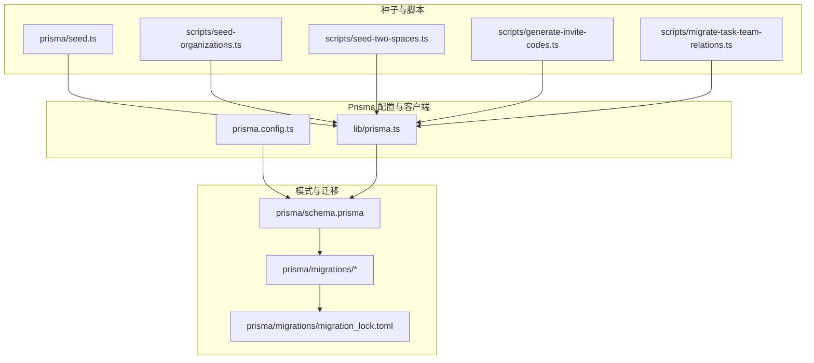
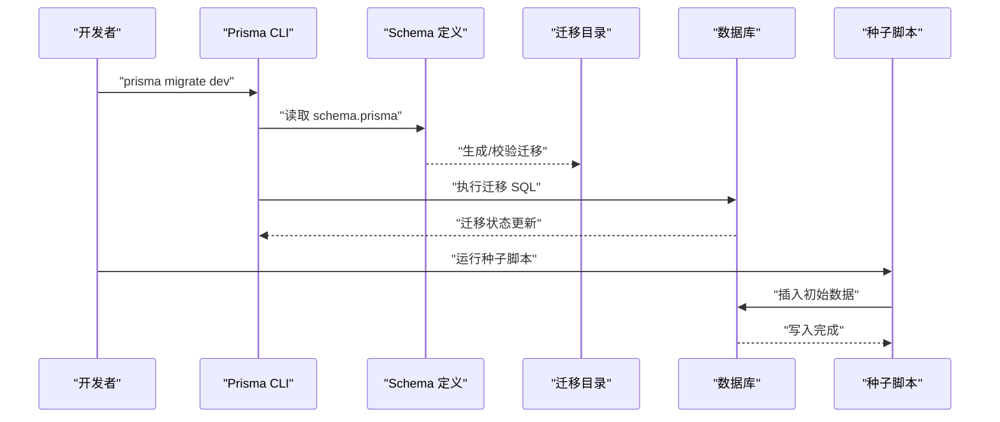
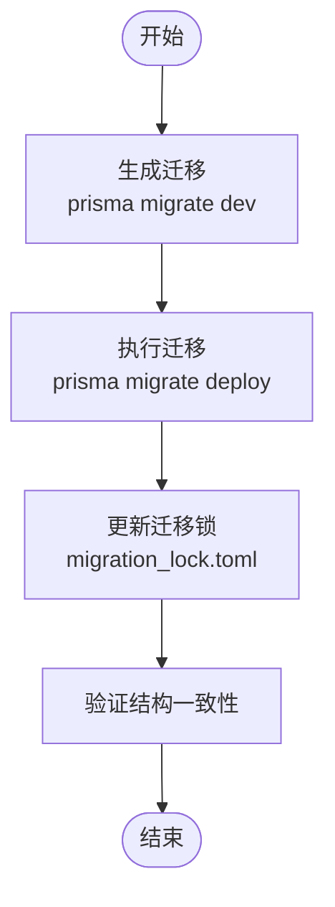
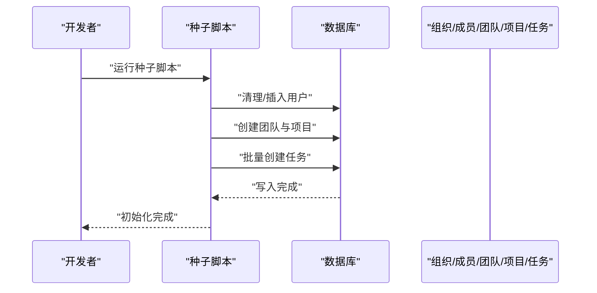
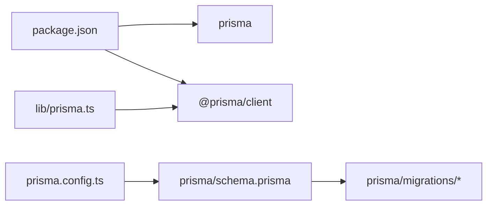

# 迁移与种子数据

<cite>
**本文引用的文件**
- [prisma/schema.prisma](file://prisma/schema.prisma)
- [prisma/seed.ts](file://prisma/seed.ts)
- [prisma/migrations/migration_lock.toml](file://prisma/migrations/migration_lock.toml)
- [lib/prisma.ts](file://lib/prisma.ts)
- [prisma.config.ts](file://prisma.config.ts)
- [package.json](file://package.json)
- [prisma/migrations/20251114212844_init/migration.sql](file://prisma/migrations/20251114212844_init/migration.sql)
- [prisma/migrations/20251115201512_add_organization_model/migration.sql](file://prisma/migrations/20251115201512_add_organization_model/migration.sql)
- [prisma/migrations/add_join_requires_approval.sql](file://prisma/migrations/add_join_requires_approval.sql)
- [prisma/migrations/update_task_team_relations.sql](file://prisma/migrations/update_task_team_relations.sql)
- [scripts/seed-organizations.ts](file://scripts/seed-organizations.ts)
- [scripts/seed-two-spaces.ts](file://scripts/seed-two-spaces.ts)
- [scripts/generate-invite-codes.ts](file://scripts/generate-invite-codes.ts)
- [scripts/migrate-task-team-relations.ts](file://scripts/migrate-task-team-relations.ts)
</cite>

## 目录
1. [简介](#简介)
2. [项目结构](#项目结构)
3. [核心组件](#核心组件)
4. [架构总览](#架构总览)
5. [详细组件分析](#详细组件分析)
6. [依赖分析](#依赖分析)
7. [性能考虑](#性能考虑)
8. [故障排查指南](#故障排查指南)
9. [结论](#结论)
10. [附录](#附录)

## 简介
本文件系统性阐述本项目的数据库结构演进与初始数据管理策略，涵盖 Prisma 迁移体系的生成、执行与回滚机制，数据库版本控制流程与团队协作最佳实践，种子数据的作用、生成方法与预填充策略，并提供迁移脚本编写规范、数据迁移的安全性与完整性保障，以及在不同环境（开发、测试、生产）中正确应用迁移与种子数据的操作指引。

## 项目结构
本项目采用 Prisma 作为 ORM 与迁移工具，数据库结构定义于 schema 文件，迁移文件位于 migrations 目录，种子数据脚本位于 prisma/seed.ts 与 scripts 目录下的多个脚本中。客户端连接通过 lib/prisma.ts 提供统一的 PrismaClient 实例，配置由 prisma.config.ts 管理。

**图表来源**
- [prisma.config.ts](file://prisma.config.ts#L1-L14)
- [lib/prisma.ts](file://lib/prisma.ts#L1-L12)
- [prisma/schema.prisma](file://prisma/schema.prisma#L1-L314)
- [prisma/migrations/migration_lock.toml](file://prisma/migrations/migration_lock.toml#L1-L4)
- [prisma/seed.ts](file://prisma/seed.ts#L1-L521)
- [scripts/seed-organizations.ts](file://scripts/seed-organizations.ts#L1-L301)
- [scripts/seed-two-spaces.ts](file://scripts/seed-two-spaces.ts#L1-L399)
- [scripts/generate-invite-codes.ts](file://scripts/generate-invite-codes.ts#L1-L52)
- [scripts/migrate-task-team-relations.ts](file://scripts/migrate-task-team-relations.ts#L1-L69)

**章节来源**
- [prisma.config.ts](file://prisma.config.ts#L1-L14)
- [lib/prisma.ts](file://lib/prisma.ts#L1-L12)
- [prisma/schema.prisma](file://prisma/schema.prisma#L1-L314)
- [prisma/migrations/migration_lock.toml](file://prisma/migrations/migration_lock.toml#L1-L4)

## 核心组件
- 数据库模式定义：通过 Prisma Schema 定义实体、关系、索引与枚举，驱动迁移生成与客户端类型安全。
- 迁移系统：基于 Prisma 的迁移目录结构与锁文件，确保多环境一致性与并发安全。
- 种子数据：提供完整初始化数据与示例数据，支持开发与演示环境快速可用。
- 脚本工具：独立脚本用于特定迁移或数据修复，补充 Prisma 迁移能力。

**章节来源**
- [prisma/schema.prisma](file://prisma/schema.prisma#L1-L314)
- [prisma/seed.ts](file://prisma/seed.ts#L1-L521)
- [scripts/seed-organizations.ts](file://scripts/seed-organizations.ts#L1-L301)
- [scripts/seed-two-spaces.ts](file://scripts/seed-two-spaces.ts#L1-L399)
- [scripts/generate-invite-codes.ts](file://scripts/generate-invite-codes.ts#L1-L52)
- [scripts/migrate-task-team-relations.ts](file://scripts/migrate-task-team-relations.ts#L1-L69)

## 架构总览
下图展示迁移与种子数据在系统中的位置与交互关系：

**图表来源**
- [prisma/schema.prisma](file://prisma/schema.prisma#L1-L314)
- [prisma.config.ts](file://prisma.config.ts#L1-L14)
- [prisma/migrations/migration_lock.toml](file://prisma/migrations/migration_lock.toml#L1-L4)
- [prisma/seed.ts](file://prisma/seed.ts#L1-L521)

## 详细组件分析

### 迁移系统与版本控制
- 迁移生成：基于 schema.prisma 的变更，Prisma 生成对应的 SQL 迁移文件，放置在 prisma/migrations 下，按时间戳命名以保证顺序。
- 迁移执行：通过 Prisma CLI 在目标环境执行迁移，确保数据库结构与 schema 保持一致。
- 迁移锁：migration_lock.toml 记录当前迁移提供器与数据库类型，防止多人协作时的不一致。
- 回滚机制：Prisma 迁移默认不可逆；若需回滚，建议使用“反向迁移”或“降级迁移”策略（在受控环境下谨慎操作）。

**图表来源**
- [prisma/migrations/migration_lock.toml](file://prisma/migrations/migration_lock.toml#L1-L4)
- [prisma/config.ts](file://prisma.config.ts#L1-L14)

**章节来源**
- [prisma/migrations/migration_lock.toml](file://prisma/migrations/migration_lock.toml#L1-L4)
- [prisma.config.ts](file://prisma.config.ts#L1-L14)

### 数据库版本控制与团队协作最佳实践
- 分支隔离：每次变更在独立分支上进行，避免多人同时修改 schema 导致冲突。
- 顺序执行：迁移按时间戳顺序执行，确保历史一致性。
- 锁文件同步：migration_lock.toml 必须纳入版本控制，避免环境差异。
- 审阅流程：涉及破坏性变更（如删除列、重命名）需团队审阅与回归测试。
- 环境隔离：开发、测试、生产分别使用独立 DATABASE_URL，避免误操作。

**章节来源**
- [prisma/migrations/migration_lock.toml](file://prisma/migrations/migration_lock.toml#L1-L4)
- [prisma.config.ts](file://prisma.config.ts#L1-L14)

### 种子数据与初始数据管理
- 全量种子：prisma/seed.ts 提供完整初始化数据，适合全新环境或重置后的开发环境。
- 组织示例：scripts/seed-organizations.ts 创建两个组织及其成员、团队、项目与任务，便于演示。
- 多空间测试：scripts/seed-two-spaces.ts 在已有组织基础上批量生成用户、团队、项目与任务，支持多空间场景。
- 邀请码补全：scripts/generate-invite-codes.ts 为缺失邀请码的用户生成唯一邀请码，确保邀请系统可用。
- 任务-团队关系迁移：scripts/migrate-task-team-relations.ts 用于历史数据迁移，确保任务与团队关系正确。

**图表来源**
- [prisma/seed.ts](file://prisma/seed.ts#L1-L521)
- [scripts/seed-organizations.ts](file://scripts/seed-organizations.ts#L1-L301)
- [scripts/seed-two-spaces.ts](file://scripts/seed-two-spaces.ts#L1-L399)
- [scripts/generate-invite-codes.ts](file://scripts/generate-invite-codes.ts#L1-L52)
- [scripts/migrate-task-team-relations.ts](file://scripts/migrate-task-team-relations.ts#L1-L69)

**章节来源**
- [prisma/seed.ts](file://prisma/seed.ts#L1-L521)
- [scripts/seed-organizations.ts](file://scripts/seed-organizations.ts#L1-L301)
- [scripts/seed-two-spaces.ts](file://scripts/seed-two-spaces.ts#L1-L399)
- [scripts/generate-invite-codes.ts](file://scripts/generate-invite-codes.ts#L1-L52)
- [scripts/migrate-task-team-relations.ts](file://scripts/migrate-task-team-relations.ts#L1-L69)

### 迁移脚本编写规范与安全性
- 幂等性：迁移脚本应具备幂等性，避免重复执行导致异常。
- 破坏性变更：删除列、重命名、修改主键等操作需谨慎，优先使用新增字段+数据迁移再删除旧字段的方式。
- 约束与索引：迁移中显式创建/删除索引与外键，确保查询性能与数据完整性。
- 测试先行：在本地与测试环境充分验证后再合并到主干。
- 回滚预案：为关键迁移准备回滚脚本或“降级迁移”，并做好备份。

**章节来源**
- [prisma/migrations/20251115201512_add_organization_model/migration.sql](file://prisma/migrations/20251115201512_add_organization_model/migration.sql#L1-L99)
- [prisma/migrations/add_join_requires_approval.sql](file://prisma/migrations/add_join_requires_approval.sql#L1-L31)
- [prisma/migrations/update_task_team_relations.sql](file://prisma/migrations/update_task_team_relations.sql)

### 不同环境的应用策略
- 开发环境：使用 prisma migrate dev 生成并执行迁移，配合 prisma/seed.ts 或 scripts/seed-organizations.ts 初始化演示数据。
- 测试环境：使用 prisma migrate deploy 执行迁移，必要时运行种子脚本生成测试数据。
- 生产环境：严格限制迁移权限，通过 CI/CD 自动化执行迁移；迁移前进行备份与回滚演练。

**章节来源**
- [prisma.config.ts](file://prisma.config.ts#L1-L14)
- [package.json](file://package.json#L1-L75)

## 依赖分析
- Prisma 客户端：通过 lib/prisma.ts 提供全局单例，减少连接开销与日志级别差异化。
- 配置中心：prisma.config.ts 统一管理 schema、迁移路径与数据源 URL。
- 包管理：package.json 中声明 prisma 与 @prisma/client，确保 CLI 与运行时版本一致。

**图表来源**
- [package.json](file://package.json#L1-L75)
- [prisma.config.ts](file://prisma.config.ts#L1-L14)
- [lib/prisma.ts](file://lib/prisma.ts#L1-L12)

**章节来源**
- [package.json](file://package.json#L1-L75)
- [prisma.config.ts](file://prisma.config.ts#L1-L14)
- [lib/prisma.ts](file://lib/prisma.ts#L1-L12)

## 性能考虑
- 索引设计：迁移中为高频查询字段建立索引，如任务的日期范围与用户/项目/团队关联字段。
- 批量写入：种子脚本中使用批量插入（如 createMany）降低写入开销。
- 查询优化：在 schema 中合理建模实体关系，减少 N+1 查询风险。
- 连接池：通过 PrismaClient 全局单例与日志级别控制，降低开发与生产环境的资源消耗。

**章节来源**
- [prisma/schema.prisma](file://prisma/schema.prisma#L1-L314)
- [prisma/seed.ts](file://prisma/seed.ts#L1-L521)

## 故障排查指南
- 迁移失败：检查 migration_lock.toml 与数据库类型是否匹配；确认 DATABASE_URL 正确；查看迁移 SQL 是否存在语法错误。
- 数据不一致：核对 schema 与数据库实际结构；必要时使用“降级迁移”回退到上一个稳定版本。
- 种子数据问题：确认种子脚本依赖的外部服务（头像生成）可用；检查密码哈希逻辑与邀请码唯一性。
- 权限不足：确保数据库用户具有创建/修改表、索引与外键的权限。

**章节来源**
- [prisma/migrations/migration_lock.toml](file://prisma/migrations/migration_lock.toml#L1-L4)
- [prisma/seed.ts](file://prisma/seed.ts#L1-L521)
- [scripts/generate-invite-codes.ts](file://scripts/generate-invite-codes.ts#L1-L52)

## 结论
本项目通过 Prisma 的迁移与种子机制，实现了数据库结构的可控演进与初始数据的高效填充。遵循幂等性、索引与约束规范化、环境隔离与回滚预案等最佳实践，可在团队协作中安全推进数据库变更，并在各环境中稳定应用迁移与种子数据。

## 附录

### 迁移与种子数据示例路径
- 初始迁移示例：[20251114212844_init/migration.sql](file://prisma/migrations/20251114212844_init/migration.sql#L1-L132)
- 组织模型迁移示例：[20251115201512_add_organization_model/migration.sql](file://prisma/migrations/20251115201512_add_organization_model/migration.sql#L1-L99)
- 组织加入审批字段迁移：[add_join_requires_approval.sql](file://prisma/migrations/add_join_requires_approval.sql#L1-L31)
- 任务-团队关系迁移脚本：[migrate-task-team-relations.ts](file://scripts/migrate-task-team-relations.ts#L1-L69)
- 全量种子脚本：[prisma/seed.ts](file://prisma/seed.ts#L1-L521)
- 组织示例种子脚本：[scripts/seed-organizations.ts](file://scripts/seed-organizations.ts#L1-L301)
- 多空间测试种子脚本：[scripts/seed-two-spaces.ts](file://scripts/seed-two-spaces.ts#L1-L399)
- 邀请码生成脚本：[scripts/generate-invite-codes.ts](file://scripts/generate-invite-codes.ts#L1-L52)