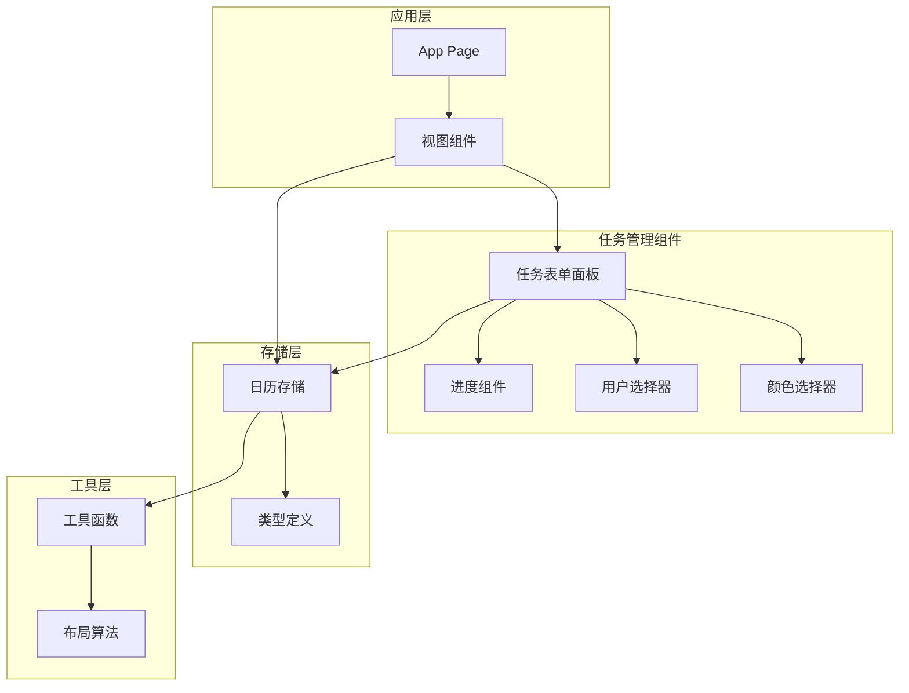
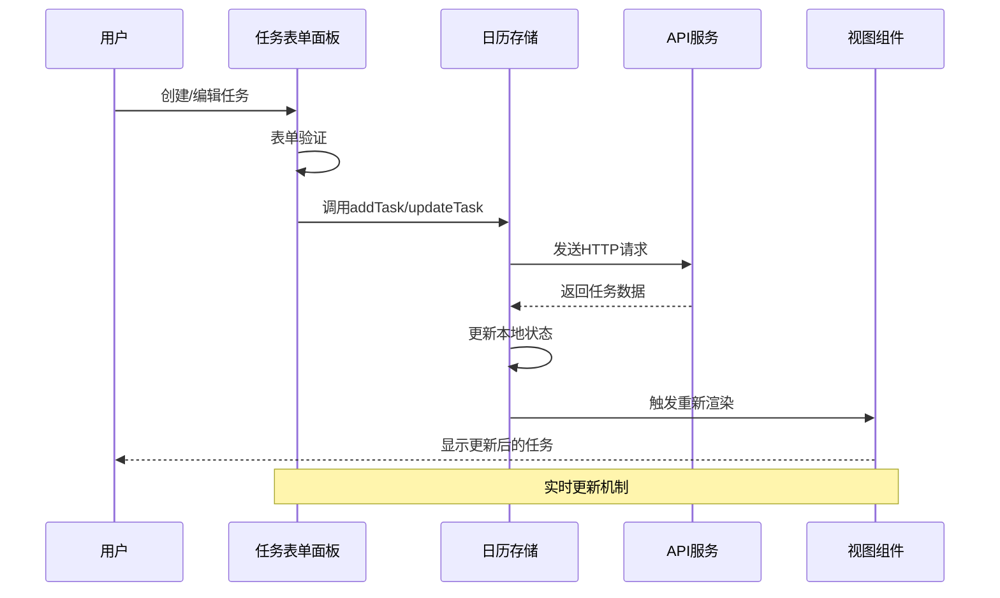
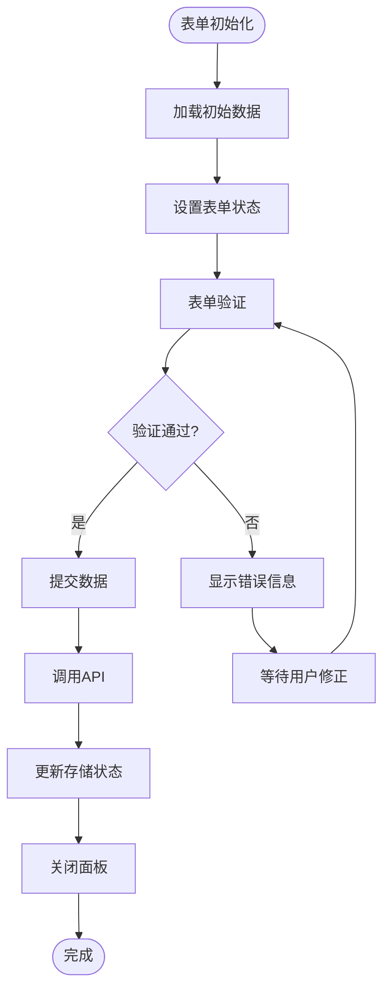
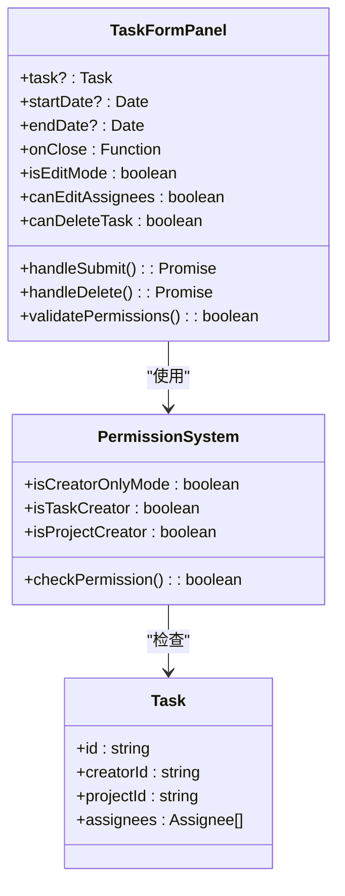
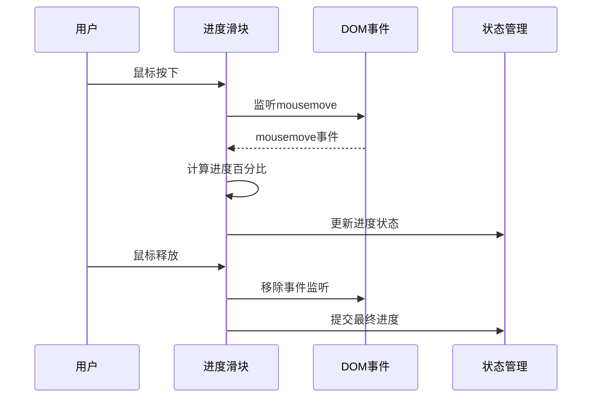
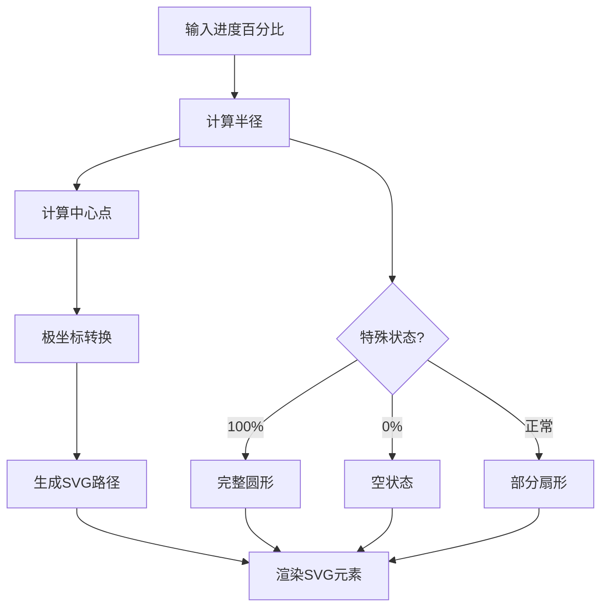
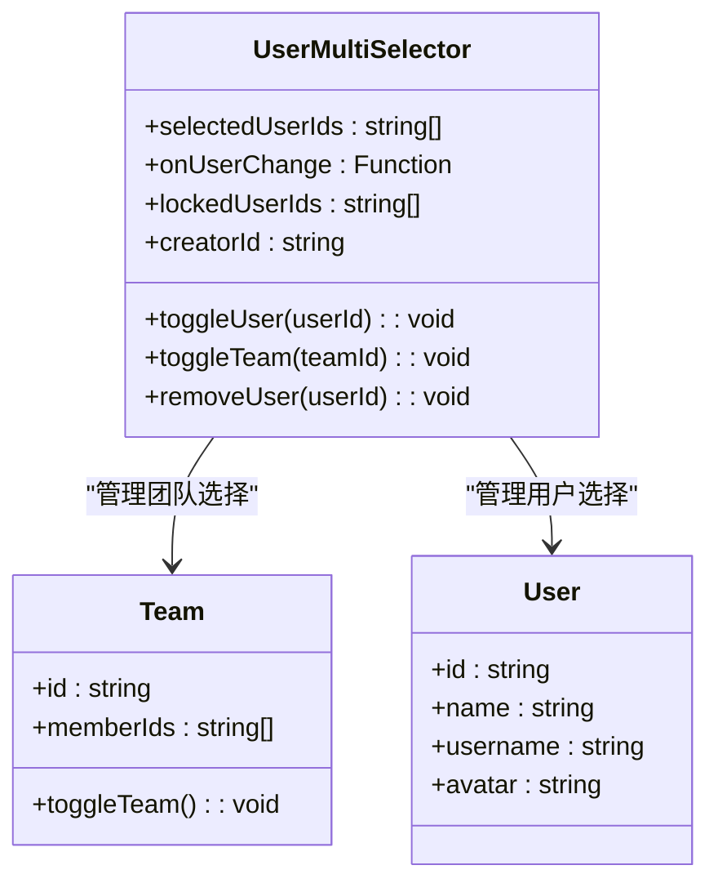
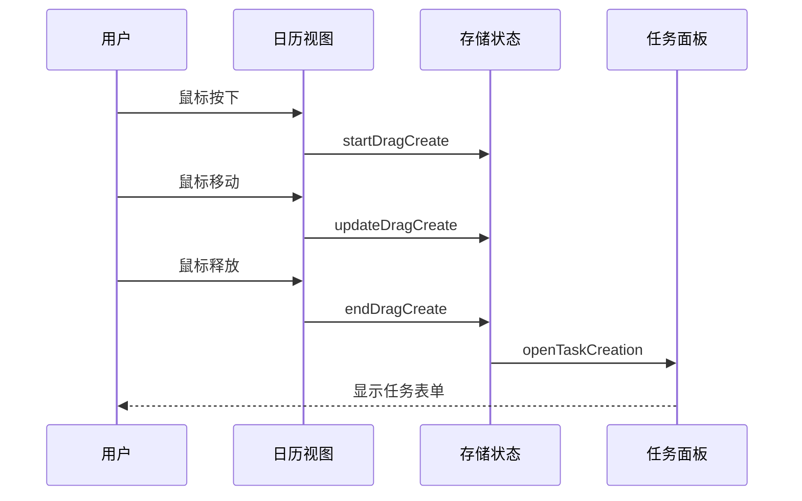
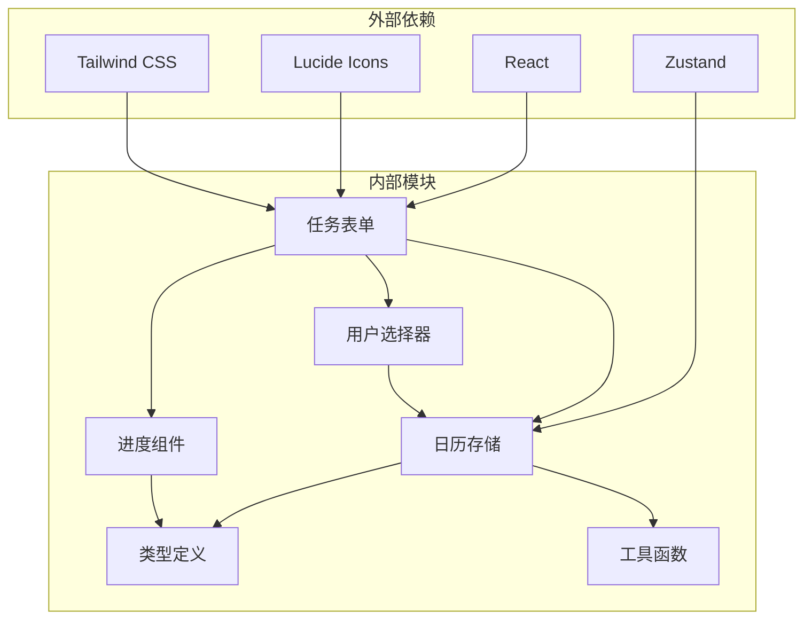

# 任务管理系统

<cite>
**本文档引用的文件**
- [task-form-panel.tsx](file://components/task/task-form-panel.tsx)
- [progress-slider.tsx](file://components/task/progress-slider.tsx)
- [progress-circle.tsx](file://components/task/progress-circle.tsx)
- [color-picker.tsx](file://components/task/color-picker.tsx)
- [user-selector.tsx](file://components/task/user-selector.tsx)
- [user-multi-selector.tsx](file://components/task/user-multi-selector.tsx)
- [calendar-store.ts](file://lib/store/calendar-store.ts)
- [types.ts](file://lib/types.ts)
- [task-bar.tsx](file://components/calendar/task-bar.tsx)
- [personal-week-view.tsx](file://components/calendar/personal-week-view.tsx)
- [task-layout.ts](file://lib/utils/task-layout.ts)
- [page.tsx](file://app/page.tsx)
</cite>

## 目录
1. [简介](#简介)
2. [项目结构](#项目结构)
3. [核心组件](#核心组件)
4. [架构概览](#架构概览)
5. [详细组件分析](#详细组件分析)
6. [依赖关系分析](#依赖关系分析)
7. [性能考虑](#性能考虑)
8. [故障排除指南](#故障排除指南)
9. [结论](#结论)
10. [附录](#附录)

## 简介
任务管理系统是一个基于 React 和 Next.js 构建的现代化日历任务管理应用。系统提供了完整的任务生命周期管理，包括任务创建、编辑、删除、进度跟踪、用户协作等功能。本文档深入分析了任务表单面板、进度滑块和圆形进度条的设计原理，以及颜色选择器、用户选择器和多选用户组件的功能特性。

## 项目结构
系统采用模块化的组件架构，主要分为以下几个层次：

**图表来源**
- [page.tsx](file://app/page.tsx#L1-L234)
- [task-form-panel.tsx](file://components/task/task-form-panel.tsx#L1-L627)

**章节来源**
- [page.tsx](file://app/page.tsx#L1-L234)
- [task-form-panel.tsx](file://components/task/task-form-panel.tsx#L1-L627)

## 核心组件
系统的核心组件围绕任务管理展开，主要包括：

### 任务表单面板
任务表单面板是任务管理的主要入口，支持任务的创建和编辑功能。它集成了多种子组件，提供完整的任务管理体验。

### 进度组件体系
系统提供了两种进度展示方式：
- **进度滑块**：用于手动调整任务进度的交互式滑块
- **圆形进度条**：用于视觉化展示任务完成度的圆形指示器

### 用户协作组件
- **颜色选择器**：提供多种颜色选项供任务分类标识
- **用户选择器**：单用户选择功能
- **多选用户组件**：支持团队和项目级别的多用户协作

**章节来源**
- [task-form-panel.tsx](file://components/task/task-form-panel.tsx#L42-L47)
- [progress-slider.tsx](file://components/task/progress-slider.tsx#L9-L13)
- [progress-circle.tsx](file://components/task/progress-circle.tsx#L6-L11)
- [color-picker.tsx](file://components/task/color-picker.tsx#L6-L9)

## 架构概览
系统采用 Zustand 状态管理，结合 React Hooks 实现响应式的数据流。

**图表来源**
- [task-form-panel.tsx](file://components/task/task-form-panel.tsx#L124-L210)
- [calendar-store.ts](file://lib/store/calendar-store.ts#L550-L613)

**章节来源**
- [calendar-store.ts](file://lib/store/calendar-store.ts#L1-L800)
- [task-form-panel.tsx](file://components/task/task-form-panel.tsx#L124-L210)

## 详细组件分析

### 任务表单面板分析

任务表单面板是系统最复杂的组件，实现了完整的任务生命周期管理。

#### 数据绑定和状态管理
组件使用 React 的 useState 和 useEffect hooks 管理表单状态，包括标题、描述、时间范围、任务类型、颜色、进度等字段。

**图表来源**
- [task-form-panel.tsx](file://components/task/task-form-panel.tsx#L66-L210)

#### 权限控制机制
系统实现了多层次的权限控制，包括项目权限、团队权限和个人权限。

**图表来源**
- [task-form-panel.tsx](file://components/task/task-form-panel.tsx#L108-L114)

#### 实时更新机制
系统实现了乐观更新和冲突解决机制，确保用户界面的即时响应。

**章节来源**
- [task-form-panel.tsx](file://components/task/task-form-panel.tsx#L124-L236)

### 进度滑块组件分析

进度滑块提供了直观的进度调整功能，支持鼠标拖拽和键盘输入两种交互方式。

#### 拖拽交互实现
滑块组件实现了完整的鼠标事件处理，包括按下、移动、释放等状态管理。

**图表来源**
- [progress-slider.tsx](file://components/task/progress-slider.tsx#L26-L59)

#### 颜色映射系统
滑块根据任务颜色动态调整样式，提供一致的视觉体验。

**章节来源**
- [progress-slider.tsx](file://components/task/progress-slider.tsx#L15-L80)

### 圆形进度条组件分析

圆形进度条采用 SVG 技术实现，提供了精确的进度可视化。

#### SVG 路径计算
组件使用极坐标到笛卡尔坐标的转换算法，动态生成进度扇形路径。

**图表来源**
- [progress-circle.tsx](file://components/task/progress-circle.tsx#L18-L51)

#### 交互式显示控制
圆形进度条支持悬停显示数字和渐变动画效果。

**章节来源**
- [progress-circle.tsx](file://components/task/progress-circle.tsx#L53-L101)

### 颜色选择器组件分析

颜色选择器提供了预定义的颜色方案，支持任务的视觉分类。

#### 颜色配置系统
系统定义了标准的颜色配置，包括值、标签、十六进制颜色值、浅色背景、边框样式和文本颜色。

**章节来源**
- [color-picker.tsx](file://components/task/color-picker.tsx#L11-L52)
- [types.ts](file://lib/types.ts#L132-L139)

### 用户选择器组件分析

用户选择器提供了灵活的用户选择功能，支持单用户和多用户场景。

#### 多选用户组件功能特性
多选用户组件实现了复杂的选择逻辑，包括团队选择、用户选择和锁定机制。

**图表来源**
- [user-multi-selector.tsx](file://components/task/user-multi-selector.tsx#L26-L91)

#### 搜索和过滤功能
组件实现了智能的搜索和过滤机制，支持按姓名和用户名搜索用户。

**章节来源**
- [user-multi-selector.tsx](file://components/task/user-multi-selector.tsx#L41-L54)

### 任务拖拽和时间轴调整

系统实现了完整的拖拽功能，支持任务的创建、移动和进度调整。

#### 拖拽创建机制
用户可以在日历视图中通过拖拽创建任务，系统会自动计算时间范围。

**图表来源**
- [personal-week-view.tsx](file://components/calendar/personal-week-view.tsx#L113-L144)

#### 任务移动和进度调整
系统支持拖拽移动任务和调整任务进度，提供了流畅的用户体验。

**章节来源**
- [personal-week-view.tsx](file://components/calendar/personal-week-view.tsx#L113-L144)
- [task-bar.tsx](file://components/calendar/task-bar.tsx#L280-L381)

## 依赖关系分析

系统采用了清晰的依赖层次结构，各组件之间的耦合度较低。

**图表来源**
- [task-form-panel.tsx](file://components/task/task-form-panel.tsx#L1-L25)
- [calendar-store.ts](file://lib/store/calendar-store.ts#L1-L32)

**章节来源**
- [task-form-panel.tsx](file://components/task/task-form-panel.tsx#L1-L25)
- [calendar-store.ts](file://lib/store/calendar-store.ts#L1-L32)

## 性能考虑

系统在多个层面进行了性能优化：

### 状态管理优化
- 使用 Zustand 替代 Redux，减少样板代码
- 实现局部状态更新，避免不必要的重渲染
- 采用乐观更新机制，提升响应速度

### 渲染优化
- 使用 React.memo 和 useMemo 优化组件渲染
- 实现虚拟滚动，处理大量任务数据
- 采用 CSS 动画替代 JavaScript 动画

### 数据加载优化
- 实现缓存策略，避免重复请求
- 使用并发加载技术，提升数据获取速度
- 实现增量更新，减少全量刷新

## 故障排除指南

### 常见问题和解决方案

#### 任务权限问题
**问题**：用户无法编辑或删除任务
**原因**：项目权限设置为 CREATOR_ONLY
**解决方案**：检查项目权限设置或联系项目创建者

#### 进度更新失败
**问题**：进度调整后不生效
**原因**：网络请求失败或权限不足
**解决方案**：检查网络连接和用户权限

#### 拖拽功能异常
**问题**：拖拽创建或移动任务无效
**原因**：浏览器兼容性或事件处理冲突
**解决方案**：检查浏览器版本和事件监听器

**章节来源**
- [task-form-panel.tsx](file://components/task/task-form-panel.tsx#L124-L236)
- [calendar-store.ts](file://lib/store/calendar-store.ts#L550-L800)

## 结论

任务管理系统展现了现代前端应用的最佳实践，具有以下特点：

1. **模块化设计**：组件职责清晰，易于维护和扩展
2. **响应式交互**：提供流畅的用户体验和即时反馈
3. **权限控制**：完善的权限管理体系，确保数据安全
4. **性能优化**：多层面的性能优化策略
5. **可扩展性**：良好的架构设计支持功能扩展

系统为任务管理提供了完整的解决方案，适合各种规模的团队使用。

## 附录

### 配置参数参考

#### 任务类型配置
- daily：日常任务，支持颜色和进度
- meeting：会议任务
- vacation：休假任务

#### 颜色配置
- blue：蓝色
- green：绿色  
- yellow：黄色
- red：红色
- purple：紫色

#### 进度范围
- 最小值：0%
- 最大值：100%
- 步长：1%

### 扩展开发指南

#### 新增任务类型
1. 在类型定义中添加新的任务类型
2. 在表单面板中添加相应的UI元素
3. 实现相应的业务逻辑

#### 自定义颜色方案
1. 在类型定义中添加新的颜色配置
2. 在颜色选择器中注册新颜色
3. 更新样式映射

#### 集成第三方认证
1. 实现认证状态管理
2. 添加认证拦截器
3. 处理认证失败场景