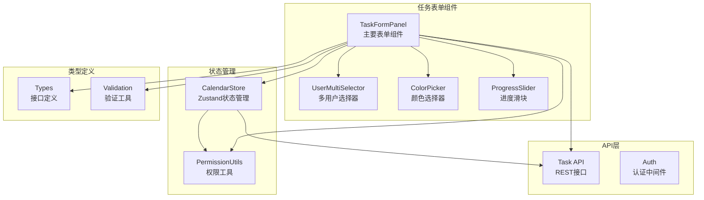
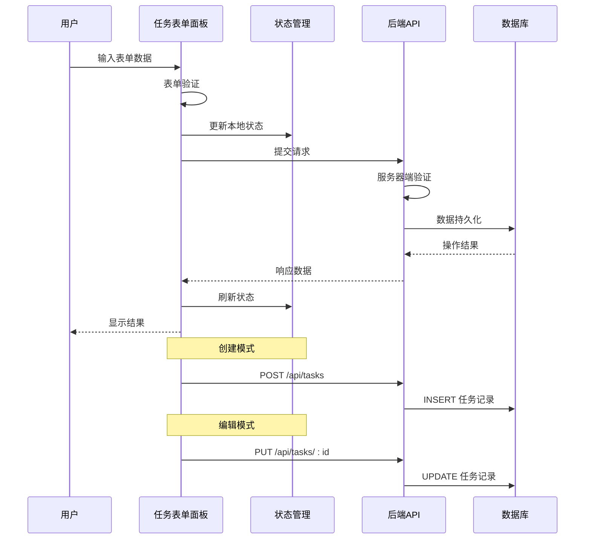
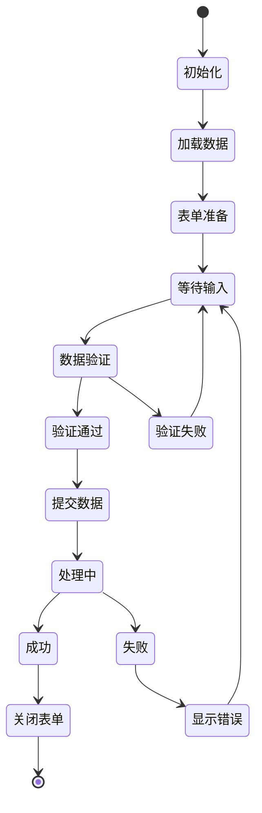
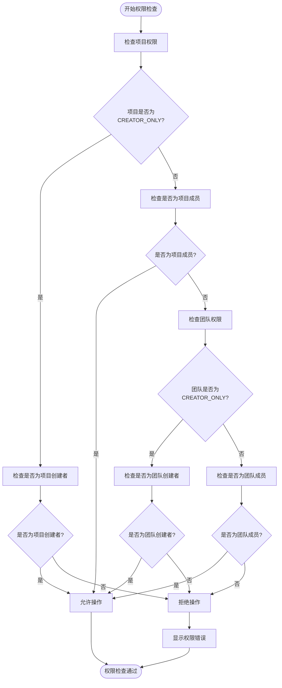
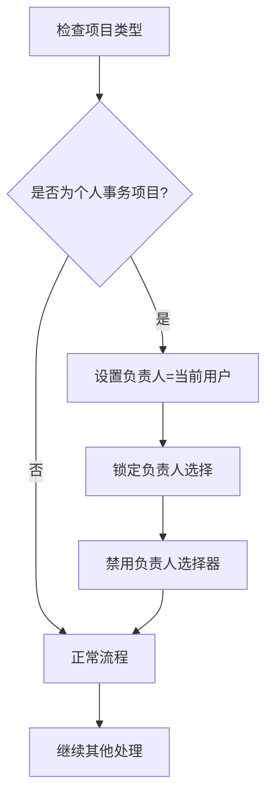
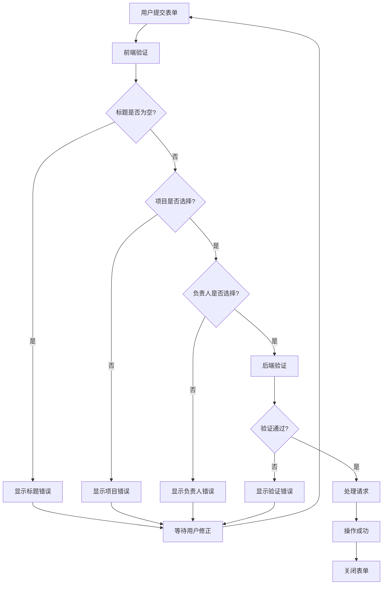
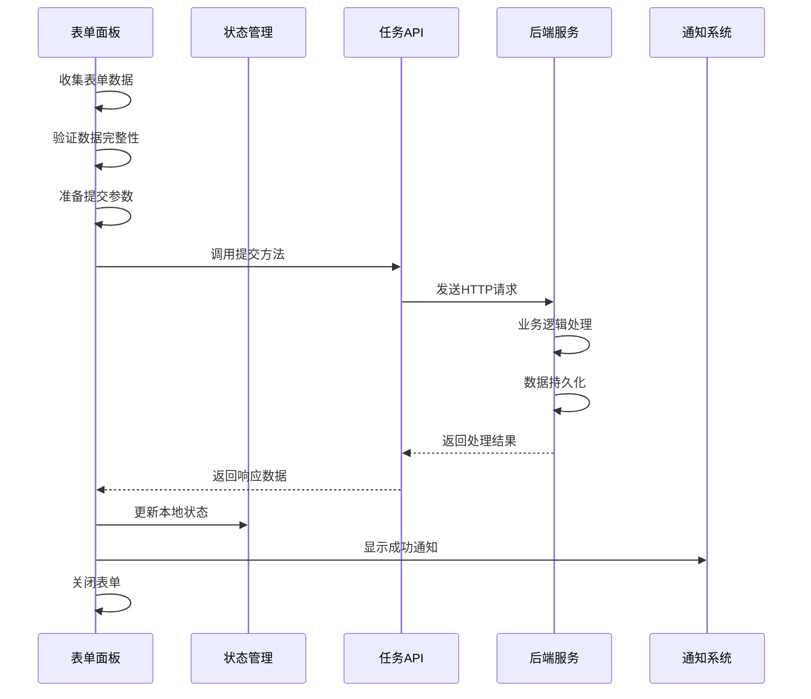
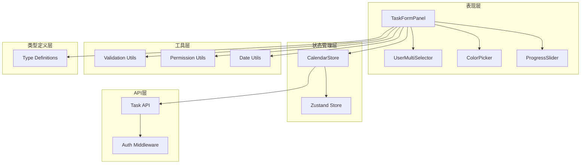

# 任务表单面板

<cite>
**本文档引用的文件**
- [task-form-panel.tsx](file://components/task/task-form-panel.tsx)
- [user-multi-selector.tsx](file://components/task/user-multi-selector.tsx)
- [color-picker.tsx](file://components/task/color-picker.tsx)
- [progress-slider.tsx](file://components/task/progress-slider.tsx)
- [calendar-store.ts](file://lib/store/calendar-store.ts)
- [types.ts](file://lib/types.ts)
- [validation.ts](file://lib/validation.ts)
- [permission-utils.ts](file://lib/utils/permission-utils.ts)
- [route.ts](file://app/api/tasks/route.ts)
- [date-utils.ts](file://lib/utils/date-utils.ts)
- [month-view.tsx](file://components/calendar/month-view.tsx)
- [calendar-day.tsx](file://components/calendar/calendar-day.tsx)
</cite>

## 目录
1. [简介](#简介)
2. [项目结构](#项目结构)
3. [核心组件](#核心组件)
4. [架构概览](#架构概览)
5. [详细组件分析](#详细组件分析)
6. [依赖关系分析](#依赖关系分析)
7. [性能考虑](#性能考虑)
8. [故障排除指南](#故障排除指南)
9. [结论](#结论)

## 简介

任务表单面板是一个完整的任务创建和编辑界面组件，提供了直观的表单设计和强大的数据绑定机制。该组件支持三种任务类型（日常、会议、休假），具备完整的权限检查系统，以及智能的项目和团队选择功能。

本组件实现了以下核心功能：
- 任务创建和编辑的完整生命周期管理
- 智能的表单字段验证和错误处理
- 项目权限检查和团队选择限制
- 个人事务项目的特殊处理机制
- 实时的表单状态管理和用户反馈

## 项目结构

任务表单面板位于组件目录的task子目录中，与相关的UI组件和工具函数共同构成完整的任务管理系统。

**图表来源**
- [task-form-panel.tsx](file://components/task/task-form-panel.tsx#L1-L627)
- [calendar-store.ts](file://lib/store/calendar-store.ts#L1-L1457)

## 核心组件

### 任务表单面板 (TaskFormPanel)

TaskFormPanel是整个任务表单的核心组件，负责管理表单的所有交互逻辑和数据流。

**主要特性：**
- 支持创建和编辑两种模式
- 智能的任务类型切换（日常、会议、休假）
- 完整的表单验证和错误处理
- 项目权限检查和团队选择限制
- 个人事务项目的特殊处理

**表单字段设计：**

| 字段类别 | 字段名称 | 必填性 | 数据类型 | 描述 |
|---------|----------|--------|----------|------|
| 必填信息 | 事项名称 | 必填 | String | 任务标题，最长200字符 |
| 必填信息 | 负责人 | 必填 | Array[String] | 任务负责人列表，至少一个 |
| 必填信息 | 归属项目 | 必填 | String | 任务所属项目ID |
| 可选信息 | 详情 | 可选 | String | 任务详细描述，最长2000字符 |
| 可选信息 | 时间范围 | 可选 | DateRange | 任务开始和结束日期 |
| 可选信息 | 开始时间 | 可选 | String | HH:MM格式 |
| 可选信息 | 结束时间 | 可选 | String | HH:MM格式 |
| 可选信息 | 事项颜色 | 可选 | String | 仅日常任务可用 |
| 可选信息 | 进度 | 可选 | Number | 0-100的百分比 |

**Section sources**
- [task-form-panel.tsx](file://components/task/task-form-panel.tsx#L42-L97)

### 用户多选组件 (UserMultiSelector)

UserMultiSelector提供了智能的用户选择功能，支持团队和用户的快速搜索和选择。

**核心功能：**
- 搜索团队和用户（支持姓名和用户名）
- 团队级别的批量选择
- 锁定用户功能（防止意外移除）
- 实时的用户状态显示

**Section sources**
- [user-multi-selector.tsx](file://components/task/user-multi-selector.tsx#L18-L100)

### 颜色选择器 (ColorPicker)

颜色选择器为日常任务提供颜色定制功能，支持多种预定义颜色方案。

**支持的颜色：**
- 蓝色 (blue)
- 绿色 (green)  
- 黄色 (yellow)
- 红色 (red)
- 紫色 (purple)

**Section sources**
- [color-picker.tsx](file://components/task/color-picker.tsx#L11-L52)

### 进度滑块 (ProgressSlider)

进度滑块提供了直观的进度可视化和数值输入功能。

**特性：**
- 拖拽式进度调整
- 快速数值输入（10%, 30%, 50%, 80%, 100%）
- 实时进度条显示
- 颜色主题同步

**Section sources**
- [progress-slider.tsx](file://components/task/progress-slider.tsx#L17-L136)

## 架构概览

任务表单面板采用分层架构设计，确保组件间的职责清晰分离。

**图表来源**
- [task-form-panel.tsx](file://components/task/task-form-panel.tsx#L124-L210)
- [route.ts](file://app/api/tasks/route.ts#L275-L496)

## 详细组件分析

### 表单状态管理

任务表单面板使用React的useState和useEffect钩子进行状态管理，结合Zustand状态管理库实现复杂的状态同步。

**Section sources**
- [task-form-panel.tsx](file://components/task/task-form-panel.tsx#L49-L123)

### 权限检查机制

系统实现了多层次的权限检查机制，确保用户只能在授权的范围内操作任务。

**图表来源**
- [task-form-panel.tsx](file://components/task/task-form-panel.tsx#L108-L114)
- [permission-utils.ts](file://lib/utils/permission-utils.ts#L11-L59)

**Section sources**
- [task-form-panel.tsx](file://components/task/task-form-panel.tsx#L108-L114)
- [permission-utils.ts](file://lib/utils/permission-utils.ts#L11-L59)

### 项目权限检查

项目权限检查是权限系统的核心部分，支持两种权限模式：

1. **ALL_MEMBERS**: 所有成员都可以管理任务
2. **CREATOR_ONLY**: 仅任务创建者可以管理任务

**Section sources**
- [task-form-panel.tsx](file://components/task/task-form-panel.tsx#L108-L114)
- [types.ts](file://lib/types.ts#L3-L4)

### 个人事务项目特殊处理

个人事务项目具有特殊的处理逻辑，确保任务的私密性和完整性。

**图表来源**
- [task-form-panel.tsx](file://components/task/task-form-panel.tsx#L116-L122)

**Section sources**
- [task-form-panel.tsx](file://components/task/task-form-panel.tsx#L116-L122)

### 任务类型切换影响

不同任务类型对界面元素有不同的影响：

| 任务类型 | 颜色选择器 | 进度滑块 | 时间选择器 | 团队选择 |
|----------|------------|----------|------------|----------|
| daily | ✅ 显示 | ✅ 显示 | ✅ 显示 | ✅ 可选 |
| meeting | ❌ 隐藏 | ❌ 隐藏 | ✅ 显示 | ✅ 可选 |
| vacation | ❌ 隐藏 | ❌ 隐藏 | ❌ 隐藏 | ❌ 禁用 |

**Section sources**
- [task-form-panel.tsx](file://components/task/task-form-panel.tsx#L467-L480)

### 表单验证流程

表单验证采用前端和后端双重验证机制，确保数据的完整性和一致性。

**图表来源**
- [task-form-panel.tsx](file://components/task/task-form-panel.tsx#L124-L210)
- [validation.ts](file://lib/validation.ts#L138-L167)

**Section sources**
- [task-form-panel.tsx](file://components/task/task-form-panel.tsx#L124-L210)
- [validation.ts](file://lib/validation.ts#L138-L167)

### 提交流程

任务提交采用异步处理机制，确保用户体验的流畅性。

**图表来源**
- [task-form-panel.tsx](file://components/task/task-form-panel.tsx#L154-L209)
- [calendar-store.ts](file://lib/store/calendar-store.ts#L551-L613)

**Section sources**
- [task-form-panel.tsx](file://components/task/task-form-panel.tsx#L154-L209)
- [calendar-store.ts](file://lib/store/calendar-store.ts#L551-L613)

## 依赖关系分析

任务表单面板组件之间的依赖关系体现了清晰的分层架构。

**图表来源**
- [task-form-panel.tsx](file://components/task/task-form-panel.tsx#L1-L627)
- [calendar-store.ts](file://lib/store/calendar-store.ts#L1-L1457)

**Section sources**
- [task-form-panel.tsx](file://components/task/task-form-panel.tsx#L1-L627)
- [calendar-store.ts](file://lib/store/calendar-store.ts#L1-L1457)

## 性能考虑

### 状态优化

任务表单面板采用了多项性能优化策略：

1. **状态分割**: 将表单状态分解为独立的useState调用，减少不必要的重渲染
2. **条件渲染**: 根据任务类型动态渲染相关组件，避免无用DOM节点
3. **懒加载**: 用户选择器采用弹出式设计，只在需要时加载内容
4. **防抖处理**: 输入验证采用防抖机制，避免频繁的API调用

### 内存管理

- 使用useEffect清理函数管理事件监听器
- 及时清理定时器和订阅
- 合理使用React.memo优化子组件渲染

### 网络优化

- 批量API调用，减少网络请求次数
- 智能缓存策略，避免重复的数据获取
- 错误重试机制，提高网络请求成功率

## 故障排除指南

### 常见问题及解决方案

**问题1: 项目选择器无数据显示**
- 检查用户是否为项目成员
- 确认项目权限设置
- 验证网络连接状态

**问题2: 负责人选择器无法编辑**
- 检查项目权限设置（CREATOR_ONLY模式）
- 确认是否选择了个人事务项目
- 验证用户角色权限

**问题3: 颜色选择器不可用**
- 确认任务类型为daily
- 检查任务权限设置
- 验证浏览器兼容性

**问题4: 表单提交失败**
- 检查必填字段是否完整
- 验证日期格式是否正确
- 确认用户权限是否足够

**Section sources**
- [task-form-panel.tsx](file://components/task/task-form-panel.tsx#L124-L210)
- [permission-utils.ts](file://lib/utils/permission-utils.ts#L66-L71)

### 错误处理机制

系统实现了多层次的错误处理机制：

1. **前端验证错误**: 实时表单验证，提供即时反馈
2. **后端验证错误**: 服务器端数据验证，确保数据完整性
3. **网络错误处理**: 网络异常的优雅降级
4. **权限错误处理**: 权限不足的明确提示

**Section sources**
- [task-form-panel.tsx](file://components/task/task-form-panel.tsx#L130-L209)
- [route.ts](file://app/api/tasks/route.ts#L285-L321)

## 结论

任务表单面板组件展现了现代React应用的最佳实践，通过合理的架构设计和完善的错误处理机制，为用户提供了流畅、可靠的表单操作体验。

**核心优势：**
- **模块化设计**: 清晰的组件职责分离
- **强类型支持**: TypeScript提供完整的类型安全保障
- **权限控制**: 多层次的权限检查机制
- **用户体验**: 智能的表单验证和实时反馈
- **性能优化**: 多项性能优化策略确保流畅体验

该组件为任务管理系统的扩展提供了良好的基础，支持未来功能的平滑集成和维护。