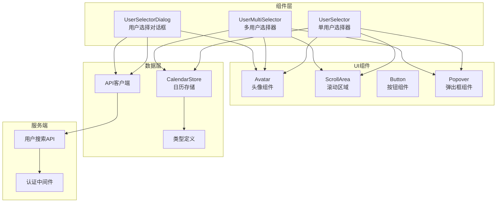
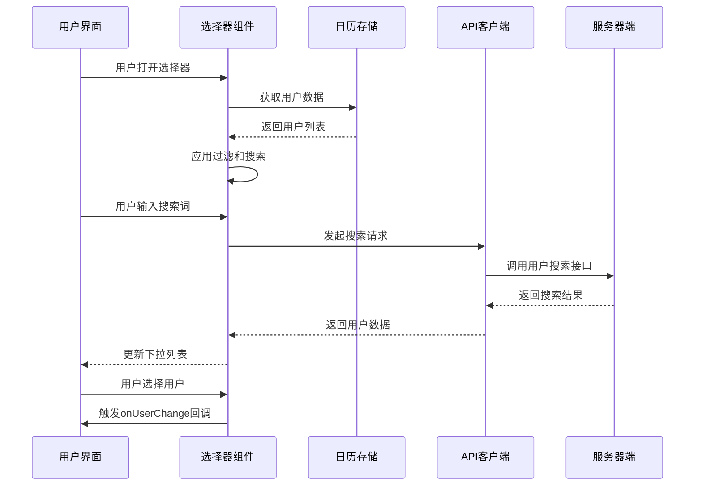
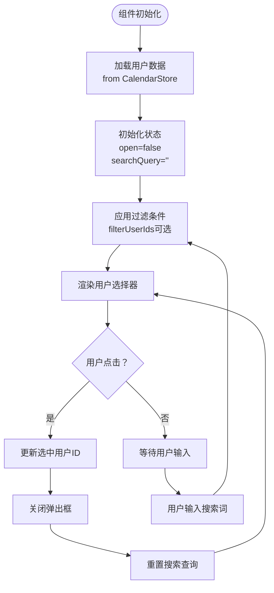
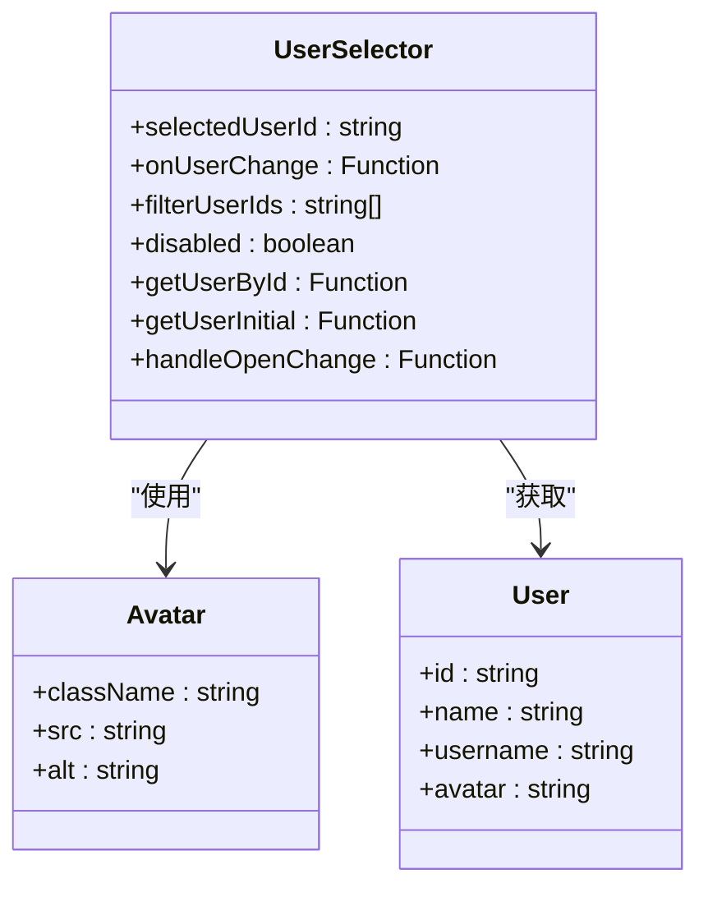
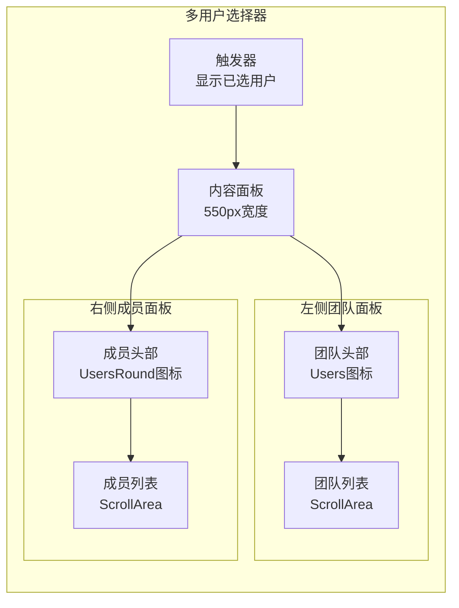
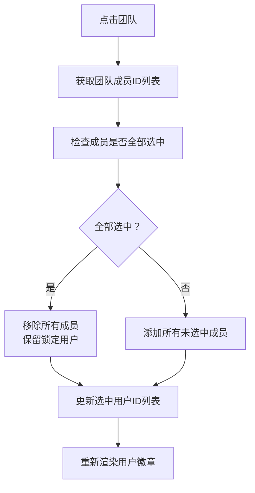
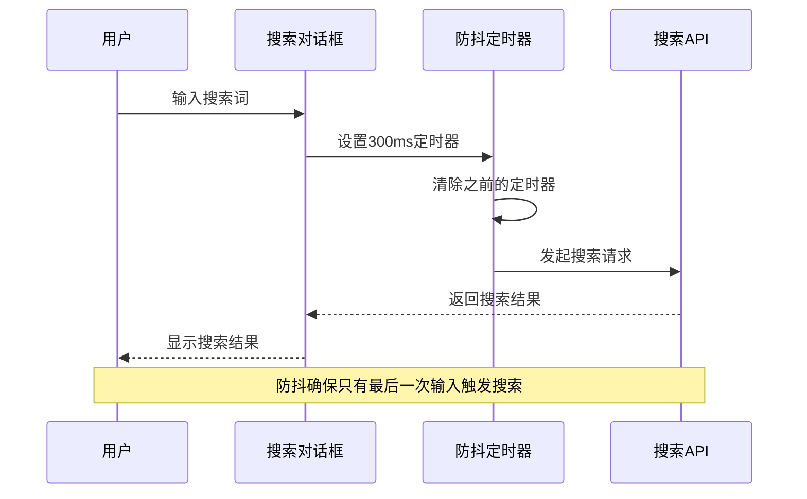
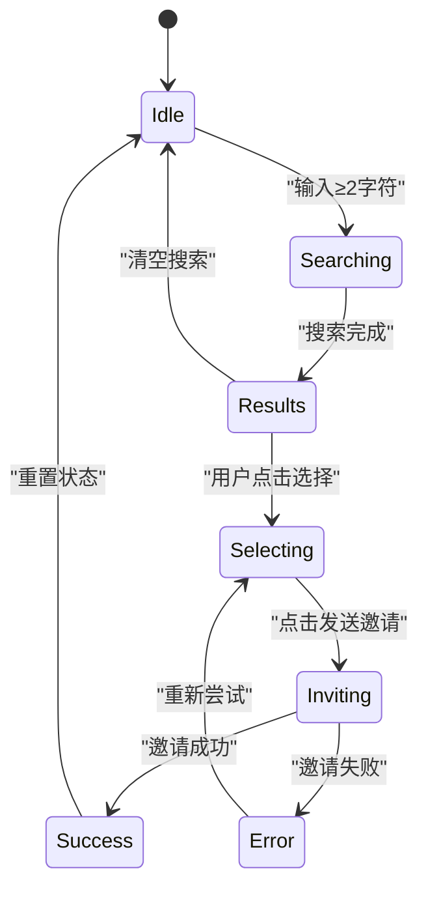
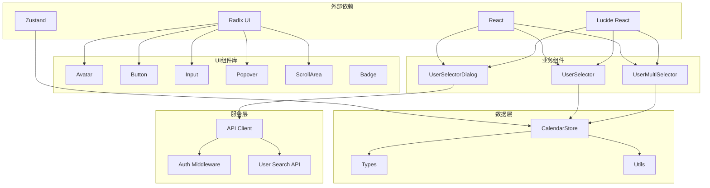
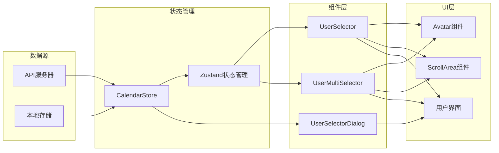

# 用户选择组件

<cite>
**本文档引用的文件**
- [components/task/user-selector.tsx](file://components/task/user-selector.tsx)
- [components/task/user-multi-selector.tsx](file://components/task/user-multi-selector.tsx)
- [components/user-selector-dialog.tsx](file://components/user-selector-dialog.tsx)
- [app/api/users/search/route.ts](file://app/api/users/search/route.ts)
- [lib/types.ts](file://lib/types.ts)
- [lib/store/calendar-store.ts](file://lib/store/calendar-store.ts)
- [components/ui/avatar.tsx](file://components/ui/avatar.tsx)
- [components/ui/scroll-area.tsx](file://components/ui/scroll-area.tsx)
- [lib/utils/permission-utils.ts](file://lib/utils/permission-utils.ts)
- [lib/api-client.ts](file://lib/api-client.ts)
- [lib/utils.ts](file://lib/utils.ts)
</cite>

## 目录
1. [简介](#简介)
2. [项目结构](#项目结构)
3. [核心组件](#核心组件)
4. [架构概览](#架构概览)
5. [详细组件分析](#详细组件分析)
6. [依赖关系分析](#依赖关系分析)
7. [性能考虑](#性能考虑)
8. [故障排除指南](#故障排除指南)
9. [结论](#结论)
10. [附录](#附录)

## 简介

用户选择组件系统是日历任务管理系统中的关键交互组件，负责处理用户的选择、搜索、过滤和权限验证功能。该系统提供了两种主要的用户选择器：单用户选择器和多用户选择器，以及一个专门的用户选择对话框。

系统的核心特性包括：
- 实时用户搜索和过滤
- 组织级别的用户筛选
- 团队成员的批量选择
- 权限验证和访问控制
- 用户头像显示和姓名展示
- 邀请新成员加入组织的功能

## 项目结构

用户选择组件系统主要分布在以下目录中：



**图表来源**
- [components/task/user-selector.tsx](file://components/task/user-selector.tsx#L1-L147)
- [components/task/user-multi-selector.tsx](file://components/task/user-multi-selector.tsx#L1-L290)
- [components/user-selector-dialog.tsx](file://components/user-selector-dialog.tsx#L1-L222)

**章节来源**
- [components/task/user-selector.tsx](file://components/task/user-selector.tsx#L1-L147)
- [components/task/user-multi-selector.tsx](file://components/task/user-multi-selector.tsx#L1-L290)
- [components/user-selector-dialog.tsx](file://components/user-selector-dialog.tsx#L1-L222)

## 核心组件

### 单用户选择器 (UserSelector)

单用户选择器是一个简洁的下拉选择组件，支持用户搜索和选择单一用户。其主要特点包括：

- **基础功能**：显示当前选中的用户头像和姓名
- **搜索功能**：实时搜索用户姓名和用户名
- **过滤功能**：支持通过filterUserIds参数限制可选用户范围
- **禁用状态**：支持disabled属性禁用选择器
- **键盘导航**：支持键盘操作和无障碍访问

### 多用户选择器 (UserMultiSelector)

多用户选择器是功能最丰富的组件，支持团队和成员的双重选择模式：

- **双面板设计**：左侧团队列表，右侧成员列表
- **团队选择**：支持一键选择整个团队的所有成员
- **部分选择**：显示团队成员的选择状态（全选、部分选择）
- **锁定机制**：支持lockedUserIds参数锁定不可移除的用户
- **创建者标识**：显示任务创建者的特殊标识
- **批量操作**：支持键盘快捷键进行批量选择和移除

### 用户选择对话框 (UserSelectorDialog)

用户选择对话框提供了一个完整的用户邀请流程：

- **组织级搜索**：基于组织ID过滤已加入的用户
- **邀请功能**：支持向未加入的用户发送邀请
- **搜索防抖**：300ms防抖延迟优化搜索性能
- **邀请确认**：提供邀请发送的确认和反馈

**章节来源**
- [components/task/user-selector.tsx](file://components/task/user-selector.tsx#L18-L23)
- [components/task/user-multi-selector.tsx](file://components/task/user-multi-selector.tsx#L18-L24)
- [components/user-selector-dialog.tsx](file://components/user-selector-dialog.tsx#L27-L33)

## 架构概览

用户选择组件系统采用分层架构设计，确保各组件之间的职责清晰分离：



**图表来源**
- [components/task/user-selector.tsx](file://components/task/user-selector.tsx#L25-L56)
- [components/task/user-multi-selector.tsx](file://components/task/user-multi-selector.tsx#L26-L108)
- [lib/store/calendar-store.ts](file://lib/store/calendar-store.ts#L388-L413)

**章节来源**
- [lib/store/calendar-store.ts](file://lib/store/calendar-store.ts#L388-L413)
- [lib/api-client.ts](file://lib/api-client.ts#L44-L100)

## 详细组件分析

### 单用户选择器实现

#### 数据结构和状态管理

单用户选择器使用React的useState Hook管理核心状态：



**图表来源**
- [components/task/user-selector.tsx](file://components/task/user-selector.tsx#L25-L56)

#### 选择逻辑分析

单用户选择器的选择逻辑相对简单，主要包含以下步骤：

1. **用户验证**：通过getUserById获取当前选中的用户信息
2. **过滤应用**：根据filterUserIds参数过滤可用用户列表
3. **搜索匹配**：对用户姓名和用户名进行模糊搜索
4. **状态更新**：触发onUserChange回调更新父组件状态

#### 头像显示和姓名展示

组件使用Avatar组件实现用户头像的显示：



**图表来源**
- [components/task/user-selector.tsx](file://components/task/user-selector.tsx#L6-L15)
- [components/ui/avatar.tsx](file://components/ui/avatar.tsx#L8-L22)

**章节来源**
- [components/task/user-selector.tsx](file://components/task/user-selector.tsx#L25-L147)
- [components/ui/avatar.tsx](file://components/ui/avatar.tsx#L1-L54)

### 多用户选择器实现

#### 双面板架构设计

多用户选择器采用独特的双面板设计，分别处理团队和成员的选择：



**图表来源**
- [components/task/user-multi-selector.tsx](file://components/task/user-multi-selector.tsx#L110-L287)

#### 团队选择逻辑

多用户选择器的核心创新在于团队选择功能：



**图表来源**
- [components/task/user-multi-selector.tsx](file://components/task/user-multi-selector.tsx#L72-L91)

#### 锁定机制和权限控制

多用户选择器实现了复杂的锁定机制：

- **锁定用户**：lockedUserIds数组中的用户不可被移除
- **禁用状态**：disabled属性完全禁用选择器功能
- **视觉反馈**：锁定用户显示半透明效果和禁用样式
- **键盘导航**：支持键盘操作移除锁定用户

**章节来源**
- [components/task/user-multi-selector.tsx](file://components/task/user-multi-selector.tsx#L18-L290)

### 用户搜索对话框

#### 搜索防抖机制

用户搜索对话框实现了高效的搜索防抖机制：



**图表来源**
- [components/user-selector-dialog.tsx](file://components/user-selector-dialog.tsx#L49-L78)

#### 邀请流程管理

搜索对话框还管理着完整的用户邀请流程：



**图表来源**
- [components/user-selector-dialog.tsx](file://components/user-selector-dialog.tsx#L80-L111)

**章节来源**
- [components/user-selector-dialog.tsx](file://components/user-selector-dialog.tsx#L1-L222)

## 依赖关系分析

### 组件依赖图

用户选择组件系统具有清晰的依赖层次结构：



**图表来源**
- [components/task/user-selector.tsx](file://components/task/user-selector.tsx#L3-L16)
- [components/task/user-multi-selector.tsx](file://components/task/user-multi-selector.tsx#L3-L16)
- [components/user-selector-dialog.tsx](file://components/user-selector-dialog.tsx#L3-L17)

### 数据流分析

用户选择组件的数据流遵循单向数据流原则：



**图表来源**
- [lib/store/calendar-store.ts](file://lib/store/calendar-store.ts#L200-L208)
- [lib/api-client.ts](file://lib/api-client.ts#L44-L100)

**章节来源**
- [lib/store/calendar-store.ts](file://lib/store/calendar-store.ts#L1-L800)
- [lib/api-client.ts](file://lib/api-client.ts#L1-L525)

## 性能考虑

### 搜索性能优化

用户选择组件系统采用了多种性能优化策略：

#### 防抖搜索机制

搜索对话框实现了300ms的防抖延迟，有效减少不必要的API调用：

- **输入延迟**：用户停止输入300ms后才发起搜索
- **定时器清理**：每次新的输入都会清除之前的定时器
- **用户体验**：避免频繁的搜索请求影响界面响应

#### 前端过滤优化

单用户和多用户选择器都实现了高效的前端过滤：

- **内存缓存**：用户数据在组件内部缓存，避免重复请求
- **即时响应**：本地过滤比网络请求更快
- **搜索索引**：基于姓名和用户名的快速匹配

#### 滚动性能优化

组件使用了高性能的滚动区域组件：

- **虚拟滚动**：对于大量数据的场景，建议使用虚拟滚动
- **滚动区域**：使用Radix UI的ScrollArea组件提供流畅滚动
- **性能监控**：定期检查滚动性能，必要时进行优化

### 大数据集处理策略

对于包含数千用户的大型组织，建议采用以下策略：

#### 分页加载

```typescript
// 建议的分页实现
interface PaginatedUsers {
  users: User[];
  total: number;
  page: number;
  pageSize: number;
}

// 在API层面实现分页
const getUsersPaginated = async (page: number, pageSize: number) => {
  const response = await fetch(`/api/users?page=${page}&pageSize=${pageSize}`);
  return response.json();
};
```

#### 虚拟滚动技术

对于超大数据集，建议实现虚拟滚动：

```typescript
// 虚拟滚动的基本思路
const VirtualizedList = ({ items, itemHeight, containerHeight }) => {
  const startIndex = Math.floor(scrollTop / itemHeight);
  const endIndex = Math.min(startIndex + Math.ceil(containerHeight / itemHeight) + 1, items.length);
  
  return (
    <div style={{ height: items.length * itemHeight }}>
      {items.slice(startIndex, endIndex).map(item => (
        <div key={item.id} style={{ transform: `translateY(${startIndex * itemHeight}px)` }}>
          {renderItem(item)}
        </div>
      ))}
    </div>
  );
};
```

#### 懒加载策略

```typescript
// 懒加载用户数据
const LazyUserSelector = ({ organizationId }) => {
  const [users, setUsers] = useState<User[]>([]);
  const [loading, setLoading] = useState(false);
  
  useEffect(() => {
    if (organizationId && users.length === 0) {
      loadUsersLazy(organizationId);
    }
  }, [organizationId]);
  
  const loadUsersLazy = async (orgId: string) => {
    setLoading(true);
    const response = await fetch(`/api/users?organizationId=${orgId}`);
    const userData = await response.json();
    setUsers(userData);
    setLoading(false);
  };
  
  return <UserSelector users={users} loading={loading} />;
};
```

**章节来源**
- [components/user-selector-dialog.tsx](file://components/user-selector-dialog.tsx#L49-L78)
- [components/task/user-selector.tsx](file://components/task/user-selector.tsx#L37-L44)
- [components/task/user-multi-selector.tsx](file://components/task/user-multi-selector.tsx#L41-L54)

## 故障排除指南

### 常见问题和解决方案

#### 用户搜索无结果

**问题描述**：用户搜索时无法找到任何结果

**可能原因**：
1. 搜索关键词长度小于2个字符
2. 用户数据未正确加载到状态管理中
3. API搜索接口返回空结果

**解决方案**：
1. 确保搜索关键词至少2个字符
2. 检查CalendarStore中的users数据是否正确加载
3. 验证API搜索接口的查询参数

#### 权限验证失败

**问题描述**：用户选择器显示权限不足错误

**可能原因**：
1. 当前用户不在目标项目或团队中
2. 项目或团队的协作权限设置为"仅创建者"
3. 用户角色权限不足

**解决方案**：
1. 检查用户是否为项目或团队成员
2. 验证项目或团队的taskPermission设置
3. 确认用户是否有足够的权限级别

#### 头像显示异常

**问题描述**：用户头像无法正常显示

**可能原因**：
1. 用户头像URL无效或不存在
2. Avatar组件配置错误
3. 网络连接问题

**解决方案**：
1. 验证用户头像URL的有效性
2. 检查Avatar组件的src和alt属性
3. 确认网络连接正常

#### 性能问题

**问题描述**：用户选择器响应缓慢

**可能原因**：
1. 用户数据量过大
2. 搜索算法效率低
3. 组件渲染开销大

**解决方案**：
1. 实施分页加载或虚拟滚动
2. 优化搜索算法，使用索引
3. 减少不必要的组件重渲染

**章节来源**
- [lib/utils/permission-utils.ts](file://lib/utils/permission-utils.ts#L11-L30)
- [components/ui/avatar.tsx](file://components/ui/avatar.tsx#L24-L51)
- [lib/store/calendar-store.ts](file://lib/store/calendar-store.ts#L388-L413)

## 结论

用户选择组件系统展现了现代React应用的最佳实践，具有以下显著特点：

### 技术优势

1. **模块化设计**：清晰的组件分离和职责划分
2. **状态管理**：使用Zustand实现高效的状态管理
3. **性能优化**：防抖搜索、前端过滤、滚动优化
4. **权限控制**：完善的权限验证和访问控制
5. **用户体验**：流畅的交互和良好的可访问性

### 功能完整性

系统提供了从基础用户选择到复杂团队管理的完整功能链，包括：
- 单用户和多用户选择
- 组织级别的用户筛选
- 团队成员的批量操作
- 用户邀请和管理
- 权限验证和安全控制

### 扩展性考虑

系统设计充分考虑了未来的扩展需求：
- 插件化的权限验证机制
- 可配置的搜索和过滤规则
- 支持虚拟滚动的大数据集处理
- 模块化的UI组件设计

## 附录

### 配置选项参考

#### UserSelector Props

| 属性名 | 类型 | 必需 | 默认值 | 描述 |
|--------|------|------|--------|------|
| selectedUserId | string | 是 | - | 当前选中的用户ID |
| onUserChange | (userId: string) => void | 是 | - | 用户选择变化回调 |
| filterUserIds | string[] | 否 | undefined | 可选的用户ID过滤列表 |
| disabled | boolean | 否 | false | 是否禁用选择器 |

#### UserMultiSelector Props

| 属性名 | 类型 | 必需 | 默认值 | 描述 |
|--------|------|------|--------|------|
| selectedUserIds | string[] | 是 | - | 当前选中的用户ID数组 |
| onUserChange | (userIds: string[]) => void | 是 | - | 用户选择变化回调 |
| lockedUserIds | string[] | 否 | [] | 不可移除的用户ID列表 |
| creatorId | string | 否 | undefined | 创建者ID，用于显示标签 |
| disabled | boolean | 否 | false | 是否禁用选择器 |

#### UserSelectorDialog Props

| 属性名 | 类型 | 必需 | 默认值 | 描述 |
|--------|------|------|--------|------|
| organizationId | string | 是 | - | 组织ID |
| organizationName | string | 是 | - | 组织名称 |
| open | boolean | 是 | - | 对话框是否打开 |
| onOpenChange | (open: boolean) => void | 是 | - | 对话框状态变化回调 |
| onSuccess | () => void | 否 | undefined | 成功回调函数 |

### API接口规范

#### 用户搜索API

**GET** `/api/users/search`

**查询参数**：
- `q` (string, 必需): 搜索关键词
- `organizationId` (string, 可选): 组织ID

**响应数据**：
```typescript
interface UserSearchResult {
  id: string;
  username: string;
  name: string;
  email: string;
  avatar: string;
}
```

**章节来源**
- [app/api/users/search/route.ts](file://app/api/users/search/route.ts#L6-L57)
- [lib/types.ts](file://lib/types.ts#L108-L120)