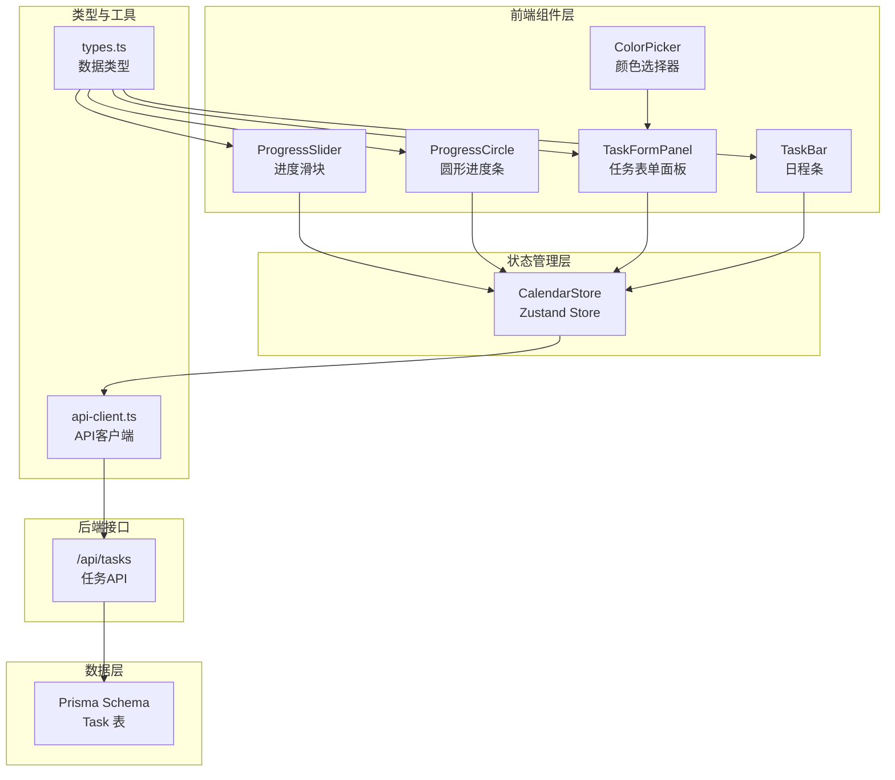
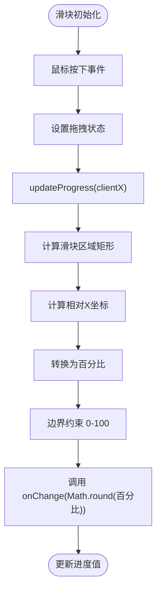
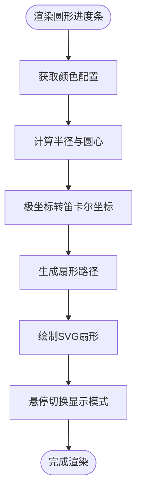
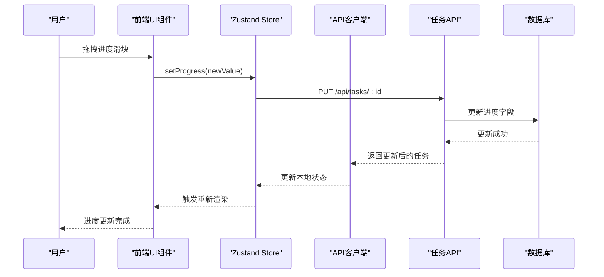
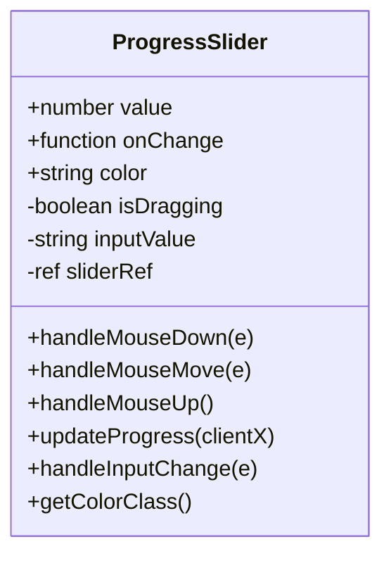
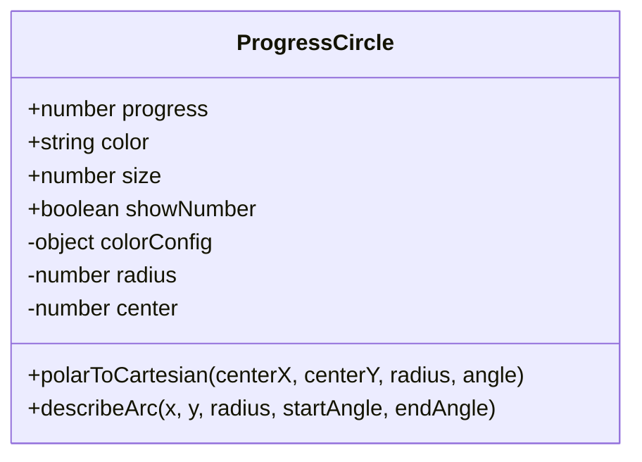
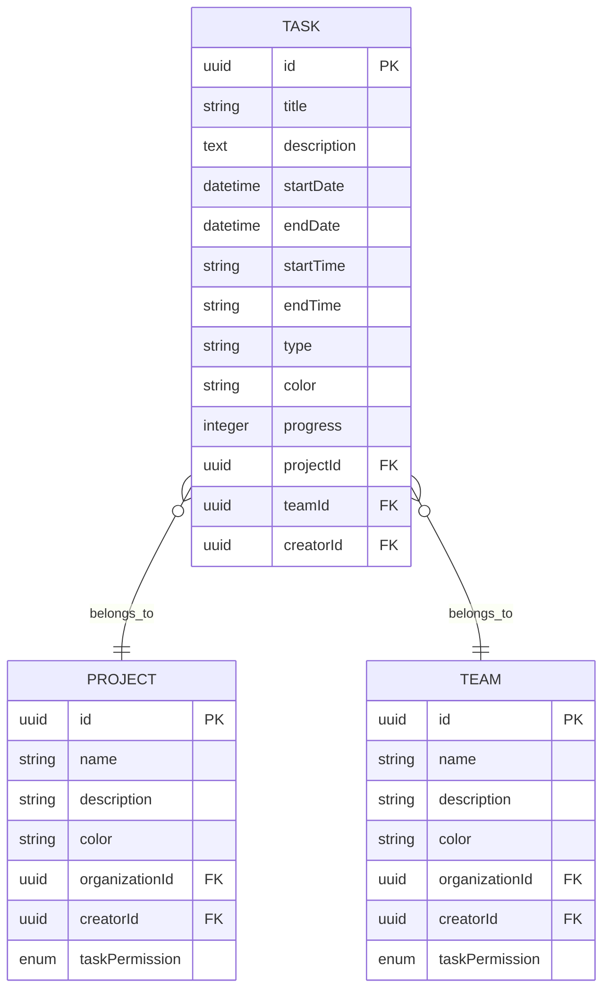
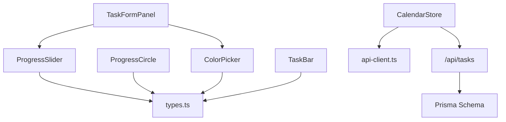

# 进度管理系统

<cite>
**本文档引用的文件**
- [components/task/progress-slider.tsx](file://components/task/progress-slider.tsx)
- [components/task/progress-circle.tsx](file://components/task/progress-circle.tsx)
- [components/task/color-picker.tsx](file://components/task/color-picker.tsx)
- [components/task/task-form-panel.tsx](file://components/task/task-form-panel.tsx)
- [components/calendar/task-bar.tsx](file://components/calendar/task-bar.tsx)
- [lib/types.ts](file://lib/types.ts)
- [lib/api-client.ts](file://lib/api-client.ts)
- [lib/store/calendar-store.ts](file://lib/store/calendar-store.ts)
- [app/api/tasks/route.ts](file://app/api/tasks/route.ts)
- [prisma/migrations/20251125165512_add_task_color_and_progress/migration.sql](file://prisma/migrations/20251125165512_add_task_color_and_progress/migration.sql)
</cite>

## 目录
1. [简介](#简介)
2. [项目结构](#项目结构)
3. [核心组件](#核心组件)
4. [架构概览](#架构概览)
5. [详细组件分析](#详细组件分析)
6. [依赖关系分析](#依赖关系分析)
7. [性能考量](#性能考量)
8. [故障排除指南](#故障排除指南)
9. [结论](#结论)
10. [附录](#附录)

## 简介
本系统是一个基于 Next.js 的任务进度管理系统，重点围绕进度可视化与交互体验进行设计。系统提供两种进度展示方式：
- 进度滑块：支持鼠标拖拽与数字输入的混合交互，实时计算并更新任务进度
- 圆形进度条：基于 SVG 的扇形绘制，支持悬停切换饼图与数值显示

同时，系统实现了完整的进度数据生命周期管理，包括：
- 数据模型与存储格式（0-100整数）
- 前端状态管理与乐观更新
- 后端 API 接口与数据库迁移
- 实时同步与权限控制

## 项目结构
系统采用模块化组织，进度相关功能主要分布在以下目录：
- 组件层：`components/task/` 提供进度滑块、圆形进度条、颜色选择器与任务表单面板
- 状态管理层：`lib/store/calendar-store.ts` 使用 Zustand 管理任务状态与 API 调用
- 类型定义层：`lib/types.ts` 定义任务数据结构与颜色配置
- API 层：`lib/api-client.ts` 封装统一的 API 请求与错误处理
- 后端接口：`app/api/tasks/route.ts` 提供任务 CRUD 与进度更新
- 数据库迁移：`prisma/migrations/.../add_task_color_and_progress` 添加进度与颜色字段

**图表来源**
- [components/task/progress-slider.tsx](file://components/task/progress-slider.tsx#L1-L137)
- [components/task/progress-circle.tsx](file://components/task/progress-circle.tsx#L1-L102)
- [components/task/color-picker.tsx](file://components/task/color-picker.tsx#L1-L53)
- [components/task/task-form-panel.tsx](file://components/task/task-form-panel.tsx#L1-L627)
- [components/calendar/task-bar.tsx](file://components/calendar/task-bar.tsx#L1-L700)
- [lib/store/calendar-store.ts](file://lib/store/calendar-store.ts#L1-L1457)
- [lib/api-client.ts](file://lib/api-client.ts#L1-L525)
- [app/api/tasks/route.ts](file://app/api/tasks/route.ts#L1-L497)
- [lib/types.ts](file://lib/types.ts#L1-L141)

**章节来源**
- [components/task/progress-slider.tsx](file://components/task/progress-slider.tsx#L1-L137)
- [components/task/progress-circle.tsx](file://components/task/progress-circle.tsx#L1-L102)
- [components/task/color-picker.tsx](file://components/task/color-picker.tsx#L1-L53)
- [components/task/task-form-panel.tsx](file://components/task/task-form-panel.tsx#L1-L627)
- [components/calendar/task-bar.tsx](file://components/calendar/task-bar.tsx#L1-L700)
- [lib/types.ts](file://lib/types.ts#L1-L141)
- [lib/api-client.ts](file://lib/api-client.ts#L1-L525)
- [lib/store/calendar-store.ts](file://lib/store/calendar-store.ts#L1-L1457)
- [app/api/tasks/route.ts](file://app/api/tasks/route.ts#L1-L497)
- [prisma/migrations/20251125165512_add_task_color_and_progress/migration.sql](file://prisma/migrations/20251125165512_add_task_color_and_progress/migration.sql#L1-L3)

## 核心组件
本节深入分析进度相关的核心组件及其职责。

### 进度滑块组件（ProgressSlider）
- 交互机制：支持鼠标按下拖拽与数字输入两种方式
- 数值计算：根据鼠标位置计算百分比，限制在 0-100 区间并四舍五入
- 视觉反馈：进度条宽度随值变化，滑块位置与颜色主题一致
- 快速标记：内置刻度标记便于快速定位进度

**图表来源**
- [components/task/progress-slider.tsx](file://components/task/progress-slider.tsx#L26-L59)

**章节来源**
- [components/task/progress-slider.tsx](file://components/task/progress-slider.tsx#L1-L137)

### 圆形进度条组件（ProgressCircle）
- SVG 绘制：使用极坐标转笛卡尔坐标的数学公式生成扇形路径
- 动画效果：通过 CSS 过渡实现饼图与数值的切换动画
- 主题适配：根据任务颜色配置动态设置描边与填充色
- 边界处理：0%时不绘制扇形，100%时绘制完整圆环

**图表来源**
- [components/task/progress-circle.tsx](file://components/task/progress-circle.tsx#L18-L51)

**章节来源**
- [components/task/progress-circle.tsx](file://components/task/progress-circle.tsx#L1-L102)

### 颜色选择器（ColorPicker）
- 颜色配置：基于 TASK_COLORS 常量提供预设颜色集合
- 交互反馈：选中颜色通过图标与缩放效果突出显示
- 无障碍支持：提供标题与 ARIA 标签

**章节来源**
- [components/task/color-picker.tsx](file://components/task/color-picker.tsx#L1-L53)
- [lib/types.ts](file://lib/types.ts#L132-L139)

### 任务表单面板（TaskFormPanel）
- 进度集成：在日常任务类型下显示进度滑块与颜色选择器
- 状态管理：维护任务的标题、描述、时间范围、负责人、项目、团队与进度
- 权限控制：根据项目与团队权限决定可编辑字段与操作

**章节来源**
- [components/task/task-form-panel.tsx](file://components/task/task-form-panel.tsx#L1-L627)

### 日程条（TaskBar）
- 进度展示：在日程条内绘制进度背景与拖拽手柄
- 乐观更新：支持拖拽进度时的本地预览与服务器同步
- 交互优化：拖拽时禁用过渡动画提升响应速度

**章节来源**
- [components/calendar/task-bar.tsx](file://components/calendar/task-bar.tsx#L1-L700)

## 架构概览
系统采用前后端分离架构，前端使用 Next.js 与 Zustand 管理状态，后端提供 RESTful API，数据库通过 Prisma ORM 管理。

**图表来源**
- [lib/store/calendar-store.ts](file://lib/store/calendar-store.ts#L615-L748)
- [lib/api-client.ts](file://lib/api-client.ts#L157-L172)
- [app/api/tasks/route.ts](file://app/api/tasks/route.ts#L1-L497)

## 详细组件分析

### 进度滑块组件实现细节
- 事件处理：使用 document 级别的 mousemove 与 mouseup 监听，确保拖拽离开元素时仍能更新进度
- 边界处理：通过 Math.max/Math.min 保证百分比在有效范围内
- 性能优化：拖拽过程中禁用进度条的过渡动画，提升响应速度
- 主题适配：根据任务颜色动态选择滑块与进度条的颜色

**图表来源**
- [components/task/progress-slider.tsx](file://components/task/progress-slider.tsx#L9-L137)

**章节来源**
- [components/task/progress-slider.tsx](file://components/task/progress-slider.tsx#L1-L137)

### 圆形进度条组件实现细节
- 数学计算：使用 polarToCartesian 函数将角度转换为笛卡尔坐标
- 路径生成：describeArc 函数根据起止角度生成 SVG 路径数据
- 动画控制：通过 CSS 过渡属性实现饼图与数值的平滑切换
- 可访问性：支持悬停显示数值，确保在不同背景下清晰可见

**图表来源**
- [components/task/progress-circle.tsx](file://components/task/progress-circle.tsx#L6-L51)

**章节来源**
- [components/task/progress-circle.tsx](file://components/task/progress-circle.tsx#L1-L102)

### 数据模型与存储格式
- 数据结构：Task 接口中包含 progress 字段（0-100整数）
- 颜色配置：TASK_COLORS 提供颜色值、十六进制色值与样式类
- 数据库迁移：为 Task 表添加 color 与 progress 字段

**图表来源**
- [lib/types.ts](file://lib/types.ts#L61-L82)
- [prisma/migrations/20251125165512_add_task_color_and_progress/migration.sql](file://prisma/migrations/20251125165512_add_task_color_and_progress/migration.sql#L1-L3)

**章节来源**
- [lib/types.ts](file://lib/types.ts#L61-L82)
- [lib/types.ts](file://lib/types.ts#L132-L139)
- [prisma/migrations/20251125165512_add_task_color_and_progress/migration.sql](file://prisma/migrations/20251125165512_add_task_color_and_progress/migration.sql#L1-L3)

### 进度计算算法与边界处理
- 百分比计算：基于鼠标相对位置计算百分比，限制在 0-100 区间
- 数值输入：支持直接输入 0-100 的整数，实时更新进度
- 边界保护：使用 Math.max/Math.min 防止越界
- 四舍五入：将浮点结果转换为整数，确保存储格式一致性

**章节来源**
- [components/task/progress-slider.tsx](file://components/task/progress-slider.tsx#L52-L69)

### 实时同步机制
- 乐观更新：拖拽进度时先更新本地状态，等待服务器响应
- 错误回滚：服务器返回错误时恢复原进度值
- 后台刷新：成功更新后异步刷新相关数据，避免阻塞用户操作

**章节来源**
- [lib/store/calendar-store.ts](file://lib/store/calendar-store.ts#L615-L748)
- [lib/api-client.ts](file://lib/api-client.ts#L157-L172)

### 用户体验优化
- 拖拽优化：拖拽时禁用进度条过渡动画，提升响应速度
- 视觉反馈：滑块与进度条颜色与任务主题保持一致
- 交互提示：悬停显示进度数值，拖拽手柄提供明确的交互区域
- 无障碍支持：提供标题与 ARIA 标签，支持键盘操作

**章节来源**
- [components/calendar/task-bar.tsx](file://components/calendar/task-bar.tsx#L516-L544)
- [components/task/progress-slider.tsx](file://components/task/progress-slider.tsx#L75-L80)

## 依赖关系分析
系统各模块之间的依赖关系如下：

**图表来源**
- [components/task/progress-slider.tsx](file://components/task/progress-slider.tsx#L3-L8)
- [components/task/progress-circle.tsx](file://components/task/progress-circle.tsx#L3-L4)
- [components/task/color-picker.tsx](file://components/task/color-picker.tsx#L3-L4)
- [components/task/task-form-panel.tsx](file://components/task/task-form-panel.tsx#L16-L24)
- [components/calendar/task-bar.tsx](file://components/calendar/task-bar.tsx#L8-L10)
- [lib/store/calendar-store.ts](file://lib/store/calendar-store.ts#L17-L23)
- [lib/api-client.ts](file://lib/api-client.ts#L6-L8)

**章节来源**
- [lib/types.ts](file://lib/types.ts#L1-L141)
- [lib/api-client.ts](file://lib/api-client.ts#L1-L525)
- [lib/store/calendar-store.ts](file://lib/store/calendar-store.ts#L1-L1457)

## 性能考量
- 事件监听：使用 document 级别监听拖拽事件，避免鼠标移出元素时的事件丢失
- 动画优化：拖拽过程禁用 CSS 过渡，减少重绘开销
- 状态更新：采用乐观更新策略，减少用户等待时间
- 数据缓存：使用 Zustand 的持久化中间件缓存用户偏好设置

## 故障排除指南
- 进度更新失败：检查网络连接与认证状态，确认服务器返回的错误信息
- 颜色显示异常：验证 TASK_COLORS 配置是否正确，检查颜色值格式
- 数据不同步：确认乐观更新流程是否正常执行，检查服务器响应状态
- 权限问题：验证用户在项目或团队中的权限级别，确保有相应的操作权限

**章节来源**
- [lib/api-client.ts](file://lib/api-client.ts#L502-L507)
- [lib/store/calendar-store.ts](file://lib/store/calendar-store.ts#L615-L748)

## 结论
本进度管理系统通过精心设计的组件架构与交互体验，提供了直观、高效的进度管理能力。进度滑块与圆形进度条分别满足了不同场景下的需求，配合完善的权限控制与实时同步机制，确保了系统的可用性与可靠性。通过合理的性能优化与故障排除策略，系统能够在复杂业务场景下保持良好的用户体验。

## 附录

### 自定义配置与样式定制
- 颜色主题：通过 TASK_COLORS 常量扩展或修改颜色配置
- 尺寸调整：ProgressCircle 支持自定义 size 参数调整显示尺寸
- 交互行为：可通过 props 调整 showNumber 参数控制数值显示模式

### 事件处理使用指南
- 进度变更：通过 onChange 回调函数接收更新后的进度值
- 颜色选择：ColorPicker 的 onChange 回调返回选中的颜色值
- 表单提交：TaskFormPanel 在表单提交时自动包含进度与颜色信息

### 最佳实践建议
- 保持进度值在 0-100 范围内
- 合理使用乐观更新，避免频繁的服务器请求
- 为重要操作提供用户确认对话框
- 确保颜色选择与任务类型匹配（仅日常任务支持颜色）