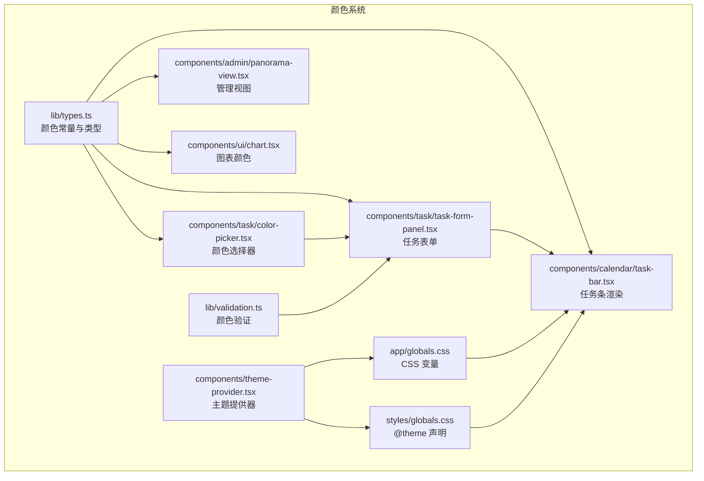
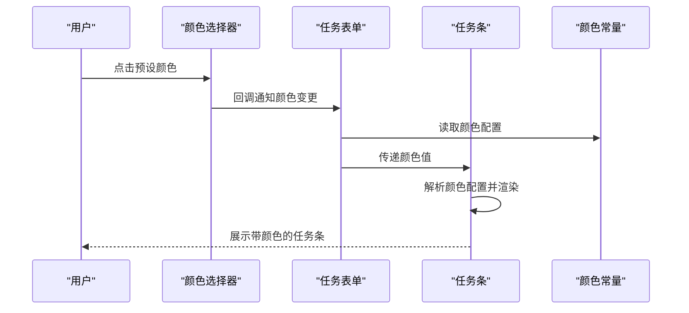
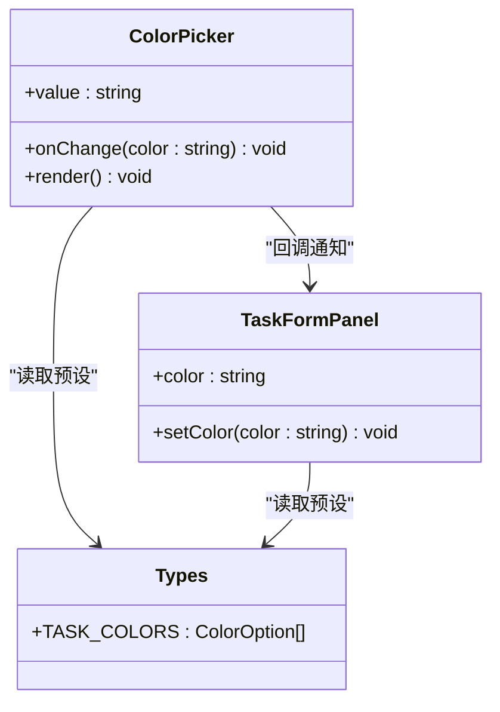
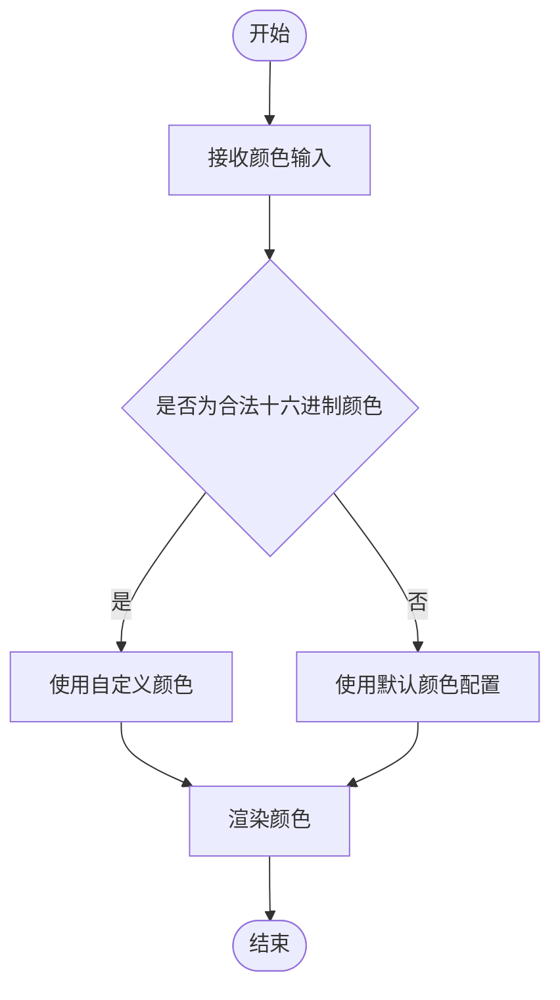
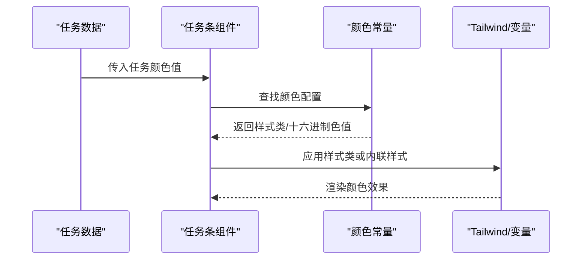
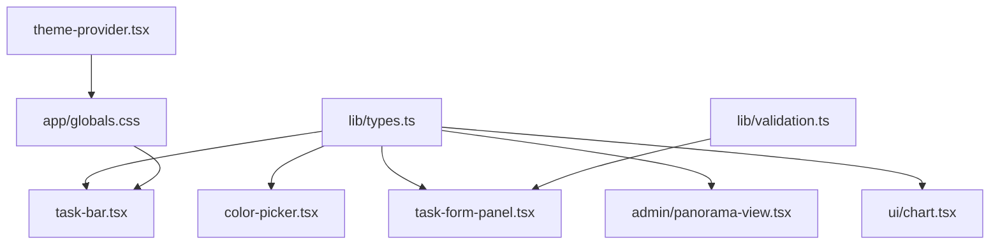

# 颜色选择系统

<cite>
**本文档引用的文件**
- [components/task/color-picker.tsx](file://components/task/color-picker.tsx)
- [lib/types.ts](file://lib/types.ts)
- [components/calendar/task-bar.tsx](file://components/calendar/task-bar.tsx)
- [components/task/task-form-panel.tsx](file://components/task/task-form-panel.tsx)
- [lib/validation.ts](file://lib/validation.ts)
- [app/globals.css](file://app/globals.css)
- [styles/globals.css](file://styles/globals.css)
- [components/theme-provider.tsx](file://components/theme-provider.tsx)
- [components/admin/panorama-view.tsx](file://components/admin/panorama-view.tsx)
- [components/ui/chart.tsx](file://components/ui/chart.tsx)
</cite>

## 目录
1. [简介](#简介)
2. [项目结构](#项目结构)
3. [核心组件](#核心组件)
4. [架构概览](#架构概览)
5. [详细组件分析](#详细组件分析)
6. [依赖关系分析](#依赖关系分析)
7. [性能考量](#性能考量)
8. [故障排除指南](#故障排除指南)
9. [结论](#结论)
10. [附录](#附录)

## 简介
本技术文档围绕任务颜色选择系统进行深入解析，涵盖颜色预设、自定义颜色输入、颜色验证逻辑、存储格式与主题适配、响应式设计、用户交互与无障碍支持、跨浏览器兼容性，以及扩展方法与品牌色彩集成指南。文档重点解释颜色选择器组件如何在日历视图与任务表单中协同工作，实现一致的颜色渲染与良好的用户体验。

## 项目结构
颜色系统涉及以下关键模块：
- 颜色常量与类型定义：位于类型文件中，统一管理颜色预设与任务类型映射
- 颜色选择器组件：提供预设颜色选择与视觉反馈
- 任务条组件：在日历视图中根据任务类型与颜色进行渲染
- 任务表单面板：在创建/编辑任务时允许选择颜色
- 验证工具：提供颜色格式校验能力
- 主题与样式：全局 CSS 变量与主题提供器支撑颜色体系
- 管理视图与图表：展示颜色在不同界面元素中的应用

**图表来源**
- [lib/types.ts](file://lib/types.ts#L132-L139)
- [components/task/color-picker.tsx](file://components/task/color-picker.tsx#L1-L52)
- [components/calendar/task-bar.tsx](file://components/calendar/task-bar.tsx#L233-L270)
- [components/task/task-form-panel.tsx](file://components/task/task-form-panel.tsx#L70-L269)
- [lib/validation.ts](file://lib/validation.ts#L116-L119)
- [components/theme-provider.tsx](file://components/theme-provider.tsx#L1-L12)
- [app/globals.css](file://app/globals.css#L130-L212)
- [styles/globals.css](file://styles/globals.css#L77-L110)
- [components/admin/panorama-view.tsx](file://components/admin/panorama-view.tsx#L750-L823)
- [components/ui/chart.tsx](file://components/ui/chart.tsx#L77-L103)

**章节来源**
- [lib/types.ts](file://lib/types.ts#L132-L139)
- [components/task/color-picker.tsx](file://components/task/color-picker.tsx#L1-L52)
- [components/calendar/task-bar.tsx](file://components/calendar/task-bar.tsx#L233-L270)
- [components/task/task-form-panel.tsx](file://components/task/task-form-panel.tsx#L70-L269)
- [lib/validation.ts](file://lib/validation.ts#L116-L119)
- [components/theme-provider.tsx](file://components/theme-provider.tsx#L1-L12)
- [app/globals.css](file://app/globals.css#L130-L212)
- [styles/globals.css](file://styles/globals.css#L77-L110)
- [components/admin/panorama-view.tsx](file://components/admin/panorama-view.tsx#L750-L823)
- [components/ui/chart.tsx](file://components/ui/chart.tsx#L77-L103)

## 核心组件
- 颜色常量与类型
  - 任务颜色预设通过常量数组统一管理，包含值、标签、十六进制色值、浅背景类、边框类与文本类
  - 任务类型与颜色映射用于默认颜色渲染
- 颜色选择器组件
  - 接收当前颜色值与变更回调，渲染一组预设颜色按钮，支持选中态放大与勾选图标
  - 使用 Tailwind 类名组合实现颜色与主题的动态切换
- 任务条组件
  - 根据任务类型与自定义颜色生成样式类或直接返回十六进制色值
  - 在日历视图中作为任务条背景色与描边色使用
- 任务表单面板
  - 在创建/编辑任务时维护颜色状态，仅在日常任务类型下启用颜色字段
  - 将颜色值写入任务数据并在提交时生效
- 验证工具
  - 提供十六进制颜色格式校验函数，确保输入合法性
- 主题与样式
  - 全局 CSS 变量定义任务类型默认颜色
  - 主题提供器与 @theme 声明支撑深浅主题下的颜色一致性

**章节来源**
- [lib/types.ts](file://lib/types.ts#L132-L139)
- [components/task/color-picker.tsx](file://components/task/color-picker.tsx#L11-L51)
- [components/calendar/task-bar.tsx](file://components/calendar/task-bar.tsx#L233-L270)
- [components/task/task-form-panel.tsx](file://components/task/task-form-panel.tsx#L70-L269)
- [lib/validation.ts](file://lib/validation.ts#L116-L119)
- [app/globals.css](file://app/globals.css#L135-L138)
- [components/theme-provider.tsx](file://components/theme-provider.tsx#L1-L12)

## 架构概览
颜色系统采用“常量定义—组件消费—主题适配”的分层架构。颜色常量在类型文件中集中定义，组件通过 props 或状态接收颜色值，结合 Tailwind 类名或内联样式进行渲染；主题提供器与 CSS 变量确保在不同主题下颜色的一致性与可读性。

**图表来源**
- [components/task/color-picker.tsx](file://components/task/color-picker.tsx#L11-L51)
- [components/task/task-form-panel.tsx](file://components/task/task-form-panel.tsx#L70-L269)
- [components/calendar/task-bar.tsx](file://components/calendar/task-bar.tsx#L233-L270)
- [lib/types.ts](file://lib/types.ts#L132-L139)

## 详细组件分析

### 颜色选择器组件分析
- 设计要点
  - 预设颜色循环渲染，每个按钮绑定点击事件触发颜色变更
  - 选中态通过缩放与勾选图标增强视觉反馈
  - 使用 Tailwind 类名组合实现颜色、边框与文本的统一风格
- 数据流
  - 接收当前颜色值与变更回调，变更时通过回调向上层传递
  - 与任务表单联动，在创建/编辑任务时即时反映颜色变化
- 无障碍与交互
  - 按钮具备标题与 aria 标签，便于屏幕阅读器识别
  - 支持键盘操作与焦点管理（由框架自动处理）

**图表来源**
- [components/task/color-picker.tsx](file://components/task/color-picker.tsx#L6-L31)
- [components/task/task-form-panel.tsx](file://components/task/task-form-panel.tsx#L70-L96)
- [lib/types.ts](file://lib/types.ts#L132-L139)

**章节来源**
- [components/task/color-picker.tsx](file://components/task/color-picker.tsx#L11-L51)
- [components/task/task-form-panel.tsx](file://components/task/task-form-panel.tsx#L70-L96)

### 颜色验证逻辑
- 十六进制颜色格式校验
  - 使用正则表达式匹配标准六位或三位十六进制颜色码
  - 适用于自定义颜色输入场景（如表单扩展）
- 颜色值存储与回退
  - 若自定义颜色无效，系统回退至默认颜色配置
  - 在任务条渲染中优先使用预设颜色配置，保证样式一致性

**图表来源**
- [lib/validation.ts](file://lib/validation.ts#L116-L119)
- [components/calendar/task-bar.tsx](file://components/calendar/task-bar.tsx#L255-L270)

**章节来源**
- [lib/validation.ts](file://lib/validation.ts#L116-L119)
- [components/calendar/task-bar.tsx](file://components/calendar/task-bar.tsx#L255-L270)

### 颜色值存储格式与主题适配
- 存储格式
  - 颜色值以字符串形式存储于任务实体中，对应预设颜色的值标识
  - 任务类型默认颜色通过 CSS 变量与 Tailwind 类名统一管理
- 主题适配
  - 全局 CSS 变量定义任务类型默认颜色，支持深浅主题切换
  - 主题提供器与 @theme 声明确保颜色在不同主题下的一致性
- 响应式设计
  - 颜色渲染不依赖响应式断点，但整体界面在不同尺寸下保持一致的可读性与对比度

**章节来源**
- [lib/types.ts](file://lib/types.ts#L61-L82)
- [app/globals.css](file://app/globals.css#L135-L138)
- [styles/globals.css](file://styles/globals.css#L77-L110)
- [components/theme-provider.tsx](file://components/theme-provider.tsx#L1-L12)

### 日历视图中的颜色渲染
- 任务条颜色生成
  - 日常任务若存在自定义颜色，使用预设颜色配置生成样式类
  - 否则根据任务类型返回默认背景色
- 颜色值获取
  - 提供十六进制颜色值用于内联样式背景色设置
- 视觉效果
  - 自定义颜色任务条呈现镂空样式与边框，提升可读性与区分度

**图表来源**
- [components/calendar/task-bar.tsx](file://components/calendar/task-bar.tsx#L233-L270)
- [lib/types.ts](file://lib/types.ts#L132-L139)

**章节来源**
- [components/calendar/task-bar.tsx](file://components/calendar/task-bar.tsx#L233-L270)

### 任务表单中的颜色选择
- 表单状态管理
  - 在创建/编辑任务时维护颜色状态，默认值来自任务或预设
  - 仅在日常任务类型下启用颜色字段
- 提交流程
  - 将颜色值写入任务数据对象
  - 提交后颜色在日历视图与任务条中生效

**章节来源**
- [components/task/task-form-panel.tsx](file://components/task/task-form-panel.tsx#L70-L269)

### 管理视图与图表中的颜色应用
- 管理视图
  - 项目与团队徽章使用各自颜色属性进行背景色渲染
- 图表组件
  - 图表颜色通过主题映射与颜色配置生成 CSS 变量，实现主题适配

**章节来源**
- [components/admin/panorama-view.tsx](file://components/admin/panorama-view.tsx#L750-L823)
- [components/ui/chart.tsx](file://components/ui/chart.tsx#L77-L103)

## 依赖关系分析
颜色系统的关键依赖关系如下：
- 颜色常量被颜色选择器、任务条、任务表单、管理视图与图表共同依赖
- 主题提供器与 CSS 变量为颜色渲染提供基础支撑
- 验证工具为自定义颜色输入提供合法性保障

**图表来源**
- [lib/types.ts](file://lib/types.ts#L132-L139)
- [components/task/color-picker.tsx](file://components/task/color-picker.tsx#L1-L52)
- [components/calendar/task-bar.tsx](file://components/calendar/task-bar.tsx#L233-L270)
- [components/task/task-form-panel.tsx](file://components/task/task-form-panel.tsx#L70-L269)
- [components/admin/panorama-view.tsx](file://components/admin/panorama-view.tsx#L750-L823)
- [components/ui/chart.tsx](file://components/ui/chart.tsx#L77-L103)
- [lib/validation.ts](file://lib/validation.ts#L116-L119)
- [components/theme-provider.tsx](file://components/theme-provider.tsx#L1-L12)
- [app/globals.css](file://app/globals.css#L130-L212)

**章节来源**
- [lib/types.ts](file://lib/types.ts#L132-L139)
- [components/task/color-picker.tsx](file://components/task/color-picker.tsx#L1-L52)
- [components/calendar/task-bar.tsx](file://components/calendar/task-bar.tsx#L233-L270)
- [components/task/task-form-panel.tsx](file://components/task/task-form-panel.tsx#L70-L269)
- [components/admin/panorama-view.tsx](file://components/admin/panorama-view.tsx#L750-L823)
- [components/ui/chart.tsx](file://components/ui/chart.tsx#L77-L103)
- [lib/validation.ts](file://lib/validation.ts#L116-L119)
- [components/theme-provider.tsx](file://components/theme-provider.tsx#L1-L12)
- [app/globals.css](file://app/globals.css#L130-L212)

## 性能考量
- 渲染优化
  - 颜色选择器使用预设数组映射，渲染开销极低
  - 任务条颜色计算在组件内部完成，避免重复查询
- 样式优化
  - Tailwind 类名组合减少内联样式的计算成本
  - CSS 变量与主题提供器降低样式切换的重排与重绘
- 数据流优化
  - 颜色值以字符串形式存储，序列化与传输成本低
  - 仅在日常任务类型下启用颜色字段，减少不必要的状态更新

## 故障排除指南
- 颜色未生效
  - 检查任务类型是否为日常任务，颜色字段仅在该类型下启用
  - 确认颜色值存在于预设集合中，否则将回退至默认颜色
- 自定义颜色无效
  - 使用十六进制格式（#RGB 或 #RRGGBB），参考验证函数规则
  - 若输入非法，系统将回退至默认颜色配置
- 主题切换后颜色异常
  - 确认主题提供器正确包裹应用根节点
  - 检查全局 CSS 变量是否正确声明与覆盖

**章节来源**
- [components/task/task-form-panel.tsx](file://components/task/task-form-panel.tsx#L162-L168)
- [lib/validation.ts](file://lib/validation.ts#L116-L119)
- [components/theme-provider.tsx](file://components/theme-provider.tsx#L1-L12)

## 结论
颜色选择系统通过统一的颜色常量、简洁的组件设计与主题适配机制，实现了在日历视图与任务表单中的高效渲染与一致体验。系统支持预设颜色与自定义颜色输入，并通过验证逻辑保障数据合法性。未来可在保持现有架构稳定性的基础上，扩展更多颜色预设、支持动态品牌色彩集成与更丰富的主题变体。

## 附录
- 扩展方法
  - 新增颜色预设：在类型文件中添加新的颜色项，确保包含值、标签、十六进制色值与样式类
  - 自定义颜色方案：通过验证函数与颜色选择器扩展输入能力，保持与现有渲染逻辑兼容
  - 品牌色彩集成：将品牌主色与辅助色纳入预设集合，统一在全局 CSS 变量中管理
- 使用场景
  - 日常任务：启用颜色字段，提升任务可视化与分类效率
  - 会议与假期：使用默认颜色，保持界面一致性
  - 管理视图与图表：沿用项目/团队颜色，强化上下文关联