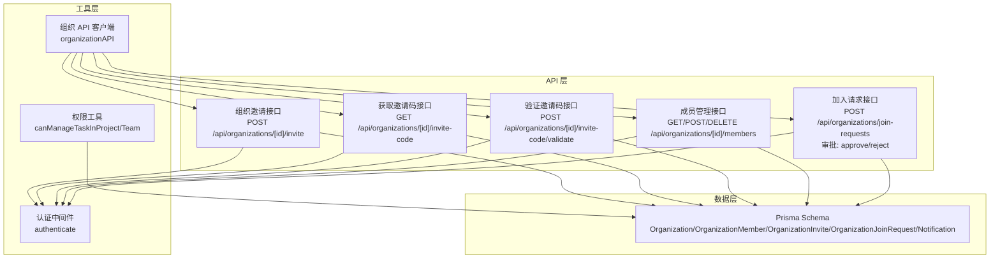
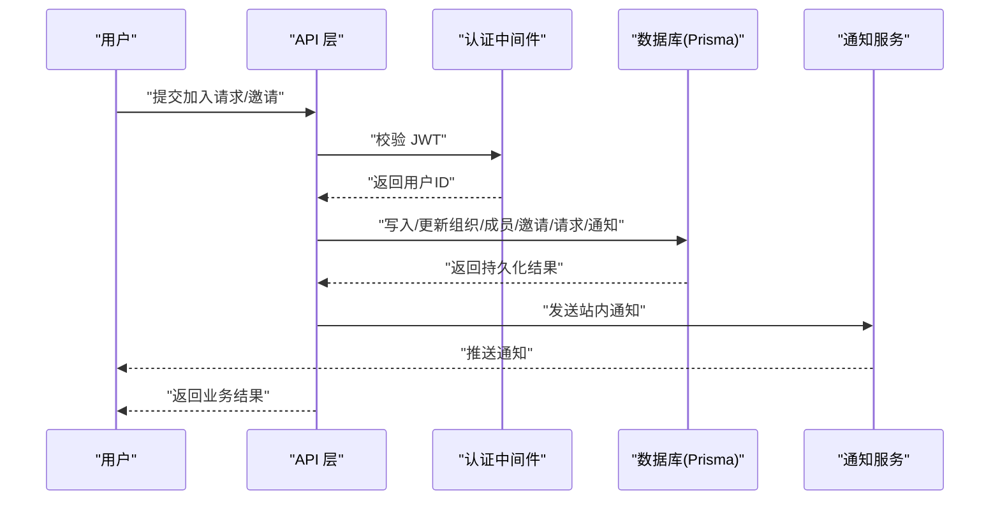
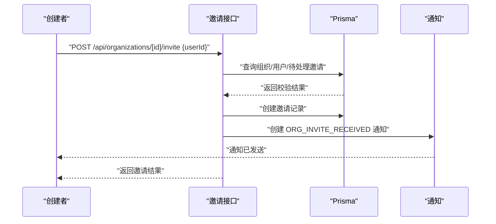
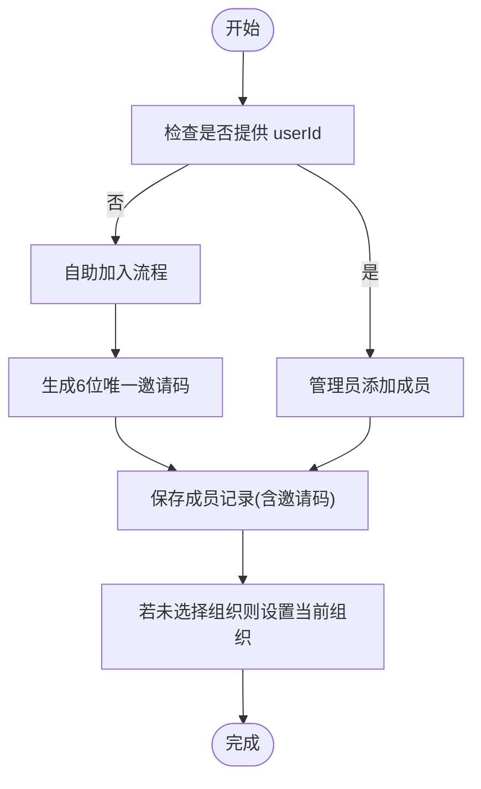
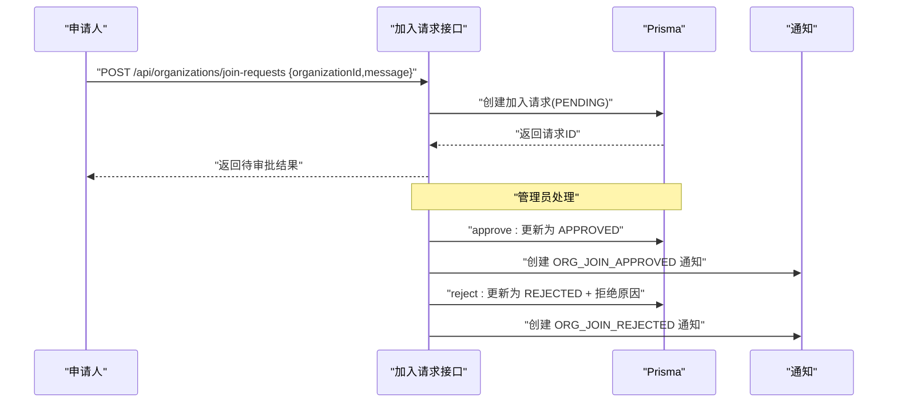
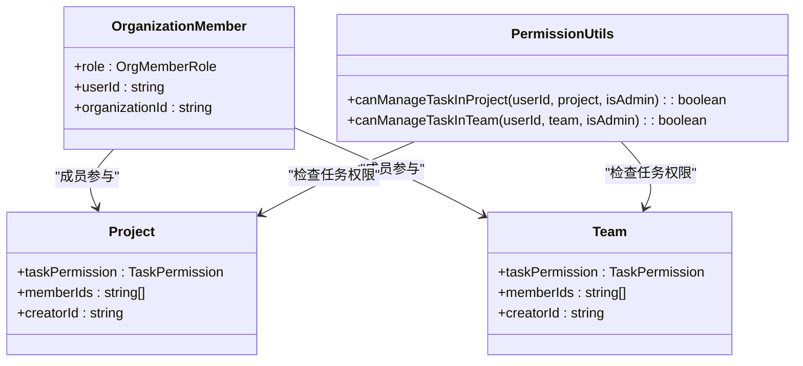
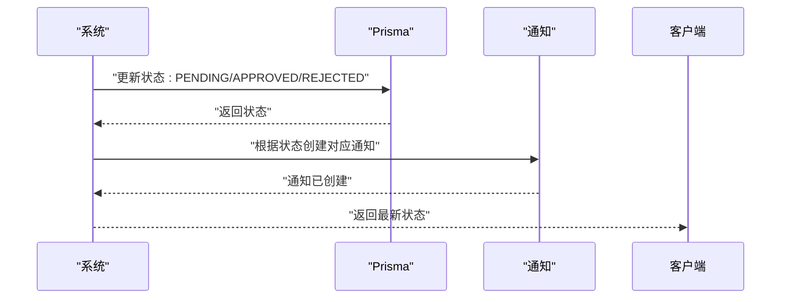
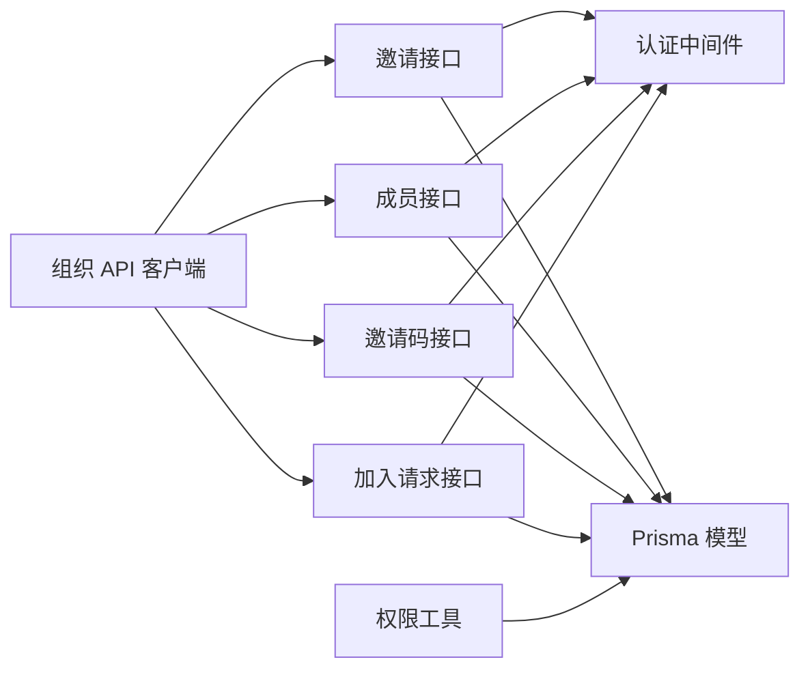

# 协作工作流程

<cite>
**本文引用的文件**
- [app/api/organizations/[id]/invite/route.ts](file://app/api/organizations/[id]/invite/route.ts)
- [app/api/organizations/[id]/invite-code/route.ts](file://app/api/organizations/[id]/invite-code/route.ts)
- [app/api/organizations/[id]/invite-code/validate/route.ts](file://app/api/organizations/[id]/invite-code/validate/route.ts)
- [app/api/organizations/[id]/members/route.ts](file://app/api/organizations/[id]/members/route.ts)
- [app/api/organizations/join-requests/[id]/approve/route.ts](file://app/api/organizations/join-requests/[id]/approve/route.ts)
- [app/api/organizations/join-requests/[id]/reject/route.ts](file://app/api/organizations/join-requests/[id]/reject/route.ts)
- [app/api/organizations/join-requests/route.ts](file://app/api/organizations/join-requests/route.ts)
- [lib/utils/permission-utils.ts](file://lib/utils/permission-utils.ts)
- [lib/api/organization.ts](file://lib/api/organization.ts)
- [lib/middleware.ts](file://lib/middleware.ts)
- [lib/types.ts](file://lib/types.ts)
- [prisma/schema.prisma](file://prisma/schema.prisma)
</cite>

## 目录
1. [引言](#引言)
2. [项目结构](#项目结构)
3. [核心组件](#核心组件)
4. [架构总览](#架构总览)
5. [详细组件分析](#详细组件分析)
6. [依赖分析](#依赖分析)
7. [性能考虑](#性能考虑)
8. [故障排查指南](#故障排查指南)
9. [结论](#结论)
10. [附录](#附录)

## 引言
本文件面向团队协作场景，系统性梳理成员邀请、加入请求与权限审批的完整流程，解释协作权限控制、角色管理与权限继承机制，并给出邀请码生成、验证与使用的安全实现。文档同时覆盖成员管理、团队协作、项目协作的业务逻辑与数据流，以及权限检查、访问控制与安全验证的具体实现；最后提供通知机制、状态同步与冲突解决策略的最佳实践与常见问题解决方案。

## 项目结构
协作相关能力主要分布在以下层次：
- API 层：组织邀请、邀请码、成员管理、加入请求审批等接口
- 工具层：权限工具函数、API 客户端封装
- 数据层：Prisma Schema 定义组织、成员、邀请、加入请求、通知等模型
- 中间件层：认证中间件，统一校验 JWT 并注入用户上下文

图表来源
- [app/api/organizations/[id]/invite/route.ts](file://app/api/organizations/[id]/invite/route.ts#L1-L122)
- [app/api/organizations/[id]/invite-code/route.ts](file://app/api/organizations/[id]/invite-code/route.ts#L1-L54)
- [app/api/organizations/[id]/invite-code/validate/route.ts](file://app/api/organizations/[id]/invite-code/validate/route.ts#L1-L52)
- [app/api/organizations/[id]/members/route.ts](file://app/api/organizations/[id]/members/route.ts#L1-L501)
- [app/api/organizations/join-requests/route.ts](file://app/api/organizations/join-requests/route.ts)
- [lib/utils/permission-utils.ts](file://lib/utils/permission-utils.ts#L1-L72)
- [lib/api/organization.ts](file://lib/api/organization.ts#L1-L221)
- [lib/middleware.ts](file://lib/middleware.ts#L1-L47)
- [prisma/schema.prisma](file://prisma/schema.prisma#L16-L314)

章节来源
- [prisma/schema.prisma](file://prisma/schema.prisma#L16-L314)
- [lib/middleware.ts](file://lib/middleware.ts#L1-L47)
- [lib/utils/permission-utils.ts](file://lib/utils/permission-utils.ts#L1-L72)
- [lib/api/organization.ts](file://lib/api/organization.ts#L1-L221)

## 核心组件
- 组织邀请与成员管理
  - 邀请接口：仅组织创建者可发起邀请，避免重复邀请，发送站内通知
  - 成员接口：支持自助加入（生成邀请码）、管理员添加、移除成员（含事务清理个人事务项目）
- 邀请码体系
  - 生成：6 位字母数字组合，保证唯一性
  - 查询：成员可查询自己的邀请码
  - 验证：校验邀请码是否属于该组织
- 加入请求与审批
  - 提交申请：可选“需要审批”开关
  - 审批流程：同意/拒绝，发送站内通知
- 权限与角色
  - 角色：所有者、管理员、普通成员
  - 权限：项目/团队任务权限分为“所有成员”和“仅创建者”，支持继承判断
- 通知系统
  - 站内通知类型覆盖邀请、加入、移除、任务变更等

章节来源
- [app/api/organizations/[id]/invite/route.ts](file://app/api/organizations/[id]/invite/route.ts#L1-L122)
- [app/api/organizations/[id]/members/route.ts](file://app/api/organizations/[id]/members/route.ts#L1-L501)
- [app/api/organizations/[id]/invite-code/route.ts](file://app/api/organizations/[id]/invite-code/route.ts#L1-L54)
- [app/api/organizations/[id]/invite-code/validate/route.ts](file://app/api/organizations/[id]/invite-code/validate/route.ts#L1-L52)
- [app/api/organizations/join-requests/route.ts](file://app/api/organizations/join-requests/route.ts)
- [lib/utils/permission-utils.ts](file://lib/utils/permission-utils.ts#L1-L72)
- [prisma/schema.prisma](file://prisma/schema.prisma#L16-L314)

## 架构总览
协作流程围绕“邀请/加入—权限—通知—状态同步”展开，前端通过统一 API 客户端调用后端接口，后端通过认证中间件与 Prisma 数据模型完成业务处理与持久化。

图表来源
- [lib/middleware.ts](file://lib/middleware.ts#L10-L39)
- [app/api/organizations/[id]/invite/route.ts](file://app/api/organizations/[id]/invite/route.ts#L18-L46)
- [app/api/organizations/[id]/members/route.ts](file://app/api/organizations/[id]/members/route.ts#L183-L194)
- [app/api/organizations/join-requests/route.ts](file://app/api/organizations/join-requests/route.ts)
- [prisma/schema.prisma](file://prisma/schema.prisma#L221-L254)

## 详细组件分析

### 成员邀请流程
- 触发条件：组织创建者发起邀请
- 关键步骤：
  - 校验组织存在性与邀请人身份
  - 校验被邀请用户存在性
  - 防重复：检查是否存在待处理邀请
  - 写入邀请记录并发送“收到邀请”通知
- 安全要点：
  - 仅创建者可邀请
  - 邀请状态为待处理，防止重复发送
  - 通知携带邀请元数据，便于后续接受/拒绝

图表来源
- [app/api/organizations/[id]/invite/route.ts](file://app/api/organizations/[id]/invite/route.ts#L18-L46)
- [app/api/organizations/[id]/invite/route.ts](file://app/api/organizations/[id]/invite/route.ts#L89-L114)
- [prisma/schema.prisma](file://prisma/schema.prisma#L287-L305)
- [prisma/schema.prisma](file://prisma/schema.prisma#L239-L254)

章节来源
- [app/api/organizations/[id]/invite/route.ts](file://app/api/organizations/[id]/invite/route.ts#L1-L122)

### 自助加入与邀请码
- 自助加入：
  - 无 userId 时，当前用户自助加入
  - 生成唯一邀请码并写入成员记录
  - 若用户未选择组织，则自动设置当前组织
- 邀请码查询与验证：
  - 成员查询：仅成员可查询自己的邀请码
  - 验证：校验邀请码是否属于该组织，返回邀请发起人信息

图表来源
- [app/api/organizations/[id]/members/route.ts](file://app/api/organizations/[id]/members/route.ts#L98-L179)
- [app/api/organizations/[id]/members/route.ts](file://app/api/organizations/[id]/members/route.ts#L219-L260)
- [app/api/organizations/[id]/invite-code/route.ts](file://app/api/organizations/[id]/invite-code/route.ts#L25-L44)
- [app/api/organizations/[id]/invite-code/validate/route.ts](file://app/api/organizations/[id]/invite-code/validate/route.ts#L23-L41)

章节来源
- [app/api/organizations/[id]/members/route.ts](file://app/api/organizations/[id]/members/route.ts#L1-L501)
- [app/api/organizations/[id]/invite-code/route.ts](file://app/api/organizations/[id]/invite-code/route.ts#L1-L54)
- [app/api/organizations/[id]/invite-code/validate/route.ts](file://app/api/organizations/[id]/invite-code/validate/route.ts#L1-L52)

### 加入请求与审批
- 提交申请：可携带消息，记录申请人与组织
- 审批流程：
  - 同意：更新状态为已批准，发送“加入已批准”通知
  - 拒绝：记录拒绝原因，发送“加入被拒绝”通知
- 审批权限：通常由管理员或具备相应权限的成员处理

图表来源
- [app/api/organizations/join-requests/route.ts](file://app/api/organizations/join-requests/route.ts)
- [app/api/organizations/join-requests/[id]/approve/route.ts](file://app/api/organizations/join-requests/[id]/approve/route.ts)
- [app/api/organizations/join-requests/[id]/reject/route.ts](file://app/api/organizations/join-requests/[id]/reject/route.ts)
- [prisma/schema.prisma](file://prisma/schema.prisma#L256-L285)
- [prisma/schema.prisma](file://prisma/schema.prisma#L239-L254)

章节来源
- [app/api/organizations/join-requests/route.ts](file://app/api/organizations/join-requests/route.ts)
- [app/api/organizations/join-requests/[id]/approve/route.ts](file://app/api/organizations/join-requests/[id]/approve/route.ts)
- [app/api/organizations/join-requests/[id]/reject/route.ts](file://app/api/organizations/join-requests/[id]/reject/route.ts)

### 权限控制与角色管理
- 角色层级：所有者 > 管理员 > 普通成员
- 项目/团队任务权限：
  - ALL_MEMBERS：所有成员可管理任务
  - CREATOR_ONLY：仅创建者可管理任务
- 权限继承：成员在项目/团队内的成员身份决定其任务操作权限
- 超级管理员：拥有最高权限，绕过常规限制

图表来源
- [lib/utils/permission-utils.ts](file://lib/utils/permission-utils.ts#L11-L59)
- [lib/types.ts](file://lib/types.ts#L3-L5)
- [lib/types.ts](file://lib/types.ts#L84-L106)
- [lib/types.ts](file://lib/types.ts#L108-L120)
- [prisma/schema.prisma](file://prisma/schema.prisma#L118-L136)
- [prisma/schema.prisma](file://prisma/schema.prisma#L98-L116)

章节来源
- [lib/utils/permission-utils.ts](file://lib/utils/permission-utils.ts#L1-L72)
- [lib/types.ts](file://lib/types.ts#L1-L141)
- [prisma/schema.prisma](file://prisma/schema.prisma#L118-L136)
- [prisma/schema.prisma](file://prisma/schema.prisma#L98-L116)

### 通知机制与状态同步
- 通知类型覆盖：邀请、加入、移除、任务变更等
- 状态同步：审批/邀请状态变更后，通过通知与数据库状态保持一致
- 冲突处理：重复邀请、重复加入请求、成员移除时的事务一致性

图表来源
- [prisma/schema.prisma](file://prisma/schema.prisma#L239-L254)
- [app/api/organizations/[id]/members/route.ts](file://app/api/organizations/[id]/members/route.ts#L466-L492)
- [app/api/organizations/[id]/invite/route.ts](file://app/api/organizations/[id]/invite/route.ts#L99-L114)

章节来源
- [prisma/schema.prisma](file://prisma/schema.prisma#L221-L254)
- [app/api/organizations/[id]/members/route.ts](file://app/api/organizations/[id]/members/route.ts#L466-L492)
- [app/api/organizations/[id]/invite/route.ts](file://app/api/organizations/[id]/invite/route.ts#L99-L114)

## 依赖分析
- 组件耦合
  - API 层依赖认证中间件与 Prisma 数据模型
  - 权限工具函数独立于具体接口，便于复用
  - API 客户端封装统一调用入口，降低前端复杂度
- 外部依赖
  - JWT 认证与解码
  - PostgreSQL 数据库（通过 Prisma）

图表来源
- [lib/middleware.ts](file://lib/middleware.ts#L10-L39)
- [lib/api/organization.ts](file://lib/api/organization.ts#L84-L221)
- [prisma/schema.prisma](file://prisma/schema.prisma#L16-L314)

章节来源
- [lib/middleware.ts](file://lib/middleware.ts#L1-L47)
- [lib/api/organization.ts](file://lib/api/organization.ts#L1-L221)
- [prisma/schema.prisma](file://prisma/schema.prisma#L16-L314)

## 性能考虑
- 查询优化
  - 成员列表按角色与加入时间排序，减少前端二次排序成本
  - 邀请码查询走唯一索引，避免全表扫描
- 事务保障
  - 成员移除时使用事务，确保个人事务项目与成员关系一致性
- 缓存建议
  - 对高频读取的成员列表与通知计数可引入缓存层（建议）
- 分页与过滤
  - 大列表建议增加分页参数（建议）

## 故障排查指南
- 401 未授权
  - 检查 Authorization 头是否正确传递 JWT
  - 校验 Token 是否过期或格式错误
- 403 禁止访问
  - 非组织创建者尝试邀请
  - 非管理员尝试添加/移除成员
- 404 资源不存在
  - 组织/用户/邀请码不存在
  - 成员移除时目标成员不存在
- 409 冲突
  - 已存在待处理邀请或已是成员
- 通知未送达
  - 检查通知类型与接收用户是否正确
  - 核对数据库通知记录状态

章节来源
- [lib/middleware.ts](file://lib/middleware.ts#L22-L38)
- [app/api/organizations/[id]/invite/route.ts](file://app/api/organizations/[id]/invite/route.ts#L43-L46)
- [app/api/organizations/[id]/members/route.ts](file://app/api/organizations/[id]/members/route.ts#L192-L194)
- [app/api/organizations/[id]/invite-code/validate/route.ts](file://app/api/organizations/[id]/invite-code/validate/route.ts#L39-L41)

## 结论
本协作工作流程以“邀请/加入—权限—通知—状态同步”为主线，结合角色与权限继承机制，提供了从成员邀请、自助加入、邀请码验证到加入请求审批的完整闭环。通过认证中间件与 Prisma 数据模型，系统实现了强一致的状态管理与丰富的通知能力。建议在生产环境中进一步引入缓存、分页与审计日志，持续提升性能与可观测性。

## 附录
- 最佳实践
  - 严格遵循“最小权限原则”，默认使用“仅创建者”权限，必要时再开放为“所有成员”
  - 邀请码定期轮换与失效策略（建议）
  - 加入请求“需要审批”开关按组织策略启用
  - 通知模板标准化，便于国际化与合规审计
- 常见问题
  - 邀请码为空：确认成员已成功生成邀请码
  - 重复邀请：检查是否存在待处理邀请
  - 成员无法退出：所有者不可直接退出，需转让或删除组织