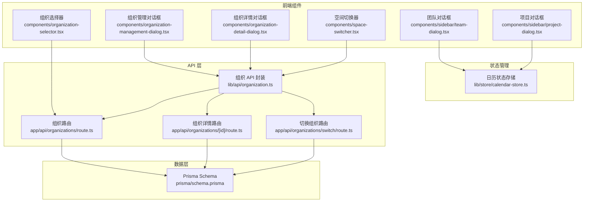
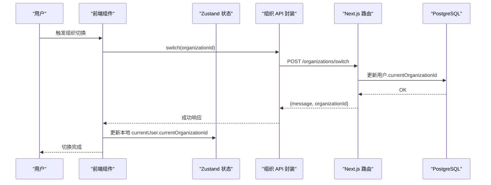
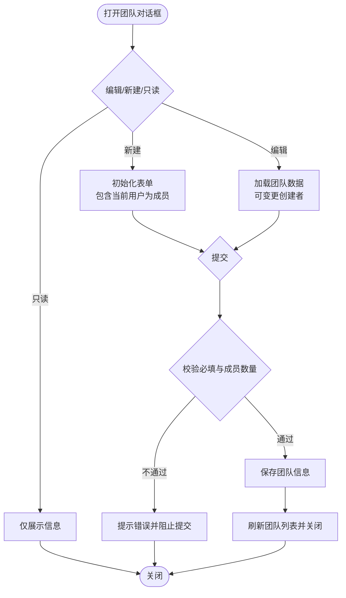
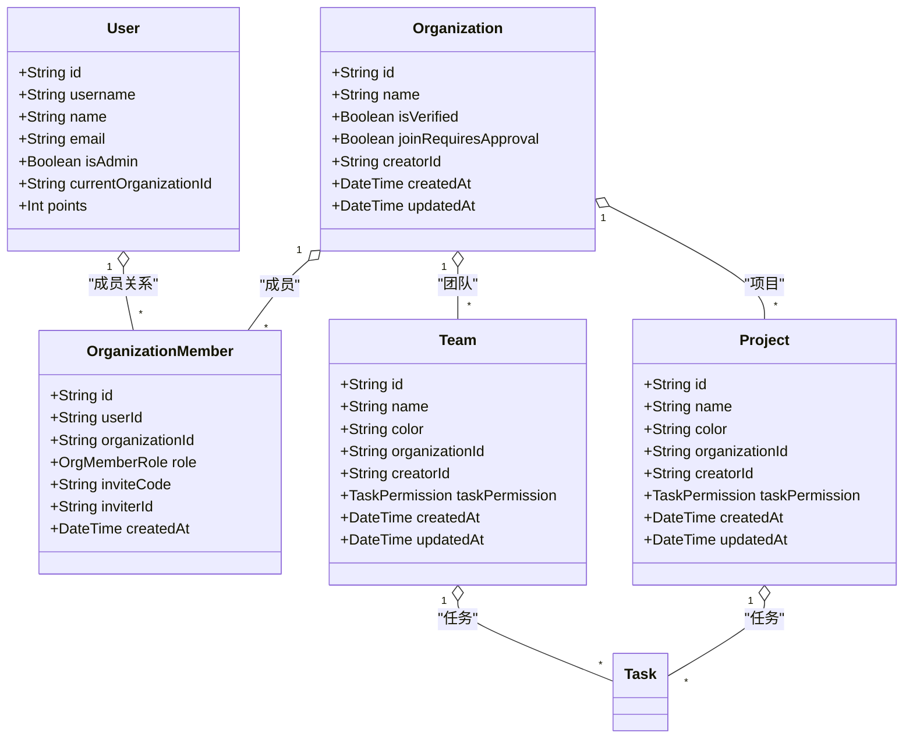

# 团队协作系统

<cite>
**本文档引用的文件**
- [components/sidebar/team-dialog.tsx](file://components/sidebar/team-dialog.tsx)
- [components/sidebar/project-dialog.tsx](file://components/sidebar/project-dialog.tsx)
- [components/organization-selector.tsx](file://components/organization-selector.tsx)
- [components/organization-management-dialog.tsx](file://components/organization-management-dialog.tsx)
- [components/organization-detail-dialog.tsx](file://components/organization-detail-dialog.tsx)
- [components/space-switcher.tsx](file://components/space-switcher.tsx)
- [lib/api/organization.ts](file://lib/api/organization.ts)
- [lib/store/calendar-store.ts](file://lib/store/calendar-store.ts)
- [lib/types.ts](file://lib/types.ts)
- [lib/utils/permission-utils.ts](file://lib/utils/permission-utils.ts)
- [app/api/organizations/route.ts](file://app/api/organizations/route.ts)
- [app/api/organizations/[id]/route.ts](file://app/api/organizations/[id]/route.ts)
- [app/api/organizations/switch/route.ts](file://app/api/organizations/switch/route.ts)
- [prisma/schema.prisma](file://prisma/schema.prisma)
</cite>

## 目录
1. [简介](#简介)
2. [项目结构](#项目结构)
3. [核心组件](#核心组件)
4. [架构总览](#架构总览)
5. [详细组件分析](#详细组件分析)
6. [依赖关系分析](#依赖关系分析)
7. [性能考虑](#性能考虑)
8. [故障排除指南](#故障排除指南)
9. [结论](#结论)
10. [附录](#附录)

## 简介
本系统围绕“多组织空间”构建，提供团队与项目管理、成员邀请与加入审批、权限与协作规则控制、以及空间切换等核心能力。前端采用 React + Zustand 状态管理，后端基于 Next.js API 路由与 Prisma ORM，数据库为 PostgreSQL。系统通过组织（Organization）作为最高层级的业务隔离单元，团队（Team）与项目（Project）在组织内进行资源与权限划分。

## 项目结构
- 前端组件层：负责用户交互与视图渲染，如团队/项目对话框、组织选择器、空间切换器、组织管理与详情对话框等。
- 状态管理层：Zustand store 统一管理任务、团队、项目、用户及视图状态，并提供权限校验与数据刷新逻辑。
- API 层：Next.js API 路由封装组织、团队、项目、成员、邀请码、加入请求等接口。
- 数据层：Prisma 定义组织、成员、团队、项目、任务等模型，建立角色与权限约束。

图表来源
- [components/sidebar/team-dialog.tsx](file://components/sidebar/team-dialog.tsx#L1-L241)
- [components/sidebar/project-dialog.tsx](file://components/sidebar/project-dialog.tsx#L1-L243)
- [components/organization-selector.tsx](file://components/organization-selector.tsx#L1-L210)
- [components/organization-management-dialog.tsx](file://components/organization-management-dialog.tsx#L1-L846)
- [components/organization-detail-dialog.tsx](file://components/organization-detail-dialog.tsx#L1-L510)
- [components/space-switcher.tsx](file://components/space-switcher.tsx#L1-L212)
- [lib/api/organization.ts](file://lib/api/organization.ts#L1-L221)
- [lib/store/calendar-store.ts](file://lib/store/calendar-store.ts#L1-L1457)
- [app/api/organizations/route.ts](file://app/api/organizations/route.ts#L1-L204)
- [app/api/organizations/[id]/route.ts](file://app/api/organizations/[id]/route.ts#L1-L212)
- [app/api/organizations/switch/route.ts](file://app/api/organizations/switch/route.ts#L1-L48)
- [prisma/schema.prisma](file://prisma/schema.prisma#L1-L314)

章节来源
- [lib/store/calendar-store.ts](file://lib/store/calendar-store.ts#L1-L1457)
- [lib/api/organization.ts](file://lib/api/organization.ts#L1-L221)
- [prisma/schema.prisma](file://prisma/schema.prisma#L1-L314)

## 核心组件
- 团队对话框：支持新建/编辑团队，设置颜色、成员、创建者与任务协同权限；提供只读模式。
- 项目对话框：支持新建/编辑项目，设置颜色、成员、创建者与任务协同权限；提供只读模式。
- 组织选择器：提供组织搜索与选择，支持新组织检测与状态提示。
- 组织管理对话框：支持创建/编辑组织、申请加入、删除组织、退出组织、复制邀请码、查看统计信息。
- 组织详情对话框：展示成员、团队、项目列表，支持删除成员/团队/项目与创建子实体。
- 空间切换器：列出用户所属组织，支持切换当前组织并重置导航状态。

章节来源
- [components/sidebar/team-dialog.tsx](file://components/sidebar/team-dialog.tsx#L1-L241)
- [components/sidebar/project-dialog.tsx](file://components/sidebar/project-dialog.tsx#L1-L243)
- [components/organization-selector.tsx](file://components/organization-selector.tsx#L1-L210)
- [components/organization-management-dialog.tsx](file://components/organization-management-dialog.tsx#L1-L846)
- [components/organization-detail-dialog.tsx](file://components/organization-detail-dialog.tsx#L1-L510)
- [components/space-switcher.tsx](file://components/space-switcher.tsx#L1-L212)

## 架构总览
系统采用前后端分离的 API 设计，前端通过封装的 organizationAPI 调用后端 Next.js 路由，后端使用 Prisma 访问 PostgreSQL。权限控制贯穿前端与后端，前端通过 canManageTaskInProject/canManageTaskInTeam 进行 UI 层权限判断，后端在组织/团队/项目路由中进行角色与成员校验。

图表来源
- [components/space-switcher.tsx](file://components/space-switcher.tsx#L99-L154)
- [lib/api/organization.ts](file://lib/api/organization.ts#L120-L125)
- [app/api/organizations/switch/route.ts](file://app/api/organizations/switch/route.ts#L6-L47)

## 详细组件分析

### 团队对话框
- 功能要点
  - 表单字段：名称、描述、颜色、创建者、成员、任务协同权限。
  - 成员选择：UserMultiSelector，支持锁定创建者或查看模式锁定全部成员。
  - 协同权限：ALL_MEMBERS 或 CREATOR_ONLY，影响任务管理权限。
  - 提交逻辑：新建时自动包含当前用户为成员；编辑时可变更创建者（需权限）。
- 权限与协作
  - 通过 canManageTaskInTeam 在前端进行权限判断，后端在团队相关路由中进行成员与角色校验。
- UI/UX
  - 支持只读模式，适合预览场景；提供颜色预设与权限说明。

图表来源
- [components/sidebar/team-dialog.tsx](file://components/sidebar/team-dialog.tsx#L38-L96)
- [lib/utils/permission-utils.ts](file://lib/utils/permission-utils.ts#L40-L59)

章节来源
- [components/sidebar/team-dialog.tsx](file://components/sidebar/team-dialog.tsx#L1-L241)
- [lib/utils/permission-utils.ts](file://lib/utils/permission-utils.ts#L1-L72)

### 项目对话框
- 功能要点
  - 表单字段：名称、描述、颜色、创建者、成员、任务协同权限。
  - 成员选择：UserMultiSelector，支持锁定创建者或查看模式锁定全部成员。
  - 协同权限：ALL_MEMBERS 或 CREATOR_ONLY。
  - 提交逻辑：新建时自动包含当前用户为成员；编辑时可变更创建者（需权限）。
- 权限与协作
  - 通过 canManageTaskInProject 在前端进行权限判断，后端在项目相关路由中进行成员与角色校验。

章节来源
- [components/sidebar/project-dialog.tsx](file://components/sidebar/project-dialog.tsx#L1-L243)
- [lib/utils/permission-utils.ts](file://lib/utils/permission-utils.ts#L11-L30)

### 组织选择器
- 功能要点
  - 搜索：防抖 500ms，支持模糊匹配与精确匹配检测。
  - 状态提示：已存在/未注册提示，支持新组织检测。
  - 交互：点击外部关闭下拉框，支持清空选择。
- 集成点
  - 与后端 /api/organizations?search= 查询配合，无需认证即可搜索公开组织。

章节来源
- [components/organization-selector.tsx](file://components/organization-selector.tsx#L1-L210)
- [app/api/organizations/route.ts](file://app/api/organizations/route.ts#L12-L36)

### 组织管理对话框
- 功能要点
  - 列表：展示组织名称、认证状态、角色、成员/团队/项目数量、当前空间标记。
  - 操作：编辑、删除、退出、复制邀请码、查看详情。
  - 创建：支持创建新空间或申请加入已有空间；支持搜索与提示。
  - 审批：开启加入需要审批开关。
- 数据流
  - 通过 organizationAPI.getAll 获取组织列表并批量获取邀请码。
  - 删除与退出均进行名称确认与权限校验。

章节来源
- [components/organization-management-dialog.tsx](file://components/organization-management-dialog.tsx#L1-L846)
- [lib/api/organization.ts](file://lib/api/organization.ts#L84-L125)

### 组织详情对话框
- 功能要点
  - 成员：展示角色徽章、邀请人信息；所有者可移除成员。
  - 团队：展示颜色与成员数；所有者可删除团队。
  - 项目：区分普通项目与“个人事务”项目；所有者可删除项目。
  - 操作：支持添加成员、创建团队、创建项目。
- 权限控制
  - 仅组织所有者可见删除按钮并可执行删除操作。

章节来源
- [components/organization-detail-dialog.tsx](file://components/organization-detail-dialog.tsx#L1-L510)
- [lib/api/organization.ts](file://lib/api/organization.ts#L127-L180)

### 空间切换器
- 功能要点
  - 自动选择策略：若用户未选择组织，自动选择第一个组织并同步至后端与本地存储。
  - 切换流程：调用 /organizations/switch，更新用户当前组织，重置导航状态并刷新页面。
- 安全性
  - 切换前验证用户是否为组织成员，防止越权切换。

章节来源
- [components/space-switcher.tsx](file://components/space-switcher.tsx#L1-L212)
- [app/api/organizations/switch/route.ts](file://app/api/organizations/switch/route.ts#L6-L47)

## 依赖关系分析
- 前端依赖
  - 组件依赖 Zustand store 获取用户、团队、项目数据与导航状态。
  - 组件通过 organizationAPI 调用 Next.js 路由，实现组织管理与详情查询。
- 后端依赖
  - Next.js 路由依赖 Prisma 访问数据库，进行组织、成员、团队、项目、任务等数据操作。
  - 路由中进行鉴权与角色校验，确保操作合法性。
- 数据模型
  - 组织、成员、团队、项目、任务模型定义清晰，角色枚举与任务权限枚举明确。

图表来源
- [prisma/schema.prisma](file://prisma/schema.prisma#L16-L200)
- [lib/types.ts](file://lib/types.ts#L43-L120)

章节来源
- [prisma/schema.prisma](file://prisma/schema.prisma#L1-L314)
- [lib/types.ts](file://lib/types.ts#L1-L141)

## 性能考虑
- 前端
  - 使用防抖搜索减少请求频率；对话框与详情页采用懒加载与分页容器，避免一次性渲染大量数据。
  - Zustand store 使用持久化与最小化状态更新，降低重渲染成本。
- 后端
  - 组织列表查询使用索引字段（用户ID、组织ID、邀请码），提升查询效率。
  - 批量获取邀请码与并发加载组织详情，减少往返次数。
- 数据库
  - 关键字段建立索引（如组织名称、成员唯一索引、邀请码唯一索引），优化查询与去重。

## 故障排除指南
- 组织切换失败
  - 检查用户是否为组织成员；确认后端 /organizations/switch 返回的错误信息。
  - 前端切换器在失败时弹出 Toast 并提示网络错误。
- 权限不足
  - 前端 canManageTaskInProject/canManageTaskInTeam 返回权限不足提示；后端路由中也会进行角色校验并返回 403。
- 组织删除失败
  - 仅组织所有者可删除；当前所在组织不可删除；后端会返回相应错误信息。
- 邀请码复制失败
  - 确认邀请码已加载；若未加载，提示稍后再试。

章节来源
- [components/space-switcher.tsx](file://components/space-switcher.tsx#L143-L151)
- [lib/utils/permission-utils.ts](file://lib/utils/permission-utils.ts#L66-L71)
- [app/api/organizations/[id]/route.ts](file://app/api/organizations/[id]/route.ts#L192-L199)
- [components/organization-management-dialog.tsx](file://components/organization-management-dialog.tsx#L367-L402)

## 结论
本系统通过“组织”作为多租户隔离边界，结合“团队/项目”的协作权限模型，实现了灵活的多组织协作能力。前端组件与状态管理清晰解耦，后端路由与数据库模型严格约束权限与数据一致性。建议在生产环境中进一步完善审计日志、批量导入导出与更细粒度的角色权限扩展。

## 附录

### 权限控制与协作规则
- 角色与权限
  - 组织成员角色：OWNER（所有者）、ADMIN（管理员）、MEMBER（成员）。
  - 任务协同权限：ALL_MEMBERS（所有成员）或 CREATOR_ONLY（仅创建者）。
- 前端权限判断
  - canManageTaskInProject / canManageTaskInTeam 根据成员身份与权限设置返回布尔值。
- 后端权限校验
  - 组织路由中校验用户是否为组织成员与角色；团队/项目路由中校验成员与创建者。

章节来源
- [lib/utils/permission-utils.ts](file://lib/utils/permission-utils.ts#L1-L72)
- [lib/types.ts](file://lib/types.ts#L3-L5)
- [app/api/organizations/[id]/route.ts](file://app/api/organizations/[id]/route.ts#L121-L133)

### API 接口概览
- 组织管理
  - GET /api/organizations - 获取用户所属组织列表（支持搜索）
  - POST /api/organizations - 创建组织
  - GET /api/organizations/[id] - 获取组织详情
  - PUT /api/organizations/[id] - 更新组织（名称、描述、加入审批开关）
  - DELETE /api/organizations/[id] - 删除组织（仅所有者）
  - POST /api/organizations/switch - 切换当前组织
- 成员与邀请
  - GET /api/organizations/[id]/members - 获取成员列表
  - POST /api/organizations/[id]/members - 添加成员
  - DELETE /api/organizations/[id]/members?userId=... - 移除成员
  - GET /api/organizations/[id]/invite-code - 获取邀请码
  - POST /api/organizations/[id]/invite-code/validate - 验证邀请码

章节来源
- [lib/api/organization.ts](file://lib/api/organization.ts#L84-L221)
- [app/api/organizations/route.ts](file://app/api/organizations/route.ts#L12-L204)
- [app/api/organizations/[id]/route.ts](file://app/api/organizations/[id]/route.ts#L6-L163)
- [app/api/organizations/switch/route.ts](file://app/api/organizations/switch/route.ts#L6-L47)