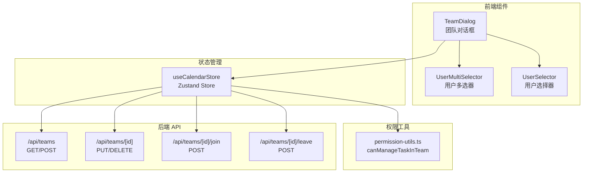
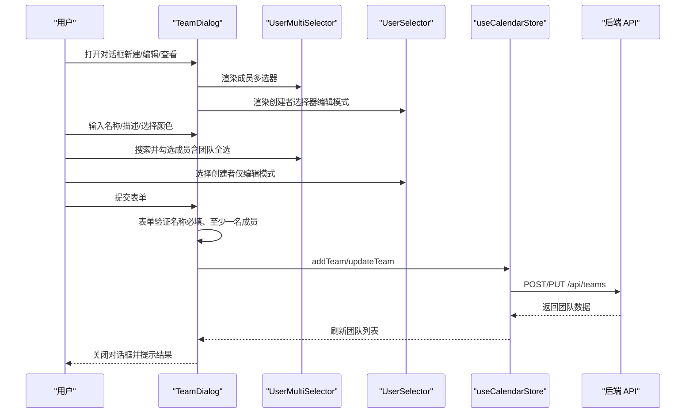
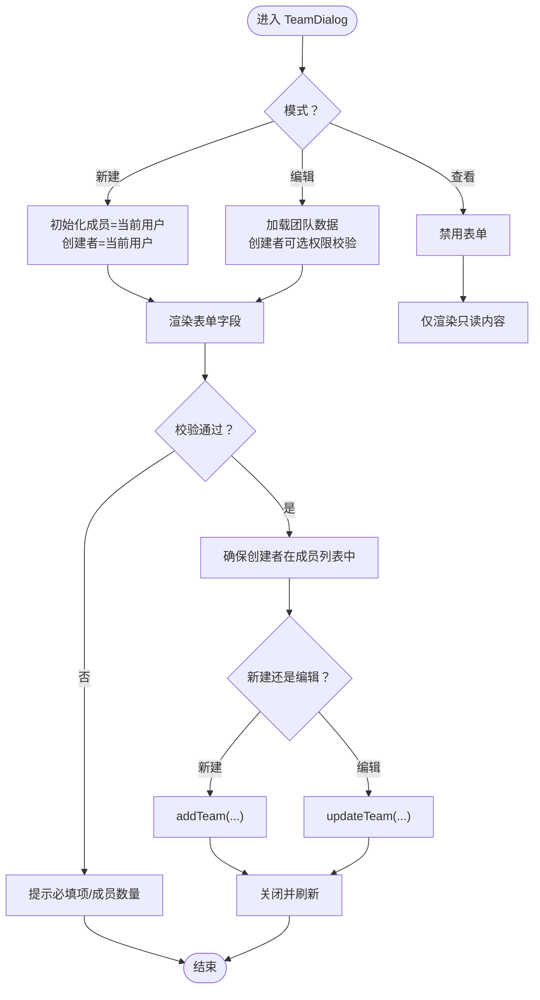
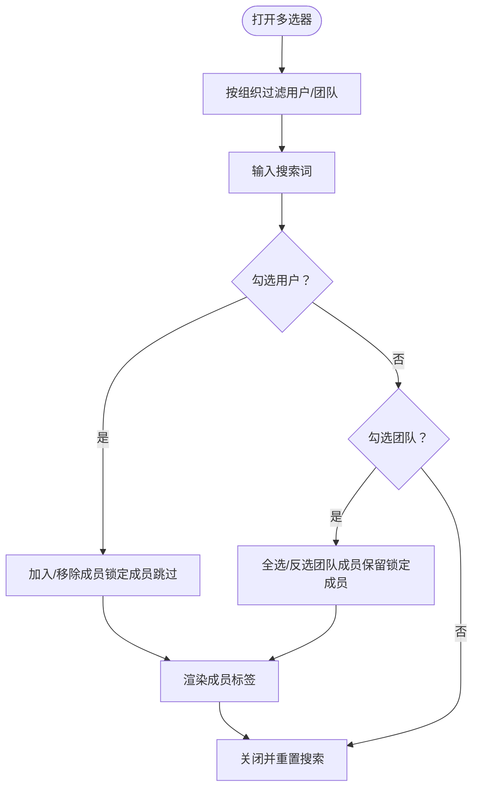
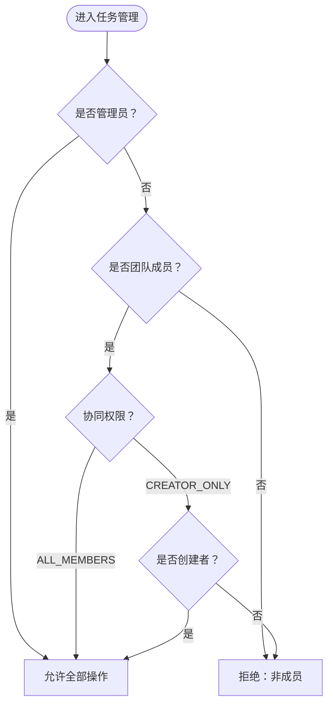
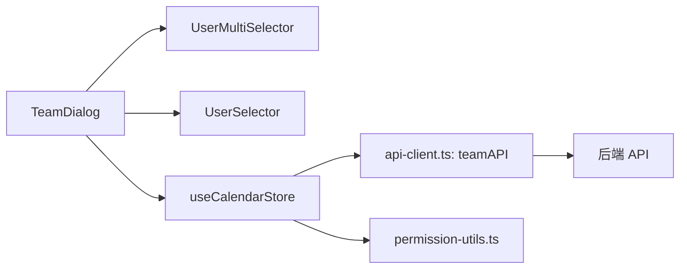

# 团队管理

<cite>
**本文引用的文件**
- [components/sidebar/team-dialog.tsx](file://components/sidebar/team-dialog.tsx)
- [components/task/user-multi-selector.tsx](file://components/task/user-multi-selector.tsx)
- [components/task/user-selector.tsx](file://components/task/user-selector.tsx)
- [lib/types.ts](file://lib/types.ts)
- [lib/store/calendar-store.ts](file://lib/store/calendar-store.ts)
- [lib/utils/permission-utils.ts](file://lib/utils/permission-utils.ts)
- [lib/api-client.ts](file://lib/api-client.ts)
- [app/api/teams/route.ts](file://app/api/teams/route.ts)
- [app/api/teams/[id]/route.ts](file://app/api/teams/[id]/route.ts)
- [app/api/teams/[id]/leave/route.ts](file://app/api/teams/[id]/leave/route.ts)
- [app/api/teams/[id]/join/route.ts](file://app/api/teams/[id]/join/route.ts)
</cite>

## 目录
1. [简介](#简介)
2. [项目结构](#项目结构)
3. [核心组件](#核心组件)
4. [架构总览](#架构总览)
5. [组件详解](#组件详解)
6. [依赖关系分析](#依赖关系分析)
7. [性能与可用性](#性能与可用性)
8. [故障排查指南](#故障排查指南)
9. [结论](#结论)

## 简介
本文件面向团队管理系统中的“团队对话框”组件，系统性阐述其设计与实现，覆盖团队创建、编辑、查看模式的完整流程；详细说明团队颜色选择器、成员管理、权限设置（ALL_MEMBERS、CREATOR_ONLY）；解释团队成员选择器与用户多选器的交互逻辑；梳理表单验证、状态管理与用户交互；并结合后端 API 与权限工具，阐明团队数据模型、权限继承机制与用户角色管理。

## 项目结构
团队管理涉及前端组件与后端 API 的协同：
- 前端组件层：团队对话框、成员选择器、用户多选器
- 状态管理层：Zustand 状态存储，封装团队 CRUD、离开、加入等动作
- 权限工具层：基于项目/团队的协同权限判断
- 后端 API 层：团队的增删改查、加入/退出团队、创建者变更校验

图表来源
- [components/sidebar/team-dialog.tsx](file://components/sidebar/team-dialog.tsx#L38-L241)
- [components/task/user-multi-selector.tsx](file://components/task/user-multi-selector.tsx#L26-L290)
- [components/task/user-selector.tsx](file://components/task/user-selector.tsx#L25-L147)
- [lib/store/calendar-store.ts](file://lib/store/calendar-store.ts#L890-L952)
- [lib/utils/permission-utils.ts](file://lib/utils/permission-utils.ts#L40-L59)
- [app/api/teams/route.ts](file://app/api/teams/route.ts#L6-L117)
- [app/api/teams/[id]/route.ts](file://app/api/teams/[id]/route.ts#L14-L135)
- [app/api/teams/[id]/join/route.ts](file://app/api/teams/[id]/join/route.ts#L15-L103)
- [app/api/teams/[id]/leave/route.ts](file://app/api/teams/[id]/leave/route.ts#L12-L93)

章节来源
- [components/sidebar/team-dialog.tsx](file://components/sidebar/team-dialog.tsx#L38-L241)
- [lib/store/calendar-store.ts](file://lib/store/calendar-store.ts#L890-L952)

## 核心组件
- 团队对话框 TeamDialog：统一承载新建/编辑/查看三种模式，负责表单渲染、验证与提交；集成颜色选择器、成员多选器、权限单选组。
- 用户多选器 UserMultiSelector：支持按团队或按用户维度批量选择成员，内置搜索与锁定机制（如创建者不可移除）。
- 用户选择器 UserSelector：单选创建者，支持搜索与过滤。
- 状态存储 useCalendarStore：封装 addTeam/updateTeam/deleteTeam/leaveTeam 等团队操作，并与 API 客户端协作。
- 权限工具 permission-utils：提供 canManageTaskInTeam 判断，决定用户在团队视图中对任务的管理权限。
- 后端 API：提供团队的查询、创建、更新、删除、加入/退出等接口。

章节来源
- [components/sidebar/team-dialog.tsx](file://components/sidebar/team-dialog.tsx#L38-L241)
- [components/task/user-multi-selector.tsx](file://components/task/user-multi-selector.tsx#L26-L290)
- [components/task/user-selector.tsx](file://components/task/user-selector.tsx#L25-L147)
- [lib/store/calendar-store.ts](file://lib/store/calendar-store.ts#L890-L952)
- [lib/utils/permission-utils.ts](file://lib/utils/permission-utils.ts#L40-L59)
- [app/api/teams/route.ts](file://app/api/teams/route.ts#L6-L117)
- [app/api/teams/[id]/route.ts](file://app/api/teams/[id]/route.ts#L14-L135)

## 架构总览
团队对话框作为入口，串联前端组件、状态管理与后端 API。其交互流程如下：

图表来源
- [components/sidebar/team-dialog.tsx](file://components/sidebar/team-dialog.tsx#L60-L96)
- [components/task/user-multi-selector.tsx](file://components/task/user-multi-selector.tsx#L60-L91)
- [components/task/user-selector.tsx](file://components/task/user-selector.tsx#L112-L139)
- [lib/store/calendar-store.ts](file://lib/store/calendar-store.ts#L890-L920)
- [app/api/teams/route.ts](file://app/api/teams/route.ts#L119-L233)

## 组件详解

### 团队对话框 TeamDialog
- 模式支持
  - 新建：初始化成员包含当前用户，创建者默认为当前用户。
  - 编辑：展示查看/编辑两种子模式；编辑模式下可变更创建者（需具备相应权限）。
  - 查看：禁用表单项，仅展示只读信息。
- 表单字段
  - 名称：必填校验。
  - 描述：可选。
  - 颜色：预设颜色集合，点击切换当前颜色。
  - 创建者：编辑模式可见，支持选择；若非创建者或非管理员则禁用。
  - 成员：使用用户多选器，支持团队级全选/反选；查看模式锁定全部成员，编辑模式锁定创建者。
  - 协同权限：ALL_MEMBERS 或 CREATOR_ONLY 二选一。
- 提交逻辑
  - 校验名称非空与至少一名成员。
  - 确保创建者始终在成员列表中（若未包含则自动追加）。
  - 新建：调用 addTeam；编辑：调用 updateTeam。
  - 关闭回调：新建/编辑成功后关闭对话框并触发上层刷新。

图表来源
- [components/sidebar/team-dialog.tsx](file://components/sidebar/team-dialog.tsx#L38-L96)

章节来源
- [components/sidebar/team-dialog.tsx](file://components/sidebar/team-dialog.tsx#L38-L241)

### 颜色选择器
- 预设颜色数组固定，渲染为一组圆形按钮，点击切换当前颜色。
- 当前选中颜色通过边框与阴影高亮显示。
- 查看模式禁用颜色选择。

章节来源
- [components/sidebar/team-dialog.tsx](file://components/sidebar/team-dialog.tsx#L26-L36)
- [components/sidebar/team-dialog.tsx](file://components/sidebar/team-dialog.tsx#L140-L160)

### 成员管理与用户多选器 UserMultiSelector
- 数据来源
  - 当前组织下的用户与团队列表（按当前用户所在组织过滤）。
- 搜索与过滤
  - 支持按团队名或成员姓名/用户名搜索。
- 交互行为
  - 勾选用户：加入/移除成员（锁定成员不可移除）。
  - 勾选团队：一次性全选/反选该团队所有成员（锁定成员除外）。
  - 成员标签：显示头像与名称，可移除（非锁定成员）。
- 锁定策略
  - 查看模式：锁定全部成员。
  - 编辑模式：锁定创建者（不可移除）。
- 创建者标识
  - 在成员列表中为创建者显示标签。

图表来源
- [components/task/user-multi-selector.tsx](file://components/task/user-multi-selector.tsx#L26-L108)
- [components/task/user-multi-selector.tsx](file://components/task/user-multi-selector.tsx#L182-L285)

章节来源
- [components/task/user-multi-selector.tsx](file://components/task/user-multi-selector.tsx#L26-L290)

### 用户选择器 UserSelector（创建者）
- 作用：在编辑模式下选择团队创建者。
- 过滤：可选参数支持限定候选用户集合。
- 搜索：按姓名/用户名过滤。
- 禁用：当非创建者或非管理员时禁用。

章节来源
- [components/task/user-selector.tsx](file://components/task/user-selector.tsx#L18-L56)
- [components/task/user-selector.tsx](file://components/task/user-selector.tsx#L112-L139)

### 权限设置与权限控制
- 协同权限枚举：ALL_MEMBERS、CREATOR_ONLY。
- 团队权限判断：canManageTaskInTeam(userId, team, isAdmin)。
  - 超级管理员拥有全部权限。
  - 非成员无权限。
  - ALL_MEMBERS：成员可管理任务（含修改负责人、归属项目等）。
  - CREATOR_ONLY：仅创建者可管理任务。
- 表单层面：CREATOR_ONLY 时，编辑者仅能修改非创建者字段（如成员列表、颜色、描述等），创建者变更需经后端校验。

图表来源
- [lib/utils/permission-utils.ts](file://lib/utils/permission-utils.ts#L40-L59)
- [lib/types.ts](file://lib/types.ts#L3-L3)

章节来源
- [lib/utils/permission-utils.ts](file://lib/utils/permission-utils.ts#L40-L72)
- [lib/types.ts](file://lib/types.ts#L84-L94)

### 表单验证与状态管理
- 前端验证
  - 名称必填；至少一名成员；创建者必须在成员列表中。
- 状态管理
  - addTeam/updateTeam：封装 API 调用与本地数据刷新。
  - leaveTeam：调用 /api/teams/[id]/leave，禁止创建者退出。
- 后端约束
  - 更新团队时，仅创建者或管理员可修改；变更创建者需校验新创建者存在。
  - 删除团队时，仅创建者、组织创建者或管理员可删除。

章节来源
- [components/sidebar/team-dialog.tsx](file://components/sidebar/team-dialog.tsx#L60-L96)
- [lib/store/calendar-store.ts](file://lib/store/calendar-store.ts#L890-L952)
- [app/api/teams/[id]/route.ts](file://app/api/teams/[id]/route.ts#L43-L46)
- [app/api/teams/[id]/leave/route.ts](file://app/api/teams/[id]/leave/route.ts#L36-L39)

### 数据模型与角色管理
- Team 数据模型
  - 包含 id、name、description、color、organizationId、memberIds、creatorId、taskPermission、createdAt。
- 角色与权限
  - 用户具备 isAdmin 标识，用于权限判断。
  - 团队/项目均支持 taskPermission 控制任务协同权限。
- 组织边界
  - 团队与用户/项目均绑定 organizationId，组件与 API 查询均按当前组织过滤。

章节来源
- [lib/types.ts](file://lib/types.ts#L84-L94)
- [lib/types.ts](file://lib/types.ts#L108-L120)
- [app/api/teams/route.ts](file://app/api/teams/route.ts#L13-L24)

## 依赖关系分析
- 组件耦合
  - TeamDialog 依赖 UserMultiSelector、UserSelector、useCalendarStore。
  - UserMultiSelector 依赖 useCalendarStore 的 users/teams 与当前用户上下文。
- 状态与 API
  - useCalendarStore 的 addTeam/updateTeam/deleteTeam/leaveTeam 与 lib/api-client.ts 的 teamAPI 对应。
- 权限依赖
  - canManageTaskInTeam 依赖 Team 与 User 的成员关系与权限设置。

图表来源
- [components/sidebar/team-dialog.tsx](file://components/sidebar/team-dialog.tsx#L38-L53)
- [components/task/user-multi-selector.tsx](file://components/task/user-multi-selector.tsx#L26-L39)
- [lib/store/calendar-store.ts](file://lib/store/calendar-store.ts#L890-L952)
- [lib/api-client.ts](file://lib/api-client.ts#L363-L429)
- [lib/utils/permission-utils.ts](file://lib/utils/permission-utils.ts#L40-L59)

章节来源
- [lib/store/calendar-store.ts](file://lib/store/calendar-store.ts#L890-L952)
- [lib/api-client.ts](file://lib/api-client.ts#L363-L429)

## 性能与可用性
- 性能优化建议
  - 多选器搜索采用本地过滤，建议对用户/团队列表进行分页或虚拟滚动以降低渲染压力。
  - 团队/用户列表按组织过滤，避免跨组织数据传输。
  - 表单提交后后台刷新，避免阻塞用户交互。
- 可用性建议
  - 成员标签支持键盘移除（当前实现支持回车/空格）。
  - 查看模式禁用交互元素，明确状态。
  - 创建者标签与锁定策略减少误操作。

[本节为通用建议，无需特定文件引用]

## 故障排查指南
- 常见问题
  - “至少选择一个团队成员”：检查 UserMultiSelector 是否包含锁定成员（创建者）。
  - “名称或颜色为空”：确认必填字段已填写。
  - “权限不足”：确认当前用户是否为团队成员或管理员；CREATOR_ONLY 模式下仅创建者可管理。
  - “退出团队失败”：创建者不能退出自己创建的团队。
- 排查步骤
  - 检查 useCalendarStore 的 currentUser 与 teams/users 数据是否加载完成。
  - 核对 canManageTaskInTeam 的返回值与 taskPermission 设置。
  - 查看后端 API 返回的错误信息（403/400/404）。

章节来源
- [components/sidebar/team-dialog.tsx](file://components/sidebar/team-dialog.tsx#L64-L67)
- [lib/utils/permission-utils.ts](file://lib/utils/permission-utils.ts#L66-L71)
- [app/api/teams/[id]/leave/route.ts](file://app/api/teams/[id]/leave/route.ts#L36-L39)

## 结论
团队对话框通过清晰的模式划分、完善的表单验证与权限控制，实现了团队创建、编辑与查看的完整闭环。配合用户多选器与用户选择器，提供了高效便捷的成员管理体验。后端 API 在权限校验与数据一致性方面提供了坚实保障。整体设计在易用性与安全性之间取得良好平衡，适合在多组织、多团队场景下稳定运行。