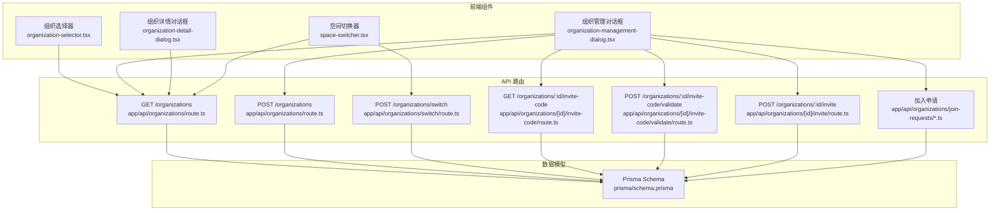
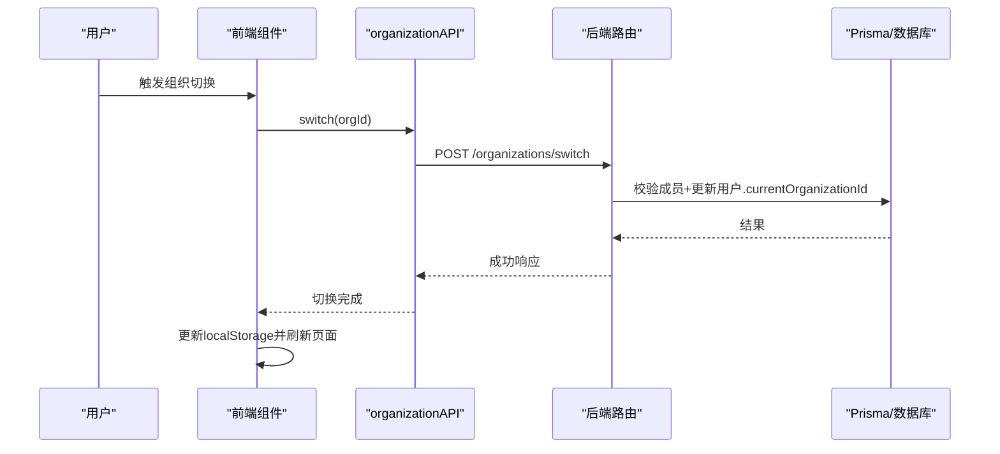
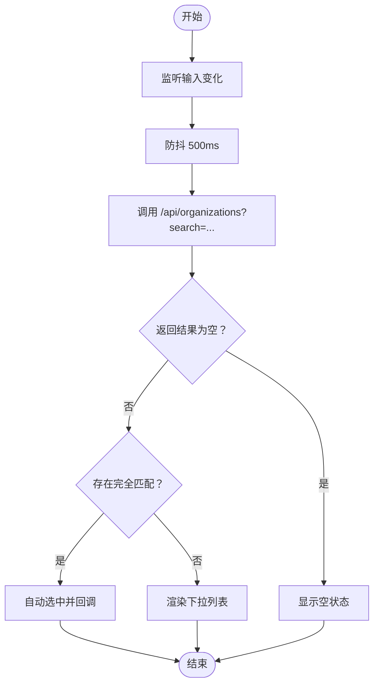
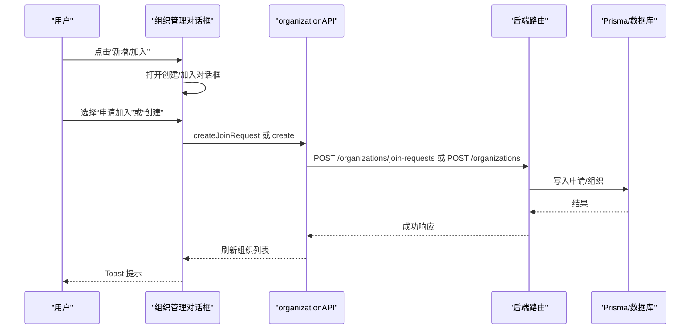
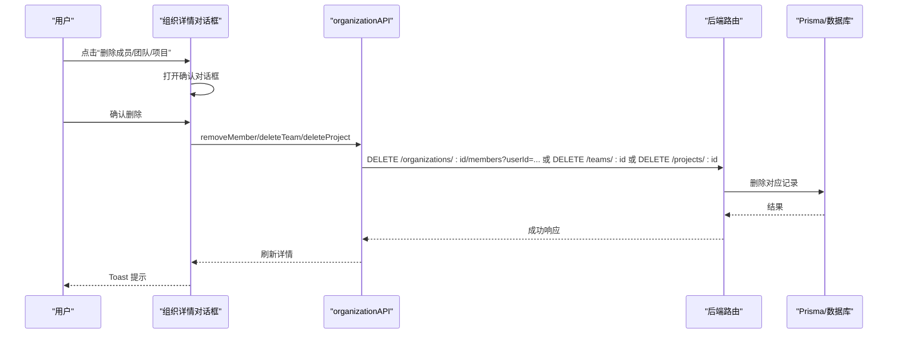
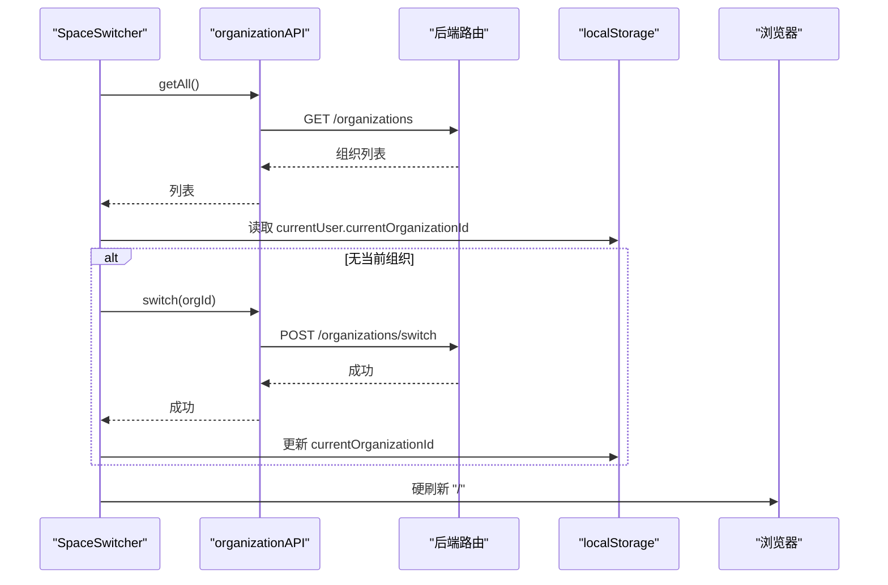
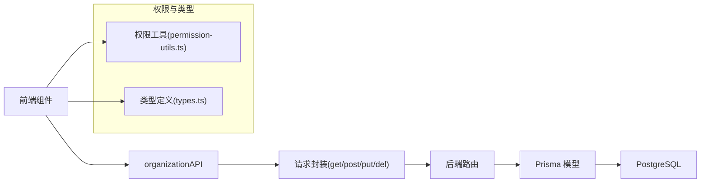
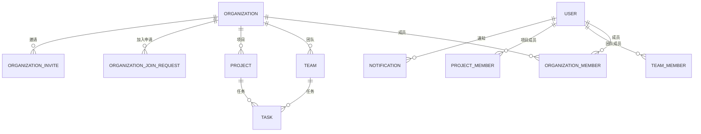

# 组织管理

<cite>
**本文引用的文件**
- [components/organization-selector.tsx](file://components/organization-selector.tsx)
- [components/organization-management-dialog.tsx](file://components/organization-management-dialog.tsx)
- [components/organization-detail-dialog.tsx](file://components/organization-detail-dialog.tsx)
- [components/space-switcher.tsx](file://components/space-switcher.tsx)
- [lib/api/organization.ts](file://lib/api/organization.ts)
- [app/api/organizations/route.ts](file://app/api/organizations/route.ts)
- [app/api/organizations/switch/route.ts](file://app/api/organizations/switch/route.ts)
- [app/api/organizations/[id]/invite-code/route.ts](file://app/api/organizations/[id]/invite-code/route.ts)
- [app/api/organizations/[id]/invite-code/validate/route.ts](file://app/api/organizations/[id]/invite-code/validate/route.ts)
- [app/api/organizations/[id]/invite/route.ts](file://app/api/organizations/[id]/invite/route.ts)
- [app/api/organizations/join-requests/route.ts](file://app/api/organizations/join-requests/route.ts)
- [app/api/organizations/join-requests/[id]/approve/route.ts](file://app/api/organizations/join-requests/[id]/approve/route.ts)
- [app/api/organizations/join-requests/[id]/reject/route.ts](file://app/api/organizations/join-requests/[id]/reject/route.ts)
- [prisma/schema.prisma](file://prisma/schema.prisma)
- [lib/utils/permission-utils.ts](file://lib/utils/permission-utils.ts)
- [lib/types.ts](file://lib/types.ts)
</cite>

## 目录
1. [简介](#简介)
2. [项目结构](#项目结构)
3. [核心组件](#核心组件)
4. [架构总览](#架构总览)
5. [组件详解](#组件详解)
6. [依赖关系分析](#依赖关系分析)
7. [性能考量](#性能考量)
8. [故障排查指南](#故障排查指南)
9. [结论](#结论)
10. [附录](#附录)

## 简介
本文件面向组织管理系统，围绕“组织选择器”“组织管理对话框”“组织详情对话框”展开，系统阐述多组织架构下的空间切换机制、组织权限继承规则、组织创建/编辑/删除流程，以及组织与团队、项目的实体关系与业务逻辑；同时覆盖组织邀请码系统、成员管理、角色分配、组织级权限控制与数据隔离、安全机制及空间切换器的实现。

## 项目结构
- 前端组件层：组织选择器、组织管理对话框、组织详情对话框、空间切换器等。
- API 层：组织 CRUD、邀请码、邀请、加入申请、空间切换等接口。
- 数据模型层：Prisma Schema 定义组织、成员、团队、项目、通知、邀请与加入申请等。
- 权限工具层：基于项目/团队协同权限的通用校验工具。

图表来源
- [components/organization-selector.tsx](file://components/organization-selector.tsx#L1-L210)
- [components/organization-management-dialog.tsx](file://components/organization-management-dialog.tsx#L1-L846)
- [components/organization-detail-dialog.tsx](file://components/organization-detail-dialog.tsx#L1-L510)
- [components/space-switcher.tsx](file://components/space-switcher.tsx#L1-L212)
- [app/api/organizations/route.ts](file://app/api/organizations/route.ts#L1-L204)
- [app/api/organizations/switch/route.ts](file://app/api/organizations/switch/route.ts#L1-L48)
- [app/api/organizations/[id]/invite-code/route.ts](file://app/api/organizations/[id]/invite-code/route.ts#L1-L54)
- [app/api/organizations/[id]/invite-code/validate/route.ts](file://app/api/organizations/[id]/invite-code/validate/route.ts#L1-L52)
- [app/api/organizations/[id]/invite/route.ts](file://app/api/organizations/[id]/invite/route.ts#L1-L122)
- [app/api/organizations/join-requests/route.ts](file://app/api/organizations/join-requests/route.ts#L1-L200)
- [prisma/schema.prisma](file://prisma/schema.prisma#L16-L314)

章节来源
- [components/organization-selector.tsx](file://components/organization-selector.tsx#L1-L210)
- [components/organization-management-dialog.tsx](file://components/organization-management-dialog.tsx#L1-L846)
- [components/organization-detail-dialog.tsx](file://components/organization-detail-dialog.tsx#L1-L510)
- [components/space-switcher.tsx](file://components/space-switcher.tsx#L1-L212)
- [app/api/organizations/route.ts](file://app/api/organizations/route.ts#L1-L204)
- [app/api/organizations/switch/route.ts](file://app/api/organizations/switch/route.ts#L1-L48)
- [prisma/schema.prisma](file://prisma/schema.prisma#L16-L314)

## 核心组件
- 组织选择器：支持搜索组织、防抖、自动匹配、新组织检测与提示。
- 组织管理对话框：组织列表、创建/编辑/删除、加入申请、邀请码复制、成员/团队/项目概览。
- 组织详情对话框：成员列表、团队/项目列表、删除确认、创建成员/团队/项目弹窗。
- 空间切换器：组织下拉切换、默认组织回退、本地存储同步、导航状态重置与全量刷新。

章节来源
- [components/organization-selector.tsx](file://components/organization-selector.tsx#L1-L210)
- [components/organization-management-dialog.tsx](file://components/organization-management-dialog.tsx#L1-L846)
- [components/organization-detail-dialog.tsx](file://components/organization-detail-dialog.tsx#L1-L510)
- [components/space-switcher.tsx](file://components/space-switcher.tsx#L1-L212)

## 架构总览
系统采用前后端分离的组件化架构：
- 前端组件通过 organizationAPI 封装调用后端接口。
- 后端路由基于 Next.js App Router，使用 Prisma 访问数据库。
- 数据模型定义组织、成员、团队、项目、通知、邀请与加入申请等实体及关系。
- 权限控制贯穿于 API 路由与前端组件，确保数据隔离与最小权限原则。

图表来源
- [lib/api/organization.ts](file://lib/api/organization.ts#L120-L125)
- [app/api/organizations/switch/route.ts](file://app/api/organizations/switch/route.ts#L6-L47)
- [components/space-switcher.tsx](file://components/space-switcher.tsx#L99-L154)

## 组件详解

### 组织选择器
- 功能要点
  - 输入框搜索组织，防抖 500ms，避免频繁请求。
  - 自动匹配完全一致的组织名称，若未选中则自动选中并回调。
  - 下拉列表展示组织名称与认证徽章，点击选中后触发父组件 onChange。
  - 新组织检测：当输入非空且未匹配到现有组织时，提示“未注册，可使用”。

图表来源
- [components/organization-selector.tsx](file://components/organization-selector.tsx#L37-L80)
- [app/api/organizations/route.ts](file://app/api/organizations/route.ts#L12-L36)

章节来源
- [components/organization-selector.tsx](file://components/organization-selector.tsx#L1-L210)
- [app/api/organizations/route.ts](file://app/api/organizations/route.ts#L12-L36)

### 组织管理对话框
- 功能要点
  - 组织列表：展示名称、认证、角色、成员/团队/项目数量、当前空间标识。
  - 创建组织：支持新建或“申请加入”已有组织；提交后刷新列表。
  - 编辑组织：修改名称、描述、加入是否需审批。
  - 删除组织：输入组织名称进行二次确认，仅所有者可删除。
  - 退出组织：成员可退出，退出后刷新页面。
  - 邀请码：为每个组织获取并复制邀请码，复制文案包含组织名与邀请码。
  - 详情入口：点击“查看”打开组织详情对话框。

图表来源
- [components/organization-management-dialog.tsx](file://components/organization-management-dialog.tsx#L121-L245)
- [app/api/organizations/join-requests/route.ts](file://app/api/organizations/join-requests/route.ts#L6-L112)
- [app/api/organizations/route.ts](file://app/api/organizations/route.ts#L91-L203)

章节来源
- [components/organization-management-dialog.tsx](file://components/organization-management-dialog.tsx#L1-L846)
- [app/api/organizations/join-requests/route.ts](file://app/api/organizations/join-requests/route.ts#L1-L200)
- [app/api/organizations/route.ts](file://app/api/organizations/route.ts#L91-L203)

### 组织详情对话框
- 功能要点
  - 成员列表：显示角色徽章、邀请人信息；所有者可删除成员。
  - 团队/项目列表：显示成员数量；所有者可删除团队/项目。
  - 创建入口：所有者可打开“添加成员/创建团队/创建项目”对话框。
  - 删除确认：统一的确认对话框，说明不可逆。

图表来源
- [components/organization-detail-dialog.tsx](file://components/organization-detail-dialog.tsx#L116-L191)
- [lib/api/organization.ts](file://lib/api/organization.ts#L139-L180)

章节来源
- [components/organization-detail-dialog.tsx](file://components/organization-detail-dialog.tsx#L1-L510)
- [lib/api/organization.ts](file://lib/api/organization.ts#L127-L180)

### 空间切换器
- 功能要点
  - 获取用户所属组织列表，从 localStorage 读取当前组织 ID。
  - 若无当前组织，自动选择第一个并调用后端切换接口。
  - 切换后更新 localStorage，并重置导航状态（My Days），随后硬刷新页面确保数据完全切换。

图表来源
- [components/space-switcher.tsx](file://components/space-switcher.tsx#L29-L97)
- [components/space-switcher.tsx](file://components/space-switcher.tsx#L99-L154)
- [app/api/organizations/switch/route.ts](file://app/api/organizations/switch/route.ts#L6-L47)

章节来源
- [components/space-switcher.tsx](file://components/space-switcher.tsx#L1-L212)
- [app/api/organizations/switch/route.ts](file://app/api/organizations/switch/route.ts#L1-L48)

## 依赖关系分析
- 前端组件依赖 organizationAPI 封装的 HTTP 请求。
- organizationAPI 依赖统一的请求封装（get/post/put/del）。
- 后端路由依赖 Prisma 访问数据库，遵循认证中间件。
- 数据模型定义组织、成员、团队、项目、通知、邀请与加入申请之间的关系。

图表来源
- [lib/api/organization.ts](file://lib/api/organization.ts#L6-L221)
- [lib/utils/permission-utils.ts](file://lib/utils/permission-utils.ts#L1-L72)
- [lib/types.ts](file://lib/types.ts#L1-L141)
- [prisma/schema.prisma](file://prisma/schema.prisma#L16-L314)

章节来源
- [lib/api/organization.ts](file://lib/api/organization.ts#L1-L221)
- [lib/utils/permission-utils.ts](file://lib/utils/permission-utils.ts#L1-L72)
- [lib/types.ts](file://lib/types.ts#L1-L141)
- [prisma/schema.prisma](file://prisma/schema.prisma#L16-L314)

## 性能考量
- 搜索防抖：组织选择器与管理对话框均采用防抖策略，降低请求频率。
- 并发加载：详情页使用 Promise.all 并发获取组织、成员、团队、项目，减少等待时间。
- 分页与限制：组织搜索限制返回条数，避免大数据集查询压力。
- 列表懒加载：详情页与管理页的列表区域支持滚动，提升交互体验。
- 切换刷新：空间切换采用硬刷新确保数据一致性，避免缓存污染。

## 故障排查指南
- 组织切换失败
  - 检查用户是否为该组织成员；确认后端 switch 接口返回的错误码与提示。
  - 确认 localStorage 中 currentOrganizationId 是否正确更新。
- 邀请码无效
  - 确认邀请码是否属于目标组织；验证接口返回 inviterName。
  - 检查组织成员 inviteCode 字段是否生成。
- 加入申请异常
  - 检查申请状态是否为 PENDING；确认处理权限（所有者/管理员）。
  - 审批通过后会生成邀请码并创建个人项目，确认通知是否发送。
- 删除确认
  - 删除成员/团队/项目前务必确认不可逆；建议先备份或导出数据。

章节来源
- [app/api/organizations/switch/route.ts](file://app/api/organizations/switch/route.ts#L15-L31)
- [app/api/organizations/[id]/invite-code/validate/route.ts](file://app/api/organizations/[id]/invite-code/validate/route.ts#L19-L46)
- [app/api/organizations/join-requests/[id]/approve/route.ts](file://app/api/organizations/join-requests/[id]/approve/route.ts#L40-L52)
- [components/organization-detail-dialog.tsx](file://components/organization-detail-dialog.tsx#L193-L209)

## 结论
本系统通过清晰的前端组件与后端 API 设计，实现了多组织架构下的空间切换、组织管理、成员与团队/项目治理、邀请码与加入申请流程，以及基于角色的权限控制与数据隔离。配合并发加载、防抖优化与硬刷新保障，整体具备良好的可用性与可靠性。

## 附录

### 数据模型与关系
- 组织（Organization）：名称唯一、可认证、可配置加入是否需审批；包含创建者、成员、团队、项目、加入申请、邀请等。
- 组织成员（OrganizationMember）：用户与组织的多对多关系，带角色（所有者/管理员/成员）、邀请码、邀请人。
- 团队（Team）：归属组织，含任务权限策略。
- 项目（Project）：归属组织，含任务权限策略。
- 通知（Notification）：组织加入申请、邀请等事件通知。
- 加入申请（OrganizationJoinRequest）：申请人、组织、状态、处理人等。
- 邀请（OrganizationInvite）：邀请人、被邀请人、状态等。

图表来源
- [prisma/schema.prisma](file://prisma/schema.prisma#L16-L314)

章节来源
- [prisma/schema.prisma](file://prisma/schema.prisma#L16-L314)

### 权限与继承规则
- 角色层级：所有者 > 管理员 > 成员；所有者可删除组织、删除成员/团队/项目；管理员可编辑组织信息；成员可退出组织。
- 项目/团队任务权限：根据项目/团队的 taskPermission 决定“所有成员可管理”或“仅创建者可管理”，超级管理员拥有最高权限。
- 数据隔离：API 路由均通过认证中间件与成员关系校验，确保用户只能访问其所属组织的数据。

章节来源
- [lib/utils/permission-utils.ts](file://lib/utils/permission-utils.ts#L11-L30)
- [lib/utils/permission-utils.ts](file://lib/utils/permission-utils.ts#L40-L59)
- [lib/types.ts](file://lib/types.ts#L3-L5)
- [app/api/organizations/[id]/invite/route.ts](file://app/api/organizations/[id]/invite/route.ts#L43-L46)

### 组织邀请码系统
- 生成：创建组织或审批通过后为成员生成唯一邀请码。
- 查询：成员可在前端查询自己的邀请码。
- 验证：通过邀请码验证可获知邀请人信息。
- 复制：管理对话框支持一键复制包含组织名与邀请码的提示文案。

章节来源
- [app/api/organizations/route.ts](file://app/api/organizations/route.ts#L119-L146)
- [app/api/organizations/join-requests/[id]/approve/route.ts](file://app/api/organizations/join-requests/[id]/approve/route.ts#L66-L96)
- [app/api/organizations/[id]/invite-code/route.ts](file://app/api/organizations/[id]/invite-code/route.ts#L25-L44)
- [app/api/organizations/[id]/invite-code/validate/route.ts](file://app/api/organizations/[id]/invite-code/validate/route.ts#L23-L46)
- [components/organization-management-dialog.tsx](file://components/organization-management-dialog.tsx#L367-L402)

### 组织创建/编辑/删除流程
- 创建：校验名称唯一性，创建组织并写入成员关系、邀请码；必要时创建个人项目；若用户无当前组织则自动设置。
- 编辑：更新名称、描述、加入是否需审批；刷新页面以同步所有组件。
- 删除：仅所有者可删除，需二次确认名称；删除后刷新列表。

章节来源
- [app/api/organizations/route.ts](file://app/api/organizations/route.ts#L91-L203)
- [components/organization-management-dialog.tsx](file://components/organization-management-dialog.tsx#L247-L287)
- [components/organization-management-dialog.tsx](file://components/organization-management-dialog.tsx#L289-L326)

### 组织与团队、项目的关系
- 组织包含多个团队与项目；团队/项目均包含成员关系与任务权限策略。
- 个人事务项目特殊处理：过滤显示，仅创建者可管理。

章节来源
- [components/organization-detail-dialog.tsx](file://components/organization-detail-dialog.tsx#L374-L435)
- [prisma/schema.prisma](file://prisma/schema.prisma#L98-L136)